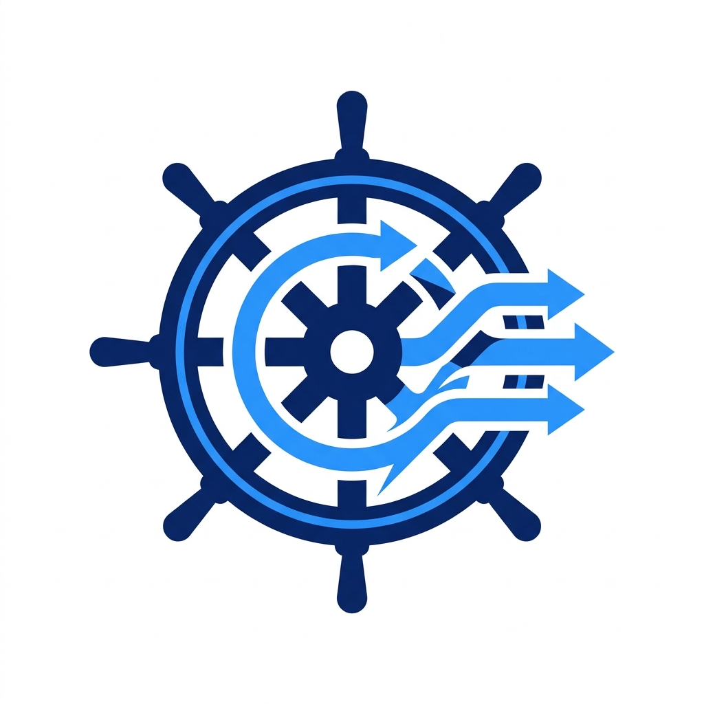
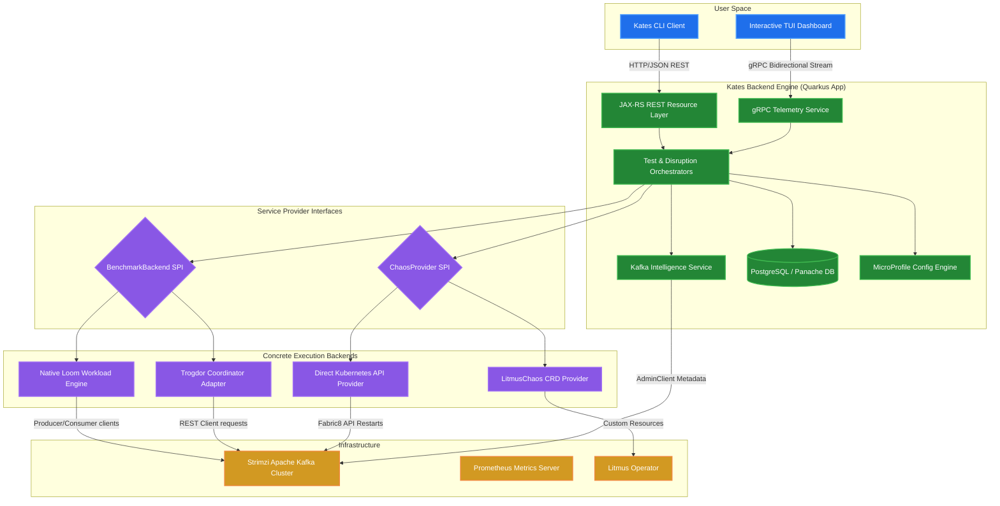
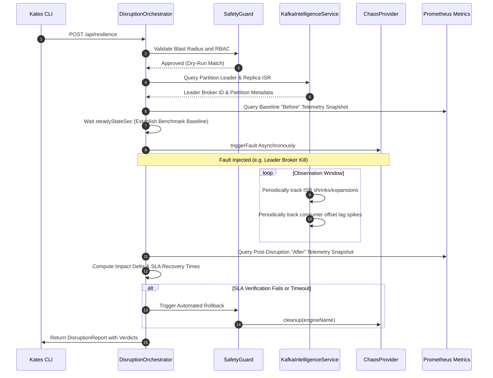

<div align="center">
  

  <h1>Kates</h1>

  <p><strong>Kafka Advanced Testing & Engineering Suite</strong></p>

  <p>
    A Kubernetes-native platform for performance testing, chaos engineering,<br/>
    and operational resilience auditing of Apache Kafka clusters.
  </p>

  <p>
    <a href="https://github.com/bmscomp/kates/actions/workflows/ci.yml"></a>
    <a href="LICENSE"></a>
    <a href="https://github.com/bmscomp/kates/releases/tag/v1.17.0"></a>
    
    
    
    
  </p>
</div>

---

> **[Read the Kates Definitive Guide](docs/book/README.md)** — 21 chapters covering performance theory, chaos engineering, security, deployment, and operations.

## Feature Highlights

Kates consolidates six core competencies into a single, cohesive platform. The following table summarizes these capabilities and their scope within the system.

| Capability | Scope | Description |
|:--|:--|:--|
| **Performance Testing** | 8 test types | Supports Load, Stress, Spike, Endurance, Volume, Capacity, Round-Trip, and Integrity workloads, each configurable through MicroProfile Config with hierarchical defaults. |
| **Chaos Engineering** | 10 disruption types | Provides fault injection with safety guardrails and automatic rollback, enabling controlled experiments against broker failures, network partitions, and resource exhaustion. |
| **Observability** | End-to-end telemetry | Integrates Prometheus, Grafana, and Jaeger with 10 pre-built dashboards and 20 alert rules, providing metrics, logs, and distributed traces across the entire test lifecycle. |
| **Deployment** | One-command provisioning | The `kates deploy -i` interactive wizard provisions the complete stack—including Kafka, monitoring, and chaos infrastructure—in a single operation. |
| **Security Auditing** | Multi-layer analysis | Performs TLS inspection, NetworkPolicy analysis, Kyverno compliance checks, and active penetration testing to validate the security posture of the target cluster. |
| **CI/CD Integration** | Pipeline-native | Exports results as JUnit XML, generates status badges, enforces quality gates with letter-grade thresholds, and delivers webhook notifications for automated pipelines. |

---

## The Vision: Why Kates?

In modern cloud-native architectures, Apache Kafka lies at the critical path of data flow. Ensuring its reliability, low latency, security, and schema enforcement requires continuous, active testing. **Kates** was created to democratize advanced chaos testing and performance tuning for Kafka topologies. 

Unlike traditional passive monitoring systems, Kates offers an **active engineering environment**: it provisions a local Multi-AZ Kind cluster, deploys production-grade operators, and enables you to actively simulate broker crashes, network partitions, and heavy spikes while measuring real-time latency and SLA violations via a sleek, interactive command-line dashboard.

---

## Key Architectural Features & Capabilities

### 1. Unified Namespace Topologies
Kates supports two highly configurable deployment topologies:
* **Single Namespace Mode (Development)**: Consolidates the entire stack into a single, isolated namespace (`kates-stack` or custom). Perfect for lightweight local hacking and rapid prototyping.
* **Isolated Namespace Mode (Production-Parity)**: Simulates a production environment by separating logical layers into dedicated namespaces (`kafka`, `kates`, `monitoring`, `litmus`).

### 2. Multi-Zone Cluster Simulation (Multi-AZ)
Simulate real-world geographic failures locally on a 3-node Kind Kubernetes cluster, with nodes labeled across three distinct virtual availability zones: `alpha`, `sigma`, and `gamma`. StorageClasses are bootstrapped dynamically with zone affinity, allowing you to test replica distribution, broker rack-awareness, and partition rebalancing under actual zone outages.

### 3. Automated Resilience & Safety Guardrails
Kates includes **active finalizer stripping and CR purging guardrails** built directly into its cleanup command, ensuring your local development cluster remains completely clean and free of namespace teardown locks without manual troubleshooting.

### 4. Continuous Chaos Engineering
Leverage **6 pre-configured, production-parity chaos playbooks** driven by LitmusChaos. Run real-time performance-chaos correlation tests where you inject disruptions (e.g., broker pod kills, network latency spikes, disk fill-ups) while active performance workloads are running. Kates evaluates the throughput and latency degradation, outputting a precise SLA grade (A-F) based on customizable service level thresholds.

### 5. OpenTelemetry & High-Observability
The suite comes fully integrated with **OpenTelemetry (OTLP)**. Auto-instrumented JAX-RS REST endpoints, Kafka clients, and database transactions flow into **Jaeger Tracing** and **Prometheus**. Kates auto-provisions over **10 custom Grafana dashboards** and 20+ proactive alerting rules out-of-the-box.

---

## Platform Architecture

### Architectural Component Diagram



### Backend Internals

The core backend (`/kates`) is a reactive, containerized Java microservice built on **Quarkus 3.32.1** and optimized for **Java 25**:

* **Virtual Threads (Project Loom)**: Workload engines spawn hundreds of independent producer/consumer loops on lightweight virtual threads for massive throughput simulation.
* **Reactive REST & gRPC Dual Stack**: CRUD via JAX-RS, real-time telemetry via gRPC bidirectional streams.
* **Three-Tier Configuration**: MicroProfile Config with request-level overrides → environment variables → built-in defaults.
* **Persistent Telemetry**: PostgreSQL via Hibernate ORM (Panache) with Flyway migrations.

### Extensible SPIs

* **BenchmarkBackend SPI** — Swap workload engines: `NativeKafkaBackend` (in-process virtual threads) or `TrogdorBackend` (external coordinator).
* **ChaosProvider SPI** — Swap fault injection: `LitmusChaosProvider`, `KubernetesChaosProvider`, or `HybridChaosProvider`.

### Intelligent Disruption Pipeline



---

## Quick Start

### Express (30 seconds)

```bash
brew install bmscomp/tap/kates       # Install the CLI
kates deploy -i                       # Interactive wizard — deploys everything
kates health                          # Verify the stack is healthy
kates test create --type LOAD         # Run your first load test
```

### Full Pipeline (`make all`)

Bring up the entire production-grade stack with one command:

```bash
make all
```

The `make all` target executes a deterministic, ten-step provisioning pipeline. Each step is idempotent and will skip work that has already been completed, making it safe to re-run after partial failures. The pipeline stages are ordered to satisfy infrastructure dependencies—monitoring must be operational before Kafka is deployed, so that broker metrics are captured from the first heartbeat.

| Step | Action | Purpose |
|:----:|:-------|:--------|
| 1 | Create Kind cluster `panda` and local Docker registry | Provisions the Kubernetes control plane and a local OCI registry at `localhost:5001` to avoid external image pulls during development. |
| 2 | Pull all images to local registry | Downloads container images defined in `images.env` into the local registry, ensuring reproducible builds independent of upstream availability. |
| 3 | Load images from registry into Kind nodes | Transfers images from the local registry into the Kind node containerd cache, eliminating pull latency during pod scheduling. |
| 4 | Deploy Prometheus and Grafana | Installs the monitoring stack with pre-configured scrape targets and auto-provisioned Grafana dashboards for Kafka and JVM metrics. |
| 5 | Wait for monitoring readiness | Blocks until all monitoring pods report `Ready`, ensuring metrics collection is active before downstream services start. |
| 6 | Deploy Strimzi Kafka (KRaft mode) | Installs the Strimzi operator and applies the Kafka custom resource with KRaft consensus, rack-aware broker pools, and zone-affinity storage. |
| 7 | Wait for Kafka readiness | Blocks until all Kafka broker pods are `Ready` and the controller quorum is established, verifying cluster health before test workloads begin. |
| 8 | Deploy Kafka UI | Installs a web-based Kafka management interface for topic inspection, consumer group monitoring, and message browsing. |
| 9 | Deploy Apicurio Registry | Installs the Apicurio Schema Registry with KafkaSQL storage, enabling schema governance for Avro, Protobuf, and JSON Schema workloads. |
| 10 | Deploy LitmusChaos | Installs the LitmusChaos operator and applies Kafka-specific RBAC, enabling fault injection experiments against the deployed cluster. |

### Access Points

Once the stack is provisioned, the following services are available via NodePort or port-forwarding. The table below lists each service endpoint, its corresponding URL, and any default credentials required for authentication.

| Service | URL | Credentials | Notes |
|:--------|:----|:------------|:------|
| Grafana | http://localhost:30080 | admin / admin | Pre-loaded with 10 Kafka dashboards and 20 alert rules. |
| Kafka UI | http://localhost:30081 | — | Read-only by default; write access requires `KAFKA_UI_AUTH` configuration. |
| Apicurio Registry | http://localhost:30082 | — | Schema compatibility rules are enforced per-subject. |
| Kates API | http://localhost:30083 | — | Protected by API key in production; disabled in dev/test profiles. |
| Jaeger UI | http://localhost:30086 | — | Displays distributed traces for REST, Kafka, and JDBC operations. |
| Prometheus | http://localhost:30090 | — | Exposes `/api/v1/query` for ad-hoc PromQL queries. |
| Litmus UI | `make chaos-ui` then http://localhost:9091 | admin / litmus | Requires an explicit port-forward; not exposed by default. |

### Teardown
```bash
make destroy          # Using make
kates clean --force   # Using the CLI
```

---

## Helm Charts

Kates ships 9 Helm charts for modular deployment. Each chart is independently versionable and can be installed in isolation or composed via the `klster-platform` umbrella chart. The table below enumerates each chart, its current version, the upstream application version it wraps, and its role within the platform.

| Chart | Version | App Version | Description |
|:------|:--------|:------------|:------------|
| [`kates`](charts/kates/) | 0.4.1 | 1.17.0 | The Kates backend (Quarkus REST/gRPC) and frontend, deployed as a single Kubernetes Deployment with ConfigMap-driven configuration. |
| [`kafka-cluster`](charts/kafka-cluster/) | 0.1.1 | 4.2.0 | A Strimzi-managed KRaft Kafka cluster with zone-aware broker pools, SCRAM-SHA-512 authentication, and rack-affinity storage classes. |
| [`kates-chaos`](charts/kates-chaos/) | 1.2.0 | 1.17.0 | A LitmusChaos wrapper that installs Kafka-specific RBAC, ChaosServiceAccounts, and pre-built experiment templates for broker and network faults. |
| [`kates-monitoring`](charts/monitoring/) | 1.0.0 | 82.4.3 | The Prometheus and Grafana monitoring stack, pre-configured with scrape jobs, recording rules, and auto-provisioned dashboards for Kafka, JVM, and Strimzi metrics. |
| [`apicurio-registry`](charts/apicurio-registry/) | 0.1.5 | 2.2.5.Final | Apicurio Schema Registry deployed with KafkaSQL persistence, providing schema validation and compatibility enforcement for Avro, Protobuf, and JSON Schema. |
| [`klster-platform`](charts/klster-platform/) | 0.1.0 | 1.0.0 | An umbrella chart that composes all sub-charts into a single `helm install` operation for full-platform provisioning. |
| [`headlamp`](charts/headlamp/) | 0.1.0 | 0.40.1 | A lightweight Kubernetes dashboard for visual cluster inspection and resource management. |
| [`velero`](charts/velero/) | 11.3.2 | 1.17.1 | Velero backup and disaster recovery, configured for scheduled snapshots of persistent volumes and Kubernetes resources. |
| [`minio`](charts/minio/) | 17.0.21 | 2025.7.23 | MinIO object storage, used as the S3-compatible backend for Velero backups and optional Kafka tiered storage. |

---

## Building from Source

### Prerequisites

* **Go 1.24+** (CLI)
* **Java SDK 25** (backend)
* **Maven 3.9+** (or use `./mvnw`)
* **Docker / OrbStack** (container images)
* **GraalVM** (optional, native binaries)

### CLI

```bash
cd cli
go build -ldflags="-s -w" -o kates .
mv kates /usr/local/bin/
```

### Backend

```bash
cd kates
./mvnw quarkus:dev                           # Dev mode with hot-reload
./mvnw package -DskipTests                   # JVM package
./mvnw package -Dnative -DskipTests          # Native binary (GraalVM)
```

### Container Images

```bash
docker build -f kates/Dockerfile -t kates:latest .             # JVM image
docker build -f kates/Dockerfile.native -t kates:latest kates/ # Native image
```

---

## Kates CLI

**Kates** is a full-featured terminal client for performance testing, chaos engineering, and cluster administration.

### Installation

#### macOS (Homebrew)
```bash
brew tap bmscomp/tap
brew install kates
```

#### Pre-Compiled Binaries
Download the official **`v1.17.0`** binaries from the [GitHub Releases](https://github.com/bmscomp/kates/releases/tag/v1.17.0) page. Available for macOS and Linux (amd64 and arm64).

#### From Source
```bash
cd cli && go build -ldflags="-s -w" -o kates . && mv kates /usr/local/bin/
```

### Context Management
```bash
kates ctx set local --url http://localhost:30083   # Create a context
kates ctx use local                                 # Switch context
kates ctx show                                      # List all contexts
kates ctx current                                   # Print active context
```

---

## CLI Command Reference

The Kates CLI is organized into twelve functional domains. Each domain groups related subcommands that operate on a specific concern—from cluster lifecycle management to security compliance auditing. The sections below provide a complete reference for every available command.

### 1. Setup and Lifecycle

These commands manage the end-to-end lifecycle of a Kates deployment, from initial provisioning through upgrade and teardown.

| Command | Description |
|:--------|:------------|
| `kates deploy -i` | Launches the interactive deployment wizard, which prompts for topology mode, component selection, and namespace configuration before provisioning the stack. |
| `kates deploy --topology isolated --with-monitoring` | Non-interactive deployment with explicit flags, suitable for scripted environments and CI/CD pipelines. |
| `kates clean` | Tears down the entire stack with an interactive confirmation prompt to prevent accidental destruction. |
| `kates clean --force` | Tears down the stack without confirmation, designed for automated CI/CD pipeline teardown stages. |
| `kates upgrade` | Upgrades the deployed Kates stack to the latest chart version while preserving existing configuration and data. |
| `kates init` | Initializes a new Kates workspace directory with default configuration files and example scenario definitions. |
| `kates auto` | Auto-detects the current Kubernetes cluster and deploys Kafka with sensible defaults based on cluster capabilities. |
| `kates ports` | Establishes port-forwarding for all core Kates services (API, Kafka UI, Grafana) to localhost. |
| `kates ports --all` | Extends port-forwarding to include monitoring, tracing, and schema registry endpoints. |

### 2. Cluster Intelligence

Cluster intelligence commands query the Kafka cluster and Kubernetes infrastructure to produce detailed reports on topology, health, configuration drift, and operational state.

| Command | Description |
|:--------|:------------|
| `kates detect` | Generates a deep cluster compatibility report covering availability zones, storage classes, network policies, and installed operators. |
| `kates detect --export report.pdf` | Exports the compatibility report in PDF, HTML, Markdown, or JSON format for offline review and archival. |
| `kates cluster info` | Displays cluster metadata including broker endpoints, controller quorum status, and rack/AZ assignments. |
| `kates cluster topics` | Lists all Kafka topics with partition counts, replication factors, and ISR health indicators. |
| `kates cluster topics describe <t>` | Provides detailed metadata for a specific topic, including per-partition leader assignments and replica state. |
| `kates cluster broker configs <id>` | Reports non-default broker configuration entries, grouped by configuration source (static, dynamic, default). |
| `kates cluster check` | Runs a comprehensive health check covering broker connectivity, controller availability, and under-replicated partitions. |
| `kates cluster groups` | Lists all consumer groups with their current state, member count, and assigned topic partitions. |
| `kates cluster diff` | Computes the difference between two cluster state snapshots to identify configuration drift or topology changes. |
| `kates cluster watch` | Streams cluster events in real-time, displaying broker joins/leaves, partition reassignments, and ISR changes as they occur. |
| `kates cluster alerts` | Lists all active Prometheus alert rules and their current firing status. |
| `kates snapshot create` | Captures a point-in-time snapshot of the cluster state, including topic configurations, consumer group offsets, and broker metadata. |
| `kates snapshot list` | Lists all previously captured snapshots with timestamps and summary statistics. |
| `kates snapshot diff <s1> <s2>` | Compares two snapshots and reports additions, deletions, and modifications across all tracked resources. |

### 3. Health and Status

```bash
kates health            # System health, Kafka connectivity, and engine status
kates status            # One-line system status
kates version           # CLI, API, and runtime version info
kates doctor            # Environment diagnostics
```

### 4. Interactive Kafka Client

```bash
kates kafka brokers                                    # Broker list with rack/AZ and roles
kates kafka topics                                     # List topics with ISR health
kates kafka topic <name>                               # Describe topic partitions and config
kates kafka create-topic <name> --partitions 3 --rf 3  # Create a topic
kates kafka alter-topic <name> --config retention.ms=172800000  # Alter topic config
kates kafka delete-topic <name> --yes                  # Delete a topic
kates kafka groups                                     # List consumer groups
kates kafka group <id>                                 # Consumer group lag detail
kates kafka consume <topic> --offset earliest          # Fetch records from a topic
kates kafka consume <topic> -f                         # Tail a topic (like tail -f)
kates kafka produce <topic> --key k --value v          # Produce a record
kates kafka tui                                        # Launch interactive full-screen explorer
```

### 5. Test Execution and Scenario Files

```bash
kates test create --type LOAD --records 100000    # Start a load test
kates test create --type STRESS --producers 8     # Multi-producer stress test
kates test list                                    # List all test runs
kates test list --type LOAD --status DONE          # Filter by type and status
kates test show <id>                               # Inspect a specific run
kates test delete <id>                             # Delete a test run
kates apply -f scenario.yaml --wait                # Apply a YAML test definition
kates scaffold list                                # Browse built-in scenario templates
kates scaffold export <name>                       # Export a template to a local file
```

Kates supports seven distinct test types, each designed to evaluate a specific aspect of Kafka cluster behavior under controlled conditions. The following table describes each test type, its intended use case, and the primary metrics it targets.

| Test Type | Use Case | Primary Metrics |
|:----------|:---------|:----------------|
| `LOAD` | Measures steady-state throughput and latency under a sustained, uniform workload representative of normal production traffic. | Throughput (records/sec, MB/sec), P50/P95/P99 latency. |
| `STRESS` | Evaluates cluster behavior under high concurrency with multiple parallel producers, identifying contention points and degradation thresholds. | Max throughput, error rate, producer queue time. |
| `SPIKE` | Simulates sudden burst traffic patterns to assess the cluster's ability to absorb transient load surges without message loss or excessive latency. | Burst absorption rate, tail latency (P99.9), backpressure metrics. |
| `ENDURANCE` | Validates stability over extended durations (hours) with rate-limited traffic, detecting memory leaks, log segment accumulation, and GC pauses. | Throughput stability, JVM heap trends, GC pause frequency. |
| `VOLUME` | Tests high-throughput ingestion with large record sizes to stress network I/O, disk write bandwidth, and batch compression efficiency. | Disk write throughput, network utilization, compression ratio. |
| `CAPACITY` | Determines maximum cluster capacity under full parallelism, pushing all brokers to saturation to identify the hardware ceiling. | Peak throughput, broker CPU/memory saturation, partition leader balance. |
| `ROUND_TRIP` | Measures end-to-end latency from producer send to consumer receive, quantifying the complete data path including replication and ISR acknowledgment. | End-to-end latency (P50/P95/P99), replication lag. |

### 6. Analysis and Optimization

These commands provide post-hoc analysis of completed test runs, automated performance tuning recommendations, and regression detection against established baselines.

| Command | Description |
|:--------|:------------|
| `kates benchmark` | Runs a full test battery (LOAD, STRESS, SPIKE) and produces a letter-grade scorecard (A through F) based on configurable SLA thresholds. |
| `kates gate -f scenario.yaml --min-grade B` | CI quality gate that exits with a non-zero status code if the achieved grade falls below the specified threshold, blocking pipeline progression. |
| `kates flow run -f pipeline.yaml` | Executes a declarative, multi-step pipeline defined in YAML, orchestrating sequential and parallel test phases with conditional branching. |
| `kates advisor <id>` | Analyzes the results of a completed test run and generates actionable configuration recommendations (e.g., batch size, linger.ms, compression). |
| `kates explain <id>` | Produces a plain-English summary and verdict for a test run, suitable for non-technical stakeholders and status reports. |
| `kates profile save <name> <id>` | Persists a named performance profile from a test run for future comparison and regression analysis. |
| `kates profile compare <a> <b>` | Generates a side-by-side comparison of two performance profiles, highlighting statistical differences in key metrics. |
| `kates profile assert <name> --max-p99 50ms` | Asserts that a saved profile meets specified performance thresholds, returning a non-zero exit code on violation. |
| `kates baseline set <id>` | Designates a specific test run as the regression baseline for subsequent comparisons. |
| `kates baseline regression <id>` | Compares a test run against the established baseline and flags statistically significant regressions in throughput or latency. |
| `kates cost estimate -f scenario.yaml` | Estimates cloud infrastructure costs for a given test configuration based on resource utilization models for AWS, GCP, and Azure. |
| `kates tune run` | Initiates an automated tuning cycle that iteratively adjusts producer and broker configurations to optimize throughput within latency constraints. |
| `kates replay <id>` | Re-executes a previous test with identical parameters, enabling controlled before/after comparisons following configuration changes. |
| `kates diff <id1> <id2>` | Generates a side-by-side diff of two test runs, comparing throughput, latency distributions, error rates, and resource utilization. |
| `kates lab` | Launches an interactive performance tuning laboratory with real-time feedback on configuration changes. |

### 7. Reports and Trends

```bash
kates report show <id>              # Full report with SLA verdict
kates report summary <id>           # Condensed metrics summary
kates report export csv <id>        # Export results as CSV
kates report export junit <id>      # Export as JUnit XML (CI integration)
kates report diff <id1> <id2>       # Side-by-side comparison of two runs
kates trend --type LOAD --metric p99LatencyMs --days 30     # P99 trend over 30 days
kates trend --type STRESS --metric throughput --days 7       # Throughput sparkline
```

### 8. Chaos and Disruption

```bash
kates resilience --experiment pod-kill --duration 60s   # Chaos-performance correlation
kates disruption run --type broker-kill                  # Run a specific disruption
kates disruption list                                    # List disruption history
kates disruption status <id>                             # Check disruption status
kates disruption timeline <id>                           # View disruption timeline
kates disruption types                                   # List available disruption types
kates chaos list                                         # Chaos experiment history
kates chaos show <id>                                    # Detailed chaos report
```

### 9. Security and Compliance

```bash
kates security audit                                # Full posture scan with A-F grade
kates security audit --export report.pdf            # Export as PDF/HTML/MD/JSON
kates security netpol                               # Audit NetworkPolicies
kates security tls-inspect                          # TLS and certificate inspection
kates security pentest --test all                   # Active penetration tests
kates security compliance                           # CIS benchmark compliance
kates kyverno status                                # Kyverno policy engine status
kates kyverno violations                            # List policy violations
kates kyverno enforce <policy>                      # Enforce a policy
kates kyverno audit                                 # Audit policies
```

### 10. Schedules and Automation

```bash
kates schedule list                                               # List all schedules
kates schedule show <id>                                          # Inspect a schedule
kates schedule create --name nightly --cron "0 2 * * *" -f s.yaml # Create recurring test
kates schedule delete <id>                                        # Remove a schedule
kates webhook list                                                # List webhook endpoints
kates webhook add --url https://... --event test.completed        # Add a webhook
```

### 11. Observability

```bash
kates dashboard      # Full-screen monitoring dashboard
kates top            # Live view of running tests (like kubectl top)
kates watch <id>     # Real-time streaming of a running test
kates audit          # View audit log of cluster mutations
kates changelog      # Generate changelog from audit events
```

### 12. Developer Tools

```bash
kates badge --type build --output badge.svg    # Generate README status badges
kates theme list                                # List available terminal themes
kates theme preview <name>                      # Preview a theme
kates tldr                                      # Quick command summary
kates doc <command>                             # Man-style documentation
kates plugin list                               # List installed CLI plugins
```

---

## Image Management

All images are defined in `images.env` — the single source of truth.

```bash
./scripts/pull-images.sh               # Pull all images (skips cached)
./scripts/load-images-to-kind.sh       # Load into Kind (skips loaded)
make registry-status                   # Check registry contents
```

Behind a corporate proxy, define `HTTP_PROXY`, `HTTPS_PROXY`, and `NO_PROXY`
either in your shell or in `proxy/proxy.conf` before running
`./scripts/load-images-to-kind.sh`. The script now forwards these variables into
Kind node `ctr pull` commands.

If you do not use the load script, run `make cluster` (or
`./scripts/start-cluster.sh`) after setting proxy variables. Cluster startup now
reconciles containerd proxy settings on all Kind nodes so normal pod image pulls
work through the proxy as well.

You can also pass proxy params directly:

```bash
./scripts/start-cluster.sh \
  --http-proxy http://proxy.example.com:8080 \
  --https-proxy http://proxy.example.com:8080 \
  --no-proxy "localhost,127.0.0.1,.svc,.cluster.local"
```

Note: loopback proxies from environment/proxy.conf (for example
`http://127.0.0.1:9000`) are ignored by default because Kind nodes cannot reach
their own loopback as your host proxy. If you pass a loopback URL explicitly
via `--http-proxy/--https-proxy`, it is rewritten to `host.docker.internal`.

---

## Makefile Targets

The Makefile provides a comprehensive set of targets for managing the Kates platform lifecycle. Each target is idempotent and can be invoked independently or composed via dependency chains. The following table documents all available targets and their behavior.

| Target | Description |
|:-------|:------------|
| `make all` | Executes the full provisioning pipeline: cluster creation, image loading, and deployment of all services in dependency order. |
| `make cluster` | Creates the Kind Kubernetes cluster with multi-zone node labels and the local Docker registry, without deploying any services. |
| `make images` | Pulls all container images defined in `images.env` and loads them into the Kind node cache. |
| `make monitoring` | Deploys the Prometheus and Grafana monitoring stack with auto-provisioned dashboards and alert rules. |
| `make kafka` | Deploys the Strimzi operator and applies the Kafka cluster custom resource in KRaft mode with rack-aware broker pools. |
| `make ui` | Deploys the Kafka UI web interface for topic and consumer group management. |
| `make apicurio` | Deploys the Apicurio Schema Registry with KafkaSQL persistence and schema compatibility enforcement. |
| `make litmus` | Deploys the LitmusChaos operator with Kafka-specific RBAC and pre-built experiment templates. |
| `make chaos-ui` | Establishes a port-forward to the LitmusChaos web interface on `localhost:9091`. |
| `make chaos-experiments` | Applies all pre-configured chaos experiment custom resources to the cluster. |
| `make velero` | Deploys Velero backup with MinIO as the S3-compatible storage backend. |
| `make test` | Runs a standard Kafka performance test producing 1 million messages to validate cluster throughput. |
| `make gameday` | Executes an automated GameDay validation pipeline combining performance tests with chaos experiments. |
| `make chart-lint` | Runs Helm lint validation against all Kates Helm charts to detect template errors. |
| `make ports` | Starts port-forwarding for all core services to localhost. |
| `make status` | Displays the current status of the Kind cluster, deployed services, and pod health. |
| `make destroy` | Destroys the Kind cluster and removes all associated resources, including the local Docker registry. |

---

## Monitoring and Observability

Custom Grafana dashboards are auto-provisioned upon setup:
- **Kafka Complete Monitoring** — all metrics, brokers, topics, zones, and JVM.
- **Kafka Cluster Health** — broker status, offline partitions, and zone distribution.
- **Kafka Performance Metrics** — topic growth, partitions, and broker count.
- **Kafka Performance Test Results** — perf-test throughput and message counts.
- **Kafka JVM Metrics** — heap memory, GC rate, and thread count per zone.
- **Strimzi Operator and Kafka Connect** — reconciliation p99, success/failure rates, and Connect task health.

### Distributed Tracing
OpenTelemetry traces are exported via OTLP to Jaeger. Auto-instrumented spans cover:
- REST API calls (JAX-RS)
- Kafka producer/consumer operations
- Database queries (JDBC)

Access the Jaeger UI at http://localhost:30086 after deployment.

---

## Documentation

The following resources provide comprehensive documentation for all aspects of the Kates platform, from theoretical foundations to operational procedures.

| Resource | Description |
|:---------|:------------|
| [The Definitive Guide](docs/book/README.md) | A complete 20-chapter book with 3 appendices covering performance testing theory, CLI usage, REST API integration, deployment topologies, security hardening, and operational procedures. |
| [Tutorials](docs/tutorials/README.md) | Seven progressive, step-by-step tutorials that guide practitioners from running a first load test through building fully automated CI/CD quality gates. |
| [REST API Reference](kates/docs/api-reference.md) | Complete API specification including JSON request/response schemas, gRPC service definitions, and REST resource documentation. |
| [Disruption Catalog](kates/docs/disruption-guide.md) | Reference documentation for all 10 supported disruption types, including configuration models, blast radius parameters, and safety constraints. |
| [Export Formats](kates/docs/export-formats.md) | Specification of all supported export formats: CSV for data analysis, JUnit XML for CI integration, latency heatmaps for visualization, and metrics diffs for regression detection. |
| [Deployment Guide](kates/docs/deployment.md) | Deployment procedures for local Kind clusters, managed Kubernetes services (EKS, GKE, AKS), and bare-metal installations. |

---


## Contributing

We welcome contributions from the community to improve the resilience engineering ecosystem! 
* **Guidelines**: Please read the **[Contribution Guide](CONTRIBUTING.md)** before opening pull requests.
* **Conduct**: We adhere to a professional community standard. See the **[Code of Conduct](CODE_OF_CONDUCT.md)** for details.

---

## Running Tests

```bash
cd cli && go test ./... -v       # CLI tests
cd kates && ./mvnw test          # Backend tests
```

---

<div align="center">
  <sub>Built with ❤️ for the Kafka community</sub>
</div>
