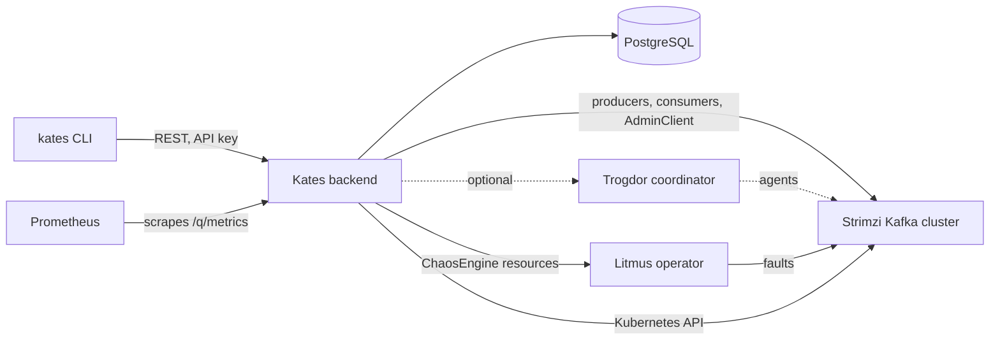

<div align="center">
  <picture>
    <source media="(prefers-color-scheme: dark)" srcset="docs/assets/kates-wordmark-dark.svg" />
    
  </picture>

  <p>
    Performance testing, chaos engineering and security auditing<br/>
    for Apache Kafka on Kubernetes.
  </p>

  <p>
    <a href="https://github.com/bmscomp/kates/actions/workflows/ci.yml"></a>
    <a href="https://github.com/bmscomp/kates/releases/latest"></a>
    <a href="LICENSE"></a>
    <a href="https://bmscomp.github.io/kates/"></a>
  </p>
</div>

Kates runs performance tests against Apache Kafka, injects faults into its brokers and measures what they cost in throughput, latency and recovery time, and audits broker security configuration. It is for teams that run Kafka on Kubernetes and want those measurements to be repeatable, on a local Kind cluster or in a CI pipeline. Performance tests work against any Kafka the backend can reach; fault injection targets Strimzi-managed brokers, by default the cluster `krafter` in namespace `kafka`.

It has three parts: the `kates` CLI (Go), a backend service (Quarkus) that runs the tests and faults and keeps the results in PostgreSQL, and the Helm charts that install Kafka and everything around it.

**[The book](https://bmscomp.github.io/kates/)** · [Quick start](#quick-start) · [Architecture](#architecture) · [Documentation](#documentation) · [CLI at a glance](#cli-at-a-glance) · [Helm charts](#helm-charts) · [Building from source](#building-from-source) · [Contributing](#contributing)

## What it does

- **Performance tests.** Eight workload types (`LOAD`, `STRESS`, `SPIKE`, `ENDURANCE`, `VOLUME`, `CAPACITY`, `ROUND_TRIP`, `INTEGRITY`) plus configuration sweeps (`kates tune run`); `kates test types` lists every type the backend accepts. The default engine runs Kafka producers and consumers inside the backend on virtual threads; `--backend trogdor` hands the workload to a Trogdor coordinator you run yourself. Reports give throughput, latency percentiles and error rate, and export as CSV, JUnit XML, Markdown, HTML or latency heatmaps.
- **Fault injection.** Thirteen disruption types, from broker pod kills and network partitions to CPU, memory and I/O stress, DNS errors, disk fill and node drain (`kates disruption types`). The default install runs eleven of them through LitmusChaos. Network latency and disk fill time out, because the `kates-chaos` chart ships no Litmus experiment for them (see `experiments.definitions` in its values). The direct Kubernetes provider covers eight.
- **Resilience runs and fault plans.** `kates resilience run` pairs one load test with one fault and reports the before/after change and the recovery time. `kates disruption run` executes multi-step plans; `kates disruption playbook list` shows the built-in ones. Plans get blast-radius checks, a dry run, ISR and consumer-lag tracking, and an A–F grade against absolute latency, throughput and recovery-time thresholds.
- **Security audit.** `kates security audit` grades broker configuration A–F. Related commands map the checks to CIS, SOC 2 and PCI DSS, save a baseline and report drift from it.
- **CI gates.** `kates gate --min-grade B` runs a load test and exits non-zero below the grade, `kates test apply -f <scenario> --wait` fails when a scenario violates its SLA, and `kates security gate` does the same for the audit grade. Finished tests can notify webhooks (`kates webhook add`).
- **A multi-zone lab on one machine.** A three-node Kind cluster whose nodes (`alpha`, `sigma`, `gamma`) sit in separate zones. On it, `kates deploy` gives each zone its own StorageClass and broker pool and turns on rack awareness, so a zone failure can be rehearsed locally.
- **Metrics and dashboards.** The backend exposes Prometheus metrics, the monitoring chart adds Grafana dashboards for Kafka, Kates and chaos runs, and the charts ship Prometheus alert rules. The backend also exports OTLP traces, but the default install has no Jaeger to receive them; [Observability](docs/book/09-observability.md) covers the dashboards, the alerts and tracing.

## Quick start

This path builds the whole stack on a local Kind cluster. You need:

- a clone of this repository. `kates deploy` reads the charts, the version pins and the Kind cluster definition relative to the working directory, so run every command from the repository root;
- Docker (any daemon the `docker` CLI talks to), [Kind](https://kind.sigs.k8s.io/), `kubectl` and Helm, at the minimum versions in the book's [Prerequisites](docs/book/12-deployment.md#prerequisites);
- about 16 GB of RAM, with at least 10 GB of it available to Docker, on macOS or Linux (amd64 or arm64).

```bash
# 1. The CLI (macOS or Linux), and a checkout of the same release to run it from
brew install bmscomp/tap/kates
git clone https://github.com/bmscomp/kates && cd kates
git checkout "$(git describe --tags --abbrev=0 --match 'v*')"

# 2. A three-zone Kind cluster named panda, and the release's native backend image loaded into it
make cluster
make kates-native

# 3. The stack: a wizard on a terminal; --dry-run prints the plan and installs nothing
kates deploy

# 4. Port-forwards in the background; a CLI context named ports, with the API URL and key, becomes current
kates ports

# 5. A first load test
kates health
kates test create --type LOAD --records 100000 --wait
```

- **Release or `main`.** Homebrew, the release tarballs and `make kates-native` all give the latest release, so step 1 checks out that release's charts to match. Without Homebrew, download `kates-<os>-<arch>.tar.gz` from the [latest release](https://github.com/bmscomp/kates/releases/latest); it holds a single `kates` binary. To run `main` instead, skip the `git checkout` and build both halves from the checkout: `make cli-install` for the CLI and `make kates-image-native-local` for the backend (see [Building from source](#building-from-source)).
- **Which cluster.** `kates deploy` installs into kubectl's current context. `make cluster` switches that to `kind-panda` only when it creates the cluster, so check `kubectl config current-context` and run `kubectl config use-context kind-panda` if needed. Before deploying, `kates deploy` probes every context in your kubeconfig: with none reachable it offers to create the Kind cluster, and with several it asks which one, but it does not switch to the one you pick. `-y` never prompts, so it fails where it would have asked.
- **The backend image.** On Kind, `kates deploy` runs a local native image, `kates:native-local` if present and otherwise `kates:native`, and never pulls one. Without either, the deploy stops at the backend step, after Kafka and monitoring are installed. `make kates-native` pulls the published image of the release that `charts/kates/Chart.yaml` names, and compiles one only if the pull fails; it keeps a `kates:native` already on the machine, so run `docker rmi kates:native` first when you change releases. `make kates-image-native-local` compiles your working tree instead (several minutes, about 8 GB of Docker memory). Both load the image into `panda`, so create the cluster first.
- **The API key.** Every `/api` call except `/api/health` needs the key from Secret `kates-api-key` in namespace `kates` (`kates-stack` with `--topology single`). `kates deploy` writes it into the active CLI context unless that context already holds a key kates did not put there, and `kates ports` into a context of its own, `ports`; a context you create yourself needs `--api-key`. Because `/api/health` is public, a green `kates health` does not prove the key works; `kates test list` does.
- **`make all`** is an interactive wrapper: it creates the Kind cluster if no cluster is reachable, asks for a topology, runs `kates deploy` and then the `make ports` script, which uses the second port map below. With the single-namespace topology that script finds nothing to forward, so run `kates ports` afterwards. It uses the `kates` on your `PATH` and does not fetch the backend image, so do step 1 and `make cluster && make kates-native` first.

### What `kates deploy` installs

With the default isolated topology:

| Component | Helm release | Namespace |
|:--|:--|:--|
| Strimzi operator | `strimzi-operator` | `strimzi-operator` |
| cert-manager | `cert-manager` | `cert-manager` |
| Kafka | `krafter` | `kafka` |
| Prometheus and Grafana | `monitoring` | `monitoring` |
| Apicurio Registry | `apicurio` | `kafka` |
| Kates backend, with its PostgreSQL | `kates` | `kates` |
| Kafka UI | `kafka-ui` | `kafka` |
| LitmusChaos | `chaos` | `litmus` |

Kafka Connect, MirrorMaker 2, Kyverno and the secret manager are opt-in (`--with-kafka-connect`, `--with-mirror-maker2`, `--with-kyverno`, `--with-secret-manager`). `--topology single` puts everything except the operators in one namespace, `kates-stack`. After a failure, fix the cause and run `kates deploy` again: it skips or upgrades the components already installed.

### Reach the services

Kind publishes no NodePorts on the host, so every `localhost` address is a port-forward. There are two forwarders, with different port maps; the sign-ins are those of a Kind install.

| Service | `kates ports` | `make ports` | Sign-in |
|:--|:--|:--|:--|
| Kates API | http://localhost:8080 | http://localhost:30083 | API key |
| Kafka UI | http://localhost:8085 | http://localhost:30081 | `admin`, password in Secret `kafka-ui-web-password` (namespace `kafka`) |
| Grafana | http://localhost:3000 | http://localhost:30080 ¹ | `admin` / `admin` |
| Prometheus | http://localhost:9090 | http://localhost:30090 ¹ | none |

¹ `make ports` looks for Grafana and Prometheus in namespace `kafka`. With the default isolated topology they are in `monitoring`, so run `MONITORING_NS=monitoring make ports`. With `--topology single` everything is in `kates-stack`: set `KAFKA_NS`, `KATES_NS` and `MONITORING_NS` to `kates-stack`, or use `kates ports`, which finds the services in any namespace.

`kates ports` first stops every `kubectl port-forward` on the machine, then forwards in the background, points the CLI context `ports` at `http://localhost:8080` with the key from the Secret, and makes `ports` the current context. It changes no other context, keeps a key you set in `ports` yourself, and says when the API rejects the key. `make ports` leaves contexts alone; the CLI switches between `localhost:8080` and `localhost:30083` when only one of them answers. Stop either set with `pkill -f kubectl.port-forward`. To read the credentials yourself:

```bash
kubectl get secret kates-api-key -n kates -o jsonpath='{.data.api-key}' | base64 -d           # Kates API key
kubectl get secret kafka-ui-web-password -n kafka -o jsonpath='{.data.password}' | base64 -d  # Kafka UI, user admin
```

Kafka UI can only read: its Kafka user has Describe and Read ACLs, so the brokers reject writes. Apicurio Registry has no web console, and neither forwarder finds its API; forward it with `kubectl -n kafka port-forward svc/apicurio-apicurio-registry 8081:80`. Litmus has no UI either: faults run through `kates disruption` and `kates resilience`, and `make chaos-status` lists the ChaosExperiments, ChaosEngines and ChaosResults in namespace `kafka`. The book's [Access Points](docs/book/03-cluster.md#access-points) section has more.

### If something fails

| Symptom | What to do |
|:--|:--|
| `kates deploy` stops at the backend: "no local backend image" | Run `make kates-native` or `make kates-image-native-local`, then `kates deploy` again. |
| `kates deploy` fails with "(run from the repo root)" | Run it from the root of the checkout. |
| `kates deploy` fails anywhere else | The error is also in `deploy-error.log`. `kates deploy status` checks each component; `kates deploy --verbose` prints every `helm` and `kubectl` command. |
| `kates health` reports connection refused | No port-forward is running: run `kates ports`. |
| `[401] Missing API key` or `[403] Invalid API key` while `kates health` works | If the active context has no key or a stale one, run `kates ports`: it makes the `ports` context current with the key from the Secret, and says when the API rejects that key. An exported `KATES_API_KEY` wins over the context, so if it is stale, `unset KATES_API_KEY` (or export the current key, read as shown above). |
| A chaos run changes nothing | If `kubectl logs -n kates deploy/kates \| grep noop` shows `falling back to noop`, the backend found no usable chaos provider when it started; it picks the provider once. Check Litmus (`kubectl get pods -n litmus`), then `kubectl rollout restart deploy/kates -n kates`. |
| A disruption plan leaves p99 latency and throughput unevaluated, or reads them as 0 | The backend cannot reach Prometheus. The kates chart's `prometheus.url` defaults to `http://monitoring-kube-prometheus-prometheus.monitoring.svc:9090`, the Service of the monitoring stack `kates deploy` installs, and `kates deploy` sets it for the namespace it uses. `make monitoring` installs into `kafka` instead: `make kates`, which applies the raw manifests in `kates/k8s/`, already points there, and a kates chart install needs `--set prometheus.url=http://monitoring-kube-prometheus-prometheus.kafka.svc:9090 --set networkPolicy.prometheus.namespace=kafka`. Charts before 0.10.5 set no URL, and the backend's own default named a Service that does not exist: set `KATES_PROMETHEUS_URL` in `extraEnv` there. Backends from release 1.23.0 and earlier also read p99 as 0, and pass it, whatever the URL. |
| A test ends `FAILED` after 30 minutes | `kates.engine.max-duration-ms` caps every run, and the default `ENDURANCE` lasts an hour. Pass a shorter `--duration`, or raise the cap with `KATES_ENGINE_MAX_DURATION_MS` in `extraEnv`. |

The [Troubleshooting Index](docs/book/appendix-b-troubleshooting.md) covers the rest.

### Tear down

```bash
kates clean --force   # uninstall the stack and keep the cluster; without --force it asks first
make destroy          # delete the Kind cluster panda (FORCE=1 skips the prompt)
```

`kates clean` also deletes the Strimzi, Litmus, Prometheus Operator, cert-manager and Kyverno CRDs cluster-wide, and stops every `kubectl port-forward` on the machine. Do not point it at a shared cluster.

## Other clusters

`kates deploy` also installs on any cluster your kubeconfig reaches; run it from the checkout as on Kind. There the backend runs the published `ghcr.io/bmscomp/kates` image and the charts use their generic overlays, so Grafana gets a random password, stored in Secret `monitoring-grafana` under `admin-password`. The generated Kafka values also add an external listener on port 9094 with TLS and SCRAM-SHA-512. It sits behind a load balancer with no internal-only annotation on EKS and GKE, an internal load balancer on AKS, and a NodePort elsewhere. `kates deploy --dry-run` writes those values to `.build/values-detected.yaml` without installing anything, so you can review the listener first. The book's [Deployment](docs/book/12-deployment.md#cloud-deployment) chapter covers the EKS, GKE and AKS overlays.

## Architecture



The CLI and its full-screen views talk to the backend over REST. The backend also streams events as Server-Sent Events and serves a smaller, unary-only gRPC API on the same port. Load comes from a `BenchmarkBackend` (the in-process engine or Trogdor) and faults from a `ChaosProvider` (Litmus by default, the Kubernetes API, or a hybrid that picks Litmus when its CRDs are present). The [Architecture](docs/book/02-architecture.md) chapter covers the orchestrators, the disruption pipeline and the data model.

## Documentation

| Where | What |
|:--|:--|
| [The book](https://bmscomp.github.io/kates/) ([source](docs/book/README.md)) | Concepts, the CLI, the REST and gRPC APIs, deployment, security, upgrades and troubleshooting |
| [Tutorials](docs/tutorials/README.md) | Step-by-step labs: a first test, every test type, chaos, CI integration, Kafka Connect, MirrorMaker 2 migrations, dashboards |
| [CLI reference](docs/book/10-cli-reference.md) | Commands, flags and contexts |
| [REST API](docs/book/11-api-reference.md) · [gRPC API](docs/book/16-grpc-api.md) | Endpoints, authentication, exports |
| [Chaos in practice](docs/book/07-chaos-practice.md) | Disruption types, providers, playbooks, guardrails and grading |
| [Deployment](docs/book/12-deployment.md) · [Installing Kafka with Helm](docs/book/20-installation-guide.md) | Topologies, sizing, cloud overlays, chart-by-chart installs |
| [Troubleshooting Index](docs/book/appendix-b-troubleshooting.md) | Symptoms mapped to causes and chapters |
| [Version matrix](docs/book/appendix-d-versions.md) | Every pinned version (Kafka, Strimzi, Quarkus, Java, Go, charts), generated and checked in CI |
| [Local development](docs/local-development.md) | Makefile targets, image management, working behind a proxy |
| [Dashboards](dashboards/USING.md) | Which Grafana board answers which question |
| [Export formats](kates/docs/export-formats.md) | CSV, JUnit XML and latency heatmap layouts |

## CLI at a glance

```bash
kates deploy -i                                             # Deployment wizard
kates ports                                                 # Port-forward services; point the ports context at the API
kates health                                                # Backend health and Kafka connectivity
kates kafka tui                                             # Full-screen Kafka explorer
kates test create --type LOAD --records 100000 --wait       # Run a load test and print the results
kates benchmark                                             # LOAD, STRESS and SPIKE, each graded A–F
kates resilience run -f cli/examples/resilience-test.yaml   # Load test with a broker pod kill
kates disruption playbook list                              # Built-in multi-step fault plans
kates report show <id>                                      # Throughput, latency percentiles, error rate
kates test apply -f scenarios/ci-gate.yaml --wait           # Scenarios with SLA checks; exits 1 on a violation
kates gate --min-grade B                                    # CI gate: run a LOAD test, exit 1 below grade B
kates security audit                                        # Security configuration audit, graded A–F
kates dashboard                                             # Live full-screen dashboard
kates mcp --context ports --allow-cluster <clusterId>       # Read-only MCP server for AI agents (experimental)
```

`kates gate` grades average throughput and p99 latency against fixed bands, the same for every test type. The SLA verdict in `kates report show` checks only thresholds stored with the run, and runs from `kates test create` carry none; to check thresholds, put them in a scenario's `validate:` block and run it with `kates test apply`.

`kates ctx` points the CLI at other Kates instances. Contexts are Kates API profiles kept in `~/.kates.yaml`, not Kubernetes contexts; each takes a URL and an `--api-key`, and `kates ctx show` lists them. `kates <command> --help` documents every command.

## Helm charts

Each chart carries its own version. Install them from a checkout: they are not published to a chart registry yet. `kates deploy` installs the charts as separate releases. The `kates-platform` umbrella combines `kafka-cluster` and `kates`, with Apicurio, MirrorMaker 2 and Kafka Connect as options, and expects the Strimzi operator to be installed first.

When you install charts with Helm directly:

- Install `charts/strimzi-operator` first, as its own release. It owns the Strimzi CRDs through a pre-install/pre-upgrade hook Job that downloads the CRD bundle from the Strimzi GitHub release, so the cluster needs egress to GitHub, or `crdUpgrade.url` must point at a mirror.
- Run `helm dependency build charts/<chart>` before rendering or installing a chart. `kafka-cluster` also pulls SeaweedFS from an HTTPS repository; after the first build, later builds fail unless you have run `helm repo add seaweedfs https://seaweedfs.github.io/seaweedfs/helm`.
- Use one install path per cluster. `kates deploy` names the Kafka release `krafter`, `make kafka` names it `kafka-cluster`, and both create the Kafka resource `krafter` in namespace `kafka`.

[Deploying the Strimzi Operator](docs/book/deploying-strimzi-operator.md) and [Installing Kafka with the kafka-cluster Helm Chart](docs/book/20-installation-guide.md) walk through both releases. `make readme-check` verifies the Version and App Version columns below against each `Chart.yaml`.

<!-- chart-table:start -->
| Chart | Version | App Version | Description |
|:------|:--------|:------------|:------------|
| [`apicurio-registry`](charts/apicurio-registry/) | 0.4.0 | 3.3.0 | Apicurio Registry, backed by the kafka-cluster chart (Strimzi) in this repository |
| [`connect-cluster`](charts/connect-cluster/) | 2.1.3 | 4.3.1 | A Helm chart for deploying Strimzi Kafka Connect clusters |
| [`headlamp`](charts/headlamp/) | 0.2.0 | 0.40.1 | Headlamp — Kubernetes Dashboard for cluster visualization and management |
| [`kafka-cluster`](charts/kafka-cluster/) | 1.0.4 | 4.3.1 | A Strimzi Kafka cluster in KRaft mode — node pools, topics, users, rebalancing, tiered storage, network policy and observability |
| [`kafka-common`](charts/kafka-common/) | 0.1.0 |  | Library chart — the templates the Strimzi charts share (names and labels, rails, Kafka client authentication, the Connect worker spec, KafkaUser, secret sync, NetworkPolicy and monitoring fragments, the Grafana grid, the preflight probe) |
| [`kafka-ui`](charts/kafka-ui/) | 0.3.0 | v1.5.0 | A Helm chart for deploying Kafka UI (Kafbat) with Strimzi SCRAM-SHA-512 authentication |
| [`kates-chaos`](charts/kates-chaos/) | 2.2.1 | 3.28.0 | Kates Chaos Engineering — wraps the LitmusChaos execution plane (operator, exporter, CRDs) with Kafka-specific RBAC, experiment/engine templating, and monitoring |
| [`kates-platform`](charts/kates-platform/) | 0.7.0 | 1.0.0 | Umbrella chart for the full Kates platform — Kafka, Kates, and supporting infrastructure |
| [`kates`](charts/kates/) | 0.10.5 | 1.23.0 | Kates — Kafka Advanced Testing & Engineering Suite |
| [`legacy-kafka`](charts/legacy-kafka/) | 0.2.0 | 3.9.1 | A deliberately old Kafka (2.x on ZooKeeper, or 3.x on KRaft) to migrate FROM — the replication source that the pinned Strimzi release cannot deploy |
| [`minio`](charts/minio/) | 17.0.22 | 2025.7.23 | MinIO object storage (S3-compatible), vendored from the Bitnami chart |
| [`mirror-maker2`](charts/mirror-maker2/) | 0.11.1 | 4.3.1 | Strimzi KafkaMirrorMaker2 — cross-cluster replication, DR, and cross-version migration (2.x/3.x → 4.x) |
| [`monitoring`](charts/monitoring/) | 1.6.0 | 82.4.3 | Kates Monitoring — wraps kube-prometheus-stack with Kates-specific dashboards and configuration |
| [`strimzi-operator`](charts/strimzi-operator/) | 0.3.1 | 1.2.0 | The Strimzi Kafka Operator — wraps the upstream chart with pinned kates defaults, an owned CRD-upgrade hook, and a strict values schema |
| [`velero`](charts/velero/) | 11.3.3 | 1.17.1 | A Helm chart for velero |
<!-- chart-table:end -->

## Building from source

You need Go and a JDK at the versions in the [version matrix](docs/book/appendix-d-versions.md), plus Docker for images and integration tests. Under the default `GOTOOLCHAIN=auto`, Go downloads the toolchain that `cli/go.mod` names, and `./mvnw` downloads Maven.

```bash
make cli-install               # Build the CLI with version info; installs to /usr/local/bin (CLI_INSTALL_DIR to change)
make test-unit                 # Java unit tests (no Docker) and Go tests
make test-java-it              # Java integration tests with Testcontainers (needs Docker)
make check                     # The fast CI checks: linters, formatting, version pins
make kates-image-native-local  # Native image kates:native-local, loaded into Kind for kates deploy (about 8 GB of Docker memory)
make kates-local               # JVM image kates:local (quicker to build), loaded into Kind and deployed in place of the native one
```

- `make` on its own lists every target.
- On Linux, `make cli-install` ends with a `codesign` error, a macOS-only step, after the binary is already installed. The binary works, but the target stops before checking whether another `kates` comes earlier on your `PATH`.
- On Apple Silicon, local `./mvnw` builds need Rosetta 2 (`softwareupdate --install-rosetta`): the gRPC code generator this Quarkus version uses ships only an x86-64 macOS binary. Docker builds are not affected.
- `(cd kates && ./mvnw quarkus:dev)` runs the backend with API-key authentication off, but it still needs a reachable PostgreSQL (`QUARKUS_DATASOURCE_JDBC_URL`) and Kafka (`KATES_KAFKA_BOOTSTRAP_SERVERS`).
- Both Dockerfiles take the repository root as build context, as in `docker build -f kates/Dockerfile.native -t kates:native-local .`.

## Contributing

Branch from `main` and write commit messages in the [Conventional Commits](CONTRIBUTING.md#commit-conventions) format, such as `fix(cli): …` or `docs(book): …`; pull requests are squash-merged. Run `make check` before you push. When a change alters what users see, update the matching chapter in `docs/book/`. CI also checks this README: the chart table against each `Chart.yaml`, and every relative link and anchor. [CONTRIBUTING.md](CONTRIBUTING.md#pull-request-process) describes the review process, and the [Code of Conduct](CODE_OF_CONDUCT.md) covers participation.

## License

Apache License 2.0. See [LICENSE](LICENSE).
