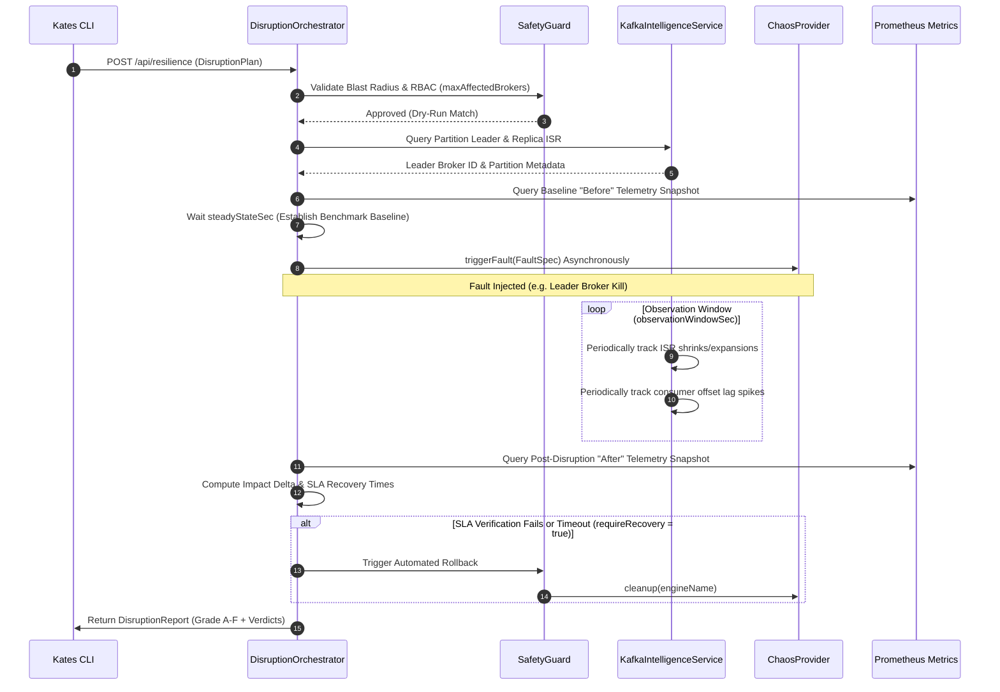

# Kates — Kafka Advanced Testing & Engineering Suite

A terminal-first, enterprise-grade engineering platform for **performance testing**, **chaos injection**, and **operational resilience auditing** of Apache Kafka clusters. Kates enables platform engineers, architects, and developers to validate, tune, and stress-test their Kafka infrastructure under production-parity environments on local or remote Kubernetes clusters.

---

## The Vision: Why Kates?

In modern cloud-native architectures, Apache Kafka lies at the critical path of data flow. Ensuring its reliability, low latency, security, and schema enforcement requires continuous, active testing. **Kates** was created to democratize advanced chaos testing and performance tuning for Kafka topologies. 

Unlike traditional passive monitoring systems, Kates offers an **active engineering environment**: it provisions a local Multi-AZ Kind cluster, deploys production-grade operators, and enables you to actively simulate broker crashes, network partitions, and heavy spikes while measuring real-time latency and SLA violations via a sleek, interactive command-line dashboard.

---

## Key Architectural Features & Capabilities

Kates features a robust, comprehensive collection of tools spanning several key engineering domains:

### 1. Unified Namespace Topologies
Kates is designed with architectural flexibility, supporting two highly configurable deployment topologies to match any development or testing context:
* **Single Namespace Mode (Development)**: Consolidates the entire stack (Kafka, Kates application backend, Kafka UI, schema registries, and tracing databases) into a single, isolated namespace (`kates-stack` or custom). Perfect for lightweight local hacking, minimal resource utilization, and rapid prototyping.
* **Isolated Namespace Mode (Production-Parity)**: Simulates a production environment by separating logical layers into dedicated, isolated namespaces:
  - `kafka-sys` / `kafka` for Strimzi and Kafka brokers.
  - `app-sys` / `kates` for the application backend and APIs.
  - `chaos-sys` / `litmus` for chaos injection and execution engines.
  - `monitoring-iso` / `monitoring` for Prometheus, Alertmanager, Grafana, and Jaeger tracing systems.

### 2. Multi-Zone Cluster Simulation (Multi-AZ)
Simulate real-world geographic failures locally on a 3-node Kind Kubernetes cluster, with nodes labeled across three distinct virtual availability zones: `alpha`, `sigma`, and `gamma`. StorageClasses are bootstrapped dynamically with zone affinity, allowing you to test replica distribution, broker rack-awareness, and partition rebalancing under actual zone outages.

### 3. Automated Resilience & Safety Guardrails
Tearing down a complex cloud-native system is often fraught with hanging namespaces and stuck custom resources due to orphaned finalizers. Kates includes **active finalizer stripping and CR purging guardrails** built directly into its cleanup command, ensuring your local development cluster remains completely clean and free of namespace teardown locks without manual troubleshooting.

### 4. Continuous Chaos Engineering
Leverage **7 pre-configured, production-parity chaos playbooks** driven by LitmusChaos. Run real-time performance-chaos correlation tests where you inject disruptions (e.g., broker pod kills, network latency spikes, disk fill-ups) while active performance workloads are running. Kates evaluates the throughput and latency degradation, outputting a precise SLA grade (A-F) based on customizable service level thresholds.

### 5. OpenTelemetry & High-Observability
The suite comes fully integrated with **OpenTelemetry (OTLP)**. Auto-instrumented JAX-RS REST endpoints, Kafka clients, and database transactions flow into **Jaeger Tracing** and **Prometheus**. Kates auto-provisions over **10 custom Grafana dashboards** and 20+ proactive alerting rules out-of-the-box, providing granular visibility into:
* Kafka broker internals and JVM resource statistics.
* Topic replication latency, offline partitions, and consumer lag.
* Thread statistics, transaction times, and OpenTelemetry trace spans.

---

## Platform Architecture & Kates Backend

Kates is architected as an asynchronous, highly decoupled, multi-tier system. The orchestration logic is completely separated from workload generation and fault-injection mechanics. This separation of concerns is achieved through declarative Service Provider Interfaces (SPIs) and reactive communication boundaries.

### Architectural Component Diagram

```mermaid
graph TD
    classDef cli fill:#1f6feb,stroke:#58a6ff,stroke-width:2px,color:#fff;
    classDef core fill:#238636,stroke:#3fb950,stroke-width:2px,color:#fff;
    classDef spi fill:#8957e5,stroke:#a371f7,stroke-width:2px,color:#fff;
    classDef ext fill:#d29922,stroke:#f0883e,stroke-width:2px,color:#fff;

    subgraph User Space
        CLI[Kates CLI Client]:::cli
        TUI[Interactive TUI Dashboard]:::cli
    end

    subgraph Kates Backend Engine (Quarkus App)
        API[JAX-RS REST Resource Layer]:::core
        GRPC[gRPC Telemetry Service]:::core
        Orch[Test & Disruption Orchestrators]:::core
        Intel[Kafka Intelligence Service]:::core
        Panache[(PostgreSQL / Panache DB)]:::core
        MPConfig[MicroProfile Config Engine]:::core
    end

    subgraph Service Provider Interfaces
        BENCH_SPI{BenchmarkBackend SPI}:::spi
        CHAOS_SPI{ChaosProvider SPI}:::spi
    end

    subgraph Concrete Execution Backends
        NativeEng[Native Loom Workload Engine]:::spi
        TrogClient[Trogdor Coordinator Adapter]:::spi
        LitmusEng[LitmusChaos CRD Provider]:::spi
        DirectK8s[Direct Kubernetes API Provider]:::spi
    end

    subgraph Infrastructure
        Kafka[Strimzi Apache Kafka Cluster]:::ext
        Prom[Prometheus Metrics Server]:::ext
        Litmus[Litmus Operator]:::ext
    end

    CLI -->|HTTP/JSON REST| API
    TUI -->|gRPC Bidirectional Stream| GRPC
    API --> Orch
    GRPC --> Orch
    Orch --> Intel
    Orch --> Panache
    Orch --> MPConfig

    Orch --> BENCH_SPI
    Orch --> CHAOS_SPI

    BENCH_SPI --> NativeEng
    BENCH_SPI --> TrogClient
    CHAOS_SPI --> LitmusEng
    CHAOS_SPI --> DirectK8s

    NativeEng -->|Producer/Consumer clients| Kafka
    TrogClient -->|REST Client| TrogClient
    LitmusEng -->|Custom Resources| Litmus
    DirectK8s -->|Fabric8 API Restarts| Kafka
    Intel -->|AdminClient Metadata| Kafka
```

### The Kates Backend Application Internals
The core backend (`/kates`) is a reactive, containerized Java microservice engineered on the **Quarkus 3.32.1** runtime framework and optimized for **Java 25**.
* **High-Concurrency Virtual Threads (Project Loom)**: Workload engines rely heavily on Java 25's virtual threads. When executing a native performance test, Kates spawns hundreds of independent producer/consumer loops on lightweight virtual threads mapped dynamically to a minimal set of OS carrier threads. This avoids the high memory footprint and scheduling overhead of platform thread pools, allowing massive throughput simulation locally.
* **Reactive REST & gRPC Dual Stack**: Standard CRUD administration, configurations, and state polling are serviced via JAX-RS reactive endpoints utilizing Jackson deserialization. Real-time telemetry, terminal sparklines, and the full-screen terminal UI (TUI) are powered by high-throughput, low-latency **gRPC bidirectional streams** (using Quarkus gRPC/Mutiny).
* **Three-Tier Configuration Resolution**: System parameters follow the Eclipse MicroProfile Config specification. Configurations resolve dynamically through a strict three-tier hierarchy:
  1. *Request-level Overrides*: Request-level JSON overrides take ultimate priority.
  2. *Environment Configs*: Kubernetes ConfigMaps mapping to environment variables (e.g. `KATES_TESTS_STRESS_PARTITIONS=12`).
  3. *Built-in Properties*: `application.properties` and built-in Java `@ConfigProperty` default values.
* **Persistent Telemetry**: Long-term data integrity verification reports, historic benchmark runs, scheduled cron execution blocks, and security audit grades are stored in a **PostgreSQL** database managed via **Hibernate ORM (Panache)** and versioned via **Flyway** schema migrations.

### Extensible Service Provider Interfaces (SPIs)
Kates leverages Java Service Provider Interfaces to achieve complete pluggability, allowing engineers to swap underlying performance benchmark engines and chaos tools seamlessly:

#### 1. BenchmarkBackend SPI
Abstracts how a benchmark is executed. Implementations define submission, status polling, and stop sequences:
* `NativeKafkaBackend`: Executes workloads in-process using direct, virtual-threaded Java Kafka clients.
* `TrogdorBackend`: Formats the task into JSON payload structures using a Plain Old Java Object (POJO) translation layer and submits it to Apache Kafka's official `Trogdor` Coordinator via MicroProfile REST Client interfaces.

#### 2. ChaosProvider SPI
Abstracts how fault scenarios are injected into the cluster:
* `LitmusChaosProvider`: Connects to the Kubernetes cluster using the Fabric8 client to deploy, monitor, and clean up LitmusChaos `ChaosEngine` Custom Resources.
* `KubernetesChaosProvider`: Bypasses external operators by executing direct API calls (e.g., namespace pod deletions, replica scaling) for rapid, dependency-free disruptions.
* `HybridChaosProvider`: Evaluates the capabilities of active operators and dynamically routes the requested disruption to the most efficient provider.

### Intelligent Disruption Pipeline Sequence

The orchestration logic behind Kates correlation tests evaluates resilience dynamically. The sequence below describes a typical chaos-performance correlation test run:



---

## Prerequisites

- [Docker](https://www.docker.com/)
- [Kind](https://kind.sigs.k8s.io/docs/user/quick-start/#installation)
- [kubectl](https://kubernetes.io/docs/tasks/tools/)
- [Helm](https://helm.sh/docs/intro/install/)
- [jq](https://stedolan.github.io/jq/) (optional, for registry status)

---

## Quick Start

Bring up the entire production-grade stack with one command:
```bash
make all
```

This runs a 10-step automated pipeline:

| Step | Action |
|------|--------|
| 1 | Create Kind cluster `panda` + local Docker registry |
| 2 | Pull all images to local registry (`localhost:5001`) |
| 3 | Load images from registry into Kind nodes |
| 4 | Deploy Prometheus & Grafana |
| 5 | Wait for monitoring readiness |
| 6 | Deploy Strimzi Kafka (KRaft mode) |
| 7 | Wait for Kafka readiness |
| 8 | Deploy Kafka UI |
| 9 | Deploy Apicurio Registry |
| 10 | Deploy LitmusChaos |

### Access Points

| Service | URL | Credentials |
|---------|-----|-------------|
| Grafana | http://localhost:30080 | admin / admin |
| Kafka UI | http://localhost:30081 | — |
| Apicurio Registry | http://localhost:30082 | — |
| Kates API | http://localhost:30083 | — |
| Jaeger UI | http://localhost:30086 | — |
| Prometheus | http://localhost:30090 | — |
| Litmus UI | `make chaos-ui` → http://localhost:9091 | admin / litmus |

### Teardown
```bash
make destroy
```

---

## Image Management

All images are defined in `images.env` — the single source of truth. Both `scripts/pull-images.sh` and `scripts/load-images-to-kind.sh` source this file, eliminating version drift.

### How It Works

1. **Pull** — `scripts/pull-images.sh` downloads images to a local Docker registry (`localhost:5001`), detecting platform (arm64/amd64) automatically.
2. **Load** — `scripts/load-images-to-kind.sh` pulls from the local registry and loads into Kind nodes. No internet fallback — fails if the image isn't in the registry.
3. **Deploy** — all Helm values and manifests use `imagePullPolicy: Never`, ensuring Kubernetes only uses images already on Kind nodes.

### Managing Images Individually

```bash
# Pull all images (skips already-cached)
./scripts/pull-images.sh

# Load all images into Kind (skips already-loaded)
./scripts/load-images-to-kind.sh

# Check what's in the registry
make registry-status

# Check what's loaded in Kind
docker exec -it panda-control-plane crictl images
```

---

## Makefile Targets

| Target | Description |
|--------|-------------|
| `make all` | Full setup (cluster + registry + images + all services) |
| `make cluster` | Start Kind cluster only |
| `make images` | Pull and load all images |
| `make monitoring` | Deploy Prometheus & Grafana |
| `make kafka` | Deploy Kafka (Strimzi) |
| `make ui` | Deploy Kafka UI |
| `make apicurio` | Deploy Apicurio Registry |
| `make litmus` | Deploy LitmusChaos |
| `make chaos-ui` | Port-forward Litmus UI |
| `make chaos-experiments` | Apply chaos experiments |
| `make velero` | Deploy Velero backup |
| `make test` | Run Kafka performance test (1M messages) |
| `make gameday` | Run automated GameDay validation pipeline |
| `make chart-lint` | Lint Kates Helm chart |
| `make ports` | Start port forwarding |
| `make status` | Check cluster status |
| `make destroy` | Destroy cluster |

---

## Monitoring & Observability

Custom Grafana dashboards are auto-provisioned upon setup:
- **Kafka Complete Monitoring** — all metrics, brokers, topics, zones, and JVM.
- **Kafka Cluster Health** — broker status, offline partitions, and zone distribution.
- **Kafka Performance Metrics** — topic growth, partitions, and broker count.
- **Kafka Performance Test Results** — perf-test throughput and message counts.
- **Kafka JVM Metrics** — heap memory, GC rate, and thread count per zone.
- **Strimzi Operator & Kafka Connect** — reconciliation p99, success/failure rates, and Connect task health.

### Distributed Tracing
OpenTelemetry traces are exported via OTLP to Jaeger. Auto-instrumented spans cover:
- REST API calls (JAX-RS)
- Kafka producer/consumer operations
- Database queries (JDBC)

Access the Jaeger UI at http://localhost:30086 after deployment.

---

## Documentation

| Resource | Content |
|----------|---------|
| [The Definitive Guide](docs/book/README.md) | 14-chapter book covering architecture, performance theory, test types, chaos engineering, data integrity, observability, CLI/API reference, deployment, scenario files, and recipes |
| [Tutorials](docs/tutorials/README.md) | 6 hands-on tutorials from first test to CI/CD integration |

---

## Kates CLI

**Kates** is a full-featured terminal client for performance testing, chaos engineering, and cluster administration. It communicates with the Kates backend API.

### Installation

#### macOS (Recommended)
You can install the pre-compiled Kates CLI binary on macOS using Homebrew:
```bash
brew tap bmscomp/tap
brew install kates
```

#### Pre-Compiled Binaries (All Platforms)
Download the official **`v1.12.0`** pre-compiled tarballs and checksums directly from the [GitHub Releases](https://github.com/bmscomp/kates/releases/tag/v1.12.0) page. Available for macOS and Linux (Intel `amd64` and Apple Silicon `arm64`).

#### From Source (All Platforms)
```bash
cd cli
go build -ldflags="-s -w" -o kates .
mv kates /usr/local/bin/  # Or keep in-place
```

### Context Management
Kates uses a context system similar to `kubectl`. Configuration is stored in `~/.kates.yaml`.
```bash
# Create a context pointing to the Kates API
kates ctx set local --url http://localhost:30083

# Switch to a context
kates ctx use local

# Show all contexts
kates ctx show

# Print the active context
kates ctx current
```

---

## CLI Command Reference

### 1. Setup & Lifecycle Management
Commands to manage the Kates stack running inside your cluster:

* **`kates ports`**
  Discover deployed Kates services and establish automated background port-forwards to localhost. Includes automatic retry/restart handlers upon connection drops.
  ```bash
  kates ports                              # auto-discover and forward all default services
  kates ports --all                        # include monitoring + tracing ports
  kates ports --kafka-ns my-kafka          # specify custom kafka namespace
  kates ports --app-ns my-app              # specify custom application namespace
  kates ports --monitoring-ns my-mon       # specify custom monitoring namespace
  ```

* **`kates clean`**
  Tears down the entire Kates stack, uninstalls Helm releases, and purges namespaces cleanly. Includes active safety guardrails to strip orphaned custom resource finalizers (preventing namespaces from getting locked in `Terminating`).
  ```bash
  kates clean                              # interactive, with confirmation prompts
  kates clean --force                      # skip confirmation prompt (useful for CI/CD)
  kates clean --verbose                    # show full output of sub-commands
  kates clean --topology single            # clean single namespace topology
  kates clean --topology isolated          # clean isolated multi-namespace topology
  ```

### 2. Security & Compliance Auditing
Advanced commands to evaluate and stress-test the security posture of your Kafka cluster:

* **`kates security audit`**
  Runs a comprehensive posture scan across Kafka brokers, authentication methods, configurations, and authorization rules, outputting an overall A-F grade.
  ```bash
  kates security audit
  kates security audit --export report.pdf  # export report as PDF, HTML, MD, or JSON
  ```

* **`kates security netpol`**
  Audits Kubernetes NetworkPolicies surrounding Kafka pods. Dynamically scans default namespaces and any custom namespaces carrying Helm-managed releases.
  ```bash
  kates security netpol
  ```

* **`kates security tls-inspect`**
  Inspects TLS configurations, certificate authorities, secrets, and certificates for active expirations or weak cipher configurations.
  ```bash
  kates security tls-inspect
  ```

* **`kates security pentest`**
  Runs active penetration testing playbooks against the cluster to simulate malicious vectors.
  ```bash
  kates security pentest --test metadata-leak  # run metadata leak check
  kates security pentest --test acl-bypass     # test ACL authorization rules
  kates security pentest --test all            # execute all pentesting suites
  ```

* **`kates security compliance`**
  Runs standard CIS benchmarks and compliance posture checks against the target deployment.
  ```bash
  kates security compliance
  ```

### 3. Health & Status
```bash
kates health            # System health, Kafka connectivity, and engine status
kates status            # One-line system status
kates version           # CLI, API, and runtime version info
```

### 4. Cluster Inspection
```bash
kates cluster info                 # Cluster metadata — brokers, controller, rack/AZ
kates cluster topics               # List all Kafka topics
kates cluster topics describe <t>  # Detailed topic metadata, configs, partition health
kates cluster broker configs <id>  # Non-default broker config (grouped by source)
kates cluster check                # Comprehensive cluster health check
kates cluster groups               # List consumer groups with state and members
kates cluster groups describe <g>  # Consumer group offsets and per-partition lag
```

### 5. Interactive Kafka Client
```bash
kates kafka brokers                                    # Broker list with rack/AZ and roles
kates kafka topics                                     # List topics with ISR health
kates kafka topic <name>                               # Describe topic partitions and config
kates kafka create-topic <name> --partitions 3 --rf 3  # Create a topic
kates kafka alter-topic <name> --config retention.ms=172800000         # Alter topic config
kates kafka delete-topic <name> --yes                  # Delete a topic
kates kafka groups                                     # List consumer groups
kates kafka group <id>                                 # Consumer group lag detail
kates kafka consume <topic> --offset earliest          # Fetch records from a topic
kates kafka consume <topic> -f                         # Tail a topic (like tail -f)
kates kafka produce <topic> --key k --value v          # Produce a record
kates kafka tui                                        # Launch interactive full-screen explorer
```

### 6. Test Execution & Scenario Files
Start benchmark workloads and load tests against the cluster:
```bash
kates test create --type LOAD --records 100000    # Start a load test
kates test create --type STRESS --producers 8     # Multi-producer stress test
kates test list                                    # List all test runs
kates test list --type LOAD --status DONE          # Filter by type and status
kates test show <id>                               # Inspect a specific run
kates test delete <id>                             # Delete a test run
kates test apply -f scenario.yaml --wait           # Apply a YAML test definition
```
Available test types: `LOAD`, `STRESS`, `SPIKE`, `ENDURANCE`, `VOLUME`, `CAPACITY`, `ROUND_TRIP`.

### 7. Reports & Trend Analysis
```bash
kates report show <id>              # Full report with SLA verdict
kates report summary <id>           # Condensed metrics summary
kates report export csv <id>        # Export results as CSV
kates report export junit <id>      # Export as JUnit XML (CI integration)
kates report diff <id1> <id2>       # Side-by-side comparison of two runs
kates trend --type LOAD --metric p99LatencyMs --days 30     # P99 trend over 30 days
kates trend --type STRESS --metric throughput --days 7       # Throughput sparkline
```

### 8. Schedules & Resilience
```bash
kates schedule list                                               # List all schedules
kates schedule show <id>                                          # Inspect a schedule
kates schedule create --name nightly --cron "0 2 * * *" -f s.yaml # Create a recurring test
kates schedule delete <id>                                        # Remove a schedule
kates resilience --experiment pod-kill --duration 60s   # Chaos-performance correlation
```

### 9. Observability
```bash
kates dashboard      # Full-screen monitoring dashboard (alias: dash)
kates top            # Live view of running tests (like kubectl top)
kates watch <id>     # Real-time streaming of a running test
```

---

## Project Structure

```
cli/
├── main.go              # Entry point
├── cmd/                 # Cobra command definitions
│   ├── root.go          # Root command, context loading, flags
│   ├── cluster.go       # cluster info/topics/broker/check
│   ├── groups.go        # consumer group commands
│   ├── test.go          # test create/list/show/delete/apply
│   ├── report.go        # report show/summary/export/diff
│   ├── trend.go         # trend analysis with sparklines
│   ├── schedule.go      # schedule CRUD
│   ├── resilience.go    # chaos-performance correlation
│   ├── dashboard.go     # full-screen dashboard
│   ├── top.go           # live test monitoring
│   ├── watch.go         # streaming test output
│   ├── health.go        # health check
│   ├── status.go        # one-line status
│   ├── config.go        # ctx set/use/show/delete/current
│   ├── version.go       # version info
│   ├── helpers.go       # shared formatting utilities
│   └── helpers_test.go  # unit tests for helpers
├── client/              # HTTP API client
│   ├── client.go        # All API methods with retry logic
│   ├── types.go         # Request/response type definitions
│   └── client_test.go   # httptest-based tests for all endpoints
├── output/              # Terminal rendering utilities
│   ├── output.go        # Tables, banners, sparklines, config lists
│   └── output_test.go   # Output rendering tests
└── build.sh             # Cross-platform build script
```

---

## Running Tests

Verify everything builds and passes perfectly:
```bash
cd cli
go test ./... -v
```
