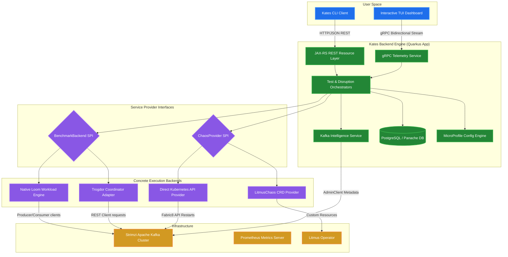
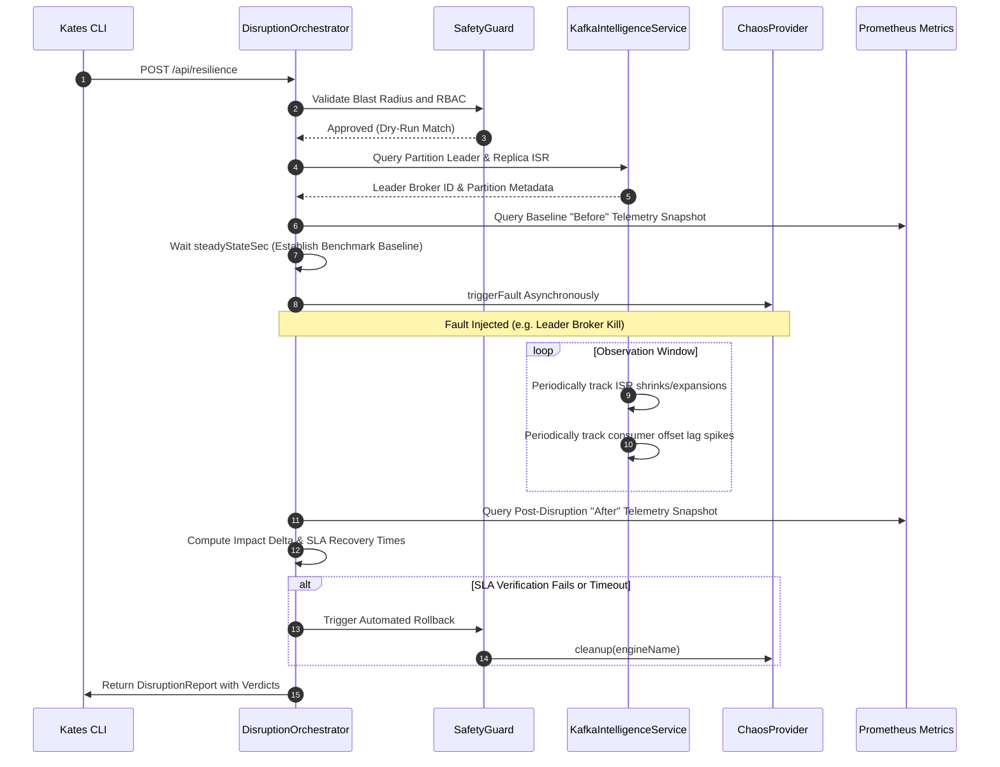

<div align="center">
  

  <h1>Kates</h1>

  <p><strong>Kafka Advanced Testing & Engineering Suite</strong></p>

  <p>
    A Kubernetes-native platform for performance testing, chaos engineering,<br/>
    and operational resilience auditing of Apache Kafka clusters.
  </p>

  <p>
    <a href="https://github.com/bmscomp/kates/actions/workflows/ci.yml"></a>
    <a href="LICENSE"></a>
    <a href="https://github.com/bmscomp/kates/releases/tag/v1.17.0"></a>
    
    
    
    
  </p>
</div>

---

## ✨ Feature Highlights

|  |  |  |
|:--|:--|:--|
| 🧪 **7 Test Types** | 🌪️ **Chaos Engineering** | 📊 **Full Observability** |
| Load, Stress, Spike, Endurance, Breakpoint, Exactly-Once, Idempotency | 10 disruption types with safety guardrails and automatic rollback | Prometheus + Grafana + Jaeger with 10 dashboards & 20 alert rules |
| 🏗️ **One-Command Deploy** | 🔒 **Security Auditing** | 🚀 **CI/CD Native** |
| `kates deploy -i` — interactive wizard deploys the entire stack in minutes | TLS inspection, NetworkPolicy analysis, Kyverno compliance, penetration testing | Quality gates, JUnit export, badge generation, webhook notifications |

---

## The Vision: Why Kates?

In modern cloud-native architectures, Apache Kafka lies at the critical path of data flow. Ensuring its reliability, low latency, security, and schema enforcement requires continuous, active testing. **Kates** was created to democratize advanced chaos testing and performance tuning for Kafka topologies. 

Unlike traditional passive monitoring systems, Kates offers an **active engineering environment**: it provisions a local Multi-AZ Kind cluster, deploys production-grade operators, and enables you to actively simulate broker crashes, network partitions, and heavy spikes while measuring real-time latency and SLA violations via a sleek, interactive command-line dashboard.

---

## Key Architectural Features & Capabilities

### 1. Unified Namespace Topologies
Kates supports two highly configurable deployment topologies:
* **Single Namespace Mode (Development)**: Consolidates the entire stack into a single, isolated namespace (`kates-stack` or custom). Perfect for lightweight local hacking and rapid prototyping.
* **Isolated Namespace Mode (Production-Parity)**: Simulates a production environment by separating logical layers into dedicated namespaces (`kafka`, `kates`, `monitoring`, `litmus`).

### 2. Multi-Zone Cluster Simulation (Multi-AZ)
Simulate real-world geographic failures locally on a 3-node Kind Kubernetes cluster, with nodes labeled across three distinct virtual availability zones: `alpha`, `sigma`, and `gamma`. StorageClasses are bootstrapped dynamically with zone affinity, allowing you to test replica distribution, broker rack-awareness, and partition rebalancing under actual zone outages.

### 3. Automated Resilience & Safety Guardrails
Kates includes **active finalizer stripping and CR purging guardrails** built directly into its cleanup command, ensuring your local development cluster remains completely clean and free of namespace teardown locks without manual troubleshooting.

### 4. Continuous Chaos Engineering
Leverage **7 pre-configured, production-parity chaos playbooks** driven by LitmusChaos. Run real-time performance-chaos correlation tests where you inject disruptions (e.g., broker pod kills, network latency spikes, disk fill-ups) while active performance workloads are running. Kates evaluates the throughput and latency degradation, outputting a precise SLA grade (A-F) based on customizable service level thresholds.

### 5. OpenTelemetry & High-Observability
The suite comes fully integrated with **OpenTelemetry (OTLP)**. Auto-instrumented JAX-RS REST endpoints, Kafka clients, and database transactions flow into **Jaeger Tracing** and **Prometheus**. Kates auto-provisions over **10 custom Grafana dashboards** and 20+ proactive alerting rules out-of-the-box.

---

## Platform Architecture

### Architectural Component Diagram



### Backend Internals

The core backend (`/kates`) is a reactive, containerized Java microservice built on **Quarkus 3.32.1** and optimized for **Java 25**:

* **Virtual Threads (Project Loom)**: Workload engines spawn hundreds of independent producer/consumer loops on lightweight virtual threads for massive throughput simulation.
* **Reactive REST & gRPC Dual Stack**: CRUD via JAX-RS, real-time telemetry via gRPC bidirectional streams.
* **Three-Tier Configuration**: MicroProfile Config with request-level overrides → environment variables → built-in defaults.
* **Persistent Telemetry**: PostgreSQL via Hibernate ORM (Panache) with Flyway migrations.

### Extensible SPIs

* **BenchmarkBackend SPI** — Swap workload engines: `NativeKafkaBackend` (in-process virtual threads) or `TrogdorBackend` (external coordinator).
* **ChaosProvider SPI** — Swap fault injection: `LitmusChaosProvider`, `KubernetesChaosProvider`, or `HybridChaosProvider`.

### Intelligent Disruption Pipeline



---

## Quick Start

### Express (30 seconds)

```bash
brew install bmscomp/tap/kates       # Install the CLI
kates deploy -i                       # Interactive wizard — deploys everything
kates health                          # Verify the stack is healthy
kates test create --type LOAD         # Run your first load test
```

### Full Pipeline (`make all`)

Bring up the entire production-grade stack with one command:

```bash
make all
```

This runs a 10-step automated pipeline:

| Step | Action |
|------|--------|
| 1 | Create Kind cluster `panda` + local Docker registry |
| 2 | Pull all images to local registry (`localhost:5001`) |
| 3 | Load images from registry into Kind nodes |
| 4 | Deploy Prometheus & Grafana |
| 5 | Wait for monitoring readiness |
| 6 | Deploy Strimzi Kafka (KRaft mode) |
| 7 | Wait for Kafka readiness |
| 8 | Deploy Kafka UI |
| 9 | Deploy Apicurio Registry |
| 10 | Deploy LitmusChaos |

### Access Points

| Service | URL | Credentials |
|---------|-----|-------------|
| Grafana | http://localhost:30080 | admin / admin |
| Kafka UI | http://localhost:30081 | — |
| Apicurio Registry | http://localhost:30082 | — |
| Kates API | http://localhost:30083 | — |
| Jaeger UI | http://localhost:30086 | — |
| Prometheus | http://localhost:30090 | — |
| Litmus UI | `make chaos-ui` → http://localhost:9091 | admin / litmus |

### Teardown
```bash
make destroy          # Using make
kates clean --force   # Using the CLI
```

---

## Helm Charts

Kates ships 9 Helm charts for modular deployment:

| Chart | Version | App Version | Description |
|-------|---------|-------------|-------------|
| [`kates`](charts/kates/) | 0.4.1 | 1.17.0 | Kates backend & frontend |
| [`kafka-cluster`](charts/kafka-cluster/) | 0.1.1 | 4.2.0 | Strimzi KRaft cluster with zone-aware broker pools |
| [`kates-chaos`](charts/kates-chaos/) | 1.2.0 | 1.17.0 | LitmusChaos wrapper with Kafka-specific RBAC |
| [`kates-monitoring`](charts/monitoring/) | 1.0.0 | 82.4.3 | Prometheus + Grafana with Kates dashboards |
| [`apicurio-registry`](charts/apicurio-registry/) | 0.1.5 | 2.2.5.Final | Apicurio Schema Registry |
| [`klster-platform`](charts/klster-platform/) | 0.1.0 | 1.0.0 | Umbrella chart for the full platform |
| [`headlamp`](charts/headlamp/) | 0.1.0 | 0.40.1 | Kubernetes Dashboard |
| [`velero`](charts/velero/) | 11.3.2 | 1.17.1 | Velero backup |
| [`minio`](charts/minio/) | 17.0.21 | 2025.7.23 | MinIO object storage |

---

## Building from Source

### Prerequisites

* **Go 1.24+** (CLI)
* **Java SDK 25** (backend)
* **Maven 3.9+** (or use `./mvnw`)
* **Docker / OrbStack** (container images)
* **GraalVM** (optional, native binaries)

### CLI

```bash
cd cli
go build -ldflags="-s -w" -o kates .
mv kates /usr/local/bin/
```

### Backend

```bash
cd kates
./mvnw quarkus:dev                           # Dev mode with hot-reload
./mvnw package -DskipTests                   # JVM package
./mvnw package -Dnative -DskipTests          # Native binary (GraalVM)
```

### Container Images

```bash
docker build -f kates/Dockerfile -t kates:latest .             # JVM image
docker build -f kates/Dockerfile.native -t kates:latest kates/ # Native image
```

---

## Kates CLI

**Kates** is a full-featured terminal client for performance testing, chaos engineering, and cluster administration.

### Installation

#### macOS (Homebrew)
```bash
brew tap bmscomp/tap
brew install kates
```

#### Pre-Compiled Binaries
Download the official **`v1.17.0`** binaries from the [GitHub Releases](https://github.com/bmscomp/kates/releases/tag/v1.17.0) page. Available for macOS and Linux (amd64 and arm64).

#### From Source
```bash
cd cli && go build -ldflags="-s -w" -o kates . && mv kates /usr/local/bin/
```

### Context Management
```bash
kates ctx set local --url http://localhost:30083   # Create a context
kates ctx use local                                 # Switch context
kates ctx show                                      # List all contexts
kates ctx current                                   # Print active context
```

---

## CLI Command Reference

### 1. Setup & Lifecycle

| Command | Description |
|---------|-------------|
| `kates deploy -i` | Interactive deployment wizard — topology, components, namespaces |
| `kates deploy --topology isolated --with-monitoring` | Non-interactive deploy with flags |
| `kates clean` | Tear down the entire stack (with confirmation) |
| `kates clean --force` | Tear down without confirmation (CI-friendly) |
| `kates upgrade` | Upgrade the Kates stack to the latest version |
| `kates init` | Initialize a new Kates workspace with config and scenarios |
| `kates auto` | Auto-detect cluster and deploy Kafka |
| `kates ports` | Port-forward all Kates services to localhost |
| `kates ports --all` | Include monitoring + tracing ports |

### 2. Cluster Intelligence

| Command | Description |
|---------|-------------|
| `kates detect` | Deep cluster compatibility report (zones, storage, network, operators) |
| `kates detect --export report.pdf` | Export as PDF, HTML, Markdown, or JSON |
| `kates cluster info` | Cluster metadata — brokers, controller, rack/AZ |
| `kates cluster topics` | List all Kafka topics |
| `kates cluster topics describe <t>` | Detailed topic metadata and partition health |
| `kates cluster broker configs <id>` | Non-default broker config (grouped by source) |
| `kates cluster check` | Comprehensive cluster health check |
| `kates cluster groups` | List consumer groups with state and members |
| `kates cluster diff` | Diff cluster state between snapshots |
| `kates cluster watch` | Watch cluster events in real-time |
| `kates cluster alerts` | View active alert rules |
| `kates snapshot create` | Create a cluster state snapshot |
| `kates snapshot list` | List all snapshots |
| `kates snapshot diff <s1> <s2>` | Compare two snapshots |

### 3. Health & Status

```bash
kates health            # System health, Kafka connectivity, and engine status
kates status            # One-line system status
kates version           # CLI, API, and runtime version info
kates doctor            # Environment diagnostics
```

### 4. Interactive Kafka Client

```bash
kates kafka brokers                                    # Broker list with rack/AZ and roles
kates kafka topics                                     # List topics with ISR health
kates kafka topic <name>                               # Describe topic partitions and config
kates kafka create-topic <name> --partitions 3 --rf 3  # Create a topic
kates kafka alter-topic <name> --config retention.ms=172800000  # Alter topic config
kates kafka delete-topic <name> --yes                  # Delete a topic
kates kafka groups                                     # List consumer groups
kates kafka group <id>                                 # Consumer group lag detail
kates kafka consume <topic> --offset earliest          # Fetch records from a topic
kates kafka consume <topic> -f                         # Tail a topic (like tail -f)
kates kafka produce <topic> --key k --value v          # Produce a record
kates kafka tui                                        # Launch interactive full-screen explorer
```

### 5. Test Execution & Scenario Files

```bash
kates test create --type LOAD --records 100000    # Start a load test
kates test create --type STRESS --producers 8     # Multi-producer stress test
kates test list                                    # List all test runs
kates test list --type LOAD --status DONE          # Filter by type and status
kates test show <id>                               # Inspect a specific run
kates test delete <id>                             # Delete a test run
kates apply -f scenario.yaml --wait                # Apply a YAML test definition
kates scaffold list                                # Browse built-in scenario templates
kates scaffold export <name>                       # Export a template to a local file
```

Available test types: `LOAD`, `STRESS`, `SPIKE`, `ENDURANCE`, `VOLUME`, `CAPACITY`, `ROUND_TRIP`.

### 6. Analysis & Optimization

| Command | Description |
|---------|-------------|
| `kates benchmark` | Run a full test battery (LOAD → STRESS → SPIKE) with letter-grade scorecard |
| `kates gate -f scenario.yaml --min-grade B` | CI quality gate — exit non-zero if grade is below threshold |
| `kates flow run -f pipeline.yaml` | Declarative multi-step pipeline orchestrator |
| `kates advisor <id>` | Analyze results and recommend configuration improvements |
| `kates explain <id>` | Plain-English summary and verdict for a test run |
| `kates profile save <name> <id>` | Save a named performance profile |
| `kates profile compare <a> <b>` | Compare two profiles |
| `kates profile assert <name> --max-p99 50ms` | Assert profile meets thresholds |
| `kates baseline set <id>` | Set a test as the regression baseline |
| `kates baseline regression <id>` | Check for regressions against the baseline |
| `kates cost estimate -f scenario.yaml` | Estimate cloud costs for a test configuration |
| `kates tune run` | Automated performance tuning |
| `kates replay <id>` | Re-run a previous test with the same parameters |
| `kates diff <id1> <id2>` | Side-by-side comparison of two test runs |
| `kates lab` | Interactive performance tuning laboratory |

### 7. Reports & Trends

```bash
kates report show <id>              # Full report with SLA verdict
kates report summary <id>           # Condensed metrics summary
kates report export csv <id>        # Export results as CSV
kates report export junit <id>      # Export as JUnit XML (CI integration)
kates report diff <id1> <id2>       # Side-by-side comparison of two runs
kates trend --type LOAD --metric p99LatencyMs --days 30     # P99 trend over 30 days
kates trend --type STRESS --metric throughput --days 7       # Throughput sparkline
```

### 8. Chaos & Disruption

```bash
kates resilience --experiment pod-kill --duration 60s   # Chaos-performance correlation
kates disruption run --type broker-kill                  # Run a specific disruption
kates disruption list                                    # List disruption history
kates disruption status <id>                             # Check disruption status
kates disruption timeline <id>                           # View disruption timeline
kates disruption types                                   # List available disruption types
kates chaos list                                         # Chaos experiment history
kates chaos show <id>                                    # Detailed chaos report
```

### 9. Security & Compliance

```bash
kates security audit                                # Full posture scan with A-F grade
kates security audit --export report.pdf            # Export as PDF/HTML/MD/JSON
kates security netpol                               # Audit NetworkPolicies
kates security tls-inspect                          # TLS and certificate inspection
kates security pentest --test all                   # Active penetration tests
kates security compliance                           # CIS benchmark compliance
kates kyverno status                                # Kyverno policy engine status
kates kyverno violations                            # List policy violations
kates kyverno enforce <policy>                      # Enforce a policy
kates kyverno audit                                 # Audit policies
```

### 10. Schedules & Automation

```bash
kates schedule list                                               # List all schedules
kates schedule show <id>                                          # Inspect a schedule
kates schedule create --name nightly --cron "0 2 * * *" -f s.yaml # Create recurring test
kates schedule delete <id>                                        # Remove a schedule
kates webhook list                                                # List webhook endpoints
kates webhook add --url https://... --event test.completed        # Add a webhook
```

### 11. Observability

```bash
kates dashboard      # Full-screen monitoring dashboard
kates top            # Live view of running tests (like kubectl top)
kates watch <id>     # Real-time streaming of a running test
kates audit          # View audit log of cluster mutations
kates changelog      # Generate changelog from audit events
```

### 12. Developer Tools

```bash
kates badge --type build --output badge.svg    # Generate README status badges
kates theme list                                # List available terminal themes
kates theme preview <name>                      # Preview a theme
kates tldr                                      # Quick command summary
kates doc <command>                             # Man-style documentation
kates plugin list                               # List installed CLI plugins
```

---

## Image Management

All images are defined in `images.env` — the single source of truth.

```bash
./scripts/pull-images.sh               # Pull all images (skips cached)
./scripts/load-images-to-kind.sh       # Load into Kind (skips loaded)
make registry-status                   # Check registry contents
```

---

## Makefile Targets

| Target | Description |
|--------|-------------|
| `make all` | Full setup (cluster + registry + images + all services) |
| `make cluster` | Start Kind cluster only |
| `make images` | Pull and load all images |
| `make monitoring` | Deploy Prometheus & Grafana |
| `make kafka` | Deploy Kafka (Strimzi) |
| `make ui` | Deploy Kafka UI |
| `make apicurio` | Deploy Apicurio Registry |
| `make litmus` | Deploy LitmusChaos |
| `make chaos-ui` | Port-forward Litmus UI |
| `make chaos-experiments` | Apply chaos experiments |
| `make velero` | Deploy Velero backup |
| `make test` | Run Kafka performance test (1M messages) |
| `make gameday` | Run automated GameDay validation pipeline |
| `make chart-lint` | Lint Kates Helm chart |
| `make ports` | Start port forwarding |
| `make status` | Check cluster status |
| `make destroy` | Destroy cluster |

---

## Monitoring & Observability

Custom Grafana dashboards are auto-provisioned upon setup:
- **Kafka Complete Monitoring** — all metrics, brokers, topics, zones, and JVM.
- **Kafka Cluster Health** — broker status, offline partitions, and zone distribution.
- **Kafka Performance Metrics** — topic growth, partitions, and broker count.
- **Kafka Performance Test Results** — perf-test throughput and message counts.
- **Kafka JVM Metrics** — heap memory, GC rate, and thread count per zone.
- **Strimzi Operator & Kafka Connect** — reconciliation p99, success/failure rates, and Connect task health.

### Distributed Tracing
OpenTelemetry traces are exported via OTLP to Jaeger. Auto-instrumented spans cover:
- REST API calls (JAX-RS)
- Kafka producer/consumer operations
- Database queries (JDBC)

Access the Jaeger UI at http://localhost:30086 after deployment.

---

## Documentation

| Resource | Description |
|----------|-------------|
| 📖 [The Definitive Guide](docs/book/README.md) | A complete 20-chapter book with 3 appendices covering theory, CLI, API, deployment, security, and more |
| 🎓 [Tutorials](docs/tutorials/README.md) | Seven progressive step-by-step tutorials from first test to CI/CD integration |
| 📚 [REST API Reference](kates/docs/api-reference.md) | JSON schemas, gRPC streams, and REST resources |
| 💥 [Disruption Catalog](kates/docs/disruption-guide.md) | 10 disruption types with configuration models |
| 📊 [Export Formats](kates/docs/export-formats.md) | CSV, JUnit XML, heatmaps, and metrics diffing |
| 🚀 [Deployment Guide](kates/docs/deployment.md) | Local Kind, managed EKS/GKE, or bare-metal deployments |

---


## Contributing

We welcome contributions from the community to improve the resilience engineering ecosystem! 
* **Guidelines**: Please read the **[Contribution Guide](CONTRIBUTING.md)** before opening pull requests.
* **Conduct**: We adhere to a professional community standard. See the **[Code of Conduct](CODE_OF_CONDUCT.md)** for details.

---

## Running Tests

```bash
cd cli && go test ./... -v       # CLI tests
cd kates && ./mvnw test          # Backend tests
```

---

<div align="center">
  <sub>Built with ❤️ for the Kafka community</sub>
</div>
