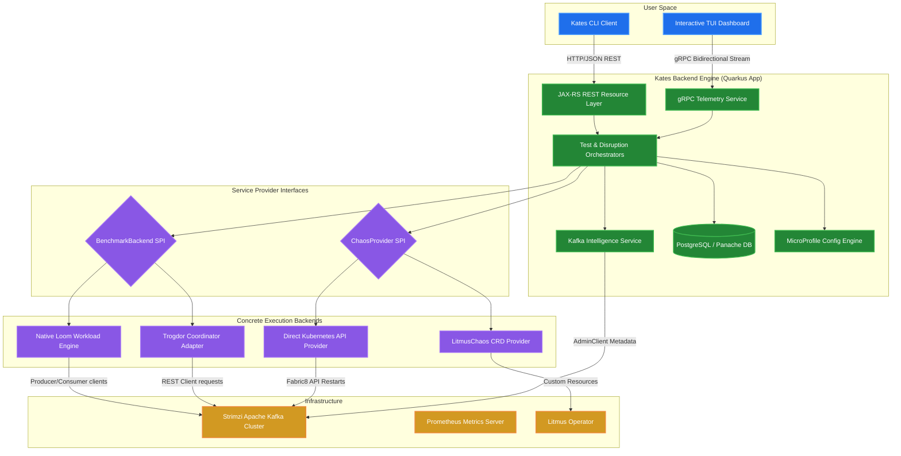

<div align="center">
  

  <h1>Kates</h1>

  <p><strong>Kafka Advanced Testing & Engineering Suite</strong></p>

  <p>
    A Kubernetes-native platform for performance testing, chaos engineering,<br/>
    and operational resilience auditing of Apache Kafka clusters.
  </p>

  <p>
    <a href="https://github.com/bmscomp/kates/actions/workflows/ci.yml"></a>
    <a href="LICENSE"></a>
    <a href="https://github.com/bmscomp/kates/releases/latest"></a>
    
    
    
    
  </p>
</div>

---

> **[Read the Kates Definitive Guide](docs/book/README.md)** — a complete book covering performance theory, chaos engineering, security, deployment, and operations.

**Contents** — [Why Kates](#why-kates) · [Features](#features) · [Quick Start](#quick-start) · [Architecture](#architecture) · [Helm Charts](#helm-charts) · [CLI at a Glance](#cli-at-a-glance) · [Building from Source](#building-from-source) · [Documentation](#documentation) · [Contributing](#contributing) · [License](#license)

## Why Kates

In modern cloud-native architectures, Apache Kafka lies at the critical path of data flow. Ensuring its reliability, low latency, security, and schema enforcement requires continuous, **active** testing — not passive monitoring. Kates provisions a production-parity environment, injects real faults, and measures the impact against your SLAs:

* **Multi-AZ simulation on your laptop** — a 3-node Kind cluster with brokers spread across virtual availability zones (`alpha`, `sigma`, `gamma`), zone-affinity storage, and rack-aware replica placement, so you can test real zone outages locally.
* **Performance-chaos correlation** — inject disruptions (broker kills, network latency, disk fill) *while* performance workloads run, and get an SLA grade (A–F) computed from throughput and latency degradation.
* **Two deployment topologies** — a single consolidated namespace for rapid prototyping, or isolated namespaces (`kafka`, `kates`, `monitoring`, `litmus`) for production parity.
* **Safety guardrails built in** — blast-radius validation before every fault, automatic rollback on SLA violation or timeout, and cleanup guardrails that strip finalizers and purge CRs so teardown never wedges.
* **Full observability** — OpenTelemetry auto-instrumentation flowing into Jaeger and Prometheus, with pre-provisioned Grafana dashboards and alert rules.

## Features

| Capability | Scope | Description |
|:--|:--|:--|
| **Performance Testing** | 8 test types | Supports Load, Stress, Spike, Endurance, Volume, Capacity, Round-Trip, and Integrity workloads, each configurable through MicroProfile Config with hierarchical defaults. |
| **Chaos Engineering** | 13 disruption types | Provides fault injection with safety guardrails and automatic rollback, enabling controlled experiments against broker failures, network partitions, and resource exhaustion. |
| **Observability** | End-to-end telemetry | Integrates Prometheus, Grafana, and Jaeger with pre-built dashboards and alert rules, providing metrics, logs, and distributed traces across the entire test lifecycle. |
| **Deployment** | One-command provisioning | The `kates deploy -i` interactive wizard provisions the complete stack—including Kafka, monitoring, and chaos infrastructure—in a single operation. |
| **Security Auditing** | Multi-layer analysis | Performs TLS inspection, NetworkPolicy analysis, Kyverno compliance checks, and active penetration testing to validate the security posture of the target cluster. |
| **CI/CD Integration** | Pipeline-native | Exports results as JUnit XML, generates status badges, enforces quality gates with letter-grade thresholds, and delivers webhook notifications for automated pipelines. |

## Quick Start

**Prerequisites**: Docker (or OrbStack), [Kind](https://kind.sigs.k8s.io/), `kubectl`, and Helm. macOS and Linux are supported; the Homebrew tap is macOS-only — Linux users install from the [latest release](https://github.com/bmscomp/kates/releases/latest) binaries.

```bash
brew install bmscomp/tap/kates       # Install the CLI
kates deploy -i                       # Interactive wizard — deploys everything
kates health                          # Verify the stack is healthy
kates test create --type LOAD         # Run your first load test
```

Prefer `make`? `make all` provisions the same stack (Kind cluster, local registry, monitoring, Kafka, UI, schema registry, chaos) through a ten-step idempotent pipeline — see the [Local Development Stack guide](docs/local-development.md).

### Access Points

Once the stack is provisioned, the following services are available via NodePort or port-forwarding (`kates ports --all`).

| Service | URL | Credentials | Notes |
|:--------|:----|:------------|:------|
| Grafana | http://localhost:30080 | admin / admin | Pre-loaded with Kafka dashboards and alert rules. |
| Kafka UI | http://localhost:30081 | — | Read-only by default; write access requires `KAFKA_UI_AUTH` configuration. |
| Apicurio Registry | http://localhost:30082 | — | Schema compatibility rules are enforced per-subject. |
| Kates API | http://localhost:30083 | — | Protected by API key in production; disabled in dev/test profiles. |
| Jaeger UI | http://localhost:30086 | — | Displays distributed traces for REST, Kafka, and JDBC operations. |
| Prometheus | http://localhost:30090 | — | Exposes `/api/v1/query` for ad-hoc PromQL queries. |
| Litmus UI | `make chaos-ui` then http://localhost:9091 | admin / litmus | Requires an explicit port-forward; not exposed by default. |

### Teardown

```bash
kates clean --force
```

## Architecture



The core backend (`/kates`) is a reactive, containerized Java microservice built on **Quarkus 3.15** and **Java 21**:

* **Virtual Threads (Project Loom)** — workload engines spawn hundreds of independent producer/consumer loops on lightweight virtual threads for massive throughput simulation.
* **Reactive REST & gRPC dual stack** — CRUD via JAX-RS, real-time telemetry via gRPC bidirectional streams.
* **Extensible SPIs** — swap workload engines (`NativeKafkaBackend`, `TrogdorBackend`) and fault-injection providers (`LitmusChaosProvider`, `KubernetesChaosProvider`, `HybridChaosProvider`) without touching the orchestrators.
* **Persistent telemetry** — PostgreSQL via Hibernate ORM (Panache) with Flyway migrations.

For the disruption pipeline, data-flow diagrams, and component deep-dives, see the [Architecture chapter](docs/book/02-architecture.md) of the Definitive Guide.

## Helm Charts

Kates ships its platform as independently versioned Helm charts, composable via the `kates-platform` umbrella chart. Run `make readme-check` to verify this table against the chart sources.

<!-- chart-table:start -->
| Chart | Version | App Version | Description |
|:------|:--------|:------------|:------------|
| [`kates`](charts/kates/) | 0.4.4 | 1.20.0 | The Kates backend (Quarkus REST/gRPC) and frontend, deployed as a single Kubernetes Deployment with ConfigMap-driven configuration. |
| [`kafka-cluster`](charts/kafka-cluster/) | 0.1.1 | 4.2.0 | A Strimzi-managed KRaft Kafka cluster with zone-aware broker pools, SCRAM-SHA-512 authentication, and rack-affinity storage classes. |
| [`connect-cluster`](charts/connect-cluster/) | 1.2.0 | 4.2.0 | A Strimzi-managed Kafka Connect cluster with a managed KafkaUser, least-privilege ACLs, default-deny NetworkPolicies, and in-chart JMX metrics. |
| [`kafka-ui`](charts/kafka-ui/) | 0.2.0 | v1.5.0 | A web-based Kafka management interface for topic inspection, consumer group monitoring, and message browsing. |
| [`kates-chaos`](charts/kates-chaos/) | 1.2.0 | 1.20.0 | A LitmusChaos wrapper that installs Kafka-specific RBAC, ChaosServiceAccounts, and pre-built experiment templates for broker and network faults. |
| [`kates-monitoring`](charts/monitoring/) | 1.0.0 | 82.4.3 | The Prometheus and Grafana monitoring stack, pre-configured with scrape jobs, recording rules, and auto-provisioned dashboards for Kafka, JVM, and Strimzi metrics. |
| [`apicurio-registry`](charts/apicurio-registry/) | 0.1.5 | 3.3.0 | Apicurio Schema Registry deployed with KafkaSQL persistence, providing schema validation and compatibility enforcement for Avro, Protobuf, and JSON Schema. |
| [`kates-platform`](charts/kates-platform/) | 0.2.0 | 1.0.0 | An umbrella chart that composes all sub-charts into a single `helm install` operation for full-platform provisioning. |
| [`headlamp`](charts/headlamp/) | 0.1.0 | 0.40.1 | A lightweight Kubernetes dashboard for visual cluster inspection and resource management. |
| [`velero`](charts/velero/) | 11.3.2 | 1.17.1 | Velero backup and disaster recovery, configured for scheduled snapshots of persistent volumes and Kubernetes resources. |
| [`minio`](charts/minio/) | 17.0.21 | 2025.7.23 | MinIO object storage, used as the S3-compatible backend for Velero backups and optional Kafka tiered storage. |
<!-- chart-table:end -->

## CLI at a Glance

The `kates` CLI spans deployment, testing, chaos, security, and cluster administration. A few emblematic commands:

```bash
kates deploy -i                                        # Interactive deployment wizard
kates health                                           # Stack health and connectivity
kates kafka tui                                        # Full-screen interactive Kafka explorer
kates test create --type LOAD --records 100000         # Run a load test
kates benchmark                                        # Full battery with an A–F scorecard
kates resilience --experiment pod-kill --duration 60s  # Chaos-performance correlation
kates report show <id>                                 # Full report with SLA verdict
kates gate -f scenario.yaml --min-grade B              # CI quality gate (non-zero exit below B)
kates security audit                                   # Security posture scan with A–F grade
kates dashboard                                        # Live full-screen monitoring dashboard
```

Contexts point the CLI at an environment: `kates ctx set local --url http://localhost:30083 && kates ctx use local`.

The complete command reference — all twelve command domains with every flag — lives in the [CLI Reference chapter](docs/book/10-cli-reference.md) of the Definitive Guide, with hands-on walkthroughs in the [tutorials](docs/tutorials/README.md).

## Building from Source

**Prerequisites**: Go 1.25+ (CLI), Java SDK 21 and Maven 3.9+ or `./mvnw` (backend), Docker, and optionally GraalVM for native binaries.

```bash
# CLI
cd cli && go build -ldflags="-s -w" -o kates . && mv kates /usr/local/bin/

# Backend
cd kates
./mvnw quarkus:dev                           # Dev mode with hot-reload
./mvnw package -DskipTests                   # JVM package
./mvnw package -Dnative -DskipTests          # Native binary (GraalVM)

# Container images
docker build -f kates/Dockerfile -t kates:latest .             # JVM image
docker build -f kates/Dockerfile.native -t kates:latest kates/ # Native image

# Tests
cd cli && go test ./...                      # CLI tests
cd kates && ./mvnw test                      # Backend tests
```

## Documentation

| Resource | Description |
|:---------|:------------|
| [The Definitive Guide](docs/book/README.md) | A complete book covering performance testing theory, CLI usage, REST API integration, deployment topologies, security hardening, and operational procedures. |
| [Tutorials](docs/tutorials/README.md) | Progressive, step-by-step tutorials that guide practitioners from running a first load test through building fully automated CI/CD quality gates. |
| [Local Development Stack](docs/local-development.md) | The `make` provisioning pipeline, image management via `images.env`, and corporate proxy configuration. |
| [REST API Reference](kates/docs/api-reference.md) | Complete API specification including JSON request/response schemas, gRPC service definitions, and REST resource documentation. |
| [Disruption Catalog](kates/docs/disruption-guide.md) | Reference documentation for all supported disruption types, including configuration models, blast radius parameters, and safety constraints. |
| [Export Formats](kates/docs/export-formats.md) | Specification of all supported export formats: CSV for data analysis, JUnit XML for CI integration, latency heatmaps for visualization, and metrics diffs for regression detection. |
| [Deployment Guide](kates/docs/deployment.md) | Deployment procedures for local Kind clusters, managed Kubernetes services (EKS, GKE, AKS), and bare-metal installations. |

## Contributing

We welcome contributions from the community to improve the resilience engineering ecosystem!

* **Guidelines**: Please read the **[Contribution Guide](CONTRIBUTING.md)** before opening pull requests.
* **Conduct**: We adhere to a professional community standard. See the **[Code of Conduct](CODE_OF_CONDUCT.md)** for details.

## License

Kates is licensed under the [Apache License 2.0](LICENSE).

---

<div align="center">
  <sub>Built with ❤️ for the Kafka community</sub>
</div>
