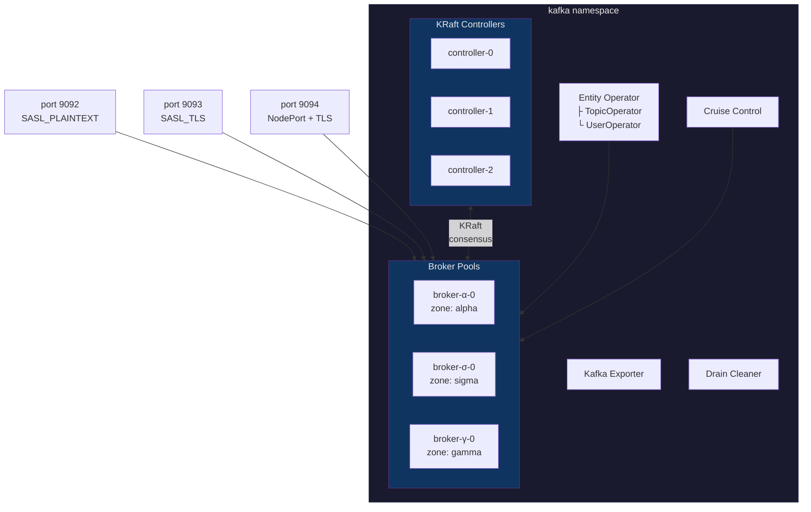
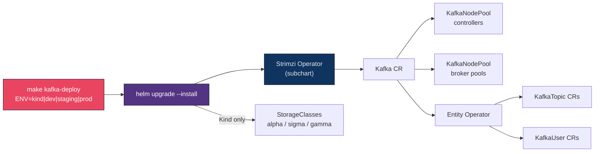
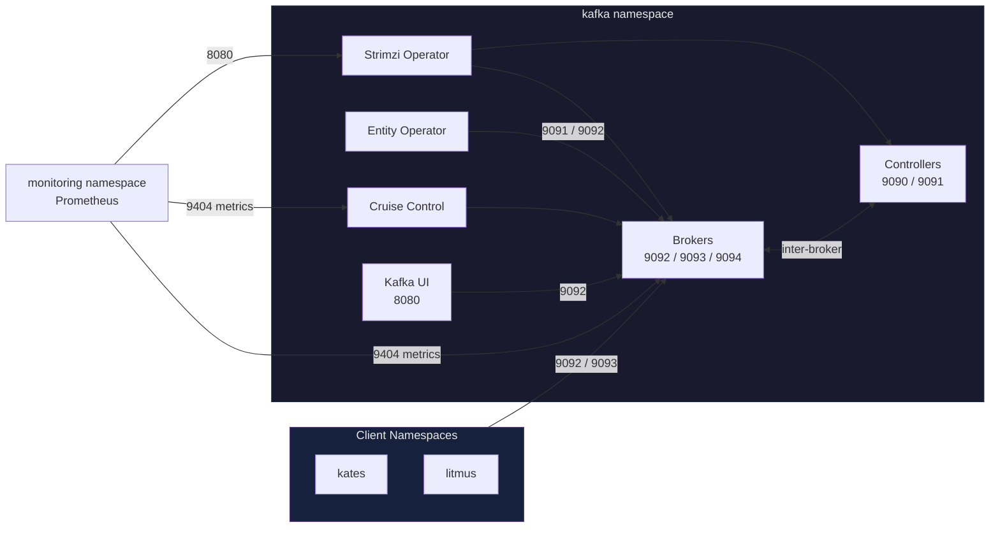

# Kafka Cluster Helm Chart

Production-ready Apache Kafka deployment on Kubernetes using the [Strimzi](https://strimzi.io/) operator with KRaft consensus, zone-aware broker pools, SCRAM-SHA-512 authentication, and full observability.

## Features

- **KRaft Mode** — No ZooKeeper. Native Kafka metadata management via Raft consensus
- **Zone-Aware Broker Pools** — Dedicated `KafkaNodePool` per availability zone for rack-aware replication
- **Security** — SCRAM-SHA-512 + TLS listeners, ACL authorization, per-user quotas, zero-trust NetworkPolicies
- **Observability** — JMX Prometheus exporter, 5 Grafana dashboards, PrometheusRules, PodMonitors
- **Operations** — Cruise Control auto-rebalancing, Drain Cleaner, automated certificate rotation
- **Resilience** — PodDisruptionBudgets, topology spread constraints, graceful preStop hooks
- **Optional** — Tiered Storage (S3/MinIO), Kafka Connect, Velero backups, Kyverno pod security

## Prerequisites

| Requirement | Version |
|-------------|---------|
| Kubernetes | ≥ 1.25 |
| Helm | ≥ 3.12 |
| Strimzi Operator | 1.0.0 (bundled as subchart) |

## Quick Start

### 1. Deploy on a local Kind cluster

```bash
make kafka-deploy              # ENV=kind (default)
```

### 2. Deploy to any Kubernetes cluster

```bash
make kafka-deploy ENV=dev      # minimal single-replica
make kafka-deploy ENV=staging  # production-like topology
make kafka-deploy ENV=prod     # full HA, tiered storage, backup
```

Or use Helm directly:

```bash
helm upgrade --install kafka-cluster charts/kafka-cluster \
  --namespace kafka --create-namespace \
  -f charts/kafka-cluster/values-staging.yaml \
  --wait --timeout 600s
```

To skip the bundled Strimzi operator (already deployed):

```bash
helm upgrade --install kafka-cluster charts/kafka-cluster \
  --namespace kafka --create-namespace \
  --set strimziOperator.enabled=false \
  --wait --timeout 600s
```

### 3. Upgrade

```bash
make kafka-upgrade             # ENV=kind (default)
make kafka-upgrade ENV=prod    # upgrade production
```

### 4. Run tests

```bash
helm test kafka-cluster --namespace kafka
```

Tests run in 9 tiers:

| Tier | Pod | Validates |
|------|-----|-----------|
| 1 | `*-test-connectivity` | Bootstrap TCP, Kafka CR Ready, broker pod health |
| 2 | `*-test-produce-consume` | Round-trip with SCRAM authentication |
| 3 | `*-test-authorization` | KafkaUser readiness, SCRAM secret verification |
| 4 | `*-test-kraft-quorum` | Controller node pool, pod count, KRaft annotation |
| 5 | `*-test-topics` | KafkaTopic CRs ready, partition/replica spec *(gated: `topics.enabled`)* |
| 6 | `*-test-listeners` | Listener bootstrap addresses, TLS CA secrets |
| 7 | `*-test-nodepools` | Broker pool readiness, pod count, node distribution |
| 8 | `*-test-cruise-control` | CruiseControl pod, KafkaRebalance CRD *(gated: `cruiseControl.enabled`)* |
| 9 | `*-test-metrics` | Metrics ConfigMap, exporter pod, PodMonitors |

### 5. Uninstall

```bash
make kafka-undeploy            # helm uninstall + PVC cleanup
```

> **Note:** Resources annotated with `helm.sh/resource-policy: keep` (Kafka CR, NodePools, Topics, Users) are preserved after uninstall to prevent data loss. Delete them manually if needed.

## Environment Overlays

The chart ships with 4 environment-specific overlays, selectable via `ENV`:

```bash
make kafka-deploy              # Kind (default) — layers values-dev + values-kind
make kafka-deploy ENV=dev      # Development
make kafka-deploy ENV=staging  # Staging
make kafka-deploy ENV=prod     # Production
```

| Setting | Kind | Dev | Staging | Prod |
|---------|------|-----|---------|------|
| Controller replicas | 1 | 1 | 3 | 3 |
| Broker pools | 3 (zone-pinned) | 1 | 3 | 3×3 |
| Broker storage | 50Gi | 5Gi | 100Gi | 200Gi |
| Listeners | plain, tls | plain, tls, external | plain, tls, external | plain, tls, external |
| NetworkPolicies | ❌ | ❌ | ✅ | ✅ |
| CruiseControl | ❌ | ❌ | ✅ | ✅ |
| Kafka Exporter | ❌ | ❌ | ✅ | ✅ |
| Tiered Storage | ❌ | ❌ | ❌ | ✅ |
| Backup | ❌ | ❌ | ✅ | ✅ |
| Pod Security | ❌ | ❌ | Enforce | Enforce |
| Tolerations | control-plane | — | — | — |

The **Kind** overlay (`values-kind.yaml`) layers on top of `values-dev.yaml` and adds:
- Zone-specific broker pools with `local-storage-*` StorageClasses
- Control-plane node tolerations
- Simplified listeners (no external NodePort)
- All cloud/production features disabled

## Architecture

### Cluster Components



### Deployment Flow



### Network Topology



## Configuration Reference

### Cluster Identity

| Parameter | Description | Default |
|-----------|-------------|---------|
| `clusterName` | Kafka cluster name (Kubernetes resource name) | `krafter` |
| `kafkaVersion` | Apache Kafka version | `4.2.0` |
| `strimziVersion` | Strimzi operator version | `1.0.0` |

### Global Image Configuration

Override these to pull all images from a private or air-gapped registry:

| Parameter | Description | Default |
|-----------|-------------|---------|
| `global.imageRegistry` | Container image registry for all chart images | `quay.io` |
| `global.imageRepository` | Container image repository (org/project) | `strimzi` |
| `images.kafka` | Kafka client image (Helm test tier 2) | `quay.io/strimzi/kafka:1.0.0-kafka-4.2.0` |
| `images.kubectl` | kubectl image (Helm tests + CRD upgrade hook) | `bitnami/kubectl:1.33.0` |

Example: redirect all images to a private registry:

```yaml
global:
  imageRegistry: "my-registry.example.com"
  imageRepository: "strimzi"
images:
  kafka: "my-registry.example.com/strimzi/kafka:1.0.0-kafka-4.2.0"
  kubectl: "my-registry.example.com/bitnami/kubectl:1.33.0"
```

### Listeners

Define Kafka listeners in `kafka.listeners`:

```yaml
kafka:
  listeners:
    - name: plain           # Internal SCRAM (no TLS)
      port: 9092
      type: internal
      tls: false
      authentication:
        type: scram-sha-512
    - name: tls             # Internal mutual TLS
      port: 9093
      type: internal
      tls: true
      authentication:
        type: tls
    - name: external        # NodePort with TLS + SCRAM
      port: 9094
      type: nodeport
      tls: true
      authentication:
        type: scram-sha-512
      configuration:
        bootstrap:
          nodePort: 32100
```

Supported listener types: `internal`, `route`, `loadbalancer`, `nodeport`, `ingress`, `cluster-ip`.
Supported auth types: `scram-sha-512`, `tls`, `tls-external`.

### Authorization & Super Users

```yaml
kafka:
  authorization:
    type: simple       # ACL-based authorization
    superUsers:
      - kates-backend  # Bypass ACLs for this user
```

Supported types: `simple`, `opa`, `keycloak`, `custom`.

### Broker Configuration

Kafka broker properties are set via `kafka.config`:

```yaml
kafka:
  config:
    min.insync.replicas: 2
    default.replication.factor: 3
    log.retention.hours: 24
    log.retention.bytes: 10737418240   # 10 GiB
    auto.create.topics.enable: false
    message.max.bytes: 10485760        # 10 MiB
    group.share.enable: true           # Kafka 4.x Share Groups
```

### KRaft Controllers

| Parameter | Description | Default |
|-----------|-------------|---------|
| `controllers.replicas` | Number of KRaft controllers (1-9) | `3` |
| `controllers.storage.size` | PVC size per controller | `5Gi` |
| `controllers.storage.class` | StorageClass name | `standard` |
| `controllers.jvmOptions.-Xms` | JVM initial heap | `512m` |
| `controllers.jvmOptions.-Xmx` | JVM max heap | `512m` |
| `controllers.resources.requests.memory` | Memory request | `1Gi` |
| `controllers.resources.limits.cpu` | CPU limit | `1000m` |
| `controllers.priorityClassName` | PriorityClass for controller pods | `""` |

### Zone-Aware Broker Pools

Each pool creates a `KafkaNodePool` CR pinned to an availability zone:

```yaml
brokerPools:
  - name: brokers-az1
    zone: us-east-1a           # availability zone label
    replicas: 1
    storageSize: 50Gi
    storageClass: standard     # Kubernetes StorageClass

  - name: brokers-az2
    zone: us-east-1b
    replicas: 1
    storageSize: 50Gi
    storageClass: standard

  - name: brokers-az3
    zone: us-east-1c
    replicas: 1
    storageSize: 50Gi
    storageClass: standard
```

The default configuration provides three broker pools spread across `us-east-1a`, `us-east-1b`, and `us-east-1c` with the `standard` StorageClass. Override per environment:

- **Kind:** `local-storage-alpha`, `local-storage-sigma`, `local-storage-gamma` (see `values-kind.yaml`)
- **AWS:** `gp3`
- **GCP:** `standard-rwo`
- **Azure:** `managed-csi`

Shared defaults for all pools are in `brokerDefaults`:

| Parameter | Description | Default |
|-----------|-------------|---------|
| `brokerDefaults.jvmOptions.-Xmx` | Max heap per broker | `2048m` |
| `brokerDefaults.resources.requests.memory` | Memory request | `4Gi` |
| `brokerDefaults.resources.limits.cpu` | CPU limit | `2000m` |
| `brokerDefaults.deleteClaim` | Delete PVC on pool removal | `false` |
| `brokerDefaults.priorityClassName` | PriorityClass for broker pods | `""` |

### Topics

Declarative topic management via `KafkaTopic` CRs:

```yaml
topics:
  - name: my-topic
    partitions: 6
    replicas: 3
    config:
      retention.ms: "172800000"      # 2 days
      min.insync.replicas: "2"
      cleanup.policy: delete
      compression.type: lz4
```

### Users

Declarative user management with SCRAM/TLS auth, quotas, and fine-grained ACLs:

```yaml
users:
  - name: my-app
    authentication:
      type: scram-sha-512
    quotas:
      producerByteRate: 52428800     # 50 MB/s
      consumerByteRate: 104857600    # 100 MB/s
      requestPercentage: 25
    authorization:
      type: simple
      acls:
        - resource:
            type: topic
            name: "my-topic"
            patternType: literal
          operations: ["Read", "Write", "Describe"]
          host: "*"
```

### Certificate Authority

Automated certificate rotation with zero-downtime:

| Parameter | Description | Default |
|-----------|-------------|---------|
| `kafka.clusterCa.validityDays` | CA certificate lifetime | `1825` (5 years) |
| `kafka.clusterCa.renewalDays` | Renew before expiry | `180` (6 months) |
| `kafka.clusterCa.certificateExpirationPolicy` | On renewal: `replace-key` or `renew-certificate` | `replace-key` |

The same config applies to `kafka.clientsCa`.

### Cruise Control

Automated partition rebalancing:

| Parameter | Description | Default |
|-----------|-------------|---------|
| `cruiseControl.enabled` | Enable Cruise Control | `true` |
| `cruiseControl.brokerCapacity.cpu` | Broker CPU capacity | `2000m` |
| `cruiseControl.brokerCapacity.inboundNetwork` | Network capacity | `50MiB/s` |
| `cruiseControl.autoRebalance` | Auto-rebalance triggers | `add-brokers`, `remove-brokers` |

### Pod Scheduling & Priority

| Parameter | Description | Default |
|-----------|-------------|---------|
| `controllers.priorityClassName` | PriorityClass for controllers | `""` |
| `brokerDefaults.priorityClassName` | PriorityClass for all broker pools | `""` |
| `controllers.topologySpreadConstraints.enabled` | Spread controllers across zones | `true` |
| `brokerDefaults.topologySpreadConstraints.enabled` | Spread brokers across zones | `true` |
| `controllers.podAntiAffinity.enabled` | Anti-affinity for controllers | `true` |
| `brokerDefaults.podAntiAffinity.enabled` | Anti-affinity for brokers | `true` |

Example for production with a custom PriorityClass:

```yaml
controllers:
  priorityClassName: kafka-critical
brokerDefaults:
  priorityClassName: kafka-critical
```

### Kernel Tuning (sysctl)

A privileged init container can tune kernel parameters before Kafka starts:

| Parameter | Description | Default |
|-----------|-------------|---------|
| `controllers.sysctl.enabled` | Enable sysctl init container for controllers | `false` |
| `brokerDefaults.sysctl.enabled` | Enable sysctl init container for brokers | `false` |
| `*.sysctl.image` | Init container image | `busybox:1.37` |
| `*.sysctl.params` | Map of sysctl key-value pairs | See below |

Default parameters (when enabled):

| Sysctl Key | Value | Purpose |
|------------|-------|---------|
| `vm.max_map_count` | `262144` | Required for Kafka's memory-mapped files |
| `net.core.somaxconn` | `16384` | Higher socket backlog for connection-heavy brokers |
| `vm.swappiness` | `1` | Minimize swapping to prevent latency spikes |

```yaml
brokerDefaults:
  sysctl:
    enabled: true
    image: busybox:1.37
    params:
      vm.max_map_count: "262144"
      net.core.somaxconn: "16384"
      vm.swappiness: "1"
      net.ipv4.tcp_tw_reuse: "1"    # add custom params
```

> **Note:** The init container runs as `privileged: true` with `runAsUser: 0`. The host kernel must allow these sysctl writes (most cloud providers do by default). In Kind clusters, these sysctls may already be set at the node level.

### Lifecycle & Graceful Shutdown

| Parameter | Description | Default |
|-----------|-------------|---------|
| `lifecycle.preStopSleepSeconds` | Seconds to wait before SIGTERM (0-120) | `15` |

The chart auto-calculates `terminationGracePeriodSeconds` = `preStopSleepSeconds + 30`.

### RBAC

| Parameter | Description | Default |
|-----------|-------------|---------|
| `rbac.create` | Create ServiceAccount, Role, RoleBinding | `true` |
| `rbac.extraRules` | Additional RBAC rules to append | `[]` |
| `serviceAccount.annotations` | Annotations on the ServiceAccount | `{}` |

Extension example for Litmus Chaos integration:

```yaml
rbac:
  extraRules:
    - apiGroups: ["litmuschaos.io"]
      resources: ["chaosengines", "chaosexperiments"]
      verbs: ["get", "list", "create", "delete"]
```

### Network Policies

Zero-trust network segmentation:

| Parameter | Description | Default |
|-----------|-------------|---------|
| `networkPolicies.enabled` | Enable default-deny + allow rules | `true` |
| `networkPolicies.allowedClientNamespaces` | Namespaces allowed to reach brokers | `[kates, litmus]` |
| `networkPolicies.monitoringNamespace` | Namespace for Prometheus scrape access | `monitoring` |

Created policies: `default-deny`, `allow-dns`, `kafka-brokers`, `kafka-controllers`, `strimzi-operator`, `kafka-ui`, `cruise-control`, `strimzi-drain-cleaner`, `kafka-connect`, `kafka-mirror-maker`, `entity-operator`, `kafka-exporter` (12 total).

### Observability

#### Grafana Dashboards

| Parameter | Description | Default |
|-----------|-------------|---------|
| `dashboards.enabled` | Deploy dashboard ConfigMaps | `true` |
| `dashboards.namespace` | Target Grafana namespace | `monitoring` |
| `dashboards.brokerDashboard` | Broker metrics (handlers, ISR, JVM) | `true` |
| `dashboards.kraftDashboard` | KRaft quorum metrics | `true` |
| `dashboards.cruiseControlDashboard` | CC balancedness + proposals | `true` |
| `dashboards.connectDashboard` | Connect task/connector metrics | `false` |

#### Prometheus Alerts

| Parameter | Description | Default |
|-----------|-------------|---------|
| `alerts.enabled` | Create PrometheusRule | `true` |
| `alerts.labels` | Labels for rule discovery | `{release: monitoring}` |

#### PodMonitors

| Parameter | Description | Default |
|-----------|-------------|---------|
| `podMonitors.enabled` | Create PodMonitors for Prometheus | `true` |
| `podMonitors.labels` | Labels for discovery | `{release: monitoring}` |

### Tiered Storage (S3/MinIO)

```yaml
tieredStorage:
  enabled: true
  s3:
    bucketName: kafka-tiered-storage
    region: us-east-1
    endpointUrl: "http://minio.velero.svc:9000"
    pathStyleAccessEnabled: true
  credentials:
    existingSecret: ""              # Use an existing secret, or...
    accessKeyId: minio              # ...provide inline credentials
    secretAccessKey: minio123
  retention:
    localRetentionMs: 86400000      # Keep 1 day locally
```

### Kafka Connect

| Parameter | Description | Default |
|-----------|-------------|---------|
| `kafkaConnect.enabled` | Deploy KafkaConnect CR | `false` |
| `kafkaConnect.replicas` | Worker replicas | `1` |
| `kafkaConnect.version` | Kafka version (defaults to `kafkaVersion`) | `""` |
| `kafkaConnect.groupId` | Connect cluster group ID | `kates-connect-cluster` |

#### JVM Tuning

```yaml
kafkaConnect:
  jvmOptions:
    -Xms: 256m
    -Xmx: 512m
    gcLoggingEnabled: true
    javaSystemProperties:
      - name: com.sun.management.jmxremote
        value: "true"
```

#### Converters & Extra Config

```yaml
kafkaConnect:
  config:
    keyConverter: io.apicurio.registry.utils.converter.AvroConverter
    valueConverter: io.apicurio.registry.utils.converter.AvroConverter
    keyConverterSchemasEnable: false
    valueConverterSchemasEnable: false
  extraConfig:
    schema.registry.url: http://apicurio-registry:8080/apis/ccompat/v7
    producer.acks: "all"
    consumer.auto.offset.reset: earliest
```

#### Logging

```yaml
kafkaConnect:
  logging:
    type: inline
    loggers:
      connect.root.logger.level: INFO
      log4j.logger.org.apache.kafka.connect.runtime.WorkerSourceTask: TRACE
```

#### TLS & Rack Awareness

```yaml
kafkaConnect:
  tls:
    enabled: true
    trustedCertificates:
      - secretName: krafter-cluster-ca-cert
        certificate: ca.crt
  rack:
    enabled: true
    topologyKey: topology.kubernetes.io/zone
```

#### Scheduling & Probes

| Parameter | Description | Default |
|-----------|-------------|---------|
| `kafkaConnect.tolerations` | Pod tolerations | `[]` |
| `kafkaConnect.topologySpreadConstraints.enabled` | Enable topology spread | `false` |
| `kafkaConnect.podAntiAffinity.enabled` | Enable pod anti-affinity | `false` |
| `kafkaConnect.readinessProbe.initialDelaySeconds` | Readiness probe delay | `60` |
| `kafkaConnect.livenessProbe.initialDelaySeconds` | Liveness probe delay | `60` |
| `kafkaConnect.autoRestart.enabled` | Auto-restart failed tasks | `true` |
| `kafkaConnect.autoRestart.maxRestarts` | Max restart attempts | `10` |

#### Build (Custom Plugins)

```yaml
kafkaConnect:
  build:
    output:
      type: docker
      image: my-registry/my-connect:latest
      pushSecret: my-registry-credentials
    plugins:
      - name: debezium-postgres
        artifacts:
          - type: maven
            group: io.debezium
            artifact: debezium-connector-postgres
            version: 2.5.0.Final
```

#### Declarative Connectors

Define `KafkaConnector` CRs directly in values:

```yaml
kafkaConnect:
  connectors:
    - name: my-source-connector
      class: io.debezium.connector.postgresql.PostgresConnector
      tasksMax: 1
      autoRestart:
        enabled: true
        maxRestarts: 5
      config:
        database.hostname: postgres.default.svc
        database.port: "5432"
        database.dbname: mydb
        topic.prefix: cdc
```

### Backup Strategy

> [!CAUTION]
> **NetBackup (Veritas) and any block/file-level backup agent MUST NOT be used for this cluster.**
> See [Why NetBackup is Incompatible with Kafka](#why-netbackup-is-incompatible-with-kafka) below.

Kafka backup is a **two-layer concern** — treating it as a single operation (like backing up a database) leads to data loss, corrupt restores, or impossibly long RTOs.

#### Layer 1 — Topic Data Durability (Kafka Tiered Storage)

Kafka's native **Remote Log Storage (RLS)** API continuously offloads closed log segments to an S3-compatible object store as they are rolled. This happens automatically, inside the broker, with zero RPO for data that has been acknowledged.

- When a broker restarts or is replaced, it re-fetches its log segments from the object store — **no restore operation needed**
- PVC snapshots of broker data directories become **unnecessary and redundant** once this is enabled
- Controlled per-topic: set `remote.storage.enable: "true"` and a `retention.ms` longer than `local.retention.ms`

```yaml
tieredStorage:
  enabled: true
  s3:
    bucketName: kafka-tiered-storage
    region: us-east-1
    endpointUrl: "http://seaweedfs-filer.seaweedfs.svc:8333"  # S3-compatible endpoint
    pathStyleAccessEnabled: true
  credentials:
    existingSecret: "kafka-tiered-storage-credentials"
  retention:
    localRetentionMs: 86400000      # keep 1 day on local disk
    # remote retention is controlled per-topic via retention.ms
```

#### Layer 2 — Cluster Topology Backup (Velero)

Velero captures the **Kubernetes objects** that describe the cluster — the Strimzi CRDs, Secrets, and ConfigMaps. This allows full cluster reconstruction without needing broker PVC snapshots.

```yaml
backup:
  enabled: true
  schedule: "0 2 * * *"
  ttl: 336h0m0s          # 14 days
  snapshotVolumes: false  # broker PVCs are covered by tiered storage — do NOT snapshot them
```

> [!IMPORTANT]
> `snapshotVolumes` **must be `false`** in production. With tiered storage enabled, snapshotting broker PVCs is pure waste (3× storage duplication across replica nodes) and produces crash-consistent images that cannot be used for safe incremental restores anyway.
>
> Velero only needs to backup the **controller PVCs** (KRaft quorum log, 1 Gi each) and Kubernetes objects. The `backup.yaml` template uses `labelSelector: strimzi.io/pool-name: controllers` to enforce this scope.

Velero backup scope (what is captured):

| Resource | Why |
|---|---|
| `kafka.kafka.strimzi.io` | Cluster definition (listeners, auth, config) |
| `kafkanodepool.kafka.strimzi.io` | Broker pool topology |
| `kafkatopic.kafka.strimzi.io` | Topic declarations (partitions, replication, config) |
| `kafkauser.kafka.strimzi.io` | User ACLs and authentication config |
| `Secret` (SCRAM passwords, TLS certs) | Credential recovery |
| `ConfigMap` | Cruise Control, metrics configs |
| Controller PVCs | KRaft quorum metadata |

Broker PVCs are **excluded** — their data lives in the object store via tiered storage.

#### Velero Configuration Parameters

| Parameter | Description | Default |
|-----------|-------------|---------|
| `backup.enabled` | Create Velero Schedule + pre-upgrade Backup | `false` |
| `backup.schedule` | Cron schedule | `0 2 * * *` |
| `backup.ttl` | Backup retention | `168h0m0s` (7 days) |
| `backup.snapshotVolumes` | Snapshot PVCs (set `false` with tiered storage) | `false` |
| `backup.persistence.enabled` | Create PVC for backup scratch storage | `false` |
| `backup.persistence.size` | PVC size | `20Gi` |

---

### Why NetBackup is Incompatible with Kafka

NetBackup (Veritas) is a **block- and file-level** backup agent designed for traditional storage workloads (databases with point-in-time recovery, filesystems, virtual machine images). Its model conflicts with Kafka's architecture at every level.

#### 1. Snapshots are crash-consistent, not application-consistent

NetBackup (and any PVC snapshot tool without a Kafka-aware pre-freeze hook) captures the broker's data directory **mid-write**. A Kafka log segment being written at snapshot time will be partially flushed to disk. On restore:

- Index files reference offsets that do not exist in the data file
- The log verifier rejects the segment and truncates it
- Downstream consumers that already read those offsets receive a gap or duplicate range
- The replica-set reconciliation protocol treats the divergent broker as corrupted and triggers a full re-fetch — defeating the purpose of the snapshot

Kafka does not expose a filesystem-level quiesce API. There is no equivalent of `FLUSH TABLES WITH READ LOCK` for broker log segments.

#### 2. Replica factor creates false redundancy

Kafka clusters with `replication.factor: 3` store **three identical copies** of every log segment across three brokers. A NetBackup job that snapshots all broker PVCs captures the same data three times with no additional protection. The three replicas fail identically (e.g. corruption of a specific offset range) because they share the same data at snapshot time.

At 200 Gi per broker × 9 brokers (production pool), this is **1.8 Ti of backup data** for 600 Gi of unique content — a 3× amplification with zero RPO improvement.

#### 3. No topic-level or consumer-group granularity

NetBackup restores at the PVC level. A restore operation brings back the **entire cluster**, including all topics, all partitions, and all consumer group offsets — from a point in time that may be hours in the past.

There is no way to:
- Restore a single topic without restoring the entire broker
- Restore consumer group offsets independently of topic data
- Replay only the messages a specific consumer missed

The minimum restore unit is the full cluster, with a guaranteed data gap proportional to the backup interval.

#### 4. Agent installation conflicts with the immutable container model

NetBackup requires a client agent running inside each container (or on the host). The Strimzi operator manages Kafka pod specs directly via `StrimziPodSet`. Any sidecar or init-container injected by NetBackup:

- Is not declared in the `KafkaNodePool` spec and will be removed on the next Strimzi reconciliation
- Requires a privileged security context that conflicts with `PodSecurityPolicy: Restricted`
- Cannot be version-controlled alongside the Helm chart

#### 5. RTO is measured in hours, not seconds

A full cluster restore from NetBackup requires:
1. Provision new PVCs on every broker node
2. Stream 200 Gi per node from the backup server (network-bound)
3. Start each broker and wait for it to verify its log segments
4. Wait for replica sync across the full partition set

In a 9-broker production cluster this takes **4–8 hours** before any consumer can reconnect. With Kafka Tiered Storage, a replacement broker fetches only the hot segments from the local object store and is available for reads **within minutes**.

#### 6. Consumer offset integrity is not preserved

`__consumer_offsets` is itself a Kafka topic. Its content at snapshot time reflects the committed offsets of all consumer groups at that moment. After a restore to a snapshot taken at `T-8h`:

- All consumers that committed offsets between `T-8h` and `T` are reset to `T-8h`
- Consumers using `auto.offset.reset: latest` will skip the 8-hour gap entirely
- Consumers using `auto.offset.reset: earliest` will reprocess 8 hours of messages

Neither outcome is acceptable for an event-driven microservices architecture.

#### Correct Alternative

Use the **two-layer strategy** described above:
- **Tiered Storage** → continuous, zero-RPO, topic-level log durability with no restore operation
- **Velero** → daily snapshot of Kubernetes objects (CRDs, Secrets) only; no broker PVC snapshots

### Strimzi Operator (Subchart)

| Parameter | Description | Default |
|-----------|-------------|---------|
| `strimziOperator.enabled` | Deploy the Strimzi operator subchart | `true` |
| `strimzi-kafka-operator.replicas` | Operator replicas | `1` |
| `strimzi-kafka-operator.watchAnyNamespace` | Watch all namespaces | `true` |
| `strimzi-kafka-operator.resources.limits.memory` | Operator memory limit | `512Mi` |

Set `strimziOperator.enabled: false` if the operator is already installed in the cluster.

### Drain Cleaner

| Parameter | Description | Default |
|-----------|-------------|---------|
| `drainCleaner.enabled` | Deploy Strimzi Drain Cleaner | `true` |
| `drainCleaner.image` | Container image | `quay.io/strimzi/drain-cleaner:1.0.0` |

### Pod Security

| Parameter | Description | Default |
|-----------|-------------|---------|
| `podSecurityPolicy.enabled` | Create Kyverno ClusterPolicy | `false` |
| `podSecurityPolicy.action` | `Audit` or `Enforce` | `Audit` |

## Makefile Targets

### Deployment

```bash
make kafka-deploy              # Deploy to Kind (default)
make kafka-deploy ENV=staging  # Deploy with staging overlay
make kafka-deploy ENV=prod     # Deploy with production overlay
make kafka-upgrade             # Upgrade existing release (ENV=kind default)
make kafka-undeploy            # Uninstall + PVC cleanup
```

### Chart Development

```bash
make kafka-chart-deps       # Download dependencies
make kafka-chart-lint       # Lint all environments
make kafka-chart-template   # Render templates → .build/kafka-rendered.yaml
make kafka-chart-package    # Package → .build/kafka-cluster-0.1.0.tgz
make kafka-chart-push       # Push to OCI registry
make kafka-chart-test       # Run helm test against live cluster
make kafka-chart-all        # deps + lint + template + package
```

Override the registry: `make kafka-chart-push CHART_REGISTRY=oci://my-registry/charts`

## Connecting to the Cluster

### From inside the cluster (SCRAM)

```bash
bootstrap: <clusterName>-kafka-bootstrap.<namespace>.svc:9092
security.protocol: SASL_PLAINTEXT
sasl.mechanism: SCRAM-SHA-512
sasl.jaas.config: ...ScramLoginModule required username="my-user" password="<from-secret>";
```

Retrieve the SCRAM password:

```bash
kubectl get secret my-user -n kafka \
  -o jsonpath='{.data.password}' | base64 -d
```

### From outside the cluster (NodePort + TLS)

```bash
bootstrap: <node-ip>:32100
security.protocol: SASL_SSL
sasl.mechanism: SCRAM-SHA-512
ssl.truststore.location: /path/to/truststore.p12
```

Extract the cluster CA certificate:

```bash
kubectl get secret <clusterName>-cluster-ca-cert -n kafka \
  -o jsonpath='{.data.ca\.crt}' | base64 -d > ca.crt
```

## Troubleshooting

### Cluster not becoming Ready

```bash
kubectl get kafka <clusterName> -n kafka -o yaml | yq '.status'
kubectl get pods -n kafka -l strimzi.io/cluster=<clusterName>
kubectl logs -n kafka <pod-name> --tail=50
```

### SASL handshake failures

If you see `Unexpected Kafka request of type METADATA during SASL handshake` in broker logs, a client is connecting without SASL to a SASL-protected listener. Verify:

```bash
# Check listener configuration
kubectl get kafka <clusterName> -n kafka -o jsonpath='{.spec.kafka.listeners}' | python3 -m json.tool

# Check client security.protocol matches the listener
```

### CRD version mismatch

If Strimzi CRDs are outdated, the CRD upgrade hook runs automatically on `helm install`. To run manually:

```bash
kubectl apply -f https://strimzi.io/install/latest?namespace=kafka --server-side
```

### Rolling restart stuck

Check PodDisruptionBudget:

```bash
kubectl get pdb -n kafka
kubectl describe pdb <clusterName>-kafka -n kafka
```

## Schema Validation

The chart includes `values.schema.json` for install-time validation. Coverage includes:

| Section | Validated Fields |
|---------|------------------|
| `clusterName` | Pattern (`^[a-z0-9]`), length 1–63 |
| `controllers` | Replicas 1–9, storage size pattern, JVM options, priorityClassName |
| `brokerPools` | Required name/replicas/storageSize, replicas 1–100 |
| `brokerDefaults` | Resources, JVM, topology, anti-affinity, priorityClassName |
| `kafkaConnect` | JVM, config (converters, replication), logging, TLS, rack, autoRestart, probes, connectors (name+class required), build |
| `tieredStorage` | Enabled flag, credentials |
| `backup` | Schedule pattern, TTL pattern, snapshot, persistence |
| `lifecycle` | preStopSleepSeconds 0–120 |

```bash
helm install kafka-cluster charts/kafka-cluster --set controllers.replicas=-1
# Error: at '/controllers/replicas': minimum: got -1, want 1

helm install kafka-cluster charts/kafka-cluster --set lifecycle.preStopSleepSeconds=999
# Error: at '/lifecycle/preStopSleepSeconds': maximum: got 999, want 120

helm install kafka-cluster charts/kafka-cluster \
  --set 'kafkaConnect.connectors[0].tasksMax=1'
# Error: at '/kafkaConnect/connectors/0': missing required: name, class
```
