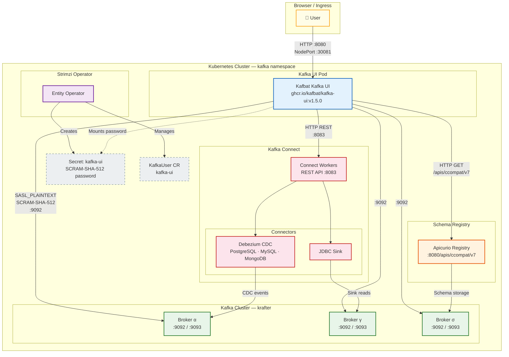

# Kafka UI Helm Chart

A Helm chart for deploying [Kafbat Kafka UI](https://github.com/kafbat/kafka-ui) on Kubernetes with first-class support for Strimzi-managed Kafka clusters, Apicurio Schema Registry, and Kafka Connect.

> **Note** — This chart uses the actively maintained **Kafbat** fork (`ghcr.io/kafbat/kafka-ui`), which is the community continuation of the original Provectus Kafka UI. The old `provectuslabs/kafka-ui` image is deprecated and contains known security vulnerabilities.

## Architecture

The following diagram shows how Kafka UI integrates with the existing Kates platform components. Kafka UI acts as a unified observability layer, connecting to the Kafka brokers for topic and consumer group inspection, to Apicurio Schema Registry for schema visibility, and to Kafka Connect for connector management.



### Data Flow Summary

| Connection | Protocol | Port | Purpose |
|------------|----------|------|---------|
| User → Kafka UI | HTTP | 8080 (NodePort 30081) | Web dashboard access |
| Kafka UI → Kafka Brokers | SASL_PLAINTEXT / SASL_SSL | 9092 / 9093 | Topic browsing, consumer group monitoring, message inspection |
| Kafka UI → Apicurio Registry | HTTP | 8080 | Schema listing, compatibility checks, schema content display |
| Kafka UI → Kafka Connect | HTTP REST | 8083 | Connector CRUD, task status, restart operations |
| Entity Operator → Secret | Internal | — | Auto-generates SCRAM-SHA-512 credentials from the KafkaUser CR |
| Kafka UI → Secret | Volume mount | — | Reads the password for broker authentication |

## Prerequisites

| Component | Required | Version |
|-----------|----------|---------|
| Kubernetes | Yes | ≥ 1.27 |
| Helm | Yes | ≥ 3.x |
| Strimzi Kafka Operator | Yes | ≥ 0.40 |
| A running Kafka cluster | Yes | Managed by Strimzi |
| Apicurio Schema Registry | Optional | ≥ 3.x |
| Kafka Connect (Strimzi) | Optional | ≥ 4.x |

The chart expects a Strimzi `KafkaUser` with SCRAM-SHA-512 authentication. By default, the chart creates a `KafkaUser` named `kafka-ui` with read-only ACLs. If the `KafkaUser` is managed elsewhere (e.g., by the Kafka cluster chart), set `kafkaUser.enabled: false`.

## Quick Start

```bash
# Install with default settings (connects to the "krafter" Kafka cluster)
helm install kafka-ui charts/kafka-ui --namespace kafka

# Install with the Kind (local development) profile
helm install kafka-ui charts/kafka-ui \
  -f charts/kafka-ui/values-kind.yaml \
  --namespace kafka

# Upgrade an existing release
helm upgrade kafka-ui charts/kafka-ui \
  -f charts/kafka-ui/values-kind.yaml \
  --namespace kafka
```

## Image Configuration

The container image is fully customizable. By default, the chart pulls `ghcr.io/kafbat/kafka-ui` with the tag matching the chart's `appVersion`.

```yaml
image:
  repository: ghcr.io/kafbat/kafka-ui
  tag: ""              # defaults to Chart.appVersion (v1.5.0)
  pullPolicy: IfNotPresent
  digest: ""           # set to "sha256:..." for digest-pinned deployments

# For private registries
imagePullSecrets:
  - name: my-registry-credentials
```

When `image.digest` is set, it takes precedence over `image.tag` and the resulting image reference becomes `repository@sha256:...`.

## Connecting to Kafka

The chart auto-computes the Kafka bootstrap servers from the `kafka.clusterName` and the release namespace. You can override this behavior with an explicit bootstrap address.

### Auto-Discovery (Default)

```yaml
kafka:
  clusterName: "krafter"          # name of the Strimzi Kafka CR
  # bootstrapServers is auto-computed as:
  #   krafter-kafka-bootstrap.<namespace>.svc.cluster.local:9092
```

The chart selects port `9092` (SASL_PLAINTEXT) by default, or port `9093` (SASL_SSL) when TLS is enabled.

### Explicit Bootstrap

```yaml
kafka:
  bootstrapServers: "my-kafka-bootstrap.production.svc:9093"
  tls:
    enabled: true
```

### Authentication

Kafka UI authenticates to the Kafka cluster using SCRAM-SHA-512. The chart creates a Strimzi `KafkaUser` resource, and the Strimzi Entity Operator generates a Kubernetes Secret containing the password. The Deployment mounts this Secret as an environment variable.

```yaml
kafkaUser:
  enabled: true          # set to false if managed externally
  name: "kafka-ui"       # name of the KafkaUser and its Secret
  quotas:
    producerByteRate: 1048576
    consumerByteRate: 52428800
    requestPercentage: 10
  acls:                  # read-only by default
    - resource:
        type: topic
        name: "*"
        patternType: literal
      operations: ["Describe", "Read"]
    - resource:
        type: group
        name: "*"
        patternType: literal
      operations: ["Describe", "Read"]
    - resource:
        type: cluster
      operations: ["Describe"]
```

## Integrating Apicurio Schema Registry

When enabled, the Kafka UI displays schema information (Avro, JSON Schema, Protobuf) for each topic directly in the browser.

```yaml
schemaRegistry:
  enabled: true
  # Explicit URL to Apicurio's Confluent-compatible API
  url: "http://apicurio-apicurio-registry.kafka.svc:8080/apis/ccompat/v7"
```

If `url` is left empty, the chart auto-computes it as `http://apicurio-apicurio-registry.<namespace>.svc.cluster.local:8080/apis/ccompat/v7`.

For registries that require authentication:

```yaml
schemaRegistry:
  enabled: true
  url: "https://registry.example.com/apis/ccompat/v7"
  auth:
    enabled: true
    username: "admin"
    password: "secret"
```

## Integrating Kafka Connect

When enabled, the Kafka UI shows the running connectors, their status, tasks, and configuration. You can also create and manage connectors directly from the web interface.

```yaml
kafkaConnect:
  enabled: true
  name: "connect-cluster"     # display name in the UI
  # Explicit URL to the Kafka Connect REST API
  url: "http://connect-cluster-connect-api.kafka.svc:8083"
```

If `url` is left empty, the chart auto-computes it as `http://connect-cluster-connect-api.<namespace>.svc.cluster.local:8083`.

## Environment Profiles

The chart ships with four value overlays for different environments. Use the `-f` flag to apply them on top of the base `values.yaml`.

| Profile | File | Description |
|---------|------|-------------|
| **Kind** | `values-kind.yaml` | Local development on Kind clusters. NodePort on 30081, Schema Registry + Connect enabled, lower resources, startup probe. |
| **Dev** | `values-dev.yaml` | Development/staging clusters. Schema Registry + Connect enabled, startup probe, lower resources. |
| **Prod** | `values-prod.yaml` | Production. 2 replicas, TLS enabled, Ingress with nginx, LOGIN_FORM auth, Schema Registry + Connect enabled. |
| **Generic** | `values-generic.yaml` | Minimal — disables NetworkPolicy for clusters without a CNI that supports it. |

### Example: Full Local Stack

```bash
helm install kafka-ui charts/kafka-ui \
  -f charts/kafka-ui/values-kind.yaml \
  --namespace kafka
```

This deploys Kafka UI with:
- NodePort on `30081` for browser access
- Schema Registry pointing to the local Apicurio instance
- Kafka Connect pointing to the local `connect-cluster`
- Startup probe for slow-starting Kind environments
- Reduced resource requests (100m CPU, 256Mi memory)

### Example: Production

```bash
helm install kafka-ui charts/kafka-ui \
  -f charts/kafka-ui/values-prod.yaml \
  --namespace kafka \
  --set kafka.tls.enabled=true \
  --set ingress.hosts[0].host=kafka-ui.mycompany.com
```

## Accessing the UI

The access method depends on the `service.type`:

```bash
# NodePort (Kind / dev)
export NODE_IP=$(kubectl get nodes -o jsonpath='{.items[0].status.addresses[?(@.type=="InternalIP")].address}')
echo "http://${NODE_IP}:30081"

# ClusterIP (port-forward)
kubectl port-forward svc/kafka-ui 8080:8080 -n kafka
echo "http://localhost:8080"

# Ingress (production)
echo "https://kafka-ui.mycompany.com"
```

## Parameters Reference

### Image

| Parameter | Default | Description |
|-----------|---------|-------------|
| `image.repository` | `ghcr.io/kafbat/kafka-ui` | Container image repository |
| `image.tag` | `""` (Chart.appVersion) | Image tag |
| `image.pullPolicy` | `IfNotPresent` | Image pull policy |
| `image.digest` | `""` | Image digest (overrides tag) |
| `imagePullSecrets` | `[]` | Registry pull secrets |

### Kafka

| Parameter | Default | Description |
|-----------|---------|-------------|
| `kafka.clusterName` | `krafter` | Strimzi Kafka CR name |
| `kafka.namespace` | `""` (release namespace) | Kafka cluster namespace |
| `kafka.bootstrapServers` | `""` (auto-computed) | Bootstrap servers override |
| `kafka.clusterDomain` | `cluster.local` | Kubernetes cluster domain |
| `kafka.tls.enabled` | `false` | Enable TLS (port 9093) |

### Schema Registry

| Parameter | Default | Description |
|-----------|---------|-------------|
| `schemaRegistry.enabled` | `false` | Enable Schema Registry integration |
| `schemaRegistry.url` | `""` (auto-computed) | Schema Registry URL |
| `schemaRegistry.auth.enabled` | `false` | Enable authentication |
| `schemaRegistry.auth.username` | `""` | Auth username |
| `schemaRegistry.auth.password` | `""` | Auth password |

### Kafka Connect

| Parameter | Default | Description |
|-----------|---------|-------------|
| `kafkaConnect.enabled` | `false` | Enable Kafka Connect integration |
| `kafkaConnect.name` | `connect-cluster` | Display name in the UI |
| `kafkaConnect.url` | `""` (auto-computed) | Connect REST API URL |

### Service

| Parameter | Default | Description |
|-----------|---------|-------------|
| `service.type` | `ClusterIP` | Service type |
| `service.port` | `8080` | Service port |
| `service.nodePort` | `""` | NodePort number (when type is NodePort) |

### Resources

| Parameter | Default | Description |
|-----------|---------|-------------|
| `resources.requests.cpu` | `250m` | CPU request |
| `resources.requests.memory` | `512Mi` | Memory request |
| `resources.limits.cpu` | `1000m` | CPU limit |
| `resources.limits.memory` | `2Gi` | Memory limit |

## Uninstalling

```bash
helm uninstall kafka-ui --namespace kafka
```

The `KafkaUser` resource has a `helm.sh/resource-policy: keep` annotation, so the Strimzi-managed Secret will persist after uninstall to avoid disrupting other consumers.
