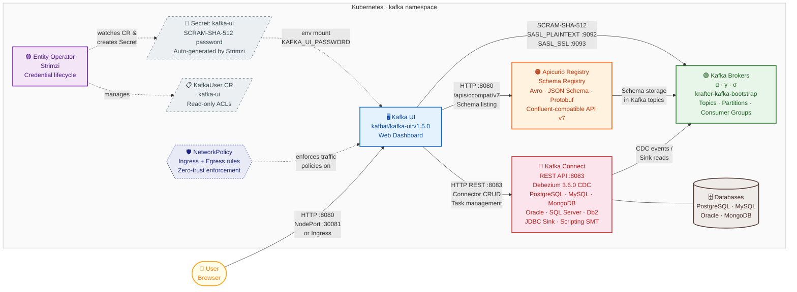

# Kafka UI Helm Chart

A Helm chart for deploying [Kafbat Kafka UI](https://github.com/kafbat/kafka-ui) on Kubernetes with first-class support for Strimzi-managed Kafka clusters, Apicurio Schema Registry, and Kafka Connect.

> **Note** — This chart uses the actively maintained **Kafbat** fork (`ghcr.io/kafbat/kafka-ui`), which is the community continuation of the original Provectus Kafka UI. The old `provectuslabs/kafka-ui` image is deprecated and contains known security vulnerabilities.

> **📚 Task-oriented guides** live in [`docs/`](docs/): [Setup & Access](docs/01-setup.md) · [Kafka Connection & ACLs](docs/02-kafka-and-acls.md) · [Schema Registry](docs/03-schema-registry.md) · [Kafka Connect](docs/04-kafka-connect.md). This README is the parameter reference.

## Architecture

Kafka UI serves as the central observability and management dashboard for the entire Kates streaming platform. Rather than requiring operators to interact with each component individually through CLI tools or raw API calls, Kafka UI provides a single web interface that aggregates information from three core backend services — the Kafka brokers, the Apicurio Schema Registry, and the Kafka Connect cluster — into one unified view.

### How the Components Fit Together

**Kafka Brokers** are the heart of the platform. They store and replicate all event streams across the three-node `krafter` cluster (brokers α, γ, and σ). Kafka UI connects to the brokers using the `krafter-kafka-bootstrap` service, which load-balances across all broker instances. Authentication is handled via SCRAM-SHA-512 — a challenge-response mechanism where the UI presents a username and password without transmitting the password in plain text over the wire. The credentials are managed entirely by the Strimzi Entity Operator, which watches a `KafkaUser` custom resource and automatically generates a Kubernetes Secret containing the SCRAM credentials.

**Apicurio Schema Registry** acts as the schema governance layer. When producers serialize messages using Avro, JSON Schema, or Protobuf, they register schemas with Apicurio. Kafka UI connects to Apicurio through its Confluent-compatible REST API (`/apis/ccompat/v7`), which allows the UI to display registered schemas, their versions, compatibility rules, and the decoded structure of messages directly alongside the topic data. Apicurio itself stores its schema data in internal Kafka topics on the same broker cluster.

**Kafka Connect** provides the data integration layer. The Connect workers run Debezium CDC connectors (PostgreSQL, MySQL, MongoDB, SQL Server, Oracle, Db2) and sink connectors (JDBC Sink) that move data between external databases and Kafka topics. Kafka UI communicates with Connect through its REST API on port 8083, allowing operators to create, configure, pause, resume, and restart connectors and their individual tasks directly from the browser without needing `curl` commands.

**Strimzi Entity Operator** is the automated credential manager. When the Helm chart creates a `KafkaUser` custom resource with `authentication.type: scram-sha-512`, the Entity Operator detects this resource, registers the user in the Kafka cluster's credential store, and creates a Kubernetes Secret containing the generated password. The Kafka UI Deployment mounts this Secret as an environment variable, completing the authentication chain without any manual password management.

**NetworkPolicy** controls all traffic flowing in and out of the Kafka UI pod. It enforces a zero-trust model where only explicitly allowed connections succeed — browser traffic from the ingress controller, SASL connections to the brokers, HTTP calls to Apicurio and Connect, DNS resolution, and Kubernetes API access for Secret reads. All other traffic is denied by default.



### Data Flow Summary

| # | Connection | Protocol | Port | Direction | Purpose |
|---|------------|----------|------|-----------|---------|
| 1 | User → Kafka UI | HTTP | 8080 / NodePort 30081 | Inbound | Web dashboard access from browser or Ingress controller |
| 2 | Kafka UI → Kafka Brokers | SASL_PLAINTEXT or SASL_SSL | 9092 / 9093 | Outbound | Topic browsing, partition inspection, consumer group monitoring, message sampling |
| 3 | Kafka UI → Apicurio Registry | HTTP GET | 8080 | Outbound | Schema listing, version history, compatibility checks, decoded message structure |
| 4 | Kafka UI → Kafka Connect | HTTP REST | 8083 | Outbound | Connector creation, configuration, status monitoring, task restart, pause/resume |
| 5 | Kafka Connect → Brokers | Kafka protocol | 9092 / 9093 | Internal | CDC event production and sink consumption |
| 6 | Kafka Connect → Databases | JDBC / CDC protocol | Various | Outbound | Source CDC capture and sink writes to external databases |
| 7 | Apicurio → Brokers | Kafka protocol | 9092 | Internal | Schema metadata stored in internal Kafka topics |
| 8 | Entity Operator → Secret | Kubernetes API | 443 | Internal | Auto-generates SCRAM-SHA-512 credentials from the KafkaUser CR |
| 9 | Secret → Kafka UI | Volume mount | — | Internal | Injects the broker password as the `KAFKA_UI_PASSWORD` environment variable |
| 10 | NetworkPolicy → Kafka UI | — | — | Enforcement | Restricts ingress to port 8080 and egress to brokers, registry, connect, DNS, and K8s API |


## Prerequisites

| Component | Required | Version |
|-----------|----------|---------|
| Kubernetes | Yes | ≥ 1.27 |
| Helm | Yes | ≥ 3.x |
| Strimzi Kafka Operator | Yes | ≥ 0.40 |
| A running Kafka cluster | Yes | Managed by Strimzi |
| Apicurio Schema Registry | Optional | ≥ 3.x |
| Kafka Connect (Strimzi) | Optional | ≥ 4.x |

The chart expects a Strimzi `KafkaUser` with SCRAM-SHA-512 authentication. By default, the chart creates a `KafkaUser` named `kafka-ui` with read-only ACLs. If the `KafkaUser` is managed elsewhere (e.g., by the Kafka cluster chart), set `kafkaUser.enabled: false`.

## Quick Start

```bash
# Install with default settings (connects to the "krafter" Kafka cluster)
helm install kafka-ui charts/kafka-ui --namespace kafka

# Install with the Kind (local development) profile
helm install kafka-ui charts/kafka-ui \
  -f charts/kafka-ui/values-kind.yaml \
  --namespace kafka

# Upgrade an existing release
helm upgrade kafka-ui charts/kafka-ui \
  -f charts/kafka-ui/values-kind.yaml \
  --namespace kafka
```

## Makefile Commands

The project root `Makefile` provides shorthand targets for managing the Kafka UI chart without having to remember the full `helm` commands. These targets automatically detect and apply the correct environment overlay based on the `ENV` variable.

### Available Targets

| Command | Description |
|---------|-------------|
| `make ui-deploy` | Install or upgrade Kafka UI using the Helm chart. Automatically selects the `values-<ENV>.yaml` overlay when it exists. |
| `make ui-upgrade` | Upgrade an existing Kafka UI release while preserving user-supplied values (`--reuse-values`). Useful for rolling out configuration changes without respecifying all overrides. |
| `make ui-undeploy` | Remove the Kafka UI Helm release from the cluster. The `KafkaUser` Secret is preserved thanks to the `helm.sh/resource-policy: keep` annotation. |
| `make ui-chart-lint` | Run `helm lint` against the chart to catch template errors, missing values, and YAML formatting issues before deploying. |
| `make ui-chart-template` | Render the chart templates locally without deploying. Outputs the full Kubernetes manifests to stdout so you can review exactly what will be applied. Respects the `ENV` overlay. |
| `make ui` | Legacy target — applies the raw `config/kafka-ui/kafka-ui.yaml` manifests via `kubectl apply`. Provided for backward compatibility; prefer `make ui-deploy` for new deployments. |

### Environment Selection

All Helm-based targets respect the `ENV` variable (defaults to `kind`). The Makefile looks for a matching `values-<ENV>.yaml` file in the chart directory and applies it as an overlay on top of the base `values.yaml`:

```bash
# Deploy using the Kind profile (default)
make ui-deploy

# Deploy using the dev profile
make ui-deploy ENV=dev

# Deploy using the production profile
make ui-deploy ENV=prod
```

### How It Works

Each target follows the same pattern:

1. **Overlay detection** — The Makefile checks whether `charts/kafka-ui/values-<ENV>.yaml` exists. If it does, it is passed as `-f` to Helm. If not, only the base `values.yaml` is used.
2. **Helm execution** — The target runs `helm upgrade --install` (for `ui-deploy`) or `helm upgrade --reuse-values` (for `ui-upgrade`), targeting the `kafka` namespace with a 5-minute timeout and `--wait` to block until all pods are ready.
3. **Idempotent operation** — `helm upgrade --install` is safe to run repeatedly. If the release does not exist, Helm creates it. If it already exists, Helm upgrades it in place.

### Usage Examples

```bash
# Full lifecycle on a Kind cluster
make ui-deploy                   # Install with values-kind.yaml
make ui-upgrade                  # Roll out a config change
make ui-undeploy                 # Tear down

# Preview what would be deployed to production
make ui-chart-template ENV=prod

# Lint before pushing to CI
make ui-chart-lint

# Override the image tag at deploy time
make ui-deploy ENV=kind HELM_ARGS="--set image.tag=v1.4.2"
```

> **Note** — These Makefile targets are convenience wrappers. You can always use the raw `helm` commands directly if you need finer control (e.g., `--dry-run`, `--debug`, or `--set` overrides beyond what the targets expose).

## Image Configuration

The container image is fully customizable. By default, the chart pulls `ghcr.io/kafbat/kafka-ui` with the tag matching the chart's `appVersion`.

```yaml
image:
  repository: ghcr.io/kafbat/kafka-ui
  tag: ""              # defaults to Chart.appVersion (v1.5.0)
  pullPolicy: IfNotPresent
  digest: ""           # set to "sha256:..." for digest-pinned deployments

# For private registries
imagePullSecrets:
  - name: my-registry-credentials
```

When `image.digest` is set, it takes precedence over `image.tag` and the resulting image reference becomes `repository@sha256:...`.

## Connecting to Kafka

The chart auto-computes the Kafka bootstrap servers from the `kafka.clusterName` and the release namespace. You can override this behavior with an explicit bootstrap address.

### Auto-Discovery (Default)

```yaml
kafka:
  clusterName: "krafter"          # name of the Strimzi Kafka CR
  # bootstrapServers is auto-computed as:
  #   krafter-kafka-bootstrap.<namespace>.svc.cluster.local:9092
```

The chart selects port `9092` (SASL_PLAINTEXT) by default, or port `9093` (SASL_SSL) when TLS is enabled.

### Explicit Bootstrap

```yaml
kafka:
  bootstrapServers: "my-kafka-bootstrap.production.svc:9093"
  tls:
    enabled: true
```

### TLS to Kafka (SASL_SSL)

When `kafka.tls.enabled=true` the chart uses `SASL_SSL` and **mounts the CA
certificate** so the broker cert can be verified. You must provide the Secret
holding the PEM CA (the Strimzi cluster CA, named `<clusterName>-cluster-ca-cert`):

```yaml
kafka:
  tls:
    enabled: true
    trustedCertificateSecret: krafter-cluster-ca-cert   # required when enabled
    certificateKey: ca.crt                              # key inside the Secret
```

The Secret is mounted at `/etc/kafka-ui/certs/<certificateKey>` and referenced
via `ssl.truststore.location`. Enabling TLS without `trustedCertificateSecret`
fails the render with a clear error.

### Authentication

Kafka UI authenticates to the Kafka cluster using SCRAM-SHA-512. The chart creates a Strimzi `KafkaUser` resource, and the Strimzi Entity Operator generates a Kubernetes Secret containing the password. The Deployment mounts this Secret as an environment variable.

```yaml
kafkaUser:
  enabled: true          # set to false if managed externally
  name: "kafka-ui"       # name of the KafkaUser and its Secret
  quotas:
    producerByteRate: 1048576
    consumerByteRate: 52428800
    requestPercentage: 10
  acls:                  # read-only by default
    - resource:
        type: topic
        name: "*"
        patternType: literal
      operations: ["Describe", "Read"]
    - resource:
        type: group
        name: "*"
        patternType: literal
      operations: ["Describe", "Read"]
    - resource:
        type: cluster
      operations: ["Describe"]
```

## Integrating Apicurio Schema Registry

When enabled, the Kafka UI displays schema information (Avro, JSON Schema, Protobuf) for each topic directly in the browser.

```yaml
schemaRegistry:
  enabled: true
  # Explicit URL to Apicurio's Confluent-compatible API
  url: "http://apicurio-apicurio-registry.kafka.svc:8080/apis/ccompat/v7"
```

If `url` is left empty, the chart auto-computes it as `http://apicurio-apicurio-registry.<namespace>.svc.cluster.local:8080/apis/ccompat/v7`.

For registries that require authentication. The password is **stored in a
Secret and injected as an environment variable** — it is never rendered into
the ConfigMap:

```yaml
schemaRegistry:
  enabled: true
  url: "https://registry.example.com/apis/ccompat/v7"
  auth:
    enabled: true
    username: "admin"
    password: "secret"          # the chart creates a Secret from this
    # existingSecret: my-sr-secret   # …or bring your own (key: password)
    # passwordKey: password
```

## Integrating Kafka Connect

When enabled, the Kafka UI shows the running connectors, their status, tasks, and configuration. You can also create and manage connectors directly from the web interface.

```yaml
kafkaConnect:
  enabled: true
  name: "connect-cluster"     # display name in the UI
  # Explicit URL to the Kafka Connect REST API
  url: "http://connect-cluster-connect-api.kafka.svc:8083"
  # Optional basic auth (password sourced from a Secret, like Schema Registry)
  auth:
    enabled: false
    username: ""
    password: ""
    # existingSecret: my-connect-secret
```

If `url` is left empty, the chart auto-computes it as `http://connect-cluster-connect-api.<namespace>.svc.cluster.local:8083`. The NetworkPolicy egress port is derived automatically from the URL.

## Securing Kafka UI (Web UI Auth & RBAC)

While the Strimzi Entity Operator secures the backend connection between Kafka UI and the brokers, you should also secure the frontend web interface so that unauthorized users cannot view topics or modify configurations. 

This chart natively supports **Basic Authentication** (`LOGIN_FORM`) and **Role-Based Access Control (RBAC)**.

### Basic Authentication

To restrict access to the Kafka UI with a username and password, enable the `auth` block in your `values.yaml` and create a Kubernetes Secret containing the password.

1. Create a Secret with your desired password:
   ```bash
   kubectl create secret generic kafka-ui-web-password \
     --namespace kafka \
     --from-literal=password="my-super-secret-password"
   ```

2. Configure `values.yaml` to use this Secret:
   ```yaml
   auth:
     enabled: true
     type: LOGIN_FORM
     username: admin
     passwordSecret: kafka-ui-web-password
   ```

When enabled, visitors will be greeted with a login screen before they can access the dashboard.

### Role-Based Access Control (RBAC)

RBAC allows you to restrict what authenticated users can see and do. **Note:** Kafbat UI only supports RBAC when using an external identity provider (`LDAP`, `OAUTH`, etc.). It is not supported for Basic Authentication (`LOGIN_FORM`).

If you configure an external identity provider, you can define specific roles and assign them to users. For example:

```yaml
auth:
  enabled: true
  type: OAUTH
  
  rbac:
    enabled: true
    roles:
      - name: "viewer"
        clusters: ["krafter"]
        subjects:
          - provider: "OAUTH"
            type: "user"
            value: "viewer@example.com"
        permissions:
          - resource: topic
            value: ".*"
            actions: [VIEW, MESSAGES_READ]
          - resource: consumer
            value: ".*"
            actions: [VIEW]
```

> **Zero-Trust Note**: The Kafka UI pod uses a `KafkaUser` custom resource to authenticate with the broker via SCRAM. Even if a malicious user bypasses the Web UI RBAC to attempt to delete a topic, the Strimzi Kafka cluster will reject the operation because the underlying `kafka-ui` backend service account only has `Describe` and `Read` ACLs at the broker level.

## Environment Profiles
The chart ships with four value overlays for different environments. Use the `-f` flag to apply them on top of the base `values.yaml`.

| Profile | File | Description |
|---------|------|-------------|
| **Kind** | `values-kind.yaml` | Local development on Kind clusters. NodePort on 30081, Schema Registry + Connect enabled, lower resources, startup probe. |
| **Dev** | `values-dev.yaml` | Development/staging clusters. Schema Registry + Connect enabled, startup probe, lower resources. |
| **Prod** | `values-prod.yaml` | Production. 2 replicas, TLS enabled, Ingress with nginx, LOGIN_FORM auth, Schema Registry + Connect enabled. |
| **Generic** | `values-generic.yaml` | Minimal — disables NetworkPolicy for clusters without a CNI that supports it. |

### Example: Full Local Stack

```bash
helm install kafka-ui charts/kafka-ui \
  -f charts/kafka-ui/values-kind.yaml \
  --namespace kafka
```

This deploys Kafka UI with:
- NodePort on `30081` for browser access
- Schema Registry pointing to the local Apicurio instance
- Kafka Connect pointing to the local `connect-cluster`
- Startup probe for slow-starting Kind environments
- Reduced resource requests (100m CPU, 256Mi memory)

### Example: Production

```bash
helm install kafka-ui charts/kafka-ui \
  -f charts/kafka-ui/values-prod.yaml \
  --namespace kafka \
  --set kafka.tls.enabled=true \
  --set ingress.hosts[0].host=kafka-ui.mycompany.com
```

## Accessing the UI

The access method depends on the `service.type`:

```bash
# NodePort (Kind / dev)
export NODE_IP=$(kubectl get nodes -o jsonpath='{.items[0].status.addresses[?(@.type=="InternalIP")].address}')
echo "http://${NODE_IP}:30081"

# ClusterIP (port-forward)
kubectl port-forward svc/kafka-ui 8080:8080 -n kafka
echo "http://localhost:8080"

# Ingress (production)
echo "https://kafka-ui.mycompany.com"
```

## Observability

Kafka UI exposes Prometheus metrics at `/actuator/prometheus`. Create a
`ServiceMonitor` (requires the Prometheus Operator CRDs):

```yaml
metrics:
  serviceMonitor:
    enabled: true
    interval: 30s
    labels:
      release: monitoring     # match your Prometheus selector
```

## High Availability

```yaml
replicas: 2
pdb:
  enabled: true
  minAvailable: 1
topologySpreadConstraints:
  - maxSkew: 1
    topologyKey: topology.kubernetes.io/zone
    whenUnsatisfiable: ScheduleAnyway
    labelSelector:
      matchLabels:
        app: kafka-ui
autoscaling:            # optional — CPU/memory HPA (omit static replicas)
  enabled: true
  minReplicas: 2
  maxReplicas: 5
  targetCPUUtilizationPercentage: 80
```

## Security Hardening

The chart runs hardened by default:

- Dedicated `ServiceAccount` with `automountServiceAccountToken: false` — Kafka UI does not call the Kubernetes API.
- `readOnlyRootFilesystem: true` with an `emptyDir` mounted at `/tmp`.
- Non-root, all capabilities dropped, no privilege escalation.
- A default-scoped `NetworkPolicy` (no Kubernetes API-server egress unless `networkPolicy.apiServerEgress=true`).
- The web login password is randomly generated on first install and preserved across upgrades (never a well-known default).

```yaml
serviceAccount:
  create: true
  automountServiceAccountToken: false
extraVolumes: []          # e.g. mount custom truststores / serde descriptors
extraVolumeMounts: []
```

## Parameters Reference

### Image

| Parameter | Default | Description |
|-----------|---------|-------------|
| `image.repository` | `ghcr.io/kafbat/kafka-ui` | Container image repository |
| `image.tag` | `""` (Chart.appVersion) | Image tag |
| `image.pullPolicy` | `IfNotPresent` | Image pull policy |
| `image.digest` | `""` | Image digest (overrides tag) |
| `imagePullSecrets` | `[]` | Registry pull secrets |

### Kafka

| Parameter | Default | Description |
|-----------|---------|-------------|
| `kafka.clusterName` | `krafter` | Strimzi Kafka CR name |
| `kafka.namespace` | `""` (release namespace) | Kafka cluster namespace |
| `kafka.bootstrapServers` | `""` (auto-computed) | Bootstrap servers override |
| `kafka.clusterDomain` | `cluster.local` | Kubernetes cluster domain |
| `kafka.tls.enabled` | `false` | Enable TLS (port 9093) |
| `kafka.tls.trustedCertificateSecret` | `""` | Secret holding the PEM CA (**required** when TLS enabled) |
| `kafka.tls.certificateKey` | `ca.crt` | Key inside the Secret |

### Schema Registry

| Parameter | Default | Description |
|-----------|---------|-------------|
| `schemaRegistry.enabled` | `false` | Enable Schema Registry integration |
| `schemaRegistry.url` | `""` (auto-computed) | Schema Registry URL |
| `schemaRegistry.auth.enabled` | `false` | Enable authentication |
| `schemaRegistry.auth.username` | `""` | Auth username |
| `schemaRegistry.auth.password` | `""` | Password (creates a Secret; not in the ConfigMap) |
| `schemaRegistry.auth.existingSecret` | `""` | Use a pre-existing Secret instead |
| `schemaRegistry.auth.passwordKey` | `password` | Key in the Secret |

### Web UI Authentication & RBAC

| Parameter | Default | Description |
|-----------|---------|-------------|
| `auth.enabled` | `false` | Enable Web UI authentication |
| `auth.type` | `DISABLED` | Authentication type (`DISABLED` or `LOGIN_FORM`) |
| `auth.username` | `admin` | Username for Basic Auth |
| `auth.passwordSecret` | `kafka-ui-web-password` | Secret the chart creates/looks up for the password |
| `auth.password` | `""` | Explicit password (else a random one is generated + preserved) |
| `auth.existingSecret` | `""` | Use a pre-existing Secret instead of managing one |
| `auth.rbac.enabled` | `false` | Enable Role-Based Access Control |
| `auth.rbac.roles` | `[]` | List of RBAC roles and permissions |

### Kafka Connect

| Parameter | Default | Description |
|-----------|---------|-------------|
| `kafkaConnect.enabled` | `false` | Enable Kafka Connect integration |
| `kafkaConnect.name` | `connect-cluster` | Display name in the UI |
| `kafkaConnect.url` | `""` (auto-computed) | Connect REST API URL |
| `kafkaConnect.auth.enabled` | `false` | Enable basic auth to the Connect REST API |
| `kafkaConnect.auth.username` / `password` / `existingSecret` | `""` | Connect credentials (password via Secret) |

### ServiceAccount & Security

| Parameter | Default | Description |
|-----------|---------|-------------|
| `serviceAccount.create` | `true` | Create a dedicated ServiceAccount |
| `serviceAccount.name` | `""` (fullname) | ServiceAccount name |
| `serviceAccount.automountServiceAccountToken` | `false` | Mount the API token (not needed) |
| `securityContext.readOnlyRootFilesystem` | `true` | Read-only root FS (chart mounts `/tmp` emptyDir) |
| `extraVolumes` / `extraVolumeMounts` | `[]` | Extra volumes/mounts (custom truststores, serdes) |

### NetworkPolicy

| Parameter | Default | Description |
|-----------|---------|-------------|
| `networkPolicy.enabled` | `true` | Create a NetworkPolicy |
| `networkPolicy.ingressNamespace` | `ingress-nginx` | Namespace allowed to reach the UI |
| `networkPolicy.monitoringNamespace` | `monitoring` | Namespace allowed to scrape metrics |
| `networkPolicy.apiServerEgress` | `false` | Allow egress to the Kubernetes API server |
| `networkPolicy.extraIngress` / `extraEgress` | `[]` | Extra rules appended verbatim |

### Observability & HA

| Parameter | Default | Description |
|-----------|---------|-------------|
| `metrics.serviceMonitor.enabled` | `false` | Create a ServiceMonitor (needs Prometheus Operator) |
| `metrics.serviceMonitor.path` | `/actuator/prometheus` | Metrics path |
| `metrics.serviceMonitor.interval` | `30s` | Scrape interval |
| `pdb.enabled` | `false` | Create a PodDisruptionBudget |
| `pdb.minAvailable` / `maxUnavailable` | `1` / `""` | PDB thresholds |
| `autoscaling.enabled` | `false` | Enable the HorizontalPodAutoscaler |
| `autoscaling.minReplicas` / `maxReplicas` | `1` / `5` | HPA bounds |
| `topologySpreadConstraints` | `[]` | Spread replicas across nodes/zones |

### Service

| Parameter | Default | Description |
|-----------|---------|-------------|
| `service.type` | `ClusterIP` | Service type |
| `service.port` | `8080` | Service port |
| `service.nodePort` | `""` | NodePort number (when type is NodePort) |

### Resources

| Parameter | Default | Description |
|-----------|---------|-------------|
| `resources.requests.cpu` | `250m` | CPU request |
| `resources.requests.memory` | `512Mi` | Memory request |
| `resources.limits.cpu` | `1000m` | CPU limit |
| `resources.limits.memory` | `2Gi` | Memory limit |

## Uninstalling

```bash
helm uninstall kafka-ui --namespace kafka
```

The `KafkaUser` resource has a `helm.sh/resource-policy: keep` annotation, so the Strimzi-managed Secret will persist after uninstall to avoid disrupting other consumers.
