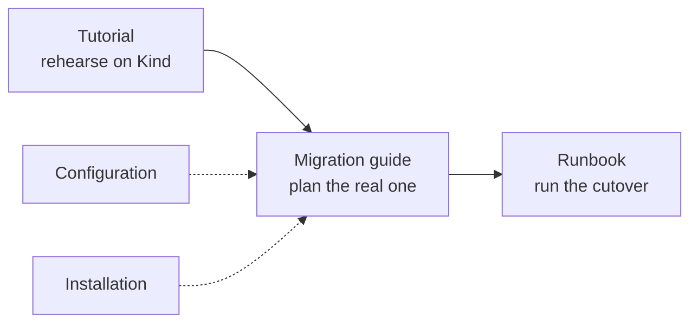

# mirror-maker2 — Documentation

Chart documentation, organised by what you are trying to do.

| I want to… | Read |
|---|---|
| **Plan a migration onto the 4.x cluster** | [Migration Plan](migration-plan.md) — start here |
| Know what the mirror will **not** do for me | [What MirrorMaker Does Not Carry](migration-plan.md#what-mirrormaker-does-not-carry) |
| Work through the operations without forgetting one | [Every Operation, In Order](migration-plan.md#every-operation-in-order) |
| Install the chart and know it worked | [Installation](installation.md) |
| Understand a value before I set it | [Configuration](configuration.md) |
| Watch what the mirror is doing | [Dashboards](dashboards.md) |
| Decide when it is safe to **cut over** | [Dashboards — the migration board](dashboards.md#the-migration-board) |
| Move a **Kafka 2.8** cluster onto 4.x | [Migrating from Kafka 2.8](migration-2.8-to-4.x.md) |
| Move a **Kafka 3.x** cluster onto 4.x | [Migrating from Kafka 3.x](migration-3.x-to-4.x.md) |
| Rehearse a migration on a laptop first | [Tutorial 11](../../../docs/tutorials/11-migrating-kafka-2x-to-4x.md) (2.x) · [Tutorial 12](../../../docs/tutorials/12-migrating-kafka-3x-to-4x.md) (3.x) |
| Cut over, roll back, or fix a live mirror | [MirrorMaker 2 Runbook](../../../docs/mirror-maker2-runbook.md) |
| See every value the chart accepts | [the chart README](../README.md) |

## How These Fit Together

The split that matters is **rehearsal versus the real thing**.

The tutorials build a complete migration on a Kind cluster — a legacy source in
one namespace, a 4.x target in another, seeded data, a cutover you can run and
undo. They are the fastest way to understand the shape, and nothing in them
costs anything if it goes wrong.

The migration guides here are for your actual cluster. They assume the source is
somewhere you do not control, the credentials are somebody else's to grant, the
replication factors are real, and a mistake has consequences. They cover the
decisions and the checks; the tutorials cover the mechanics.

The runbook is what you keep open **during** the cutover, beside the migration
board — [Dashboards](dashboards.md) explains which of the two boards answers
which question, and what neither of them can see.



## Before Anything Else

Two facts decide most of what follows, and both are cheap to establish now:

**Which era is the source?** Ask the cluster, not the ticket:

```bash
kafka-broker-api-versions.sh --bootstrap-server "$SOURCE" | head -1
```

Below Kafka 2.1 no single mirror can read it, and the migration becomes two
hops through an intermediate cluster. See
[Migrating a Legacy Kafka Source](../../../docs/book/23-legacy-source-migration.md).

**May you write to the source?** If not — and for most production migrations the
answer is no — you need `readOnlySource: true` from the **first** install, not
added later. [The credential contract](../README.md#the-credential-contract-read-this)
explains why, and [Configuration](configuration.md) shows where it goes.
