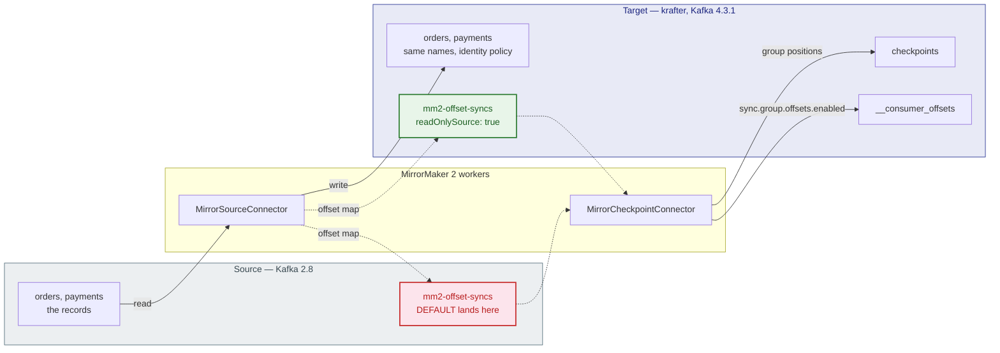
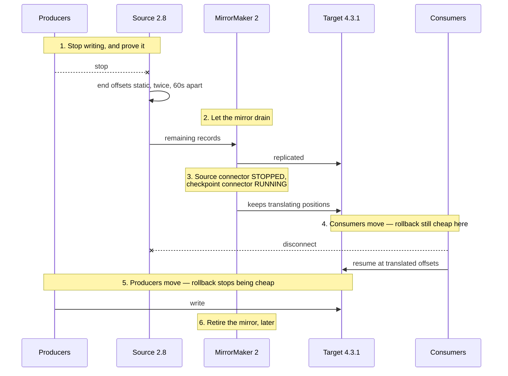

# Migrating from Kafka 2.8 to 4.x

Moving a production Kafka 2.8 cluster onto 4.x with MirrorMaker 2 — the
decisions, the checks, and the order.

The phased plan, gates and rollback costs are in the
[Migration Plan](migration-plan.md); this page is the 2.8-specific detail
inside it.

Rehearse it first on a laptop:
[Tutorial 11](../../../docs/tutorials/11-migrating-kafka-2x-to-4x.md) builds the
whole thing on Kind in about fifteen minutes, and nothing there costs anything
if it goes wrong. This page assumes the source is a cluster you do not control,
the credentials are somebody else's to grant, and a mistake has consequences.

## Why 2.8 Is the Interesting Case

Kafka 4.0 removed the client protocol API versions older than 2.1
([KIP-896](https://cwiki.apache.org/confluence/display/KAFKA/KIP-896%3A+Remove+old+client+protocol+API+versions+in+Kafka+4.0)).
The MirrorMaker workers are 4.x clients, so they can read brokers of 2.1 and
newer, and nothing older.

2.8 clears that floor — but only just, and everything else about a 2.8 cluster
is from the other side of a set of changes that a 4.x-era runbook does not
account for: it is ZooKeeper-based, its tooling predates
`kafka-get-offsets.sh`, its authorizer is a class that no longer exists, and
its brokers were configured when the TLS defaults were different.

Nothing there stops the mirror. All of it changes how you operate the source
while the mirror runs. [Migrating a Legacy Kafka
Source](../../../docs/book/23-legacy-source-migration.md) is the full account;
the parts that bear on this migration appear below where they land.

## Before You Plan Anything

### 1. Confirm the source's version from the source

Not from the ticket, not from the wiki:

```bash
kafka-broker-api-versions.sh --bootstrap-server "$SOURCE" | head -1
```

If it comes back below 2.1, stop — one mirror cannot read it, and the migration
becomes two hops through an intermediate 3.9 cluster. That is a different plan,
in the [book chapter](../../../docs/book/23-legacy-source-migration.md#below-the-floor-two-hops).

### 2. Inventory the clients

This is the step that decides whether the cutover is an afternoon of repointing
or a client upgrade programme, and it is the one most often skipped.

Every application that reads or writes the source must be able to speak to a 4.x
broker afterwards. A client older than 2.1 cannot, and there is no setting on
the new cluster that restores it. The mirror will have moved your data
faithfully to a cluster your applications cannot read.

On a 2.8 source there is no `DeprecatedRequestsPerSec` metric to answer this —
it arrived in 3.7 — so the inventory is manual. Client library versions,
per application, written down.

### 3. Decide whether you may write to the source

For most production migrations the answer is no, and the setting must be right
from the **first** install:

```yaml
mirrors:
  - source: { … }
    readOnlySource: true
```

By default MirrorMaker creates and writes its offset-syncs topic on the source.
A principal that can only read produces no error at install and a
`TopicAuthorizationException` in the connector minutes later, while everything
reports `RUNNING`. Adding the setting afterwards restarts offset translation
from an empty topic, so checkpoints regress and a cutover during that window
resumes consumers in the wrong place.

The setting decides which side of the picture one arrow points at:



Every solid arrow is data movement; the dashed ones are the offset map that
makes consumer positions translatable. Only one of the two `mm2-offset-syncs`
boxes exists in your deployment, and which one decides whether the mirror needs
write access to a cluster you were told you could only read.

### 4. Get the credentials granted

The source is a cluster this chart cannot touch, so someone else provisions the
principal. Hand them the exact list rather than "read access" — the
[credential contract](../README.md#the-credential-contract-read-this) has both
sets. For a read-only source:

- topic `<mirrored>`: **Read, Describe**
- group `<mirrored>`: **Describe**
- cluster: **Describe**
- and `DescribeConfigs` on the mirrored topics, because the preset turns on
  `sync.topic.configs.enabled` so the target inherits the source's retention

A missing source-side ACL is the single most common cause of a mirror that runs
and replicates nothing.

## Configuration

Start from the preset and change what is specific to you:

```bash
helm dependency build charts/mirror-maker2    # once per checkout: the kafka-common library
helm install mm2 charts/mirror-maker2 -n kafka \
  -f charts/mirror-maker2/values-migrate-2x.yaml \
  -f my-migration.yaml
```

The preset already makes the migration decisions —
[`values-migrate-2x.yaml`](../values-migrate-2x.yaml) documents each one at the
top of the file. What it cannot know is your cluster:

```yaml
# my-migration.yaml
mirrors:
  - source:
      alias: legacy
      bootstrapServers: kafka-prod-01.internal:9092,kafka-prod-02.internal:9092
      kafkaVersion: "2.8.2"
      authentication:
        type: scram-sha-512
        username: mm2-reader
        secretName: mm2-source-credentials
        secretKey: password
    readOnlySource: true
    topicsPattern: "orders\\..*|payments\\..*"    # not ".*" — see below
    sourceConnector:
      tasksMax: 12                                 # the source's partition count
      config:
        replication.factor: 3
        offset-syncs.topic.replication.factor: 3
    checkpointConnector:
      config:
        checkpoints.topic.replication.factor: 3
        sync.group.offsets.enabled: "true"

target:
  brokerCount: 3                                   # enables the RF guard
  config:
    config.storage.replication.factor: 3
    offset.storage.replication.factor: 3
    status.storage.replication.factor: 3

metrics:
  enabled: true
podMonitors:
  enabled: true
alerts:
  enabled: true
```

Four things in there are worth arguing about.

**`topicsPattern` — name what you mean.** The preset ships `.*` because a lab
has nothing else in it. A production source has internal topics, other teams'
topics and things nobody has owned for years. Mirroring all of it makes the
migration slower, larger, and harder to verify. List the prefixes you are
actually moving.

**Replication factors are yours, not the preset's.** RF1 is what a Kind cluster
uses. Setting `target.brokerCount` turns a wrong factor into a refusal at
install rather than a connector that fails creating topics an hour in.

**`tasksMax` at the source's partition count.** Tasks map to partitions; more
than that buys nothing, and Connect runs at most `sum(tasksMax)` tasks however
many workers you give it.

**Monitoring before the first record.** Replication lag is what the cutover
decision rests on, and a spot reading on the day is not the same as a week of
history.

Run the pre-flight probe on the first install. Against a 2.8 source it is worth
more than usual, because the TLS and SASL defaults moved between then and now —
hostname verification became the default in 2.0, TLSv1 and TLSv1.1 were
disabled in 2.5, and a JAAS configuration copied from the old cluster can fail
for reasons unrelated to the credentials being wrong:

```bash
--set preflight.enabled=true --set preflight.failOnError=true
```

## Running the Migration

```bash
kates migrate plan --from 2.8.2       # what this pairing requires
kates migrate run --from 2.8.2        # the rehearsal, end to end, on Kind
```

Against your real source the sequence is the same, with the mirror installed as
above:

**1. Start the mirror and let it catch up.** Watch replication lag settle rather
than waiting a fixed time. A large source can take days, and that is fine — the
mirror is not a maintenance window.

**2. Verify replication.** End offsets on the target match the source, per
topic. The chart's Helm tests do this by moving real records:

```bash
helm test mm2 -n kafka
```

**3. Verify offset translation** *before* the cutover, not during it. A group's
committed offsets should exist on the target and be close to the source's. This
is the check that distinguishes "the data is there" from "the consumers can
resume", and they fail independently.

**4. Cut over.** The [runbook](../../../docs/mirror-maker2-runbook.md#cutover-checklist)
has the checklist — stop producers and *prove* they stopped, let the mirror
drain, stop the source connector while leaving the checkpoint connector
running, move consumers, move producers, retire the mirror.



Consumers move before producers for one reason: while producers are still on
the source, the source remains authoritative and going back is a decision
rather than a data-recovery exercise.

The source-era detail that bites here: step one is proving the source's end
offsets have stopped moving, twice, sixty seconds apart. Which command that is
depends on **which distribution you run it from**, not on the source's version:

| Running from | Command |
|---|---|
| A modern toolbox (3.0+) | `kafka-get-offsets.sh --bootstrap-server "$SOURCE" --topic orders` |
| The source's own 2.8 distribution | `kafka-run-class.sh kafka.tools.GetOffsetShell --broker-list "$SOURCE" --topic orders` |

A 2.8 broker is above the Kafka 2.1 protocol floor, so a 4.x client can read it
— which means the first row works fine against your 2.8 source and is the
simpler choice. The second row exists because a 2.8 *distribution* has no
`kafka-get-offsets.sh`; that script arrived in Kafka 3.0.

What does not work is mixing them: `kafka.tools.GetOffsetShell` was moved to
`org.apache.kafka.tools` in Kafka **3.7.0**
([KAFKA-14581](https://issues.apache.org/jira/browse/KAFKA-14581)) without the
deprecated forwarder the other relocated tools kept, so running the old class
name from a 3.7-or-newer toolbox gives `ClassNotFoundException`. With stderr
discarded that reads as "no offsets" — the worst possible answer at the step
whose entire purpose is proving the number stopped moving.

**5. Keep the mirror for a while.** Retiring it is cheap; recreating it after a
rollback is not.

## Rolling Back

Before the cutover, rollback is trivial: the source is still authoritative and
nothing has moved. Stop the mirror and try again.

After consumers have moved, it is a decision rather than a command — the
[runbook's rollback section](../../../docs/mirror-maker2-runbook.md#rollback)
covers what is recoverable and what is not. The honest summary: rolling back is
straightforward while producers are still on the source, and expensive
afterwards. That is why step 4 moves consumers before producers.

## What Goes Wrong

| Symptom | Cause |
|---|---|
| `helm install` refuses, naming the 2.1 floor | The source is genuinely older than it claims. Two-hop migration |
| Pre-flight fails on the TLS handshake | Hostname verification became the default in Kafka 2.0; the source's certificates have no matching SANs |
| Connectors `RUNNING`, nothing arrives | A missing source-side ACL, or `topicsPattern` matches nothing |
| Topics arrive as `legacy.orders` | The identity policy is not in force on **both** connectors |
| Consumers repoint and replay everything | `sync.group.offsets.enabled` was off — the data moved, the positions did not |
| Applications cannot read the new cluster | They are pre-2.1 clients. The mirror did its job; the inventory in step 2 was skipped |
| `command not found` running the offset check | `kafka-get-offsets.sh` is 3.0+; use `kafka-run-class.sh kafka.tools.GetOffsetShell` from a 2.x toolbox |

## Next

- [Migrating from Kafka 3.x](migration-3.x-to-4.x.md) — the same migration with
  the protocol risk removed, and what that changes.
- [MirrorMaker 2 Runbook](../../../docs/mirror-maker2-runbook.md) — the cutover
  checklist, rollback, and the source-era command substitutions.
- [Migrating a Legacy Kafka Source](../../../docs/book/23-legacy-source-migration.md)
  — the full account of what a 2.x source changes.
