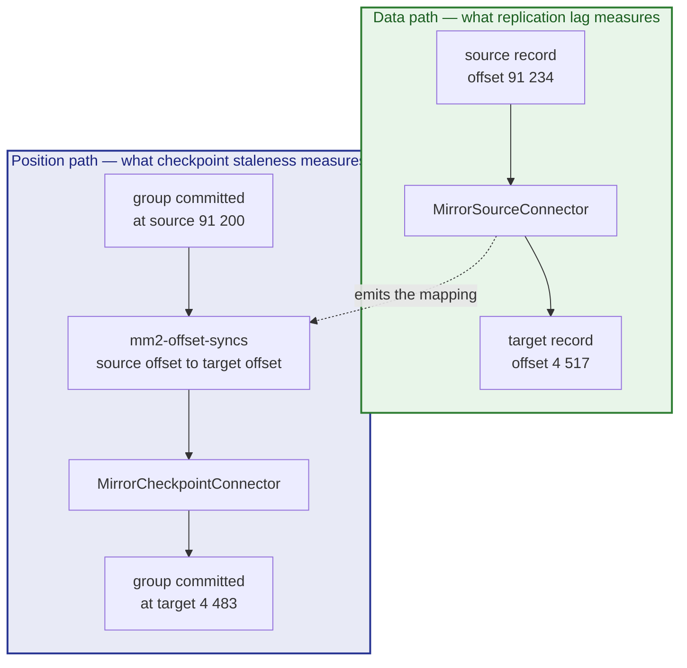

# Migrating from Kafka 3.x to 4.x

Moving a production Kafka 3.x cluster onto 4.x with MirrorMaker 2.

The phases and gates are in the [Migration Plan](migration-plan.md).
Read [Migrating from Kafka 2.8](migration-2.8-to-4.x.md) first if you have not.
The shape is identical and this page covers only what differs — which is less
than people expect, and different from what they expect.

Rehearse on a laptop with
[Tutorial 12](../../../docs/tutorials/12-migrating-kafka-3x-to-4x.md).

## What Is Easier

**The protocol floor is a formality.** Every 3.x release is far above the Kafka
2.1 minimum that 4.x clients require, so the compatibility gate is no longer the
thing standing between you and a silent failure. Leave it enforced anyway — a
check that only runs when convenient teaches people to ignore it, and it costs
nothing.

**No metadata-store change underneath you.** A 3.x source is either already
KRaft or on a release where KRaft is available; either way this is a pure data
migration rather than a data migration sitting on top of a ZooKeeper-to-KRaft
one.

**The tooling matches.** `kafka-get-offsets.sh` exists from 3.0, so the cutover
checklist's commands work as written against the source. `kafka-configs.sh` from
a 4.x distribution works too (it needs a 2.3+ broker). The one exception:
any script of yours that calls `kafka-run-class.sh kafka.tools.<X>` needs
updating, and it may already be broken. Six tools kept a deprecated forwarder
under the old name until 4.0 removed it; `GetOffsetShell` did not, and moved in
**3.7.0** with no release note. If your 3.x source is 3.7 or newer, that
invocation has been failing there since the upgrade that took you past it.

**Offset translation is better behaved.** The source speaks the modern group
protocol, so checkpointing is more reliable and the intervals can be tighter.
[`values-migrate-3x.yaml`](../values-migrate-3x.yaml) halves the checkpoint and
group-sync intervals compared to the 2.x preset for exactly this reason.

**Throughput is higher.** A 3.9 source saturates more fetchers than a 2.8 one,
so the preset starts at a higher `tasksMax` and the bottleneck moves to the
target. Size the target's ingest accordingly rather than assuming the source is
the limit.

## What Is Not

**The client inventory is still the hard part.** This is the one that catches
people who assume a 3.x source means an easy migration. The clients connecting
to your 3.x cluster are not necessarily 3.x clients — a 2.0 application talking
to a 3.9 broker works today and will not work against 4.x. The broker's version
tells you nothing about theirs.

The good news is that on a 3.7 or newer source you can get the answer from the
cluster instead of by hand:

```bash
# On the source brokers: any non-zero value names a client still speaking a
# protocol version that Kafka 4.0 removed.
kafka.network:type=RequestMetrics,name=DeprecatedRequestsPerSec,request=*,version=*
```

Zero across the board means nothing in your estate is below the floor. Below
3.7 the metric does not exist and the inventory is manual, exactly as for a 2.x
source.

**Everything about the mirror itself.** Credentials on both ends, the read-only
decision, the naming policy, replication factors, `sync.group.offsets.enabled`,
monitoring before the first record — none of that is easier because the source
is newer. The [2.8 guide](migration-2.8-to-4.x.md#configuration) and
[Configuration](configuration.md) apply unchanged.

**The cutover is the same sequence.** Same order, same checks, same reason the
consumers move before the producers.

## Configuration

```bash
helm install mm2 charts/mirror-maker2 -n kafka \
  -f charts/mirror-maker2/values-migrate-3x.yaml \
  -f my-migration.yaml
```

The overrides are the same as for a 2.8 source — the real address and
credentials, a `topicsPattern` that names what you are actually moving, real
replication factors with `target.brokerCount` set, `tasksMax` at the source's
partition count, and monitoring on. The
[2.8 guide's configuration section](migration-2.8-to-4.x.md#configuration) has
the annotated example; change `kafkaVersion` and start from the 3.x preset.

Two adjustments specific to a 3.x source:

```yaml
mirrors:
  - source:
      kafkaVersion: "3.9.1"
    sourceConnector:
      tasksMax: 16                    # a 3.x source will feed more fetchers
    checkpointConnector:
      config:
        emit.checkpoints.interval.seconds: "10"
        sync.group.offsets.interval.seconds: "10"
```

Tighter checkpoint intervals cost a little more traffic on the offset-syncs
topic and buy a smaller window between a consumer's real position and its
translated one. On a migration that ends in a cutover, that window is what
decides how much replay your consumers do.

## Running It

```bash
kates migrate plan --from 3.9.1
kates migrate run --from 3.9.1
```

Then the same five steps as the 2.8 path: start and let it catch up, verify
replication, verify offset translation, cut over with the
[runbook](../../../docs/mirror-maker2-runbook.md#cutover-checklist), keep the
mirror a while.

The offset check in cutover step 1 works as documented here, since the source
has the modern tooling:

```bash
kafka-get-offsets.sh --bootstrap-server "$SOURCE" --topic orders
```

## What Goes Wrong

Everything in the [2.8 guide's table](migration-2.8-to-4.x.md#what-goes-wrong)
except the two version-specific rows — the protocol floor refusal and the
missing `kafka-get-offsets.sh`. What remains is the same list, and the top two
are still a missing source-side ACL and a `topicsPattern` that matches nothing.

One symptom is more likely here than on a 2.8 source, because the tighter
intervals make it visible: checkpoint staleness alerting while replication lag
is fine. That is offset translation falling behind the data, and it matters —
it is precisely the state in which a cutover looks safe and resumes consumers in
the wrong place.

The two are separate pipelines, which is why they fail separately:



The upper path can be healthy while the lower one is hours behind. A cutover
decided on replication lag alone moves consumers onto positions computed from a
stale mapping, and they resume somewhere other than where they were. Alert on
both, and treat checkpoint staleness as a cutover blocker rather than a warning.

## Next

- [Migrating from Kafka 2.8](migration-2.8-to-4.x.md) — the full guide this one
  is a delta against.
- [MirrorMaker 2 Runbook](../../../docs/mirror-maker2-runbook.md) — cutover,
  rollback, troubleshooting.
- [Configuration](configuration.md) — what to set and why.
