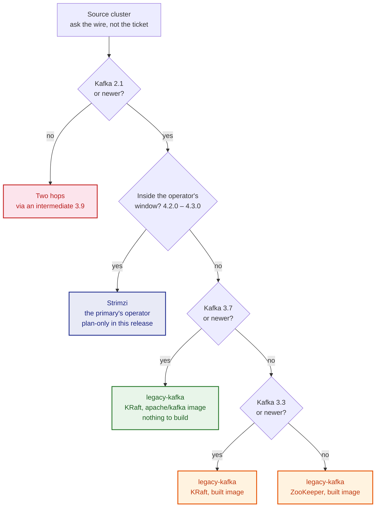
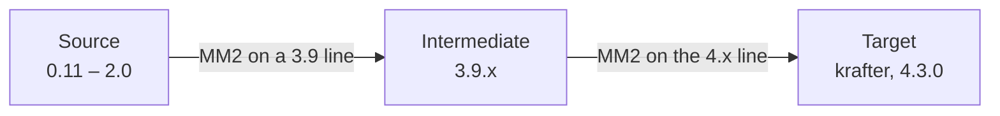
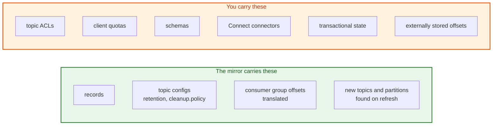
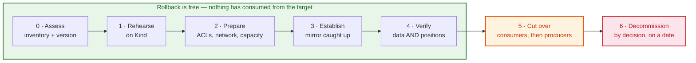

# Migration Plan

A phased plan for moving a Kafka cluster of a supported older version onto the
4.x cluster the [`kafka-cluster`](../../kafka-cluster/) chart deploys, using
MirrorMaker 2.

This is the spine. [Migrating from Kafka 2.8](migration-2.8-to-4.x.md) and
[Migrating from Kafka 3.x](migration-3.x-to-4.x.md) are the source-specific
detail; the [runbook](../../../docs/mirror-maker2-runbook.md) is what you hold
during the cutover. Read this first — it decides which of those you need, and
in what order.

## What You Are Migrating To

The target is not "Kafka 4.x" in general. It is a specific cluster with
specific constraints, and two of them shape the plan:

| | Value | Where it comes from |
|---|---|---|
| Cluster name | `krafter` | `clusterName` in [`values.yaml`](../../kafka-cluster/values.yaml) |
| Kafka version | 4.3.0 | `kafkaVersion` — the newest in the vendored operator's window |
| Operator | Strimzi 1.1.0 | `strimziVersion`, vendored under `charts/strimzi-operator` |
| Versions that operator can run | 4.2.0, 4.2.1, 4.3.0 | the operator chart's own `STRIMZI_KAFKA_IMAGES` map |
| Platform floor | 4.2.0 | `kates.io/kafka-floor` in [`Chart.yaml`](../../kafka-cluster/Chart.yaml) — the default configuration enables share groups |
| KRaft metadata version | 4.2-IV1 | `kafka.metadataVersion`, deliberately one step behind |

Confirm these against the charts rather than trusting this table —
`scripts/check-versions.sh` asserts them in CI, and
`kates versions` prints what the operator on your cluster will actually accept.

**The metadata version is one step behind on purpose.** Left unset, the operator
raises it to the new Kafka version's default the moment `kafkaVersion` changes,
and a raised metadata version forecloses any rollback to the previous Kafka
line. Keeping it at 4.2-IV1 while the brokers run 4.3.0 means the target itself
can still go back. That matters here: for the duration of a migration you have
two clusters that can both fail, and you want the new one to be the reversible
of the two.

## Which Sources This Platform Supports

MirrorMaker's own floor is Kafka 2.1 — a 4.x client cannot read anything older
([KIP-896](https://cwiki.apache.org/confluence/display/KAFKA/KIP-896%3A+Remove+old+client+protocol+API+versions+in+Kafka+4.0)).
Above that floor, what changes is **how the source runs here**, because Strimzi
cannot operate a Kafka older than its window:

| Source version | Runs as | What you do first |
|---|---|---|
| below 2.1.0 | not supported | Two hops — see [Below the Floor](#below-the-floor-two-hops) |
| 2.1.0 – 3.2.x | legacy — ZooKeeper, built image | `kates migrate image build --version <v> --load` |
| 3.3.0 – 3.6.x | legacy — KRaft, built image | Build the image (no official one exists below 3.7) |
| 3.7.0 – 4.1.x | legacy — KRaft, `apache/kafka:<v>` | Nothing — the official image is multi-arch |
| 4.2.0 – 4.3.0 | Strimzi 1.1.0, the primary's operator | Nothing (plan-only in this release — see below) |

The row that surprises people is the fourth. A **4.0 or 4.1 source also runs as
legacy**, not under Strimzi, because the cluster-wide operator this platform
pins cannot run a Kafka outside its window — and its window starts at 4.2.0.
Being 4.x is not the same as being operable here.

The last row is plan-only in this release: a source that the primary's own
operator could run is described by `kates migrate plan` but not stood up by
`kates migrate run`. Pass `--source-provider legacy` to run it under the
official image instead.

The same thing as a decision, which is how you will actually use it:



Follow a 4.0 or 4.1 source through it: not inside the window, but newer than
3.7, so it lands on the official-image legacy path with everything older. That
branch is the one people do not expect.

Do not read the table — ask the CLI, which answers for *your* cluster and the
operator actually on it rather than the pinned one:

```bash
kates migrate pairs
```

```text
FROM (source)  PROVIDER                           TO (target)          NOTE
2.1.0 – 3.2.x  legacy — ZooKeeper, built image    4.2.0 4.2.1 [4.3.0]  image built on first use
3.3.0 – 3.6.x  legacy — KRaft, built image        4.2.0 4.2.1 [4.3.0]  image built on first use
3.7.0 – 4.1.x  legacy — KRaft, official image     4.2.0 4.2.1 [4.3.0]  the 4.x line below 4.2.0 is legacy
4.2.0 – 4.3.0  Strimzi 1.1.0, primary's operator  4.2.0 4.2.1 [4.3.0]  in-window: plan only in this version
```

The bracketed target is the primary as it actually runs; any version in the
window can be the target.

The distinction that matters operationally is the provider column. A source
under `legacy-kafka` is plain StatefulSets with no operator — nothing
reconciles it, nothing upgrades it, and it exists to be drained and deleted.
That is the right shape for a migration source and the wrong shape for
anything you intend to keep.

### Below the Floor: Two Hops

A source older than 2.1 needs an intermediate cluster:



Plan it as **two migrations**, because that is what it is: two cutovers, two
rounds of consumer repointing, and a period where the intermediate cluster is
the system of record. The phases below apply to each hop separately.

## Requirements

Everything that must be true before Phase 3 puts a record on the wire. A
missing item here does not stop the install — it stops the migration, later,
somewhere less convenient.

### Access and credentials

| | Detail |
|---|---|
| A source principal | With the exact ACLs from [the credential contract](../README.md#the-credential-contract-read-this), which differ depending on whether the mirror may write to the source |
| Its Secret in the mirror's namespace | The chart reads a Secret; it cannot create one for a cluster it does not manage. `secretSync` copies it across namespaces if it lives elsewhere |
| A target principal | Provisioned by `kafka-cluster` as `kates-mm2`, or by this chart with `kafkaUser.create=true` |
| Kubernetes access | To the mirror's namespace, and read access to the source's if it is in-cluster |
| Someone who can grant source ACLs | Usually not you. Start this in Phase 0; it is the longest lead time in the plan |

### Network

| | Detail |
|---|---|
| Reachability | From the mirror's namespace to every source broker's advertised address — not just the bootstrap. A bootstrap that resolves and brokers that do not is a mirror that connects and stalls |
| Ports | `networkPolicy.kafka.ports` names them. 9092 plaintext, 9093 TLS, or whatever the source actually listens on |
| Egress for an external source | `mirrors[].source.egressCIDR`, or default-deny drops it |
| DNS | `networkPolicy.dns` on strict clusters, pinned to kube-dns |
| Bandwidth | Enough to move the retained history in an acceptable window, plus ongoing traffic. Estimate it in Phase 2, do not discover it in Phase 3 |

### Capacity

The target absorbs the source's **entire retained history**, not its daily
volume, and then keeps up with production traffic on top:

```text
target disk ≳ (source retained bytes × target replication factor) + headroom
catch-up time ≈ source retained bytes ÷ achievable mirror throughput
```

Both numbers are worth writing down before Phase 3, because both are answers
you cannot change once the mirror is running.

### Data

| | Detail |
|---|---|
| Topic inventory | Names, partition counts, retention, `cleanup.policy`. The pattern you mirror should be a list you can read, not `.*` |
| Consumer group inventory | Every group that must resume on the target, and its `groupsPattern` |
| Schema inventory | If anything serialises with Avro or Protobuf — see [What MirrorMaker Does Not Carry](#what-mirrormaker-does-not-carry) |
| Client library versions | Per application. This is the Phase 0 gate and the one that cannot be fixed at cutover time |

### Observability and process

| | Detail |
|---|---|
| Metrics, alerts, dashboards | On before the first record, so lag has history rather than a spot reading. `dashboard.migration.enabled` is the board for the window itself: go/no-go, the drain and its ETA, translated consumer positions, the cutover freeze |
| An owner per consumer group | Phase 5 moves them one at a time; each needs someone who can restart it and confirm it resumed |
| A rollback decision-maker | Named, available during the cutover window |
| A change record | `kates migrate plan -o json` is a good attachment: it is the specifics, machine-checked |

## What MirrorMaker Does Not Carry

This is the part that turns a working mirror into a failed migration. MM2
replicates records and translates offsets. Everything else about your Kafka
estate is a separate operation, and most of it has to happen before the
cutover, not after.



| Not carried | Why | The operation you own |
|---|---|---|
| **Topic ACLs** | This chart sets `sync.topic.acls.enabled: false` deliberately — the target's authorization is managed here, and copying a legacy cluster's ACLs would import its accidents | Re-create authorization for every application on the target, before consumers move |
| **Client quotas** | No MM2 mechanism exists | Re-apply them with `kafka-configs.sh` against the target |
| **Schemas** | Avro and Protobuf payloads carry a schema *id*, not a schema. The registry is a separate system, and a consumer that resolves id 42 on the source finds nothing — or worse, something else — on a target whose registry is empty | Migrate the registry first, preserving ids. On this platform that is Apicurio; export and import before Phase 5 |
| **Kafka Connect connectors** | Connectors on the source are not part of the mirror | Re-create sources and sinks against the target, and decide whether they run during the mirror or only after |
| **Transactional state** | In-flight transactions and producer sequence numbers do not transfer. MM2 is at-least-once by default | Applications with transactional producers restart their transactions against the target |
| **Consumer group membership** | Only *committed offsets* translate. Assignments, generation ids and member metadata do not | Nothing to do — but expect a rebalance when each group joins the target |
| **Raw offsets** | Target offsets differ from source offsets. That is why offset translation exists | Anything storing a Kafka offset outside Kafka — a checkpoint in a database, an audit record — must be translated or reset |

Two more that are not "missing" so much as *different*:

**Compacted topics do not arrive byte-identical.** The mirror replicates what it
reads; the source may already have collapsed keys the target has not, and the
target compacts on its own schedule. Tombstones replicate. The end state is
equivalent, not identical — so verify compacted topics by key, never by record
count.

**Future-dated records can be rejected by a 4.x target — old ones cannot.**
The two halves of this check are not symmetric, and the asymmetry is what makes
migration possible at all:

| Broker setting | Default | Effect under `CreateTime` |
|---|---|---|
| `log.message.timestamp.before.max.ms` | unlimited | Records arbitrarily far in the **past** are accepted. Replaying years of history is fine |
| `log.message.timestamp.after.max.ms` | 1 hour (changed in 4.0) | A record more than an hour in the **future** is rejected |

So the history you are migrating is not the problem; a legacy estate's
*skewed clocks* are. A producer with a fast clock, or a batch job that stamps
records ahead of time, writes records a 2.x broker accepted and a 4.x target
will not. Both settings also exist per topic, without the `log.` prefix.

Check the source's timestamp range before Phase 3 rather than debugging a
mirror that replicated most of a topic. Where the source genuinely contains
future-dated records, raising `message.timestamp.after.max.ms` on the target's
topics is the deliberate fix — and worth a note in the change record, because
it weakens a check the target otherwise gets for free.

## The Phases

Each phase has an exit gate. Do not start the next one until the gate's evidence
exists — every one of them is cheap to check now and expensive to discover
later.



The boundary matters more than the phases. Everything through Phase 4 is
reversible by deleting things; from the moment consumers move in Phase 5,
rollback starts costing reprocessing, and once producers move it stops being a
rollback at all. [Rollback](#rollback) prices each step.

| Phase | Produces | Exit gate |
|---|---|---|
| 0. Assess | The source's real version, the client inventory, the go/no-go | You can name every client's Kafka library version, and the source's version came from the wire |
| 1. Rehearse | A complete migration on Kind | `kates migrate run --from <v>` passes end to end |
| 2. Prepare | Credentials, network, target capacity, monitoring | The pre-flight probe passes against the real source |
| 3. Establish | A running mirror, caught up | Replication lag is stable and small over at least one full traffic cycle |
| 4. Verify | Proof the data *and* the positions arrived | Both checks pass independently |
| 5. Cut over | Producers and consumers on the target | The source is receiving no writes and the target is serving |
| 6. Decommission | The mirror and the old cluster gone | Rollback window has closed by decision, not by accident |

### Phase 0 — Assess

**Establish the source's version from the source.** Not from the ticket:

```bash
kafka-broker-api-versions.sh --bootstrap-server "$SOURCE" | head -1
```

Below 2.1, switch to the two-hop plan. Otherwise the version decides which
provider row above you are in, and therefore whether Phase 2 includes an image
build.

**Inventory the clients.** This is the step that decides whether the cutover is
an afternoon of repointing or a client upgrade programme, and it is the one most
often skipped. Every application that reads or writes the source must be able to
talk to a 4.x broker afterwards — a client older than 2.1 cannot, and no setting
on the target restores it.

The source's own version tells you nothing here. A Kafka 2.0 application talking
to a 3.9 broker works today and will not work against 4.3.

On a source of 3.7 or newer, the cluster answers it:

```text
kafka.network:type=RequestMetrics,name=DeprecatedRequestsPerSec,request=*,version=*
```

Zero across the board means nothing in your estate speaks a removed protocol
version. Below 3.7 the metric does not exist and the inventory is manual:
library version per application, written down.

**Decide whether you may write to the source.** For most production migrations
you may not, and `readOnlySource: true` has to be set on the *first* install —
see [Configuration](configuration.md#whether-the-mirror-writes-to-the-source)
for why adding it later is expensive.

> **Gate.** A written client inventory, a version that came from the wire, and a
> read-only decision. No mirror exists yet, so there is nothing to roll back.

### Phase 1 — Rehearse

Build the whole migration on Kind, where nothing costs anything:

```bash
kates migrate plan --from 2.8.2      # what this pairing needs, as a document
kates migrate run  --from 2.8.2      # stand up, mirror, verify, report
```

`plan` emits the machine-readable counterpart of this document for your exact
pairing — the source's provider and mode, the images, the namespaces, the Helm
commands, where the offset-syncs topic lands and what the source principal
therefore needs. Read it before `run`; it is the plan the CLI will execute.

The tutorials walk the same ground by hand, which is worth doing once:
[2.x](../../../docs/tutorials/11-migrating-kafka-2x-to-4x.md),
[3.x](../../../docs/tutorials/12-migrating-kafka-3x-to-4x.md).

> **Gate.** `kates migrate run` completes and its verdict is green. You have
> seen a cutover and a rollback happen, on a cluster where neither mattered.

### Phase 2 — Prepare

Four workstreams, and the first is the long pole because it involves other
people.

**Credentials.** The source is a cluster this chart cannot touch, so someone
else provisions the principal. Hand them the exact ACL set from
[the credential contract](../README.md#the-credential-contract-read-this)
rather than "read access" — the list differs depending on the read-only
decision from Phase 0, and a missing source-side ACL produces a mirror that runs
and replicates nothing.

**Network.** The workers' namespace must reach the source's brokers. With
NetworkPolicy on, every address is default-deny until named:
`mirrors[].source.egressCIDR` for a source outside the cluster, and
`networkPolicy.kafka.ports` if it is on a non-standard port.

**Target capacity.** The target absorbs the source's entire retained history
plus its ongoing traffic. Size disk against the source's retention, not its
daily volume. Set `target.brokerCount` so the chart refuses replication factors
the target cannot satisfy.

**Monitoring, before the first record moves.** Replication lag is the number the
cutover decision rests on, and a spot reading on the day is not the same as a
week of history:

```yaml
metrics: { enabled: true }
podMonitors: { enabled: true }
alerts: { enabled: true }
```

Then prove the connection before deploying workers:

```bash
helm install mm2 charts/mirror-maker2 -n kafka \
  -f charts/mirror-maker2/values-migrate-2x.yaml \
  -f my-migration.yaml \
  --set preflight.enabled=true --set preflight.failOnError=true
```

Against an older source the pre-flight probe earns its keep: the TLS and SASL
defaults moved between its era and now, and it reports DNS, reachability and
the broker's advertised protocol versions in twenty seconds rather than as a
stalled connector.

> **Gate.** The pre-flight Job passes against the real source. Dashboards exist.
> Still nothing to roll back — no data has moved.

### Phase 3 — Establish

Install the mirror and let it catch up. **Do not** wait a fixed time; watch
replication lag settle. A large source can take days, and that is fine — the
mirror is not a maintenance window and nothing is switched over yet.

Soak it for at least one full traffic cycle, which for most estates means a week
including a weekend. What you are looking for is not "it works" but "it keeps
working": no connector restarts, no checkpoint staleness alerts, lag that
returns to baseline after peaks.

> **Gate.** Stable, small replication lag across a full cycle. Rollback is still
> free: stop the mirror, delete the replicated topics, nothing was consumed.

### Phase 4 — Verify

Two checks that fail independently, and both must pass:

```bash
# Data arrived
kafka-get-offsets.sh --bootstrap-server "$TARGET" --topic orders

# Consumer positions arrived
kafka-consumer-groups.sh --bootstrap-server "$TARGET" --describe --group orders-processor
```

The second is the one people skip. "The data is there" and "the consumers can
resume" are separate properties: with `sync.group.offsets.enabled` off, every
group starts from its `auto.offset.reset` on the target — usually the beginning.
A cutover that looks fine and replays a week of records is this check not having
been run.

The chart's Helm tests do both by moving real records:

```bash
helm test mm2 -n kafka
```

#### Verifying at scale

One topic proves the mechanism. A migration has to prove the estate, and
eyeballing two hundred topics is how a missed one reaches production. Compare
every topic in one pass, from a toolbox that can read both clusters:

```bash
# End offsets, summed per topic, on each side. Under the identity policy the
# names match; under `default` the target's carry the <alias>. prefix.
offsets() {  # $1 = bootstrap, $2 = topic
  kafka-get-offsets.sh --bootstrap-server "$1" --topic "$2" \
    | awk -F: '{ total += $3 } END { print total + 0 }'
}

while read -r topic; do
  src=$(offsets "$SOURCE" "$topic")
  tgt=$(offsets "$TARGET" "$topic")
  if [ "$src" = "$tgt" ]; then
    printf '  ok    %-40s %s\n' "$topic" "$src"
  else
    printf '  DRIFT %-40s source=%s target=%s\n' "$topic" "$src" "$tgt"
  fi
done < topics.txt
```

Three things about that comparison, each of which will otherwise produce a
false alarm or a false pass:

- **Run it after producers are quiet.** While the source is being written to,
  the two numbers are *supposed* to differ, and the difference is lag rather
  than loss.
- **Compacted topics will not match, correctly.** The mirror replicates what it
  read; the two sides compact independently. Verify those by key — sample keys
  and compare their latest values — never by count.
- **A count match is not a content match.** It is strong evidence and cheap;
  the Helm tests are what actually compare records.

Then the positions, which is the check that decides whether consumers resume or
replay:

```bash
while read -r group; do
  printf '%-32s\n' "$group"
  # Filter by row shape rather than by line number: the tool prints a blank
  # line before the header on some versions, so `NR>1` would report the header
  # itself as a partition.
  kafka-consumer-groups.sh --bootstrap-server "$TARGET" --describe --group "$group" \
    | awk '$1 != "GROUP" && NF >= 6 { printf "    %-40s current=%-12s lag=%s\n", $2"/"$3, $4, $6 }'
done < groups.txt
```

A group that prints `current=-` has **no committed offset on the target** and
will start from its `auto.offset.reset` at cutover. A group that prints nothing
at all does not exist there yet. Either is the single most common way a
migration that "worked" replays a week of records through every downstream
system — and both are visible here, cheaply, before anybody moves.

For a lab the CLI built, the same two answers come from one command:

```bash
kates migrate status --name <lab> --offsets
```

> **Gate.** Both checks pass for every topic and group in scope. Rollback is
> still free.

### Phase 5 — Cut Over

The [runbook's cutover checklist](../../../docs/mirror-maker2-runbook.md#cutover-checklist)
is the procedure. The order is not negotiable:

1. Stop the producers, and **prove** they stopped — end offsets static, twice,
   sixty seconds apart. `kafka-get-offsets.sh` from a modern toolbox reads any
   source above the 2.1 floor; only the source's OWN pre-3.0 distribution needs
   `kafka-run-class.sh kafka.tools.GetOffsetShell`, and that class is gone from
   3.7 onwards.
2. Let the mirror drain: one refresh interval plus the observed lag.
3. Stop the source connector, leave the checkpoint connector running.
4. Move consumers, one group at a time, onto the translated offsets.
5. Move producers.
6. Retire the mirror — later, not now.

Consumers move before producers because that is what keeps rollback cheap: while
producers are still on the source, the source is authoritative and going back is
a decision rather than a data-recovery exercise.

> **Gate.** The source is receiving no writes; the target is serving reads and
> writes. **This is where rollback stops being free** — see below.

### Phase 6 — Decommission

Keep the mirror and the old cluster for a defined period after the cutover.
Retiring them is cheap; recreating them is not. Close the window by decision on
a date, not by someone tidying up.

```bash
helm uninstall mm2 -n kafka
kubectl delete kafkamirrormaker2 mm2 -n kafka   # keepOnDelete leaves it on purpose
```

Deleting the resource stops replication. It does not delete the replicated
topics, the offset-syncs topic, or the consumer offsets the checkpoint connector
wrote — which is what you want after a successful cutover.

> **Gate.** The old cluster is gone, deliberately, after an agreed period.

## Every Operation, In Order

The phases say what each stage is for. This is the checklist — every operation
a migration needs, including the ones that are not about the mirror at all.
Tick them; do not remember them.

**Phase 0 — Assess**

- [ ] Read the source's version from the wire (`kafka-broker-api-versions.sh`)
- [ ] Decide one hop or two against the 2.1 floor
- [ ] Inventory every client's Kafka library version
- [ ] Inventory topics: names, partition counts, retention, `cleanup.policy`
- [ ] Inventory consumer groups that must resume
- [ ] Inventory schemas, if anything serialises with Avro or Protobuf
- [ ] Inventory Connect connectors running against the source
- [ ] Inventory client quotas and ACLs on the source
- [ ] Check the source's record timestamp range for future-dated records
- [ ] Decide whether the mirror may write to the source
- [ ] **Request the source ACLs** — the longest lead time in the plan

**Phase 1 — Rehearse**

- [ ] `kates migrate plan --from <v>` and read it
- [ ] `kates migrate run --from <v>` end to end on Kind
- [ ] Rehearse the cutover, and the rollback
- [ ] Build the legacy image if the source is below 3.7 (`kates migrate image build --version <v> --load`)

**Phase 2 — Prepare**

- [ ] Source Secret created in the mirror's namespace (or `secretSync` configured)
- [ ] Source ACLs granted and verified — by connecting, not by asking
- [ ] Network path proven: bootstrap **and** every advertised broker address
- [ ] `egressCIDR` and `networkPolicy.kafka.ports` set for the real source
- [ ] Target disk sized against source *retained* bytes × replication factor
- [ ] Catch-up time estimated from achievable throughput
- [ ] `target.brokerCount` set, so replication factors are checked
- [ ] Replication factors set to the target's real durability
- [ ] `topicsPattern` and `groupsPattern` narrowed to what you are moving
- [ ] `tasksMax` set to the source's partition count
- [ ] `readOnlySource` decided and set — **before** the first install
- [ ] `replicationPolicy.mode: identity` for a migration
- [ ] `sync.group.offsets.enabled: "true"`
- [ ] Metrics, alerts and dashboards on
- [ ] Pre-flight probe run and passed against the real source
- [ ] **Schema registry migrated, ids preserved**
- [ ] **Target ACLs created for every application** that will move
- [ ] **Client quotas re-applied on the target**
- [ ] Change record raised, rollback owner named

**Phase 3 — Establish**

- [ ] Mirror installed
- [ ] Connectors `RUNNING` (`.status.connectors`)
- [ ] Data arriving — end offsets moving on the target
- [ ] Lag settles and stays settled across a full traffic cycle
- [ ] No connector restarts, no checkpoint staleness alerts

**Phase 4 — Verify**

- [ ] End offsets match per topic, after producers are quiet
- [ ] Compacted topics verified **by key**, not by count
- [ ] Committed offsets exist on the target for every group in scope
- [ ] Translated positions within tolerance of the source's
- [ ] `helm test mm2 -n kafka` passes
- [ ] A real consumer, repointed in a staging deployment, resumes correctly

**Phase 5 — Cut over**

- [ ] Producers stopped
- [ ] Source end offsets static — twice, sixty seconds apart
- [ ] Mirror drained: one refresh interval plus observed lag
- [ ] Source connector `STOPPED`, checkpoint connector `RUNNING`
- [ ] Consumers moved, one group at a time, each confirmed resuming
- [ ] Connect connectors re-created against the target
- [ ] Producers moved
- [ ] Target serving reads and writes at expected volume

**Phase 6 — Decommission**

- [ ] Retention window on the old cluster agreed and dated
- [ ] Mirror removed (`helm uninstall` **and** `kubectl delete kafkamirrormaker2`)
- [ ] Source cluster decommissioned
- [ ] Externally stored offsets, if any, translated or reset
- [ ] Change record closed

The bold items in Phase 2 are the ones a mirror will never do for you, and the
ones a migration most often forgets — see
[What MirrorMaker Does Not Carry](#what-mirrormaker-does-not-carry).

## Rollback

What "roll back" costs depends entirely on the phase:

| Phase | Rollback | Cost |
|---|---|---|
| 0–2 | Stop | Free — nothing has moved |
| 3–4 | Delete the mirror and the replicated topics | Free — nothing has consumed from the target |
| 5, before consumers move | Restart producers on the source | Minutes. The source never stopped being authoritative |
| 5, after consumers move | Move consumers back; positions on the source are stale by the gap | Hours, plus reprocessing. Recoverable |
| 5, after producers move | Records now exist only on the target | Expensive: a reverse mirror, and under `identity` the chart will refuse it while the forward one is live |
| 6 | Not a rollback — a restore | Whatever your backups are worth |

The [runbook's rollback section](../../../docs/mirror-maker2-runbook.md#rollback)
covers the mechanics. The plan-level point: the ordering in Phase 5 exists to
keep you in the cheap rows for as long as possible.

## Risks

| Risk | Shows up as | Reduced by |
|---|---|---|
| A client too old for 4.x | Applications cannot read the target after cutover | The Phase 0 inventory. There is no fix at cutover time |
| Missing source-side ACL | Connectors `RUNNING`, nothing arrives, resource says `Ready` | The pre-flight probe, and the credential contract's exact list |
| Wrong replication policy | Topics arrive as `legacy.orders`; consumers repoint and find nothing | `identity` for migrations, checked on **both** connectors |
| Offset translation not verified | Cutover looks fine, every consumer replays | Phase 4's second check, run separately from the first |
| Offset-syncs written to a read-only source | `TopicAuthorizationException` minutes in, still `RUNNING` | `readOnlySource: true` on the first install |
| Target undersized | Disk pressure mid-migration, on the cluster that is about to be authoritative | Size against retention in Phase 2 |
| Source-era tooling | Commands in the runbook do not exist, so a check is skipped rather than adapted | The source's era section in the runbook; two toolbox pods |
| Cutover on lag alone | Data present, positions stale, consumers resume in the wrong place | Alert on checkpoint and offset-sync staleness, not just lag |

## Acceptance Criteria

The migration is done when all of these hold:

- Every topic in scope exists on the target with matching end offsets, and the
  match was checked after producers stopped.
- Every consumer group in scope has committed offsets on the target within the
  agreed tolerance of its last position on the source.
- No application is reading or writing the source.
- No application is using a Kafka client below 2.1.
- The mirror has been removed deliberately, and the `KafkaMirrorMaker2` resource
  with it.
- The target's monitoring shows a full traffic cycle at expected volume with no
  connector or consumer errors attributable to the migration.

## The Machine-Readable Plan

This document is the shape of a migration. For your exact pairing, the CLI emits
the specifics as data:

```bash
kates migrate plan --from 2.8.2 --to 4.3.0 -o json
```

It resolves the source's provider and mode, the images, namespaces and releases,
the Helm invocations, where the offset-syncs topic will live and what the source
principal therefore needs, plus the warnings that apply to that pairing. Diff it
between runs to see what changed; attach it to the change request.

## Related

- [Migrating from Kafka 2.8](migration-2.8-to-4.x.md) · [from Kafka 3.x](migration-3.x-to-4.x.md)
- [MirrorMaker 2 Runbook](../../../docs/mirror-maker2-runbook.md) — cutover, rollback, troubleshooting
- [Migrating a Legacy Kafka Source](../../../docs/book/23-legacy-source-migration.md) — what an old source changes, in depth
- [Configuration](configuration.md) · [Installation](installation.md)
