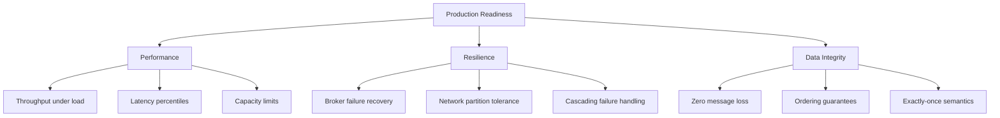
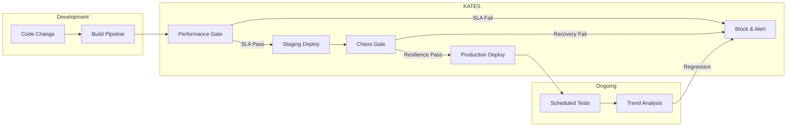

# Chapter 1: Introduction

## What Is Kates?

**KATES** — Kafka Advanced Testing & Engineering Suite — is a purpose-built platform for performance testing and chaos engineering on Apache Kafka clusters. It combines a Quarkus-based backend engine, a rich CLI, and deep Kubernetes integration to answer the questions that matter most in production:

- *How many messages per second can my cluster sustain before latency degrades?*
- *What happens to in-flight messages when a broker dies?*
- *Does my cluster recover from a network partition within my SLA?*
- *Is there any data loss under cascading failures?*

Unlike generic load testing tools, KATES understands Kafka semantics — producer acknowledgments, consumer group rebalancing, ISR tracking, and partition leadership. Unlike basic `kafka-perf-test`, KATES provides structured reports, SLA enforcement, historical trend analysis, and automated disruption testing with safety guardrails.

## The Problem Space

Running Kafka in production requires confidence in three dimensions:



Most teams validate these properties manually — running ad-hoc scripts, eyeballing Grafana dashboards, and hoping their cluster survives the next incident. KATES replaces this with **repeatable, automated, SLA-graded testing**.

## Design Philosophy

KATES was built around five principles:

### 1. Kafka-Native

Every test type understands Kafka protocol semantics. The engine configures producers and consumers with the right acknowledgment modes, tracks ISR state, and correlates latency with partition leadership changes.

### 2. Kubernetes-First

KATES runs inside Kubernetes, targets Strimzi-managed clusters, and uses the Kubernetes API directly for disruption injection — no external chaos tooling required (though Litmus integration is available for advanced scenarios).

### 3. SLA-Driven

Every test can define SLA thresholds. The engine evaluates results against these thresholds and produces a pass/fail verdict. This makes KATES suitable for CI/CD pipelines where a performance regression should block deployment.

### 4. Observable

All test execution produces structured data — JSON reports, CSV exports, JUnit XML for CI integration, and latency heatmaps for deep analysis. The live dashboard and `kates top` provide real-time visibility during test execution.

### 5. Safe by Default

Disruption tests include safety guardrails: maximum affected broker limits, automatic rollback, ISR tracking, and pre-flight validation. KATES will refuse to execute a disruption plan that could cause data loss beyond configured thresholds.

## Feature Overview

| Category | Features |
|----------|----------|
| **Performance Testing** | 8 test types: Load, Stress, Spike, Endurance, Volume, Capacity, Round-Trip, Integrity |
| **Chaos Engineering** | 10 disruption types, 6 built-in playbooks, safety guardrails, automatic rollback |
| **Data Integrity** | Sequence tracking, idempotency validation, exactly-once verification, gap detection |
| **Observability** | Latency heatmaps, broker metrics correlation, historical trends, sparkline charts |
| **Export Formats** | JSON, CSV, JUnit XML, Grafana-compatible heatmap JSON |
| **SLA Enforcement** | Per-test thresholds for throughput, latency, error rate with pass/fail verdicts |
| **CLI** | 30+ commands covering test management, reports, cluster inspection, and disruption control |
| **Scheduling** | Cron-based recurring tests for regression detection |
| **Resilience Testing** | Combined performance + chaos tests with before/after impact analysis |

## How KATES Fits Into Your Workflow



KATES can serve as both a **development-time validation tool** (run a quick load test before merging) and a **production-readiness gate** (run the full chaos suite before promoting to production).

## Quick Start

```bash
# Install the CLI
make cli-install

# Connect to a running KATES instance
kates ctx set local --url http://localhost:30083
kates ctx use local

# Check system health
kates health

# Run your first test
kates test create --type LOAD --records 100000 --wait

# View the report
kates test list
kates report show <id>
```

For a complete setup guide, see [Chapter 12: Deployment Guide](12-deployment.md). For hands-on tutorials, see the [Tutorials](../tutorials/) directory.
