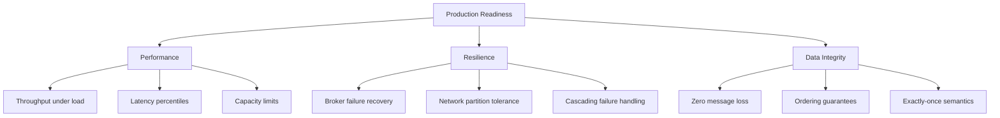
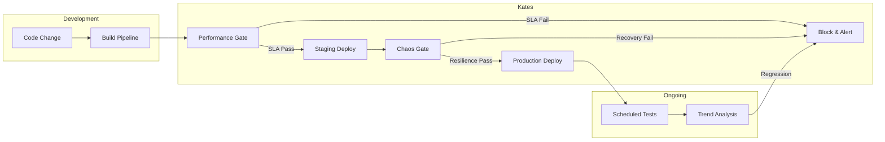

# Introduction

This chapter is for anyone who runs, tests, or is about to inherit an Apache Kafka cluster — platform engineers, SREs, and developers alike. After this chapter, you can:

- Explain what Kates does and how it differs from generic load testing tools
- Name the five design principles that shape every Kates feature
- Run your first LOAD test from the CLI and read its report
- Decide where Kates fits — and doesn't fit — in your toolchain

## What Is Kates?

**Kates** — Kafka Advanced Testing & Engineering Suite — is a purpose-built platform for performance testing and chaos engineering on Apache Kafka clusters. It combines a Quarkus-based backend engine, a rich CLI, and deep Kubernetes integration to answer the questions that matter most in production:

- *How many messages per second can my cluster sustain before latency degrades?*
- *What happens to in-flight messages when a broker dies?*
- *Does my cluster recover from a network partition within my SLA?*
- *Is there any data loss under cascading failures?*

Unlike generic load testing tools, Kates understands Kafka semantics — producer acknowledgments, consumer group rebalancing, ISR tracking, and partition leadership. Unlike basic `kafka-perf-test`, Kates provides structured reports, SLA enforcement, historical trend analysis, and automated disruption testing with safety guardrails.

## The Problem Space

Running Kafka in production requires confidence in three dimensions:


```mermaid
graph TD
    A[Production Readiness] --> B[Performance]
    A --> C[Resilience]
    A --> D[Data Integrity]
    
    B --> B1[Throughput under load]
    B --> B2[Latency percentiles]
    B --> B3[Capacity limits]
    
    C --> C1[Broker failure recovery]
    C --> C2[Network partition tolerance]
    C --> C3[Cascading failure handling]
    
    D --> D1[Zero message loss]
    D --> D2[Ordering guarantees]
    D --> D3[Exactly-once semantics]
```

Most teams validate these properties manually — running ad-hoc scripts, eyeballing Grafana dashboards, and hoping their cluster survives the next incident. Kates replaces this with **repeatable, automated, SLA-graded testing**.

## Design Philosophy

Kates was built around five principles:

### 1. Kafka-Native

Every test type understands Kafka protocol semantics. The engine configures producers and consumers with the right acknowledgment modes, tracks ISR state, and correlates latency with partition leadership changes.

### 2. Kubernetes-First

Kates runs inside Kubernetes, targets Strimzi-managed clusters, and uses the Kubernetes API directly for disruption injection — no external chaos tooling required (though Litmus integration is available for advanced scenarios).

### 3. SLA-Driven

Every test can define SLA thresholds. The engine evaluates results against these thresholds and produces a pass/fail verdict. This makes Kates suitable for CI/CD pipelines where a performance regression should block deployment.

### 4. Observable

All test execution produces structured data — JSON reports, CSV exports, JUnit XML for CI integration, and latency heatmaps for deep analysis. The live dashboard and `kates top` provide real-time visibility during test execution.

### 5. Safe by Default

Disruption tests include safety guardrails: maximum affected broker limits, automatic rollback, ISR tracking, and pre-flight validation. Kates will refuse to execute a disruption plan that could cause data loss beyond configured thresholds.

## Feature Overview

| Category | Features |
|----------|----------|
| **Performance Testing** | Load, Stress, Spike, Endurance, Volume, Capacity, Round-Trip, and Integrity test types |
| **Chaos Engineering** | Kubernetes-native disruption types, 6 built-in playbooks, safety guardrails, automatic rollback |
| **Data Integrity** | Sequence tracking, idempotency validation, exactly-once verification, gap detection |
| **Observability** | Latency heatmaps, broker metrics correlation, historical trends, sparkline charts |
| **Export Formats** | JSON, CSV, JUnit XML, Grafana-compatible heatmap JSON |
| **SLA Enforcement** | Per-test thresholds for throughput, latency, error rate with pass/fail verdicts |
| **CLI** | Commands covering test management, reports, cluster inspection, and disruption control |
| **Scheduling** | Cron-based recurring tests for regression detection |
| **Resilience Testing** | Combined performance + chaos tests with before/after impact analysis |

## How Kates Fits Into Your Workflow


```mermaid
graph LR
    subgraph Development
        A[Code Change] --> B[Build Pipeline]
    end
    
    subgraph Kates
        B --> C[Performance Gate]
        C -->|SLA Pass| D[Staging Deploy]
        D --> E[Chaos Gate]
        E -->|Resilience Pass| F[Production Deploy]
        C -->|SLA Fail| G[Block & Alert]
        E -->|Recovery Fail| G
    end
    
    subgraph Ongoing
        F --> H[Scheduled Tests]
        H --> I[Trend Analysis]
        I -->|Regression| G
    end
```

Kates can serve as both a **development-time validation tool** (run a quick load test before merging) and a **production-readiness gate** (run the full chaos suite before promoting to production).

## Quick Start

```bash
# Install the CLI
make cli-install

# Connect to a running Kates instance
kates ctx set local --url http://localhost:30083
kates ctx use local

# Check system health
kates health

# Run your first test
kates test create --type LOAD --records 100000 --wait

# View the report
kates test list
kates report show <id>
```

For a complete setup guide, see [Deployment Guide](12-deployment.md). For hands-on tutorials, see the [Tutorials](https://github.com/bmscomp/kates/tree/main/docs/tutorials) directory.

::: {.callout-tip}
**Try it**

Once the Quick Start connection works, take the report pipeline for a spin:

```bash
kates test types
kates test create --type LOAD --records 100000 --acks 1 --wait
kates test list --type LOAD
kates report show <id>

# Compare against your Quick Start run (which used the acks=all default)
kates report compare <id1,id2>
```

Expect a throughput summary, a latency distribution from average through P99, an error rate, and — when thresholds are set — an SLA verdict; the comparison shows what relaxing producer acknowledgments buys you in latency.
:::

## What Kates Is Not

To set expectations clearly:

- **Not a Confluent Platform replacement** — Kates is a testing and validation tool, not a managed Kafka distribution. It works alongside Confluent, Strimzi, or any Kafka deployment.
- **Not a general-purpose load tester** — Kates understands Kafka semantics (ISR tracking, consumer rebalancing, partition leadership). Use k6, Gatling, or Locust for HTTP/gRPC load testing.
- **Not a Kafka management UI** — for browsing topics, consumer groups, and cluster state in a web interface, use [Kafka UI](https://github.com/kafbat/kafka-ui) (which Kates deploys alongside).
- **Not a production monitoring system** — Kates is designed for testing and validation environments. For production monitoring, use Prometheus + Grafana directly (which Kates also deploys for its own observability).

## Summary

- Kates — Kafka Advanced Testing & Engineering Suite — pairs performance testing with chaos engineering, and understands Kafka semantics like producer acknowledgments, ISR state, and partition leadership rather than treating the cluster as a black box.
- Production readiness spans three dimensions — performance, resilience, and data integrity — and Kates grades all three with repeatable, SLA-driven tests instead of ad-hoc scripts.
- Five principles shape the design: Kafka-native, Kubernetes-first, SLA-driven, observable, and safe by default.
- Every test produces structured output — JSON, CSV, JUnit XML, heatmap data — so results feed CI/CD gates and trend analysis, not just terminal scrollback.
- Kates is a testing and validation platform, not a Kafka distribution, a management UI, or a production monitoring system.

Next, [Architecture & Design](02-architecture.md) opens the hood on the subsystems that make all of this work.

