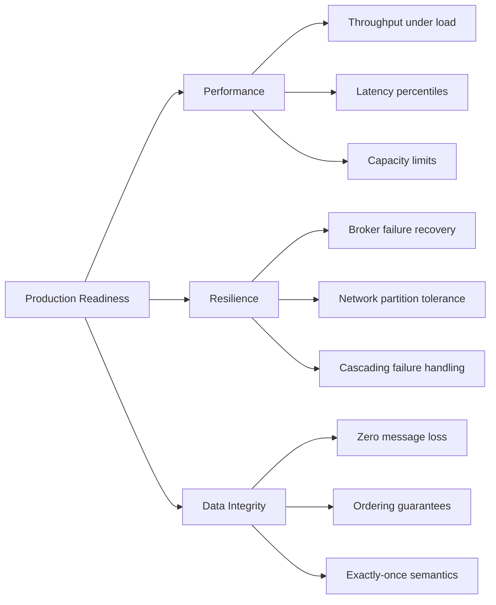
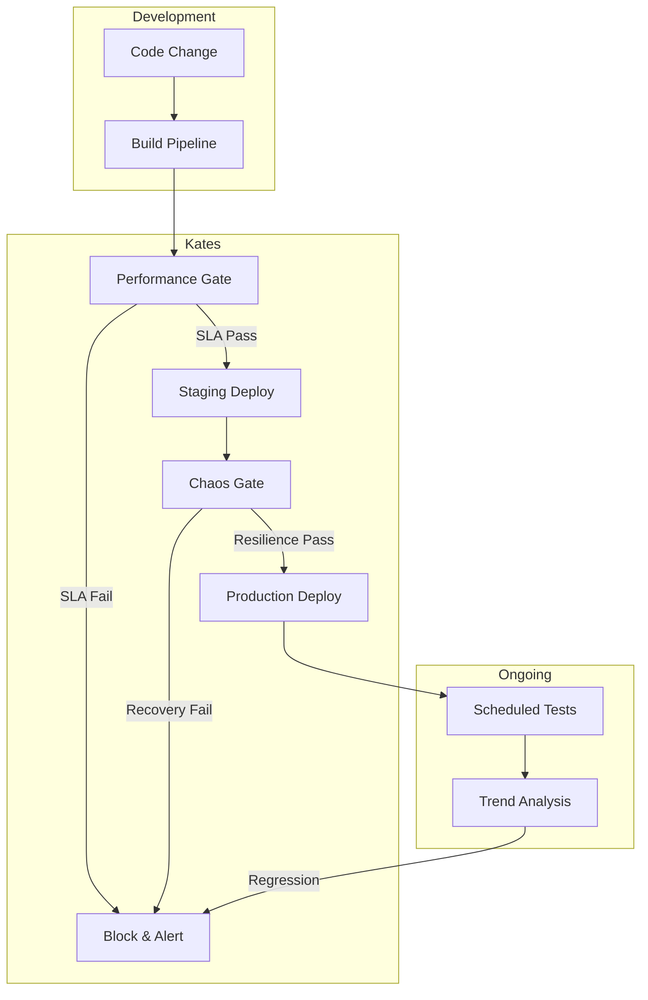

# Introduction

You find out how a Kafka cluster handles a [broker](appendix-a-glossary.md#gl-broker) failure on the day a broker fails, unless you've already tried it. Kates lets you try it first: it puts load on the cluster, injects the failure, and checks the numbers against targets you set. It's built for the people who run, test or are about to inherit an Apache Kafka cluster: platform engineers, SREs and developers.

After this chapter, you can:

- Explain what Kates does and how it differs from generic load testing tools
- Name the five design principles behind Kates
- Run your first [LOAD](appendix-a-glossary.md#gl-test-type) test from the CLI and read its report
- Decide where Kates fits in your toolchain, and where it doesn't

## What Is Kates?

Kates (Kafka Advanced Testing & Engineering Suite) is a tool for performance testing and chaos engineering on Apache Kafka clusters. It has two halves: the `kates` CLI on your machine, and the [Kates API](appendix-a-glossary.md#gl-kates-api), a service in the cluster that generates load, drives faults and keeps every run in PostgreSQL. [Architecture & Design](02-architecture.md) shows the parts. Together they answer questions like these:

- *How many records per second can my cluster sustain before latency degrades?*
- *What happens to in-flight messages when a [broker](appendix-a-glossary.md#gl-broker) dies?*
- *Does my cluster recover from a network partition within my [SLA](appendix-a-glossary.md#gl-sla)?*
- *Is there any data loss under cascading failures?*

A generic load testing tool treats Kafka as an endpoint that accepts requests. Kates sets [producer acknowledgments](appendix-a-glossary.md#gl-acks), batching and consumer group settings for each test, and a fault can aim at a partition's leader while Kates tracks the [ISR](appendix-a-glossary.md#gl-isr). `kafka-producer-perf-test` prints its numbers and exits; Kates stores every run, checks it against your targets and keeps the history for trends. A [safety guard](appendix-a-glossary.md#gl-safety-guard) checks each [disruption](appendix-a-glossary.md#gl-disruption) before it starts.

## The Problem Space

Before you trust a cluster with production traffic, you need answers in three areas, and each one is tested differently. The diagram splits each area into the properties you test for it:


```mermaid
%%| label: fig-intro-readiness
%%| fig-cap: "Production readiness rests on performance, resilience and data integrity, each with the properties you test for it."
%%| fig-alt: "Tree diagram. Production Readiness branches into Performance, Resilience and Data Integrity. Performance covers throughput under load, latency percentiles and capacity limits. Resilience covers broker failure recovery, network partition tolerance and cascading failure handling. Data Integrity covers zero message loss, ordering guarantees and exactly-once semantics."
graph LR
    A[Production Readiness] --> B[Performance]
    A --> C[Resilience]
    A --> D[Data Integrity]
    
    B --> B1[Throughput under load]
    B --> B2[Latency percentiles]
    B --> B3[Capacity limits]
    
    C --> C1[Broker failure recovery]
    C --> C2[Network partition tolerance]
    C --> C3[Cascading failure handling]
    
    D --> D1[Zero message loss]
    D --> D2[Ordering guarantees]
    D --> D3[Exactly-once semantics]
```

Most teams check these by hand: a perf-test script, a [Grafana](appendix-a-glossary.md#gl-grafana) dashboard watched while someone deletes a pod, and a judgment call. Kates turns the same checks into tests you can repeat, run in a pipeline and check against targets you set.

## Design Philosophy

Kates was built around five principles:

### 1. Kafka-Native

The native [benchmark backend](appendix-a-glossary.md#gl-benchmark-backend), which generates a test's load by default, runs real Kafka producers and consumers with the `acks`, batching, compression and [consumer group](appendix-a-glossary.md#gl-consumer-group) settings of the test's spec. A [disruption plan](appendix-a-glossary.md#gl-disruption-plan) can aim a fault at a partition's leader and track a [topic](appendix-a-glossary.md#gl-topic)'s ISR while the fault runs.

### 2. Kubernetes-First

Kates runs inside Kubernetes and targets [Strimzi](appendix-a-glossary.md#gl-strimzi)-managed clusters. It injects faults through [LitmusChaos](appendix-a-glossary.md#gl-litmuschaos), which `make all` installs with the rest of the stack, or straight through the Kubernetes API if you choose; [Chaos Engineering in Practice](07-chaos-practice.md) says which faults each can run. Load tests work against any Kafka cluster the Kates API can reach.

### 3. SLA-Driven

Every test can carry the targets it must meet. Kates calls them SLA thresholds, though they work like SLOs: targets you set, not agreements with anyone [@beyer2016site]. In a scenario file they are [gates](appendix-a-glossary.md#gl-gate), which `kates test apply --wait` checks after each run, exiting 1 when one is missed. A disruption plan's thresholds earn it an [SLA grade](appendix-a-glossary.md#gl-sla-grade) from A to F instead. So a CI job can fail the build when throughput drops or P99 rises past a gate.

### 4. Observable

Every run produces a JSON report, which you can export as CSV, as JUnit XML for CI, or as [heatmap](appendix-a-glossary.md#gl-heatmap) data that shows how latency spread over time. While a test runs, `kates top` and the live dashboard show it as it happens.

### 5. Safe by Default

Kates refuses a disruption plan that would hit every broker, or more brokers than the plan's `maxAffectedBrokers` allows. Before each fault, it checks that every Kafka pod is Ready. By default, when a step fails, [rollback](appendix-a-glossary.md#gl-disruption-rollback) gives back a broker that a scale-down removed and deletes the NetworkPolicies Kates created for a network partition. This safety guard counts brokers, not replicas. It doesn't read the ISR or the KRaft quorum, and a [resilience run](appendix-a-glossary.md#gl-resilience-run) doesn't go through it. [Chaos Engineering in Practice](07-chaos-practice.md#safety-guardrails) says exactly what it checks.

## Feature Overview

The table maps each area of Kates to what it gives you. The first three rows match the three areas in the diagram above.

| Category | Features |
|----------|----------|
| Performance Testing | LOAD, STRESS, SPIKE, ENDURANCE, VOLUME, CAPACITY, ROUND_TRIP and INTEGRITY test types |
| Chaos Engineering | Kubernetes-native [disruption types](appendix-a-glossary.md#gl-disruption-type), 6 built-in [playbooks](appendix-a-glossary.md#gl-playbook), a safety guard that caps the brokers a plan hits, rollback of scale-downs and of the partitions Kates creates |
| Data Integrity | Sequence tracking, [idempotency](appendix-a-glossary.md#gl-idempotent-producer) validation, [exactly-once](appendix-a-glossary.md#gl-exactly-once-semantics) verification, gap detection |
| Observability | Latency heatmaps, broker metrics correlation, historical trends, [sparkline](appendix-a-glossary.md#gl-sparkline) charts |
| Export Formats | JSON, CSV, JUnit XML, Grafana-compatible heatmap JSON |
| SLA Enforcement | Gates on [throughput](appendix-a-glossary.md#gl-throughput), latency, recovery and data loss per scenario; an SLA grade for each disruption plan with an `sla` block |
| CLI | `kates test`, `kates report`, `kates cluster`, `kates disruption` and `kates trend`, among others |
| Scheduling | Cron-based recurring tests for regression detection |
| Resilience Testing | Resilience runs: one Kates test with one fault injected while it runs, reported as before-and-after impact |

## How Kates Fits Into Your Workflow

The diagram places Kates in a delivery pipeline as two gates. Read it from the top: a change passes a performance gate before staging and a chaos gate before production, and after release, scheduled tests feed a trend that sends any regression to the same block-and-alert step.


```mermaid
%%| label: fig-intro-workflow
%%| fig-cap: "Kates as two gates in a delivery pipeline: performance before staging, resilience before production, and scheduled tests watching the trend afterwards."
%%| fig-alt: "Flowchart in three groups. Development: a code change goes to the build pipeline. Kates: the build reaches a performance gate; an SLA pass leads to a staging deploy and then a chaos gate, and a resilience pass leads to a production deploy. An SLA fail or a recovery fail leads to Block and Alert. Ongoing: the production deploy is followed by scheduled tests and trend analysis, and a regression also leads to Block and Alert."
graph TB
    subgraph Development
        A[Code Change] --> B[Build Pipeline]
    end
    
    subgraph Kates
        B --> C[Performance Gate]
        C -->|SLA Pass| D[Staging Deploy]
        D --> E[Chaos Gate]
        E -->|Resilience Pass| F[Production Deploy]
        C -->|SLA Fail| G[Block & Alert]
        E -->|Recovery Fail| G
    end
    
    subgraph Ongoing
        F --> H[Scheduled Tests]
        H --> I[Trend Analysis]
        I -->|Regression| G
    end
```

Day to day, that means two uses: a quick LOAD test before you merge a change, and the full chaos suite before you promote a release to production.

## Quick Start

The Quick Start assumes a checkout of the repository, for the `make` targets, and a stack deployed with `make all` or `kates deploy` in the [isolated topology](appendix-a-glossary.md#gl-isolated-topology), which puts the Kates API in the `kates` namespace.

```bash
# Install the CLI
make cli-install

# Forward the Kates API to localhost:30083 (the forwards run in the background)
make ports

# Connect to the running Kates instance, with the API key the chart generated
kates ctx set local --url http://localhost:30083 \
  --api-key "$(kubectl get secret kates-api-key -n kates -o jsonpath='{.data.api-key}' | base64 -d)"
kates ctx use local

# Check system health
kates health

# Run your first test
kates test create --type LOAD --records 100000 --wait

# View the report: <id> is the ID that test create printed, and test list shows it again
kates test list
kates report show <id>
```

Every `/api` endpoint except `/api/health` requires the [API key](appendix-a-glossary.md#gl-api-key), which the `kates` chart generates into the `kates-api-key` [Secret](appendix-a-glossary.md#gl-secret). `kates deploy` writes the key into whichever [CLI context](appendix-a-glossary.md#gl-cli-context) is active when it finishes — on a fresh machine, the built-in `default` context at `http://localhost:8080` — unless that context already holds a key that kates did not put there, and never into a context you create afterwards, so `kates ctx set` needs `--api-key`, as above. Because the health endpoint is public, `kates health` succeeds even without a key; every other command in the block needs one, starting with `kates test create`, which fails with `[401] Missing API key` when the context has none.

::: {.callout-note}
`kates ports` does both steps at once: it forwards the API to `localhost:8080` rather than 30083, points a CLI context of its own, `ports`, at that address with the key from the `kates-api-key` Secret, and makes `ports` the current context. It creates that context the first time and changes no other, so a context you set up yourself keeps its URL and key. It stops every `kubectl port-forward` already running, including those `make ports` started. With the [single-namespace topology](appendix-a-glossary.md#gl-single-namespace-topology) (option 1 in `make all`), the Kates API and its API-key Secret live in `kates-stack`: use `-n kates-stack` in the `kubectl` command, and `KATES_NS=kates-stack make ports` for the API forward.
:::

The REST and [gRPC](appendix-a-glossary.md#gl-grpc) examples in this book read the same key from the `KATES_API_KEY` variable; [REST API Reference](11-api-reference.md#authentication) shows how to export it.

For a complete setup guide, see [Deployment Guide](12-deployment.md). For hands-on tutorials, see the [Tutorials](https://github.com/bmscomp/kates/tree/main/docs/tutorials) directory.

::: {.callout-tip}
**Try it**

Once the Quick Start connection works, take the report pipeline for a spin:

```bash
kates test types
kates test create --type LOAD --records 100000 --acks 1 --wait
kates test list --type LOAD
kates report show <id>        # the ID the create above printed

# Compare against your Quick Start run (which used the acks=all default);
# test list shows both IDs, joined here with a comma
kates report compare <quick-start-id>,<id>
```

Expect a throughput summary, a latency distribution from average through [P99](appendix-a-glossary.md#gl-percentile), an error rate, and an SLA section, which reads `All SLA thresholds met` unless the run missed a threshold it carried. The comparison shows what relaxing producer acknowledgments buys you in latency.
:::

## What Kates Is Not

Kates leaves several nearby jobs to other tools:

- It isn't a Confluent Platform replacement or a managed Kafka distribution. It tests clusters that Confluent, Strimzi or any other Kafka deployment runs.
- It isn't a general-purpose load tester. Its tests are built around Kafka behavior, such as ISR tracking, consumer [rebalancing](appendix-a-glossary.md#gl-rebalance) and [partition](appendix-a-glossary.md#gl-partition) leadership. For HTTP or gRPC load, use k6, Gatling or Locust.
- It isn't a Kafka management UI. To browse topics, consumer groups and cluster state in a browser, use [Kafka UI](https://github.com/kafbat/kafka-ui), which Kates deploys alongside the cluster.
- It isn't a production monitoring system. Kates is designed for testing and validation environments, so monitor production with [Prometheus](appendix-a-glossary.md#gl-prometheus) and Grafana directly. Kates deploys both too, for its own observability.

## Summary

- Kates — Kafka Advanced Testing & Engineering Suite — pairs performance testing with chaos engineering, and understands Kafka semantics like producer acknowledgments, ISR state, and partition leadership rather than treating the cluster as a black box.
- Production readiness spans three dimensions — performance, resilience, and data integrity — and Kates checks all three with repeatable tests against targets you set.
- Five principles shape the design: Kafka-native, Kubernetes-first, SLA-driven, observable, and safe by default.
- Every test produces structured output — JSON, CSV, JUnit XML, heatmap data — so results feed CI/CD gates and trend analysis, not just terminal scrollback.
- Kates is a testing and validation platform, not a Kafka distribution, a management UI, or a production monitoring system.

Next, [Architecture & Design](02-architecture.md) opens the hood: it shows the two halves of Kates, what runs where, and where a run's results live.

