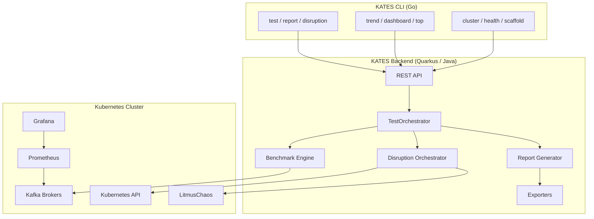
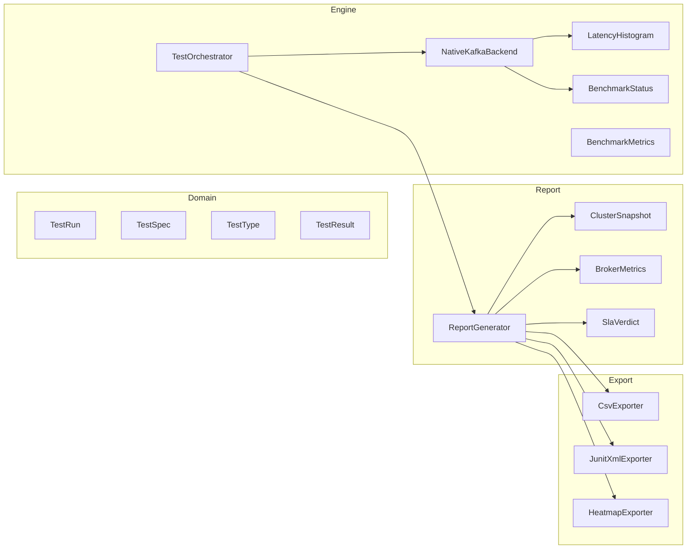
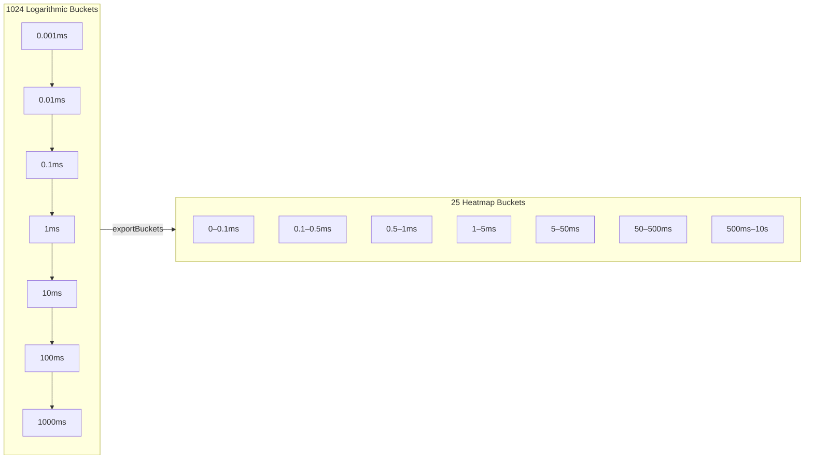
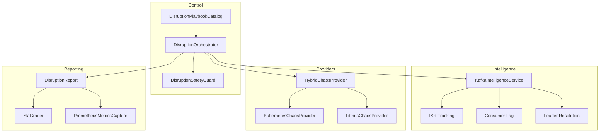
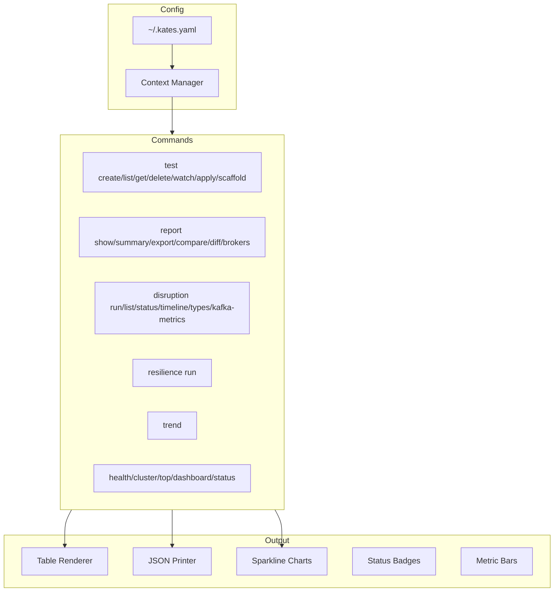
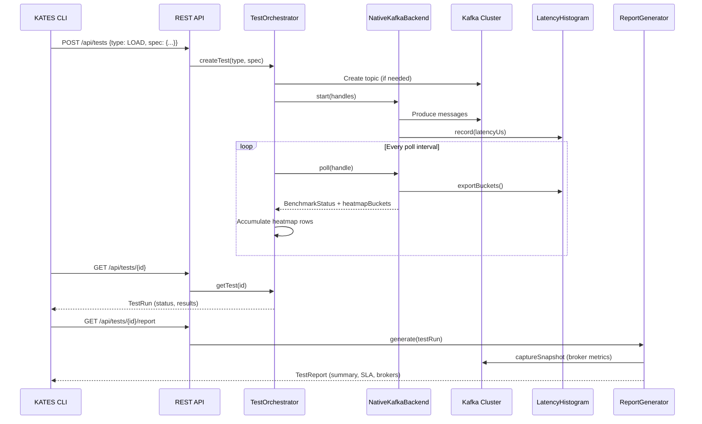
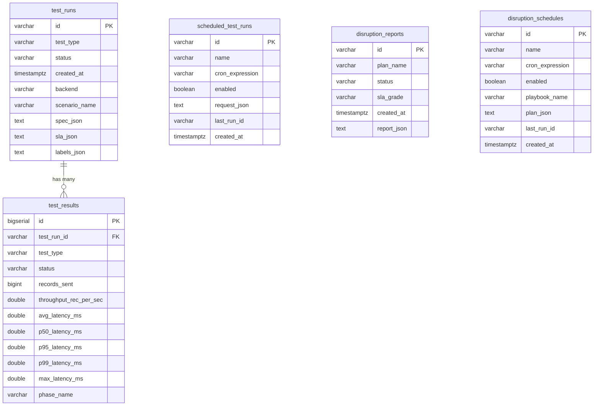

# Chapter 2: Architecture & Design

KATES is composed of four major subsystems: the **backend engine**, the **CLI**, the **infrastructure layer**, and the **observability stack**. This chapter explains how they fit together.

## High-Level Architecture

## Backend Engine

The backend is a **Quarkus application** running in JVM mode (with native image support via GraalVM). It exposes a REST API and manages the full test lifecycle.

### Component Map

### TestOrchestrator

The `TestOrchestrator` is the central coordinator. When a test is created, it:

1. **Resolves defaults** — merges the incoming `TestSpec` with `TestTypeDefaults` for the chosen test type
2. **Creates the topic** — ensures the Kafka topic exists with the required partition count and replication factor
3. **Launches workers** — delegates to the `BenchmarkBackend` to start producer/consumer tasks
4. **Polls status** — periodically polls each `BenchmarkHandle` for `BenchmarkStatus` updates
5. **Collects heatmap data** — captures per-second latency bucket distributions during polling
6. **Generates reports** — produces a `TestReport` with summary metrics, SLA verdicts, and broker correlation

### NativeKafkaBackend

The in-process Kafka benchmark engine. Each test launches `WorkerState` threads that:

- **Produce** messages with configurable record size, acknowledgment mode, and throughput throttling
- **Consume** messages with configurable consumer group, fetch settings, and poll timeout
- **Record latency** in a lock-free `LatencyHistogram` (1024 logarithmic buckets, microsecond precision)
- **Track integrity** — sequence numbers, acknowledgment gaps, and consumer-side deduplication

### LatencyHistogram

The histogram is the heart of latency measurement. It uses **logarithmic bucketing** to provide high resolution at low latencies (sub-millisecond) while covering tails up to 10+ seconds.

Key methods:

| Method | Lock | Purpose |
|--------|------|---------|
| `record(latencyUs)` | Read | Record a single latency observation |
| `getPercentile(p)` | Read | Compute p50/p95/p99 from cumulative distribution |
| `exportBuckets()` | Read | Compress to 25 heatmap ranges (non-destructive) |
| `snapshotAndReset()` | Write | Atomic capture + reset for windowed collection |

## Disruption Engine

The disruption subsystem provides **Kubernetes-native chaos injection** with Kafka awareness.

### Disruption Types

| Type | Description | Implementation |
|------|-------------|----------------|
| `POD_KILL` | Immediately terminate a broker pod | `kubectl delete pod --grace-period=0` |
| `POD_DELETE` | Gracefully delete a broker pod | `kubectl delete pod` |
| `NETWORK_PARTITION` | Isolate a broker from the cluster | Litmus `pod-network-partition` |
| `NETWORK_LATENCY` | Inject latency into broker network | Litmus `pod-network-latency` |
| `CPU_STRESS` | Saturate CPU on a broker node | Litmus `pod-cpu-hog` |
| `DISK_FILL` | Fill the broker's persistent volume | Litmus `disk-fill` |
| `ROLLING_RESTART` | Restart all brokers sequentially | Kubernetes rolling update |
| `LEADER_ELECTION` | Force leader re-election for a partition | Kill the current leader broker |
| `SCALE_DOWN` | Reduce the number of broker replicas | Strimzi scale operation |
| `NODE_DRAIN` | Drain a Kubernetes node | `kubectl drain` |

### Safety Guardrails

The `DisruptionSafetyGuard` validates every disruption plan before execution:

- **Maximum affected brokers** — prevents killing more than N brokers simultaneously
- **ISR health check** — refuses to proceed if partitions are already under-replicated
- **Quorum protection** — ensures the KRaft metadata quorum maintains majority
- **Auto-rollback** — monitors cluster health during execution and rolls back if thresholds are breached

## CLI Architecture

The CLI is a **standalone Go binary** built with Cobra. It communicates with the backend exclusively through the REST API.

Key design decisions:

- **Multi-context support** — like `kubectl`, the CLI supports named contexts for targeting different KATES instances
- **Rich terminal output** — tables, colored badges, metric bars, sparkline charts, and ASCII banners
- **Scaffold templates** — `kates test scaffold --type LOAD` generates ready-to-use YAML scenario files
- **Streaming watch** — `kates test watch` and `kates disruption watch` provide real-time progress updates

## Data Flow

This diagram traces a complete test execution from CLI command to final report:

## Technology Stack

| Component | Technology | Version | Purpose |
|-----------|-----------|---------|---------|
| Backend | Quarkus | 3.x | REST framework, CDI, native compilation |
| Runtime | Java | 21+ | Virtual threads, modern GC |
| Build | Maven | 3.x | Backend build system |
| CLI | Go | 1.22+ | Cross-platform binary |
| CLI Framework | Cobra | Latest | Command parsing, help generation |
| Cluster | Kind | Latest | Local Kubernetes simulation |
| Kafka | Apache Kafka | 4.1.1 | KRaft mode, no ZooKeeper |
| Operator | Strimzi | 0.49.1 | Kafka lifecycle management |
| Chaos | LitmusChaos | Latest | Advanced chaos experiments |
| Monitoring | Prometheus + Grafana | Latest | Metrics collection and visualization |
| Registry | Apicurio | Latest | Schema registry for Kafka |
| Database | PostgreSQL | Latest | Test results and schedule persistence |

## Data Model

KATES uses PostgreSQL for persistent storage. The schema is managed by Flyway migrations in `kates/src/main/resources/db/migration/`.

### Migration History

| Version | File | Purpose |
|:---:|------|---------|
| V1 | `V1__create_test_tables.sql` | `test_runs` + `test_results` with indexes on type, status, created_at |
| V2 | `V2__create_schedules_table.sql` | `scheduled_test_runs` for recurring test automation |
| V3 | `V3__create_disruption_reports.sql` | `disruption_reports` with SLA grade tracking |
| V4 | `V4__create_disruption_schedules.sql` | `disruption_schedules` for recurring chaos tests |
