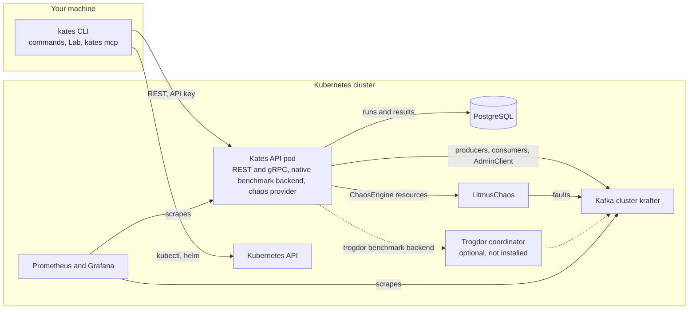
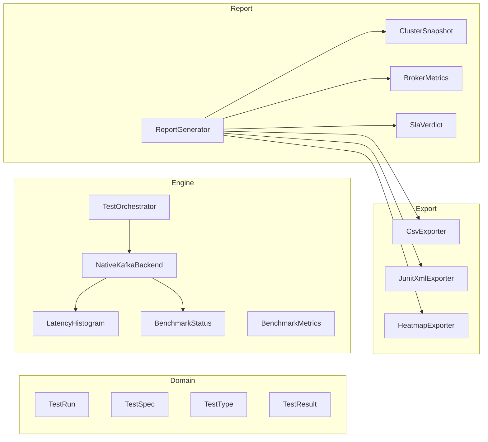
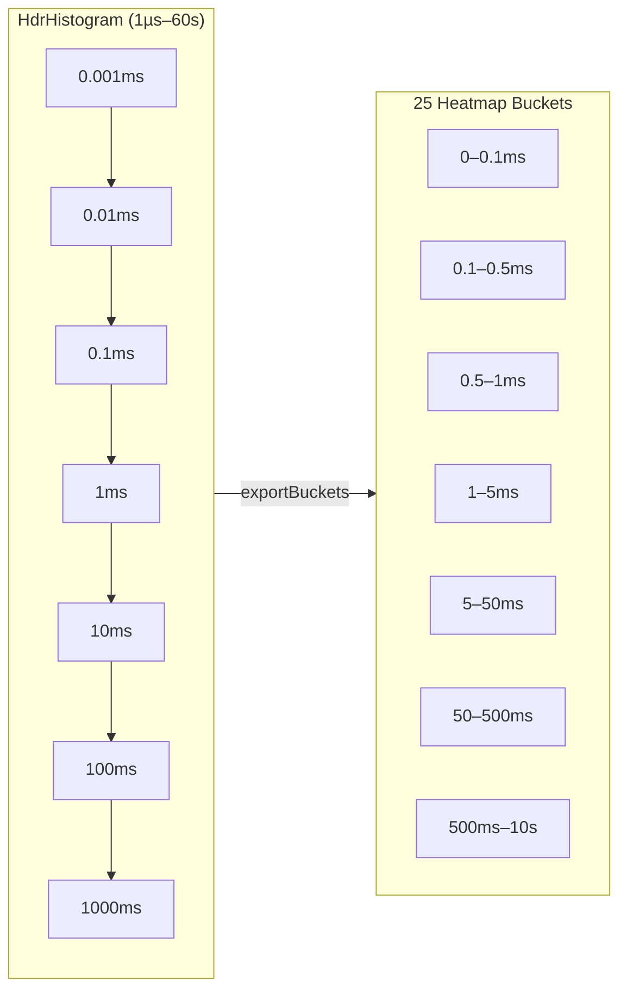
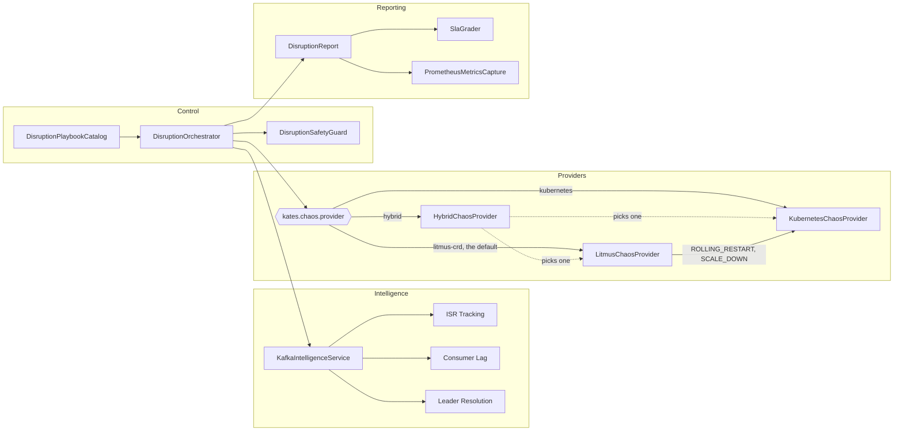
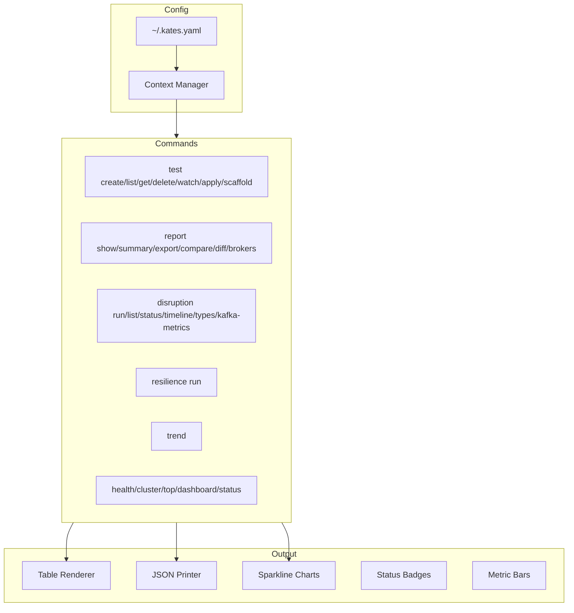
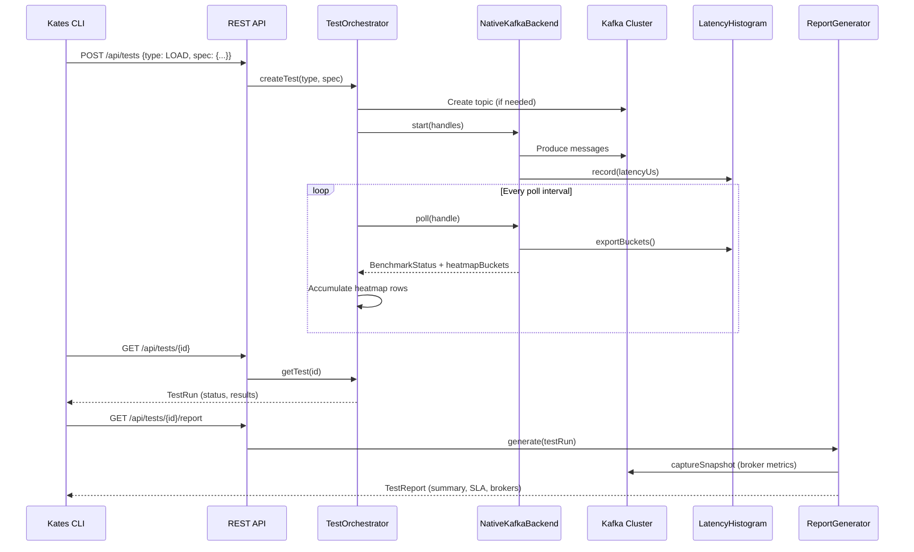
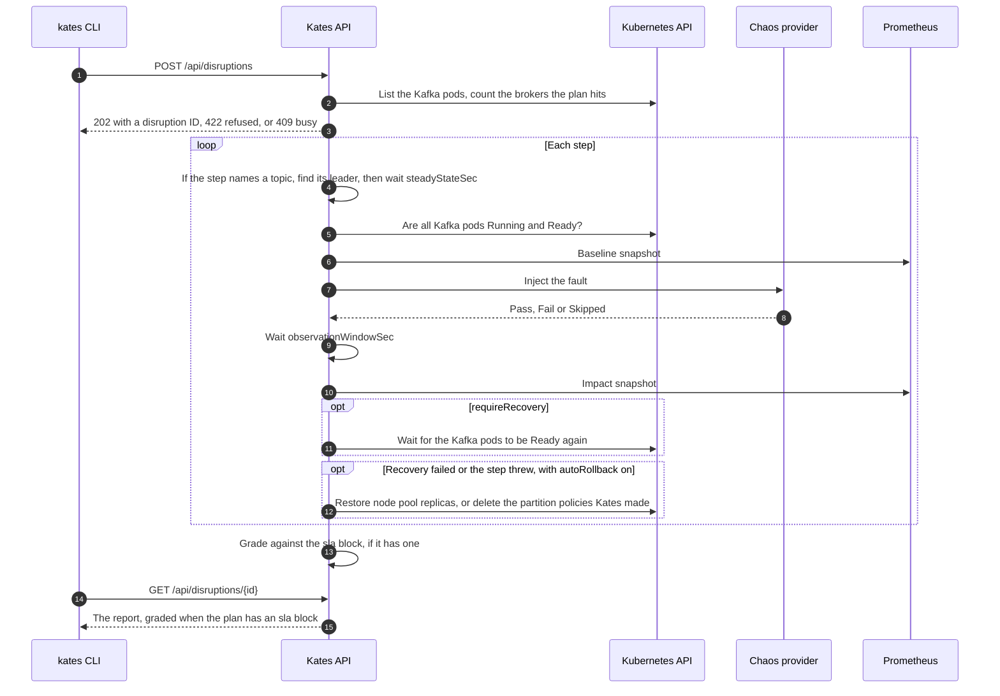
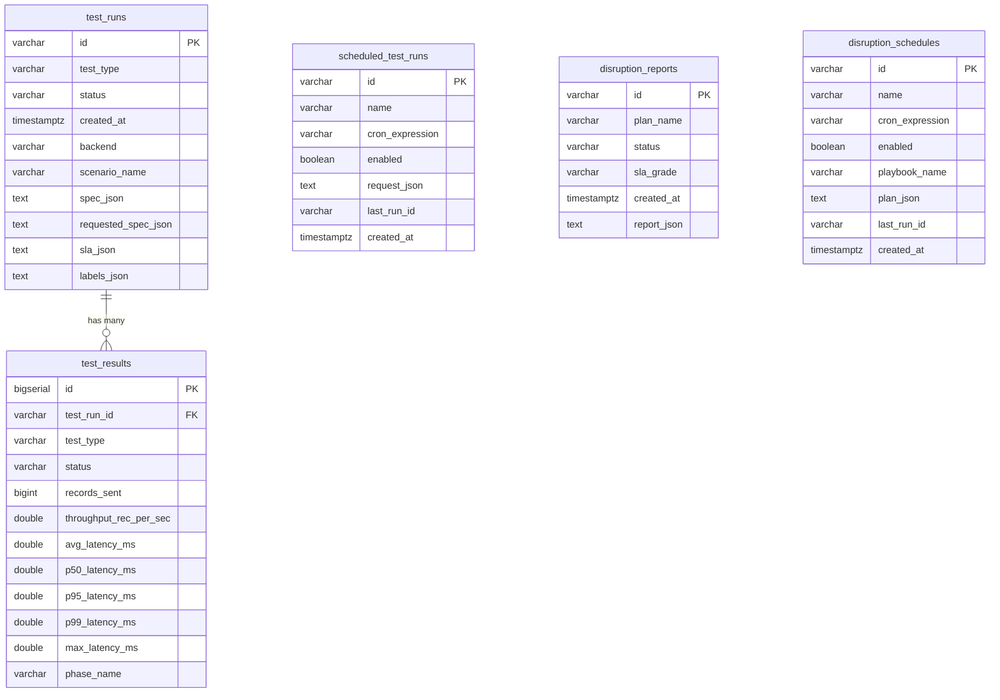

# Architecture & Design

Kates has two halves: the `kates` CLI on your machine, and the [Kates API](appendix-a-glossary.md#gl-kates-api) in the cluster. Around them, `kates deploy` installs Kafka, [PostgreSQL](appendix-a-glossary.md#gl-postgresql), LitmusChaos, Prometheus and Grafana, and this chapter shows how the parts fit. It serves anyone who operates, extends, or debugs Kates — the mental model built here underpins every later chapter. After this chapter, you can:

- Name Kates's parts and say where each one runs
- Trace a [LOAD](appendix-a-glossary.md#gl-test-type) test from `kates test create` through the `TestOrchestrator` and `NativeKafkaBackend` to its final `TestReport`
- Say what the [safety guard](appendix-a-glossary.md#gl-safety-guard) checks before a [disruption plan](appendix-a-glossary.md#gl-disruption-plan) injects a fault, and what it rolls back when a step fails
- Say where a run's results live, and how long each piece of them lasts

## High-Level Architecture

The half of Kates that does the work isn't on your machine. The `kates` CLI runs where you type; the Kates API runs in the cluster, as one Deployment beside the Kafka cluster it tests. It generates the load, asks for the faults, grades disruption plans and keeps every run in PostgreSQL.

The diagram shows the main parts of a default `kates deploy` and who calls whom. Solid arrows are the default paths; the dashed ones are the [Trogdor](appendix-a-glossary.md#gl-trogdor) path, which `kates deploy` doesn't set up.


```mermaid
%%| label: fig-architecture-parts
%%| fig-cap: "The CLI on your machine drives the Kates API in the cluster, which generates load on Kafka, keeps runs in PostgreSQL and asks LitmusChaos for faults."
%%| fig-alt: "Flowchart in two groups. On your machine, the kates CLI calls the Kates API over REST with an API key, and calls the Kubernetes API through kubectl and helm. In the cluster, the Kates API stores runs in PostgreSQL, produces to and consumes from the Kafka cluster krafter, and creates ChaosEngine resources that LitmusChaos turns into faults on Kafka. A dashed path runs from the Kates API through an optional Trogdor coordinator to Kafka. Prometheus scrapes the Kates API and Kafka."
flowchart LR
    subgraph Machine["Your machine"]
        CLI["kates CLI<br/>commands, Lab, kates mcp"]
    end
    subgraph Cluster["Kubernetes cluster"]
        API["Kates API pod<br/>REST and gRPC, native benchmark backend, chaos provider"]
        PG[("PostgreSQL")]
        KAFKA["Kafka cluster krafter"]
        LIT["LitmusChaos"]
        TROG["Trogdor coordinator<br/>optional, not installed"]
        PROM["Prometheus and Grafana"]
        K8S["Kubernetes API"]
    end
    CLI -->|"REST, API key"| API
    CLI -->|"kubectl, helm"| K8S
    API -->|"runs and results"| PG
    API -->|"producers, consumers, AdminClient"| KAFKA
    API -->|"ChaosEngine resources"| LIT
    LIT -->|"faults"| KAFKA
    API -.->|"trogdor benchmark backend"| TROG
    TROG -.-> KAFKA
    PROM -->|"scrapes"| API
    PROM -->|"scrapes"| KAFKA
```

Read it from the left. The CLI calls the Kates API over REST, with the URL and API key of your [CLI context](appendix-a-glossary.md#gl-cli-context). For the commands that install and reach the stack, such as `kates deploy` and `kates ports`, it runs `kubectl` and `helm` against your current Kubernetes context instead. The [Commands](10-cli-reference.md#commands) table in CLI Reference says which command takes which path. In the cluster, the Kates API talks to [`krafter`](appendix-a-glossary.md#gl-krafter), the Kafka cluster under test, as an ordinary Kafka client, and keeps each run in PostgreSQL. On the default [chaos provider](appendix-a-glossary.md#gl-chaos-provider), it creates [LitmusChaos](appendix-a-glossary.md#gl-litmuschaos) resources for every fault except `ROLLING_RESTART` and `SCALE_DOWN`, which it injects itself through the Kubernetes API. [Prometheus](appendix-a-glossary.md#gl-prometheus) scrapes the [brokers](appendix-a-glossary.md#gl-broker) and the Kates API, and the Kates API reads Prometheus back for a disruption plan's broker metrics.

Each part in the table runs in one place. The namespaces are those of the default [isolated topology](appendix-a-glossary.md#gl-isolated-topology); with `--topology single`, every part below that runs in the cluster, except Trogdor, shares `kates-stack`, as [Single-Namespace vs Multi-Namespace](12-deployment.md#single-namespace-vs-multi-namespace) describes.

| Part | What it does | Where it runs |
|:--|:--|:--|
| `kates` CLI | Calls the Kates API, and runs `kubectl` and `helm` for the commands that install, reach and remove the stack | Your machine |
| Lab, `dashboard`, `top` and `kafka tui` | Terminal views on the Kates API; every run Lab starts, warm-ups and median runs included, is one [test run](appendix-a-glossary.md#gl-test-run) | Your machine, inside the CLI |
| `kates mcp` | Serves read-only tools to an AI agent, whose MCP client starts it | Your machine, inside the CLI |
| Kates API | Serves REST and [gRPC](appendix-a-glossary.md#gl-grpc) on port 8080, and runs tests, [disruptions](appendix-a-glossary.md#gl-disruption) and schedules | Deployment `kates`, namespace `kates` |
| Native [benchmark backend](appendix-a-glossary.md#gl-benchmark-backend) | Runs a test's producers and consumers on [virtual threads](appendix-a-glossary.md#gl-virtual-thread) inside the Kates API | The Kates API pod |
| Trogdor benchmark backend | Sends a test's workload to a Trogdor coordinator, which `kates deploy` doesn't install | The Kates API pod; the load comes from the Trogdor agents you run |
| Chaos provider | Turns each fault into LitmusChaos resources or direct Kubernetes API calls | The Kates API pod |
| LitmusChaos | Runs the experiments the chaos provider asks for | [Operator](appendix-a-glossary.md#gl-operator) in `litmus`; ChaosEngines in `kafka` |
| PostgreSQL | Keeps runs and their results, disruption reports, schedules, [baselines](appendix-a-glossary.md#gl-baseline) and audit events | StatefulSet `kates-postgresql`, namespace `kates` |
| `krafter` | The Kafka cluster under test | Namespace `kafka` |
| Prometheus and [Grafana](appendix-a-glossary.md#gl-grafana) | Scrape and chart the brokers and the Kates API | Namespace `monitoring` |

The Kates API is one process, and that has a cost. A native run's producers and consumers share the pod's CPU and memory with everything else the Kates API does. `kates deploy` limits that pod to one CPU and 512 MiB of memory, on [Kind](appendix-a-glossary.md#gl-kind) and on other clusters alike. A [throughput](appendix-a-glossary.md#gl-throughput) ceiling you measure can therefore be the pod's rather than `krafter`'s.

The Kates API comes as two images built from the same code: a JVM image and a [GraalVM native image](appendix-a-glossary.md#gl-graalvm-native-image). On a Kind cluster, `kates deploy` runs a native image that you built or pulled onto your machine, `kates:native-local` or else `kates:native`, and never pulls one itself. Without either, it stops at the Kates API step and names the command that builds one. On any other cluster, it runs the published JVM image. The two collect garbage differently: the native image's Serial GC stops the Kates API for every collection, and those pauses land in the latencies it records. [Native Image Build](12-deployment.md#native-image-build) explains when to run which.

## The Kates API

The Kates API is a Quarkus application. It exposes both a REST API and a **gRPC API** (see [gRPC API Reference](16-grpc-api.md)), and manages the full test lifecycle. Both APIs delegate to the same service layer, so a test run behaves the same whichever API starts it; the gRPC API covers fewer operations, and some of its responses carry less than their REST counterparts, as its chapter lists.

### Component Map


```mermaid
graph LR
    subgraph Domain
        TR[TestRun]
        TS[TestSpec]
        TT[TestType]
        TRes[TestResult]
    end
    
    subgraph Engine
        TO[TestOrchestrator]
        NKB[NativeKafkaBackend]
        LH[LatencyHistogram]
        BS[BenchmarkStatus]
        BM[BenchmarkMetrics]
    end
    
    subgraph Report
        RG[ReportGenerator]
        CS[ClusterSnapshot]
        BrokerM[BrokerMetrics]
        SLA[SlaVerdict]
    end
    
    subgraph Export
        CSV[CsvExporter]
        JUnit[JunitXmlExporter]
        HM[HeatmapExporter]
    end
    
    TO --> NKB
    NKB --> LH
    NKB --> BS
    RG --> CS
    RG --> BrokerM
    RG --> SLA
    RG --> CSV
    RG --> JUnit
    RG --> HM
```

### TestOrchestrator

The `TestOrchestrator` is the central coordinator. When a test is created, it:

1. **Resolves defaults** — merges the incoming `TestSpec` with `TestTypeDefaults` for the chosen test type
2. **Creates the topic** — ensures the Kafka [topic](appendix-a-glossary.md#gl-topic) exists with the required [partition](appendix-a-glossary.md#gl-partition) count and [replication factor](appendix-a-glossary.md#gl-rf)
3. **Launches workers** — delegates to the `BenchmarkBackend` to start producer/consumer tasks
4. **Polls status** — periodically polls each `BenchmarkHandle` for `BenchmarkStatus` updates
5. **Collects heatmap data** — on each poll of a running test, stores the latency buckets recorded so far as one [heatmap](appendix-a-glossary.md#gl-heatmap) row

The Kates API builds a report only when something asks for one. It builds a finished run's report from the stored run the first time it's asked (`ReportGenerator`), with summary metrics, whether the run met its [SLA](appendix-a-glossary.md#gl-sla) thresholds (targets you set, in the style of an SLO) and broker correlation.

### NativeKafkaBackend

The native benchmark backend (`NativeKafkaBackend`) runs each test's producers and consumers on virtual threads inside the Kates API [@jep444]. It is one of two benchmark backends; the other, `trogdor`, sends the workload to a Trogdor coordinator, and [Test Types Deep Dive](05-test-types.md) compares them. Its workers:

- **Produce** messages with configurable record size, [acknowledgment mode](appendix-a-glossary.md#gl-acks), and throughput throttling
- **Consume** messages with configurable [consumer group](appendix-a-glossary.md#gl-consumer-group), fetch settings, and poll timeout
- **Record latency** in a `LatencyHistogram` backed by HdrHistogram (1µs–60s range, microsecond precision)
- **Track integrity** — sequence numbers, acknowledgment gaps, and consumer-side deduplication

### LatencyHistogram

The histogram is the heart of latency measurement. It is backed by **HdrHistogram** (configured for 1µs–60s with 3 significant value digits), which provides high resolution at low latencies (sub-millisecond) while covering tails up to 60 seconds.


```mermaid
graph LR
    subgraph Internal["HdrHistogram (1µs–60s)"]
        direction TB
        B1["0.001ms"] --> B2["0.01ms"] --> B3["0.1ms"] --> B4["1ms"] --> B5["10ms"] --> B6["100ms"] --> B7["1000ms"]
    end
    
    subgraph Export["25 Heatmap Buckets"]
        direction LR
        H1["0–0.1ms"]
        H2["0.1–0.5ms"]
        H3["0.5–1ms"]
        H4["1–5ms"]
        H5["5–50ms"]
        H6["50–500ms"]
        H7["500ms–10s"]
    end
    
    Internal -->|exportBuckets| Export
```

Key methods:

| Method | Lock | Purpose |
|--------|------|---------|
| `recordLatency(latencyMs)` | Write | Record a single latency observation |
| `getPercentile(p)` | Read | Compute [P50](appendix-a-glossary.md#gl-percentile)/P95/P99 from cumulative distribution |
| `exportBuckets()` | Read | Compress to 25 heatmap ranges (non-destructive) |
| `snapshotAndReset()` | Write | Atomic capture + reset for windowed collection |

## Disruption Engine

A disruption plan injects faults step by step and watches the cluster from outside, while a [resilience run](appendix-a-glossary.md#gl-resilience-run), started with `kates resilience run`, injects one fault under a Kates test and measures what a client sees. Both get the fault from the Kates API's chaos provider, LitmusChaos by default, as [Chaos Engineering in Practice](07-chaos-practice.md) explains.

The diagram shows the parts behind a disruption plan. Look at the Providers group: one setting picks the chaos provider that every fault goes through.


```mermaid
%%| label: fig-architecture-disruption-engine
%%| fig-cap: "A disruption plan's orchestrator checks the plan, reads Kafka's state, and hands every fault to the one chaos provider that kates.chaos.provider selects."
%%| fig-alt: "Flowchart in four groups. Control: the playbook catalog feeds the disruption orchestrator, which calls the safety guard. Intelligence: the Kafka intelligence service provides ISR tracking, consumer lag and leader resolution. Providers: the setting kates.chaos.provider selects the Litmus provider by default, the Kubernetes provider, or the hybrid provider, which picks one of the two; the Litmus provider sends ROLLING_RESTART and SCALE_DOWN to the Kubernetes provider. Reporting: the orchestrator writes a disruption report, graded by the SLA grader and fed by the Prometheus metrics capture."
graph LR
    subgraph Control
        DO[DisruptionOrchestrator]
        DSG[DisruptionSafetyGuard]
        DPC[DisruptionPlaybookCatalog]
    end
    
    subgraph Intelligence
        KIS[KafkaIntelligenceService]
        ISR[ISR Tracking]
        LAG[Consumer Lag]
        LEAD[Leader Resolution]
    end
    
    subgraph Providers
        CP{{kates.chaos.provider}}
        HCP[HybridChaosProvider]
        KCP[KubernetesChaosProvider]
        LCP[LitmusChaosProvider]
    end
    
    subgraph Reporting
        DR[DisruptionReport]
        SG[SlaGrader]
        PMC[PrometheusMetricsCapture]
    end
    
    DO --> DSG
    DO --> KIS
    DO --> CP
    DO --> DR
    DPC --> DO
    KIS --> ISR
    KIS --> LAG
    KIS --> LEAD
    CP -->|"litmus-crd, the default"| LCP
    CP -->|kubernetes| KCP
    CP -->|hybrid| HCP
    HCP -.->|picks one| LCP
    HCP -.->|picks one| KCP
    LCP -->|"ROLLING_RESTART, SCALE_DOWN"| KCP
    DR --> SG
    DR --> PMC
```

### Disruption Types

Kates's [disruption types](appendix-a-glossary.md#gl-disruption-type) run from killing a broker pod to draining a node, and `kates disruption types` lists them. What each one does to a pod or to the network depends on the Kates API's chaos provider, LitmusChaos by default, so each type is described once, per provider, in [Chaos Engineering in Practice](07-chaos-practice.md#disruption-types).

### Safety Guardrails

Before a disruption plan touches the cluster, Kates counts the brokers its steps would hit, and refuses the plan if that's every broker, or more than the plan's `maxAffectedBrokers`. Before each fault it checks that every Kafka pod is Running and Ready. When a step fails with `autoRollback` on, [rollback](appendix-a-glossary.md#gl-disruption-rollback) gives a scaled-down node pool its broker back, or deletes the [NetworkPolicies](appendix-a-glossary.md#gl-networkpolicy) Kates created for a network partition. The safety guard doesn't read the [ISR](appendix-a-glossary.md#gl-isr) or the [KRaft](appendix-a-glossary.md#gl-kraft) quorum, and a resilience run doesn't go through it: [Chaos Engineering in Practice](07-chaos-practice.md#safety-guardrails) says exactly what it checks.

## CLI Architecture

The CLI is a **standalone Go binary** built with Cobra. It splits its work between two channels: it calls the Kates API over REST for test, report, and disruption operations, and it shells out to `kubectl`, `helm`, and `kind` (via `os/exec`) for cluster provisioning and lifecycle tasks such as `kates deploy`, `kates clean`, and `kates ports`. It also keeps your contexts, profiles and snapshots in files in your home directory; the [Commands](10-cli-reference.md#commands) table in CLI Reference says which command uses which.


```mermaid
graph TD
    subgraph Config
        CTX[~/.kates.yaml]
        CTXM[Context Manager]
    end
    
    subgraph Commands
        TEST[test create/list/get/delete/watch/apply/scaffold]
        REPORT[report show/summary/export/compare/diff/brokers]
        DISRUPT[disruption run/list/status/timeline/types/kafka-metrics]
        RESIL[resilience run]
        TREND[trend]
        OPS[health/cluster/top/dashboard/status]
    end
    
    subgraph Output
        TABLE[Table Renderer]
        JSON[JSON Printer]
        SPARK[Sparkline Charts]
        BADGE[Status Badges]
        BAR[Metric Bars]
    end
    
    CTX --> CTXM
    CTXM --> Commands
    Commands --> TABLE
    Commands --> JSON
    Commands --> SPARK
```

Key design decisions:

- **Multi-context support** — like `kubectl`, the CLI supports named contexts for targeting different Kates APIs
- **Rich terminal output** — tables, colored badges, metric bars, [sparkline](appendix-a-glossary.md#gl-sparkline) charts, and ASCII banners
- **Scaffold templates** — `kates test scaffold export <name>` writes a ready-to-use YAML [scenario file](appendix-a-glossary.md#gl-scenario-file) to the current directory (browse the library with `kates test scaffold list`, optionally filtered by `--type LOAD`)
- **Streaming watch** — `kates test watch` and `kates disruption watch` provide real-time progress updates (`disruption watch` receives no events for a disruption ID yet; see its entry in the CLI reference)

## Data Flow

This diagram traces a complete test execution from CLI command to final report:


```mermaid
sequenceDiagram
    participant CLI as Kates CLI
    participant API as REST API
    participant Orch as TestOrchestrator
    participant Engine as NativeKafkaBackend
    participant Kafka as Kafka Cluster
    participant Hist as LatencyHistogram
    participant Report as ReportGenerator
    
    CLI->>API: POST /api/tests {type: LOAD, spec: {...}}
    API->>Orch: createTest(type, spec)
    Orch->>Kafka: Create topic (if needed)
    Orch->>Engine: start(handles)
    Engine->>Kafka: Produce messages
    Engine->>Hist: record(latencyUs)
    
    loop Every poll interval
        Orch->>Engine: poll(handle)
        Engine->>Hist: exportBuckets()
        Engine-->>Orch: BenchmarkStatus + heatmapBuckets
        Orch->>Orch: Accumulate heatmap rows
    end
    
    CLI->>API: GET /api/tests/{id}
    API->>Orch: getTest(id)
    Orch-->>CLI: TestRun (status, results)
    
    CLI->>API: GET /api/tests/{id}/report
    API->>Report: generate(testRun)
    Report->>Kafka: captureSnapshot (broker metrics)
    Report-->>CLI: TestReport (summary, SLA, brokers)
```

## Disruption Pipeline

The disruption path adds two things the test path lacks: a check that can refuse the plan, and a rollback when a step fails. This diagram traces a plan from `kates disruption run` to its report:


```mermaid
%%| label: fig-architecture-disruption-pipeline
%%| fig-cap: "Kates checks a disruption plan before anything runs; each step then checks the Kafka pods, injects one fault and watches the recovery, and rollback runs only when a step fails."
%%| fig-alt: "Sequence diagram between the kates CLI, the Kates API, the Kubernetes API, the chaos provider and Prometheus. The CLI posts the plan; the Kates API lists the Kafka pods, counts the brokers the plan would hit, and answers 202 with a disruption ID, 422 when it refuses the plan, or 409 when another plan runs. For each step the Kates API finds the partition leader if the step names a topic, waits for steady state, checks that every Kafka pod is Running and Ready, takes a baseline from Prometheus, asks the chaos provider for the fault and gets Pass, Fail or Skipped back, waits for the observation window and takes a second snapshot. With requireRecovery it waits for the pods to be Ready again. When recovery fails or the step throws, with autoRollback on, it rolls back what it can. After the last step it grades the plan against its sla block, and the CLI reads the report."
sequenceDiagram
    autonumber
    participant Cli as kates CLI
    participant API as Kates API
    participant Kube as Kubernetes API
    participant Prov as Chaos provider
    participant Prom as Prometheus
    Cli->>API: POST /api/disruptions
    API->>Kube: List the Kafka pods, count the brokers the plan hits
    API-->>Cli: 202 with a disruption ID, 422 refused, or 409 busy
    loop Each step
        API->>API: If the step names a topic, find its leader, then wait steadyStateSec
        API->>Kube: Are all Kafka pods Running and Ready?
        API->>Prom: Baseline snapshot
        API->>Prov: Inject the fault
        Prov-->>API: Pass, Fail or Skipped
        API->>API: Wait observationWindowSec
        API->>Prom: Impact snapshot
        opt requireRecovery
            API->>Kube: Wait for the Kafka pods to be Ready again
        end
        opt Recovery failed or the step threw, with autoRollback on
            API->>Kube: Restore node pool replicas, or delete the partition policies Kates made
        end
    end
    API->>API: Grade against the sla block, if it has one
    Cli->>API: GET /api/disruptions/{id}
    API-->>Cli: The report, graded when the plan has an sla block
```

## Technology Stack

The table lists what Kates is built with and the tools it works beside. A default `kates deploy` installs neither [Jaeger](appendix-a-glossary.md#gl-jaeger), [Velero](appendix-a-glossary.md#gl-velero) and its SeaweedFS object store, nor [Kyverno](appendix-a-glossary.md#gl-kyverno). It does install the Strimzi operator, cert-manager, Apicurio Registry and Kafka UI, beside the parts in [High-Level Architecture](#high-level-architecture).

| Component | Technology | Version | Purpose |
|-----------|-----------|---------|---------|
| Kates API | Quarkus | 3.x | REST + gRPC framework, CDI, native compilation |
| Runtime | Java | 21+ | Virtual threads, modern GC |
| Build | Maven | 3.x | Kates API build system |
| CLI | Go | 1.25+ | Cross-platform binary |
| CLI Framework | Cobra | Latest | Command parsing, help generation |
| Cluster | Kind | Latest | Local Kubernetes simulation |
| Kafka | Apache Kafka | 4.3.1 | KRaft mode, [Share Groups](appendix-a-glossary.md#gl-share-group) |
| Operator | [Strimzi](appendix-a-glossary.md#gl-strimzi) | 1.2.0 | Kafka lifecycle management |
| Chaos | LitmusChaos | Latest | Runs the default chaos provider's experiments |
| Monitoring | Prometheus + Grafana | Latest | Metrics collection and visualization |
| Tracing | Jaeger ([OTLP](appendix-a-glossary.md#gl-otlp)) | 2.15.0 | Distributed trace collection |
| Registry | [Apicurio](appendix-a-glossary.md#gl-apicurio-registry) | Latest | Schema registry for Kafka |
| Database | PostgreSQL | Latest | Test results and schedule persistence |
| Backup | Velero + SeaweedFS | Latest | Cluster backup and restore |
| Policy Engine | Kyverno | Latest | Admission control, PSS enforcement, NetworkPolicy generation |

The pinned versions above are a snapshot for orientation; the [Version & Compatibility Matrix](appendix-d-versions.md) is generated from `versions.env` and the charts, and it wins when the two disagree.

## Where Results Live

A run's results live in PostgreSQL, not in Kafka, and the rest of what you see about a run lives somewhere with a shorter life. Knowing which is which explains why a Grafana board goes quiet after a run while `kates trend` can still reach every run the Kates API has kept, and why a run's heatmap can be missing.

The table lists what Kates keeps about a run, where each piece lives and how long it lasts:

| What | Where it lives | How long it lasts |
|:--|:--|:--|
| The run: its spec, status, per-task results and SLA | PostgreSQL: the `kates` chart's own, beside the Kates API, or an external database | 90 days; once a day the Kates API deletes finished runs older than that |
| Disruption reports, schedules, webhooks and audit events | PostgreSQL | No automatic expiry |
| A baseline: the run each test type is compared with | PostgreSQL | The baseline never expires; the run it names is deleted at 90 days like any other |
| The report of a finished run, as `report show` prints it | Built from the stored run when first asked for, then kept in the Kates API's memory | The 200 most recently used, until the pod restarts; then built again |
| A resilience run's report | The response to `kates resilience run` | Not stored; the test run inside it is kept like any other |
| Heatmap rows, for native runs | The Kates API's memory | The 50 most recent runs, until the pod restarts |
| Per-run meters | The Kates API's `/q/metrics`, scraped into Prometheus | Until the run ends; Prometheus keeps the samples for its retention |
| Security audit grades behind `security trend` | The Kates API's memory | The last 100 audits, until the pod restarts |
| Contexts, profiles, snapshots and saved Lab sessions | Files in your home directory | Until you delete them |

Two consequences follow. A Grafana board built on per-run meters stops getting data when the run ends, while `kates trend` and `report show` still answer, because the runs they read are in PostgreSQL. And a report isn't a record. The Kates API builds a finished run's report the first time something asks for it and keeps it in memory. The broker figures that `report brokers` prints therefore describe the topic's [partition leaders](appendix-a-glossary.md#gl-partition-leader) at that moment, not during the run, and a restart can change them.

No Kafka topic holds a run's results. The Kates API writes them only to PostgreSQL. When a run changes status, it also writes a lifecycle event to an outbox table in the same transaction, for a poller to publish to Kafka, the [transactional outbox](appendix-a-glossary.md#gl-transactional-outbox) pattern [@richardson2018microservices]. The event carries the run's ID, type, status and time, never its results. The topics that the `kafka-cluster` chart's platform profile creates on `krafter`, such as `kates-results`, hold none of them either.

The events go to `kates-test-events`, a topic the Kates API creates for itself on the cluster it tests ([Topics](03-cluster.md#topics) gives its settings), and the Kates API reads them back from it. A `DONE` or `FAILED` event read there is what calls the registered [webhooks](10-cli-reference.md#webhook-notifications), so a webhook fires only once its event has made the round trip through Kafka. The poller deletes an event from the outbox when the broker acknowledges it. While Kafka is unreachable the events wait in the outbox and the poller retries them. After `kates.outbox.max-attempts` failed sends, 10 by default and at least 10 minutes when no broker answers, it moves an event to the `outbox_dead_letters` table, and that event's webhooks never fire.

Every replica of the Kates API reads `kates-test-events` in one [consumer group](appendix-a-glossary.md#gl-consumer-group), `kates-webhooks`, so one replica handles each event, and a replica that starts resumes from the group's [committed offset](appendix-a-glossary.md#gl-committed-offset). A group with no committed offset, as on its first start, reads from the oldest event the topic holds. The `processed_events` table remembers the events handled in the last 7 days (`kates.outbox.processed-events-retention-days`), so an event read twice fires its webhooks once, and the Kates API skips any event older than that.

What lives in the Kates API's memory goes with its pod. When the Kates API shuts down, it stops the runs in flight and stores them as `FAILED` with the error `Server shutdown`. When the pod dies without shutting down, those runs stay `RUNNING` until the Kates API starts again, and it marks them `FAILED` as it starts, each task that had not finished with the error `Recovered: test was orphaned after server restart`. Either way, each task keeps the figures it last recorded, and every heatmap and every built report is gone. `kates clean` goes further: it deletes the namespace that holds the bundled PostgreSQL, and every stored run with it.

## Data Model

Kates uses PostgreSQL for persistent storage. The schema is managed by Flyway migrations in `kates/src/main/resources/db/migration/`.


```mermaid
erDiagram
    test_runs ||--o{ test_results : "has many"
    
    test_runs {
        varchar id PK
        varchar test_type
        varchar status
        timestamptz created_at
        varchar backend
        varchar scenario_name
        text spec_json
        text requested_spec_json
        text sla_json
        text labels_json
    }
    
    test_results {
        bigserial id PK
        varchar test_run_id FK
        varchar test_type
        varchar status
        bigint records_sent
        double throughput_rec_per_sec
        double avg_latency_ms
        double p50_latency_ms
        double p95_latency_ms
        double p99_latency_ms
        double max_latency_ms
        varchar phase_name
    }
    
    scheduled_test_runs {
        varchar id PK
        varchar name
        varchar cron_expression
        boolean enabled
        text request_json
        varchar last_run_id
        timestamptz created_at
    }
    
    disruption_reports {
        varchar id PK
        varchar plan_name
        varchar status
        varchar sla_grade
        timestamptz created_at
        text report_json
    }
    
    disruption_schedules {
        varchar id PK
        varchar name
        varchar cron_expression
        boolean enabled
        varchar playbook_name
        text plan_json
        varchar last_run_id
        timestamptz created_at
    }
```

### Migration History

| Version | File | Purpose |
|:---:|------|---------|
| V1 | `V1__create_test_tables.sql` | `test_runs` + `test_results` with indexes on type, status, created_at |
| V2 | `V2__create_schedules_table.sql` | `scheduled_test_runs` for recurring test automation |
| V3 | `V3__create_disruption_reports.sql` | `disruption_reports` with [SLA grade](appendix-a-glossary.md#gl-sla-grade) tracking |
| V4 | `V4__create_disruption_schedules.sql` | `disruption_schedules` for recurring disruptions |
| V5 | `V5__create_audit_events.sql` | `audit_events` table for action/event auditing |
| V6 | `V6__create_webhook_deliveries.sql` | `webhook_deliveries` tracking for outbound webhooks |
| V7 | `V7__create_profiles.sql` | `profiles` table storing baseline performance profiles |
| V8 | `V8__create_snapshots.sql` | `snapshots` table for cluster topology captures |
| V9 | `V9__add_test_tags.sql` | `tags` JSONB column + GIN index on `test_runs` |
| V10 | `V10__add_composite_indexes.sql` | Composite indexes for test_type + status queries |
| V11 | `V11__labels_jsonb.sql` | JSONB labels column for flexible test categorization |
| V12 | `V12__cdc_phases_jsonb.sql` | `cdc_phases_json` column on `test_runs` |
| V13 | `V13__create_outbox_events.sql` | `outbox_events` table for the transactional outbox pattern |
| V14 | `V14__create_processed_events.sql` | `processed_events` idempotency-key table for consumer dedup |
| V15 | `V15__create_webhook_dlq.sql` | `webhook_dlq` dead-letter table for failed webhook deliveries |

## Graceful Degradation

Distributed systems fail in partial ways [@waldo1997note]. Kates is designed to degrade gracefully rather than crash catastrophically when its dependencies become unavailable.

| Failure Scenario | What Happens | Recovery |
|------------------|-------------|----------|
| **Kafka unreachable** | Running tests fail with a connection error. The CLI reports `Kafka: ❌ Disconnected` in health checks. No new tests can be created until Kafka is reachable. Existing test results in PostgreSQL remain accessible. | The Kates API reconnects automatically when Kafka becomes available. No manual intervention required. |
| **PostgreSQL down** | Runs and their results live only in PostgreSQL, so every command that creates or reads a run fails. No Kafka topic holds a copy. | Bring PostgreSQL back. |
| **You cancel a run** | The Kates API stops the run's tasks and stores it as `FAILED`, each unfinished task with the error `Cancelled by user`. | Run it again; the cancelled run stays in history for comparison. |
| **The Kates API pod restarts during a test** | A clean shutdown stores runs in flight as `FAILED` (`Server shutdown`). After a crash they stay `RUNNING` until the Kates API is back, which fails them as it starts. Their tasks keep the figures recorded so far. | Kubernetes restarts the pod; rerun the test. Its heatmap is lost either way. |

[Where Results Live](#where-results-live) says what survives a restart.

::: {.callout-tip}
**Try it**

Trace one test through every layer of the Data Flow diagram:

```bash
kates health
kates test create --type LOAD --records 100000 --wait
kates test list
kates report show <id>
```

`health` confirms the CLI reaches the REST API and Kafka; `create --wait` drives the `TestOrchestrator` and `NativeKafkaBackend` until the run completes; `test list` shows the persisted `TestRun`; and `report show` (with the ID printed by `create`) returns the `ReportGenerator`'s summary, its SLA section, and a broker snapshot.
:::

## Summary

- Kates has two halves: the Go CLI on your machine and the Kates API, one Quarkus service in the cluster that serves REST and gRPC.
- The `TestOrchestrator` owns a run's lifecycle: resolve defaults, create the topic, launch workers, poll status and collect heatmap rows; reports are built on request.
- Latency measurement rests on HdrHistogram (1µs–60s, microsecond precision), compressed into 25 heatmap buckets for export.
- The safety guard refuses a disruption plan that would hit too many brokers, and rollback undoes some faults; a resilience run skips both.
- Results live in PostgreSQL, not Kafka; heatmaps, security grades and built reports live only in the Kates API's memory.

[The Cluster Under Test](03-cluster.md) comes next: it builds the Kubernetes and Kafka environment that the Kates API runs in and tests.

