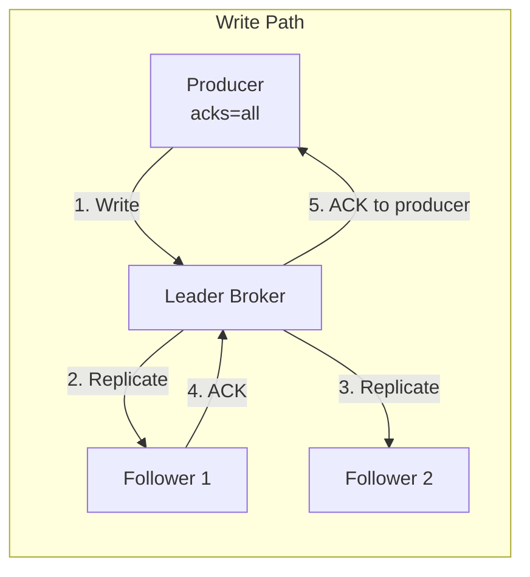
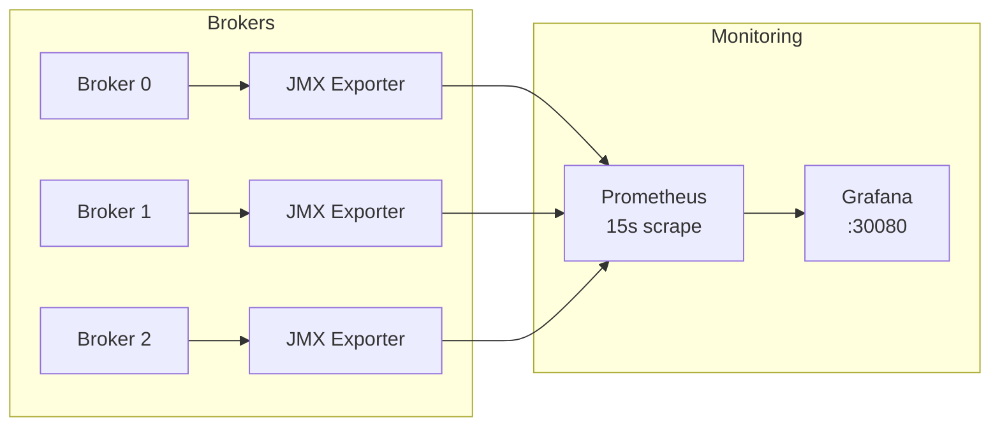

# Chapter 3: The Cluster Under Test

Before you can measure performance or inject chaos, you need to understand the system you're testing. This chapter documents the **krafter** Kafka cluster — a 3-broker KRaft deployment on Kubernetes.

## Physical Topology

```mermaid
graph TB
    subgraph Kind["Kind Cluster: panda"]
        subgraph Alpha["Node: alpha (control-plane)"]
            PA[pool-alpha-0<br/>Broker + Controller<br/>2Gi Memory | 10Gi PVC<br/>StorageClass: local-alpha]
        end
        
        subgraph Sigma["Node: sigma (worker)"]
            PS[pool-sigma-0<br/>Broker + Controller<br/>2Gi Memory | 10Gi PVC<br/>StorageClass: local-sigma]
        end
        
        subgraph Gamma["Node: gamma (worker)"]
            PG[pool-gamma-0<br/>Broker + Controller<br/>2Gi Memory | 10Gi PVC<br/>StorageClass: local-gamma]
        end
    end
    
    PA ---|"Inter-broker<br/>replication"| PS
    PS ---|"KRaft metadata<br/>quorum"| PG
    PG ---|"Inter-broker<br/>replication"| PA
```

Each broker runs as a **combined controller + broker** in KRaft mode. There is no ZooKeeper. The three brokers form both the metadata quorum (controller role) and the data plane (broker role).

### Node Labeling and Zone Simulation

Each Kind node is labeled with a simulated availability zone:

| Node | Zone Label | Role | Broker ID |
|------|-----------|------|-----------|
| alpha | `topology.kubernetes.io/zone: zone-a` | Control-plane + Worker | 0 |
| sigma | `topology.kubernetes.io/zone: zone-b` | Worker | 1 |
| gamma | `topology.kubernetes.io/zone: zone-c` | Worker | 2 |

Strimzi's `rack` configuration uses these labels to ensure:

- Each broker is pinned to exactly one zone via `nodeAffinity`
- Partition replicas are spread across zones (rack-aware assignment)
- PVCs use zone-specific `StorageClass` resources for data locality

## Resource Budget

| Resource | Per Broker | Total Cluster | Impact |
|----------|-----------|---------------|--------|
| Memory | 2Gi (request = limit) | 6Gi | JVM heap + page cache + metadata must fit |
| Storage | 10Gi persistent | 30Gi | Log retention before rotation |
| CPU | Not limited | Shared with Kind | CPU contention possible under stress |
| Network | Kind internal (loopback) | No real latency | Artificial; production will have network costs |

The 2Gi memory limit is a hard constraint. Kafka relies heavily on the OS page cache for read performance — the tighter the memory, the faster the page cache evicts and the more disk I/O occurs. This makes performance testing on this cluster **more sensitive** to workload patterns than a production cluster with 64Gi per broker.

## Replication Configuration



| Parameter | Value | What It Means |
|-----------|-------|---------------|
| `default.replication.factor` | 3 | Every topic partition exists on all 3 brokers |
| `min.insync.replicas` | 2 | Writes with `acks=all` succeed if 2+ replicas confirm |
| `offsets.topic.replication.factor` | 3 | Consumer group metadata survives 2 broker losses |
| `transaction.state.log.replication.factor` | 3 | Exactly-once semantics survive broker loss |
| `transaction.state.log.min.isr` | 2 | Transactions work with 1 broker down |

With RF=3 and ISR=2, every produce request with `acks=all` requires the leader to wait for **at least one follower** to replicate before acknowledging. This is the single largest factor in producer latency on this cluster.

### Failure Tolerance Matrix

| Failure Scenario | Write Available? | Data Loss? | Why |
|------------------|:---:|:---:|-----|
| 1 broker down | ✅ | ❌ | ISR still ≥ 2, `min.insync.replicas` satisfied |
| 2 brokers down | ❌ | ❌ | ISR = 1 < `min.insync.replicas`, writes rejected |
| 3 brokers down | ❌ | ❌ | No leader, cluster unavailable |
| 1 broker data corruption | ✅ | ❌ | Follower catches up from remaining replicas |

## Listeners

| Name | Port | TLS | Use Case |
|------|------|-----|----------|
| `plain` | 9092 | No | Internal traffic, performance tests |
| `tls` | 9093 | Yes | Encrypted communication |

Performance tests use port 9092 (plain) for baseline measurements. TLS adds measurable CPU overhead — test both to quantify the encryption cost on a memory-constrained cluster.

## Monitoring Stack



Prometheus scrapes JMX metrics from each broker every 15 seconds via sidecar exporters. The exporter rules cover:

| Metric Namespace | What It Tracks |
|-----------------|----------------|
| `kafka.server.*` | Request rates, bytes in/out, ISR stats |
| `kafka.network.*` | Network handler threads, request queue depth |
| `kafka.log.*` | Log segment sizes, per-topic/partition stats |
| `kafka.controller.*` | KRaft controller metrics, leader elections |
| `kafka.coordinator.*` | Group coordinator stats, consumer joins |
| `java.lang.*` | JVM heap, GC, thread counts |

### Pre-Provisioned Dashboards

| Dashboard | Focus |
|-----------|-------|
| Kafka Cluster Health | Broker count, offline partitions, zone distribution |
| Kafka Performance Metrics | Topic throughput, partition growth |
| Kafka Broker Internals | Request/response rates, request queue depth, purgatory |
| Kafka JVM Metrics | Heap, GC pressure, thread counts per zone |
| Kafka Performance Test Results | Throughput and latency from perf-test jobs |
| Kafka Replication | ISR count, under-replicated partitions, lag |
| Kafka Unified Performance | Combined view across all performance dimensions |

### Access Points

| Service | URL | Credentials |
|---------|-----|-------------|
| Grafana | http://localhost:30080 | admin / admin |
| Kafka UI | http://localhost:30081 | — |
| Kates API | http://localhost:30083 | — |
| Litmus UI | `make chaos-ui` → http://localhost:9091 | admin / litmus |

## Using the CLI to Inspect the Cluster

Kates provides built-in cluster inspection commands:

```bash
# Cluster overview
kates cluster

# Topic details with partition layout
kates cluster topics
kates cluster topic <topic-name>

# Consumer group status with lag
kates cluster groups
kates cluster group <group-name>

# Broker configuration
kates cluster brokers

# Full health check
kates health
```

These commands use the Kafka AdminClient API through the Kates backend — no direct broker access needed from the CLI.
