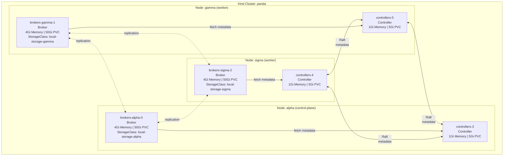
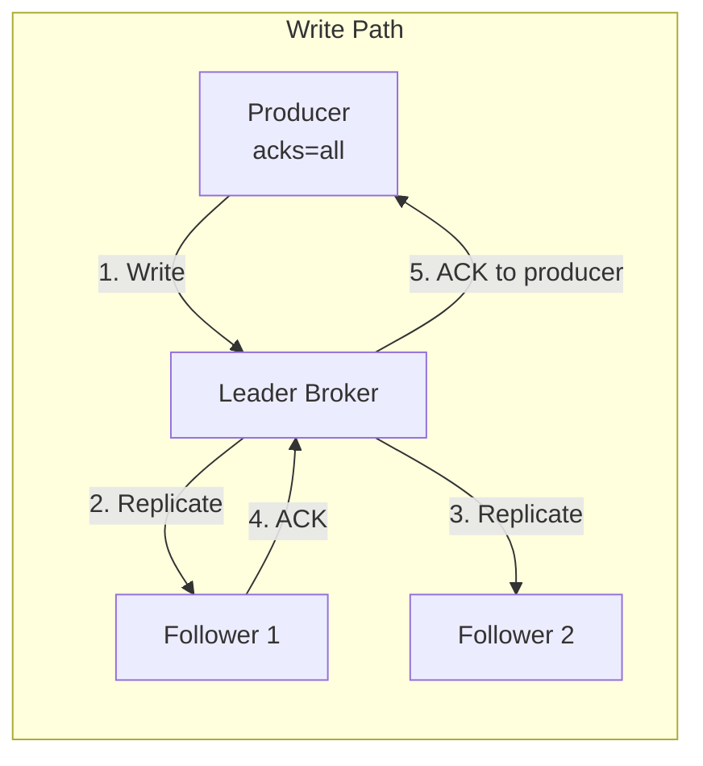
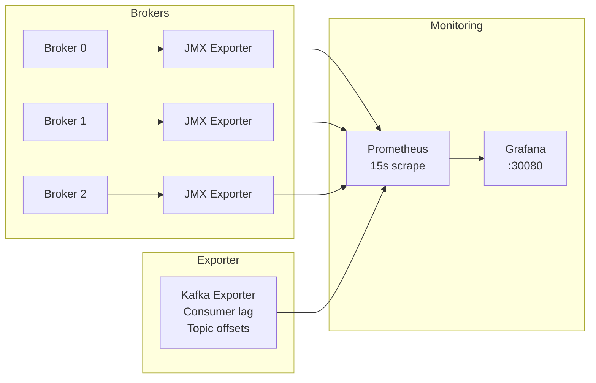

# Chapter 3: The Cluster Under Test

Before you can measure performance or inject chaos, you need to understand the system you're testing. This chapter documents the **krafter** Kafka cluster — a dedicated-role KRaft deployment on Kubernetes with zone-aware storage.

## Physical Topology



The cluster uses **dedicated roles** — controllers and brokers run in separate pods. There is no ZooKeeper. The three controllers form the KRaft metadata quorum via Raft consensus, while the three brokers handle the data plane (produce, consume, replicate). This separation ensures a heavy I/O workload on a broker can never delay metadata operations like leader elections.

### Node Labeling and Zone Simulation

Each Kind node is labeled with a simulated availability zone:

| Node | Zone Label | Role | Pods |
|------|-----------|------|------|
| alpha | `topology.kubernetes.io/zone: alpha` | Control-plane + Worker | brokers-alpha-0, controllers-3 |
| sigma | `topology.kubernetes.io/zone: sigma` | Worker | brokers-sigma-2, controllers-4 |
| gamma | `topology.kubernetes.io/zone: gamma` | Worker | brokers-gamma-1, controllers-5 |

Strimzi's `rack` configuration uses these labels to ensure:

- Each broker is pinned to exactly one zone via `nodeAffinity` (per-zone `KafkaNodePool`)
- Partition replicas are spread across zones (rack-aware assignment)
- PVCs use zone-specific `StorageClass` resources for data locality

## Resource Budget

| Component | Memory (req=limit) | CPU (req / limit) | Storage | JVM Heap |
|-----------|:------------------:|:-----------------:|:-------:|:--------:|
| Controller | 1Gi | 500m / 1000m | 5Gi | Default |
| Broker | 4Gi | 1000m / 2000m | 50Gi | 2Gi fixed |
| **Total cluster** | **15Gi** | **4.5 / 9 cores** | **165Gi** | — |

The 4Gi broker memory with a 2Gi fixed heap (`-Xms2048m -Xmx2048m`) leaves ~2Gi for the OS page cache. Kafka relies heavily on page cache for read performance — the tighter the memory, the faster eviction occurs and the more disk I/O results. This makes performance testing on this cluster **more sensitive** to workload patterns than a production cluster with 64Gi per broker.

GC logging is enabled (`gcLoggingEnabled: true`) on all brokers, making it possible to correlate latency spikes with garbage collection pauses.

## Replication Configuration



| Parameter | Value | What It Means |
|-----------|-------|---------------|
| `default.replication.factor` | 3 | Every topic partition exists on all 3 brokers |
| `min.insync.replicas` | 2 | Writes with `acks=all` succeed if 2+ replicas confirm |
| `offsets.topic.replication.factor` | 3 | Consumer group metadata survives 2 broker losses |
| `transaction.state.log.replication.factor` | 3 | Exactly-once semantics survive broker loss |
| `transaction.state.log.min.isr` | 2 | Transactions work with 1 broker down |

With RF=3 and ISR=2, every produce request with `acks=all` requires the leader to wait for **at least one follower** to replicate before acknowledging. This is the single largest factor in producer latency on this cluster.

### Failure Tolerance Matrix

| Failure Scenario | Write Available? | Data Loss? | Why |
|------------------|:---:|:---:|-----|
| 1 broker down | ✅ | ❌ | ISR still ≥ 2, `min.insync.replicas` satisfied |
| 2 brokers down | ❌ | ❌ | ISR = 1 < `min.insync.replicas`, writes rejected |
| 3 brokers down | ❌ | ❌ | No leader, cluster unavailable |
| 1 controller down | ✅ | ❌ | Quorum of 2 still holds, metadata operations continue |
| 2 controllers down | ❌ | ❌ | No quorum — metadata operations halt, brokers freeze |
| 1 broker + 1 controller | ✅ | ❌ | Quorum intact, ISR ≥ 2 |

## Listeners

| Name | Port | Type | Auth | TLS | Use Case |
|------|------|------|------|-----|----------|
| `plain` | 9092 | internal | SCRAM-SHA-512 | No | Service-to-service traffic, performance tests |
| `tls` | 9093 | internal | mTLS | Yes | Encrypted internal communication |
| `external` | 9094 | nodeport | SCRAM-SHA-512 | Yes | Access from outside the cluster |

Performance tests use port 9092 (plain) for baseline measurements. TLS adds measurable CPU overhead — test both to quantify the encryption cost on a memory-constrained cluster.

## Topics

Kates provisions five declarative topics via `KafkaTopic` CRDs:

| Topic | Partitions | Retention | Compression | Purpose |
|-------|:----------:|-----------|:-----------:|---------|
| `kates-events` | 6 | 48h | — | Test lifecycle events |
| `kates-results` | 12 | 7d | lz4 | Test results (high-throughput) |
| `kates-metrics` | 6 | 24h | lz4 | Real-time broker metrics |
| `kates-audit` | 3 | 30d | — | Audit trail |
| `kates-dlq` | 3 | ∞ | — | Dead letter queue (compacted) |

`kates-results` has 12 partitions (4× the broker count) for maximum consumer parallelism during high-throughput test runs.

## Monitoring Stack



Prometheus scrapes JMX metrics from each broker every 15 seconds via sidecar exporters. The **Kafka Exporter** adds consumer lag and topic offset metrics not available via JMX.

| Metric Namespace | What It Tracks |
|-----------------|----------------|
| `kafka.server.*` | Request rates, bytes in/out, ISR stats |
| `kafka.network.*` | Network handler threads, request queue depth |
| `kafka.log.*` | Log segment sizes, per-topic/partition stats |
| `kafka.controller.*` | KRaft controller metrics, leader elections |
| `kafka.coordinator.*` | Group coordinator stats, consumer joins |
| `java.lang.*` | JVM heap, GC, thread counts |
| `kafka_consumergroup_*` | Consumer lag, committed offsets (via Kafka Exporter) |

### Pre-Provisioned Dashboards

| Dashboard | Focus |
|-----------|-------|
| Kafka Cluster Health | Broker count, offline partitions, zone distribution |
| Kafka Performance Metrics | Topic throughput, partition growth |
| Kafka Broker Internals | Request/response rates, request queue depth, purgatory |
| Kafka JVM Metrics | Heap, GC pressure, thread counts per zone |
| Kafka Performance Test Results | Throughput and latency from perf-test jobs |
| Kafka Replication | ISR count, under-replicated partitions, lag |
| Kafka Unified Performance | Combined view across all performance dimensions |

### Prometheus Alerts

16 alert rules monitor cluster health across five categories — see [Chapter 15: Kafka Deployment Engineering](15-kafka-deployment.md#prometheus-alerts) for the complete list.

### Access Points

| Service | URL | Credentials |
|---------|-----|-------------|
| Grafana | http://localhost:30080 | admin / admin |
| Kafka UI | http://localhost:30081 | — |
| Kates API | http://localhost:30083 | — |
| Litmus UI | `make chaos-ui` → http://localhost:9091 | admin / litmus |

## Operational Components

Beyond the brokers and controllers, the cluster includes:

| Component | Purpose |
|-----------|---------|
| **Cruise Control** | Automated partition rebalancing based on resource utilization |
| **Kafka Exporter** | Consumer lag and topic offset metrics |
| **Drain Cleaner** | Graceful pod rolling during node drains |
| **Entity Operator** | Topic and User lifecycle management via CRDs |

For deep operational details, see [Chapter 15: Kafka Deployment Engineering](15-kafka-deployment.md).

## Using the CLI to Inspect the Cluster

Kates provides built-in cluster inspection commands:

```bash
# Cluster overview
kates cluster

# Topic details with partition layout
kates cluster topics
kates cluster topic <topic-name>

# Consumer group status with lag
kates cluster groups
kates cluster group <group-name>

# Broker configuration
kates cluster brokers

# Full health check
kates health
```

These commands use the Kafka AdminClient API through the Kates backend — no direct broker access needed from the CLI.
