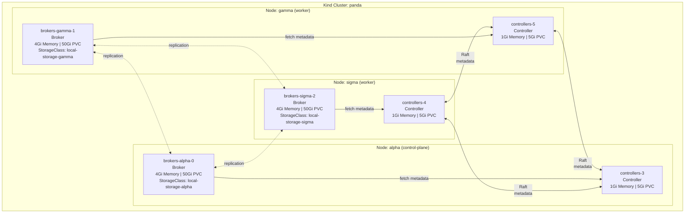
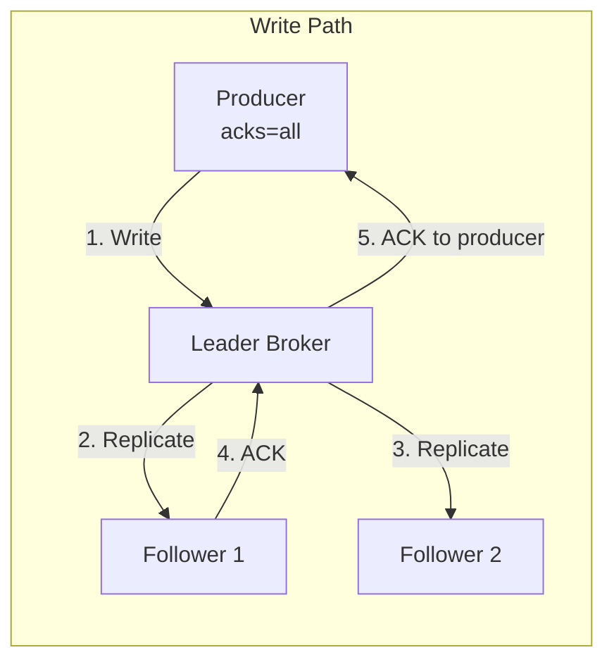

# Chapter 3: The Cluster Under Test

Before you can measure performance or inject chaos, you need to understand the system you're testing. Without this understanding, you'll collect numbers but draw the wrong conclusions — blaming Kafka for a bottleneck that's actually page cache eviction, or celebrating a throughput number that's only possible because replication was silently disabled.

This chapter documents the **krafter** Kafka cluster — a dedicated-role KRaft deployment on Kubernetes with zone-aware storage. Whether you're running a quick LOAD test or a multi-hour ENDURANCE run, this is the machine under the hood.

## Physical Topology


```mermaid
graph TB
    subgraph Kind["Kind Cluster: panda"]
        subgraph Alpha["Node: alpha (control-plane)"]
            B0["brokers-alpha-0<br/>Broker<br/>4Gi Memory | 50Gi PVC<br/>StorageClass: local-storage-alpha"]
            C3["controllers-3<br/>Controller<br/>1Gi Memory | 5Gi PVC"]
        end

        subgraph Sigma["Node: sigma (worker)"]
            B2["brokers-sigma-2<br/>Broker<br/>4Gi Memory | 50Gi PVC<br/>StorageClass: local-storage-sigma"]
            C4["controllers-4<br/>Controller<br/>1Gi Memory | 5Gi PVC"]
        end

        subgraph Gamma["Node: gamma (worker)"]
            B1["brokers-gamma-1<br/>Broker<br/>4Gi Memory | 50Gi PVC<br/>StorageClass: local-storage-gamma"]
            C5["controllers-5<br/>Controller<br/>1Gi Memory | 5Gi PVC"]
        end
    end

    C3 <-->|"Raft<br/>metadata"| C4
    C4 <-->|"Raft<br/>metadata"| C5
    C5 <-->|"Raft<br/>metadata"| C3

    B0 <-.->|"replication"| B2
    B2 <-.->|"replication"| B1
    B1 <-.->|"replication"| B0

    B0 -->|"fetch metadata"| C3
    B2 -->|"fetch metadata"| C4
    B1 -->|"fetch metadata"| C5
```

The cluster uses **dedicated roles** — controllers and brokers run in separate pods. There is no ZooKeeper. The three controllers form the KRaft metadata quorum via Raft consensus, while the three brokers handle the data plane (produce, consume, replicate).

This separation matters more than it might seem. In a combined-role cluster, a heavy I/O workload on a broker could delay metadata operations like leader elections — the very operations you need to be fast during a failure. Dedicated roles guarantee that the control plane stays responsive even when the data plane is saturated.

### Node Labeling and Zone Simulation

In production, Kafka brokers are spread across availability zones so that a single zone failure doesn't take down the entire cluster. The Kind cluster simulates this by labeling each node with a zone:

| Node | Zone Label | Role | Pods |
|------|-----------|------|------|
| alpha | `topology.kubernetes.io/zone: alpha` | Control-plane + Worker | brokers-alpha-0, controllers-3 |
| sigma | `topology.kubernetes.io/zone: sigma` | Worker | brokers-sigma-2, controllers-4 |
| gamma | `topology.kubernetes.io/zone: gamma` | Worker | brokers-gamma-1, controllers-5 |

Strimzi's `rack` configuration uses these labels to ensure:

- Each broker is pinned to exactly one zone via `nodeAffinity` (per-zone `KafkaNodePool`)
- Partition replicas are spread across zones (rack-aware assignment)
- PVCs use zone-specific `StorageClass` resources for data locality

::: {.callout-tip}
You can verify the zone distribution at any time with `kates cluster topology`. If all brokers end up in the same zone, rack-aware assignment won't protect you from a zone failure — and your chaos tests will give you false confidence.
:::


## Resource Budget

| Component | Memory (req=limit) | CPU (req / limit) | Storage | JVM Heap |
|-----------|:------------------:|:-----------------:|:-------:|:--------:|
| Controller | 1Gi | 500m / 1000m | 5Gi | Default |
| Broker | 4Gi | 1000m / 2000m | 50Gi | 2Gi fixed |
| **Total cluster** | **15Gi** | **4.5 / 9 cores** | **165Gi** | — |

The 4Gi broker memory with a 2Gi fixed heap (`-Xms2048m -Xmx2048m`) leaves ~2Gi for the OS page cache. This is an intentional design choice — and an important one to understand.

Kafka relies heavily on page cache for read performance. When a consumer reads recently-produced data, the operating system serves it directly from RAM (page cache) without touching disk. But with only 2Gi of page cache per broker, eviction happens quickly under load. As soon as a consumer falls behind or you run a test with large messages, reads start hitting disk, and latency climbs.

This makes performance testing on this cluster **more sensitive** to workload patterns than a production cluster with 64Gi per broker. That's a feature, not a bug — if your application performs well here, it'll perform even better on real hardware.

GC logging is enabled (`gcLoggingEnabled: true`) on all brokers, making it possible to correlate latency spikes with garbage collection pauses. See [Chapter 4: Performance Theory](04-performance-theory.md) for a deeper explanation of why GC pauses dominate tail latency.

## Replication Configuration

Every message written to this cluster is replicated three times — once on the leader and once on each of two followers. Understanding this write path is essential for interpreting your latency numbers.


```mermaid
graph LR
    subgraph Write Path
        P[Producer<br/>acks=all] -->|1. Write| L[Leader Broker]
        L -->|2. Replicate| F1[Follower 1]
        L -->|3. Replicate| F2[Follower 2]
        F1 -->|4. ACK| L
        L -->|5. ACK to producer| P
    end
```

| Parameter | Value | What It Means |
|-----------|-------|---------------|
| `default.replication.factor` | 3 | Every topic partition exists on all 3 brokers |
| `min.insync.replicas` | 2 | Writes with `acks=all` succeed if 2+ replicas confirm |
| `offsets.topic.replication.factor` | 3 | Consumer group metadata survives 2 broker losses |
| `transaction.state.log.replication.factor` | 3 | Exactly-once semantics survive broker loss |
| `transaction.state.log.min.isr` | 2 | Transactions work with 1 broker down |

With RF=3 and ISR=2, every produce request with `acks=all` requires the leader to wait for **at least one follower** to replicate before acknowledging. This is the single largest factor in producer latency on this cluster.

### Failure Tolerance Matrix

This matrix is the most important table in this chapter. It tells you exactly what happens when things go wrong — and is the basis for every chaos test you'll design.

| Failure Scenario | Write Available? | Data Loss? | Why |
|------------------|:---:|:---:|-----|
| 1 broker down | ✅ | ❌ | ISR still ≥ 2, `min.insync.replicas` satisfied |
| 2 brokers down | ❌ | ❌ | ISR = 1 < `min.insync.replicas`, writes rejected |
| 3 brokers down | ❌ | ❌ | No leader, cluster unavailable |
| 1 controller down | ✅ | ❌ | Quorum of 2 still holds, metadata operations continue |
| 2 controllers down | ❌ | ❌ | No quorum — metadata operations halt, brokers freeze |
| 1 broker + 1 controller | ✅ | ❌ | Quorum intact, ISR ≥ 2 |

::: {.callout-important}
Notice that **2 brokers down** means writes are rejected, but **no data is lost**. This is the difference between *availability* and *durability*. With `min.insync.replicas=2`, Kafka trades availability for durability — it would rather refuse writes than risk losing data. Understanding this trade-off is fundamental to designing meaningful chaos experiments.
:::


### What Happens During a Broker Failure

When a broker goes down, the sequence of events matters for understanding your test results:

1. **Detection** (0–30 seconds): The controller detects the broker is unresponsive via heartbeat timeout. The exact timing depends on `broker.heartbeat.interval.ms` and `broker.session.timeout.ms`.
2. **Leader election** (< 1 second): The controller promotes a follower to leader for all partitions that had their leader on the failed broker. During this window, produces to those partitions fail with `NOT_LEADER_OR_FOLLOWER`.
3. **ISR shrink** (immediate): The failed broker is removed from all ISR sets. Under-replicated partitions appear in monitoring.
4. **Client retry** (1–5 seconds): Producers with retries enabled automatically discover the new leader and resume. The retry latency shows up as a spike in your heatmap.
5. **Recovery** (1–5 minutes): When the broker comes back, it catches up on missed data. ISR sets expand back to 3. During catch-up, the recovering broker consumes network bandwidth, which can slightly increase latency for active producers.

You can observe all five phases in a Kates chaos test heatmap — the spike during election, the brief gap during client retry, and the gradual stabilization as ISR recovers.

## Changing the Topology for Different Scenarios

The default 3-broker, 3-controller topology covers the most common testing scenarios. But sometimes you need a different shape:

### Testing with More Brokers

To add brokers (e.g., testing partition rebalancing after scale-up):

```bash
# Add a 4th broker pool
helm upgrade krafter charts/kafka-cluster -n kafka \
  --set brokerPools[3].name=brokers-delta \
  --set brokerPools[3].replicas=1 \
  --set brokerPools[3].storageSize=10Gi \
  --reuse-values
```

After the new broker joins, existing partitions won't automatically rebalance. Use Cruise Control or `kates rebalance` to redistribute partitions.

### Testing Single-Zone Failures

To simulate a full availability zone failure, drain the Kind node:

```bash
# Cordon and drain the sigma node (takes down broker-2 and controller-4)
kubectl cordon sigma
kubectl drain sigma --ignore-daemonsets --delete-emptydir-data --force
```

This is more realistic than killing a single pod — it tests whether your `PodDisruptionBudget` configuration prevents cascading failures.

### Testing Without Rack Awareness

To test what happens when all replicas land on the same zone (simulating a misconfiguration):

```bash
# Remove zone labels from all nodes
kubectl label node alpha topology.kubernetes.io/zone-
kubectl label node sigma topology.kubernetes.io/zone-
kubectl label node gamma topology.kubernetes.io/zone-
```

::: {.callout-warning}
Remember to re-apply zone labels after testing. Without rack awareness, a single node failure can cause data loss if all replicas of a partition happen to be on the same node.
:::


## Listeners

| Name | Port | Type | Auth | TLS | Use Case |
|------|------|------|------|-----|----------|
| `plain` | 9092 | internal | SCRAM-SHA-512 | No | Service-to-service traffic, performance tests |
| `tls` | 9093 | internal | mTLS | Yes | Encrypted internal communication |
| `external` | 9094 | nodeport | SCRAM-SHA-512 | Yes | Access from outside the cluster |

Performance tests use port 9092 (plain) for baseline measurements. TLS adds measurable CPU overhead — test both to quantify the encryption cost on a memory-constrained cluster. On this cluster, expect 10–15% throughput reduction and 20–30% latency increase with TLS enabled, due to the limited CPU budget per broker.

## Topics

Kates provisions five declarative topics via `KafkaTopic` CRDs:

| Topic | Partitions | Retention | Compression | Purpose |
|-------|:----------:|-----------|:-----------:|---------|
| `kates-events` | 6 | 48h | — | Test lifecycle events |
| `kates-results` | 12 | 7d | lz4 | Test results (high-throughput) |
| `kates-metrics` | 6 | 24h | lz4 | Real-time broker metrics |
| `kates-audit` | 3 | 30d | — | Audit trail |
| `kates-dlq` | 3 | ∞ | — | Dead letter queue (compacted) |

`kates-results` has 12 partitions (4× the broker count) for maximum consumer parallelism during high-throughput test runs. The lz4 compression on results and metrics topics reduces network bandwidth and storage at minimal CPU cost — lz4 is specifically designed for speed over compression ratio.

## Operational Components

Beyond the brokers and controllers, the cluster includes several components that affect how the system behaves under test:

| Component | Purpose | Why It Matters for Testing |
|-----------|---------|---------------------------|
| **Cruise Control** | Automated partition rebalancing based on resource utilization | Can trigger unexpected partition movements during long tests — be aware of this if latency shifts mid-run |
| **Kafka Exporter** | Consumer lag and topic offset metrics | Provides the lag data that `kates cluster watch` displays in sparklines |
| **Drain Cleaner** | Graceful pod rolling during node drains | Ensures broker restarts during chaos tests are clean (finalizes log segments, flushes buffers) |
| **Entity Operator** | Topic and User lifecycle management via CRDs | Creates and reconciles the `KafkaTopic` and `KafkaUser` resources listed above |

For deep operational details on each component, see [Chapter 15: Kafka Deployment Engineering](15-kafka-deployment.md).

## Access Points

| Service | URL | Credentials |
|---------|-----|-------------|
| Grafana | http://localhost:30080 | admin / admin |
| Kafka UI | http://localhost:30081 | — |
| Kates API | http://localhost:30083 | — |
| Litmus UI | `make chaos-ui` → http://localhost:9091 | admin / litmus |

## Using the CLI to Inspect the Cluster

You don't need to memorize the topology — Kates provides built-in cluster inspection commands that give you a live view:

```bash
# Cluster overview — brokers, controllers, health
kates cluster

# Full topology — node pools, PVCs, services, network policies
kates cluster topology

# Topic details with partition layout
kates cluster topics
kates cluster topic <topic-name>

# Consumer group status with lag
kates cluster groups
kates cluster group <group-name>

# Broker configuration
kates cluster brokers

# Full health check
kates health
```

These commands use the Kafka AdminClient API through the Kates backend — no direct broker access needed from the CLI. For the full CLI reference, see [Chapter 10: CLI Reference](10-cli-reference.md).

::: {.callout-tip}
The `kates cluster watch` command provides a live-refreshing view with sparkline trends, auto-refreshing every 5 seconds. It's the best way to monitor cluster health during a test or chaos experiment. See [Chapter 9: Observability](09-observability.md#cluster-watch) for details.
:::
