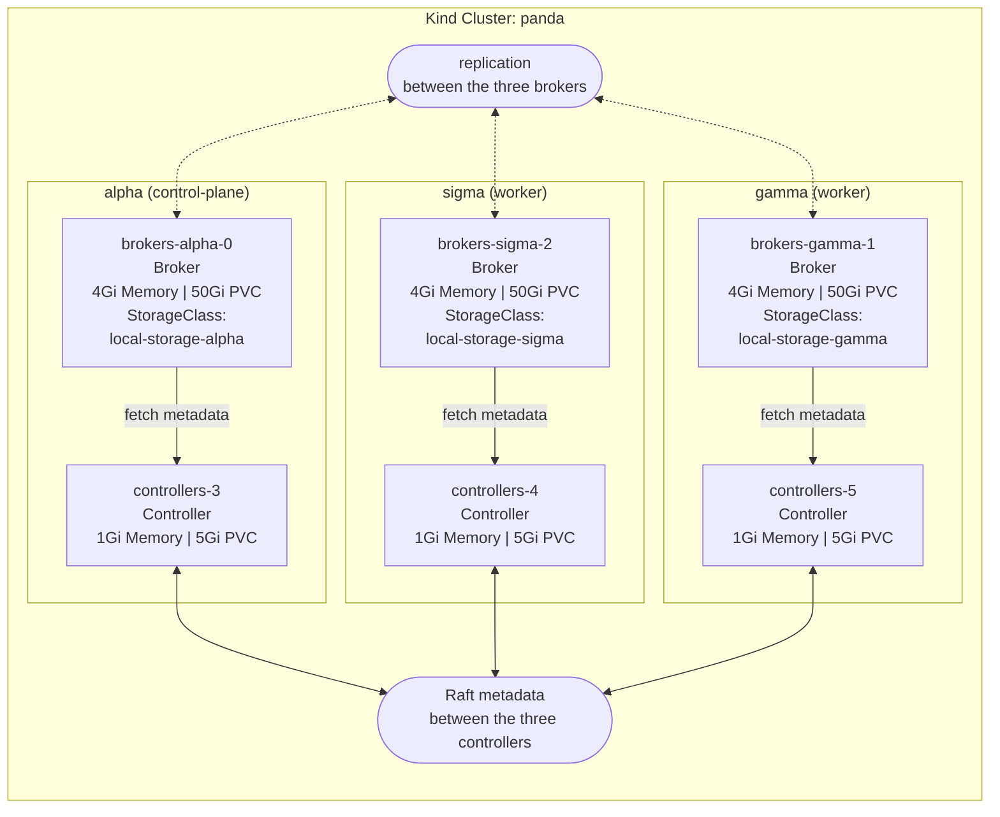
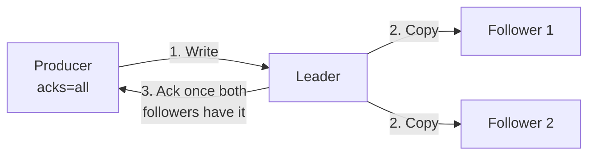

# The Cluster Under Test

Before you can measure performance or inject chaos, you need to understand the system you're testing. Without this understanding, you'll collect numbers but draw the wrong conclusions — blaming Kafka for a bottleneck that's actually [page cache](appendix-a-glossary.md#gl-page-cache) eviction, or celebrating a [throughput](appendix-a-glossary.md#gl-throughput) number that's only possible because replication was silently disabled.

This chapter documents the `krafter` Kafka cluster — a dedicated-role [KRaft](appendix-a-glossary.md#gl-kraft) deployment on Kubernetes with zone-aware storage. Whether you're running a quick [LOAD](appendix-a-glossary.md#gl-test-type) test or a multi-hour ENDURANCE run, this is the machine under the hood.

After this chapter, you can:

- Explain the Kafka ideas the book relies on: partitions and their leaders, consumer groups and their lag, and the KRaft quorum
- Sketch the `krafter` node layout — dedicated KRaft [controllers](appendix-a-glossary.md#gl-controller) and zone-pinned [brokers](appendix-a-glossary.md#gl-broker) — and explain why the roles are separated
- Predict from the failure tolerance matrix whether a given broker or controller loss stops writes, loses data, or neither
- Explain how the ~2Gi page cache budget and [`min.insync.replicas=2`](appendix-a-glossary.md#gl-min-insync-replicas) shape every latency number you measure here
- Inspect the live cluster with the `kates cluster` commands instead of memorizing its state

## Kafka You Need for This Book

The rest of this chapter, and of the book, describes `krafter` in Kafka's own terms. This section gives you the few ideas those descriptions rely on, as `krafter` uses them; if you run Kafka already, skim it and go on to [Physical Topology](#physical-topology).

### Topics, Partitions and Leaders

Kafka stores records in [topics](appendix-a-glossary.md#gl-topic): named streams that producers write to and consumers read from. Each topic is split into [partitions](appendix-a-glossary.md#gl-partition), which are ordered, append-only logs that different brokers can hold and different consumers can read at the same time. Within its partition, each record has an [offset](appendix-a-glossary.md#gl-offset): its position, a number that only grows.

Each partition is kept as several replicas on different brokers, three on `krafter`. One replica is the partition's [leader](appendix-a-glossary.md#gl-partition-leader), and it takes every write to the partition; the others, its followers, copy the leader's log. How many copies a write must reach before the leader acknowledges it is the subject of [Replication Configuration](#replication-configuration), and what happens when a leader's broker fails is the subject of [What Happens During a Broker Failure](#what-happens-during-a-broker-failure).

When a test names a topic that doesn't exist yet, Kates creates it with the spec's `partitions`, `replicationFactor` and `minInsyncReplicas`. A topic that already exists keeps its own settings, whatever the spec says.

### Consumer Groups, Offsets and Lag

A [consumer group](appendix-a-glossary.md#gl-consumer-group) is a set of consumers that share the reading of a topic. Kafka assigns each partition to one member of the group, so the members split the topic's partitions between them, and a group gains nothing from more members than partitions. Two groups that read the same topic each read all of it.

As a group reads, it commits offsets: for each partition, the offset of the next record it will read, which Kafka keeps in its internal `__consumer_offsets` topic. The committed offset is where a consumer resumes after a restart or a [rebalance](appendix-a-glossary.md#gl-rebalance). A group with no committed offset starts where its `auto.offset.reset` setting says, and the consumers of the native [benchmark backend](appendix-a-glossary.md#gl-benchmark-backend) say `earliest`: the oldest record still on the topic. A test that names a `consumerGroup` resumes from the offsets that group committed in earlier runs, so give each test a group of its own.

[Consumer lag](appendix-a-glossary.md#gl-consumer-lag) is how far a group trails the log: for each partition, the partition's latest offset minus the group's committed offset, and a group's lag is the sum over its partitions. Lag that keeps growing means the consumers fall further behind the producers; lag that stays level means they keep pace, that many records behind. `kates cluster groups describe <group-id>` computes it this way and shows it per partition, in its Current, End and Lag columns, under the group's total.

### The KRaft Quorum

Kafka keeps the cluster's metadata (which brokers are live, which partitions exist, which replica leads each one) in KRaft, its built-in Raft consensus; there is no ZooKeeper. A few controllers hold that metadata as a replicated log, the [metadata log](appendix-a-glossary.md#gl-metadata-log). Brokers fetch the log from them and act on what it says, such as which partitions they lead, so a broker that falls behind on it works from an older picture of the cluster until it catches up.

One controller is active: it writes each change to the metadata log, and a change commits once a [quorum](appendix-a-glossary.md#gl-quorum), a majority of the controllers, has it. `krafter` runs three controllers: the `kafka-cluster` chart's default, and on the [`panda`](appendix-a-glossary.md#gl-panda) Kind cluster one per [zone](appendix-a-glossary.md#gl-zone) in the values `kates deploy` generates. Two must agree, so the quorum survives the loss of one controller. With two down, no metadata change can commit: no partition gets a new leader or a new ISR, and no topic is created.

Each broker sends the active controller regular heartbeats. When a broker's heartbeats stop for longer than the session timeout (`broker.session.timeout.ms`), the active controller [fences](appendix-a-glossary.md#gl-fencing) it. The controller stops counting the broker as live, moves the leadership of the broker's partitions to replicas that are in sync, and stops counting the broker's replicas as in sync. The controller unfences the broker once its heartbeats get through again and it has caught up with the metadata log; a broker that restarts registers again first.

## Physical Topology

The `panda` [Kind](appendix-a-glossary.md#gl-kind) cluster has three nodes, `alpha`, `sigma` and `gamma`, and each one stands in for a zone. Every node runs one broker and one controller of the `krafter` Kafka cluster. Notice that they are separate pods: the brokers replicate data among themselves, while the controllers keep the cluster's metadata in their own Raft quorum.


```mermaid
graph TB
    subgraph Kind["Kind Cluster: panda"]
        direction TB
        REP(["replication<br/>between the three brokers"])

        subgraph Alpha["alpha (control-plane)"]
            B0["brokers-alpha-0<br/>Broker<br/>4Gi Memory | 50Gi PVC<br/>StorageClass:<br/>local-storage-alpha"]
            C3["controllers-3<br/>Controller<br/>1Gi Memory | 5Gi PVC"]
        end

        subgraph Sigma["sigma (worker)"]
            B2["brokers-sigma-2<br/>Broker<br/>4Gi Memory | 50Gi PVC<br/>StorageClass:<br/>local-storage-sigma"]
            C4["controllers-4<br/>Controller<br/>1Gi Memory | 5Gi PVC"]
        end

        subgraph Gamma["gamma (worker)"]
            B1["brokers-gamma-1<br/>Broker<br/>4Gi Memory | 50Gi PVC<br/>StorageClass:<br/>local-storage-gamma"]
            C5["controllers-5<br/>Controller<br/>1Gi Memory | 5Gi PVC"]
        end

        RAFT(["Raft metadata<br/>between the three controllers"])
    end

    REP <-.-> B0 & B2 & B1

    B0 -->|"fetch metadata"| C3
    B2 -->|"fetch metadata"| C4
    B1 -->|"fetch metadata"| C5

    C3 & C4 & C5 <--> RAFT
```

The cluster uses **dedicated roles** — controllers and brokers run in separate pods. There is no ZooKeeper. The three controllers form the KRaft metadata quorum via Raft consensus, while the three brokers handle the data plane (produce, consume, replicate).

This separation matters more than it might seem. In a combined-role cluster, a heavy I/O workload on a broker could delay metadata operations like [leader elections](appendix-a-glossary.md#gl-leader-election) — the very operations you need to be fast during a failure. Dedicated roles guarantee that the control plane stays responsive even when the data plane is saturated.

### Node Labeling and Zone Simulation

In production, Kafka brokers are spread across zones so that a single zone failure doesn't take down the entire cluster. In this book a zone, [Strimzi](appendix-a-glossary.md#gl-strimzi)'s rack and a cloud availability zone (AZ) are the same failure domain. The Kind cluster simulates zones by labeling each node with one:

| Node | Zone Label | Role | Pods |
|------|-----------|------|------|
| alpha | `topology.kubernetes.io/zone: alpha` | Control-plane + Worker | brokers-alpha-0, controllers-3 |
| sigma | `topology.kubernetes.io/zone: sigma` | Worker | brokers-sigma-2, controllers-4 |
| gamma | `topology.kubernetes.io/zone: gamma` | Worker | brokers-gamma-1, controllers-5 |

Strimzi's `rack` configuration uses these labels to ensure:

- Each broker is pinned to exactly one zone via `nodeAffinity` (per-zone [`KafkaNodePool`](appendix-a-glossary.md#gl-kafkanodepool))
- Partition replicas are spread across zones (rack-aware assignment)
- [PVCs](appendix-a-glossary.md#gl-pvc) use zone-specific `StorageClass` resources for data locality

::: {.callout-tip}
You can verify the zone distribution at any time with `kates cluster topology`. If all brokers end up in the same zone, rack-aware assignment won't protect you from a zone failure — and your [chaos experiments](appendix-a-glossary.md#gl-chaos-experiment) will give you false confidence.
:::

## Resource Budget

The table gives the memory, CPU, storage and heap of each pod in the `krafter` lab cluster. The figure to notice is the broker's: 4Gi of memory around a 2Gi heap, which the paragraphs below turn into a page-cache budget.

| Component | Memory (req=limit) | CPU (req / limit) | Storage | JVM Heap |
|-----------|:------------------:|:-----------------:|:-------:|:--------:|
| Controller | 1Gi | 500m / 1000m | 5Gi | 512m fixed |
| Broker | 4Gi | 1000m / 2000m | 50Gi | 2Gi fixed |
| **Total cluster** | **15Gi** | **4.5 / 9 cores** | **165Gi** | — |

These are the `krafter` lab cluster's figures. The `kafka-cluster` chart's own `nodePools.roleDefaults` match the memory, CPU and heap above but size volumes larger — 100Gi per broker and 10Gi per controller — and `kates detect --generate-values` sizes the per-zone pools from the cluster it finds, so read the values you deployed with rather than this table.

The 4Gi broker memory with a 2Gi fixed heap (`-Xms2048m -Xmx2048m`) leaves ~2Gi for the OS page cache. This is an intentional design choice — and an important one to understand.

Kafka relies heavily on page cache for read performance. When a consumer reads recently-produced data, the operating system serves it directly from RAM (page cache) without touching disk. But with only 2Gi of page cache per broker, eviction happens quickly under load. As soon as a consumer falls behind or you run a test with large messages, reads start hitting disk, and latency climbs.

This makes performance testing on this cluster **more sensitive** to workload patterns than a production cluster with 64Gi per broker. That's a feature, not a bug — if your application performs well here, it'll perform even better on real hardware.

GC logging is enabled (`gcLoggingEnabled: true`) on all brokers, making it possible to correlate latency spikes with garbage collection pauses. See [Performance Theory](04-performance-theory.md) for a deeper explanation of why GC pauses dominate tail latency.

## Replication Configuration

Three settings decide what an acknowledged write means on `krafter`, and they're easy to blur together: a count, a set and a floor. A fourth, the producer's [`acks`](appendix-a-glossary.md#gl-acks), decides which copies a write waits for.

The [replication factor](appendix-a-glossary.md#gl-rf), 3 (the `kafka-cluster` chart's `default.replication.factor`), is how many copies of each partition exist. With three brokers, that's one copy on every broker.

The in-sync replica set, the [ISR](appendix-a-glossary.md#gl-isr), is which of those copies are caught up with the leader right now, the leader's own included. On a healthy cluster, all three are.

`min.insync.replicas`, which the chart sets to 2, is the smallest ISR the leader accepts an `acks=all` write with. It's a floor, not a target.

The producer's `acks` setting is a mode, not a property of the cluster. With `acks=1` the leader acknowledges a write once it has the record itself; with `acks=all` it waits for every replica in the ISR. Every Kates test type defaults to `acks=all` except SPIKE, which uses `acks=1`.

The diagram follows one `acks=all` write on a healthy `krafter`. Notice that the leader acknowledges it only after both followers have the record, not after the first one.


```mermaid
%%| label: fig-cluster-acks-all-write
%%| fig-cap: "On a healthy `krafter`, the leader acknowledges an `acks=all` write only once both followers have copied it."
%%| fig-alt: "Flowchart from left to right. A producer using acks=all sends a write to the partition's leader. Follower 1 and follower 2 each copy the record from the leader. The leader then acknowledges the write to the producer, once both followers have it."
graph LR
    P["Producer<br/>acks=all"] -->|"1. Write"| L["Leader"]
    L -->|"2. Copy"| F1["Follower 1"]
    L -->|"2. Copy"| F2["Follower 2"]
    L -->|"3. Ack once both<br/>followers have it"| P
```

A producer using `acks=all` waits for every replica currently in the ISR, not just for two of them. On a healthy cluster the leader waits for both followers, so the slower follower's copy sits inside every acknowledgment, and inside the produce latency you measure. The payments workload this book follows writes with `acks=all`, so it pays that cost on every record. Lose one broker and the ISR shrinks to two: the leader waits for the one follower left, and writes carry on. Lose a second and the ISR is one, below the floor, so the leader refuses `acks=all` writes rather than keep a single copy. The [Failure Tolerance Matrix](#failure-tolerance-matrix) below applies this rule row by row.

`min.insync.replicas` applies only to `acks=all`. An `acks=1` write, SPIKE's default, is acknowledged as soon as the leader has it, so a leader that fails before its followers copy the record takes the record with it.

Kafka's internal topics follow the same pattern. Consumer offsets and transaction state are replicated three times (`offsets.topic.replication.factor`, `transaction.state.log.replication.factor`), and transactions need two in-sync copies (`transaction.state.log.min.isr`), so they keep working with one broker down.

Two more ideas explain why an acknowledged record survives a change of leader. A partition's [high watermark](appendix-a-glossary.md#gl-high-watermark) is the offset below which every replica in its ISR has the records, and consumers read only below it. When a new leader takes over, a replica holding records past the new leader's log deletes them to match: that's [log truncation](appendix-a-glossary.md#gl-log-truncation), and under `acks=all` it only ever removes records that no producer was told were written.

[Unclean leader election](appendix-a-glossary.md#gl-unclean-leader-election) is the one way around that guarantee. It elects a leader from outside the ISR when no in-sync replica is left, which brings the partition back at the price of the records only the lost replicas had. `krafter` turns it off (`unclean.leader.election.enable: false`), so a partition with no in-sync replica stays offline instead, and the chart ships an alert, `KafkaUncleanLeaderElection`, for the day one happens. That's what makes the matrix's "no data loss" hold: with `acks=all`, an acknowledged record is on every in-sync replica, and Kafka elects a new leader only from replicas known to hold every acknowledged record.

### Failure Tolerance Matrix

This matrix is the most important table in this chapter. It tells you what happens to `acks=all` writes when things go wrong, and it is the basis for every chaos experiment you'll design.

| Failure Scenario | Write Available? | Data Loss? | Why |
|----------------------|:----------------:|:----------:|--------------------------------------------|
| 1 broker down | Yes | No | ISR still ≥ 2, `min.insync.replicas` satisfied |
| 2 brokers down | No | No | ISR = 1 < `min.insync.replicas`, writes rejected |
| 3 brokers down | No | No | No leader, cluster unavailable |
| 1 controller down | Yes | No | Quorum of 2 still holds, metadata operations continue |
| 2 controllers down | Until a leader or ISR must change | No | No quorum: current leaders keep taking writes, but nothing can elect a leader, change an ISR or create a topic |
| 1 broker + 1 controller | Yes | No | Quorum intact, ISR ≥ 2 |

::: {.callout-important}
Notice that **2 brokers down** means writes are rejected, but **no data is lost**. This is the difference between *availability* and *durability*. With `min.insync.replicas=2`, Kafka trades availability for durability — it would rather refuse writes than risk losing data. Understanding this trade-off is fundamental to designing meaningful chaos experiments.
:::

### What Happens During a Broker Failure

When a broker goes down, the sequence of events matters for understanding your test results:

1. **Detection** (0–30 seconds): The controller detects the broker is unresponsive via heartbeat timeout. The exact timing depends on `broker.heartbeat.interval.ms` and `broker.session.timeout.ms`.
2. **Leader election** (< 1 second): The controller promotes a follower to leader for all partitions that had their leader on the failed broker. During this window, produces to those partitions fail with `NOT_LEADER_OR_FOLLOWER`.
3. **[ISR shrink](appendix-a-glossary.md#gl-isr-shrink)** (immediate): The failed broker is removed from all ISR sets. [Under-replicated partitions](appendix-a-glossary.md#gl-under-replicated-partition) appear in monitoring.
4. **Client retry** (1–5 seconds): Producers with retries enabled automatically discover the new leader and resume. The retry latency shows up as a spike in your [heatmap](appendix-a-glossary.md#gl-heatmap).
5. **Recovery** (1–5 minutes): When the broker comes back, it catches up on missed data. ISR sets expand back to 3. During catch-up, the recovering broker consumes network bandwidth, which can slightly increase latency for active producers.

You can observe all five phases in the heatmap of a Kates test that runs through the failure — the spike during election, the brief gap during client retry, and the gradual stabilization as ISR recovers.

## Changing the Topology for Different Scenarios

The default node layout, three brokers and three controllers, covers the most common testing scenarios. But sometimes you need a different shape:

### Testing with More Brokers

To add brokers (e.g., testing partition rebalancing after scale-up), upgrade the release from the values it runs with — not with `--reuse-values`, which applies the release's values over the *old* chart's defaults and so ignores every default the chart has changed since the install.

```bash
helm repo add seaweedfs https://seaweedfs.github.io/seaweedfs/helm
helm dependency build charts/kafka-cluster

# The Helm release: krafter from kates deploy, kafka-cluster from make kafka
RELEASE=krafter

# Every value the release was installed with — its files and its --set flags
helm get values "${RELEASE}" -n kafka -o yaml > krafter-current.yaml
```

`charts/kafka-cluster/charts/` is generated and gitignored, so the `helm dependency build` that resolves the `kafka-common` [library chart](appendix-a-glossary.md#gl-library-chart) is not optional on a fresh checkout — without it Helm refuses to render. The same applies to every `helm` command against `connect-cluster` and `mirror-maker2`, which share that library. For kafka-cluster the build also downloads the SeaweedFS subchart, and once `Chart.lock` exists it accepts only a repository Helm has configured — hence the `helm repo add`, once per machine.

`kates deploy` and `make kafka` (`scripts/deploy-kafka-generic.sh`) install the same `krafter` Kafka cluster under different [Helm releases](appendix-a-glossary.md#gl-helm-release), `krafter` and `kafka-cluster` respectively; `helm list -n kafka` shows which one you have. The `helm` commands here take the release from `RELEASE`.

A pool's own `replicas` wins over `nodePools.roleDefaults`, so where the broker count lives depends on how the release was installed. `kates deploy` and `make kafka` (with its default `ENV=kind`) generate the pools, each with a `replicas` of its own. On the `panda` Kind cluster, `krafter-current.yaml` lists one broker pool per zone under `brokerPools` — `brokers-alpha`, `brokers-sigma` and `brokers-gamma`, at `replicas: 1` each.

The generated values also size each broker for one per zone: `brokerDefaults.resources` gives every broker close to half of a node's CPU and memory, up to 8000m and 16Gi, with requests equal to limits. A second broker in a zone shares that zone's node with the first one and the zone's controller, and unless the caps apply, the three ask for more than the node has. A fourth broker therefore takes two edits in `krafter-current.yaml`: raise one pool's `replicas` (`brokers-alpha` to `2` adds the broker in `alpha`), and halve `brokerDefaults.resources`, requests and limits alike. Keep the memory at 3Gi or more, which leaves the JVM 1Gi beyond the broker's 2048m heap (`nodePools.roleDefaults.broker.jvmOptions`). With a file that holds 8000m and 16Gi, the edited entries read:

```yaml
brokerDefaults:
  # podAntiAffinity and topologySpreadConstraints unchanged
  resources:
    limits:
      cpu: 4000m
      memory: 8Gi
    requests:
      cpu: 4000m
      memory: 8Gi
brokerPools:
  # brokers-gamma and brokers-sigma unchanged
  - name: brokers-alpha
    replicas: 2
    # Only replicas changes: keep the storageClass and storageSize your
    # file has, so the upgrade neither resizes the existing volume nor
    # gives the new broker a different one
    storageClass: local-storage-alpha
    storageSize: 200Gi
    zone: alpha
```

Upgrade from the edited file, then check that the new broker runs:

```bash
helm upgrade "${RELEASE}" charts/kafka-cluster -n kafka -f krafter-current.yaml

# Two pods, both Running once the roll finishes
kubectl get pods -n kafka -l strimzi.io/pool-name=brokers-alpha
```

The new resources apply to every broker pool, so Strimzi also rolls the three existing brokers, one at a time. A pod that stays `Pending` does not fit its node: `kubectl describe pod` on it names the resource that ran out (`Insufficient cpu` or `Insufficient memory`). Lower that one further; where that would take the memory under 3Gi, the node has no room for a second broker.

A broker pool that sets no `replicas` of its own, such as the chart's default `brokers` pool, takes the count from the role default instead:

```bash
helm upgrade "${RELEASE}" charts/kafka-cluster -n kafka \
  -f krafter-current.yaml \
  --set nodePools.roleDefaults.broker.replicas=4
```

Where [Cruise Control](appendix-a-glossary.md#gl-cruise-control) runs, its auto-rebalance moves partitions onto the new broker: the chart references its `krafter-add-brokers-template` [KafkaRebalance](appendix-a-glossary.md#gl-kafkarebalance) template from `cruiseControl.autoRebalance`. A full rebalance is opt-in (`rebalance.full.enabled`). The generated values that `kates deploy` and `make kafka` install from turn Cruise Control off, and so does the Kind [overlay](appendix-a-glossary.md#gl-values-overlay), so on `panda` the new broker takes replicas only of partitions created after it joins; the existing partitions stay where they are.

### Testing Single-Zone Failures

To simulate a full zone failure, drain the Kind node:

```bash
# Cordon and drain the sigma node (takes down broker-2 and controller-4)
kubectl cordon sigma
kubectl drain sigma --ignore-daemonsets --delete-emptydir-data --force
```

This is more realistic than killing a single pod — it tests whether your [`PodDisruptionBudget`](appendix-a-glossary.md#gl-pdb) configuration prevents cascading failures.

### Testing Without Rack Awareness

To test what happens when all replicas land on the same zone (simulating a misconfiguration):

```bash
# Remove zone labels from all nodes
kubectl label node alpha topology.kubernetes.io/zone-
kubectl label node sigma topology.kubernetes.io/zone-
kubectl label node gamma topology.kubernetes.io/zone-
```

::: {.callout-warning}
Remember to re-apply zone labels after testing. Without rack awareness, a single node failure can cause data loss if all replicas of a partition happen to be on the same node.
:::

## Listeners

Every `krafter` install has the two internal listeners, and the third, `external`, exists only where something declares it. The one to notice is `plain` on port 9092, the listener the performance tests use.

| Name | Port | Type | Auth | TLS | Use Case |
|------|------|------|------|-----|----------|
| `plain` | 9092 | internal | [SCRAM-SHA-512](appendix-a-glossary.md#gl-scram-sha-512) | No | Service-to-service traffic, performance tests |
| `tls` | 9093 | internal | [mTLS](appendix-a-glossary.md#gl-mtls) | Yes | Encrypted internal communication |
| `external` | 9094 | nodeport or loadbalancer | SCRAM-SHA-512 | Yes | Access from outside the cluster, where the values chain declares it |

The two internal listeners are the chart's base `kafka.listeners`. The external one is not: `kafka.externalAccess.type` defaults to `none`, so the chart's own values expose nothing outside the cluster until you set it to `nodeport`, `loadbalancer` or `ingress` (the Kind overlay pins it to `none`). The preset appends a listener named `external` on port 9094 with TLS and SCRAM-SHA-512. On a cluster other than kind, `kates deploy` declares the same listener itself, in the `kafka.listeners` of the `.build/values-detected.yaml` it layers under the [platform profile](appendix-a-glossary.md#gl-platform-profile): a NodePort, or a LoadBalancer on EKS, GKE and AKS. `kafka.externalAccess.allowedCidrs` narrows only the chart's rule for the port; Strimzi's policy still admits every source until the listener carries [`networkPolicyPeers`](appendix-a-glossary.md#gl-networkpolicypeers), which the preset can't set ([Security & Compliance](17-security.md)).

Performance tests use port 9092 (plain) for [baseline](appendix-a-glossary.md#gl-baseline) measurements. TLS adds measurable CPU overhead — test both to quantify the encryption cost on a memory-constrained cluster. Because the CPU budget per broker is limited here, that overhead is more pronounced than on production hardware, so measure it directly rather than assuming a fixed figure.

## Topics

The `kafka-cluster` chart's platform profile creates these topics as [`KafkaTopic`](appendix-a-glossary.md#gl-kafkatopic) resources. Notice the last column: the [Kates API](appendix-a-glossary.md#gl-kates-api) writes none of them on its own.

| Topic | Partitions | Retention | Compression | What the Kates API Does With It |
|-------|:----------:|-----------|:-----------:|---------|
| `kates-events` | 6 | 48h | — | Nothing |
| `kates-results` | 12 | 7d | lz4 | Reads it only through a share-group consumer you start |
| `kates-metrics` | 6 | 24h | lz4 | Nothing |
| `kates-audit` | 3 | 30d | — | Nothing |
| `kates-dlq` | 3 | ∞ | — | Polls it every 30 seconds and logs what arrives |

A test produces to whatever topic its spec names, so these topics carry traffic only when a test or a script names them, as several example [scenario files](appendix-a-glossary.md#gl-scenario-file) in `cli/examples` do. Their partition counts, retention and compression are the profile's settings, not a measure of any traffic Kates generates.

## Operational Components

Beyond the brokers and controllers, the cluster can include several components that affect how the system behaves under test. On `panda`, only the [Entity Operator](appendix-a-glossary.md#gl-entity-operator) of these four runs:

| Component | Purpose | Why It Matters for Testing |
|-----------|---------|---------------------------|
| **Cruise Control** | Automated partition rebalancing based on resource utilization | Can trigger unexpected partition movements during long tests — be aware of this if latency shifts mid-run |
| **[Kafka Exporter](appendix-a-glossary.md#gl-kafka-exporter)** | Consumer lag and topic offset metrics | Exposes lag to [Prometheus](appendix-a-glossary.md#gl-prometheus). Off on `panda` (generated values and the Kind overlay), so read lag there with `kates cluster groups describe` |
| **[Drain Cleaner](appendix-a-glossary.md#gl-drain-cleaner)** | Graceful pod rolling during node drains | Where enabled, a node drain rolls Kafka pods through the [operator](appendix-a-glossary.md#gl-operator) instead of evicting them. Operator-wide, from the `strimzi-operator` chart; only `values-prod.yaml` enables it |
| **Entity Operator** | Topic and User lifecycle management via [CRDs](appendix-a-glossary.md#gl-crd) | Creates and [reconciles](appendix-a-glossary.md#gl-reconciliation) the `KafkaTopic` and [`KafkaUser`](appendix-a-glossary.md#gl-kafkauser) resources declared in the chart |

For deep operational details on each component, see [Kafka Deployment Engineering](15-kafka-deployment.md).

## Access Points

| Service | URL | Credentials |
|---------|-----|-------------|
| [Grafana](appendix-a-glossary.md#gl-grafana) | http://localhost:30080 | admin / admin |
| [Kafka UI](appendix-a-glossary.md#gl-kafka-ui) | http://localhost:30081 | — |
| Kates API | http://localhost:30083 | [API key](appendix-a-glossary.md#gl-api-key) from the `kates-api-key` [Secret](appendix-a-glossary.md#gl-secret) |
| Chaos state | `make chaos-status` | — |

The `localhost` addresses are the local ends of the port-forwards that `make ports` starts in the background; the Kind cluster does not publish its NodePorts on the host, so nothing answers on them until it runs. The Quick Start in [Introduction](01-introduction.md#quick-start) sets up the port-forward and a [CLI context](appendix-a-glossary.md#gl-cli-context) carrying the API key.

::: {.callout-important}
`make ports` looks for Grafana, and for Prometheus, which it forwards to `localhost:30090`, only in the `kafka` namespace, where `make monitoring` installs them. `kates deploy`, and so `make all`, installs the monitoring stack into the `monitoring` namespace, and `make ports` skips both with a "not deployed in namespace 'kafka'" line, so nothing answers on `localhost:30080`. On that install, run `MONITORING_NS=monitoring make ports` instead, or `kates ports`, which forwards Grafana to `localhost:3000` and Prometheus to `localhost:9090`.
:::

The `kates-chaos` chart deploys the [LitmusChaos](appendix-a-glossary.md#gl-litmuschaos) execution plane only — there is no bundled web portal. `make chaos-ui` says so and points you at `make chaos-status`; drive experiments through `ChaosEngine` resources instead.

## Using the CLI to Inspect the Cluster

You don't need to memorize the node layout — Kates provides built-in cluster inspection commands that give you a live view:

```bash
# Cluster overview — brokers, controllers, metadata
kates cluster info

# Full topology — node pools, PVCs, services, network policies
kates cluster topology

# Topic details with partition layout
kates cluster topics
kates cluster topics describe <topic-name>

# Consumer group status with lag
kates cluster groups
kates cluster groups describe <group-id>

# Broker configuration
kates cluster broker configs <broker-id>

# Full health check
kates health
```

These commands use the Kafka AdminClient API through the Kates API — no direct broker access needed from the CLI. For the full CLI reference, see [CLI Reference](10-cli-reference.md).

::: {.callout-tip}
The `kates cluster watch` command provides a live-refreshing view with [sparkline](appendix-a-glossary.md#gl-sparkline) trends, auto-refreshing every 5 seconds. It's the best way to monitor cluster health during a test or chaos experiment. See [Observability & Monitoring](09-observability.md#cluster-watch) for details.
:::

::: {.callout-tip}
**Try it**

Confirm the node layout described in this chapter matches your live `krafter` cluster:

```bash
kates cluster info
kates cluster topics
kates cluster topics describe kates-results
kates cluster check
```

Expect `info` to list the brokers each in a different zone, `describe` to show `kates-results` with 12 partitions at RF=3, and `check` to report zero under-replicated and zero offline partitions.
:::

## Summary

- The `krafter` cluster runs dedicated KRaft roles: controllers hold the metadata quorum, brokers handle the data plane, and each pod is pinned to its own simulated zone — so the control plane stays responsive even when the data plane is saturated.
- With RF=3 and `min.insync.replicas=2`, `acks=all` writes keep flowing through one broker failure, and two failures reject them without losing acknowledged data: availability traded for durability.
- Each broker's 4Gi memory minus a 2Gi fixed heap leaves ~2Gi of page cache — small enough that a lagging consumer hits disk quickly, making this cluster deliberately more sensitive to workload patterns than production hardware.
- A broker failure plays out in five phases — detection, leader election, ISR shrink, client retry, recovery — and all of them are visible in the heatmap of a Kates test that runs through the failure.
- Of the operational components, only the Entity Operator runs on `panda`; where Cruise Control runs, its rebalances can move partitions during a [test run](appendix-a-glossary.md#gl-test-run).
- You never need to memorize any of this: `kates cluster info`, `topology`, `topics`, `groups`, and `check` give you a live view on demand.

With the machine under the hood mapped, [Performance Theory](04-performance-theory.md) explains how to turn the numbers it produces into conclusions you can trust.
