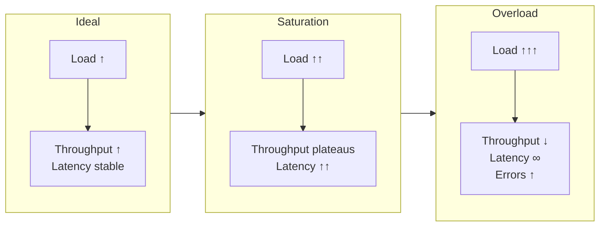
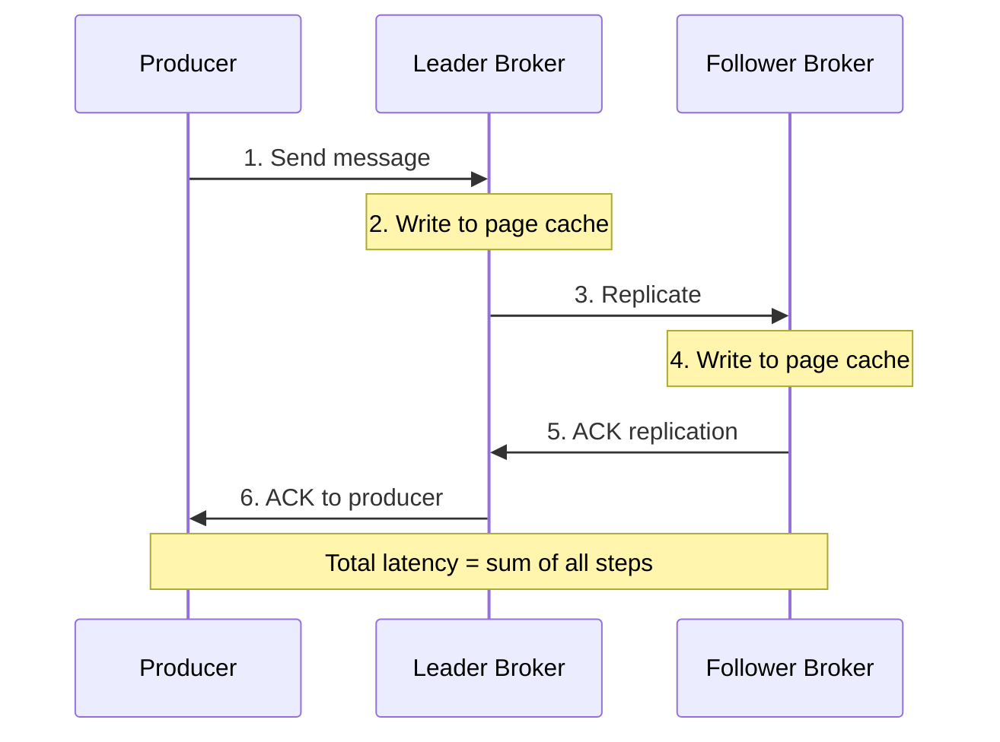
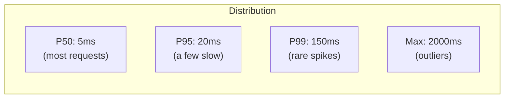
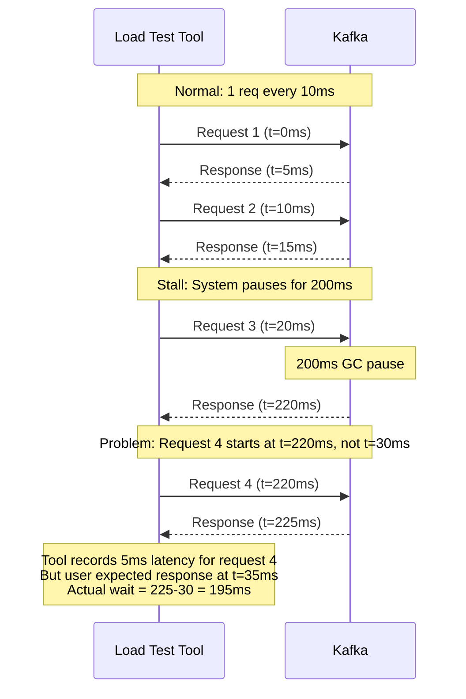
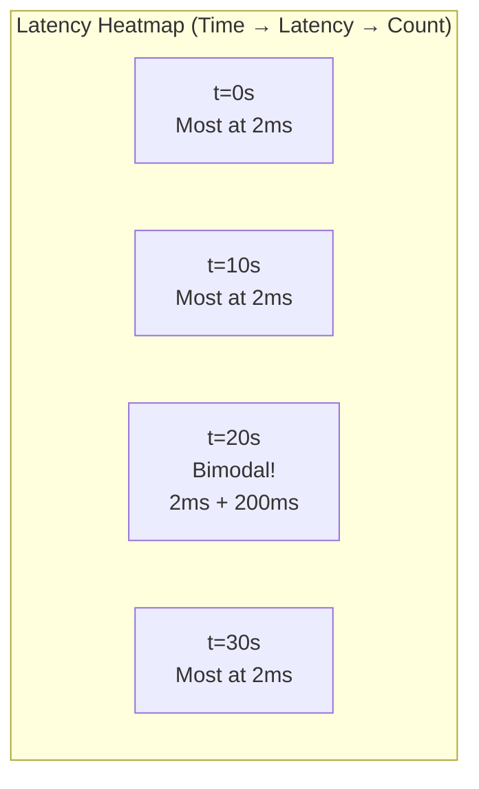

# Chapter 4: Performance Theory

This chapter covers the fundamentals of measuring distributed system performance. Understanding these concepts is essential before running any Kates test — without them, you'll collect numbers but not learn anything.

## The Two Pillars: Throughput and Latency

Every performance measurement reduces to two fundamental questions:

1. **How much work can the system do?** → Throughput
2. **How long does each unit of work take?** → Latency

These two metrics have a **complex, non-linear relationship**. Increasing throughput eventually causes latency to rise, and that inflection point is exactly what performance testing is designed to find.



### Throughput

For Kafka, throughput is measured in two dimensions:

| Metric | Unit | What It Means |
|--------|------|---------------|
| Records per second | rec/s | How many messages the system processes per second |
| Megabytes per second | MB/s | How much data volume the system moves per second |

Both matter. A system processing 100,000 tiny 100-byte messages/s has very different characteristics than one processing 10,000 large 10KB messages/s — even though the MB/s might be similar.

In Kates, we measure:

- **Average throughput** — total records / total duration
- **Peak throughput** — highest throughput observed in any sampling window

### Latency

Latency is the time between sending a message and receiving an acknowledgment. For Kafka producers with `acks=all`, this includes:



Each step adds latency:

| Step | Typical Duration | Variable? |
|------|-----------------|-----------|
| Network: producer → leader | \< 1ms (Kind) | Low |
| Leader write to page cache | \< 0.1ms | Low |
| Network: leader → follower | \< 1ms (Kind) | Low |
| Follower write to page cache | \< 0.1ms | Low |
| Network: follower → leader (ACK) | \< 1ms (Kind) | Low |
| Network: leader → producer (ACK) | \< 1ms (Kind) | Low |

Under normal conditions, end-to-end latency on the Kind cluster is **2–10ms**. Under load, it can spike to **100ms+** as internal queues fill.

## Why Averages Lie

**Never use average latency as your primary metric.** Here's why:

Consider two systems over 100 requests:
- **System A**: 99 requests at 5ms, 1 request at 500ms → Average = 9.95ms
- **System B**: 100 requests at 10ms → Average = 10ms

System A has a better average, but 1% of its users experience 50x worse performance. In production, that 1% often represents your most important customers (large payloads, complex transactions).

### The Percentile Solution

Percentiles tell you about the **distribution** of latency, not just the center:

| Percentile | Meaning | Why It Matters |
|-----------|---------|----------------|
| **P50** (median) | Half of requests are faster than this | Your "typical" user experience |
| **P95** | 95% of requests are faster than this | Your "most users" experience |
| **P99** | 99% of requests are faster than this | Your "nearly all users" experience |
| **P99.9** | 99.9% of requests are faster than this | Your "everything except rare outliers" |
| **Max** | Worst single observation | Your "worst case" |

Kates reports P50, P95, P99, and Max for every test run.

### The Long Tail Problem



In Kafka, tail latency is caused by:

- **GC pauses** — the JVM stops all threads to collect garbage
- **Page cache eviction** — under memory pressure, reads hit disk instead of cache
- **ISR shrink/expand** — when followers fall behind, write latency changes
- **Log roll** — the broker creates a new log segment, causing I/O spikes
- **Controller elections** — KRaft metadata operations can cause brief pauses

> [!TIP]
> GC pauses are the most common source of tail latency in Kates benchmarks. Switching to **ZGC** (`-XX:+UseZGC -XX:+ZGenerational`) reduces GC pauses to under 1ms regardless of heap size. Kates deploys with ZGC by default — see [Chapter 12: Deployment](12-deployment.md#jvm-tuning) for details.

## Coordinated Omission

One of the most insidious measurement errors in load testing is **coordinated omission**. It occurs when your measurement tool slows down along with the system, causing it to miss the worst-case latencies.

### How It Happens



During the stall, the tool should have sent 19 more requests (at t=30, 40, 50... 210ms). All those "phantom requests" would have experienced 200ms+ latency. But the tool only measured the one request it actually sent.

### How Kates Handles It

Kates uses a throughput-stable measurement loop. The producer maintains a fixed target rate regardless of response times. If the system stalls, the producer detects the gap and records corrected latencies for the missed window. This is implemented in the `LatencyHistogram` — all observations are recorded, including the time spent waiting.

## Heatmaps: Seeing the Full Picture

Percentiles compress the latency distribution into a few numbers. Heatmaps preserve the **full distribution over time**, revealing patterns invisible in aggregate metrics.



A heatmap answers questions that percentiles cannot:

| Question | Percentile Answer | Heatmap Answer |
|----------|-------------------|----------------|
| "Was the P99 spike sustained or momentary?" | "P99 = 200ms" | "200ms spike lasted exactly 3 seconds during GC" |
| "Is latency bimodal?" | "P50=5ms, P99=200ms" | "Yes — 90% at 5ms, 10% at 200ms. Two distinct populations." |
| "When did the latency regime change?" | "Before/after averages differ" | "At t=45s, latency shifted from 5ms to 50ms permanently" |

Kates exports heatmap data in two formats:

- **JSON** — structured data for Grafana visualization
- **CSV** — tabular data for spreadsheet analysis

Each heatmap row contains counts across 25 logarithmic latency buckets, sampled every second during the test. For full details on heatmap export commands, bucket boundaries, and reading patterns, see [Chapter 9: Observability — Latency Heatmaps](09-observability.md#latency-heatmaps).

## Statistical Significance

Running a test once and drawing conclusions is dangerous. Performance measurements are inherently noisy due to:

- JVM warm-up (JIT compilation, class loading)
- OS-level scheduling jitter
- Docker layer overhead in Kind
- Garbage collection timing
- Disk I/O scheduling

### Warm-Up Phase

Always discard the first few seconds of data. Kates test types like LOAD and STRESS include configurable warm-up phases where the engine runs at reduced throughput before measuring at full speed.

### Multiple Runs

For critical decisions, run the same test 3–5 times and compare. Kates provides:

```bash
# Run the same test multiple times
kates test create --type LOAD --records 100000
kates test create --type LOAD --records 100000
kates test create --type LOAD --records 100000

# Compare results
kates report compare id1,id2,id3

# View trends over time
kates trend --type LOAD --metric p99LatencyMs --days 7
```

### What "Good" Looks Like

There is no universal "good" latency or throughput. It depends entirely on your **use case**:

| Use Case | Acceptable P99 | Typical Throughput |
|----------|:-:|:-:|
| Real-time event streaming | \< 10ms | 10K–100K rec/s |
| Log aggregation | \< 100ms | 100K–1M rec/s |
| Batch data pipeline | \< 1s | 1M+ rec/s |
| Financial transactions | \< 5ms | 1K–10K rec/s |

Kates lets you define SLA thresholds per test type, so "good" is whatever you define it to be.
