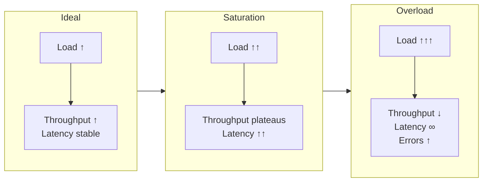
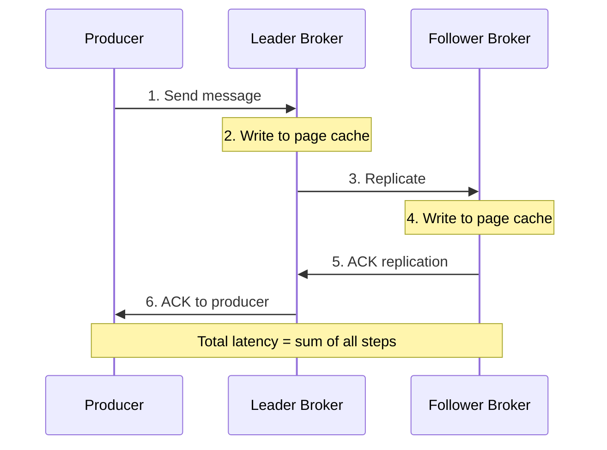
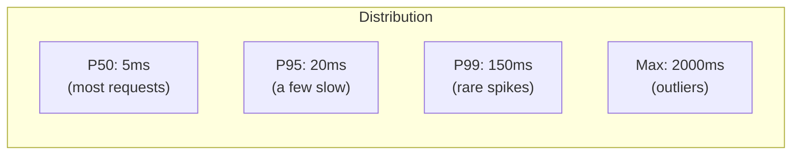
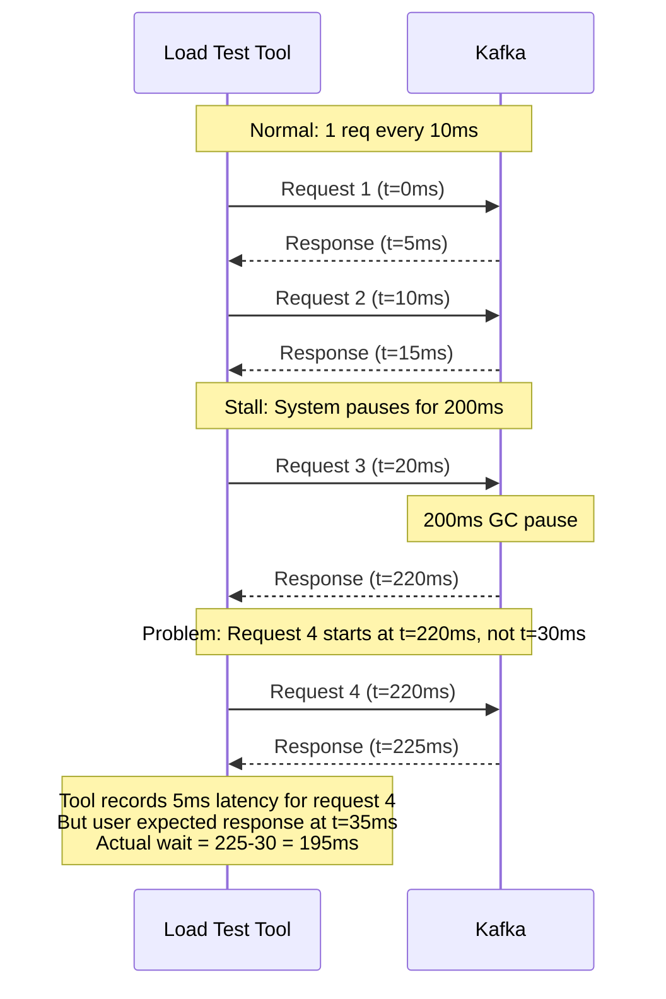
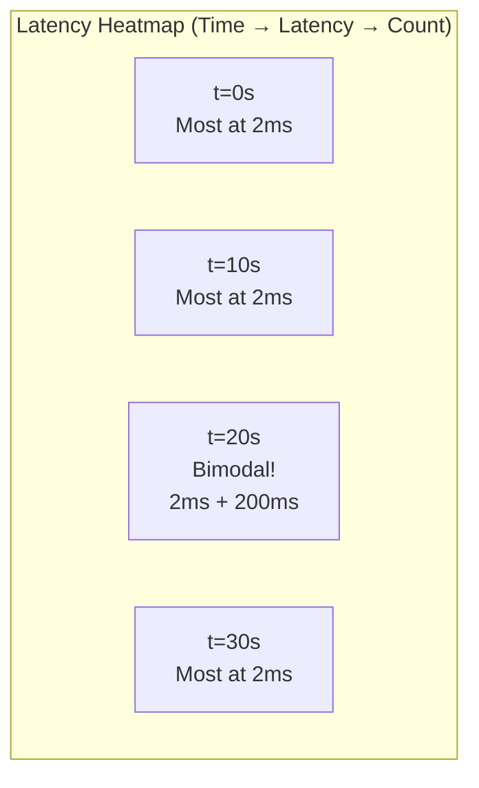

# Performance Theory

This chapter covers the fundamentals of measuring distributed system performance. Understanding these concepts is essential before running any Kates test — without them, you'll collect numbers but not learn anything.

After this chapter, you can:

- Explain the throughput/latency trade-off and locate the saturation point where latency inflects
- Read P50/P95/P99 percentiles and say why the mean understates tail latency
- Spot coordinated omission in a measurement and know where the Kates mitigation stops
- Judge whether two runs differ by more than run-to-run noise before calling a regression

## The Two Pillars: Throughput and Latency

Every performance measurement reduces to two fundamental questions:

1. **How much work can the system do?** → Throughput
2. **How long does each unit of work take?** → Latency

These two metrics have a **complex, non-linear relationship**. Increasing throughput eventually causes latency to rise, and that inflection point is exactly what performance testing is designed to find.


```mermaid
graph LR
    subgraph Ideal
        A[Load ↑] --> B[Throughput ↑<br/>Latency stable]
    end
    
    subgraph Saturation
        C[Load ↑↑] --> D[Throughput plateaus<br/>Latency ↑↑]
    end
    
    subgraph Overload
        E[Load ↑↑↑] --> F[Throughput ↓<br/>Latency ∞<br/>Errors ↑]
    end
    
    Ideal --> Saturation --> Overload
```

### Throughput

For Kafka, throughput is measured in two dimensions:

| Metric | Unit | What It Means |
|--------|------|---------------|
| Records per second | rec/s | How many messages the system processes per second |
| Megabytes per second | MB/s | How much data volume the system moves per second |

Both matter. A system processing 100,000 tiny 100-byte messages/s has very different characteristics than one processing 10,000 large 10KB messages/s — even though the MB/s might be similar.

Kates measures:

- **Average throughput** — total records / total duration
- **Peak throughput** — highest throughput observed in any sampling window

### Latency

Latency is the time between sending a message and receiving an acknowledgment. For Kafka producers with `acks=all`, this includes:


```mermaid
sequenceDiagram
    participant Producer
    participant Leader as Leader Broker
    participant Follower as Follower Broker
    
    Producer->>Leader: 1. Send message
    Note over Leader: 2. Write to page cache
    Leader->>Follower: 3. Replicate
    Note over Follower: 4. Write to page cache
    Follower->>Leader: 5. ACK replication
    Leader->>Producer: 6. ACK to producer
    
    Note over Producer,Follower: Total latency = sum of all steps
```

Each step adds latency. The durations below were measured on a local Kind cluster and are illustrative — absolute numbers vary with host hardware:

| Step | Typical Duration | Variable? |
|------|-----------------|-----------|
| Network: producer → leader | \< 1ms (Kind) | Low |
| Leader write to page cache | \< 0.1ms | Low |
| Network: leader → follower | \< 1ms (Kind) | Low |
| Follower write to page cache | \< 0.1ms | Low |
| Network: follower → leader (ACK) | \< 1ms (Kind) | Low |
| Network: leader → producer (ACK) | \< 1ms (Kind) | Low |

Under normal conditions, end-to-end latency on a local Kind cluster typically lands around **2–10ms**, depending on the host. Under load, it can spike to **100ms+** as internal queues fill.

## Why Averages Lie

**Never use average latency as your primary metric.** Here's why:

Consider two systems over 100 requests:
- **System A**: 99 requests at 5ms, 1 request at 500ms → Average = 9.95ms
- **System B**: 100 requests at 10ms → Average = 10ms

System A has a better average, but 1% of its users experience 50x worse performance. In production, that 1% often represents your most important customers (large payloads, complex transactions).

### The Percentile Solution

Percentiles tell you about the **distribution** of latency, not just the center:

| Percentile | Meaning | Why It Matters |
|-----------|---------|----------------|
| **P50** (median) | Half of requests are faster than this | Your "typical" user experience |
| **P95** | 95% of requests are faster than this | Your "most users" experience |
| **P99** | 99% of requests are faster than this | Your "nearly all users" experience |
| **P99.9** | 99.9% of requests are faster than this | Your "everything except rare outliers" |
| **Max** | Worst single observation | Your "worst case" |

Kates reports the mean plus P50, P95, P99, P99.9, and Max for every test run.

### The Long Tail Problem


```mermaid
graph LR
    subgraph Distribution
        direction TB
        A["P50: 5ms<br/>(most requests)"]
        B["P95: 20ms<br/>(a few slow)"]
        C["P99: 150ms<br/>(rare spikes)"]
        D["Max: 2000ms<br/>(outliers)"]
    end
```

In Kafka, tail latency is caused by:

- **GC pauses** — the JVM stops all threads to collect garbage
- **Page cache eviction** — under memory pressure, reads hit disk instead of cache
- **ISR shrink/expand** — when followers fall behind, write latency changes
- **Log roll** — the broker creates a new log segment, causing I/O spikes
- **Controller elections** — KRaft metadata operations can cause brief pauses

::: {.callout-tip}
GC pauses are the most common source of tail latency in Kates benchmarks. Switching to **ZGC** reduces GC pauses to under 1ms regardless of heap size. Kates deploys with generational ZGC by default (`-XX:+UseZGC -XX:+ZGenerational` on its JDK 21 base image; newer JDKs make generational mode the default) — see [Deployment Guide](12-deployment.md#jvm-tuning) for details.
:::

## Coordinated Omission

One of the most insidious measurement errors in load testing is **coordinated omission**. It occurs when your measurement tool slows down along with the system, causing it to miss the worst-case latencies.

### How It Happens


```mermaid
sequenceDiagram
    participant Tool as Load Test Tool
    participant System as Kafka
    
    Note over Tool,System: Normal: 1 req every 10ms
    Tool->>System: Request 1 (t=0ms)
    System-->>Tool: Response (t=5ms)
    Tool->>System: Request 2 (t=10ms)
    System-->>Tool: Response (t=15ms)
    
    Note over Tool,System: Stall: System pauses for 200ms
    Tool->>System: Request 3 (t=20ms)
    Note over System: 200ms GC pause
    System-->>Tool: Response (t=220ms)
    
    Note over Tool,System: Problem: Request 4 starts at t=220ms, not t=30ms
    Tool->>System: Request 4 (t=220ms)
    System-->>Tool: Response (t=225ms)
    
    Note over Tool: Tool records 5ms latency for request 4<br/>But user expected response at t=35ms<br/>Actual wait = 225-30 = 195ms
```

During the stall, the tool should have sent 19 more requests (at t=30, 40, 50... 210ms). All those "phantom requests" would have experienced 200ms+ latency. But the tool only measured the one request it actually sent.

### How Kates Handles It

Kates mitigates the classic closed-loop form of coordinated omission by sending asynchronously: the producer loop never waits for an acknowledgment before dispatching the next record, and when a target rate is configured it keeps pacing sends at that rate regardless of response times. A slow response therefore does not hold back subsequent sends.

Know the limits, though: Kates does not apply coordinated-omission correction. The `LatencyHistogram` records only the observations that actually occurred — there is no gap detection and no back-filling of latencies for send slots missed during a stall. If the producer itself blocks (for example, its internal buffer fills while a broker pauses), the percentiles for that window understate what a steady stream of clients would have experienced. For stall-heavy workloads, cross-check the percentiles against the latency heatmap, which makes those windows visible.

## Heatmaps: Seeing the Full Picture

Percentiles compress the latency distribution into a few numbers. Heatmaps preserve the **full distribution over time**, revealing patterns invisible in aggregate metrics.


```mermaid
graph TD
    subgraph Heatmap["Latency Heatmap (Time → Latency → Count)"]
        direction LR
        T1["t=0s<br/>Most at 2ms"]
        T2["t=10s<br/>Most at 2ms"]
        T3["t=20s<br/>Bimodal!<br/>2ms + 200ms"]
        T4["t=30s<br/>Most at 2ms"]
    end
```

A heatmap answers questions that percentiles cannot:

| Question | Percentile Answer | Heatmap Answer |
|----------|-------------------|----------------|
| "Was the P99 spike sustained or momentary?" | "P99 = 200ms" | "200ms spike lasted exactly 3 seconds during GC" |
| "Is latency bimodal?" | "P50=5ms, P99=200ms" | "Yes — 90% at 5ms, 10% at 200ms. Two distinct populations." |
| "When did the latency regime change?" | "Before/after averages differ" | "At t=45s, latency shifted from 5ms to 50ms permanently" |

Kates exports heatmap data in two formats:

- **JSON** — structured data for Grafana visualization
- **CSV** — tabular data for spreadsheet analysis

Each heatmap row contains counts across logarithmic latency buckets, snapshotted each time the running test's status is polled. For full details on heatmap export commands, bucket boundaries, and reading patterns, see [Observability & Monitoring](09-observability.md#latency-heatmaps).

## Statistical Significance

Running a test once and drawing conclusions is dangerous. Performance measurements are inherently noisy due to:

- JVM warm-up (JIT compilation, class loading)
- OS-level scheduling jitter
- Docker layer overhead in Kind
- Garbage collection timing
- Disk I/O scheduling

### Warm-Up Phase

Always discard the first few seconds of data. Multi-phase Kates scenarios support a dedicated WARMUP phase that runs at a reduced target throughput ahead of the steady-state phase; results are recorded per phase, so warm-up numbers stay out of your steady-state measurements.

### Multiple Runs

For critical decisions, run the same test 3–5 times and compare. Kates provides:

```bash
# Run the same test multiple times
kates test create --type LOAD --records 100000
kates test create --type LOAD --records 100000
kates test create --type LOAD --records 100000

# Compare results
kates report compare id1,id2,id3

# View trends over time
kates trend --type LOAD --metric p99LatencyMs --days 7
```

### What "Good" Looks Like

There is no universal "good" latency or throughput. It depends entirely on your **use case**:

| Use Case | Acceptable P99 | Typical Throughput |
|----------|:-:|:-:|
| Real-time event streaming | \< 10ms | 10K–100K rec/s |
| Log aggregation | \< 100ms | 100K–1M rec/s |
| Batch data pipeline | \< 1s | 1M+ rec/s |
| Financial transactions | \< 5ms | 1K–10K rec/s |

Kates lets you define SLA thresholds per test scenario, so "good" is whatever you define it to be.

::: {.callout-tip}
**Try it**

Run the identical LOAD test twice and see how far the percentiles move with nothing changed:

```bash
kates test create --type LOAD --records 100000 --wait
kates test create --type LOAD --records 100000 --wait
kates test list --type LOAD
kates report diff id1 id2
```

Each run prints its ID (`kates test list --type LOAD` recovers them if you lose track). Expect P50 to agree closely while P99 and Max drift — that gap is your run-to-run noise floor, and any "regression" smaller than it is indistinguishable from chance.
:::

## Summary

- Throughput and latency are coupled: past the saturation point, throughput plateaus while latency climbs — finding that knee is what a performance test is for.
- Averages hide the tail. Kates reports the mean plus P50, P95, P99, P99.9, and Max, and the tail is where GC pauses, ISR churn, and log rolls live.
- Kates avoids closed-loop coordinated omission by sending asynchronously at a paced rate, but it does not back-fill missed send slots — cross-check stall-heavy runs against the latency heatmap.
- Heatmaps preserve the full latency distribution over time, exposing bimodal populations and regime changes that percentiles compress away.
- One run proves nothing: keep warm-up out of steady-state numbers, repeat the test 3–5 times, and compare runs before trusting a difference.
- "Good" is workload-relative — define SLA thresholds per scenario instead of chasing universal numbers.

With the measurement theory in place, [Test Types Deep Dive](05-test-types.md) walks through each Kates test type and when to reach for it.
