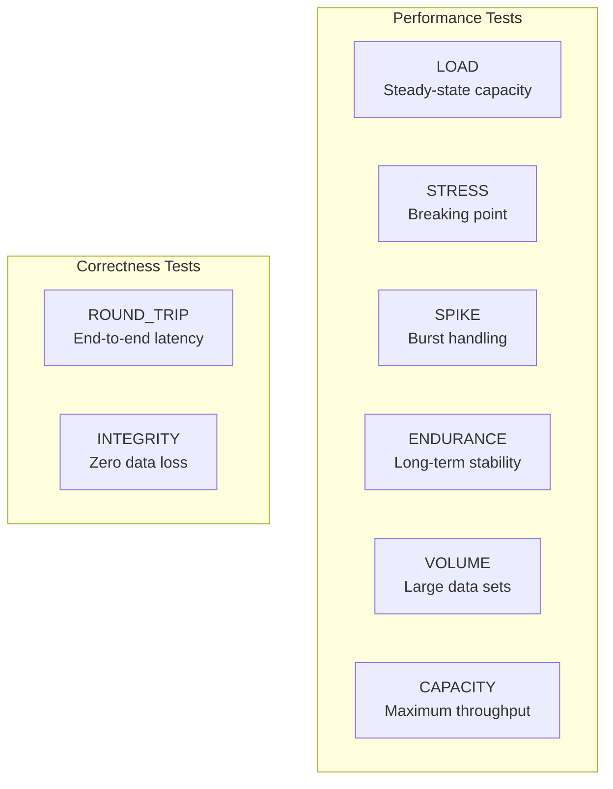
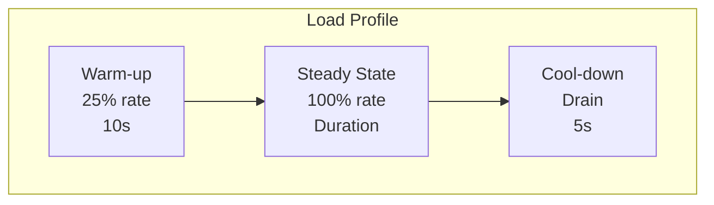
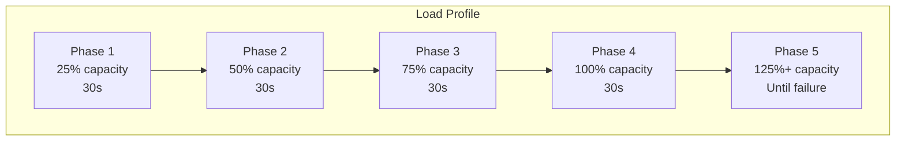
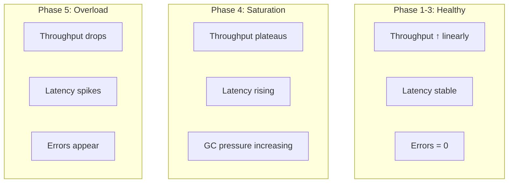
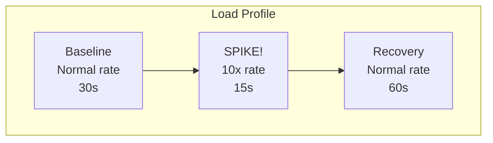
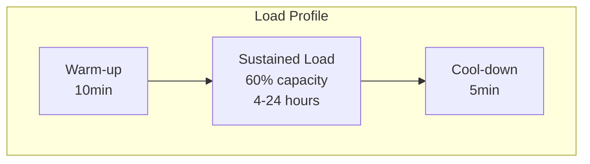
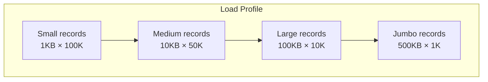
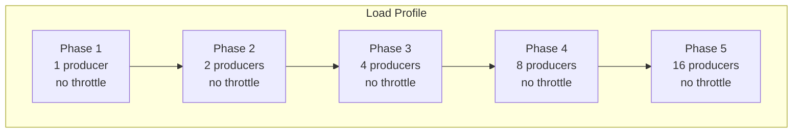
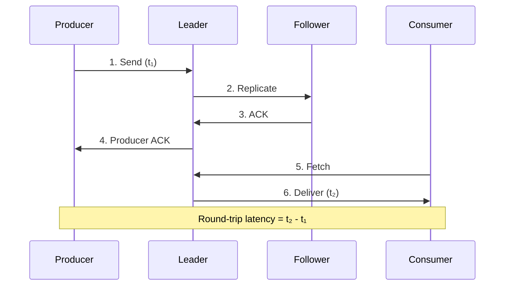
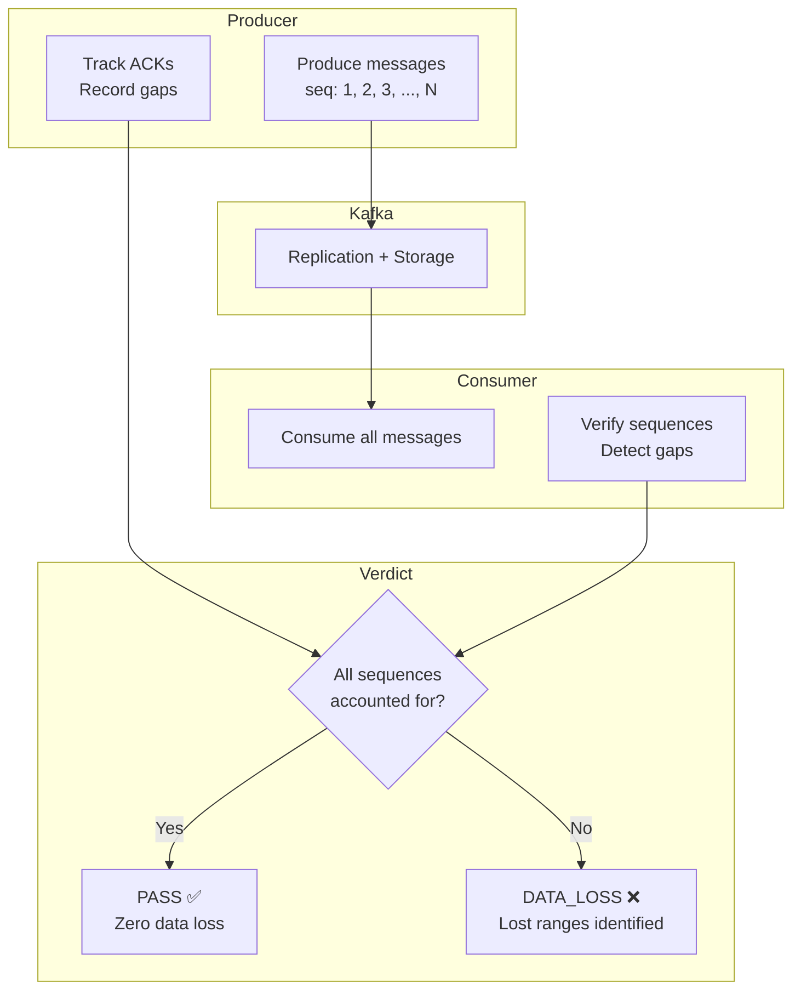

# Chapter 5: Test Types Deep Dive

KATES supports eight distinct test types, each designed to answer a specific question about your Kafka cluster's behavior. This chapter explains the methodology, use case, and configuration for every type.

## Test Type Overview



## LOAD Test

**Question:** *"What is my cluster's steady-state performance at expected production throughput?"*

### Methodology

A LOAD test sends a fixed number of records at a controlled, sustainable rate. It measures the baseline performance that users experience during normal operations.



### When to Use

- Establishing **baseline metrics** for comparison
- Validating performance after **configuration changes**
- **CI/CD gates** — ensure throughput and latency meet SLAs before deployment
- **Regression detection** — compare against historical baselines

### Configuration

| Parameter | Default | Description |
|-----------|---------|-------------|
| `records` | 100,000 | Total messages to produce |
| `recordSizeBytes` | 1024 | Message payload size |
| `producers` | 1 | Number of concurrent producers |
| `consumers` | 0 | Number of concurrent consumers |
| `acks` | `all` | Producer acknowledgment mode |
| `topic` | Auto-generated | Target topic name |
| `partitions` | 3 | Topic partition count |
| `replicationFactor` | 3 | Topic replication factor |

### Example

```bash
# Quick baseline
kates test create --type LOAD --records 100000 --wait

# Production-like configuration
kates test create --type LOAD \
  --records 500000 \
  --record-size 2048 \
  --producers 4 \
  --consumers 4 \
  --topic perf-load-test \
  --acks all \
  --wait
```

**Scenario file equivalent** (see [Chapter 13](13-scenario-files.md)):

```yaml
scenarios:
  - name: "Production Load Baseline"
    type: LOAD
    spec:
      records: 500000
      recordSizeBytes: 2048
      parallelProducers: 4
      numConsumers: 4
      topic: perf-load-test
      acks: all
    validate:
      maxP99LatencyMs: 50
      minThroughputRecPerSec: 10000
```

### Interpreting Results

| Metric | Healthy Range | Warning |
|--------|:---:|---------|
| P99 Latency | \< 50ms | > 200ms suggests resource contention |
| Error Rate | 0% | Any errors indicate a configuration problem |
| Throughput variability | \< 10% stddev | High variance suggests GC or I/O pressure |

---

## STRESS Test

**Question:** *"At what point does my cluster break, and how does it degrade?"*

### Methodology

A STRESS test **ramps throughput progressively** until the cluster can no longer keep up. It finds the saturation point and characterizes the degradation curve.



### When to Use

- **Capacity planning** — how much headroom does the cluster have?
- **Identifying bottlenecks** — which component saturates first (CPU, network, disk, memory)?
- **Validating auto-scaling policies** — does the cluster scale before degradation?

### Configuration

| Parameter | Default | Description |
|-----------|---------|-------------|
| `producers` | 1–8 (ramping) | Progressive increase per phase |
| `durationSeconds` | 300 | Total test duration across phases |
| `records` | 1,000,000+ | Enough to sustain all phases |
| `recordSizeBytes` | 1024 | Message size |

### Interpreting Results

The key metrics to watch across phases:



---

## SPIKE Test

**Question:** *"Can my cluster handle sudden traffic bursts without cascading failure?"*

### Methodology

A SPIKE test simulates a flash-sale or viral event — a sudden, dramatic increase in traffic followed by a return to normal.



### When to Use

- **Flash sale preparation** — can the cluster absorb 10x traffic?
- **Incident simulation** — what happens when a retry storm hits?
- **Recovery validation** — how long until the cluster returns to normal after a spike?

### Configuration

| Parameter | Default | Description |
|-----------|---------|-------------|
| `producers` | 1 → 10 → 1 | Sudden increase then decrease |
| `records` | Per-phase targets | Different record counts per phase |
| `durationSeconds` | 120 | Enough for baseline + spike + recovery |

### Key Metrics

| Phase | Watch For |
|-------|-----------|
| Pre-spike baseline | Record your normal P99 |
| During spike | Does latency grow linearly or exponentially? |
| Post-spike recovery | How long until P99 returns to baseline? |

---

## ENDURANCE Test

**Question:** *"Does performance degrade over hours or days of sustained load?"*

### Methodology

An ENDURANCE (soak) test runs at a moderate, realistic load for an **extended period** — hours or days — to detect slow resource leaks and gradual degradation.



### What It Detects

| Problem | How It Manifests |
|---------|------------------|
| Memory leak | P99 latency slowly rises over hours |
| Log segment accumulation | Disk usage grows, then GC pauses spike |
| Connection pool exhaustion | Error rate slowly increases |
| JVM metaspace growth | Off-heap memory consumption rises |
| Thread leak | Thread count climbs, eventually OOM |

### Configuration

| Parameter | Default | Description |
|-----------|---------|-------------|
| `durationSeconds` | 14400 (4h) | Long enough to expose leaks |
| `producers` | 2 | Moderate, sustainable load |
| `records` | 10,000,000+ | Enough for the full duration |

---

## VOLUME Test

**Question:** *"How does my cluster handle large messages or large data volumes?"*

### Methodology

A VOLUME test focuses on **data size** rather than request rate. It sends large messages or large total volumes to stress the storage and replication subsystems.



### When to Use

- **Validating large message support** — Kafka has a default 1MB message size limit
- **Storage capacity planning** — how fast does disk fill at production data rates?
- **Replication overhead** — larger messages amplify replication latency

### Configuration

| Parameter | Default | Description |
|-----------|---------|-------------|
| `recordSizeBytes` | 10240–512000 | Large message sizes |
| `records` | Variable | Enough to stress storage |
| `acks` | `all` | Full replication to measure real cost |

**Scenario file equivalent:**

```yaml
scenarios:
  - name: "Large Message Volume"
    type: VOLUME
    spec:
      records: 10000
      recordSizeBytes: 102400
      parallelProducers: 2
      acks: all
    validate:
      maxP99LatencyMs: 500
```

---

## CAPACITY Test

**Question:** *"What is the absolute maximum throughput my cluster can sustain?"*

### Methodology

A CAPACITY test removes all artificial throttling and pushes the cluster to its maximum throughput. It finds the ceiling and measures what metric (CPU, disk, memory, network) is the bottleneck.



### Configuration

| Parameter | Default | Description |
|-----------|---------|-------------|
| `producers` | 1–16 (stepped) | Each phase adds producers |
| `throughput` | -1 (unlimited) | No rate limiting |
| `recordSizeBytes` | 1024 | Standard message size |
| `records` | 2,000,000+ | Enough for all phases |

### Interpreting Results

The output is a throughput curve. Max throughput is where adding more producers stops increasing total rec/s:

| Producers | Throughput | Interpretation |
|:-:|:-:|---|
| 1 | 50K rec/s | Single-threaded baseline |
| 2 | 95K rec/s | Near-linear scaling |
| 4 | 170K rec/s | Still scaling |
| 8 | 200K rec/s | Diminishing returns — approaching saturation |
| 16 | 195K rec/s | Throughput actually drops — overloaded |

---

## ROUND_TRIP Test

**Question:** *"What is the true end-to-end latency from produce to consume?"*

### Methodology

A ROUND_TRIP test measures the complete message lifecycle: the time from when a producer sends a message to when a consumer receives it. This includes producer latency, replication latency, and consumer fetch latency.



### Configuration

| Parameter | Default | Description |
|-----------|---------|-------------|
| `producers` | 1 | Single producer for clean measurement |
| `consumers` | 1 | Single consumer to capture delivery |
| `records` | 10,000 | Fewer records, focus on latency quality |

**Scenario file equivalent:**

```yaml
scenarios:
  - name: "End-to-End Latency"
    type: ROUND_TRIP
    spec:
      records: 10000
      parallelProducers: 1
      numConsumers: 1
    validate:
      maxP99LatencyMs: 25
      maxAvgLatencyMs: 10
```

---

## INTEGRITY Test

**Question:** *"Does my cluster lose, duplicate, or reorder messages under stress?"*

### Methodology

The INTEGRITY test is the most critical test type. It produces messages with **monotonic sequence numbers**, tracks acknowledgments, and then consumes all messages to verify completeness.



### What It Verifies

| Property | How |
|----------|-----|
| **No data loss** | Every produced sequence number is consumed |
| **No duplication** | Each sequence number appears exactly once (with idempotence) |
| **No reordering** | Sequence numbers arrive in order per partition |
| **ACK consistency** | Every ACKed message is actually persisted |

### Configuration

| Parameter | Default | Description |
|-----------|---------|-------------|
| `records` | 100,000 | Messages to verify |
| `acks` | `all` | Required for integrity guarantees |
| `idempotenceEnabled` | `true` | Kafka producer idempotency |
| `transactionsEnabled` | `false` | Optional exactly-once |
| `consumers` | 1 | Consumer for verification |
| `consumerGroup` | Auto-generated | Consumer group name |

**Scenario file equivalent:**

```yaml
scenarios:
  - name: "Zero-Loss Integrity"
    type: INTEGRITY
    spec:
      records: 100000
      acks: all
      enableIdempotence: true
      enableCrc: true
      numConsumers: 1
    validate:
      maxDataLossPercent: 0
      maxOutOfOrder: 0
      maxCrcFailures: 0
```

### Integrity + Chaos

The real power of INTEGRITY tests emerges when combined with chaos engineering:

```bash
# Generate a chaos-aware integrity test scaffold
kates test scaffold --type INTEGRITY_CHAOS -o integrity-chaos.yaml

# Run it — produces messages while killing a broker
kates test apply -f integrity-chaos.yaml --wait
```

This test produces messages, kills a broker mid-test, waits for recovery, and then verifies that **every single message** was persisted correctly. It is the ultimate validation of Kafka's durability guarantees.

## Scenario Files

All test types support YAML scenario files for reproducible, version-controlled test definitions. See [Chapter 13: Scenario Files & SLA Gates](13-scenario-files.md) for the complete YAML schema reference, including all 22 spec fields and 9 SLA validation gates.

```bash
# Generate a scaffold for any test type
kates test scaffold --type LOAD
kates test scaffold --type STRESS
kates test scaffold --type SPIKE
kates test scaffold --type INTEGRITY_CHAOS

# Apply a scenario
kates test apply -f scenario.yaml --wait
```
