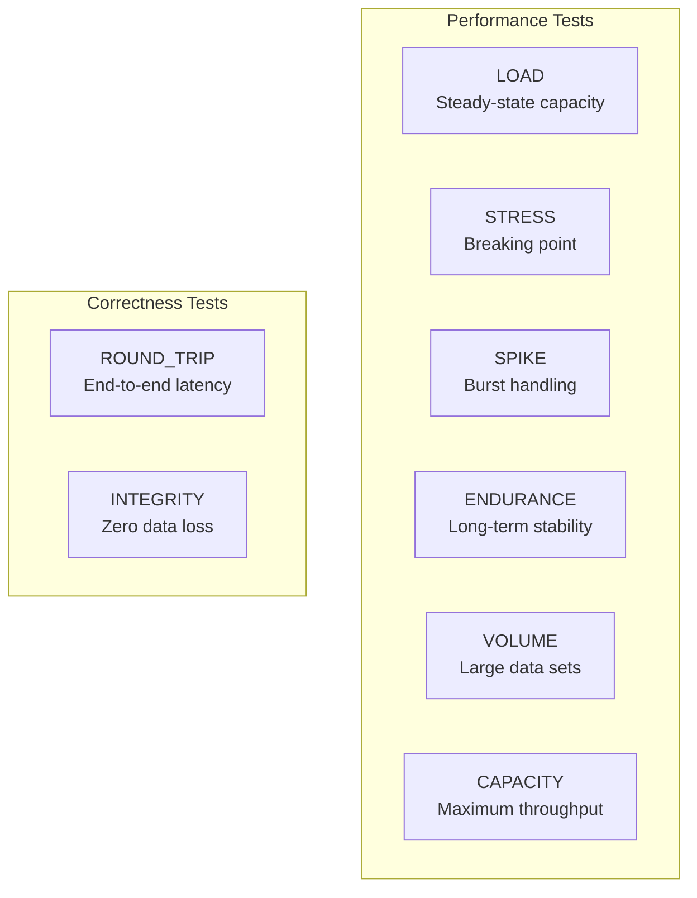
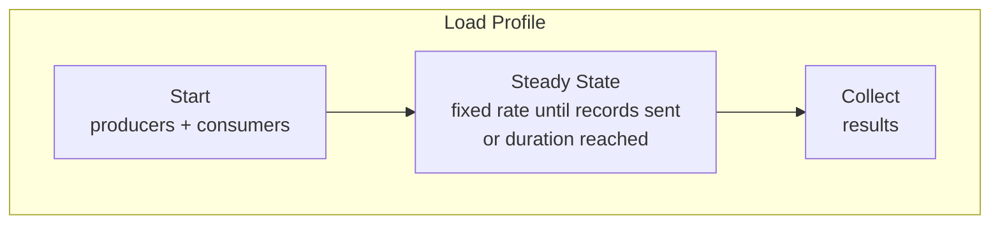
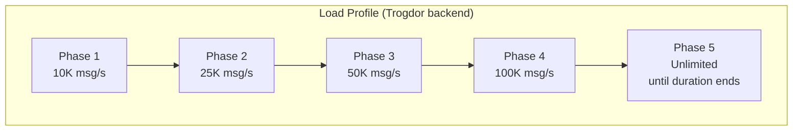
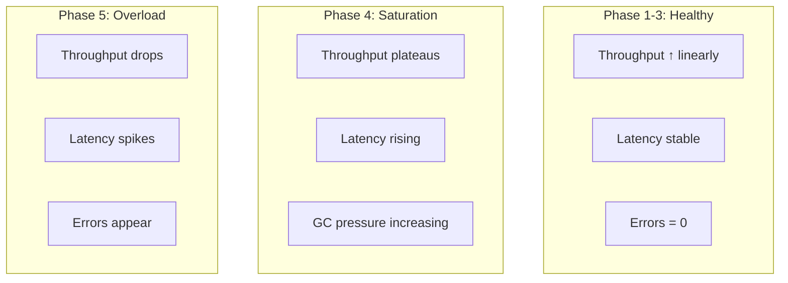
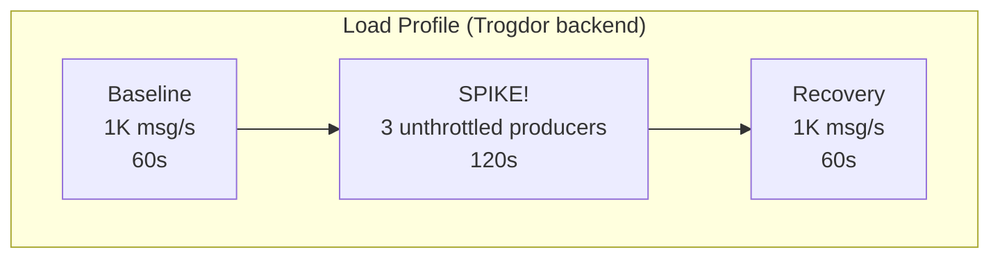
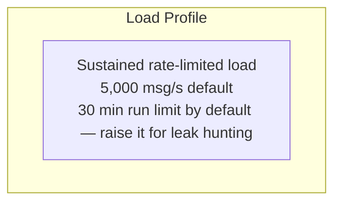
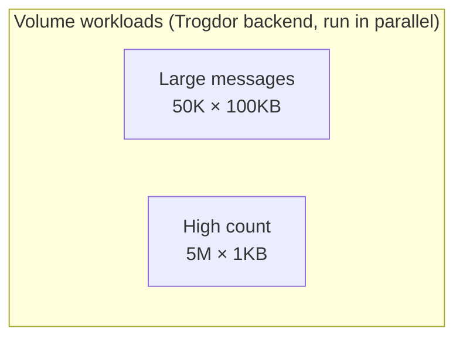
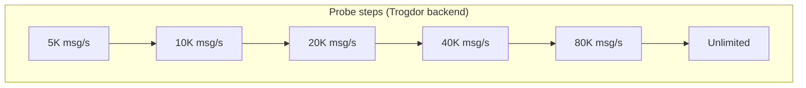
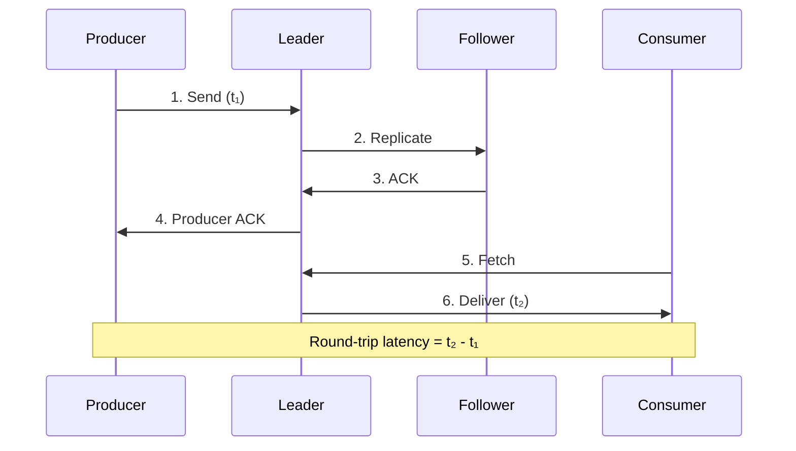
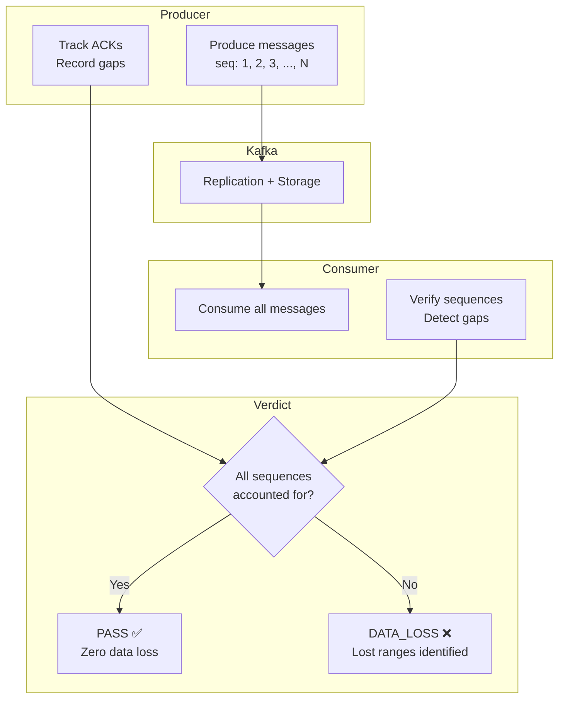

# Test Types Deep Dive

This chapter covers the eight core Kates test types, each designed to answer a specific question about your Kafka cluster's behavior — the methodology, use case, and configuration for every type. (Kates also has specialized `TUNE_*` parameter-sweep types, covered in [CLI Reference](10-cli-reference.md), and an `INTEGRATION_CDC` type.)

Whether you're baselining a new cluster or gating a CI pipeline, after this chapter you can:

- Pick the test type that answers the question you're actually asking — steady-state capacity, breaking point, burst recovery, or data safety
- Configure each type's key parameters and know how the native and Trogdor backends shape the load differently
- Read the results — recognize saturation, slow leaks, and data loss in the metrics each type reports
- Run any type from a built-in scenario template instead of hand-rolled flags

## Test Type Overview


```mermaid
graph TB
    subgraph Performance["Performance Tests"]
        LOAD[LOAD<br/>Steady-state capacity]
        STRESS[STRESS<br/>Breaking point]
        SPIKE[SPIKE<br/>Burst handling]
        ENDURANCE[ENDURANCE<br/>Long-term stability]
        VOLUME[VOLUME<br/>Large data sets]
        CAPACITY[CAPACITY<br/>Maximum throughput]
    end
    
    subgraph Correctness["Correctness Tests"]
        RT[ROUND_TRIP<br/>End-to-end latency]
        INT[INTEGRITY<br/>Zero data loss]
    end
```

## LOAD Test

**Question:** *"What is my cluster's steady-state performance at expected production throughput?"*

### Methodology

A LOAD test sends a fixed number of records at a controlled, sustainable rate. It measures the baseline performance that users experience during normal operations.


```mermaid
graph LR
    subgraph Load["Load Profile"]
        direction LR
        T1["Start<br/>producers + consumers"] --> T2["Steady State<br/>fixed rate until records sent<br/>or duration reached"] --> T3["Collect<br/>results"]
    end
```

### When to Use

- Establishing **baseline metrics** for comparison
- Validating performance after **configuration changes**
- **CI/CD gates** — ensure throughput and latency meet SLAs before deployment
- **Regression detection** — compare against historical baselines

### Configuration

| Parameter | Default | Description |
|-----------|---------|-------------|
| `records` | 1,000,000 | Total messages to produce |
| `recordSizeBytes` | 1024 | Message payload size |
| `parallelProducers` | 1 | Ignored: LOAD runs one producer |
| `numConsumers` | 1 | Ignored: LOAD runs one consumer |
| `targetThroughput` | -1 (unlimited) | Producer rate in records/s |
| `acks` | `all` | Producer acknowledgment mode |
| `topic` | `load-test` | Target topic name (unless overridden) |
| `partitions` | 3 | Topic partition count |
| `replicationFactor` | 3 | Topic replication factor |

### Example

```bash
# Quick baseline
kates test create --type LOAD --records 100000 --wait

# Production-like configuration
kates test create --type LOAD \
  --records 500000 \
  --record-size 2048 \
  --topic perf-load-test \
  --acks all \
  --wait
```

**Scenario file equivalent** (see [Scenario Files & SLA Gates](13-scenario-files.md)):

```yaml
scenarios:
  - name: "Production Load Baseline"
    type: LOAD
    spec:
      records: 500000
      recordSizeBytes: 2048
      topic: perf-load-test
      acks: all
    validate:
      maxP99LatencyMs: 50
      minThroughputRecPerSec: 10000
```

### Interpreting Results

Healthy ranges are environment-dependent — treat these as starting points and calibrate against your own baseline:

| Metric | Healthy Range | Warning |
|--------|:---:|---------|
| P99 Latency | \< 50ms | > 200ms suggests resource contention |
| Error Rate | 0% | Any errors indicate a configuration problem |
| Throughput variability | \< 10% stddev | High variance suggests GC or I/O pressure |

::: {.callout-tip}
For iterative parameter tuning, use `kates lab` instead of individual `test create` commands. Lab lets you tweak parameters, run tests, and compare results in a single session — see [Lab — Interactive Performance Tuning](10b-lab.md).
:::

---

## STRESS Test

**Question:** *"At what point does my cluster break, and how does it degrade?"*

### Methodology

A STRESS test pushes the cluster well past its comfortable operating point to find the saturation point and characterize the degradation curve. How the load is applied depends on the backend: the default native backend runs several **concurrent unthrottled producers** (`parallelProducers`, default 3), while the Trogdor backend (`--backend trogdor`) **ramps throughput progressively** through five steps, each getting a fifth of the test duration:


```mermaid
graph LR
    subgraph Stress["Load Profile (Trogdor backend)"]
        direction LR
        P1["Phase 1<br/>10K msg/s"] --> P2["Phase 2<br/>25K msg/s"] --> P3["Phase 3<br/>50K msg/s"] --> P4["Phase 4<br/>100K msg/s"] --> P5["Phase 5<br/>Unlimited<br/>until duration ends"]
    end
```

### When to Use

- **Capacity planning** — how much headroom does the cluster have?
- **Identifying bottlenecks** — which component saturates first (CPU, network, disk, memory)?
- **Validating auto-scaling policies** — does the cluster scale before degradation?

### Configuration

| Parameter | Default | Description |
|-----------|---------|-------------|
| `parallelProducers` | 3 | Concurrent producers (native backend) |
| `durationSeconds` | 900 | Total test duration (Trogdor splits it evenly across the ramp steps) |
| `records` | 5,000,000 | Enough to sustain the full run |
| `recordSizeBytes` | 1024 | Message size |

### Interpreting Results

The key metrics to watch across phases:


```mermaid
graph TD
    subgraph Healthy["Phase 1-3: Healthy"]
        A[Throughput ↑ linearly]
        B[Latency stable]
        C[Errors = 0]
    end
    
    subgraph Saturation["Phase 4: Saturation"]
        D[Throughput plateaus]
        E[Latency rising]
        F[GC pressure increasing]
    end
    
    subgraph Overload["Phase 5: Overload"]
        G[Throughput drops]
        H[Latency spikes]
        I[Errors appear]
    end
```

---

## SPIKE Test

**Question:** *"Can my cluster handle sudden traffic bursts without cascading failure?"*

### Methodology

A SPIKE test simulates a flash-sale or viral event — a sudden, dramatic increase in traffic followed by a return to normal. On the Trogdor backend, the baseline → spike → recovery sequence is automated; the default native backend instead runs a single unthrottled burst producer, so you measure the burst itself and observe recovery in your monitoring.


```mermaid
graph LR
    subgraph Spike["Load Profile (Trogdor backend)"]
        direction LR
        S1["Baseline<br/>1K msg/s<br/>60s"] --> S2["SPIKE!<br/>3 unthrottled producers<br/>120s"] --> S3["Recovery<br/>1K msg/s<br/>60s"]
    end
```

### When to Use

- **Flash sale preparation** — can the cluster absorb 10x traffic?
- **Incident simulation** — what happens when a retry storm hits?
- **Recovery validation** — how long until the cluster returns to normal after a spike?

### Configuration

| Parameter | Default | Description |
|-----------|---------|-------------|
| `records` | 2,000,000 | Total records for the burst |
| `recordSizeBytes` | 1024 | Message size |
| `durationSeconds` | 300 | Enough for baseline + spike + recovery |
| `acks` | `1` | Latency-oriented default for burst traffic |

### Key Metrics

| Phase | Watch For |
|-------|-----------|
| Pre-spike baseline | Record your normal P99 |
| During spike | Does latency grow linearly or exponentially? |
| Post-spike recovery | How long until P99 returns to baseline? |

---

## ENDURANCE Test

**Question:** *"Does performance degrade over hours or days of sustained load?"*

### Methodology

An ENDURANCE (soak) test runs at a moderate, realistic load for an **extended period** — up to 30 minutes on a default install, hours once you raise the backend's run limit — to detect slow resource leaks and gradual degradation.


```mermaid
graph LR
    subgraph Endurance["Load Profile"]
        direction LR
        E1["Sustained rate-limited load<br/>5,000 msg/s default<br/>30 min run limit by default — raise it for leak hunting"]
    end
```

### What It Detects

| Problem | How It Manifests |
|---------|------------------|
| Memory leak | P99 latency slowly rises over hours |
| Log segment accumulation | Disk usage grows, then GC pauses spike |
| Connection pool exhaustion | Error rate slowly increases |
| JVM metaspace growth | Off-heap memory consumption rises |
| Thread leak | Thread count climbs, eventually OOM |

### Configuration

| Parameter | Default | Description |
|-----------|---------|-------------|
| `durationSeconds` | 3600 (1h) | Upper bound on the run; a longer soak also needs more `records` and a raised backend run limit (see the callout below) |
| `parallelProducers` | 1 | Ignored: ENDURANCE runs one producer and one consumer |
| `targetThroughput` | 5,000 msg/s | Rate limit that keeps the load sustainable; the 5,000 is the ENDURANCE default, and this key replaces it |
| `records` | 10,000,000 | Enough for the full duration |

::: {.callout-important}
**No run lasts longer than 30 minutes by default**

The backend fails any run that is still `RUNNING` 30 minutes after it was created: it stops the run's producer and consumer and marks the run `FAILED`. The limit is the backend setting `kates.engine.max-duration-ms`, 1,800,000 ms by default, and the `kates` chart has no value for it. The default ENDURANCE run sends 10,000,000 records at 5,000 records/s, which takes about 33 minutes, so on a default install it fails unless `records` is 8,500,000 or fewer or `durationSeconds` is 1,700 or less. To allow longer runs, save the release's values with `helm get values kates -n kates -o yaml`, add the environment variable `KATES_ENGINE_MAX_DURATION_MS`, in milliseconds, to their `extraEnv`, and `helm upgrade` the release with that file. `kates deploy` upgrades the release from its own values files, which drops the entry, so repeat the upgrade after it.
:::

---

## VOLUME Test

**Question:** *"How does my cluster handle large messages or large data volumes?"*

### Methodology

A VOLUME test focuses on **data size** rather than request rate. It sends large messages or large total volumes to stress the storage and replication subsystems. The default native backend runs a single producer with large records (10 KB by default); the Trogdor backend runs two workloads in parallel:


```mermaid
graph TB
    subgraph Volume["Volume workloads (Trogdor backend, run in parallel)"]
        V1["Large messages<br/>50K × 100KB"]
        V2["High count<br/>5M × 1KB"]
    end
```

### When to Use

- **Validating large message support** — Kafka has a default 1MB message size limit
- **Storage capacity planning** — how fast does disk fill at production data rates?
- **Replication overhead** — larger messages amplify replication latency

### Configuration

| Parameter | Default | Description |
|-----------|---------|-------------|
| `recordSizeBytes` | 10,240 | Large messages (10 KB) |
| `records` | 2,000,000 | Enough to stress storage |
| `acks` | `all` | Full replication to measure real cost |

**Scenario file equivalent:**

```yaml
scenarios:
  - name: "Large Message Volume"
    type: VOLUME
    spec:
      records: 10000
      recordSizeBytes: 102400
      acks: all
    validate:
      maxP99LatencyMs: 500
```

---

## CAPACITY Test

**Question:** *"What is the absolute maximum throughput my cluster can sustain?"*

### Methodology

A CAPACITY test removes all artificial throttling and pushes the cluster to its maximum throughput. It finds the ceiling and measures what metric (CPU, disk, memory, network) is the bottleneck. The default native backend runs `parallelProducers` (default 5) unthrottled producers concurrently; the Trogdor backend probes stepped throughput targets:


```mermaid
graph LR
    subgraph Capacity["Probe steps (Trogdor backend)"]
        direction LR
        C1["5K msg/s"] --> C2["10K msg/s"] --> C3["20K msg/s"] --> C4["40K msg/s"] --> C5["80K msg/s"] --> C6["Unlimited"]
    end
```

### Configuration

| Parameter | Default | Description |
|-----------|---------|-------------|
| `parallelProducers` | 5 | Concurrent unthrottled producers (native backend) |
| `recordSizeBytes` | 1024 | Standard message size |
| `records` | 10,000,000 | Enough for the full run |
| `durationSeconds` | 1200 | Test duration |

### Interpreting Results

The output is a throughput curve, built by running a series of CAPACITY tests with increasing `--producers` counts. Max throughput is where adding more producers stops increasing total rec/s (illustrative numbers):

| Producers | Throughput | Interpretation |
|:-:|:-:|---|
| 1 | 50K rec/s | Single-threaded baseline |
| 2 | 95K rec/s | Near-linear scaling |
| 4 | 170K rec/s | Still scaling |
| 8 | 200K rec/s | Diminishing returns — approaching saturation |
| 16 | 195K rec/s | Throughput actually drops — overloaded |

---

## ROUND_TRIP Test

**Question:** *"What is the true end-to-end latency from produce to consume?"*

### Methodology

A ROUND_TRIP test measures the complete message lifecycle: the time from when a producer sends a message to when a consumer receives it. This includes producer latency, replication latency, and consumer fetch latency.


```mermaid
sequenceDiagram
    participant P as Producer
    participant L as Leader
    participant F as Follower
    participant C as Consumer
    
    P->>L: 1. Send (t₁)
    L->>F: 2. Replicate
    F->>L: 3. ACK
    L->>P: 4. Producer ACK
    C->>L: 5. Fetch
    L->>C: 6. Deliver (t₂)
    
    Note over P,C: Round-trip latency = t₂ - t₁
```

### Configuration

| Parameter | Default | Description |
|-----------|---------|-------------|
| `parallelProducers` | 1 | Ignored: ROUND_TRIP runs one producer |
| `numConsumers` | 1 | Ignored: ROUND_TRIP runs one consumer |
| `records` | 500,000 | Records to measure |
| `targetThroughput` | 10,000 msg/s | Rate-limited to keep latency measurements clean; the 10,000 is the ROUND_TRIP default, and this key replaces it |

**Scenario file equivalent:**

```yaml
scenarios:
  - name: "End-to-End Latency"
    type: ROUND_TRIP
    spec:
      records: 10000
    validate:
      maxP99LatencyMs: 25
      maxAvgLatencyMs: 10
```

---

## INTEGRITY Test

**Question:** *"Does my cluster lose, duplicate, or reorder messages under stress?"*

### Methodology

The INTEGRITY test is the most critical test type. It produces messages with **monotonic sequence numbers**, tracks acknowledgments, and then consumes all messages to verify completeness.


```mermaid
graph TB
    subgraph Producer
        P[Produce messages<br/>seq: 1, 2, 3, ..., N]
        PA[Track ACKs<br/>Record gaps]
    end
    
    subgraph Kafka
        K[Replication + Storage]
    end
    
    subgraph Consumer
        C[Consume all messages]
        CV[Verify sequences<br/>Detect gaps]
    end
    
    subgraph Verdict
        V{All sequences<br/>accounted for?}
        PASS[PASS ✅<br/>Zero data loss]
        FAIL[DATA_LOSS ❌<br/>Lost ranges identified]
    end
    
    P --> K --> C
    PA --> V
    CV --> V
    V -->|Yes| PASS
    V -->|No| FAIL
```

### What It Verifies

| Property | How |
|----------|-----|
| **No data loss** | Every produced sequence number is consumed |
| **No duplication** | Each sequence number appears exactly once (with idempotence) |
| **No reordering** | Sequence numbers arrive in order per partition |
| **ACK consistency** | Every ACKed message is actually persisted |

### Configuration

| Parameter | Default | Description |
|-----------|---------|-------------|
| `records` | 1,000,000 | Messages to verify |
| `acks` | `all` | Default for integrity guarantees; a request can override it, and `1` or `0` also turn producer idempotence off |
| `enableIdempotence` | not set | Sets the producer's `enable.idempotence`; left out, the Kafka producer is idempotent by default with `acks=all` (see the callout below) |
| `enableTransactions` | `false` | Transactional producer, committing every 100 records or every 10 seconds, whichever comes first; the verifying consumer then reads with `read_committed` |
| `enableCrc` | `true` | Per-record CRC payload verification; `false` turns it off |
| `numConsumers` | 1 | Ignored: INTEGRITY runs one producer and one consumer |
| `consumerGroup` | `integrity-cg` | Base of the consumer group name: the verifying consumer joins it with `-integrity` appended, `integrity-cg-integrity` by default |

::: {.callout-important}
`enableIdempotence` and `enableTransactions` need `acks` to be `all`, which the Kafka producer requires for both, and a transactional producer is always idempotent: the backend refuses a request that asks for either with other `acks`, or for transactions with `enableIdempotence: false`, with a `400` that names the field. A request that leaves `enableIdempotence` out gets the client's choice, idempotent whenever `acks` is `all`. [Data Integrity Verification](08-data-integrity.md) covers what each integrity mode checks.
:::

**Scenario file equivalent:**

```yaml
scenarios:
  - name: "Zero-Loss Integrity"
    type: INTEGRITY
    spec:
      records: 100000
      acks: all              # also makes the producer idempotent
    validate:
      maxDataLossPercent: 0
      maxOutOfOrder: 0
      maxCrcFailures: 0
```

### Integrity + Chaos

The real power of INTEGRITY tests emerges when combined with chaos engineering. `INTEGRITY` is not a chaos test by itself — the combination is orchestrated by `kates resilience run`, which pairs a test request with a chaos experiment (see [Chaos Engineering in Practice](07-chaos-practice.md)):

```yaml
# resilience-integrity.yaml
testRequest:
  type: INTEGRITY
  spec:
    numRecords: 180000     # at 500 records/s: 360 s of producing
    throughput: 500
    durationMs: 600000

chaosSpec:
  experimentName: broker-pod-kill
  targetNamespace: kafka
  targetLabel: "strimzi.io/component-type=kafka,strimzi.io/broker-role=true"
  disruptionType: POD_KILL
  chaosDurationSec: 30

steadyStateSec: 30
```

```bash
# Run it — produces for 360 s and kills one broker from 30 s to 60 s
kates resilience run -f resilience-integrity.yaml
```

This produces sequenced records at 500 per second, deletes one broker's pod 30 s in and again every 10 s until 60 s, keeps producing through the broker's restart and return to the ISR, then consumes everything back and verifies that **every acknowledged record** was persisted. The rate limit is what makes the result mean something: an unthrottled run can finish before the fault is triggered, and its verdict then says nothing about the failure. A resilience file's `spec` uses the API's field names, so the rate is `throughput`; the API also takes it as `targetThroughput`, the scenario file's name. [Data Integrity Verification](08-data-integrity.md) walks through the sizing and how to read the verdict, which the INTEGRITY run reports rather than `kates resilience run`. For a standalone integrity scenario, export the built-in template instead: `kates test scaffold export integrity-tx`.

## Scenario Files

All test types support YAML scenario files for reproducible, version-controlled test definitions. See [Scenario Files & SLA Gates](13-scenario-files.md) for the complete YAML schema reference, including the full spec field list and the SLA validation gates.

The CLI ships a curated library of built-in templates. Browse it with `list` (optionally filtered by `--type`), preview with `show`, and write a ready-to-edit file with `export`:

```bash
# Browse the built-in template library
kates test scaffold list
kates test scaffold --type LOAD

# Preview and export a template
kates test scaffold show quick-load
kates test scaffold export quick-load

# Apply a scenario
kates test apply -f quick-load.yaml --wait
```

CLI flags and scenario-file spec keys use different names for the same setting. The canonical mapping:

| CLI flag (`kates test create`) | Scenario YAML key (`spec:`) | Meaning |
|---|---|---|
| `--records` | `records` | Total records |
| `--producers` | `parallelProducers` | Producers, for STRESS and CAPACITY only; other types run one |
| `--consumers` | `numConsumers` | Read by no test type; each type runs at most one consumer |
| `--record-size` | `recordSizeBytes` | Record size in bytes |
| `--duration` | `durationSeconds` | Test duration in seconds |
| `--acks` | `acks` | Producer acknowledgment mode |
| `--topic` | `topic` | Topic name |
| `--throughput` | `targetThroughput` | Producer rate in records/s, for each producer (see the callout below) |
| `--consumer-group` | `consumerGroup` | Consumer group, for LOAD, ENDURANCE and INTEGRITY; a group of the test's own, since a LOAD or ENDURANCE consumer commits offsets in it |
| `--fetch-min-bytes`, `--fetch-max-wait-ms` | `fetchMinBytes`, `fetchMaxWaitMs` | Consumer fetch settings, for LOAD, ENDURANCE and INTEGRITY |
| — | `enableIdempotence`, `enableTransactions`, `enableCrc` | Integrity options, `true` or `false` (scenario files only; see the callout under INTEGRITY Test) |

::: {.callout-important}
`--throughput` and `targetThroughput` both send the API field `targetThroughput`, which sets the producer's rate in place of the type's default. The API also takes the same rate as `throughput`, the name a `kates resilience run` file uses; when a request sets both, `throughput` wins. SPIKE and CAPACITY run their producers unthrottled, so the backend refuses a rate other than -1 for them, and it refuses a consumer setting for a type that starts no consumer: the answer is a `400` naming the field, where these settings used to be accepted and ignored.
:::

::: {.callout-tip}
**Try it**

Run a correctness test end to end from a built-in template:

```bash
# List every test type the API supports
kates test types

# Export the integrity-tx INTEGRITY template and inspect it
kates test scaffold export integrity-tx
cat integrity-tx.yaml

# Run it and wait for the verdict
kates test apply -f integrity-tx.yaml --wait
```

The apply blocks until the verification pass completes — on a healthy cluster, expect `✓ SLA Pass`. The SLA gates do not check duplicates, so confirm `Duplicates 0` and `Verdict ● PASS` with `kates test get <id>`.
:::

## Summary

- Every test type answers one specific question — choose by the question you need answered, not by the knobs you want to turn.
- LOAD establishes the baseline every other result is judged against; STRESS and CAPACITY find the ceiling — STRESS characterizes how the cluster degrades, CAPACITY measures the absolute maximum.
- The backend changes the load profile: the native backend applies concurrent unthrottled producers, while the Trogdor backend ramps, spikes, or probes in phases — same test type, different shape.
- ENDURANCE and VOLUME stress the dimensions short tests miss: time (slow leaks, gradual degradation) and data size (storage and replication overhead).
- INTEGRITY verifies zero loss, zero duplication, and correct ordering with sequence numbers and CRC checks — pair it with chaos through `kates resilience run` for the ultimate durability validation.

Every type here maps onto a version-controlled YAML definition — [Scenario Files & SLA Gates](13-scenario-files.md) covers the full schema and the SLA gates that turn test results into pass/fail verdicts.
