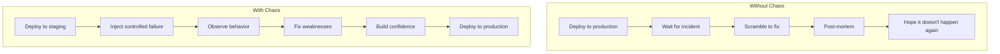
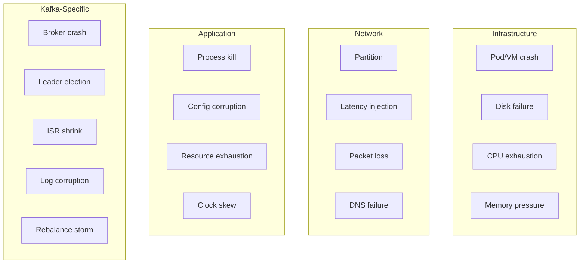
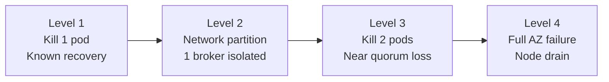
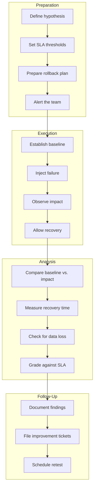
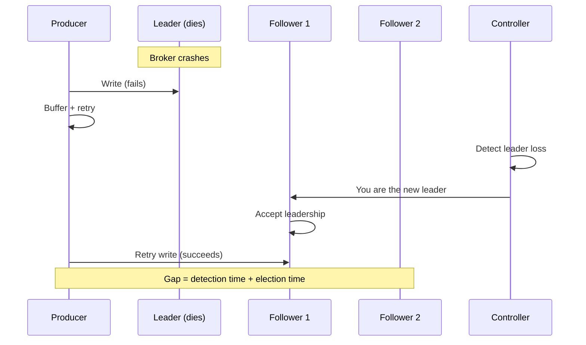
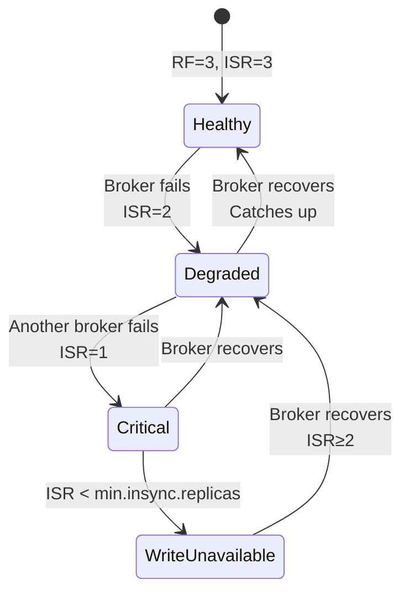
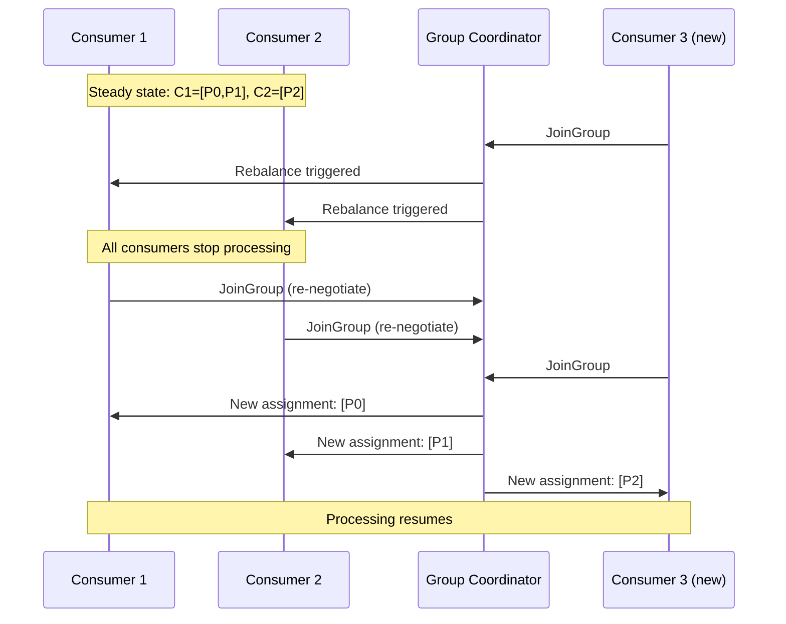

# Chapter 6: Chaos Engineering Theory

Chaos engineering is the discipline of experimenting on a distributed system to build confidence in its ability to withstand turbulent conditions in production. This chapter covers the theory — Chapter 7 covers how Kates implements it.

## Why Chaos Engineering?

Distributed systems fail in ways that are impossible to predict from reading code alone. A Kafka cluster might handle a single broker failure gracefully in theory, but in practice:

- The leader election might take 30 seconds instead of 3
- Consumer groups might rebalance in a thundering herd
- The surviving brokers might hit memory pressure from absorbing extra partitions
- Network timeouts might cascade into producer retries that amplify the problem

Chaos engineering replaces **hope** with **evidence**.



## Core Principles

### 1. Build a Hypothesis Around Steady State

Before injecting chaos, you must define what "normal" looks like. For Kafka, steady state includes:

- All partitions have leaders
- ISR count equals replication factor
- Producer throughput meets the target rate
- Consumer lag is bounded
- P99 latency is within SLA

### 2. Vary Real-World Events

Inject faults that actually happen in production:



### 3. Run Experiments in Production (or Production-Like)

Chaos experiments in a toy environment prove nothing. The Kind cluster in this project is configured to mirror production topology:

| Production Property | Kind Equivalent |
|---|---|
| Multi-AZ deployment | 3 nodes with zone labels |
| Rack-aware replication | Strimzi rack configuration |
| Resource constraints | Memory limits on brokers |
| Persistent storage | PVCs with zone-specific StorageClasses |
| Monitoring | Same Prometheus/Grafana stack |

### 4. Automate Experiments to Run Continuously

One-off chaos tests are useful; scheduled, repeating chaos tests are powerful. Kates supports cron-based scheduling:

```bash
# Run an integrity chaos test every night at 2 AM
kates schedule create --type INTEGRITY --records 100000 --cron "0 2 * * *"
```

### 5. Minimize Blast Radius

Start small and expand:



## The Game Day Methodology

A **Game Day** is a structured chaos engineering session. Here's the process:



### Example Hypothesis

> **Hypothesis:** "When we kill the leader broker for our main topic, producer latency will spike to no more than 500ms during leader election (which should complete within 10 seconds), and zero messages will be lost."

This hypothesis is testable, measurable, and has clear pass/fail criteria.

## Kafka-Specific Failure Modes

Kafka has unique failure characteristics that general-purpose chaos tools don't understand:

### Leader Election

When a partition's leader broker dies, Kafka must elect a new leader from the ISR:



Key timing:

| Phase | Typical Duration | Depends On |
|-------|:---:|---|
| Failure detection | 5–15s | `session.timeout.ms`, health check interval |
| Leader election | \< 1s | Number of partitions, controller load |
| Client reconnection | 1–5s | `metadata.max.age.ms`, retry backoff |
| **Total unavailability** | **6–20s** | Sum of all phases |

### ISR Shrink and Expand

When a follower falls behind (or a broker recovers), the ISR changes:



### Consumer Group Rebalance

When a consumer dies or a new one joins, Kafka rebalances partition assignments:



During rebalancing, **all consumers in the group stop processing**. This "stop-the-world" pause can last seconds to minutes depending on group size and partition count.

## Key Metrics During Chaos

| Metric | What to Watch |
|--------|---------------|
| **Under-replicated partitions** | Should spike briefly, then return to 0 |
| **Offline partitions** | Should be 0 (if RF > failed brokers) |
| **Active controller changes** | Should happen exactly once per controller failure |
| **Consumer lag** | Should spike during failure, then drain |
| **Producer error rate** | Should spike briefly, producers should retry successfully |
| **Leader election rate** | Should equal the number of partitions on the failed broker |
| **Recovery time** | Time from failure to all ISRs fully expanded |

These metrics form the foundation of SLA grading in Kates disruption tests.
