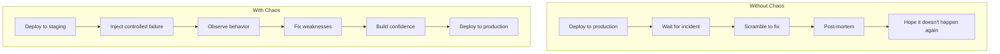
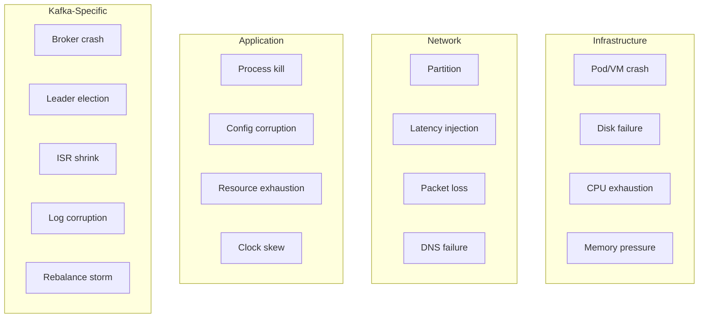
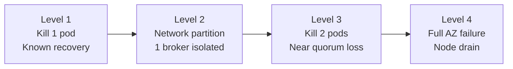
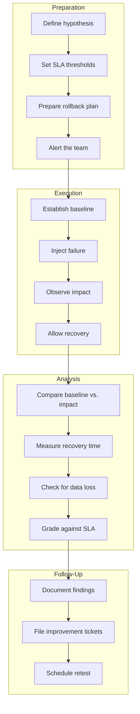
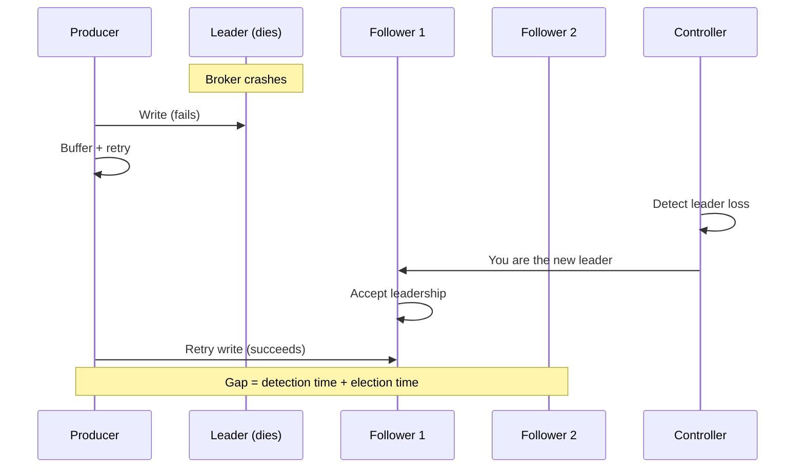
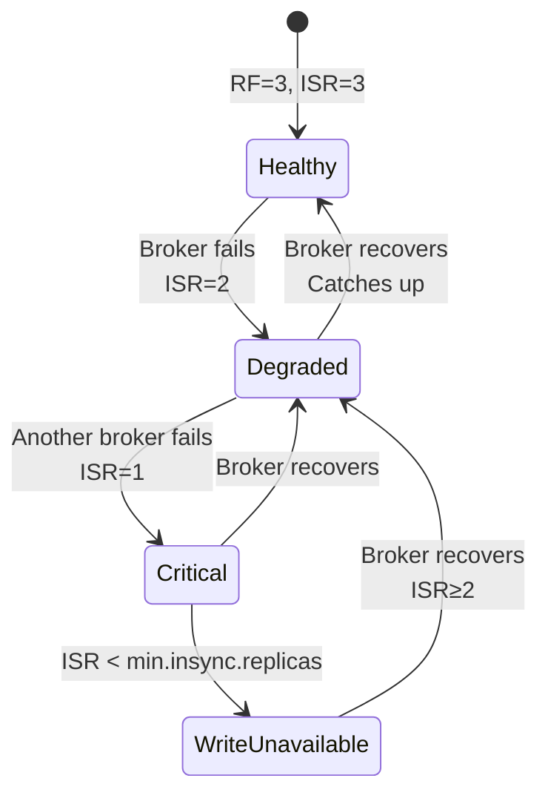
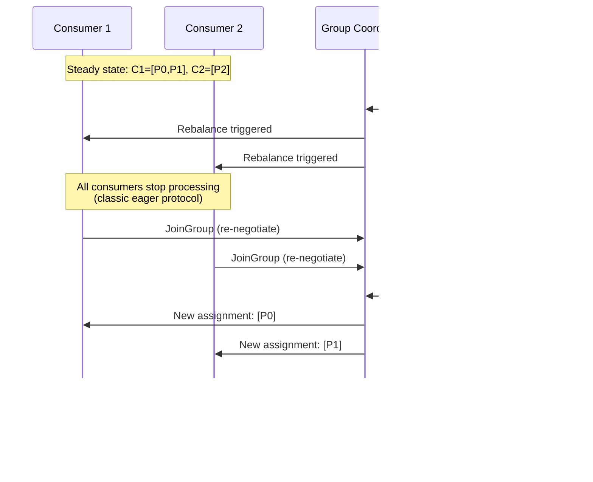
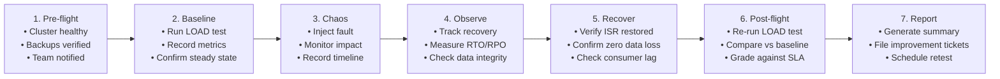

# Chaos Engineering Theory

Chaos engineering is the discipline of experimenting on a distributed system to build confidence in its ability to withstand turbulent conditions in production. This chapter covers the theory — [Chaos Engineering in Practice](07-chaos-practice.md) covers how Kates implements it.

You don't need prior chaos tooling experience — just a working knowledge of Kafka's replication model. After this chapter, you can:

- State a steady-state hypothesis with measurable pass/fail criteria
- Predict how Kafka behaves during leader election, ISR shrink, and consumer group rebalance
- Structure a Game Day from hypothesis through follow-up
- Choose between LitmusChaos, Trogdor, and manual kubectl for a fault injection experiment

## Why Chaos Engineering?

Distributed systems fail in ways that are impossible to predict from reading code alone. A Kafka cluster might handle a single broker failure gracefully in theory, but in practice:

- The leader election might take 30 seconds instead of 3
- Consumer groups might rebalance in a thundering herd
- The surviving brokers might hit memory pressure from absorbing extra partitions
- Network timeouts might cascade into producer retries that amplify the problem

Chaos engineering replaces **hope** with **evidence**.


```mermaid
graph TD
    subgraph Without Chaos
        A[Deploy to production] --> B[Wait for incident]
        B --> C[Scramble to fix]
        C --> D[Post-mortem]
        D --> E[Hope it doesn't happen again]
    end
    
    subgraph With Chaos
        F[Deploy to staging] --> G[Inject controlled failure]
        G --> H[Observe behavior]
        H --> I[Fix weaknesses]
        I --> J[Build confidence]
        J --> K[Deploy to production]
    end
```

## Core Principles

### 1. Build a Hypothesis Around Steady State

Before injecting chaos, you must define what "normal" looks like. For Kafka, steady state includes:

- All partitions have leaders
- ISR count equals replication factor
- Producer throughput meets the target rate
- Consumer lag is bounded
- P99 latency is within SLA

### 2. Vary Real-World Events

Inject faults that actually happen in production:


```mermaid
graph TB
    subgraph Infrastructure
        IF1[Pod/VM crash]
        IF2[Disk failure]
        IF3[CPU exhaustion]
        IF4[Memory pressure]
    end
    
    subgraph Network
        NF1[Partition]
        NF2[Latency injection]
        NF3[Packet loss]
        NF4[DNS failure]
    end
    
    subgraph Application
        AF1[Process kill]
        AF2[Config corruption]
        AF3[Resource exhaustion]
        AF4[Clock skew]
    end
    
    subgraph Kafka-Specific
        KF1[Broker crash]
        KF2[Leader election]
        KF3[ISR shrink]
        KF4[Log corruption]
        KF5[Rebalance storm]
    end
```

### 3. Run Experiments in Production (or Production-Like)

Chaos experiments in a toy environment prove nothing. The Kind cluster in this project is configured to mirror production topology:

| Production Property | Kind Equivalent |
|---|---|
| Multi-AZ deployment | 3 nodes with zone labels |
| Rack-aware replication | Strimzi rack configuration |
| Resource constraints | Memory limits on brokers |
| Persistent storage | PVCs with zone-specific StorageClasses |
| Monitoring | Same Prometheus/Grafana stack |

### 4. Automate Experiments to Run Continuously

One-off chaos tests are useful; scheduled, repeating chaos tests are powerful. Kates supports cron-based scheduling:

```bash
# Run an integrity test every night at 2 AM
# (integrity.json holds the test request, e.g. {"type": "INTEGRITY", "spec": {"numRecords": 100000}})
kates schedule create --name "Nightly Integrity" --cron "0 2 * * *" --request integrity.json
```

### 5. Minimize Blast Radius

Start small and expand:


```mermaid
graph LR
    L1["Level 1<br/>Kill 1 pod<br/>Known recovery"] --> L2["Level 2<br/>Network partition<br/>1 broker isolated"] --> L3["Level 3<br/>Kill 2 pods<br/>Near quorum loss"] --> L4["Level 4<br/>Full AZ failure<br/>Node drain"]
```

## The Game Day Methodology

A **Game Day** is a structured chaos engineering session. Here's the process:


```mermaid
graph TD
    subgraph Preparation
        P1[Define hypothesis]
        P2[Set SLA thresholds]
        P3[Prepare rollback plan]
        P4[Alert the team]
    end
    
    subgraph Execution
        E1[Establish baseline]
        E2[Inject failure]
        E3[Observe impact]
        E4[Allow recovery]
    end
    
    subgraph Analysis
        A1[Compare baseline vs. impact]
        A2[Measure recovery time]
        A3[Check for data loss]
        A4[Grade against SLA]
    end
    
    subgraph Follow-Up
        F1[Document findings]
        F2[File improvement tickets]
        F3[Schedule retest]
    end
    
    P1 --> P2 --> P3 --> P4
    P4 --> E1 --> E2 --> E3 --> E4
    E4 --> A1 --> A2 --> A3 --> A4
    A4 --> F1 --> F2 --> F3
```

### Example Hypothesis

> **Hypothesis:** "When we kill the leader broker for our main topic, producer latency will spike to no more than 500ms during leader election (which should complete within 10 seconds), and zero messages will be lost."

This hypothesis is testable, measurable, and has clear pass/fail criteria.

## Kafka-Specific Failure Modes

Kafka has unique failure characteristics that general-purpose chaos tools don't understand:

### Leader Election

When a partition's leader broker dies, Kafka must elect a new leader from the ISR:


```mermaid
sequenceDiagram
    participant P as Producer
    participant L as Leader (dies)
    participant F1 as Follower 1
    participant F2 as Follower 2
    participant Ctrl as Controller
    
    Note over L: Broker crashes
    P->>L: Write (fails)
    P->>P: Buffer + retry
    Ctrl->>Ctrl: Detect leader loss
    Ctrl->>F1: You are the new leader
    F1->>F1: Accept leadership
    P->>F1: Retry write (succeeds)
    
    Note over P,F2: Gap = detection time + election time
```

Key timing (with default broker and client configs):

| Phase | Typical Duration | Depends On |
|-------|:---:|---|
| Failure detection | 5–15s | `session.timeout.ms`, health check interval |
| Leader election | \< 1s | Number of partitions, controller load |
| Client reconnection | 1–5s | `metadata.max.age.ms`, retry backoff |
| **Total unavailability** | **6–20s** | Sum of all phases |

### ISR Shrink and Expand

When a follower falls behind (or a broker recovers), the ISR changes:


```mermaid
stateDiagram-v2
    [*] --> Healthy: RF=3, ISR=3
    Healthy --> Degraded: Broker fails<br/>ISR=2
    Degraded --> Healthy: Broker recovers<br/>Catches up
    Degraded --> Critical: Another broker fails<br/>ISR=1
    Critical --> WriteUnavailable: ISR < min.insync.replicas
    Critical --> Degraded: Broker recovers
    WriteUnavailable --> Degraded: Broker recovers<br/>ISR≥2
```

### Consumer Group Rebalance

When a consumer dies or a new one joins, Kafka rebalances partition assignments:


```mermaid
sequenceDiagram
    participant C1 as Consumer 1
    participant C2 as Consumer 2
    participant Coord as Group Coordinator
    participant C3 as Consumer 3 (new)
    
    Note over C1,C2: Steady state: C1=[P0,P1], C2=[P2]
    C3->>Coord: JoinGroup
    Coord->>C1: Rebalance triggered
    Coord->>C2: Rebalance triggered
    Note over C1,C2: All consumers stop processing<br/>(classic eager protocol)
    C1->>Coord: JoinGroup (re-negotiate)
    C2->>Coord: JoinGroup (re-negotiate)
    C3->>Coord: JoinGroup
    Coord->>C1: New assignment: [P0]
    Coord->>C2: New assignment: [P1]
    Coord->>C3: New assignment: [P2]
    Note over C1,C3: Processing resumes
```

The diagram shows the classic **eager** protocol, where all consumers in the group stop processing during a rebalance — a "stop-the-world" pause that can last seconds to minutes depending on group size and partition count. Cooperative incremental rebalancing (KIP-429) shrinks the pause to only the partitions that actually move, and the next-generation consumer group protocol (KIP-848, `group.protocol=consumer`) removes the global synchronization barrier entirely. Kates test workloads can exercise either protocol via the per-test-type `group-protocol` setting (default: `classic`).

## Key Metrics During Chaos

| Metric | What to Watch |
|--------|---------------|
| **Under-replicated partitions** | Should spike briefly, then return to 0 |
| **Offline partitions** | Should be 0 (if RF > failed brokers) |
| **Active controller changes** | Should happen exactly once per controller failure |
| **Consumer lag** | Should spike during failure, then drain |
| **Producer error rate** | Should spike briefly, producers should retry successfully |
| **Leader election rate** | Should equal the number of partitions on the failed broker |
| **Recovery time** | Time from failure to all ISRs fully expanded |

These metrics form the foundation of SLA grading in Kates disruption tests.

## Game Day Pipeline

A fully automated Game Day follows a 7-phase pipeline. Each phase has a clear entry gate and exit criteria:


```mermaid
flowchart LR
    P["1. Pre-flight\n• Cluster healthy\n• Backups verified\n• Team notified"] --> B["2. Baseline\n• Run LOAD test\n• Record metrics\n• Confirm steady state"]
    B --> C["3. Chaos\n• Inject fault\n• Monitor impact\n• Record timeline"]
    C --> O["4. Observe\n• Track recovery\n• Measure RTO/RPO\n• Check data integrity"]
    O --> R["5. Recover\n• Verify ISR restored\n• Confirm zero data loss\n• Check consumer lag"]
    R --> PF["6. Post-flight\n• Re-run LOAD test\n• Compare vs baseline\n• Grade against SLA"]
    PF --> RE["7. Report\n• Generate summary\n• File improvement tickets\n• Schedule retest"]
```

The `make gameday` command automates this entire pipeline. Each phase is logged with timestamps and can be reviewed after completion:

```bash
# Run the full 7-phase pipeline
make gameday
```

## Fault Injection Approaches

Kates supports multiple fault injection backends. Choose based on your environment and needs:

| Feature | LitmusChaos | Trogdor | Manual kubectl |
|---------|:-----------:|:-------:|:--------------:|
| **Scope** | General-purpose Kubernetes chaos | Kafka-specific fault injection | Ad-hoc pod/network operations |
| **Installation** | Helm chart + CRDs | Bundled with Apache Kafka | None (built into Kubernetes) |
| **Kafka awareness** | Low — operates at pod/network level | High — understands partitions, brokers, topics | None |
| **Experiment types** | Pod kill, network chaos, CPU/memory stress, disk fill | Broker bounce, network degrade, produce/consume workloads | Pod delete, node drain, network policy changes |
| **Scheduling** | CronWorkflows via Argo or native ChaosSchedule | Trogdor coordinator API | Cron jobs or CI/CD triggers |
| **Observability** | ChaosResult CRDs + Prometheus metrics | Trogdor status API | Manual log inspection |
| **Blast radius control** | Annotations, labels, namespace selectors | Agent-level targeting | Manual — requires discipline |
| **Reproducibility** | Declarative YAML ChaosExperiments | Declarative JSON task specs | Script-dependent |
| **Best for** | Production chaos with safety guardrails | Kafka-internal workload simulation | Quick smoke tests, debugging |
| **Kates integration** | Native — `kates disruption run` uses LitmusChaos | Optional — selectable test workload backend (`backend: trogdor` in the test request) | Manual — run alongside Kates tests |

::: {.callout-tip}
For most Kates users, **LitmusChaos** is the recommended default. It provides the best balance of safety, observability, and Kubernetes-native integration. Use Trogdor when you need Kafka-internal fault injection (e.g., simulating slow brokers at the protocol level), and manual kubectl for quick one-off debugging sessions.
:::

::: {.callout-tip}
**Try it**

Write a steady-state hypothesis for the `krafter` Kafka cluster — bounded latency, zero offline partitions, ISR equal to the replication factor — then check each claim against live data:

```bash
# Baseline probe: under-replicated and offline partition counts
kates cluster check

# Confirm the topology your hypothesis assumes (brokers per zone)
kates cluster topology

# List the faults you could inject against it
kates disruption types
```

Expect `kates cluster check` to report zero under-replicated and zero offline partitions — that is your steady state; anything else is a finding before you've injected a single fault.
:::

## Summary

- Chaos engineering replaces hope with evidence: hypothesize steady state, inject real-world faults, and measure the gap between prediction and behavior.
- A useful hypothesis is testable and measurable — bounded latency spike, bounded recovery time, zero message loss — with explicit pass/fail criteria.
- Kafka fails in specific ways: leader election costs seconds of partition unavailability, ISR shrink erodes durability before availability, and eager rebalances stop the entire consumer group.
- Minimize blast radius — start with a single pod kill and a known recovery path, and escalate only after each level passes.
- The Game Day pipeline — pre-flight, baseline, chaos, observe, recover, post-flight, report — automates the full methodology via `make gameday`.
- LitmusChaos is the default fault injection backend; reach for Trogdor when the fault must live inside Kafka's protocol, and manual kubectl for quick smoke tests.

[Chaos Engineering in Practice](07-chaos-practice.md) turns these principles into runnable disruption tests — playbooks, safety guardrails, and SLA grading included.
