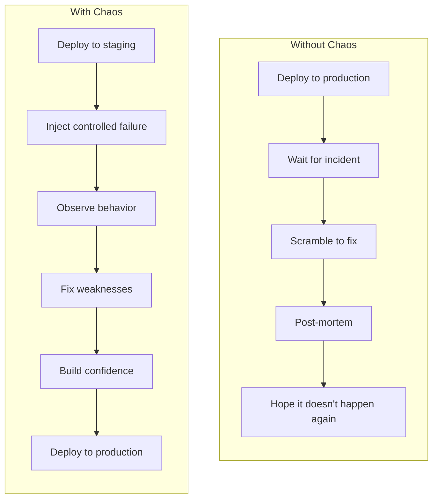
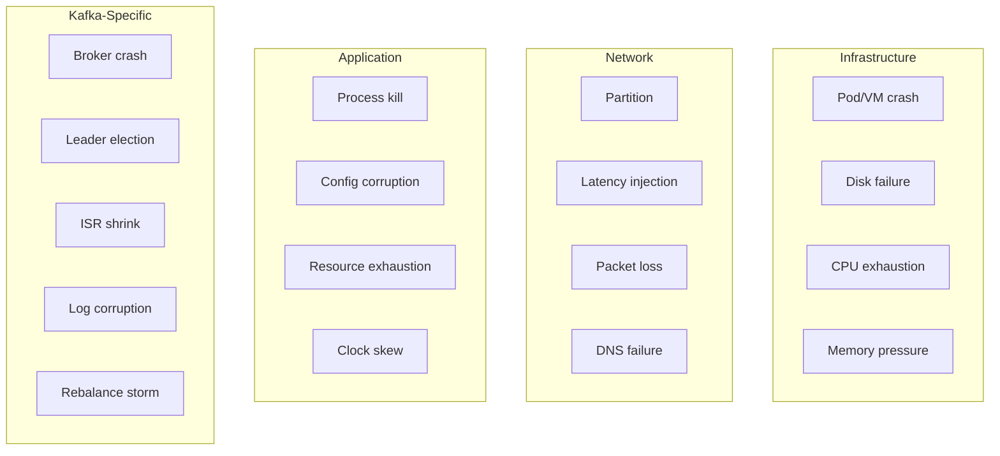
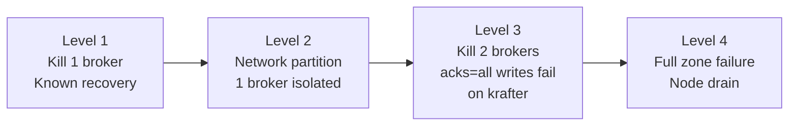
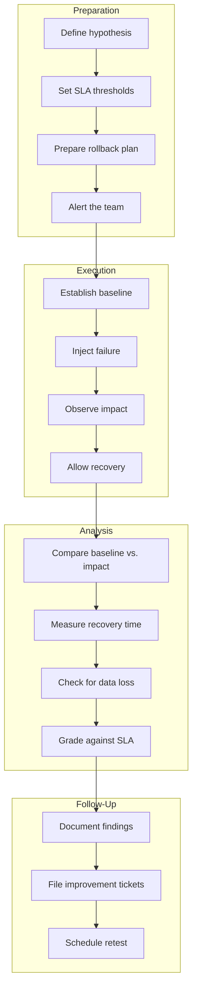
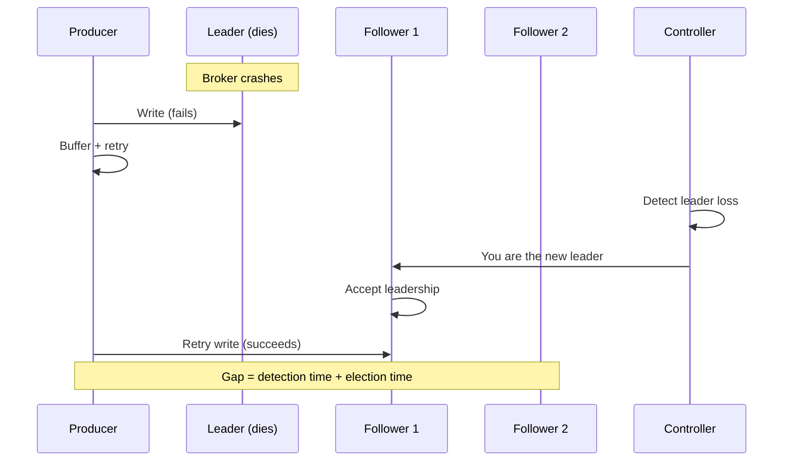
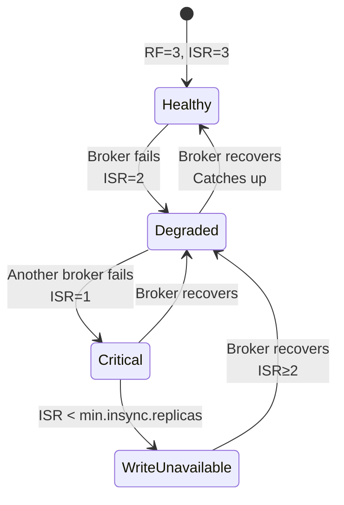
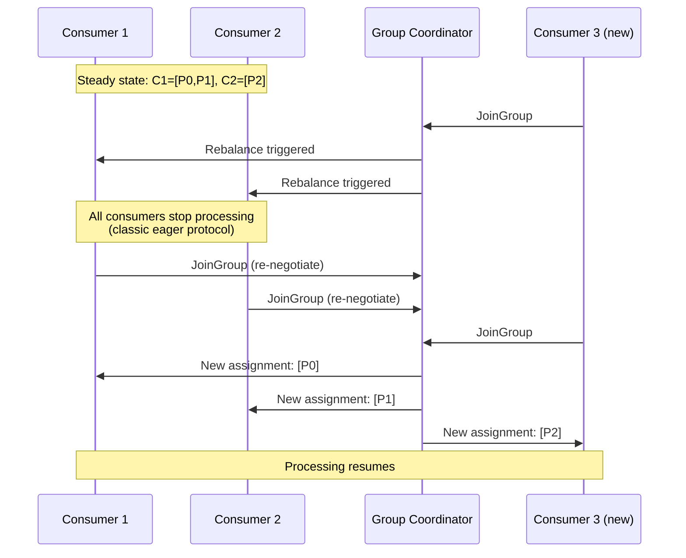
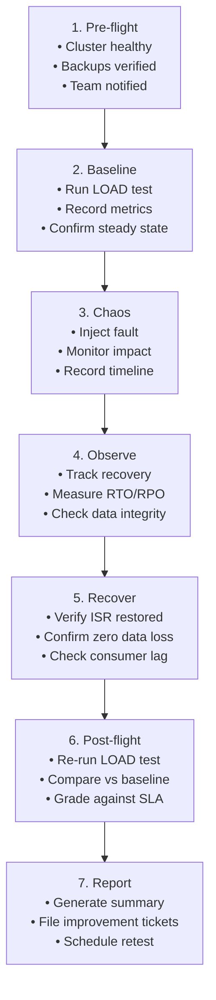

# Chaos Engineering Theory

Chaos engineering is the discipline of experimenting on a distributed system to build confidence in its ability to withstand turbulent conditions in production. This chapter covers the theory — [Chaos Engineering in Practice](07-chaos-practice.md) covers how Kates implements it.

You don't need prior chaos tooling experience — just a working knowledge of Kafka's replication model. After this chapter, you can:

- State a [steady-state hypothesis](appendix-a-glossary.md#gl-steady-state-hypothesis) with measurable pass/fail criteria
- Predict how Kafka behaves during leader election, [ISR shrink](appendix-a-glossary.md#gl-isr-shrink), and [consumer group](appendix-a-glossary.md#gl-consumer-group) rebalance
- Structure a [Game Day](appendix-a-glossary.md#gl-game-day) from hypothesis through follow-up
- Say where Kates's [faults](appendix-a-glossary.md#gl-fault) come from, and tell a disruption plan from a [resilience run](appendix-a-glossary.md#gl-resilience-run)

## Why Chaos Engineering?

Distributed systems fail in ways that are impossible to predict from reading code alone. A Kafka cluster might handle a single [broker](appendix-a-glossary.md#gl-broker) failure gracefully in theory, but in practice:

- The [leader election](appendix-a-glossary.md#gl-leader-election) might take 30 seconds instead of 3
- Consumer groups might [rebalance](appendix-a-glossary.md#gl-rebalance) in a thundering herd
- The surviving brokers might hit memory pressure from absorbing extra [partitions](appendix-a-glossary.md#gl-partition)
- Network timeouts might cascade into producer retries that amplify the problem

Chaos engineering replaces **hope** with **evidence**.


```mermaid
graph TD
    subgraph Without Chaos
        direction TB
        A[Deploy to production] --> B[Wait for incident]
        B --> C[Scramble to fix]
        C --> D[Post-mortem]
        D --> E[Hope it doesn't happen again]
    end
    
    subgraph With Chaos
        direction TB
        F[Deploy to staging] --> G[Inject controlled failure]
        G --> H[Observe behavior]
        H --> I[Fix weaknesses]
        I --> J[Build confidence]
        J --> K[Deploy to production]
    end
```

## Core Principles

The five principles below come from the [Principles of Chaos Engineering](https://principlesofchaos.org). Each section restates one of them for a Kafka cluster.

### 1. Build a Hypothesis Around Steady State

Before injecting chaos, you must define what "normal" looks like. For Kafka, steady state includes:

- All partitions have [leaders](appendix-a-glossary.md#gl-partition-leader)
- [ISR](appendix-a-glossary.md#gl-isr) count equals [replication factor](appendix-a-glossary.md#gl-rf)
- Producer [throughput](appendix-a-glossary.md#gl-throughput) meets the target rate
- [Consumer lag](appendix-a-glossary.md#gl-consumer-lag) is bounded
- [P99](appendix-a-glossary.md#gl-percentile) latency is within [SLA](appendix-a-glossary.md#gl-sla)

### 2. Vary Real-World Events

Inject faults that actually happen in production:


```mermaid
graph TB
    subgraph Infrastructure
        IF1[Pod/VM crash]
        IF2[Disk failure]
        IF3[CPU exhaustion]
        IF4[Memory pressure]
    end
    
    subgraph Network
        NF1[Partition]
        NF2[Latency injection]
        NF3[Packet loss]
        NF4[DNS failure]
    end
    
    subgraph Application
        AF1[Process kill]
        AF2[Config corruption]
        AF3[Resource exhaustion]
        AF4[Clock skew]
    end
    
    subgraph Kafka-Specific
        KF1[Broker crash]
        KF2[Leader election]
        KF3[ISR shrink]
        KF4[Log corruption]
        KF5[Rebalance storm]
    end
```

Kates has no [disruption type](appendix-a-glossary.md#gl-disruption-type) for disk failure, packet loss, configuration or log corruption, or clock skew; `kates disruption types` lists the ones it has.

### 3. Run Experiments in Production (or Production-Like)

[Chaos experiments](appendix-a-glossary.md#gl-chaos-experiment) in a toy environment prove nothing. [`panda`](appendix-a-glossary.md#gl-panda), the [Kind](appendix-a-glossary.md#gl-kind) cluster in this project, is configured to mirror a production node layout:

| Production Property | Kind Equivalent |
|---|---|
| Multi-zone deployment | 3 nodes with [zone](appendix-a-glossary.md#gl-zone) labels |
| Zone-aware replication | [Strimzi](appendix-a-glossary.md#gl-strimzi) `rack` configuration |
| Resource constraints | Memory limits on brokers |
| Persistent storage | [PVCs](appendix-a-glossary.md#gl-pvc) with zone-specific StorageClasses |
| Monitoring | Same [Prometheus](appendix-a-glossary.md#gl-prometheus)/[Grafana](appendix-a-glossary.md#gl-grafana) stack |

### 4. Automate Experiments to Run Continuously

One-off chaos experiments are useful; scheduled, repeating ones show when a change makes the cluster worse. Kates supports cron-based scheduling: `kates disruption schedule create` repeats a [playbook](appendix-a-glossary.md#gl-playbook), and `kates schedule create` repeats a test, such as a nightly [INTEGRITY](appendix-a-glossary.md#gl-test-type) run:

```bash
# Run an integrity test every night at 2 AM
# (integrity.json holds the test request, e.g. {"type": "INTEGRITY", "spec": {"numRecords": 100000}})
kates schedule create --name "Nightly Integrity" --cron "0 2 * * *" --request integrity.json
```

### 5. Minimize Blast Radius

Start small and expand:


```mermaid
%%| label: fig-chaos-escalation
%%| fig-cap: "Escalate one rung at a time: from one broker with a known recovery, to two brokers, to a whole zone."
%%| fig-alt: "Four levels left to right. Level 1: kill 1 broker, with a known recovery. Level 2: a network partition that isolates 1 broker. Level 3: kill 2 brokers, where acks=all writes fail on the krafter Kafka cluster, whose min.insync.replicas is 2. Level 4: a full zone failure, by node drain."
graph LR
    L1["Level 1<br/>Kill 1 broker<br/>Known recovery"] --> L2["Level 2<br/>Network partition<br/>1 broker isolated"] --> L3["Level 3<br/>Kill 2 brokers<br/>acks=all writes fail<br/>on krafter"] --> L4["Level 4<br/>Full zone failure<br/>Node drain"]
```

In a Kates [disruption plan](appendix-a-glossary.md#gl-disruption-plan), each rung is a `maxAffectedBrokers` value: `1` for the first two, `2` for the third, and the zone's broker count for the last. The `az-failure` playbook caps that last value at `3` when it kills the zone's pods. The [safety guard](appendix-a-glossary.md#gl-safety-guard) refuses a plan that would hit more brokers than that, or every broker: see [Chaos Engineering in Practice](07-chaos-practice.md#safety-guardrails).

## The Game Day Methodology

A **Game Day** is a structured chaos engineering session. Here's the process:


```mermaid
graph TD
    subgraph Preparation
        P1[Define hypothesis]
        P2[Set SLA thresholds]
        P3[Prepare rollback plan]
        P4[Alert the team]
    end
    
    subgraph Execution
        E1[Establish baseline]
        E2[Inject failure]
        E3[Observe impact]
        E4[Allow recovery]
    end
    
    subgraph Analysis
        A1[Compare baseline vs. impact]
        A2[Measure recovery time]
        A3[Check for data loss]
        A4[Grade against SLA]
    end
    
    subgraph Follow-Up
        F1[Document findings]
        F2[File improvement tickets]
        F3[Schedule retest]
    end
    
    P1 --> P2 --> P3 --> P4
    P4 --> E1 --> E2 --> E3 --> E4
    E4 --> A1 --> A2 --> A3 --> A4
    A4 --> F1 --> F2 --> F3
```

### Example Hypothesis

> **Hypothesis:** "When we kill the leader broker for our main [topic](appendix-a-glossary.md#gl-topic), producer latency will spike to no more than 500ms during leader election (which should complete within 10 seconds), and zero messages will be lost."

This hypothesis is testable, measurable, and has clear pass/fail criteria.

## Kafka-Specific Failure Modes

Kafka has unique failure characteristics that general-purpose chaos tools don't understand:

### Leader Election

When a partition's leader broker dies, Kafka must elect a new leader from the ISR:


```mermaid
%%| label: fig-chaos-leader-election
%%| fig-cap: "When a partition's leader dies, the producer buffers and retries while the controller promotes a follower; the gap it sees is detection time plus election time."
%%| fig-alt: "Sequence diagram with a producer, the leader that dies, two followers and the controller. The leader broker crashes and the producer's write to it fails, so the producer buffers and retries. The controller detects the leader loss and tells follower 1 it is the new leader, and follower 1 accepts. The producer's retried write to follower 1 succeeds. A note marks the gap as detection time plus election time."
sequenceDiagram
    participant P as Producer
    participant L as Leader (dies)
    participant F1 as Follower 1
    participant F2 as Follower 2
    participant Ctrl as Controller
    
    Note over L: Broker crashes
    P->>L: Write (fails)
    P->>P: Buffer + retry
    Ctrl->>Ctrl: Detect leader loss
    Ctrl->>F1: You are the new leader
    F1->>F1: Accept leadership
    P->>F1: Retry write (succeeds)
    
    Note over P,F2: Gap = detection time + election time
```

Key timing (with default broker and client configs):

| Phase | Typical Duration | Depends On |
|-------|:---:|---|
| Failure detection | 5–15s | `session.timeout.ms`, health check interval |
| Leader election | \< 1s | Number of partitions, [controller](appendix-a-glossary.md#gl-controller) load |
| Client reconnection | 1–5s | `metadata.max.age.ms`, retry backoff |
| **Total unavailability** | **6–20s** | Sum of all phases |

### ISR Shrink and Expand

When a follower falls behind (or a broker recovers), the ISR changes:


```mermaid
stateDiagram-v2
    [*] --> Healthy: RF=3, ISR=3
    Healthy --> Degraded: Broker fails<br/>ISR=2
    Degraded --> Healthy: Broker recovers<br/>Catches up
    Degraded --> Critical: Another broker fails<br/>ISR=1
    Critical --> WriteUnavailable: ISR < min.insync.replicas
    Critical --> Degraded: Broker recovers
    WriteUnavailable --> Degraded: Broker recovers<br/>ISR≥2
```

### Consumer Group Rebalance

When a consumer dies or a new one joins, Kafka rebalances partition assignments:


```mermaid
%%| label: fig-chaos-eager-rebalance
%%| fig-cap: "An eager rebalance: one new member makes every consumer in the group stop, rejoin and take a new assignment before processing resumes."
%%| fig-alt: "Sequence diagram with consumers 1 and 2, the group coordinator and a new consumer 3. In steady state consumer 1 owns partitions 0 and 1 and consumer 2 owns partition 2. Consumer 3 sends JoinGroup, the coordinator triggers a rebalance on consumers 1 and 2, and all consumers stop processing. All three send JoinGroup, and the coordinator assigns partition 0 to consumer 1, partition 1 to consumer 2 and partition 2 to consumer 3. Processing resumes."
sequenceDiagram
    participant C1 as Consumer 1
    participant C2 as Consumer 2
    participant Coord as Group Coordinator
    participant C3 as Consumer 3 (new)
    
    Note over C1,C2: Steady state: C1=[P0,P1], C2=[P2]
    C3->>Coord: JoinGroup
    Coord->>C1: Rebalance triggered
    Coord->>C2: Rebalance triggered
    Note over C1,C2: All consumers stop processing<br/>(classic eager protocol)
    C1->>Coord: JoinGroup (re-negotiate)
    C2->>Coord: JoinGroup (re-negotiate)
    C3->>Coord: JoinGroup
    Coord->>C1: New assignment: [P0]
    Coord->>C2: New assignment: [P1]
    Coord->>C3: New assignment: [P2]
    Note over C1,C3: Processing resumes
```

The diagram shows the classic **eager** protocol, where all consumers in the group stop processing during a rebalance — a "stop-the-world" pause that can last seconds to minutes depending on group size and partition count. Cooperative incremental rebalancing (KIP-429) shrinks the pause to only the partitions that actually move, and the next-generation consumer group protocol (KIP-848, `group.protocol=consumer`) removes the global synchronization barrier entirely. Kates test workloads can exercise either protocol via the per-test-type `group-protocol` setting (default: `classic`).

## Key Metrics During Chaos

Watch these signals while a fault is active. For each one, the table says what a cluster that copes with the fault should show; for recovery time, it says what you measure.

| Metric | What to Watch |
|--------|---------------|
| **[Under-replicated partitions](appendix-a-glossary.md#gl-under-replicated-partition)** | Should spike briefly, then return to 0 |
| **Offline partitions** | Should be 0 (if RF > failed brokers) |
| **Active controller changes** | Should happen exactly once per controller failure |
| **Consumer lag** | Should spike during failure, then drain |
| **Producer error rate** | Should spike briefly, producers should retry successfully |
| **Leader election rate** | Should equal the number of partitions on the failed broker |
| **Recovery time** | Time from failure to all ISRs fully expanded |

A Kates [disruption](appendix-a-glossary.md#gl-disruption) reports several of them. `kates disruption kafka-metrics` shows each step's time to full ISR, minimum ISR depth and peak under-replicated partitions when the plan names a topic in `isrTrackingTopic`, and consumer lag when it names a group in `lagTrackingGroupId`. A plan's `sla` block can set targets for P99 latency, throughput and how long the Kafka pods take to be Ready again, and the plan's [SLA grade](appendix-a-glossary.md#gl-sla-grade) says how the run met them.

## Game Day Pipeline

A fully automated Game Day follows a 7-phase pipeline. Each phase has clear entry and exit criteria:


```mermaid
flowchart TB
    P["1. Pre-flight\n• Cluster healthy\n• Backups verified\n• Team notified"] --> B["2. Baseline\n• Run LOAD test\n• Record metrics\n• Confirm steady state"]
    B --> C["3. Chaos\n• Inject fault\n• Monitor impact\n• Record timeline"]
    C --> O["4. Observe\n• Track recovery\n• Measure RTO/RPO\n• Check data integrity"]
    O --> R["5. Recover\n• Verify ISR restored\n• Confirm zero data loss\n• Check consumer lag"]
    R --> PF["6. Post-flight\n• Re-run LOAD test\n• Compare vs baseline\n• Grade against SLA"]
    PF --> RE["7. Report\n• Generate summary\n• File improvement tickets\n• Schedule retest"]
```

The `make gameday` command automates this entire pipeline. Each phase is logged with timestamps and can be reviewed after completion:

```bash
# Run the full 7-phase pipeline
make gameday
```

## Fault Injection Approaches

In Kates, where a fault comes from is a deployment setting, not a choice you make per experiment. Every fault goes through one [chaos provider](appendix-a-glossary.md#gl-chaos-provider), a setting of the [Kates API](appendix-a-glossary.md#gl-kates-api): [LitmusChaos](appendix-a-glossary.md#gl-litmuschaos) by default, or the Kubernetes API directly, which needs nothing installed but runs fewer disruption types. What you do choose per experiment is how to run the fault. A disruption plan injects faults and watches the cluster from outside, while `kates resilience run` injects one fault under a Kates test and measures what a client sees. [Chaos Engineering in Practice](07-chaos-practice.md) compares the providers and the two ways to run a fault.

Two other tools sit near chaos but inject nothing through Kates. [Trogdor](appendix-a-glossary.md#gl-trogdor) is a [benchmark backend](appendix-a-glossary.md#gl-benchmark-backend) in Kates: it generates load, as [Test Types Deep Dive](05-test-types.md) explains, and never injects a fault. A pod you delete by hand with `kubectl` disrupts the cluster just the same, but Kates doesn't know it happened: no plan report lists it, and an INTEGRITY run it hits reports [RPO](appendix-a-glossary.md#gl-rpo) as not measured.

::: {.callout-tip}
**Try it**

Write a steady-state hypothesis for the [`krafter`](appendix-a-glossary.md#gl-krafter) Kafka cluster — bounded latency, zero offline partitions, ISR equal to the replication factor — then check each claim against live data:

```bash
# Baseline probe: under-replicated and offline partition counts
kates cluster check

# Confirm the topology your hypothesis assumes (brokers per zone)
kates cluster topology

# List the disruption types (your chaos provider may not run them all)
kates disruption types
```

Expect `kates cluster check` to report zero under-replicated and zero offline partitions — that is your steady state; anything else is a finding before you've injected a single fault.
:::

## Summary

- Chaos engineering replaces hope with evidence: hypothesize steady state, inject real-world faults, and measure the gap between prediction and behavior.
- A useful hypothesis is testable and measurable — bounded latency spike, bounded recovery time, zero message loss — with explicit pass/fail criteria.
- Kafka fails in specific ways: leader election costs seconds of partition unavailability, ISR shrink erodes durability before availability, and eager rebalances stop the entire consumer group.
- Minimize [blast radius](appendix-a-glossary.md#gl-blast-radius) — start with a single pod kill and a known recovery path, and escalate only after each level passes.
- The Game Day pipeline — pre-flight, [baseline](appendix-a-glossary.md#gl-baseline), chaos, observe, recover, post-flight, report — automates the full methodology via `make gameday`.
- Kates injects faults through one chaos provider, LitmusChaos by default; Trogdor generates load, and a manual `kubectl` fault leaves no Kates record.

[Chaos Engineering in Practice](07-chaos-practice.md) turns these principles into runnable disruption plans — playbooks, safety guardrails, and SLA grading included.
