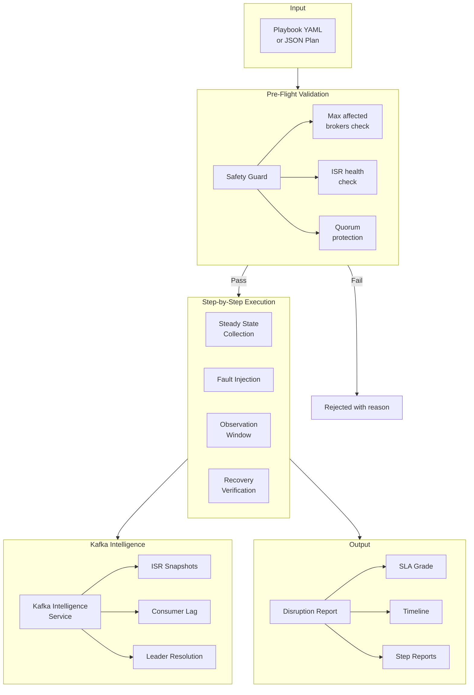
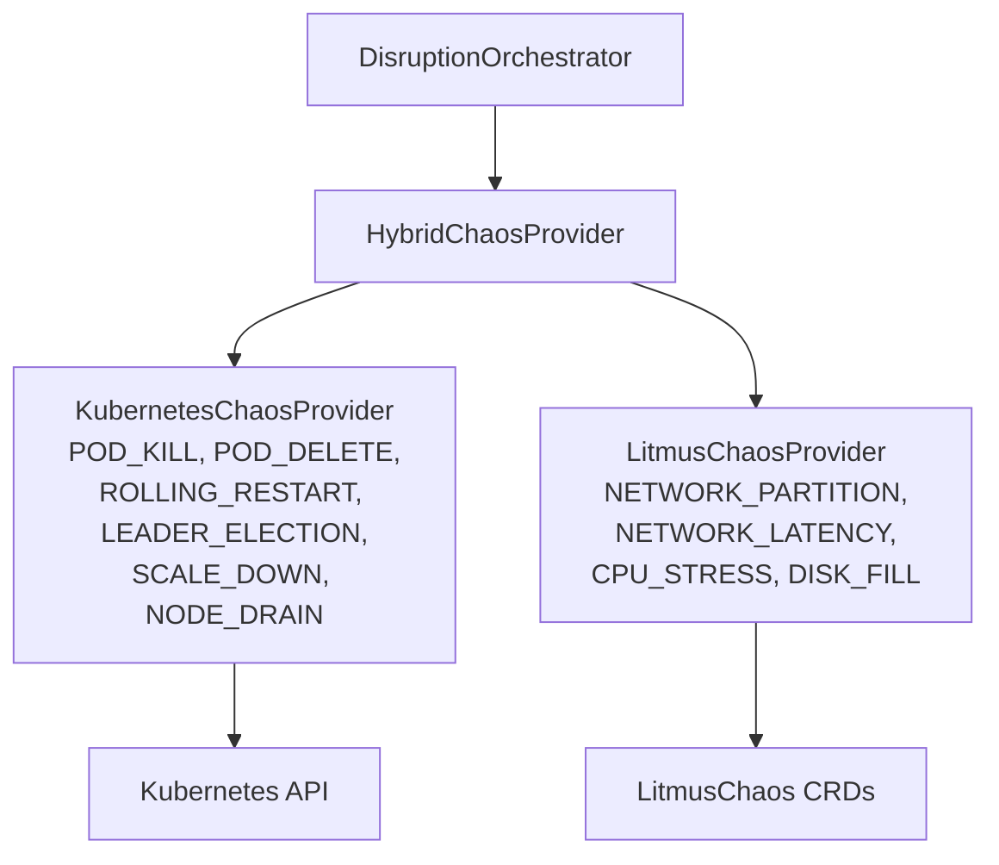
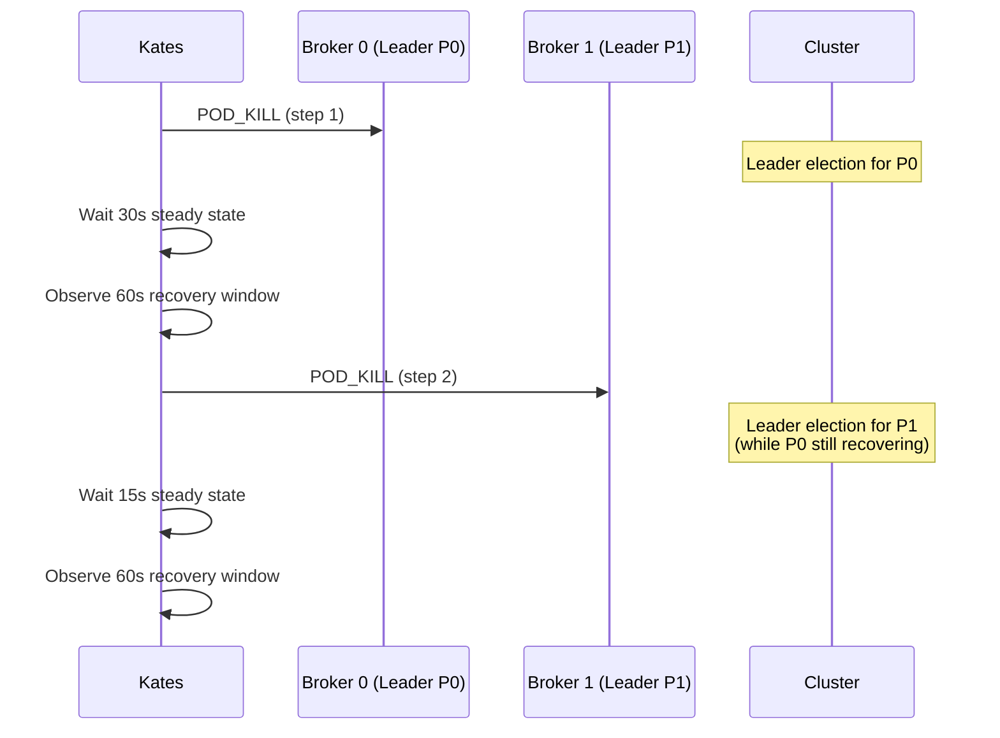
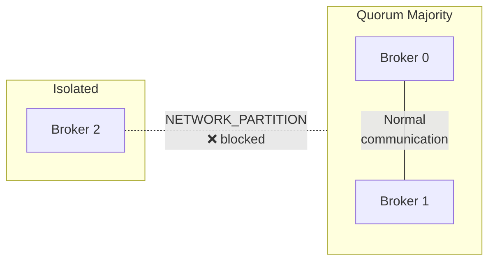
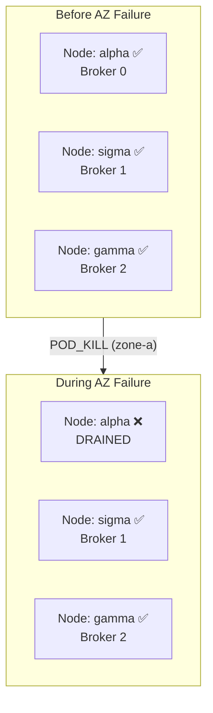
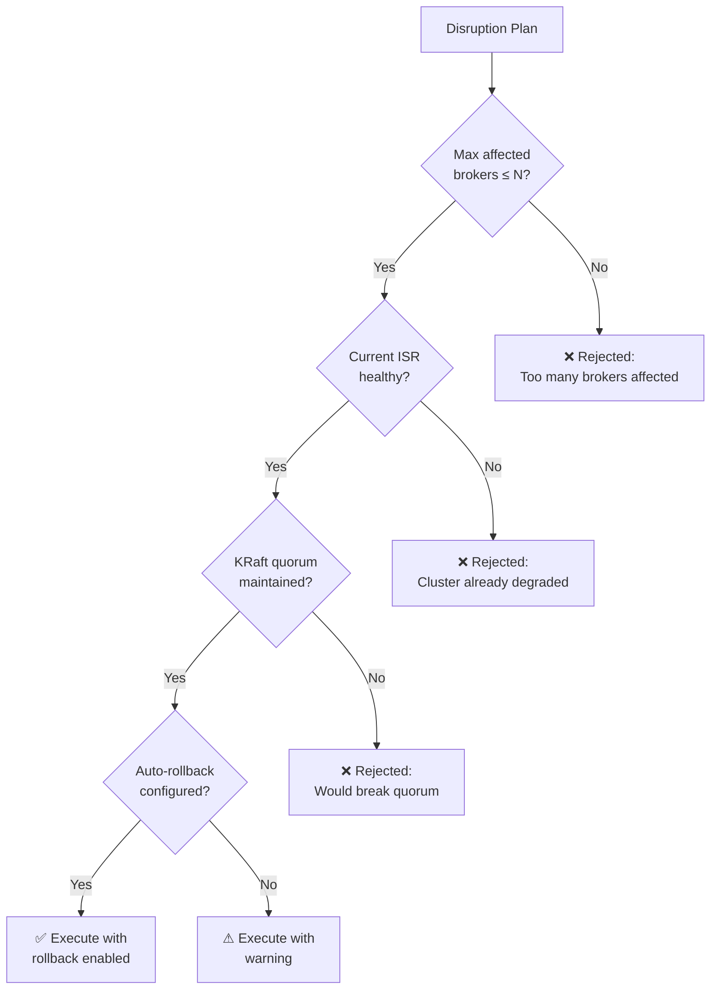
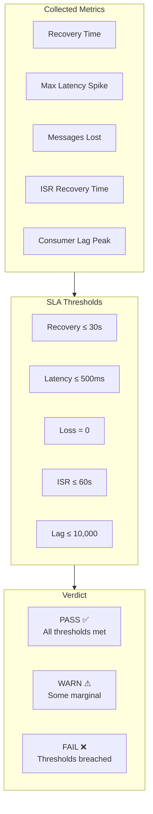
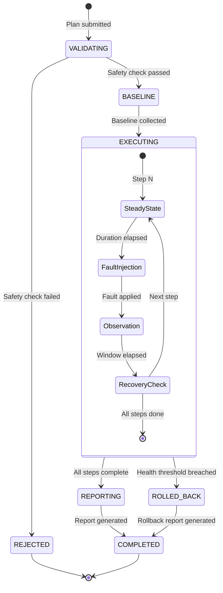

# Chapter 7: Chaos Engineering in Practice

This chapter covers how Kates implements chaos engineering: disruption types, playbooks, safety guardrails, SLA grading, and the full execution lifecycle.

## Disruption Architecture



## Disruption Types

Kates supports 10 disruption types across two implementation backends:

### Direct Kubernetes API

These disruptions use the Kubernetes API directly — no additional tooling required:

| Type | Implementation | Effect |
|------|---------------|--------|
| `POD_KILL` | `kubectl delete pod --grace-period=0` | Immediate broker termination, simulates SIGKILL |
| `POD_DELETE` | `kubectl delete pod` | Graceful shutdown, broker flushes and shuts down |
| `ROLLING_RESTART` | Sequential pod deletions with readiness checks | Simulates operator-managed rolling updates |
| `LEADER_ELECTION` | Kill the pod hosting the leader for a specific partition | Forces leader election for targeted partition |
| `SCALE_DOWN` | Modify Strimzi Kafka CR `replicas` field | Reduces broker count through the operator |
| `NODE_DRAIN` | `kubectl drain --delete-emptydir-data` | Evicts all pods from a node, simulates AZ failure |

### LitmusChaos Integration

These disruptions leverage LitmusChaos CRDs for more sophisticated fault injection:

| Type | Litmus Experiment | Effect |
|------|-------------------|--------|
| `NETWORK_PARTITION` | `pod-network-partition` | Isolates a broker from the cluster network |
| `NETWORK_LATENCY` | `pod-network-latency` | Adds configurable latency to broker traffic |
| `CPU_STRESS` | `pod-cpu-hog` | Saturates CPU on the broker pod |
| `DISK_FILL` | `disk-fill` | Fills the broker's PVC, triggering out-of-space errors |

### The Hybrid Provider



The `HybridChaosProvider` routes each disruption to the appropriate backend based on its type. This allows you to use simple Kubernetes-native operations where possible, and Litmus only where advanced network or resource injection is needed.

## Built-In Playbooks

Kates ships with 6 production-tested playbooks located in `kates/src/main/resources/playbooks/`. Each playbook is a YAML file that defines a complete disruption scenario with safety parameters, fault steps, and observation windows.

### leader-cascade

Kills partition leaders sequentially to test cascading election recovery. This is the most common chaos test — it validates that your cluster can handle back-to-back leader elections without data loss.



```yaml
name: leader-cascade
description: "Kill partition leaders sequentially to test cascading election recovery"
category: kafka
maxAffectedBrokers: 2
autoRollback: true
isrTrackingTopic: __consumer_offsets
steps:
  - name: kill-leader-partition-0
    faultSpec:
      experimentName: leader-cascade-p0
      disruptionType: POD_KILL
      targetTopic: __consumer_offsets
      targetPartition: 0
      chaosDurationSec: 10
      gracePeriodSec: 0
    steadyStateSec: 30
    observationWindowSec: 60
    requireRecovery: true
  - name: kill-leader-partition-1
    faultSpec:
      experimentName: leader-cascade-p1
      disruptionType: POD_KILL
      targetTopic: __consumer_offsets
      targetPartition: 1
      chaosDurationSec: 10
      gracePeriodSec: 0
    steadyStateSec: 15
    observationWindowSec: 60
    requireRecovery: true
```

### split-brain

Isolates a broker via network partition to test cluster consensus under split-brain conditions. Uses LitmusChaos `NETWORK_PARTITION` to completely block traffic between the targeted broker and all other cluster members.



```yaml
name: split-brain
description: "Network-partition the controller/leader broker from all followers"
category: network
maxAffectedBrokers: 1
autoRollback: true
steps:
  - name: isolate-controller
    faultSpec:
      experimentName: split-brain-partition
      disruptionType: NETWORK_PARTITION
      targetLabel: "strimzi.io/component-type=kafka"
      targetBrokerId: 0
      chaosDurationSec: 60
    steadyStateSec: 30
    observationWindowSec: 90
    requireRecovery: true
```

### az-failure

Simulates a full availability zone failure by killing all brokers in one rack. This is the most aggressive built-in playbook — it sets `maxAffectedBrokers: 3` because an entire AZ may host multiple brokers. Use this to validate your rack-aware replication strategy.



```yaml
name: az-failure
description: "Simulate availability zone failure by killing all brokers in one rack"
category: infrastructure
maxAffectedBrokers: 3
autoRollback: true
steps:
  - name: kill-rack-0-brokers
    faultSpec:
      experimentName: az-failure-rack-0
      disruptionType: POD_KILL
      targetLabel: "strimzi.io/component-type=kafka,topology.kubernetes.io/zone=zone-a"
      chaosDurationSec: 30
      gracePeriodSec: 0
    steadyStateSec: 30
    observationWindowSec: 120
    requireRecovery: true
```

### rolling-restart

Tests the Strimzi rolling update procedure — brokers restart one at a time with readiness gates. The `ROLLING_RESTART` disruption type orchestrates sequential pod deletions with a 30-second grace period, waiting for each broker to become ready before proceeding. Note that `autoRollback` is `false` because rolling restarts are expected to complete naturally.

```yaml
name: rolling-restart
description: "Trigger a graceful rolling restart of the Kafka StatefulSet"
category: operations
maxAffectedBrokers: 1
autoRollback: false
steps:
  - name: rolling-restart-brokers
    faultSpec:
      experimentName: rolling-restart-sts
      disruptionType: ROLLING_RESTART
      targetLabel: "strimzi.io/component-type=kafka"
      chaosDurationSec: 300
      gracePeriodSec: 30
    steadyStateSec: 30
    observationWindowSec: 180
    requireRecovery: true
```

### consumer-isolation

Isolates consumer pods from Kafka brokers via network partition to test consumer group rebalancing behavior. Note that `maxAffectedBrokers: -1` because this playbook targets consumers, not brokers — the `-1` disables the broker safety check.

```yaml
name: consumer-isolation
description: "Network-partition consumer pods from Kafka brokers to test consumer resilience"
category: network
maxAffectedBrokers: -1
autoRollback: true
steps:
  - name: partition-consumers
    faultSpec:
      experimentName: consumer-isolation-net
      disruptionType: NETWORK_PARTITION
      targetLabel: "app=kafka-consumer"
      targetNamespace: kates
      chaosDurationSec: 60
    steadyStateSec: 30
    observationWindowSec: 90
    requireRecovery: true
```

### storage-pressure

Fills broker disk to 90% to trigger log retention policies and observe behavior under storage pressure. Uses LitmusChaos `DISK_FILL` to gradually consume disk space on the targeted broker's PVC.

```yaml
name: storage-pressure
description: "Fill broker log directories to 90% to simulate storage exhaustion"
category: storage
maxAffectedBrokers: 1
autoRollback: true
steps:
  - name: fill-broker-disk
    faultSpec:
      experimentName: storage-pressure-fill
      disruptionType: DISK_FILL
      targetLabel: "strimzi.io/component-type=kafka"
      targetBrokerId: 0
      fillPercentage: 90
      chaosDurationSec: 120
    steadyStateSec: 30
    observationWindowSec: 120
    requireRecovery: true
```

### Playbook YAML Structure

All playbooks share this structure:

| Field | Type | Description |
|-------|------|-------------|
| `name` | String | Playbook identifier |
| `description` | String | Human-readable purpose |
| `category` | String | Classification: `kafka`, `network`, `infrastructure`, `operations`, `storage` |
| `maxAffectedBrokers` | Integer | Safety limit (-1 = no limit, used for non-broker targets) |
| `autoRollback` | Boolean | Whether to auto-restore on health degradation |
| `isrTrackingTopic` | String | Topic to monitor for ISR health (optional) |
| `steps` | List | Ordered list of fault injection steps |

Each step contains:

| Field | Type | Description |
|-------|------|-------------|
| `name` | String | Step identifier |
| `faultSpec` | Object | Fault injection configuration |
| `steadyStateSec` | Integer | Seconds of steady-state collection before fault |
| `observationWindowSec` | Integer | Seconds to observe after fault injection |
| `requireRecovery` | Boolean | Whether to wait for cluster recovery before next step |

## Safety Guardrails

The `DisruptionSafetyGuard` validates every plan before execution:



### Guardrail Parameters

| Parameter | Purpose | Default |
|-----------|---------|---------|
| `maxAffectedBrokers` | Maximum brokers to disrupt simultaneously | 1 |
| `autoRollback` | Automatically restore if health deteriorates | true |
| `isrTrackingTopic` | Topic to monitor for ISR health | `__consumer_offsets` |
| `requireRecovery` | Wait for cluster recovery between steps | true |

## Kafka Intelligence

The `KafkaIntelligenceService` provides Kafka-aware targeting and monitoring:

### Leader Resolution

Instead of targeting arbitrary pods, Kates can target the **leader broker for a specific partition**:

```yaml
steps:
  - name: kill-leader
    faultSpec:
      disruptionType: POD_KILL
      targetTopic: __consumer_offsets
      targetPartition: 0
      # Kates resolves which broker hosts the leader
```

The intelligence service queries Kafka metadata to resolve which broker currently leads the target partition, then directs the disruption at that specific pod.

### ISR Tracking

During execution, Kates captures ISR snapshots:

```bash
# View ISR tracking data
kates disruption kafka-metrics <id>
```

Output includes:

- ISR state before disruption
- ISR state during disruption (which replicas fell out)
- ISR state after recovery (when all replicas caught up)
- Time to full ISR recovery

### Consumer Lag Monitoring

For consumer-facing tests, Kates tracks consumer group lag:

- Peak lag during disruption
- Lag recovery rate (messages/second of drain)
- Time to zero lag

## SLA Grading

Every disruption report includes an **SLA grade** — a structured verdict on whether the cluster met its resilience targets.



### CI/CD Integration

Disruption test results can be exported as JUnit XML for CI/CD integration:

```bash
# Run disruption test and fail the pipeline if SLA is breached
kates disruption run \
  --config disruption-plan.json \
  --fail-on-sla-breach \
  --output-junit results.xml
```

If any SLA threshold is breached, the CLI exits with a non-zero code, blocking the pipeline.

## Execution Lifecycle

A complete disruption test follows this lifecycle:



## Real-Time Monitoring

During execution, Kates provides real-time progress via Server-Sent Events (SSE):

```bash
# Watch disruption progress in real-time
kates disruption watch <id>
```

The CLI displays:

- Current step name and status
- ISR state changes
- Consumer lag updates
- Recovery progress
- Final SLA verdict

## Resilience Testing: Performance + Chaos Combined

The `kates resilience run` command combines a performance test with chaos injection, providing a **before/after impact analysis**:

```mermaid
graph LR
    subgraph Phase1["Phase 1: Baseline"]
        B1[Run LOAD test<br/>30s steady state]
        B2[Capture baseline<br/>throughput + latency]
    end
    
    subgraph Phase2["Phase 2: Chaos"]
        C1[Inject fault<br/>while load continues]
        C2[Observe impact<br/>on throughput + latency]
    end
    
    subgraph Phase3["Phase 3: Recovery"]
        R1[Remove fault]
        R2[Wait for recovery]
        R3[Measure recovery time]
    end
    
    subgraph Analysis
        A1[Compare pre vs. post]
        A2[Calculate % change per metric]
        A3[Grade against SLA]
    end
    
    Phase1 --> Phase2 --> Phase3 --> Analysis
```



```bash
# Create a resilience test config
cat > resilience-test.json << 'EOF'
{
  "testRequest": {
    "testType": "LOAD",
    "spec": {
      "records": 100000,
      "producers": 4,
      "recordSizeBytes": 1024,
      "acks": "all"
    }
  },
  "chaosSpec": {
    "experimentName": "kafka-pod-kill",
    "targetNamespace": "kafka"
  },
  "steadyStateSec": 30
}
EOF

# Run it
kates resilience run --config resilience-test.json
```

The output shows:

| Metric | Pre-Chaos | Post-Chaos | Change |
|--------|:-:|:-:|:-:|
| Throughput (rec/s) | 45,000 | 38,000 | -15.6% ▼ |
| P99 Latency (ms) | 12.3 | 85.7 | +596.7% ▲ |
| Error Rate | 0.0% | 0.3% | +0.3% |
