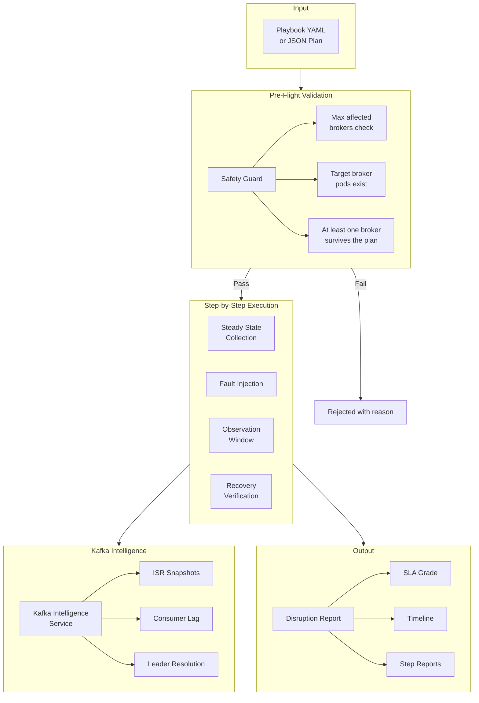
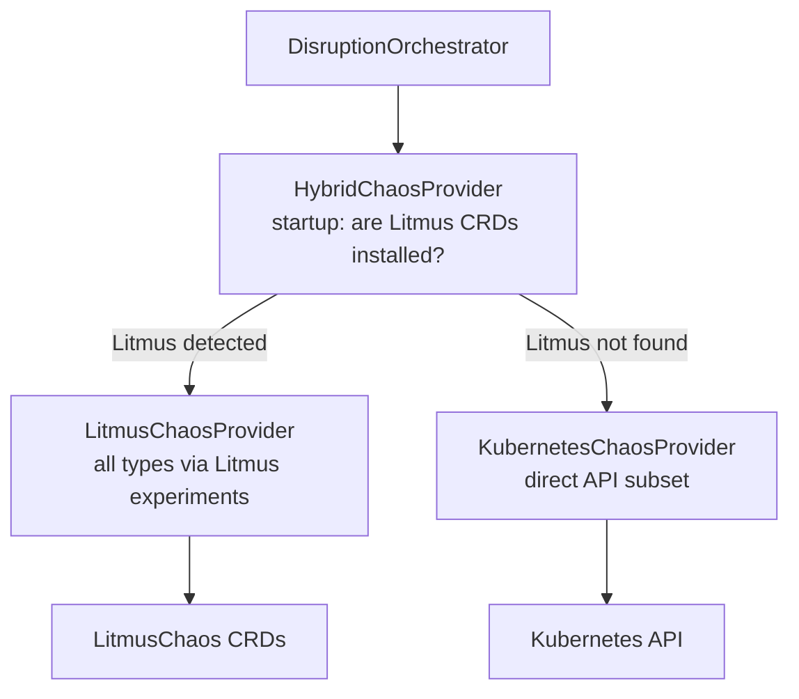
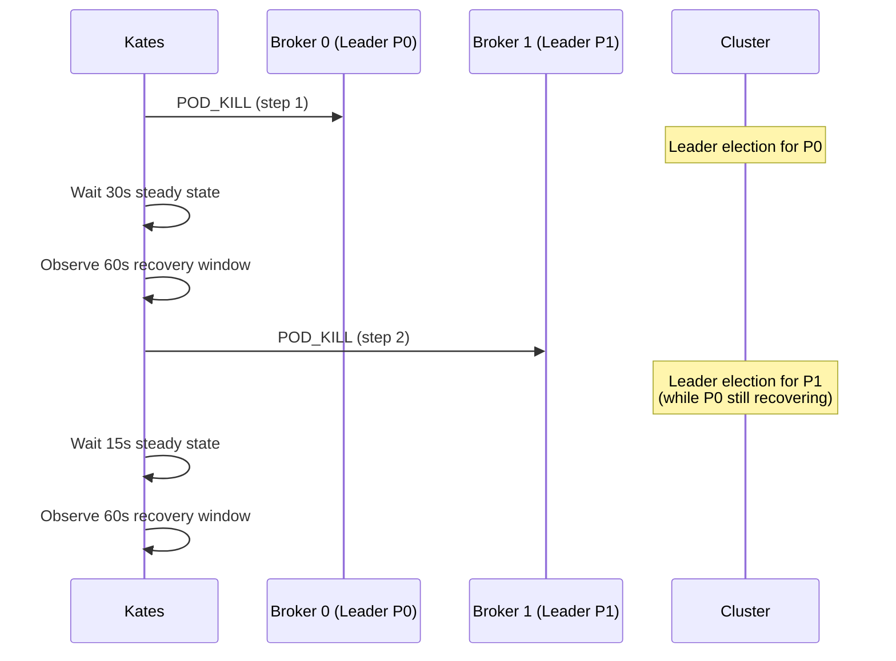
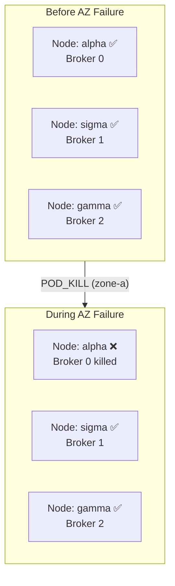
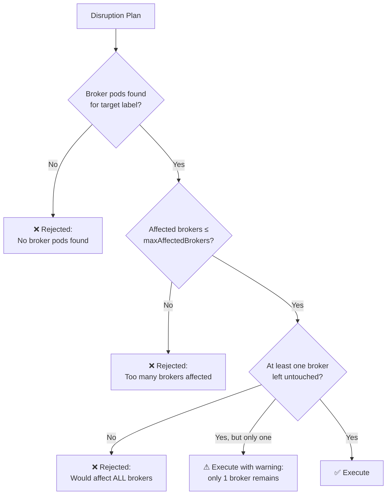
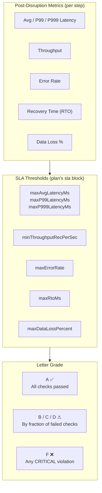
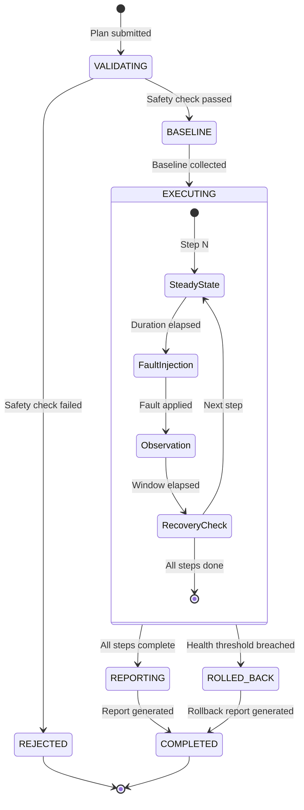

# Chaos Engineering in Practice

This chapter covers how Kates implements chaos engineering: disruption types, playbooks, safety guardrails, SLA grading, and the full execution lifecycle.

It picks up where [Chaos Engineering Theory](06-chaos-theory.md) leaves off — you have a hypothesis; now you run the experiment. After this chapter, you can:

- Choose the right disruption type and know which backend — the direct Kubernetes API or LitmusChaos — implements it
- Run a built-in playbook and read the resulting report, timeline, and Kafka intelligence metrics
- Bound the blast radius of any plan with `maxAffectedBrokers`, `autoRollback`, and recovery gates
- Gate a CI/CD pipeline on an SLA grade with `--fail-on-sla-breach` and JUnit output

## Disruption Architecture


```mermaid
graph TB
    subgraph Input["Input"]
        PB[Playbook YAML<br/>or JSON Plan]
    end
    
    subgraph Validation["Pre-Flight Validation"]
        SG[Safety Guard]
        SG --> CHK1[Max affected<br/>brokers check]
        SG --> CHK2[Target broker<br/>pods exist]
        SG --> CHK3[At least one broker<br/>survives the plan]
    end
    
    subgraph Execution["Step-by-Step Execution"]
        SS[Steady State<br/>Collection]
        FI[Fault Injection]
        OW[Observation<br/>Window]
        RV[Recovery<br/>Verification]
    end
    
    subgraph Intelligence["Kafka Intelligence"]
        KIS[Kafka Intelligence<br/>Service]
        KIS --> ISR[ISR Snapshots]
        KIS --> LAG[Consumer Lag]
        KIS --> LEAD[Leader Resolution]
    end
    
    subgraph Output["Output"]
        DR[Disruption Report]
        DR --> SLA[SLA Grade]
        DR --> TL[Timeline]
        DR --> STEPS[Step Reports]
    end
    
    Input --> Validation
    Validation -->|Pass| Execution
    Validation -->|Fail| REJECT[Rejected with reason]
    Execution --> Intelligence
    Execution --> Output
```

## Disruption Types

Kates supports 13 disruption types (the `DisruptionType` enum), implemented by two backends:

### Direct Kubernetes API

The `KubernetesChaosProvider` implements these disruptions against the Kubernetes API directly — no additional tooling required:

| Type | Implementation | Effect |
|------|---------------|--------|
| `POD_KILL` | Delete pod with grace period 0 | Immediate broker termination, simulates SIGKILL |
| `POD_DELETE` | Delete pod with configurable grace period | Graceful shutdown, broker flushes and shuts down |
| `ROLLING_RESTART` | Rolling restart of the matching StatefulSets | Simulates operator-managed rolling updates |
| `LEADER_ELECTION` | Resolve the partition leader, then force-delete its pod | Forces leader election for targeted partition |
| `SCALE_DOWN` | Scale the matching StatefulSets down by one replica | Reduces broker count |
| `NETWORK_PARTITION` | Deny-all NetworkPolicy applied to the target pod | Isolates a broker from the cluster network |
| `CPU_STRESS` | Stress ephemeral container injected into the pod | Saturates CPU on the broker pod |
| `IO_STRESS` | Stress ephemeral container injected into the pod | Injects disk I/O pressure on broker storage |

### LitmusChaos Integration

When LitmusChaos is installed, the `LitmusChaosProvider` maps every disruption type to a Litmus experiment (for example, `POD_KILL` and `POD_DELETE` both map to `pod-delete`). Five types are only available through Litmus:

| Type | Litmus Experiment | Effect |
|------|-------------------|--------|
| `NETWORK_LATENCY` | `pod-network-latency` | Adds configurable latency to broker traffic |
| `MEMORY_STRESS` | `pod-memory-hog` | Consumes memory on the broker pod |
| `DNS_ERROR` | `pod-dns-error` | Injects DNS resolution failures on broker pods |
| `DISK_FILL` | `disk-fill` | Fills the broker's PVC, triggering out-of-space errors |
| `NODE_DRAIN` | `node-drain` | Drains the node hosting a broker, simulates node/AZ failure |

### The Hybrid Provider


```mermaid
graph TD
    DO[DisruptionOrchestrator] --> HCP[HybridChaosProvider<br/>startup: are Litmus CRDs installed?]
    
    HCP -->|Litmus detected| LCP[LitmusChaosProvider<br/>all types via Litmus experiments]
    HCP -->|Litmus not found| KCP[KubernetesChaosProvider<br/>direct API subset]
    
    LCP --> LIT[LitmusChaos CRDs]
    KCP --> K8S[Kubernetes API]
```

The `HybridChaosProvider` (selected with `kates.chaos.provider=hybrid`) picks its backend once, at startup: it checks whether the Litmus CRDs (`chaosengines.litmuschaos.io`) exist in the cluster. If they do, it delegates **all** fault injection to the `LitmusChaosProvider`; otherwise it falls back to the direct `KubernetesChaosProvider`. There is no per-type routing — a single delegate handles every disruption for the lifetime of the process.

## Built-In Playbooks

Kates ships with a set of built-in playbooks located in `kates/src/main/resources/playbooks/` — that directory is the source of truth for the YAML shown below. Each playbook is a YAML file that defines a complete disruption scenario with safety parameters, fault steps, and observation windows.

### leader-cascade

Kills partition leaders sequentially to test cascading election recovery. This is the most common chaos test — it validates that your cluster can handle back-to-back leader elections without data loss.


```mermaid
sequenceDiagram
    participant Kates
    participant Broker0 as Broker 0 (Leader P0)
    participant Broker1 as Broker 1 (Leader P1)
    participant Cluster
    
    Kates->>Broker0: POD_KILL (step 1)
    Note over Cluster: Leader election for P0
    Kates->>Kates: Wait 30s steady state
    Kates->>Kates: Observe 60s recovery window
    
    Kates->>Broker1: POD_KILL (step 2)
    Note over Cluster: Leader election for P1<br/>(while P0 still recovering)
    Kates->>Kates: Wait 15s steady state
    Kates->>Kates: Observe 60s recovery window
```

```yaml
name: leader-cascade
description: "Kill partition leaders sequentially to test cascading election recovery"
category: kafka
maxAffectedBrokers: 2
autoRollback: true
isrTrackingTopic: __consumer_offsets
steps:
  - name: kill-leader-partition-0
    faultSpec:
      experimentName: leader-cascade-p0
      disruptionType: POD_KILL
      targetTopic: __consumer_offsets
      targetPartition: 0
      chaosDurationSec: 10
      gracePeriodSec: 0
    steadyStateSec: 30
    observationWindowSec: 60
    requireRecovery: true
  - name: kill-leader-partition-1
    faultSpec:
      experimentName: leader-cascade-p1
      disruptionType: POD_KILL
      targetTopic: __consumer_offsets
      targetPartition: 1
      chaosDurationSec: 10
      gracePeriodSec: 0
    steadyStateSec: 15
    observationWindowSec: 60
    requireRecovery: true
```

### split-brain

Isolates a broker via network partition to test cluster consensus under split-brain conditions. Uses LitmusChaos `NETWORK_PARTITION` to completely block traffic between the targeted broker and all other cluster members.


```mermaid
graph LR
    subgraph Majority["Quorum Majority"]
        B0[Broker 0]
        B1[Broker 1]
    end
    
    subgraph Isolated["Isolated"]
        B2[Broker 2]
    end
    
    B0 ---|"Normal<br/>communication"| B1
    B2 -.-|"NETWORK_PARTITION<br/>❌ blocked"| Majority
```

```yaml
name: split-brain
description: "Network-partition the controller/leader broker from all followers"
category: network
maxAffectedBrokers: 1
autoRollback: true
steps:
  - name: isolate-controller
    faultSpec:
      experimentName: split-brain-partition
      disruptionType: NETWORK_PARTITION
      targetLabel: "strimzi.io/component-type=kafka"
      targetBrokerId: 0
      chaosDurationSec: 60
    steadyStateSec: 30
    observationWindowSec: 90
    requireRecovery: true
```

### az-failure

Simulates a full availability zone failure by killing all brokers in one rack. This is the most aggressive built-in playbook — it sets `maxAffectedBrokers: 3` because an entire AZ may host multiple brokers. Use this to validate your rack-aware replication strategy.


```mermaid
graph TB
    subgraph Before["Before AZ Failure"]
        N1[Node: alpha ✅<br/>Broker 0]
        N2[Node: sigma ✅<br/>Broker 1]
        N3[Node: gamma ✅<br/>Broker 2]
    end
    
    subgraph During["During AZ Failure"]
        N1b[Node: alpha ❌<br/>Broker 0 killed]
        N2b[Node: sigma ✅<br/>Broker 1]
        N3b[Node: gamma ✅<br/>Broker 2]
    end
    
    Before -->|"POD_KILL (zone-a)"| During
```

```yaml
name: az-failure
description: "Simulate availability zone failure by killing all brokers in one rack"
category: infrastructure
maxAffectedBrokers: 3
autoRollback: true
steps:
  - name: kill-rack-0-brokers
    faultSpec:
      experimentName: az-failure-rack-0
      disruptionType: POD_KILL
      targetLabel: "strimzi.io/component-type=kafka,topology.kubernetes.io/zone=zone-a"
      chaosDurationSec: 30
      gracePeriodSec: 0
    steadyStateSec: 30
    observationWindowSec: 120
    requireRecovery: true
```

### rolling-restart

Tests the Strimzi rolling update procedure — brokers restart one at a time with readiness gates. The `ROLLING_RESTART` disruption type orchestrates sequential pod deletions with a 30-second grace period, waiting for each broker to become ready before proceeding. Note that `autoRollback` is `false` because rolling restarts are expected to complete naturally.

```yaml
name: rolling-restart
description: "Trigger a graceful rolling restart of the Kafka StatefulSet"
category: operations
maxAffectedBrokers: 1
autoRollback: false
steps:
  - name: rolling-restart-brokers
    faultSpec:
      experimentName: rolling-restart-sts
      disruptionType: ROLLING_RESTART
      targetLabel: "strimzi.io/component-type=kafka"
      chaosDurationSec: 300
      gracePeriodSec: 30
    steadyStateSec: 30
    observationWindowSec: 180
    requireRecovery: true
```

### consumer-isolation

Isolates consumer pods from Kafka brokers via network partition to test consumer group rebalancing behavior. Note that `maxAffectedBrokers: -1` because this playbook targets consumers, not brokers — the `-1` disables the broker safety check.

```yaml
name: consumer-isolation
description: "Network-partition consumer pods from Kafka brokers to test consumer resilience"
category: network
maxAffectedBrokers: -1
autoRollback: true
steps:
  - name: partition-consumers
    faultSpec:
      experimentName: consumer-isolation-net
      disruptionType: NETWORK_PARTITION
      targetLabel: "app=kafka-consumer"
      targetNamespace: kates
      chaosDurationSec: 60
    steadyStateSec: 30
    observationWindowSec: 90
    requireRecovery: true
```

### storage-pressure

Fills broker disk to 90% to trigger log retention policies and observe behavior under storage pressure. Uses LitmusChaos `DISK_FILL` to gradually consume disk space on the targeted broker's PVC.

```yaml
name: storage-pressure
description: "Fill broker log directories to 90% to simulate storage exhaustion"
category: storage
maxAffectedBrokers: 1
autoRollback: true
steps:
  - name: fill-broker-disk
    faultSpec:
      experimentName: storage-pressure-fill
      disruptionType: DISK_FILL
      targetLabel: "strimzi.io/component-type=kafka"
      targetBrokerId: 0
      fillPercentage: 90
      chaosDurationSec: 120
    steadyStateSec: 30
    observationWindowSec: 120
    requireRecovery: true
```

### Playbook YAML Structure

All playbooks share this structure:

| Field | Type | Description |
|-------|------|-------------|
| `name` | String | Playbook identifier |
| `description` | String | Human-readable purpose |
| `category` | String | Classification: `kafka`, `network`, `infrastructure`, `operations`, `storage` |
| `maxAffectedBrokers` | Integer | Safety limit (-1 = no limit, used for non-broker targets) |
| `autoRollback` | Boolean | Whether to auto-restore on health degradation |
| `isrTrackingTopic` | String | Topic to monitor for ISR health (optional) |
| `steps` | List | Ordered list of fault injection steps |

Each step contains:

| Field | Type | Description |
|-------|------|-------------|
| `name` | String | Step identifier |
| `faultSpec` | Object | Fault injection configuration |
| `steadyStateSec` | Integer | Seconds of steady-state collection before fault |
| `observationWindowSec` | Integer | Seconds to observe after fault injection |
| `requireRecovery` | Boolean | Whether to wait for cluster recovery before next step |

## Safety Guardrails

The `DisruptionSafetyGuard` validates every plan before execution:


```mermaid
graph TD
    PLAN[Disruption Plan] --> V1{Broker pods found<br/>for target label?}
    V1 -->|No| REJECT1["❌ Rejected:<br/>No broker pods found"]
    V1 -->|Yes| V2{Affected brokers ≤<br/>maxAffectedBrokers?}
    V2 -->|No| REJECT2["❌ Rejected:<br/>Too many brokers affected"]
    V2 -->|Yes| V3{At least one broker<br/>left untouched?}
    V3 -->|No| REJECT3["❌ Rejected:<br/>Would affect ALL brokers"]
    V3 -->|"Yes, but only one"| WARN["⚠ Execute with warning:<br/>only 1 broker remains"]
    V3 -->|Yes| EXECUTE["✅ Execute"]
```

The guard also emits per-step warnings — for example, `SCALE_DOWN` without `autoRollback`, or a `NETWORK_PARTITION` with no duration (the NetworkPolicy would persist until cleanup).

### Guardrail Parameters

| Parameter | Purpose | Default |
|-----------|---------|---------|
| `maxAffectedBrokers` | Maximum brokers to disrupt simultaneously (checked only when > 0) | `-1` (no limit) |
| `autoRollback` | Automatically restore if health deteriorates | `true` |
| `isrTrackingTopic` | Topic to monitor for ISR health | unset |
| `requireRecovery` | Wait for cluster recovery between steps | `false` |

## Kafka Intelligence

The `KafkaIntelligenceService` provides Kafka-aware targeting and monitoring:

### Leader Resolution

Instead of targeting arbitrary pods, Kates can target the **leader broker for a specific partition**:

```yaml
steps:
  - name: kill-leader
    faultSpec:
      disruptionType: POD_KILL
      targetTopic: __consumer_offsets
      targetPartition: 0
      # Kates resolves which broker hosts the leader
```

The intelligence service queries Kafka metadata to resolve which broker currently leads the target partition, then directs the disruption at that specific pod.

### ISR Tracking

During execution, Kates captures ISR snapshots:

```bash
# View ISR tracking data
kates disruption kafka-metrics <id>
```

Output includes, per step:

- Time to full ISR recovery (or `NOT RECOVERED`)
- Minimum ISR depth reached during the disruption
- Peak number of under-replicated partitions
- Total partitions tracked

### Consumer Lag Monitoring

For consumer-facing tests, Kates tracks consumer group lag:

- Baseline lag before the fault
- Peak lag during disruption, and the spike over baseline
- Time to lag recovery

## SLA Grading

Every disruption report includes an **SLA grade** — a structured verdict on whether the cluster met its resilience targets. The thresholds are not built in: you define them in the plan's `sla` block (an `SlaDefinition`), and the `SlaGrader` checks each step's post-disruption metrics against them. A plan with no SLA constraints grades `A` with zero checks.


```mermaid
graph TD
    subgraph Metrics["Post-Disruption Metrics (per step)"]
        M1[Avg / P99 / P999 Latency]
        M2[Throughput]
        M3[Error Rate]
        M4["Recovery Time (RTO)"]
        M5[Data Loss %]
    end
    
    subgraph Thresholds["SLA Thresholds (plan's sla block)"]
        T1[maxAvgLatencyMs<br/>maxP99LatencyMs<br/>maxP999LatencyMs]
        T2[minThroughputRecPerSec]
        T3[maxErrorRate]
        T4[maxRtoMs]
        T5[maxDataLossPercent]
    end
    
    subgraph Verdict["Letter Grade"]
        A["A ✅<br/>All checks passed"]
        BCD["B / C / D ⚠<br/>By fraction of failed checks"]
        F["F ❌<br/>Any CRITICAL violation"]
    end
    
    Metrics --> Thresholds
    Thresholds --> Verdict
```

Each violation is classified `WARNING` or `CRITICAL` — a breach far past its threshold (for example, P99 latency or recovery time at more than twice the limit, throughput below half the minimum, or any data loss over the cap) is `CRITICAL`. The grade is `A` when every check passes, `F` if any violation is critical, and otherwise `B`, `C`, or `D` depending on the fraction of checks that failed (more than 25% → `C`, more than 50% → `D`).

### CI/CD Integration

Disruption test results can be exported as JUnit XML for CI/CD integration:

```bash
# Run disruption test and fail the pipeline if SLA is breached
kates disruption run \
  --config disruption-plan.json \
  --fail-on-sla-breach \
  --output-junit results.xml
```

If any SLA threshold is breached, the CLI exits with a non-zero code, blocking the pipeline.

## Execution Lifecycle

A complete disruption test follows this lifecycle:


```mermaid
stateDiagram-v2
    [*] --> VALIDATING: Plan submitted
    VALIDATING --> REJECTED: Safety check failed
    VALIDATING --> BASELINE: Safety check passed
    BASELINE --> EXECUTING: Baseline collected
    
    state EXECUTING {
        [*] --> SteadyState: Step N
        SteadyState --> FaultInjection: Duration elapsed
        FaultInjection --> Observation: Fault applied
        Observation --> RecoveryCheck: Window elapsed
        RecoveryCheck --> SteadyState: Next step
        RecoveryCheck --> [*]: All steps done
    }
    
    EXECUTING --> REPORTING: All steps complete
    EXECUTING --> ROLLED_BACK: Health threshold breached
    REPORTING --> COMPLETED: Report generated
    ROLLED_BACK --> COMPLETED: Rollback report generated
    REJECTED --> [*]
    COMPLETED --> [*]
```

## Real-Time Monitoring

During execution, Kates provides real-time progress via Server-Sent Events (SSE):

```bash
# Watch disruption progress in real-time
kates disruption watch <id>
```

The CLI displays each event as it arrives:

- Step start and completion
- Baseline and post-fault metrics capture
- Fault injection and recovery waiting
- Rollback events
- Final SLA grade and completion status

## Resilience Testing: Performance + Chaos Combined

The `kates resilience run` command combines a performance test with chaos injection, providing a **before/after impact analysis**:


```mermaid
graph LR
    subgraph Phase1["Phase 1: Baseline"]
        B1[Run LOAD test<br/>30s steady state]
        B2[Capture baseline<br/>throughput + latency]
    end
    
    subgraph Phase2["Phase 2: Chaos"]
        C1[Inject fault<br/>while load continues]
        C2[Observe impact<br/>on throughput + latency]
    end
    
    subgraph Phase3["Phase 3: Recovery"]
        R1[Remove fault]
        R2[Wait for recovery]
        R3[Measure recovery time]
    end
    
    subgraph Analysis
        A1[Compare pre vs. post]
        A2[Calculate % change per metric]
        A3[Grade against SLA]
    end
    
    Phase1 --> Phase2 --> Phase3 --> Analysis
```

```bash
# Create a resilience test config (YAML or JSON)
cat > resilience-test.yaml << 'EOF'
testRequest:
  type: LOAD
  spec:
    numRecords: 100000
    numProducers: 4
    recordSize: 1024
    acks: all

chaosSpec:
  experimentName: kafka-pod-kill
  disruptionType: POD_KILL
  targetNamespace: kafka
  targetLabel: "strimzi.io/component-type=kafka"
  chaosDurationSec: 30

steadyStateSec: 30
EOF

# Run it
kates resilience run -f resilience-test.yaml
```

The CLI prints the chaos outcome, a pre-chaos baseline and post-chaos summary (throughput, P99 latency, error rate), and an **Impact Analysis** table with the percentage change of each metric — `throughputRecPerSec`, `avgLatencyMs`, `p99LatencyMs`, `maxLatencyMs`, and `errorRate`. With illustrative numbers:

| Metric | Change | |
|--------|-------:|:-:|
| `throughputRecPerSec` | -15.6% | ▼ |
| `p99LatencyMs` | +596.7% | ▲ |
| `errorRate` | +0.3% | |

::: {.callout-tip}
**Try it**

Run the most common chaos test — sequential leader kills — and watch the cluster recover:

```bash
# See what ships out of the box
kates disruption playbook list

# Kill the leaders of __consumer_offsets partitions 0 and 1, back to back
kates disruption playbook run leader-cascade

# Inspect the results using the printed disruption ID
kates disruption kafka-metrics <id>
kates disruption timeline <id>
```

The safety guard checks that enough brokers survive before anything is killed; the run prints a disruption ID, final status, and SLA grade, and the metrics show each step's time to full ISR recovery.
:::

## Summary

- The hybrid provider picks its chaos backend once, at startup: LitmusChaos when the Litmus CRDs exist in the cluster, the direct Kubernetes API provider otherwise — there is no per-type routing.
- Built-in playbooks (`leader-cascade`, `split-brain`, `az-failure`, `rolling-restart`, `consumer-isolation`, `storage-pressure`) package the common Kafka failure scenarios as ready-to-run YAML.
- Every plan passes through the `DisruptionSafetyGuard` first: target pods must exist, affected brokers stay within `maxAffectedBrokers`, and at least one broker always survives.
- Kafka intelligence makes chaos Kafka-aware — leader-targeted kills, ISR recovery snapshots, and consumer lag tracking, surfaced by `kates disruption kafka-metrics`.
- SLA grading turns post-disruption metrics into a letter grade against your plan's `sla` block; `--fail-on-sla-breach` and `--output-junit` turn that grade into a CI/CD gate.
- `kates resilience run` layers chaos on top of a LOAD test to quantify the before/after impact on throughput, latency, and error rate.

Surviving the fault is only half the proof — the next question is whether every message survived with it, which is where [Data Integrity Verification](08-data-integrity.md) picks up.
