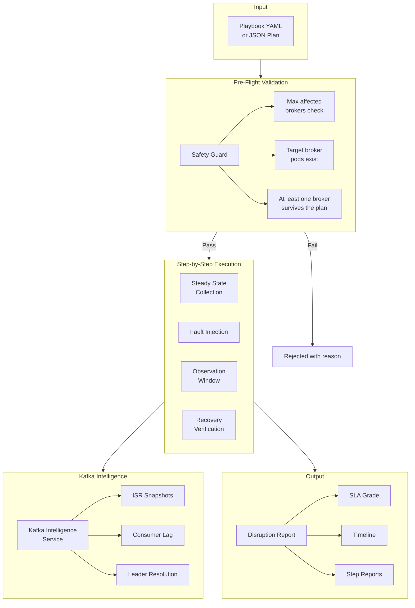
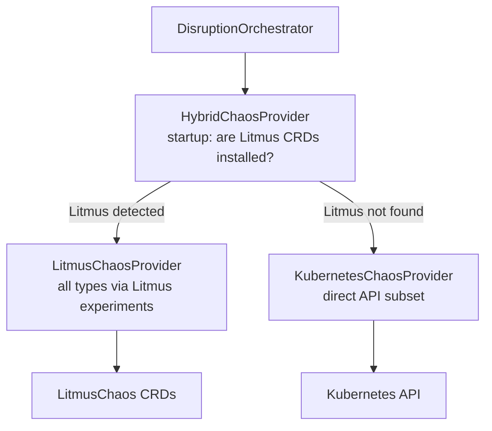
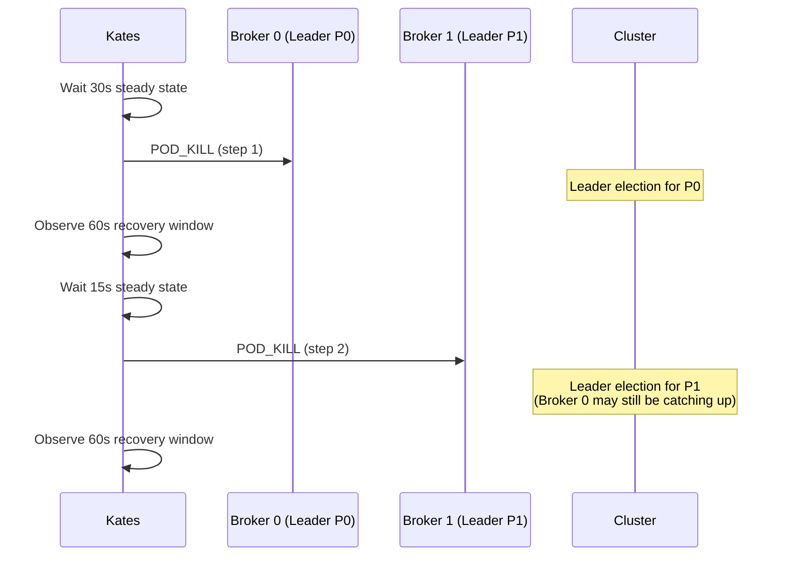
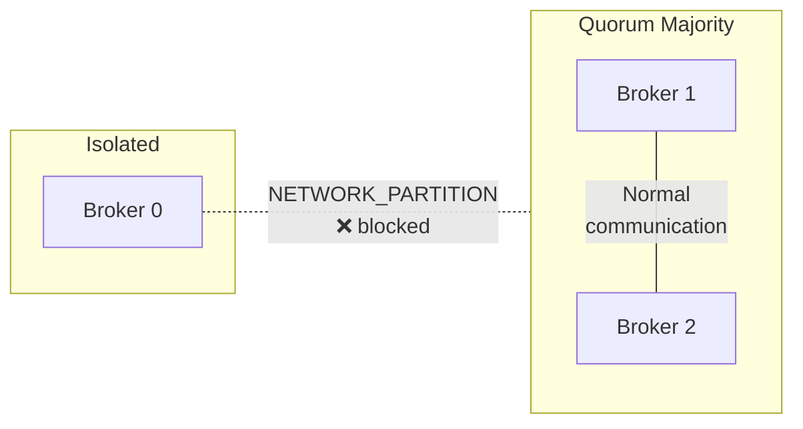
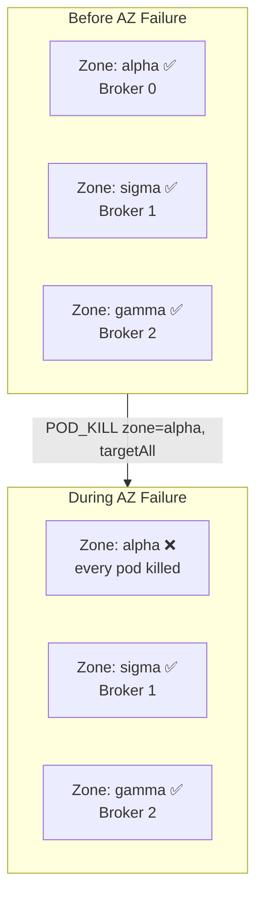
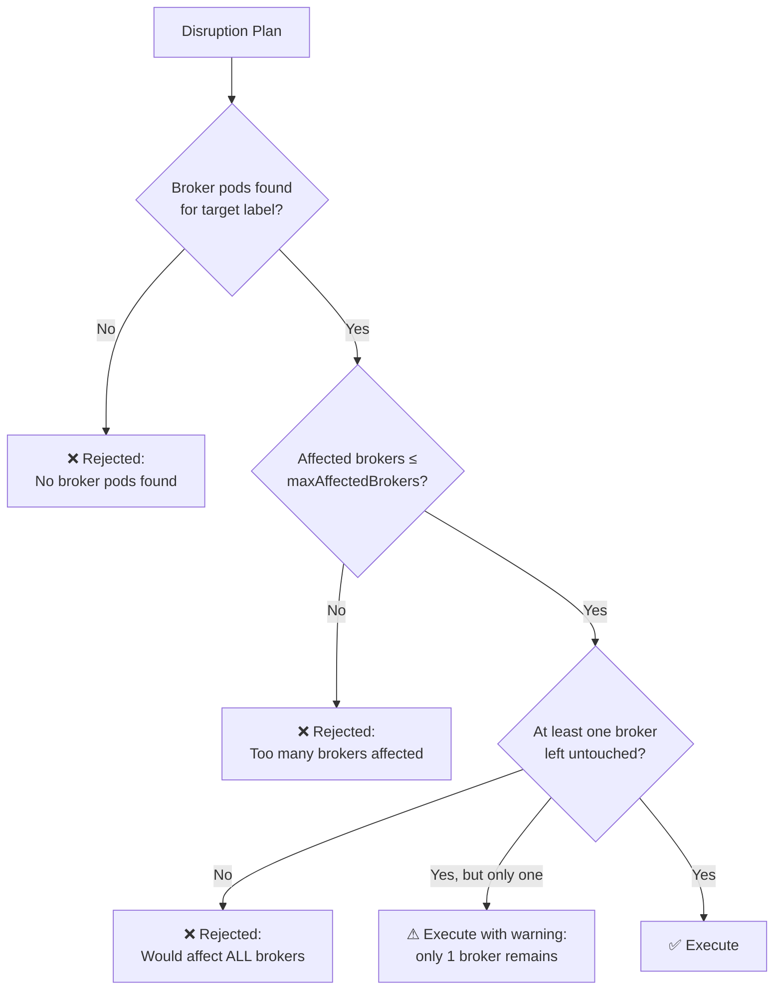
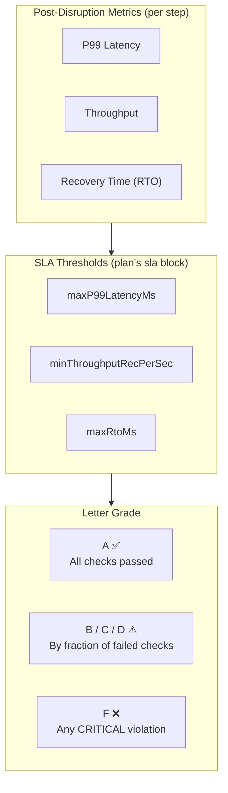
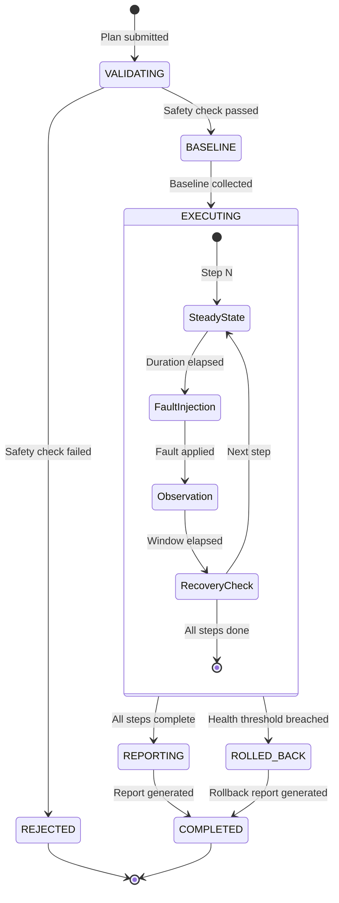
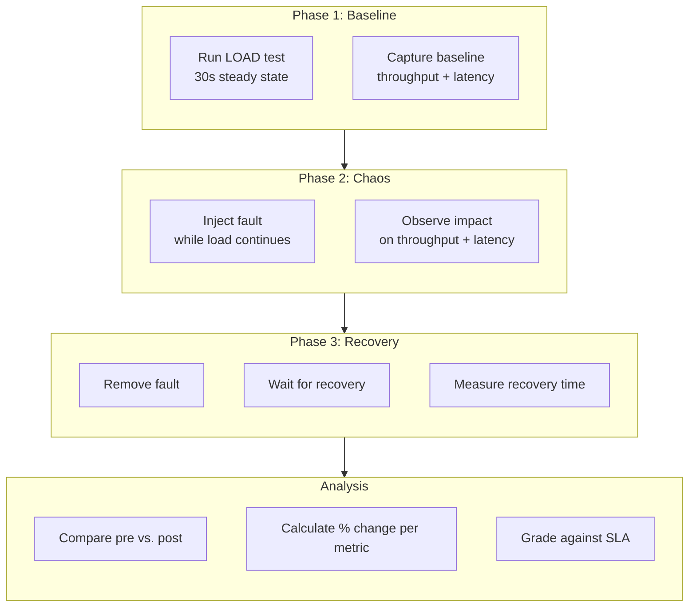

# Chaos Engineering in Practice

This chapter covers how Kates implements chaos engineering: disruption types, playbooks, safety guardrails, SLA grading, and the full execution lifecycle.

It picks up where [Chaos Engineering Theory](06-chaos-theory.md) leaves off — you have a hypothesis; now you run the experiment. After this chapter, you can:

- Choose the right disruption type and know which backend — the direct Kubernetes API or LitmusChaos — implements it
- Preview a built-in playbook, run it, and read the resulting report, timeline, and Kafka intelligence metrics
- Bound the blast radius of any plan with `maxAffectedBrokers`, `autoRollback`, and recovery gates
- Gate a CI/CD pipeline on an SLA grade with `--fail-on-sla-breach` and JUnit output

## Disruption Architecture


```mermaid
graph TB
    subgraph Input["Input"]
        PB[Playbook YAML<br/>or JSON Plan]
    end
    
    subgraph Validation["Pre-Flight Validation"]
        SG[Safety Guard]
        SG --> CHK1[Max affected<br/>brokers check]
        SG --> CHK2[Target broker<br/>pods exist]
        SG --> CHK3[At least one broker<br/>survives the plan]
    end
    
    subgraph Execution["Step-by-Step Execution"]
        SS[Steady State<br/>Collection]
        FI[Fault Injection]
        OW[Observation<br/>Window]
        RV[Recovery<br/>Verification]
    end
    
    subgraph Intelligence["Kafka Intelligence"]
        KIS[Kafka Intelligence<br/>Service]
        KIS --> ISR[ISR Snapshots]
        KIS --> LAG[Consumer Lag]
        KIS --> LEAD[Leader Resolution]
    end
    
    subgraph Output["Output"]
        DR[Disruption Report]
        DR --> SLA[SLA Grade]
        DR --> TL[Timeline]
        DR --> STEPS[Step Reports]
    end
    
    Input --> Validation
    Validation -->|Pass| Execution
    Validation -->|Fail| REJECT[Rejected with reason]
    Execution --> Intelligence
    Execution --> Output
```

## Disruption Types

Kates supports 13 disruption types (the `DisruptionType` enum), implemented by two backends:

### Direct Kubernetes API

The `KubernetesChaosProvider` implements these disruptions against the Kubernetes API directly — no additional tooling required:

| Type | Implementation | Effect |
|------|---------------|--------|
| `POD_KILL` | Delete pod with grace period 0 | Immediate broker termination, simulates SIGKILL |
| `POD_DELETE` | Delete pod with configurable grace period | Graceful shutdown, broker flushes and shuts down |
| `ROLLING_RESTART` | Annotate every matching pod with `strimzi.io/manual-rolling-update`, then wait for the Strimzi Cluster Operator to roll them | The operator's own rolling update: one broker at a time, each ready again before the next |
| `LEADER_ELECTION` | Resolve the partition leader, then force-delete its pod | Forces leader election for targeted partition |
| `SCALE_DOWN` | Lower `spec.replicas` by one on the KafkaNodePool of each matching broker, then wait for the Strimzi Cluster Operator to remove a broker; on a Kafka that Strimzi doesn't run, scale its StatefulSet down by one | One broker fewer per node pool, until rollback puts it back |
| `NETWORK_PARTITION` | Deny-all NetworkPolicy applied to the target pod | Isolates a broker from the cluster network |
| `CPU_STRESS` | Stress ephemeral container injected into the pod | Saturates CPU on the broker pod |
| `IO_STRESS` | Stress ephemeral container injected into the pod | Injects disk I/O pressure on broker storage |

### LitmusChaos Integration

When LitmusChaos is installed, the `LitmusChaosProvider` maps every disruption type but two to a Litmus experiment (for example, `POD_KILL` and `POD_DELETE` both map to `pod-delete`). The exceptions are `ROLLING_RESTART`, because no Litmus experiment does a rolling restart, and `SCALE_DOWN`, because `pod-delete` kills a broker that its StrimziPodSet brings straight back. The Litmus backend hands both to the `KubernetesChaosProvider`, so they run the same way on both backends. Five types are only available through Litmus:

| Type | Litmus Experiment | Effect |
|------|-------------------|--------|
| `NETWORK_LATENCY` | `pod-network-latency` | Adds configurable latency to broker traffic |
| `MEMORY_STRESS` | `pod-memory-hog` | Consumes memory on the broker pod |
| `DNS_ERROR` | `pod-dns-error` | Injects DNS resolution failures on broker pods |
| `DISK_FILL` | `disk-fill` | Fills the broker's PVC, triggering out-of-space errors |
| `NODE_DRAIN` | `node-drain` | Drains the node hosting a broker, simulates node/AZ failure |

### The Hybrid Provider


```mermaid
graph TD
    DO[DisruptionOrchestrator] --> HCP[HybridChaosProvider<br/>startup: are Litmus CRDs installed?]
    
    HCP -->|Litmus detected| LCP[LitmusChaosProvider<br/>all types via Litmus experiments]
    HCP -->|Litmus not found| KCP[KubernetesChaosProvider<br/>direct API subset]
    
    LCP --> LIT[LitmusChaos CRDs]
    KCP --> K8S[Kubernetes API]
```

The `HybridChaosProvider` (selected with `kates.chaos.provider=hybrid`) picks its backend once, at startup: it checks whether the Litmus CRDs (`chaosengines.litmuschaos.io`) exist in the cluster. If they do, it delegates **all** fault injection to the `LitmusChaosProvider`; otherwise it falls back to the direct `KubernetesChaosProvider`. There is no per-type routing — a single delegate handles every disruption for the lifetime of the process.

### Targeting Pods

A fault's `targetLabel` is a Kubernetes label selector, in the syntax `kubectl -l` takes: comma-separated requirements that must all hold, such as `strimzi.io/component-type=kafka,zone=alpha`, `zone in (alpha,sigma)`, `zone!=gamma` or `!zone`. A malformed or empty selector is rejected before anything is disrupted.

A pod-level fault hits one pod unless told otherwise. The first of these that applies decides which pods:

1. `targetPod`, when set.
2. Every pod the selector matches, when `targetAll: true`.
3. The broker pod named `<anything>-<targetBrokerId>`, when `targetBrokerId` is set (falling back to the first matching broker if no broker has that ordinal). A dedicated KRaft controller is never picked this way: see [Safety Guardrails](#safety-guardrails) for which pods are brokers.
4. Otherwise, one matching pod at random.

`ROLLING_RESTART` always takes every pod the selector matches, as if `targetAll` were set, unless `targetPod` names one: a rolling restart restarts all of them, one at a time.

`SCALE_DOWN` picks workloads, not pods, so only the first rule and the selector apply to it: see [Scaling Down a Node Pool](#scaling-down-a-node-pool).

Both backends resolve the pods the same way: the Kubernetes backend applies the fault to each of them, and the Litmus backend passes them to the experiment as a comma-separated `TARGET_PODS` list. A selector that matches no pod fails the step with `No pods found matching label selector` instead of doing nothing.

::: {.callout-warning}
Kates runs Litmus `pod-delete` with `SEQUENCE=serial`, because the experiment's parallel mode fails its recovery check on pods owned by a StrimziPodSet. With several targets, Litmus therefore deletes them one at a time; the Kubernetes backend deletes them all at once.
:::

### Scaling Down a Node Pool

Strimzi runs Kafka pods from StrimziPodSets and creates no StatefulSet, so `SCALE_DOWN` removes a broker the way you would by hand: it lowers `spec.replicas` of the broker's KafkaNodePool by one, and the Cluster Operator removes the pool's highest node ID. The pools come from the pods the step selects: `targetPod` if it's set, otherwise every pod `targetLabel` matches. Each pool with a selected pod loses one broker, so `strimzi.io/pool-name=brokers-sigma` takes one broker out of `brokers-sigma`, and `strimzi.io/component-type=kafka` takes one out of every broker pool. `targetAll` and `targetBrokerId` don't apply. `targetPod` only picks its pool, and Strimzi still removes the pool's highest node ID. Strimzi scales down only broker-only pools, so the step skips pools with the controller role, and it refuses to remove the last broker of a cluster.

The operator reconciles as soon as the pool changes, but it holds back the removal of a broker that still hosts partition replicas. If the `Kafka` resource has a `remove-brokers` auto-rebalance, as the `kafka-cluster` chart configures by default, Cruise Control moves the replicas off first, and the operator removes the broker once it's empty. The step waits for this: `chaosDurationSec` is the budget for the whole removal, draining included, and the step returns as soon as the broker pod is gone. Draining can't finish when the brokers left can't hold every replica, such as a topic with replication factor 3 on a cluster going from three brokers to two.

A held-back scale-down doesn't go away: the lowered `spec.replicas` stays on the pool, and the operator removes the broker whenever it becomes empty, which could be in the middle of a later step. So when the operator holds the removal back and nothing drains the broker, or the budget runs out, the step fails and Kates gives every pool it lowered its replicas back. With `chaosDurationSec: 0` the step doesn't wait, and it can't tell a removed broker from a held-back one. To remove a broker that still hosts replicas, which is what you do to test losing a broker for good, set `strimzi.io/skip-broker-scaledown-check: "true"` on the `Kafka` resource yourself. Strimzi then removes it with its replicas, and its partitions run on the replicas left.

A step that succeeds leaves the pool one broker short. Kates records the original count on the pool in the `kates.io/original-replicas` annotation, and `autoRollback` restores it from there when the step fails its recovery check, as does orphan recovery when Kates restarts. On a scale-up Strimzi gives the new broker the lowest free node ID, unless the pool sets `strimzi.io/next-node-ids`. That's normally the ID it removed, so the broker comes back with its old volume when the pool keeps its claims (`deleteClaim: false`). The Kates service account needs `patch` on `kafkanodepools`, which the `kates` chart grants.

On a Kafka that Strimzi doesn't run, the step scales down the StatefulSet of each selected pod by one, but never below one replica, and returns without waiting.

## Built-In Playbooks

Kates ships with a set of built-in playbooks located in `kates/src/main/resources/playbooks/` — that directory is the source of truth for the YAML shown below. Each playbook is a YAML file that defines a complete disruption scenario with safety parameters, fault steps, and observation windows.

### leader-cascade

Kills partition leaders sequentially to test cascading election recovery. This is the most common chaos test — it validates that your cluster can handle back-to-back leader elections without data loss. Each step looks up the current leader of a `__consumer_offsets` partition when it starts and kills that broker's pod.


```mermaid
sequenceDiagram
    participant Kates
    participant Broker0 as Broker 0 (Leader P0)
    participant Broker1 as Broker 1 (Leader P1)
    participant Cluster
    
    Kates->>Kates: Wait 30s steady state
    Kates->>Broker0: POD_KILL (step 1)
    Note over Cluster: Leader election for P0
    Kates->>Kates: Observe 60s recovery window
    
    Kates->>Kates: Wait 15s steady state
    Kates->>Broker1: POD_KILL (step 2)
    Note over Cluster: Leader election for P1<br/>(Broker 0 may still be catching up)
    Kates->>Kates: Observe 60s recovery window
```

```yaml
name: leader-cascade
description: "Kill partition leaders sequentially to test cascading election recovery"
category: kafka
maxAffectedBrokers: 2
autoRollback: true
isrTrackingTopic: __consumer_offsets
steps:
  - name: kill-leader-partition-0
    faultSpec:
      experimentName: leader-cascade-p0
      disruptionType: POD_KILL
      targetTopic: __consumer_offsets
      targetPartition: 0
      chaosDurationSec: 10
      gracePeriodSec: 0
    steadyStateSec: 30
    observationWindowSec: 60
    requireRecovery: true
  - name: kill-leader-partition-1
    faultSpec:
      experimentName: leader-cascade-p1
      disruptionType: POD_KILL
      targetTopic: __consumer_offsets
      targetPartition: 1
      chaosDurationSec: 10
      gracePeriodSec: 0
    steadyStateSec: 15
    observationWindowSec: 60
    requireRecovery: true
```

### split-brain

Isolates node 0 via network partition to test cluster consensus under split-brain conditions. For 60 seconds, all traffic between it and the other cluster members is blocked — by a deny-all NetworkPolicy on the pod with the direct Kubernetes backend, or by the Litmus `pod-network-partition` experiment. The playbook does not look up the active controller: `targetBrokerId: 0` picks the broker whose pod name ends in `-0`, which is the active controller only if node 0 also has the controller role and leads the metadata quorum at the time. `targetBrokerId` never picks a dedicated controller; to isolate one, name its pod in `targetPod`.


```mermaid
graph LR
    subgraph Majority["Quorum Majority"]
        B1[Broker 1]
        B2[Broker 2]
    end
    
    subgraph Isolated["Isolated"]
        B0[Broker 0]
    end
    
    B1 ---|"Normal<br/>communication"| B2
    B0 -.-|"NETWORK_PARTITION<br/>❌ blocked"| Majority
```

```yaml
name: split-brain
description: "Network-partition the controller/leader broker from all followers"
category: network
maxAffectedBrokers: 1
autoRollback: true
steps:
  - name: isolate-controller
    faultSpec:
      experimentName: split-brain-partition
      disruptionType: NETWORK_PARTITION
      targetLabel: "strimzi.io/component-type=kafka"
      targetBrokerId: 0
      chaosDurationSec: 60
    steadyStateSec: 30
    observationWindowSec: 90
    requireRecovery: true
```

### az-failure

Simulates an availability zone failure by killing every Kafka pod in zone `alpha` at once. This is the most aggressive built-in playbook — it sets `maxAffectedBrokers: 3` because an entire AZ may host multiple brokers. Use this to validate your rack-aware replication strategy.

Pods do not carry their node's `topology.kubernetes.io/zone` label, so the playbook selects on the pod label `zone: alpha`. The `kafka-cluster` chart puts that label on every pod of a node pool pinned with `zone:`, and `kates detect --generate-values` pins one broker pool to each of the lab's `alpha`, `sigma` and `gamma` zones. `targetAll: true` makes the step kill every pod the selector matches, not just one of them, and the safety guard counts each broker among those pods against `maxAffectedBrokers`. A KRaft controller in the zone is killed too, but it is not a broker, so it is not counted.

A cluster whose pools spread across zones without a `zone:` pin has no pod with that label. On such a cluster the dry run warns that the selector matches no broker pod, and the step fails instead of silently killing nothing. To fail a different zone, submit the step as your own plan with the selector changed — built-in playbooks take no parameters.


```mermaid
graph TB
    subgraph Before["Before AZ Failure"]
        N1[Zone: alpha ✅<br/>Broker 0]
        N2[Zone: sigma ✅<br/>Broker 1]
        N3[Zone: gamma ✅<br/>Broker 2]
    end
    
    subgraph During["During AZ Failure"]
        N1b[Zone: alpha ❌<br/>every pod killed]
        N2b[Zone: sigma ✅<br/>Broker 1]
        N3b[Zone: gamma ✅<br/>Broker 2]
    end
    
    Before -->|"POD_KILL zone=alpha, targetAll"| During
```

```yaml
name: az-failure
description: "Simulate an availability zone failure by killing every Kafka pod in zone alpha"
category: infrastructure
maxAffectedBrokers: 3
autoRollback: true
steps:
  - name: kill-zone-alpha
    faultSpec:
      experimentName: az-failure-alpha
      disruptionType: POD_KILL
      targetLabel: "strimzi.io/component-type=kafka,zone=alpha"
      targetAll: true
      chaosDurationSec: 30
      gracePeriodSec: 0
    steadyStateSec: 30
    observationWindowSec: 120
    requireRecovery: true
```

### rolling-restart

Tests the Strimzi rolling update procedure, the one an upgrade or a configuration change goes through. Strimzi runs Kafka pods from StrimziPodSets, not StatefulSets, so Kates does not restart the pods itself: it annotates every pod the selector matches with `strimzi.io/manual-rolling-update=true`, and the Cluster Operator rolls them at its next reconciliation, every two minutes by default. The operator restarts one pod at a time, waits for it to be ready before the next, and holds back any pod whose restart would leave a partition under `min.insync.replicas`.

The step then waits for the roll to finish: every annotated pod replaced by a new one that is ready. `chaosDurationSec` is the budget for that wait, covering the wait for the next reconciliation as well as the restarts. It is not a fault duration, and the step returns as soon as the roll is done, so the observation window starts after the last restart. If the budget runs out, the step fails and Kates removes the annotation from the pods not yet rolled, so the operator does not restart them later, in the middle of another step. `gracePeriodSec` plays no part: each broker gets its node pool's `terminationGracePeriodSeconds`, 30 seconds by default. `maxAffectedBrokers: 1` holds because the safety guard counts a rolling restart as one broker, and `autoRollback` is `false` because there is nothing to undo. Kates does not grade client errors during the roll: the playbook sets no SLA, and a plan's `sla` cannot check `maxErrorRate` (see [SLA Grading](#sla-grading)).

```yaml
name: rolling-restart
description: "Restart every Kafka pod one at a time through the Strimzi Cluster Operator"
category: operations
maxAffectedBrokers: 1
autoRollback: false
steps:
  - name: rolling-restart-brokers
    faultSpec:
      experimentName: rolling-restart-sts
      disruptionType: ROLLING_RESTART
      targetLabel: "strimzi.io/component-type=kafka"
      chaosDurationSec: 600
    steadyStateSec: 30
    observationWindowSec: 180
    requireRecovery: true
```

A pod run by a StatefulSet, as in a Kafka that Strimzi does not manage, is rolled by restarting its StatefulSet instead. Kates skips matching pods that belong to neither, and fails the step if nothing is left to roll. Both backends run this the same way, because Litmus has no rolling restart experiment. The Kates service account needs `patch` on pods for the annotation.

### consumer-isolation

Isolates consumer pods from Kafka brokers via network partition to test consumer group rebalancing behavior. It targets pods labelled `app=kafka-consumer` in the `kates` namespace, which Kates does not deploy — label your own consumer that way. Note that `maxAffectedBrokers: -1` because this playbook targets consumers, not brokers: the safety guard enforces the cap only when it is greater than zero, so `-1` (like `0`) switches it off. The guard's other checks still apply.

```yaml
name: consumer-isolation
description: "Network-partition consumer pods from Kafka brokers to test consumer resilience"
category: network
maxAffectedBrokers: -1
autoRollback: true
steps:
  - name: partition-consumers
    faultSpec:
      experimentName: consumer-isolation-net
      disruptionType: NETWORK_PARTITION
      targetLabel: "app=kafka-consumer"
      targetNamespace: kates
      chaosDurationSec: 60
    steadyStateSec: 30
    observationWindowSec: 90
    requireRecovery: true
```

### storage-pressure

Fills broker disk to 90% to trigger log retention policies and observe behavior under storage pressure. Uses LitmusChaos `DISK_FILL` to gradually consume disk space on the targeted broker's PVC.

```yaml
name: storage-pressure
description: "Fill broker log directories to 90% to simulate storage exhaustion"
category: storage
maxAffectedBrokers: 1
autoRollback: true
steps:
  - name: fill-broker-disk
    faultSpec:
      experimentName: storage-pressure-fill
      disruptionType: DISK_FILL
      targetLabel: "strimzi.io/component-type=kafka"
      targetBrokerId: 0
      fillPercentage: 90
      chaosDurationSec: 120
    steadyStateSec: 30
    observationWindowSec: 120
    requireRecovery: true
```

### Playbook YAML Structure

All playbooks share this structure:

| Field | Type | Description |
|-------|------|-------------|
| `name` | String | Playbook identifier |
| `description` | String | Human-readable purpose |
| `category` | String | Classification: `kafka`, `network`, `infrastructure`, `operations`, `storage` |
| `maxAffectedBrokers` | Integer | Safety limit, enforced only when > 0 (default -1; -1 or 0 = no limit, used for non-broker targets) |
| `autoRollback` | Boolean | Whether to auto-restore on health degradation |
| `isrTrackingTopic` | String | Topic to monitor for ISR health (optional) |
| `steps` | List | Ordered list of fault injection steps |

Each step contains:

| Field | Type | Description |
|-------|------|-------------|
| `name` | String | Step identifier |
| `faultSpec` | Object | Fault injection configuration |
| `steadyStateSec` | Integer | Seconds of steady-state collection before fault |
| `observationWindowSec` | Integer | Seconds to observe after fault injection |
| `requireRecovery` | Boolean | Whether to wait for cluster recovery before next step |

These are the only keys the loader accepts, along with the `faultSpec` fields the playbooks above use; any other key, such as an `sla` block, makes the file fail to load, and Kates leaves it out of the catalog. SLA thresholds and consumer-lag tracking (`lagTrackingGroupId`) need a plan posted to `POST /api/disruptions`. The catalog also loads only the playbooks named in the `PLAYBOOK_NAMES` array of `DisruptionPlaybookCatalog`, so a new playbook file needs its name added there and a rebuild of Kates.

### Previewing a Playbook

The YAML ships inside the Kates backend, and a playbook starts injecting faults as soon as you run it, so read it and preview it first. `kates disruption playbook show` prints the plan the backend builds from the YAML, with the defaults the YAML leaves out filled in. The `leader-cascade` steps name no namespace or selector, so they get `kafka` and `strimzi.io/component-type=kafka`:

```bash
kates disruption playbook show leader-cascade
```

Output:

```text
━━━━━━━━━━━━━━━━━━━━━━━━━━━━━━━━━━━━━━━━━━
  Playbook Plan: playbook:leader-cascade
━━━━━━━━━━━━━━━━━━━━━━━━━━━━━━━━━━━━━━━━━━
  Description              Kill partition leaders sequentially to test cascading election recovery
  Max Affected Brokers     2
  Auto Rollback            yes
  ISR Tracking Topic       __consumer_offsets

 ▸ Step 1: kill-leader-partition-0 (POD_KILL)
  Namespace                kafka
  Label Selector           strimzi.io/component-type=kafka
  Leader Of                __consumer_offsets-0
  Chaos Duration           10s
  Steady State             30s
  Observation Window       60s
  Require Recovery         yes

 ▸ Step 2: kill-leader-partition-1 (POD_KILL)
  Namespace                kafka
  Label Selector           strimzi.io/component-type=kafka
  Leader Of                __consumer_offsets-1
  Chaos Duration           10s
  Steady State             15s
  Observation Window       60s
  Require Recovery         yes

  See which pods each step hits: kates disruption playbook run leader-cascade --dry-run
```

With `--dry-run`, `playbook run` sends that plan to the same dry run as `kates disruption run --dry-run` and starts nothing. The safety guard resolves each partition's current leader, lists the pods each step would hit, and checks `maxAffectedBrokers` and that a broker survives:

```bash
kates disruption playbook run leader-cascade --dry-run
```

The verdict is UNSAFE when the guard would refuse to run the playbook, and the command then exits 1, so a script can run the preview first and stop on its exit status:

```bash
kates disruption playbook run leader-cascade --dry-run && kates disruption playbook run leader-cascade
```

For `POD_KILL`, `POD_DELETE`, `LEADER_ELECTION`, `NETWORK_PARTITION`, `NETWORK_LATENCY`, `ROLLING_RESTART` and `SCALE_DOWN` steps, the dry run also asks the Kubernetes API whether the Kates service account holds the permission the step uses on the direct Kubernetes backend, and reports a missing one as a step warning, which does not change the verdict. Other fault types get no RBAC check, and a check that cannot run counts as permitted.

The preview describes the cluster at that moment. A leader can move before its step starts, and the step kills whichever broker leads the partition when it starts.

With `-o json`, `playbook show` prints the plan as JSON, which `kates disruption run --config` accepts. Save it, change what the playbook hardcodes, such as its topic and partitions, or add the `sla` block that playbook YAML cannot carry, and run the result as a plan of your own. Over the API, `GET /api/disruptions/playbooks/{name}` returns the same plan, and `POST /api/disruptions?dryRun=true` previews it ([REST API Reference](11-api-reference.md)).

## Safety Guardrails

The `DisruptionSafetyGuard` validates every plan before execution:


```mermaid
graph TD
    PLAN[Disruption Plan] --> V1{Broker pods found<br/>for target label?}
    V1 -->|No| REJECT1["❌ Rejected:<br/>No broker pods found"]
    V1 -->|Yes| V2{Affected brokers ≤<br/>maxAffectedBrokers?}
    V2 -->|No| REJECT2["❌ Rejected:<br/>Too many brokers affected"]
    V2 -->|Yes| V3{At least one broker<br/>left untouched?}
    V3 -->|No| REJECT3["❌ Rejected:<br/>Would affect ALL brokers"]
    V3 -->|"Yes, but only one"| WARN["⚠ Execute with warning:<br/>only 1 broker remains"]
    V3 -->|Yes| EXECUTE["✅ Execute"]
```

The guard lists the pods in `kates.chaos.kafka.namespace` that match `kates.chaos.kafka.label`, `strimzi.io/component-type=kafka` by default. That label matches the KRaft controllers as well, so the guard counts as brokers only the pods Strimzi labels `strimzi.io/broker-role=true`: a node with both roles is a broker, and a dedicated controller is not. On the default cluster, with brokers 0–2 and controllers 3–5, a plan that takes down all three brokers is rejected. A pod without the role label, such as Kafka not run by Strimzi, counts as a broker.

A step's affected brokers are the broker pods its fault will hit, chosen by the rules in [Targeting Pods](#targeting-pods): a `targetAll` step counts every broker its selector matches, and a random pick counts as one. A `ROLLING_RESTART` step also counts as one, because the Cluster Operator takes its brokers down one at a time. A `SCALE_DOWN` step counts the broker each node pool it selects loses. A step aimed at a namespace other than the brokers' counts none. The dry run lists every pod a step hits, controllers included, and warns when a step's selector matches no broker pod or when `targetBrokerId` names no broker.

The guard also emits per-step warnings — for example, `SCALE_DOWN` without `autoRollback`, or a `NETWORK_PARTITION` with no duration (the NetworkPolicy would persist until cleanup).

### Guardrail Parameters

| Parameter | Purpose | Default |
|-----------|---------|---------|
| `maxAffectedBrokers` | Maximum brokers to disrupt simultaneously (checked only when > 0) | `-1` (no limit) |
| `autoRollback` | Automatically restore if health deteriorates | `true` |
| `isrTrackingTopic` | Topic to monitor for ISR health | unset |
| `requireRecovery` | Wait for cluster recovery between steps | `false` |

## Kafka Intelligence

The `KafkaIntelligenceService` provides Kafka-aware targeting and monitoring:

### Leader Resolution

Instead of targeting arbitrary pods, Kates can target the **leader broker for a specific partition**:

```yaml
steps:
  - name: kill-leader
    faultSpec:
      disruptionType: POD_KILL
      targetTopic: __consumer_offsets
      targetPartition: 0
      # Kates resolves which broker hosts the leader
```

The intelligence service queries Kafka metadata to resolve which broker currently leads the target partition, then directs the disruption at that specific pod.

### ISR Tracking

During execution, Kates captures ISR snapshots:

```bash
# View ISR tracking data
kates disruption kafka-metrics <id>
```

Output includes, per step:

- Time to full ISR recovery (or `NOT RECOVERED`)
- Minimum ISR depth reached during the disruption
- Peak number of under-replicated partitions
- Total partitions tracked

### Consumer Lag Monitoring

For consumer-facing tests, Kates tracks consumer group lag:

- Baseline lag before the fault
- Peak lag during disruption, and the spike over baseline
- Time to lag recovery

## SLA Grading

A disruption report includes an **SLA grade** — a structured verdict on whether the cluster met its resilience targets — when its plan defines those targets. The thresholds are not built in: you define them in the plan's `sla` block (an `SlaDefinition`), and the `SlaGrader` checks each step's post-disruption metrics against them. A plan with no SLA constraints gets no grade, and neither does a built-in playbook, which cannot carry an `sla` block.


```mermaid
graph TD
    subgraph Metrics["Post-Disruption Metrics (per step)"]
        M1[P99 Latency]
        M2[Throughput]
        M4["Recovery Time (RTO)"]
    end
    
    subgraph Thresholds["SLA Thresholds (plan's sla block)"]
        T1[maxP99LatencyMs]
        T2[minThroughputRecPerSec]
        T4[maxRtoMs]
    end
    
    subgraph Verdict["Letter Grade"]
        A["A ✅<br/>All checks passed"]
        BCD["B / C / D ⚠<br/>By fraction of failed checks"]
        F["F ❌<br/>Any CRITICAL violation"]
    end
    
    Metrics --> Thresholds
    Thresholds --> Verdict
```

The grader runs each threshold once per step, after the last step has finished, so a two-step plan with two thresholds makes four checks. Each miss is a violation classified `WARNING` or `CRITICAL`. P99 latency or recovery time above twice the limit, or throughput below half the minimum, is `CRITICAL`, and any other miss is a `WARNING`. The grade is `A` when every check passes, `F` if any violation is critical, and otherwise `B`, `C`, or `D` depending on the fraction of checks that failed (more than 25% → `C`, more than 50% → `D`).

A plan runs no workload of its own, its Prometheus capture has no P99.9 latency or error rate, and Kafka's exporter publishes latency percentiles but no mean. So `maxAvgLatencyMs`, `maxP999LatencyMs`, `maxErrorRate`, `minRecordsProcessed`, `maxDataLossPercent` and `maxRpoMs` cannot be evaluated here. A plan that declares any of them still runs, with a validation warning naming each one, and the verdict lists them under `unevaluated` instead of counting them as passed. A constraint that has nothing to compare against on this run — latency with Prometheus unreachable, `maxRtoMs` when no step waited for recovery — is listed there too. When no constraint could be evaluated, the grade is `-`, not `A`. Data loss and RPO come from an INTEGRITY workload, not from a plan: a resilience test (`kates resilience run`) whose workload is an INTEGRITY test measures both, and the INTEGRITY run reports them in its integrity result, which `kates test get <id>` prints ([Data Integrity Verification](08-data-integrity.md) shows how to size that run so it overlaps the fault).

The checks that do run have limits of their own:

- Latency and throughput come from the step's Prometheus snapshot, taken when its observation window ends. A step without one adds no checks for them. That happens when Prometheus is unreachable, when `observationWindowSec` is `0`, or when the step fails. Recovery time comes from the pod watcher and is checked either way.
- A step whose pods had not all come back when Kates stopped waiting has no recovery time, only the time it waited (`unrecoveredAfter`). Past `maxRtoMs` that is a `CRITICAL` miss. Within it, Kates cannot tell whether the step would have recovered in time, and `maxRtoMs` is listed as unevaluated for that step.
- The queries read only this cluster's series, by the `namespace` and `strimzi_io_cluster` labels the `kafka-cluster` chart's PodMonitors attach. A metric Prometheus returns no data for adds no check and is listed in the step's `unmeasuredMetrics`, instead of reading `0`.

### CI/CD Integration

Disruption test results can be exported as JUnit XML for CI/CD integration:

```bash
# Run disruption test and fail the pipeline if SLA is breached
kates disruption run \
  --config disruption-plan.json \
  --fail-on-sla-breach \
  --output-junit results.xml
```

If any SLA threshold is breached, the CLI exits with a non-zero code, blocking the pipeline.

## Execution Lifecycle

A complete disruption test follows this lifecycle:


```mermaid
stateDiagram-v2
    [*] --> VALIDATING: Plan submitted
    VALIDATING --> REJECTED: Safety check failed
    VALIDATING --> BASELINE: Safety check passed
    BASELINE --> EXECUTING: Baseline collected
    
    state EXECUTING {
        [*] --> SteadyState: Step N
        SteadyState --> FaultInjection: Duration elapsed
        FaultInjection --> Observation: Fault applied
        Observation --> RecoveryCheck: Window elapsed
        RecoveryCheck --> SteadyState: Next step
        RecoveryCheck --> [*]: All steps done
    }
    
    EXECUTING --> REPORTING: All steps complete
    EXECUTING --> ROLLED_BACK: Health threshold breached
    REPORTING --> COMPLETED: Report generated
    ROLLED_BACK --> COMPLETED: Rollback report generated
    REJECTED --> [*]
    COMPLETED --> [*]
```

## Real-Time Monitoring

During execution, Kates provides real-time progress via Server-Sent Events (SSE):

```bash
# Watch disruption progress in real-time
kates disruption watch <id>
```

The CLI displays each event as it arrives:

- Step start and completion
- Baseline and post-fault metrics capture
- Fault injection and recovery waiting
- Rollback events
- Final SLA grade and completion status

## Resilience Testing: Performance + Chaos Combined

The `kates resilience run` command combines a performance test with chaos injection, providing a **before/after impact analysis**:


```mermaid
graph TB
    subgraph Phase1["Phase 1: Baseline"]
        direction TB
        B1[Run LOAD test<br/>30s steady state]
        B2[Capture baseline<br/>throughput + latency]
    end
    
    subgraph Phase2["Phase 2: Chaos"]
        direction TB
        C1[Inject fault<br/>while load continues]
        C2[Observe impact<br/>on throughput + latency]
    end
    
    subgraph Phase3["Phase 3: Recovery"]
        direction TB
        R1[Remove fault]
        R2[Wait for recovery]
        R3[Measure recovery time]
    end
    
    subgraph Analysis
        direction TB
        A1[Compare pre vs. post]
        A2[Calculate % change per metric]
        A3[Grade against SLA]
    end
    
    Phase1 --> Phase2 --> Phase3 --> Analysis
```

```bash
# Create a resilience test config (YAML or JSON)
cat > resilience-test.yaml << 'EOF'
testRequest:
  type: LOAD
  spec:
    numRecords: 180000     # at 500 records/s: 360 s of load
    throughput: 500
    recordSize: 1024
    acks: all

chaosSpec:
  experimentName: kafka-pod-kill
  disruptionType: POD_KILL
  targetNamespace: kafka
  targetLabel: "strimzi.io/component-type=kafka,strimzi.io/broker-role=true"
  chaosDurationSec: 30

steadyStateSec: 30
EOF

# Run it
kates resilience run -f resilience-test.yaml
```

The rate limit keeps the load running across the fault: 180,000 records at 500 records/s take 360 s, while the fault is triggered after `steadyStateSec` (30 s) and lasts `chaosDurationSec` (30 s), and the run then polls its probes every 5 s until they pass or it has made `maxRecoveryWaitSec` ÷ 5 polls (24 with the default 120). An unthrottled run can finish before the fault is triggered, and then both summaries describe a run the fault never touched. The `spec` goes to the API as written, so it takes the API's field names: `throughput` sets the rate, and LOAD runs one producer and one consumer whatever `numProducers` says. The selector adds `strimzi.io/broker-role=true` because `strimzi.io/component-type=kafka` alone also matches the KRaft controllers, and a random pick could then kill a controller instead of a broker.

The CLI prints the chaos outcome, a pre-chaos baseline and post-chaos summary (throughput, P99 latency, error rate), and an **Impact Analysis** table with the percentage change of each metric — `throughputRecPerSec`, `avgLatencyMs`, `p99LatencyMs`, `maxLatencyMs`, and `errorRate`. With illustrative numbers:

| Metric | Change | |
|--------|-------:|:-:|
| `throughputRecPerSec` | -15.6% | ▼ |
| `p99LatencyMs` | +596.7% | ▲ |
| `errorRate` | +0.3% | |

::: {.callout-tip}
**Try it**

Run the most common chaos test — sequential leader kills — and watch the cluster recover:

```bash
# See what ships out of the box
kates disruption playbook list

# Preview which brokers it would kill, without killing any
kates disruption playbook run leader-cascade --dry-run

# Kill the leaders of __consumer_offsets partitions 0 and 1, back to back
kates disruption playbook run leader-cascade

# Inspect the results using the printed disruption ID
kates disruption kafka-metrics <id>
kates disruption timeline <id>
```

The safety guard checks that enough brokers survive before anything is killed; the run prints a disruption ID and the final status, and the metrics show each step's time to full ISR recovery.
:::

## Summary

- The hybrid provider picks its chaos backend once, at startup: LitmusChaos when the Litmus CRDs exist in the cluster, the direct Kubernetes API provider otherwise — there is no per-type routing.
- Built-in playbooks (`leader-cascade`, `split-brain`, `az-failure`, `rolling-restart`, `consumer-isolation`, `storage-pressure`) package the common Kafka failure scenarios as ready-to-run YAML; `kates disruption playbook show` prints the plan one runs, and `playbook run --dry-run` previews it without injecting a fault.
- Every plan passes through the `DisruptionSafetyGuard` first: target pods must exist, affected brokers stay within `maxAffectedBrokers`, and at least one broker always survives.
- Kafka intelligence makes chaos Kafka-aware — leader-targeted kills, ISR recovery snapshots, and consumer lag tracking, surfaced by `kates disruption kafka-metrics`.
- SLA grading turns post-disruption metrics into a letter grade against your plan's `sla` block; `--fail-on-sla-breach` and `--output-junit` turn that grade into a CI/CD gate.
- `kates resilience run` layers chaos on top of a LOAD test to quantify the before/after impact on throughput, latency, and error rate.

Surviving the fault is only half the proof — the next question is whether every message survived with it, which is where [Data Integrity Verification](08-data-integrity.md) picks up.
