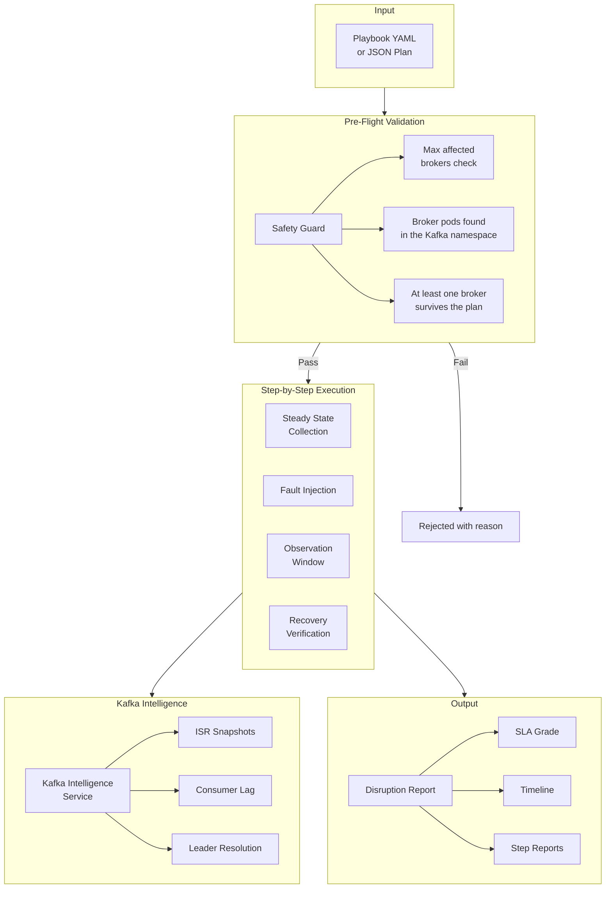
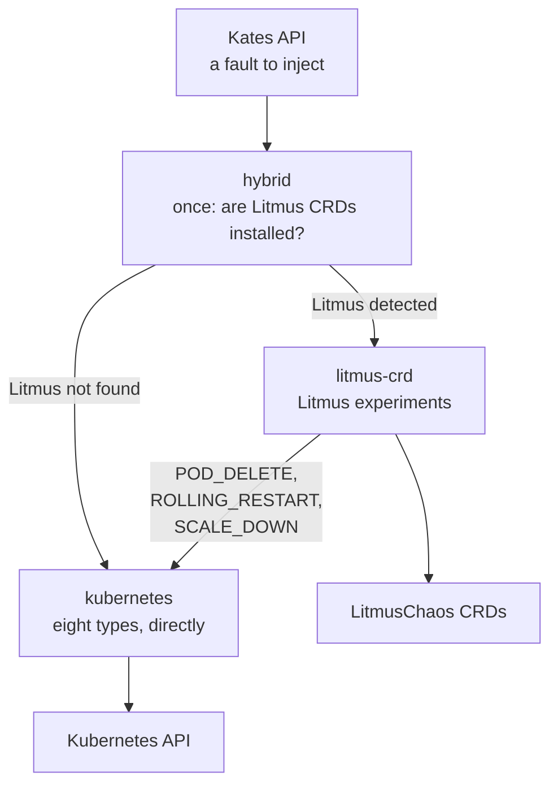
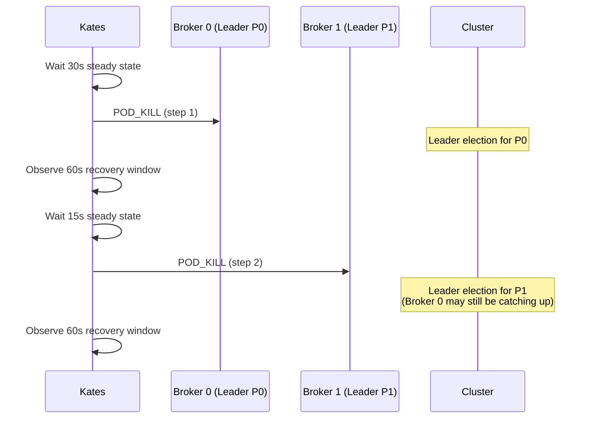
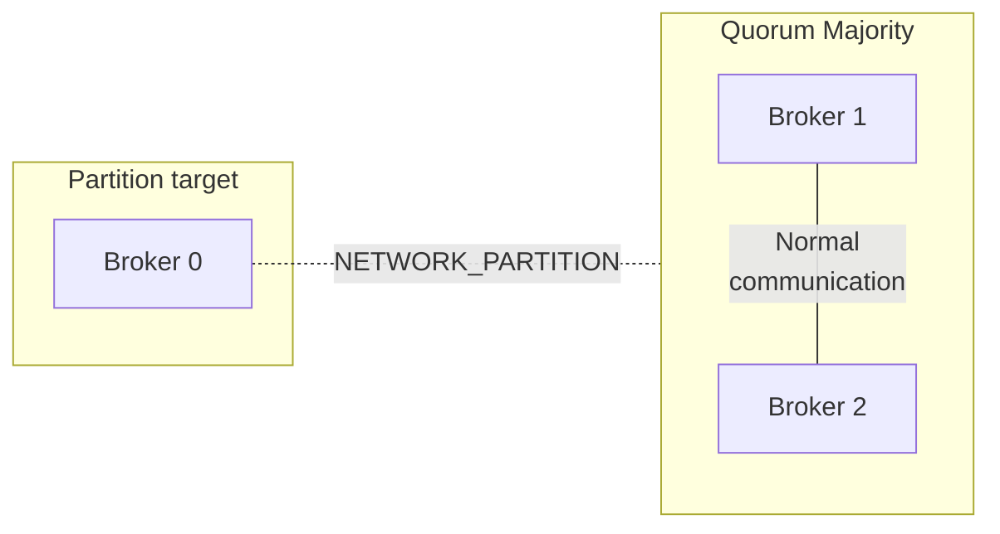
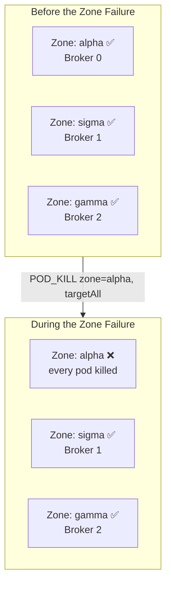
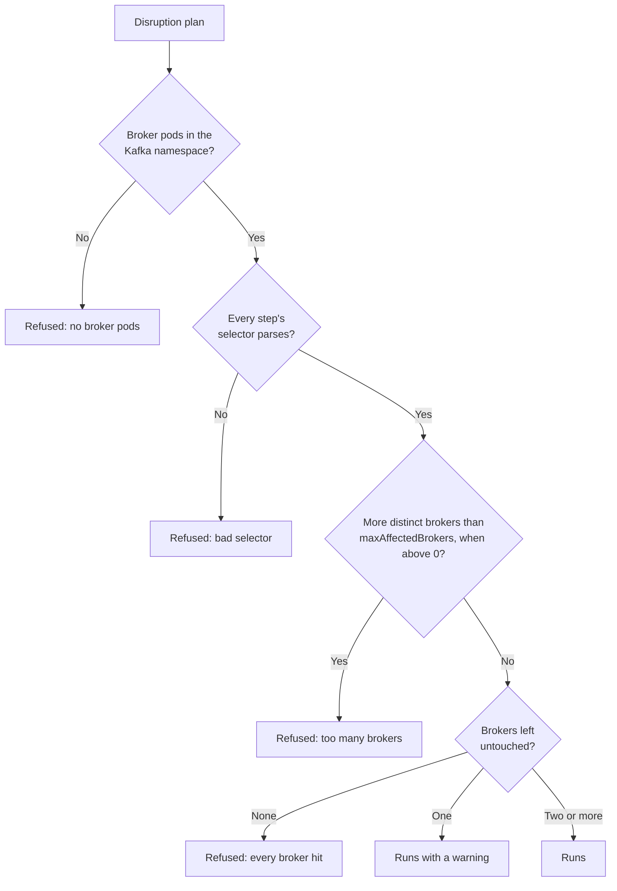
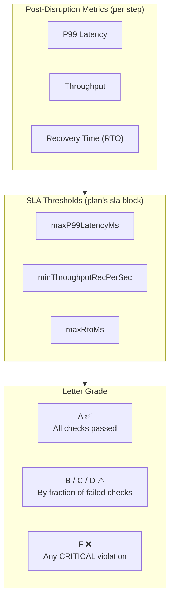
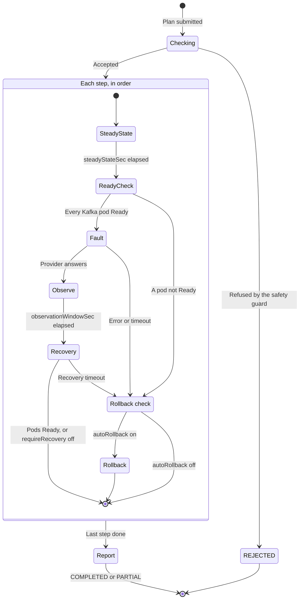
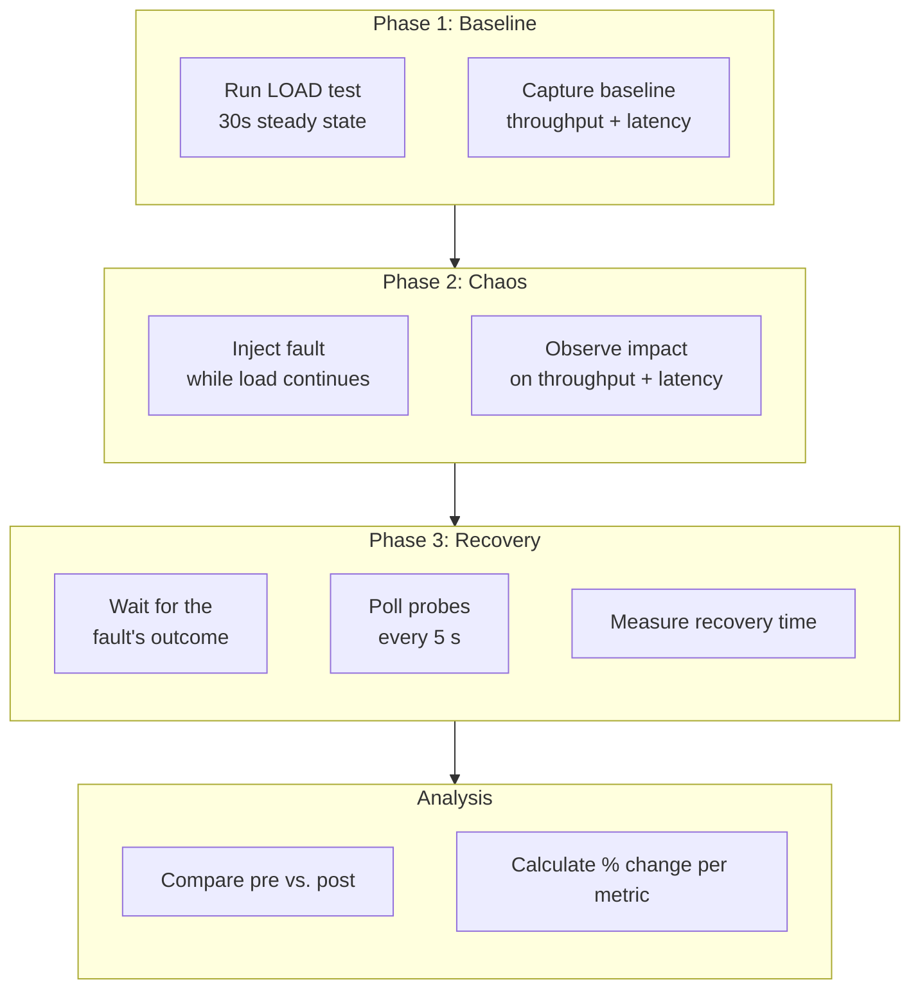

# Chaos Engineering in Practice

This chapter covers how Kates implements chaos engineering: [disruption types](appendix-a-glossary.md#gl-disruption-type), [playbooks](appendix-a-glossary.md#gl-playbook), safety guardrails, SLA grading, and the full execution lifecycle.

It picks up where [Chaos Engineering Theory](06-chaos-theory.md) leaves off — you have a hypothesis; now you run the experiment. After this chapter, you can:

- Choose between a [disruption plan](appendix-a-glossary.md#gl-disruption-plan) and a [resilience run](appendix-a-glossary.md#gl-resilience-run), and know which [chaos provider](appendix-a-glossary.md#gl-chaos-provider) runs each disruption type
- Preview a built-in playbook, run it, and read the resulting report, timeline, and Kafka intelligence metrics
- Bound a plan's [blast radius](appendix-a-glossary.md#gl-blast-radius) with `maxAffectedBrokers`, and say when [`autoRollback`](appendix-a-glossary.md#gl-disruption-rollback) undoes a failed step and what it can undo
- Fail a CI/CD pipeline on a missed [SLA](appendix-a-glossary.md#gl-sla) threshold with `--fail-on-sla-breach`, and export the result as JUnit XML

## Disruption Architecture

The diagram follows a disruption plan from its file to its report. Notice where the [safety guard](appendix-a-glossary.md#gl-safety-guard) sits: a plan it refuses ends there, before any step runs.


```mermaid
%%| label: fig-practice-architecture
%%| fig-cap: "The safety guard checks a plan before any step runs; a plan it refuses ends with a reason, and one it accepts runs its steps and ends in a report."
%%| fig-alt: "Flowchart. A playbook YAML or JSON plan goes to pre-flight validation, where the safety guard checks the maximum affected brokers, that broker pods are found in the Kafka namespace, and that at least one broker survives the plan. A failed check ends in a rejection with a reason. A passed plan goes to step-by-step execution: steady-state collection, fault injection, the observation window and recovery verification. Execution feeds Kafka intelligence, with ISR snapshots, consumer lag and leader resolution, and the output: a disruption report with an SLA grade, a timeline and step reports."
graph TB
    subgraph Input["Input"]
        PB[Playbook YAML<br/>or JSON Plan]
    end
    
    subgraph Validation["Pre-Flight Validation"]
        SG[Safety Guard]
        SG --> CHK1[Max affected<br/>brokers check]
        SG --> CHK2[Broker pods found<br/>in the Kafka namespace]
        SG --> CHK3[At least one broker<br/>survives the plan]
    end
    
    subgraph Execution["Step-by-Step Execution"]
        SS[Steady State<br/>Collection]
        FI[Fault Injection]
        OW[Observation<br/>Window]
        RV[Recovery<br/>Verification]
    end
    
    subgraph Intelligence["Kafka Intelligence"]
        KIS[Kafka Intelligence<br/>Service]
        KIS --> ISR[ISR Snapshots]
        KIS --> LAG[Consumer Lag]
        KIS --> LEAD[Leader Resolution]
    end
    
    subgraph Output["Output"]
        DR[Disruption Report]
        DR --> SLA[SLA Grade]
        DR --> TL[Timeline]
        DR --> STEPS[Step Reports]
    end
    
    Input --> Validation
    Validation -->|Pass| Execution
    Validation -->|Fail| REJECT[Rejected with reason]
    Execution --> Intelligence
    Execution --> Output
```

## Two Ways to Run a Fault

Before you break anything on the [`krafter`](appendix-a-glossary.md#gl-krafter) Kafka cluster, decide which question you're asking, because Kates answers two different ones with two different commands. One question is about the cluster: when a [broker](appendix-a-glossary.md#gl-broker) dies, do its pods come back and its [partitions](appendix-a-glossary.md#gl-partition) recover in time? The other is about a client: while the broker is down, what do your payment producers see, and does every acknowledged record survive?

A disruption plan answers the cluster question. It runs one or more steps, each injecting one [fault](appendix-a-glossary.md#gl-fault), and watches the cluster from outside. Pod readiness comes from the Kubernetes API, and latency and [throughput](appendix-a-glossary.md#gl-throughput) from [Prometheus](appendix-a-glossary.md#gl-prometheus). When the plan names them, Kates also reads the [ISR](appendix-a-glossary.md#gl-isr) of one [topic](appendix-a-glossary.md#gl-topic) and the [consumer lag](appendix-a-glossary.md#gl-consumer-lag) of one [consumer group](appendix-a-glossary.md#gl-consumer-group) from Kafka. A plan sends no records of its own. A playbook is a plan that ships inside Kates, and `kates disruption schedule create` runs a playbook on a cron schedule.

A resilience run answers the client question. It starts a Kates test, such as a [LOAD](appendix-a-glossary.md#gl-test-type) or an INTEGRITY run, waits `steadyStateSec`, and injects one fault while the test runs. It snapshots the test's throughput, latency and error rate just before the fault, summarizes the whole run again after the recovery wait, and prints the change. When the question is whether `krafter` can lose an acknowledged payment, an INTEGRITY run through the fault is the one that answers it.

Each run of a plan or a playbook is a disruption, with its own ID and report. Either kind of run carries out a chaos experiment: faults injected on purpose to test a [steady-state hypothesis](appendix-a-glossary.md#gl-steady-state-hypothesis) [@basiri2016chaos]. A Game Day is the session your team runs around these commands, which [Chaos Engineering Theory](06-chaos-theory.md#the-game-day-methodology) explains; `make gameday` scripts one, and injects its fault with `kubectl` rather than through the [Kates API](appendix-a-glossary.md#gl-kates-api).

The table sets a plan and a resilience run side by side. Read the guard, rollback and report rows before you choose, because that's where the two differ most.

| | Disruption plan or playbook | Resilience run |
|------|-------------------|-------------------|
| Command | `kates disruption run --config <file>` or `kates disruption playbook run <name>` | `kates resilience run -f <file>` |
| Faults | One per step | One |
| Workload | None | The Kates test in `testRequest` |
| What it measures | Pod recovery, Prometheus snapshots before and after each fault, and ISR and lag when asked | The test's throughput, latency and error rate just before the fault, and again over the whole run after the recovery wait |
| Safety guard | Checks the plan before the first fault, and the Kafka pods before each fault | None, apart from the [fault parameter limits](#fault-parameter-limits) |
| Another plan running | Refused | Not checked |
| Rollback | After a step fails its recovery check or errors, with `autoRollback` | None |
| Grade | An [SLA grade](appendix-a-glossary.md#gl-sla-grade) when the plan has an `sla` block | None |
| Report | Saved: `kates disruption status <id>` and `kates chaos list` | Printed once; the [test run](appendix-a-glossary.md#gl-test-run) is saved like any other |

`kates resilience run` prints the chaos outcome, the change in each metric, the recovery time, the probes' results and the test run's ID, but not the INTEGRITY [verdict](appendix-a-glossary.md#gl-verdict). Read the verdict from the test run with `kates test get <id>`, as [Data Integrity Verification](08-data-integrity.md) shows.

Both paths get the fault itself from the same chaos provider, which [Choosing a Chaos Provider](#choosing-a-chaos-provider) describes, so the same fault spec (a plan step's `faultSpec`, a resilience file's `chaosSpec`) does the same thing either way. The one difference is aiming: only a plan step looks up a partition's [leader](appendix-a-glossary.md#gl-partition-leader) for you, when the step names a `targetTopic`.

::: {.callout-caution title="A Resilience Run Has No Safety Guard"}
Nothing checks a resilience run's `chaosSpec` against `maxAffectedBrokers` or waits for a running plan to finish, and nothing rolls its fault back. Aim it with a selector that matches only the pods you mean to hit, such as the brokers.
:::

## Disruption Types

Kates supports 13 disruption types (the `DisruptionType` enum). Two chaos providers implement them, the Kubernetes API directly and [LitmusChaos](appendix-a-glossary.md#gl-litmuschaos), and the first section below says which one runs your faults.

### Choosing a Chaos Provider

Every fault Kates injects, from a plan, a playbook or a resilience run, goes through one chaos provider: the Kates API's `kates.chaos.provider` setting. You choose it when you deploy Kates, not per fault, and it decides what actually happens to a pod or to the network.

The table compares the four values. Check the Default column first: a stock install uses `litmus-crd`.

| Provider | Default | Needs | Fault types it runs | `kates` chart RBAC |
|----------|---------|-------|---------------------|--------------------|
| `litmus-crd` | Yes | LitmusChaos, with each type's experiment installed | Every type through a Litmus experiment, except `POD_DELETE`, `ROLLING_RESTART` and `SCALE_DOWN`, which use the Kubernetes API | The default role |
| `kubernetes` | No | Nothing beyond Kates | `POD_KILL`, `POD_DELETE`, `LEADER_ELECTION`, `NETWORK_PARTITION`, `CPU_STRESS`, `IO_STRESS`, `ROLLING_RESTART`, `SCALE_DOWN` | `rbac.directChaos=true` for `NETWORK_PARTITION`, `CPU_STRESS` and `IO_STRESS` |
| `hybrid` | No | Nothing: it uses LitmusChaos when the Litmus [CRDs](appendix-a-glossary.md#gl-crd) exist | Those of the provider it picks | As for the provider it picks |
| `noop` | No | Nothing | None: every fault comes back `Skipped` | None |

So `NETWORK_LATENCY`, `MEMORY_STRESS`, `DNS_ERROR`, `DISK_FILL` and `NODE_DRAIN` need LitmusChaos, and [The Hybrid Provider](#the-hybrid-provider) shows how `hybrid` picks.

On a stock install you already have LitmusChaos: `kates deploy`, and so `make all`, installs the `kates-chaos` chart unless you pass `--with-chaos=false`. The chart installs seven experiments in its target namespaces, `kafka` by default: `pod-delete`, `pod-cpu-hog`, `pod-memory-hog`, `pod-network-partition`, `pod-io-stress`, `pod-dns-error` and `node-drain`. It installs no `disk-fill` and no `pod-network-latency`, so `DISK_FILL` and `NETWORK_LATENCY` steps fail until you add those experiments yourself.

When Kates picks the provider, it checks that the provider can work, and falls back to `noop` when it can't or when the setting names no provider. For `litmus-crd` the check is only that Kates can list ChaosEngines: it proves the CRDs exist, not that the Litmus [operator](appendix-a-glossary.md#gl-operator) runs. A fallback is easy to miss. The Kates API logs it once, at ERROR, with the words `falling back to noop`, and every fault after that comes back `Skipped`, so a plan ends `PARTIAL` and a resilience run `CHAOS_FAILED`. A provider that works logs `Chaos provider:` and its name instead.

Kates picks the provider once per Kates API process and keeps it until the pod restarts. After you install LitmusChaos, change the provider or clear a fallback, restart the Kates API Deployment; on the lab that's `kubectl rollout restart deploy/kates -n kates`.

To switch providers, set `KATES_CHAOS_PROVIDER` through the `kates` chart's `extraEnv`. The direct Kubernetes provider makes its own writes, so it also needs `rbac.directChaos`:

```yaml
extraEnv:
  - name: KATES_CHAOS_PROVIDER
    value: kubernetes
rbac:
  directChaos: true
```

Leave `rbac.directChaos` off with `litmus-crd`. Litmus runs its experiments as its own `litmus-admin` service account, and the extra rules are cluster-wide: they let Kates create [NetworkPolicies](appendix-a-glossary.md#gl-networkpolicy) in any namespace and start a container in any pod.

Kates doesn't check a type against the provider before the fault. `kates disruption types` lists every type whatever the provider, and neither the safety guard nor the dry run looks, so an unsupported type fails only when its step reaches the fault. On `kubernetes`, the step's `Failure` line in `kates disruption status` reads `DisruptionType <TYPE> not supported by kubernetes provider`. On `litmus-crd`, Kates creates the ChaosEngine even when its experiment isn't installed, and waits up to `chaosDurationSec` plus two minutes for a result.

Each Litmus fault leaves a ChaosEngine named `kates-<experimentName>-<timestamp>` in the target namespace, and Kates doesn't delete it. `make chaos-status` lists the ChaosEngines and ChaosResults in `kafka`, which is the first place to look when a Litmus step fails.

### Direct Kubernetes API

The `kubernetes` provider implements these disruptions against the Kubernetes API directly. It needs no extra tooling, but `NETWORK_PARTITION`, `CPU_STRESS` and `IO_STRESS` need `rbac.directChaos=true` on the `kates` chart:

| Type | Implementation | Effect |
|------|---------------|--------|
| `POD_KILL` | Delete pod with grace period 0 | Immediate broker termination, simulates SIGKILL |
| `POD_DELETE` | Delete pod with configurable grace period | Graceful shutdown, broker flushes and shuts down |
| `ROLLING_RESTART` | Annotate every matching pod with `strimzi.io/manual-rolling-update`, then wait for the [Strimzi](appendix-a-glossary.md#gl-strimzi) Cluster Operator to roll them | The operator's own rolling update: one broker at a time, each ready again before the next |
| `LEADER_ELECTION` | Force-delete the target pod; a step that names `targetTopic` targets that partition's leader | Forces [leader election](appendix-a-glossary.md#gl-leader-election) for targeted partition |
| `SCALE_DOWN` | Lower `spec.replicas` by one on the [KafkaNodePool](appendix-a-glossary.md#gl-kafkanodepool) of each matching broker, then wait for the Strimzi Cluster Operator to remove a broker; on a Kafka that Strimzi doesn't run, scale its StatefulSet down by one | One broker fewer per node pool, until rollback puts it back |
| `NETWORK_PARTITION` | Create a NetworkPolicy with no allow rules that selects the target pod | Adds a NetworkPolicy with no allow rules to the pod, removed after `chaosDurationSec` |
| `CPU_STRESS` | Stress ephemeral container injected into the pod | Saturates CPU on the broker pod |
| `IO_STRESS` | Stress ephemeral container injected into the pod | Injects disk I/O pressure on broker storage |

The provider injects each fault once, and doesn't try it again when a call fails. The API server may have carried out the call and lost only its answer. A second try would then act on what the first changed: it would kill another pod picked at random, or scale a StatefulSet down from the count the first try left. The step fails instead. A partition that fails or is interrupted removes its NetworkPolicies all the same, as at the end of its duration, and a failed node pool scale-down gives the pools their replicas back. Removing a partition is the one call the provider retries, up to three more times, because doing it again removes nothing more.

### LitmusChaos Integration

On the default `litmus-crd` provider, Kates maps every disruption type but three to a Litmus experiment (for example, `POD_KILL` and `LEADER_ELECTION` both map to `pod-delete`). The exceptions are `ROLLING_RESTART`, because no Litmus experiment does a rolling restart, `SCALE_DOWN`, because `pod-delete` kills a broker that its [StrimziPodSet](appendix-a-glossary.md#gl-strimzipodset) brings straight back, and `POD_DELETE`, because `pod-delete` never deletes a pod with `gracePeriodSec`. It deletes the pod at once with the `FORCE=true` that pods of a StrimziPodSet need, and with the pod's own grace period otherwise. The `litmus-crd` provider hands all three to the `kubernetes` provider, so they run the same way on both. Five types are only available through Litmus:

| Type | Litmus Experiment | Effect |
|------|-------------------|--------|
| `NETWORK_LATENCY` | `pod-network-latency` | Adds configurable latency to broker traffic; the `kates-chaos` chart doesn't install the experiment |
| `MEMORY_STRESS` | `pod-memory-hog` | Consumes memory on the broker pod |
| `DNS_ERROR` | `pod-dns-error` | Injects DNS resolution failures on broker pods |
| `DISK_FILL` | `disk-fill` | Litmus `disk-fill` at `fillPercentage`; the `kates-chaos` chart doesn't install the experiment |
| `NODE_DRAIN` | `node-drain` | Drains the node that runs the pod Kates picks, as in a node or [zone](appendix-a-glossary.md#gl-zone) failure: see [Targeting Pods](#targeting-pods) |

The two providers don't treat every field alike. Both wait `delayBeforeSec` before they pick the pods and inject the fault, so on `litmus-crd` the ChaosEngine appears only after the delay. A plan step's recovery times start when the provider injects the fault, so the delay isn't counted in them. A step whose fault is never injected, such as every step on `noop`, has no recovery times and doesn't wait for recovery. On `litmus-crd`, `chaosDurationSec` becomes the experiment's `TOTAL_CHAOS_DURATION`, and Kates waits up to two minutes past it for the ChaosResult. `POD_KILL` and `LEADER_ELECTION` run `pod-delete` there with `FORCE=true`, which deletes the pod at once. On `kubernetes`, `POD_KILL`, `POD_DELETE` and `LEADER_ELECTION` delete each target once, and `chaosDurationSec` doesn't lengthen them. A `POD_DELETE` runs that way on both providers, with `gracePeriodSec` as the pod's grace period, and leaves no ChaosEngine.

### The Hybrid Provider

The diagram shows the one decision the hybrid provider makes, and when it makes it. Notice that the check runs once per Kates API process, not once per disruption.


```mermaid
%%| label: fig-practice-hybrid-provider
%%| fig-cap: "With `kates.chaos.provider=hybrid`, Kates looks for the LitmusChaos CRDs once, and sends every fault to the provider it picked."
%%| fig-alt: "Flowchart. A fault from the Kates API goes to the hybrid provider, which asks once whether the Litmus CRDs are installed. If Litmus is detected, it uses the litmus-crd provider, which runs Litmus experiments through the LitmusChaos CRDs and hands POD_DELETE, ROLLING_RESTART and SCALE_DOWN to the kubernetes provider. If Litmus is not found, it uses the kubernetes provider, which calls the Kubernetes API directly for the eight types it implements."
graph TD
    DO[Kates API<br/>a fault to inject] --> HCP[hybrid<br/>once: are Litmus CRDs installed?]
    
    HCP -->|Litmus detected| LCP[litmus-crd<br/>Litmus experiments]
    HCP -->|Litmus not found| KCP[kubernetes<br/>eight types, directly]
    
    LCP --> LIT[LitmusChaos CRDs]
    LCP -->|POD_DELETE,<br/>ROLLING_RESTART,<br/>SCALE_DOWN| KCP
    KCP --> K8S[Kubernetes API]
```

The `hybrid` provider (selected with `kates.chaos.provider=hybrid`) picks its delegate once per process: it checks whether the Litmus CRDs (`chaosengines.litmuschaos.io`) exist in the cluster. If they do, it delegates **all** fault injection to `litmus-crd`; otherwise it falls back to the direct `kubernetes` provider. There is no per-type routing — a single delegate handles every disruption for the lifetime of the process. The Kates API's log names the pick: `Chaos provider: hybrid(litmus-crd)` or `Chaos provider: hybrid(kubernetes)`.

### Targeting Pods

A fault's `targetLabel` is a Kubernetes label selector, in the syntax `kubectl -l` takes: comma-separated requirements that must all hold, such as `strimzi.io/component-type=kafka,zone=alpha`, `zone in (alpha,sigma)`, `zone!=gamma` or `!zone`. A selector that doesn't parse is refused before anything is disrupted.

A pod-level fault hits one pod unless told otherwise. The first of these that applies decides which pods:

1. `targetPod`, when set.
2. Every pod the selector matches, when `targetAll: true`.
3. The broker pod named `<anything>-<targetBrokerId>`, when `targetBrokerId` is set (falling back to the first matching broker if no broker has that ordinal). A dedicated [KRaft](appendix-a-glossary.md#gl-kraft) controller is never picked this way: see [Safety Guardrails](#safety-guardrails) for which pods are brokers.
4. Otherwise, one matching pod at random.

`ROLLING_RESTART` always takes every pod the selector matches, as if `targetAll` were set, unless `targetPod` names one: a rolling restart restarts all of them, one at a time.

`SCALE_DOWN` picks workloads, not pods, so only the first rule and the selector apply to it: see [Scaling Down a Node Pool](#scaling-down-a-node-pool).

Both chaos providers resolve the pods the same way: `kubernetes` applies the fault to each of them, and `litmus-crd` passes them to the experiment as a comma-separated `TARGET_PODS` list. A selector that matches no pod fails the step with `No pods found matching label selector` instead of doing nothing.

A `NODE_DRAIN` drains the node that runs the pod these rules pick. On `litmus-crd`, Kates passes that node to the `node-drain` experiment as `TARGET_NODE`, with no `TARGET_PODS`; the `kubernetes` provider doesn't run `NODE_DRAIN`. The experiment drains one node, so with `targetAll` every pod the selector matches has to run on the same node. On the [`panda`](appendix-a-glossary.md#gl-panda) Kind cluster, a zone's broker pods all run on the node named after the zone. The step fails without draining anything when the pods run on several nodes, when the pod is gone, or when it isn't on a node yet.

To drain a node you choose, name it in `envOverrides.TARGET_NODE`, or give `envOverrides.NODE_LABEL` for Litmus to pick a node with that label. Kates then picks no node itself. The drain evicts every pod on the node, not only the one picked, so the other Kafka pods there go down with it.

Litmus's own pods, the chaos runner and the experiment, are kept off the drained node, since the drain would evict them and end the experiment early. Kates pins both to another node through their `nodeSelector`: the first by name that is Ready and schedulable and has no `NoSchedule` or `NoExecute` taint. With `envOverrides.NODE_LABEL`, that node is one the label doesn't match. When no node qualifies, the step fails without draining.

No drain takes the node the Kates API runs on, since it would evict the Kates API in the middle of the run. A random pick chooses among the pods on other nodes. When `envOverrides.NODE_LABEL` matches that node, Kates picks after all: it names another node the label matches as `TARGET_NODE`. A drain aimed at that node any other way fails without draining. The Kates API finds its node from its own pod, so outside a pod, as in dev mode, it spares no node.

::: {.callout-warning title="Litmus Deletes Several Targets One at a Time"}
Kates runs `POD_KILL` and `LEADER_ELECTION` as Litmus `pod-delete` with `SEQUENCE=serial`, because the experiment's parallel mode fails its recovery check on pods owned by a StrimziPodSet. With several targets, Litmus therefore deletes them one at a time; the `kubernetes` provider deletes them all at once.
:::

### Scaling Down a Node Pool

Strimzi runs Kafka pods from StrimziPodSets and creates no StatefulSet, so `SCALE_DOWN` removes a broker the way you would by hand: it lowers `spec.replicas` of the broker's KafkaNodePool by one, and the Cluster Operator removes the pool's highest [node ID](appendix-a-glossary.md#gl-node-id). The pools come from the pods the step selects: `targetPod` if it's set, otherwise every pod `targetLabel` matches. Each pool with a selected pod loses one broker, so `strimzi.io/pool-name=brokers-sigma` takes one broker out of `brokers-sigma`, and `strimzi.io/component-type=kafka` takes one out of every broker pool. `targetAll` and `targetBrokerId` don't apply. `targetPod` only picks its pool, and Strimzi still removes the pool's highest node ID. Strimzi scales down only broker-only pools, so the step skips pools with the [controller](appendix-a-glossary.md#gl-controller) role, and it refuses to remove the last broker of a cluster.

The operator [reconciles](appendix-a-glossary.md#gl-reconciliation) as soon as the pool changes, but it holds back the removal of a broker that still hosts partition replicas. If the `Kafka` resource has a `remove-brokers` [auto-rebalance](appendix-a-glossary.md#gl-rebalance), as the `kafka-cluster` chart configures by default, [Cruise Control](appendix-a-glossary.md#gl-cruise-control) moves the replicas off first, and the operator removes the broker once it's empty. The step waits for this: `chaosDurationSec` is the budget for the whole removal, draining included, and the step returns as soon as the broker pod is gone. Draining can't finish when the brokers left can't hold every replica, such as a topic with [replication factor](appendix-a-glossary.md#gl-rf) 3 on a cluster going from three brokers to two.

A held-back scale-down doesn't go away: the lowered `spec.replicas` stays on the pool, and the operator removes the broker whenever it becomes empty, which could be in the middle of a later step. So when the operator holds the removal back and nothing drains the broker, or the budget runs out, or lowering a pool fails, the step fails and Kates gives every pool it lowered, or tried to, its replicas back. With `chaosDurationSec: 0` the step doesn't wait, and it can't tell a removed broker from a held-back one. To remove a broker that still hosts replicas, which is what you do to test losing a broker for good, set `strimzi.io/skip-broker-scaledown-check: "true"` on the `Kafka` resource yourself. Strimzi then removes it with its replicas, and its partitions run on the replicas left.

A step that succeeds leaves the pool one broker short. Kates records the original count on the pool in the `kates.io/original-replicas` annotation, and `autoRollback` restores it from there when a step with `requireRecovery: true` fails its recovery check, as does orphan recovery when Kates restarts. On a scale-up Strimzi gives the new broker the lowest free node ID, unless the pool sets `strimzi.io/next-node-ids`. That's normally the ID it removed, so the broker comes back with its old volume when the pool keeps its claims (`deleteClaim: false`). The Kates service account needs `patch` on `kafkanodepools`, which the `kates` chart grants.

On a Kafka that Strimzi doesn't run, the step scales down the StatefulSet of each selected pod by one, but never below one replica, and returns without waiting.

## Built-In Playbooks

Kates ships with a set of built-in playbooks located in `kates/src/main/resources/playbooks/` — that directory is the source of truth for the YAML shown below. Each playbook is a YAML file that defines a complete disruption scenario with safety parameters, fault steps, and observation windows.

### leader-cascade

Kills partition leaders sequentially to test cascading election recovery. This is the most common chaos experiment — it validates that your cluster can handle back-to-back leader elections without data loss. Each step looks up the current leader of a `__consumer_offsets` partition when it starts and kills that broker's pod.


```mermaid
%%| label: fig-practice-leader-cascade
%%| fig-cap: "leader-cascade kills the leader of one `__consumer_offsets` partition, watches recovery for 60 s, then kills the leader of the next."
%%| fig-alt: "Sequence diagram between Kates, the broker leading partition 0, the broker leading partition 1, and the cluster. Kates waits 30 seconds of steady state, kills the partition 0 leader's pod, and the cluster elects a new leader for partition 0 while Kates observes a 60-second recovery window. Kates then waits 15 seconds of steady state and kills the partition 1 leader's pod; the cluster elects a new leader for partition 1, possibly while the first broker is still catching up, and Kates observes another 60-second window."
sequenceDiagram
    participant Kates
    participant Broker0 as Broker 0 (Leader P0)
    participant Broker1 as Broker 1 (Leader P1)
    participant Cluster
    
    Kates->>Kates: Wait 30s steady state
    Kates->>Broker0: POD_KILL (step 1)
    Note over Cluster: Leader election for P0
    Kates->>Kates: Observe 60s recovery window
    
    Kates->>Kates: Wait 15s steady state
    Kates->>Broker1: POD_KILL (step 2)
    Note over Cluster: Leader election for P1<br/>(Broker 0 may still be catching up)
    Kates->>Kates: Observe 60s recovery window
```

```yaml
name: leader-cascade
description: "Kill partition leaders sequentially to test cascading election recovery"
category: kafka
maxAffectedBrokers: 2
autoRollback: true
isrTrackingTopic: __consumer_offsets
steps:
  - name: kill-leader-partition-0
    faultSpec:
      experimentName: leader-cascade-p0
      disruptionType: POD_KILL
      targetTopic: __consumer_offsets
      targetPartition: 0
      chaosDurationSec: 10
      gracePeriodSec: 0
    steadyStateSec: 30
    observationWindowSec: 60
    requireRecovery: true
  - name: kill-leader-partition-1
    faultSpec:
      experimentName: leader-cascade-p1
      disruptionType: POD_KILL
      targetTopic: __consumer_offsets
      targetPartition: 1
      chaosDurationSec: 10
      gracePeriodSec: 0
    steadyStateSec: 15
    observationWindowSec: 60
    requireRecovery: true
```

### split-brain

Aims a `NETWORK_PARTITION` fault at node 0 to test cluster consensus under split-brain conditions [@bailis2014network; @alquraan2018analysis]. For 60 seconds, the `kubernetes` chaos provider adds a NetworkPolicy with no allow rules to the pod; the `litmus-crd` provider runs the Litmus `pod-network-partition` experiment instead. The playbook does not look up the active controller: `targetBrokerId: 0` picks the broker whose pod name ends in `-0`, which is the active controller only if node 0 also has the controller role and leads the metadata [quorum](appendix-a-glossary.md#gl-quorum) at the time. `targetBrokerId` never picks a dedicated controller; to aim the fault at one, name its pod in `targetPod`.


```mermaid
graph LR
    subgraph Majority["Quorum Majority"]
        B1[Broker 1]
        B2[Broker 2]
    end
    
    subgraph Isolated["Partition target"]
        B0[Broker 0]
    end
    
    B1 ---|"Normal<br/>communication"| B2
    B0 -.-|"NETWORK_PARTITION"| Majority
```

```yaml
name: split-brain
description: "Network-partition the controller/leader broker from all followers"
category: network
maxAffectedBrokers: 1
autoRollback: true
steps:
  - name: isolate-controller
    faultSpec:
      experimentName: split-brain-partition
      disruptionType: NETWORK_PARTITION
      targetLabel: "strimzi.io/component-type=kafka"
      targetBrokerId: 0
      chaosDurationSec: 60
    steadyStateSec: 30
    observationWindowSec: 90
    requireRecovery: true
```

### az-failure

Simulates a zone failure by killing every Kafka pod in zone `alpha` at once. This is the most aggressive built-in playbook — it sets `maxAffectedBrokers: 3` because an entire zone may host multiple brokers. Use this to validate your zone-aware replication strategy.

Pods do not carry their node's `topology.kubernetes.io/zone` label, so the playbook selects on the pod label `zone: alpha`. The `kafka-cluster` chart puts that label on every pod of a node pool pinned with `zone:`, and `kates detect --generate-values` pins one broker pool to each of the lab's `alpha`, `sigma` and `gamma` zones. `targetAll: true` makes the step kill every pod the selector matches, not just one of them, and the safety guard counts each broker among those pods against `maxAffectedBrokers`. A KRaft controller in the zone is killed too, but it is not a broker, so it is not counted.

A cluster whose pools spread across zones without a `zone:` pin has no pod with that label. On such a cluster the dry run warns that the selector matches no broker pod, and the step fails instead of silently killing nothing. To fail a different zone, submit the step as your own plan with the selector changed — built-in playbooks take no parameters.


```mermaid
%%| label: fig-practice-az-failure
%%| fig-cap: "az-failure kills every Kafka pod labelled `zone=alpha` at once; the brokers in `sigma` and `gamma` keep running."
%%| fig-alt: "Two panels. Before the zone failure, zones alpha, sigma and gamma each run one broker and all are healthy. A POD_KILL on zone=alpha with targetAll leads to the second panel: every pod in alpha is killed, while the brokers in sigma and gamma are still healthy."
graph TB
    subgraph Before["Before the Zone Failure"]
        N1[Zone: alpha ✅<br/>Broker 0]
        N2[Zone: sigma ✅<br/>Broker 1]
        N3[Zone: gamma ✅<br/>Broker 2]
    end
    
    subgraph During["During the Zone Failure"]
        N1b[Zone: alpha ❌<br/>every pod killed]
        N2b[Zone: sigma ✅<br/>Broker 1]
        N3b[Zone: gamma ✅<br/>Broker 2]
    end
    
    Before -->|"POD_KILL zone=alpha, targetAll"| During
```

```yaml
name: az-failure
description: "Simulate an availability zone failure by killing every Kafka pod in zone alpha"
category: infrastructure
maxAffectedBrokers: 3
autoRollback: true
steps:
  - name: kill-zone-alpha
    faultSpec:
      experimentName: az-failure-alpha
      disruptionType: POD_KILL
      targetLabel: "strimzi.io/component-type=kafka,zone=alpha"
      targetAll: true
      chaosDurationSec: 30
      gracePeriodSec: 0
    steadyStateSec: 30
    observationWindowSec: 120
    requireRecovery: true
```

### rolling-restart

Tests the Strimzi rolling update procedure, the one an upgrade or a configuration change goes through. Strimzi runs Kafka pods from StrimziPodSets, not StatefulSets, so Kates does not restart the pods itself: it annotates every pod the selector matches with `strimzi.io/manual-rolling-update=true`, and the Cluster Operator rolls them at its next reconciliation, every two minutes by default. The operator restarts one pod at a time, waits for it to be ready before the next, and holds back any pod whose restart would leave a partition under [`min.insync.replicas`](appendix-a-glossary.md#gl-min-insync-replicas).

The step then waits for the roll to finish: every annotated pod replaced by a new one that is ready. `chaosDurationSec` is the budget for that wait, covering the wait for the next reconciliation as well as the restarts. It is not a fault duration, and the step returns as soon as the roll is done, so the observation window starts after the last restart. If the budget runs out, the step fails and Kates removes the annotation from the pods not yet rolled, so the operator does not restart them later, in the middle of another step. `gracePeriodSec` plays no part: each broker gets its node pool's `terminationGracePeriodSeconds`, 30 seconds by default. `maxAffectedBrokers: 1` holds because the safety guard counts a rolling restart as one broker, and `autoRollback` is `false` because there is nothing to undo. Kates does not grade client errors during the roll: the playbook sets no SLA, and a plan's `sla` cannot check `maxErrorRate` (see [SLA Grading](#sla-grading)).

```yaml
name: rolling-restart
description: "Restart every Kafka pod one at a time through the Strimzi Cluster Operator"
category: operations
maxAffectedBrokers: 1
autoRollback: false
steps:
  - name: rolling-restart-brokers
    faultSpec:
      experimentName: rolling-restart-sts
      disruptionType: ROLLING_RESTART
      targetLabel: "strimzi.io/component-type=kafka"
      chaosDurationSec: 600
    steadyStateSec: 30
    observationWindowSec: 180
    requireRecovery: true
```

A pod run by a StatefulSet, as in a Kafka that Strimzi does not manage, is rolled by restarting its StatefulSet instead. Kates skips matching pods that belong to neither, and fails the step if nothing is left to roll. Both chaos providers run this the same way, because Litmus has no rolling restart experiment. The Kates service account needs `patch` on pods for the annotation.

### consumer-isolation

Isolates consumer pods from Kafka brokers via network partition to test consumer group rebalancing behavior. It targets pods labelled `app=kafka-consumer` in the `kates` namespace, which Kates does not deploy — label your own consumer that way. Note that `maxAffectedBrokers: -1` because this playbook targets consumers, not brokers: the safety guard enforces the cap only when it is greater than zero, so `-1` (like `0`) switches it off. The guard's other checks still apply. On the `kubernetes` chaos provider it needs `rbac.directChaos`.

```yaml
name: consumer-isolation
description: "Network-partition consumer pods from Kafka brokers to test consumer resilience"
category: network
maxAffectedBrokers: -1
autoRollback: true
steps:
  - name: partition-consumers
    faultSpec:
      experimentName: consumer-isolation-net
      disruptionType: NETWORK_PARTITION
      targetLabel: "app=kafka-consumer"
      targetNamespace: kates
      chaosDurationSec: 60
    steadyStateSec: 30
    observationWindowSec: 90
    requireRecovery: true
```

### storage-pressure

Fills broker disk to 90% with the LitmusChaos `disk-fill` experiment, to observe the cluster under storage pressure. The `kates-chaos` chart doesn't install `disk-fill`, and the `kubernetes` chaos provider can't run `DISK_FILL`, so add the experiment to `kafka` before you run this playbook.

```yaml
name: storage-pressure
description: "Fill broker log directories to 90% to simulate storage exhaustion"
category: storage
maxAffectedBrokers: 1
autoRollback: true
steps:
  - name: fill-broker-disk
    faultSpec:
      experimentName: storage-pressure-fill
      disruptionType: DISK_FILL
      targetLabel: "strimzi.io/component-type=kafka"
      targetBrokerId: 0
      fillPercentage: 90
      chaosDurationSec: 120
    steadyStateSec: 30
    observationWindowSec: 120
    requireRecovery: true
```

### Playbook YAML Structure

All playbooks share this structure:

| Field | Type | Description |
|-------|------|-------------|
| `name` | String | Playbook identifier |
| `description` | String | Human-readable purpose |
| `category` | String | Classification: `kafka`, `network`, `infrastructure`, `operations`, `storage` |
| `maxAffectedBrokers` | Integer | Safety limit, enforced only when > 0 (default -1; -1 or 0 = no limit, used for non-broker targets) |
| `autoRollback` | Boolean | Whether a failed step rolls back (see [What Rollback Undoes](#what-rollback-undoes)) |
| `isrTrackingTopic` | String | Topic whose ISR Kates records during each step (optional); it never fails or rolls back a step |
| `steps` | List | Ordered list of fault injection steps |

Each step contains:

| Field | Type | Description |
|-------|------|-------------|
| `name` | String | Step identifier |
| `faultSpec` | Object | Fault injection configuration |
| `steadyStateSec` | Integer | Seconds of steady-state collection before fault |
| `observationWindowSec` | Integer | Seconds to observe after fault injection |
| `requireRecovery` | Boolean | Whether to wait for every Kafka pod to be Ready again after the fault; a timeout rolls the step back when `autoRollback` is on |

These are the only keys the loader accepts, along with the `faultSpec` fields the playbooks above use; any other key, such as an `sla` block, makes the file fail to load, and Kates leaves it out of the catalog. SLA thresholds and consumer-lag tracking (`lagTrackingGroupId`) need a plan posted to `POST /api/disruptions`. The catalog also loads only the playbooks named in the `PLAYBOOK_NAMES` array of `DisruptionPlaybookCatalog`, so a new playbook file needs its name added there and a rebuild of Kates.

### Previewing a Playbook

The YAML ships inside the Kates API image, and a playbook starts injecting faults as soon as you run it, so read it and preview it first. `kates disruption playbook show` prints the plan the Kates API builds from the YAML, with the defaults the YAML leaves out filled in. The `leader-cascade` steps name no namespace or selector, so they get `kafka` and `strimzi.io/component-type=kafka`:

```bash
kates disruption playbook show leader-cascade
```

Output:

```text
━━━━━━━━━━━━━━━━━━━━━━━━━━━━━━━━━━━━━━━━━━
  Playbook Plan: playbook:leader-cascade
━━━━━━━━━━━━━━━━━━━━━━━━━━━━━━━━━━━━━━━━━━
  Description              Kill partition leaders sequentially to test cascading election recovery
  Max Affected Brokers     2
  Auto Rollback            yes
  ISR Tracking Topic       __consumer_offsets

 ▸ Step 1: kill-leader-partition-0 (POD_KILL)
  Namespace                kafka
  Label Selector           strimzi.io/component-type=kafka
  Leader Of                __consumer_offsets-0
  Chaos Duration           10s
  Steady State             30s
  Observation Window       60s
  Require Recovery         yes

 ▸ Step 2: kill-leader-partition-1 (POD_KILL)
  Namespace                kafka
  Label Selector           strimzi.io/component-type=kafka
  Leader Of                __consumer_offsets-1
  Chaos Duration           10s
  Steady State             15s
  Observation Window       60s
  Require Recovery         yes

  See which pods each step hits: kates disruption playbook run leader-cascade --dry-run
```

With `--dry-run`, `playbook run` sends that plan to the same dry run as `kates disruption run --dry-run` and starts nothing. The safety guard resolves each partition's current leader, lists the pods each step would hit, and checks `maxAffectedBrokers` and that a broker survives:

```bash
kates disruption playbook run leader-cascade --dry-run
```

The dry run answers UNSAFE when the guard would refuse to run the playbook, and the command then exits 1, so a script can run the preview first and stop on its [exit status](appendix-a-glossary.md#gl-exit-code):

```bash
kates disruption playbook run leader-cascade --dry-run && kates disruption playbook run leader-cascade
```

For `POD_KILL`, `POD_DELETE`, `LEADER_ELECTION`, `NETWORK_PARTITION`, `NETWORK_LATENCY`, `ROLLING_RESTART` and `SCALE_DOWN` steps, the dry run also asks the Kubernetes API whether the Kates service account may make the step's change. It asks for `delete` on pods for the three pod kills, `create` on NetworkPolicies for the two network types, `patch` on pods for `ROLLING_RESTART`, and the node pool or StatefulSet writes a `SCALE_DOWN` makes. A missing permission is a step warning, which doesn't make the dry run UNSAFE. Other disruption types get no RBAC check, and a check that cannot run counts as permitted. On `litmus-crd`, Litmus injects every type except `POD_DELETE`, `ROLLING_RESTART` and `SCALE_DOWN` as its own service account, so a missing permission for those types says nothing about whether the step can run.

The preview describes the cluster at that moment. A leader can move before its step starts, and the step kills whichever broker leads the partition when it starts.

With `-o json`, `playbook show` prints the plan as JSON, which `kates disruption run --config` accepts. Save it, change what the playbook hardcodes, such as its topic and partitions, or add the `sla` block that playbook YAML cannot carry, and run the result as a plan of your own. Over the API, `GET /api/disruptions/playbooks/{name}` returns the same plan, and `POST /api/disruptions?dryRun=true` previews it ([REST API Reference](11-api-reference.md)).

## Safety Guardrails

A disruption plan breaks the cluster on purpose, so Kates checks it before it breaks anything: once when you submit the plan, and again before each step injects its fault. When a step fails, Kates can also undo the faults that leave something behind. The checks count brokers and read pod readiness. They don't read the ISR, `min.insync.replicas` or the KRaft quorum, so know what they cover before you trust a plan to them.

### What Kates Checks Before a Plan Starts

When you run a plan or a playbook, Kates checks each step's fault against the [fault parameter limits](#fault-parameter-limits), whatever the cluster holds. It also lists the pods in `kates.chaos.kafka.namespace` (`kafka`) that match `kates.chaos.kafka.label` (`strimzi.io/component-type=kafka`). It works out which brokers each step would hit, and refuses the plan at any of the checks in this diagram:


```mermaid
%%| label: fig-practice-safety-guard
%%| fig-cap: "Kates refuses a plan that finds no broker pods, has a selector that doesn't parse, hits more brokers than `maxAffectedBrokers` allows, or hits every broker; leaving one broker only earns a warning."
%%| fig-alt: "Decision flow for a disruption plan. If no broker pods are found in the Kafka namespace, the plan is refused. If a step's label selector does not parse, it is refused. If maxAffectedBrokers is above zero and the plan hits more distinct brokers, it is refused. If the plan hits every broker, it is refused. If exactly one broker is left untouched, it runs with a warning. Otherwise it runs."
graph TD
    PLAN[Disruption plan] --> V1{Broker pods in the<br/>Kafka namespace?}
    V1 -->|No| R1[Refused: no broker pods]
    V1 -->|Yes| V2{Every step's<br/>selector parses?}
    V2 -->|No| R2[Refused: bad selector]
    V2 -->|Yes| V3{More distinct brokers than<br/>maxAffectedBrokers, when above 0?}
    V3 -->|Yes| R3[Refused: too many brokers]
    V3 -->|No| V4{Brokers left<br/>untouched?}
    V4 -->|None| R4[Refused: every broker hit]
    V4 -->|One| W[Runs with a warning]
    V4 -->|Two or more| OK[Runs]
```

A refused plan starts nothing. Over the API it returns `422` with status `REJECTED`, and `validationWarnings` lists the plan's warnings, then every reason Kates found, each reason prefixed `ERROR:`. The table pairs each reason, as Kates words it, with what to change:

| Kates refuses the plan with | What to change |
|-----------------------------|----------------|
| `No broker pods found matching label '…' in namespace '…'` | Point `kates.chaos.kafka.namespace` and `kates.chaos.kafka.label` at your cluster, and check that the Kates API can list pods there |
| `Step '…': …`, naming a selector that doesn't parse | Fix that step's `targetLabel`, or its `envOverrides.NODE_LABEL` |
| `Step '…': NODE_DRAIN with targetAll picks pods on N nodes (…)` | Narrow `targetLabel` to the pods of one node, or name the node in `envOverrides.TARGET_NODE` |
| `Step '…': NODE_DRAIN: …, the node the Kates API runs on, and draining it would evict the Kates API …` | Aim the drain at a pod on another node, or name another node in `envOverrides.TARGET_NODE` |
| `Step '…':`, then a fault parameter that `is below` its floor or `is above the limit of` its ceiling | Bring the parameter into its range, or raise the limit (see [Fault Parameter Limits](#fault-parameter-limits)) |
| `Plan would affect N brokers but maxAffectedBrokers=M` | Narrow the selectors, or raise the limit if you mean it |
| `Plan would affect ALL N brokers — cluster would lose availability` | Narrow the selectors: Kates never runs a plan that hits every broker |

The last row is the only broker limit that holds whatever the plan says: `maxAffectedBrokers` is off until you set it above `0`.

The count covers the whole plan, not one step at a time: Kates adds up the distinct brokers that all the steps would hit. So two steps that each kill a different partition leader count as two brokers, even though they run one after the other. Steps that each pick one pod at random from the same selector count as one broker between them, although each step can hit a different broker. A step aimed at a partition leader counts the broker that leads it when you submit the plan. The leader can move before the step runs, and the step then hits the new leader.

The label matches the KRaft controllers as well, so Kates counts as brokers only the pods Strimzi labels `strimzi.io/broker-role=true`: a node with both roles is a broker, and a dedicated controller is not. On the default cluster, with brokers 0–2 and controllers 3–5, a plan that takes down all three brokers is refused. A pod without the role label, such as Kafka not run by Strimzi, counts as a broker.

A step's affected brokers are the broker pods its fault will hit, chosen by the rules in [Targeting Pods](#targeting-pods): a `targetAll` step counts every broker its selector matches, and a random pick counts as one. A `ROLLING_RESTART` step also counts as one, because the Cluster Operator takes its brokers down one at a time. A `SCALE_DOWN` step counts the broker each node pool it selects loses. A step whose selector looks in a namespace other than the brokers' counts none, but a pod named with `targetPod` counts as a broker wherever it runs, unless it's a dedicated KRaft controller. A `NODE_DRAIN` step counts every broker on the node it drains, whatever namespace its pod is in. For a random pick, that's the node among the candidates' that runs the most brokers, and the same goes for a node Litmus picks by `envOverrides.NODE_LABEL`. Both leave out the node the Kates API runs on, which no drain takes, and a step that could drain only that node is refused. The dry run lists every pod a step hits, controllers included, and warns when a step would hit none of the Kafka pods or when `targetBrokerId` names no broker. For a `NODE_DRAIN`, it lists every Kafka pod on the node and names the node.

Kates runs the plan anyway, with a warning in `validationWarnings`, in three cases:

- The plan leaves exactly one broker untouched.
- A step is a `SCALE_DOWN`, whose broker stays removed until rollback puts it back.
- The `sla` block sets a threshold a plan can't evaluate (see [SLA Grading](#sla-grading)).

Only one plan runs against the cluster at a time. While one runs, Kates refuses a second, with `409 Conflict` over the API, because both would rely on the original replica counts that rollback restores from.

### What Kates Checks Before Each Fault

The plan check sees the cluster as it is when you submit the plan, and a plan runs for minutes. So each step checks again. After its steady-state wait, and before it injects anything, it requires every pod the Kafka label matches, KRaft controllers included, to be Running and Ready.

If one isn't, the step fails with `Cluster is not in a stable baseline state before injection` and injects nothing. A failed step doesn't end the plan. Kates goes on to the next step, which makes the same check, and marks the plan `PARTIAL` at the end.

### Fault Parameter Limits

Every number in a fault spec has a range, and Kates refuses a fault with one outside it before anything is injected. A plan is checked before its first fault, whether you post it or it comes from a playbook, a template or a schedule, and one with a fault outside its range ends `REJECTED`. A resilience run's `chaosSpec` is checked before its test starts, and every fault of a compound run (`POST /api/disruptions/compound`) before any goes in; both get a `400` naming each parameter. The ranges are generous on purpose: they stop a typo or a runaway value, not a fault you mean to run. The table gives each range with the defaults, and the Kates API setting that raises its ceiling:

| Parameter | Range with the defaults | Setting for the ceiling |
|-----------|-------------------------|-------------------------|
| `chaosDurationSec` | 0 to 3,600 seconds | `kates.chaos.limits.max-duration-sec` |
| `delayBeforeSec` | 0 to 600 seconds | `kates.chaos.limits.max-delay-sec` |
| `networkLatencyMs` | 1 to 30,000 milliseconds | `kates.chaos.limits.max-network-latency-ms` |
| `fillPercentage` | 1 to 100 | `kates.chaos.limits.max-fill-percentage` |
| `cpuCores` | 1 to 64 | `kates.chaos.limits.max-cpu-cores` |
| `memoryMb` | 1 to 32,768 | `kates.chaos.limits.max-memory-mb` |
| `ioWorkers` | 1 to 64 | `kates.chaos.limits.max-io-workers` |
| `gracePeriodSec` | 0 to 300 seconds | `kates.chaos.limits.max-grace-period-sec` |

Kates checks every parameter whatever the fault's type, so a value no provider reads has to be in range too. A field you leave out gets its default, which is always in range.

Two rules go beyond the table. First, a fault that ends only when its duration does needs a `chaosDurationSec` of at least 1: `NETWORK_PARTITION`, `NETWORK_LATENCY`, `CPU_STRESS`, `MEMORY_STRESS`, `IO_STRESS`, `DNS_ERROR`, `DISK_FILL` and `NODE_DRAIN`. The others may set `0`, because a deleted pod comes back by itself, and a `ROLLING_RESTART` or `SCALE_DOWN` with `0` doesn't wait. Second, `envOverrides` may not set `TOTAL_CHAOS_DURATION` or `RAMP_TIME`, which would run a Litmus experiment past the limits.

The duration ceiling matters most on `kubernetes`, where a CPU or IO stress runs in an ephemeral container that Kubernetes can't remove: its duration is all that stops it. A `ROLLING_RESTART`'s `chaosDurationSec` is its wait for the Cluster Operator to roll every pod, so on a cluster whose roll takes over an hour, raise `kates.chaos.limits.max-duration-sec`.

### What Rollback Undoes

Rollback runs only while the plan's `autoRollback` is on, which is the default, and only in two cases:

1. The step sets `requireRecovery: true`, and within `kates.chaos.recovery.timeout-sec`, 300 seconds by default, no Kafka pod reports Ready after the fault, or not every Kafka pod is Running and Ready again. The step's `rollbackReason` reads `Recovery timeout exceeded 300s`.
2. The step fails with an error: for example, the check before the fault fails, or the fault hasn't finished within its `delayBeforeSec` and `chaosDurationSec` plus 120 seconds. The reason reads `Exception:` and the error.

Nothing else triggers it. A shrinking ISR, a consumer-lag spike, a [P99](appendix-a-glossary.md#gl-percentile) spike, a failed SLA grade and a fault the chaos provider reports as failed don't. Kates records the ISR and the lag for the report, and grades the plan after its last step. `requireRecovery` is off unless a step sets it, so in a plan you write, rollback runs only on an error until you turn it on. Every built-in playbook turns it on for every step.

What rollback does depends on the fault. The table lists what it undoes, and what ends each fault when rollback doesn't run:

| Fault | What rollback does | What ends the fault otherwise |
|-------|--------------------|-------------------------------|
| `NETWORK_PARTITION` | Deletes every NetworkPolicy labeled `managed-by=kates` in the step's namespace, the label the `kubernetes` provider puts on its policies | On `kubernetes`, Kates deletes its policies when `chaosDurationSec` ends, or as soon as the partition fails; Litmus gets `chaosDurationSec` as its duration |
| `SCALE_DOWN` | Gives every KafkaNodePool and StatefulSet in the step's namespace that carries `kates.io/original-replicas` its replicas back | Nothing: the broker stays removed until rollback, or until orphan recovery when the Kates API restarts |
| Every other type | Nothing, although the step report still says it rolled back | The StrimziPodSet recreates a deleted pod; a stress container on `kubernetes` stops after `chaosDurationSec`; Litmus gets `chaosDurationSec` as its duration |

So rollback matters for two faults. For a partition, it deletes the policies the `kubernetes` provider made. On `litmus-crd`, the default, Kates creates no NetworkPolicy itself, and rollback deletes a Litmus policy only if it carries the `managed-by=kates` label. A successful `SCALE_DOWN` always fails its recovery check, because the removed broker never comes back. With `requireRecovery` and `autoRollback` on, the step gives the broker back when the recovery timeout runs out.

Rollback is per step, and a rolled-back step can still count as passed. The plan goes on to its next step, and a step whose fault went in counts toward `passedSteps` even when it rolled back afterward. Read each step's `rolledBack` and `rollbackReason`, which `kates disruption run` prints under the step. `rolledBack` says that rollback ran, not that it put anything back: it's `true` for a fault with nothing to undo, and for a rollback that failed.

If the Kates API pod dies in the middle of a plan, no rollback runs. When the Kates API starts again, it deletes the `managed-by=kates` NetworkPolicies and restores the scaled-down node pools and StatefulSets it finds in the Kafka namespace. It also marks `INTERRUPTED` the report of a plan that `kates disruption run` or `kates disruption playbook run` started. It does this once, at startup, and touches only faults older than `kates.chaos.orphan-recovery.min-age-sec`, 900 seconds by default. So when the Kates API is back within 15 minutes of the fault, the fault stays until you undo it, or until the Kates API starts again after those 15 minutes.

### Guardrail Parameters

These four fields shape what the guard and rollback do, and the table says what each one does. `requireRecovery` belongs to each step, and the other three to the plan:

| Field | What it does | Default |
|-------|--------------|---------|
| `maxAffectedBrokers` | Refuses the plan when its steps would hit more distinct brokers than this; `0` or less means no limit | `-1` |
| `autoRollback` | Runs a step's rollback when the step fails its recovery check or fails with an error | `true` |
| `requireRecovery` | Waits for every Kafka pod to be Ready again, and measures the recovery time `maxRtoMs` grades; a timeout is a failed recovery | `false` |
| `isrTrackingTopic` | Records the topic's ISR during each step, for the report; it never fails or rolls back a step | unset |

With every default, a plan has no broker limit except "not every broker", and it rolls back only on an error. Set `maxAffectedBrokers` and `requireRecovery` yourself; [Built-In Playbooks](#built-in-playbooks) shows the values the playbooks use. Settings of the Kates API, not of the plan, shape the checks too. `kates.chaos.kafka.namespace` and `kates.chaos.kafka.label` choose the pods Kates counts and checks. `kates.chaos.recovery.timeout-sec` sets the recovery timeout. The `kates.chaos.limits.*` settings set the ceilings in [Fault Parameter Limits](#fault-parameter-limits).

::: {.callout-tip title="Try it: Would losing zone alpha pass the guard?"}
Preview `az-failure` against `krafter` without killing anything: `kates disruption playbook run az-failure --dry-run`. Read the pods the step lists, the warnings, and whether the answer is SAFE or UNSAFE. Only the brokers count against the playbook's `maxAffectedBrokers: 3`, so a KRaft controller in zone alpha, if there is one, appears in the list and not in the count.
:::

### Limits of the Guard

The guard counts brokers, reads pod readiness and, for a drain, where pods run, and nothing more. Each of these limits follows from that:

- It doesn't count KRaft controllers, so a plan that takes down a majority of the controller quorum passes; the dry run lists the controllers a step hits.
- It doesn't read the ISR or `min.insync.replicas`, so a plan that leaves one broker runs with only a warning. Yet on a topic that keeps the `kafka-cluster` chart's `min.insync.replicas: 2`, writes with [`acks=all`](appendix-a-glossary.md#gl-acks) then fail.
- A step whose selector looks in another namespace, such as the consumers `consumer-isolation` isolates in `kates`, counts no broker, whatever it hits, unless it's a `NODE_DRAIN`.
- Steps that pick one pod at random from the same selector count as one broker between them, although each can hit a different broker.
- A `NODE_DRAIN` step counts the brokers on its node as the pods run when you submit the plan. A pod that moves to another node before the step runs takes the drain with it.
- A resilience run (`kates resilience run`) doesn't go through the guard at all: no broker count, no one-plan rule, no check before the fault and no rollback. Only the [fault parameter limits](#fault-parameter-limits) apply to it.
- `make gameday` doesn't go through it either: it deletes a broker pod with `kubectl`.
- The one-plan rule lives in the Kates API process, so it holds only while one Kates API pod runs. The `kates` chart refuses a second replica and rolls with `Recreate`, so it never runs two.
- Orphan recovery covers the Kafka namespace only. A NetworkPolicy that a Kates API left in another namespace when it died stays until you run `kubectl delete networkpolicy -n <namespace> -l managed-by=kates`.
- The dry run's RBAC check (see [Previewing a Playbook](#previewing-a-playbook)) asks about the Kates API's own service account, and a missing permission is a warning, not a refusal.

## Kafka Intelligence

The `KafkaIntelligenceService` provides Kafka-aware targeting and monitoring:

### Leader Resolution

Instead of targeting arbitrary pods, Kates can target the **leader broker for a specific partition**:

```yaml
steps:
  - name: kill-leader
    faultSpec:
      disruptionType: POD_KILL
      targetTopic: __consumer_offsets
      targetPartition: 0
      # Kates resolves which broker hosts the leader
```

The intelligence service queries Kafka metadata to resolve which broker currently leads the target partition, then directs the disruption at that specific pod.

### ISR Tracking

When the plan names a topic in `isrTrackingTopic`, Kates captures snapshots of that topic's ISR during each step:

```bash
# View ISR tracking data
kates disruption kafka-metrics <id>
```

Output includes, per step:

- Time to full ISR recovery (or `NOT RECOVERED`)
- Minimum ISR depth reached during the disruption
- Peak number of [under-replicated partitions](appendix-a-glossary.md#gl-under-replicated-partition)
- Total partitions tracked

### Consumer Lag Monitoring

When the plan names a consumer group in `lagTrackingGroupId`, Kates tracks that group's lag during each step:

- [Baseline](appendix-a-glossary.md#gl-baseline) lag before the fault
- Peak lag during disruption, and the spike over baseline
- Time to lag recovery

## SLA Grading

A disruption report includes an **SLA grade**, a letter for how well the cluster met its resilience targets, when its plan defines those targets. SLA is Kates's word for such targets: [SLO](appendix-a-glossary.md#gl-slo)-style thresholds you set, not an agreement with anyone. The thresholds are not built in: you define them in the plan's `sla` block (an `SlaDefinition`), and Kates checks each step's post-disruption metrics against them. A plan with no SLA constraints gets no grade, and neither does a built-in playbook, which cannot carry an `sla` block.


```mermaid
%%| label: fig-practice-sla-grade
%%| fig-cap: "A plan's `sla` block turns each step's P99 latency, throughput and recovery time into a letter grade: A when every check passes, F on any critical miss, and B, C or D by the share of failed checks."
%%| fig-alt: "Three groups connected left to right. Post-disruption metrics per step: P99 latency, throughput and recovery time. They are compared with the SLA thresholds in the plan's sla block: maxP99LatencyMs, minThroughputRecPerSec and maxRtoMs. The result is a letter grade: A when all checks pass, B, C or D by the fraction of failed checks, and F on any critical violation."
graph TD
    subgraph Metrics["Post-Disruption Metrics (per step)"]
        M1[P99 Latency]
        M2[Throughput]
        M4["Recovery Time (RTO)"]
    end
    
    subgraph Thresholds["SLA Thresholds (plan's sla block)"]
        T1[maxP99LatencyMs]
        T2[minThroughputRecPerSec]
        T4[maxRtoMs]
    end
    
    subgraph Verdict["Letter Grade"]
        A["A ✅<br/>All checks passed"]
        BCD["B / C / D ⚠<br/>By fraction of failed checks"]
        F["F ❌<br/>Any CRITICAL violation"]
    end
    
    Metrics --> Thresholds
    Thresholds --> Verdict
```

The grader runs each threshold once per step, after the last step has finished, so a two-step plan with two thresholds makes four checks. Each miss is a violation classified `WARNING` or `CRITICAL`. P99 latency or recovery time above twice the limit, or throughput below half the minimum, is `CRITICAL`, and any other miss is a `WARNING`. The grade is `A` when every check passes, `F` if any violation is critical, and otherwise `B`, `C`, or `D` depending on the fraction of checks that failed (more than 25% → `C`, more than 50% → `D`).

A plan runs no workload of its own, its Prometheus capture has no P99.9 latency or error rate, and Kafka's exporter publishes latency percentiles but no mean. So `maxAvgLatencyMs`, `maxP999LatencyMs`, `maxErrorRate`, `minRecordsProcessed`, `maxDataLossPercent` and `maxRpoMs` cannot be evaluated here. A plan that declares any of them still runs, with a validation warning naming each one, and the report lists them under `unevaluated` instead of counting them as passed. A constraint that has nothing to compare against on this run — latency with Prometheus unreachable, `maxRtoMs` when no step waited for recovery — is listed there too. When no constraint could be evaluated, the grade is `-`, not `A`. Data loss and [RPO](appendix-a-glossary.md#gl-rpo) come from an INTEGRITY workload, not from a plan. A resilience run whose workload is an INTEGRITY test measures both, and `kates test get <id>` prints them in the INTEGRITY run's Data Integrity section. [Data Integrity Verification](08-data-integrity.md) shows how to size that run so it overlaps the fault.

The checks that do run have limits of their own:

- Latency and throughput come from the step's Prometheus snapshot, taken when its observation window ends. A step without one adds no checks for them. That happens when Prometheus is unreachable, when `observationWindowSec` is `0`, or when the step fails. Recovery time comes from the pod watcher and is checked either way.
- A step whose pods had not all come back when Kates stopped waiting has no recovery time, only the time it waited (`unrecoveredAfter`). Past `maxRtoMs` that is a `CRITICAL` miss. Within it, Kates cannot tell whether the step would have recovered in time, and `maxRtoMs` is listed as unevaluated for that step.
- The queries read only this cluster's series, by the `namespace` and `strimzi_io_cluster` labels the `kafka-cluster` chart's PodMonitors attach. A metric Prometheus returns no data for adds no check and is listed in the step's `unmeasuredMetrics`, instead of reading `0`.

### CI/CD Integration

A disruption's results can be exported as JUnit XML for CI/CD integration:

```bash
# Run a disruption plan and fail the pipeline if its SLA is breached
kates disruption run \
  --config disruption-plan.json \
  --fail-on-sla-breach \
  --output-junit results.xml
```

If any SLA threshold is breached, the CLI exits with a non-zero code, blocking the pipeline.

## Execution Lifecycle

A plan runs its steps one after another, and the diagram shows where a step can fail, or miss its recovery, and roll back without ending the plan:


```mermaid
%%| label: fig-practice-lifecycle
%%| fig-cap: "Kates checks a plan once, then runs its steps in order; a step that fails or doesn't recover in time can roll back, and the plan still goes on to the next step."
%%| fig-alt: "State diagram. A submitted plan is checked, and a refused plan ends as REJECTED. An accepted plan runs each step in order: a steady-state wait, a readiness check of every Kafka pod, the fault, the observation window, and a recovery wait when requireRecovery is on. A pod that is not Ready, an error, or a fault with no answer in time fails the step, and a recovery timeout leaves it unrecovered, though it still counts as passed when its fault went in. All three lead to a rollback check, which rolls the step back when autoRollback is on. After the last step Kates writes the report, graded when the plan has an sla block, and the plan ends COMPLETED or PARTIAL."
stateDiagram-v2
    state "Each step, in order" as Steps
    [*] --> Checking: Plan submitted
    Checking --> REJECTED: Refused by the safety guard
    Checking --> Steps: Accepted
    state Steps {
        state "Rollback check" as RollbackCheck
        [*] --> SteadyState
        SteadyState --> ReadyCheck: steadyStateSec elapsed
        ReadyCheck --> Fault: Every Kafka pod Ready
        ReadyCheck --> RollbackCheck: A pod not Ready
        Fault --> Observe: Provider answers
        Fault --> RollbackCheck: Error or timeout
        Observe --> Recovery: observationWindowSec elapsed
        Recovery --> [*]: Pods Ready, or requireRecovery off
        Recovery --> RollbackCheck: Recovery timeout
        RollbackCheck --> Rollback: autoRollback on
        RollbackCheck --> [*]: autoRollback off
        Rollback --> [*]
    }
    Steps --> Report: Last step done
    Report --> [*]: COMPLETED or PARTIAL
    REJECTED --> [*]
```

## Real-Time Monitoring

During execution, Kates publishes progress as [Server-Sent Events](appendix-a-glossary.md#gl-sse) (SSE), and `kates disruption watch` prints each event as it arrives:

```bash
# Watch disruption progress
kates disruption watch <id>
```

- Step start and completion
- Baseline and post-fault metrics capture
- Fault injection and recovery waiting
- Rollback events, when a step rolls back after its recovery timeout
- Final SLA grade and completion status

::: {.callout-warning}
**Poll the status for now**

The Kates API emits these events under the plan's name, not under the disruption ID that `kates disruption run` returns, so `kates disruption watch <id>` connects and then receives nothing. Until the Kates API emits them under the disruption ID, follow a run with `kates disruption status <id>`, which shows its status and each finished step.
:::

## Resilience Testing: Performance + Chaos Combined

The `kates resilience run` command combines a performance test with chaos injection, providing a **before/after impact analysis**. It is the second of the [Two Ways to Run a Fault](#two-ways-to-run-a-fault), and it doesn't go through the safety guard: see [Limits of the Guard](#limits-of-the-guard). The diagram shows its phases:


```mermaid
%%| label: fig-practice-resilience-run
%%| fig-cap: "A resilience run injects one fault into a running test, polls its probes until they pass, and compares the test before the fault with the whole run."
%%| fig-alt: "Flowchart in four phases. Baseline: run a LOAD test with 30 seconds of steady state and capture baseline throughput and latency. Chaos: inject the fault while the load continues and observe its impact on throughput and latency. Recovery: wait for the fault's outcome, poll the probes every 5 seconds, and measure the recovery time. Analysis: compare pre and post, and calculate the percentage change per metric."
graph TB
    subgraph Phase1["Phase 1: Baseline"]
        direction TB
        B1[Run LOAD test<br/>30s steady state]
        B2[Capture baseline<br/>throughput + latency]
    end
    
    subgraph Phase2["Phase 2: Chaos"]
        direction TB
        C1[Inject fault<br/>while load continues]
        C2[Observe impact<br/>on throughput + latency]
    end
    
    subgraph Phase3["Phase 3: Recovery"]
        direction TB
        R1[Wait for the<br/>fault's outcome]
        R2[Poll probes<br/>every 5 s]
        R3[Measure recovery time]
    end
    
    subgraph Analysis
        direction TB
        A1[Compare pre vs. post]
        A2[Calculate % change per metric]
    end
    
    Phase1 --> Phase2 --> Phase3 --> Analysis
```

```bash
# Create a resilience run file (YAML or JSON)
cat > resilience-test.yaml << 'EOF'
testRequest:
  type: LOAD
  spec:
    numRecords: 180000     # at 500 records/s: 360 s of load
    throughput: 500
    recordSize: 1024
    acks: all

chaosSpec:
  experimentName: kafka-pod-kill
  disruptionType: POD_KILL
  targetNamespace: kafka
  targetLabel: "strimzi.io/component-type=kafka,strimzi.io/broker-role=true"
  chaosDurationSec: 30

steadyStateSec: 30
EOF

# Run it
kates resilience run -f resilience-test.yaml
```

The rate limit keeps the load running across the fault: 180,000 records at 500 records per second take 360 s, while the fault is triggered after `steadyStateSec` (30 s) and lasts `chaosDurationSec` (30 s), and the run then polls its probes every 5 s until they pass or it has made `maxRecoveryWaitSec` ÷ 5 polls (24 with the default 120, and at least one). An unthrottled run can finish before the fault. If it has ended when `steadyStateSec` is up, Kates injects nothing and the report is `ERROR`; if it ends after that, before the fault goes in, both summaries describe a run the fault never touched. The [`spec`](appendix-a-glossary.md#gl-test-spec) goes to the API as written, so it takes the API's field names: `throughput` sets the rate, and LOAD runs one producer and one consumer whatever `numProducers` says. The selector adds `strimzi.io/broker-role=true` because `strimzi.io/component-type=kafka` alone also matches the KRaft controllers, and a random pick could then kill a controller instead of a broker.

The CLI prints the test run's ID, the chaos outcome, the recovery time and the probes' results. For the probes, it gives how many checks passed before the fault, during it and after the recovery wait, and what each failing probe printed last. Every probe is checked once before the fault, then in each poll of the recovery wait, and the count after the wait is the last poll's. During the fault only a probe whose `mode` is `Continuous` is checked, and it is checked repeatedly, so that phase counts checks rather than probes. The recovery time runs from the end of the fault to the end of the first poll in which every probe passed. A run with no such poll has no recovery time: the CLI prints `NOT RECOVERED` and how long after the fault the last poll ended, the least the recovery took.

The CLI then prints a pre-chaos baseline and post-chaos summary (throughput, P99 latency, error rate), and an **Impact Analysis** table with the percentage change of each metric — `throughputRecPerSec`, `avgLatencyMs`, `p99LatencyMs`, `maxLatencyMs`, and `errorRate`. With illustrative numbers:

| Metric | Change | |
|--------|-------:|:-:|
| `throughputRecPerSec` | -15.6% | Down |
| `p99LatencyMs` | +596.7% | Up |
| `errorRate` | +0.3% | |

The output ends with the `kates test get <id>` command for the test run. With `-o json`, the CLI prints the whole report the Kates API returns instead, the test run's own report included. A run that stops before its recovery wait prints neither the recovery time nor the ID; `kates test list` lists its test run, if one started.

::: {.callout-tip}
**Try it**

Run the most common chaos experiment — sequential leader kills — and watch the cluster recover:

```bash
# See what ships out of the box
kates disruption playbook list

# Preview which brokers it would kill, without killing any
kates disruption playbook run leader-cascade --dry-run

# Kill the leaders of __consumer_offsets partitions 0 and 1, back to back
kates disruption playbook run leader-cascade

# Inspect the results using the printed disruption ID
kates disruption kafka-metrics <id>
kates disruption timeline <id>
```

Before anything is killed, the safety guard counts the brokers that lead the two partitions against the playbook's `maxAffectedBrokers: 2`, and checks that at least one broker is left untouched. The run prints a disruption ID and the final status, and the metrics show each step's time to full ISR recovery.
:::

## Summary

- A plan watches the cluster from outside and a resilience run watches a client; both inject faults through one chaos provider, LitmusChaos by default.
- Built-in playbooks (`leader-cascade`, `split-brain`, `az-failure`, `rolling-restart`, `consumer-isolation`, `storage-pressure`) package the common Kafka failure scenarios as ready-to-run YAML; `kates disruption playbook show` prints the plan one runs, and `playbook run --dry-run` previews it without injecting a fault.
- Kates refuses a plan that would hit every broker, or more than `maxAffectedBrokers`, and injects no fault while a Kafka pod isn't Ready.
- Kafka intelligence makes chaos Kafka-aware — leader-targeted kills, ISR recovery snapshots, and consumer lag tracking, surfaced by `kates disruption kafka-metrics`.
- SLA grading turns post-disruption metrics into a letter grade against your plan's `sla` block; `--fail-on-sla-breach` and `--output-junit` let a CI/CD pipeline fail on a missed threshold.
- `kates resilience run` layers chaos on top of a Kates test, such as LOAD or INTEGRITY, to quantify the before/after impact on throughput, latency, and error rate.

Surviving the fault is only half the proof — the next question is whether every message survived with it, which is where [Data Integrity Verification](08-data-integrity.md) picks up.
