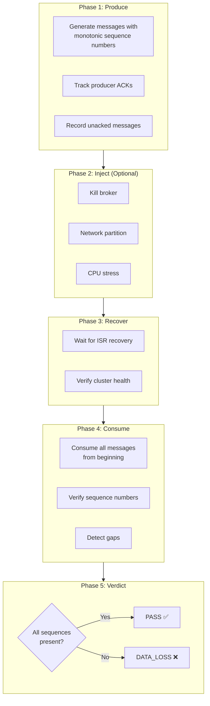
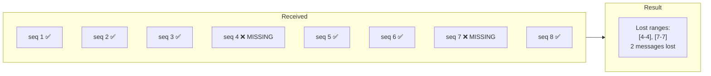
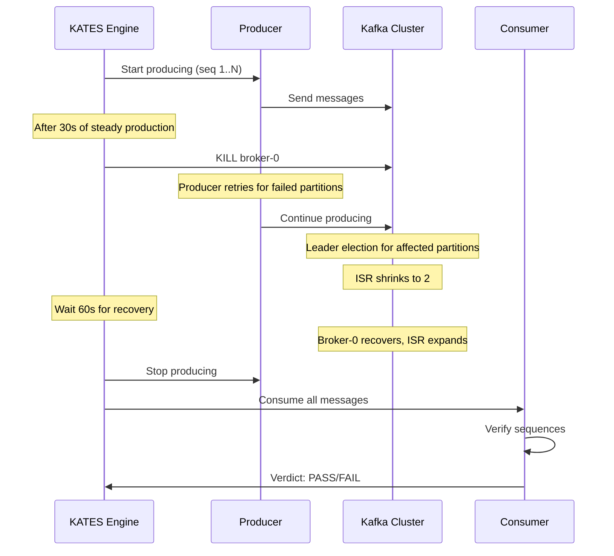

# Chapter 8: Data Integrity Verification

Data integrity is the highest-stakes property of any messaging system. This chapter explains how KATES verifies that Kafka delivers on its durability and ordering guarantees — and how to test these guarantees under failure conditions.

## Why Data Integrity Matters

Kafka is often used as the backbone of critical data pipelines:

- Financial transactions that must never be lost or duplicated
- Event sourcing systems where ordering determines correctness
- CDC (Change Data Capture) pipelines where data loss means inconsistency
- Audit logs where completeness is a regulatory requirement

A cluster that performs well but occasionally loses messages is worse than one that's slow but reliable.

## The Integrity Verification Pipeline



## Sequence Number Tracking

Each message in an INTEGRITY test carries a metadata payload:

```json
{
  "seq": 42,
  "producerId": "p-0",
  "timestampMs": 1708012345678,
  "crc32": "a1b2c3d4"
}
```

| Field | Purpose |
|-------|---------|
| `seq` | Monotonically increasing sequence number |
| `producerId` | Identifies which producer sent the message |
| `timestampMs` | Wall-clock time of production |
| `crc32` | CRC32 checksum of the payload for corruption detection |

### Producer-Side Tracking

The producer maintains:

- **Total sent** — total messages submitted to the Kafka producer
- **Total ACKed** — messages for which the broker confirmed persistence
- **ACK gaps** — sequence numbers that were sent but never ACKed (timeout or error)

### Consumer-Side Verification

The consumer reads all messages and builds a bitmap of received sequence numbers:



## Integrity Modes

### Standard Integrity

Uses `acks=all` and verifies that all ACKed messages are consumable:

```bash
kates test create --type INTEGRITY --records 100000 --acks all --wait
```

Expected result: **zero data loss**. If messages are ACKed with `acks=all`, Kafka guarantees they are persisted on `min.insync.replicas` brokers.

### Idempotent Integrity

Enables Kafka's producer idempotency to verify exactly-once delivery to the log:

```bash
kates test create --type INTEGRITY --records 100000 --wait
# Idempotency is enabled by default
```

With idempotency, even if the producer retries a send (due to transient network errors), the broker deduplicates it. The consumer should see each sequence number exactly once.

### Transactional Integrity

Enables Kafka transactions for the strongest guarantee — exactly-once processing:

```bash
# Scaffold a transactional integrity test
kates test scaffold --type INTEGRITY -o integrity-tx.yaml
# Edit the YAML to enable transactions
kates test apply -f integrity-tx.yaml --wait
```

## Integrity Under Chaos

The real power of integrity testing emerges when combined with fault injection. KATES provides a dedicated `INTEGRITY_CHAOS` scaffold:



### What Gets Verified

| Property | How Verified |
|----------|-------------|
| **Zero data loss** | Every ACKed sequence number is consumed |
| **No silent drops** | Messages that timed out are tracked separately from ACKed ones |
| **Ordering per partition** | Sequence numbers within each partition are monotonically increasing |
| **No duplication** | With idempotency enabled, each sequence appears exactly once |
| **ACK consistency** | An ACKed message is always persisted; an unacked message may or may not be |

### Timeline Events

The integrity test records a timeline of significant events:

```bash
kates test get <id>
```

Output includes:

| Timestamp | Type | Detail |
|:-:|---|---|
| 1708012345000 | PRODUCE_START | Started producing 100,000 records |
| 1708012375000 | FAULT_INJECTED | Killed broker-0 |
| 1708012376000 | ISR_SHRINK | Partition 0 ISR: [0,1,2] → [1,2] |
| 1708012378000 | LEADER_CHANGE | Partition 0 leader: 0 → 1 |
| 1708012380000 | PRODUCE_ERROR | Timeout on 3 messages (retrying) |
| 1708012395000 | BROKER_RECOVERY | Broker 0 rejoined |
| 1708012410000 | ISR_EXPAND | Partition 0 ISR: [1,2] → [0,1,2] |
| 1708012415000 | PRODUCE_COMPLETE | All 100,000 records produced |
| 1708012420000 | CONSUME_COMPLETE | All 100,000 records consumed |
| 1708012420001 | VERDICT | PASS — zero data loss |

## Interpreting Integrity Results

### PASS — Zero Data Loss

```
  ✓ Data Integrity
    Sent       100,000
    Acked      100,000
    Received   100,000
    Lost            0
    Duplicates      0
    Mode       idempotent
    Verdict    PASS ✅
```

This is the expected result for a properly configured cluster with `acks=all` and `min.insync.replicas=2`, even during single-broker failures.

### DATA_LOSS — Messages Missing

```
  ✗ Data Integrity
    Sent       100,000
    Acked       99,997
    Received    99,995
    Lost            2
    Duplicates      0
    Lost Ranges [45231-45231], [78442-78442]
    Verdict    DATA_LOSS ❌
```

Data loss indicates a serious issue. Common causes:

| Cause | How to Diagnose |
|-------|----------------|
| `acks=1` (not `all`) | Leader crashed before replication |
| `min.insync.replicas=1` | Not enough replicas to survive broker loss |
| Unclean leader election | `unclean.leader.election.enable=true` |
| Log truncation | Follower promoted with less data than old leader |

### DATA_LOSS with ACK Gaps

```
  ✗ Data Integrity
    Sent       100,000
    Acked       99,990
    Received    99,990
    Lost            0
    ACK Gaps       10
    Verdict    PASS (with warnings) ⚠
```

This means 10 messages were never ACKed (producer timeout), but no ACKed messages were lost. The 10 unacked messages may or may not be in the log — this is expected behavior when a broker crashes during a produce request.

## Best Practices

### 1. Always Run Integrity Tests Before Configuration Changes

Before changing `min.insync.replicas`, replication factor, or `acks` settings, run an integrity test to establish a baseline, then run another after the change.

### 2. Combine with Every Disruption Type

Each disruption type can expose different integrity issues:

| Disruption | Integrity Risk |
|-----------|---------------|
| `POD_KILL` | Messages in page cache not flushed to disk |
| `NETWORK_PARTITION` | Split-brain; both sides accepting writes |
| `DISK_FILL` | Log segments can't be written |
| `ROLLING_RESTART` | Brief window during graceful shutdown |
| `CPU_STRESS` | Replication falls behind, ISR shrinks |

### 3. Use Sufficient Record Count

10,000 records might not expose intermittent issues. Use 100,000+ for meaningful verification.

### 4. Test with Production-Like Configuration

Integrity tests are only meaningful if the topic configuration matches production:
- Same replication factor
- Same `min.insync.replicas`
- Same `acks` mode
- Same number of partitions
