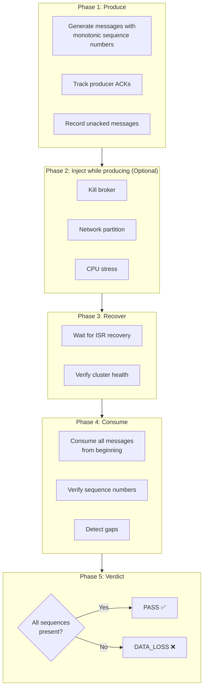
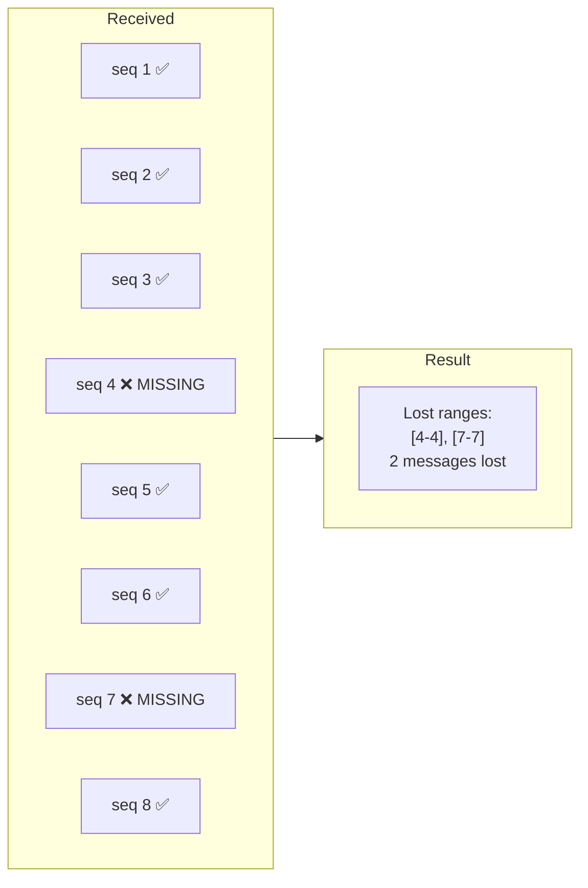
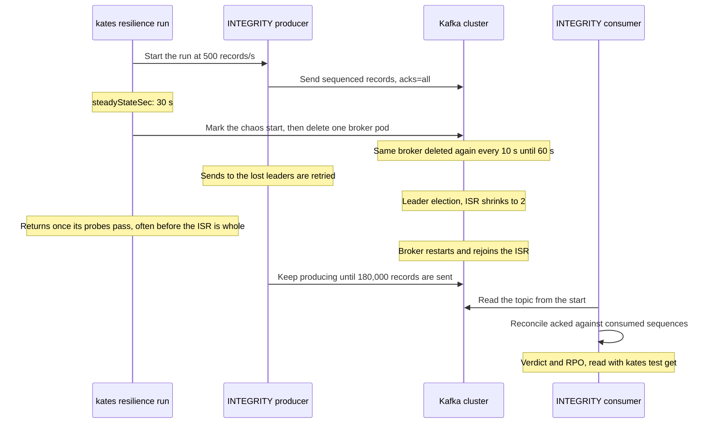

# Data Integrity Verification

Data integrity is the highest-stakes property of any messaging system. This chapter explains how Kates verifies that Kafka delivers on its durability and ordering guarantees — and how to test these guarantees under failure conditions.

It's written for engineers who run Kafka where losing a message costs more than delivering it slowly. After this chapter, you can:

- Run an INTEGRITY test and know which producer guarantees it exercises: `acks=all` durability and idempotence, but not transactions
- Read a Data Integrity report and distinguish real data loss from harmless unacked sends
- Prove durability under failure by pairing an integrity run with live fault injection
- Trace a DATA_LOSS verdict to its cause using the Lost Ranges table and the Integrity Timeline

## Why Data Integrity Matters

Kafka is often used as the backbone of critical data pipelines:

- Financial transactions that must never be lost or duplicated
- Event sourcing systems where ordering determines correctness
- CDC (Change Data Capture) pipelines where data loss means inconsistency
- Audit logs where completeness is a regulatory requirement

A cluster that performs well but occasionally loses messages is worse than one that's slow but reliable.

## The Integrity Verification Pipeline


```mermaid
graph TB
    subgraph Produce["Phase 1: Produce"]
        P1[Generate messages with<br/>monotonic sequence numbers]
        P2[Track producer ACKs]
        P3[Record unacked messages]
    end
    
    subgraph Inject["Phase 2: Inject while producing (Optional)"]
        I1[Kill broker]
        I2[Network partition]
        I3[CPU stress]
    end
    
    subgraph Recover["Phase 3: Recover"]
        R1[Wait for ISR recovery]
        R2[Verify cluster health]
    end
    
    subgraph Consume["Phase 4: Consume"]
        C1[Consume all messages<br/>from beginning]
        C2[Verify sequence numbers]
        C3[Detect gaps]
    end
    
    subgraph Verdict["Phase 5: Verdict"]
        V1{All sequences<br/>present?}
        PASS[PASS ✅]
        FAIL[DATA_LOSS ❌]
    end
    
    Produce --> Inject
    Inject --> Recover
    Recover --> Consume
    Consume --> Verdict
    V1 -->|Yes| PASS
    V1 -->|No| FAIL
```

## Sequence Number Tracking

Each message in an INTEGRITY test carries a 28-byte binary header (`SequencedPayload`), zero-padded to the configured record size:

```text
[8 bytes] sequence number   (long)
[8 bytes] timestamp nanos   (long)
[8 bytes] run ID hash       (long)
[4 bytes] CRC32             (int — checksum of the first 24 bytes)
[N bytes] zero padding      (to match target record size)
```

| Field | Purpose |
|-------|---------|
| `sequence` | Monotonically increasing sequence number |
| `timestampNanos` | Monotonic send timestamp, used for RTO computation |
| `runIdHash` | Stable hash of the run ID, isolates records from other runs |
| `crc32` | CRC32 checksum of the header for corruption detection |

### Producer-Side Tracking

The producer maintains:

- **Total sent** — total messages submitted to the Kafka producer
- **Total ACKed** — messages for which the broker confirmed persistence
- **Total failed** — sends that returned an error in the producer callback
- **Failure windows** — continuous periods between a failed send and the next successful ACK, used to compute producer-side RTO

### Consumer-Side Verification

The consumer reads all messages and builds a bitmap of received sequence numbers:


```mermaid
graph LR
    subgraph Received
        direction LR
        S1["seq 1 ✅"]
        S2["seq 2 ✅"]
        S3["seq 3 ✅"]
        S4["seq 4 ❌ MISSING"]
        S5["seq 5 ✅"]
        S6["seq 6 ✅"]
        S7["seq 7 ❌ MISSING"]
        S8["seq 8 ✅"]
    end
    
    subgraph Result
        LOST["Lost ranges:<br/>[4-4], [7-7]<br/>2 messages lost"]
    end
    
    Received --> Result
```

## Integrity Modes

::: {.callout-important}
**`enableIdempotence`, `enableTransactions` and `enableCrc` reach the run**

A scenario file, a resilience file and an API call can each set them. `enableIdempotence` becomes the producer's `enable.idempotence`; left out, the Kafka producer decides, and it enables idempotence whenever `acks` is `all`, so the standard and idempotent modes below differ only in that the second asks for it. `enableTransactions: true` makes the producer transactional and the verifying consumer read with `read_committed`. `enableCrc: false` turns off the per-record CRC check. The Kafka producer can be idempotent or transactional only with `acks=all`, and a transactional producer is always idempotent, so the backend refuses a request that asks otherwise before the run starts: `POST /api/tests` answers `400` naming the field, and so does `POST /api/resilience`, before any fault is injected, which `kates resilience run` reports as its error. `enableTransactions` commits every 100 records or every 10 seconds, whichever comes first, so a slow rate stays inside the producer's 60-second transaction timeout.
:::

### Standard Integrity

Uses `acks=all` and verifies that all ACKed messages are consumable:

```bash
kates test create --type INTEGRITY --records 100000 --acks all --wait
```

Expected result: **zero data loss**. If messages are ACKed with `acks=all`, Kafka guarantees they are persisted on `min.insync.replicas` brokers.

### Idempotent Integrity

Kafka's producer idempotency lets the broker discard a retried send it has already written, which gives exactly-once delivery to the log. The Kafka producer enables it by default whenever `acks` is `all`, the INTEGRITY default, and leaves it off when `acks` is `1` or `0`, so the standard run above is already idempotent. The file below asks for it with `enableIdempotence: true`, which sets the producer's `enable.idempotence`; with `acks: "1"` the backend would refuse the file, because the producer cannot be idempotent without `acks=all`:

```yaml
scenarios:
  - name: "Idempotent Integrity"
    type: INTEGRITY
    spec:
      records: 100000
      acks: "all"
      enableIdempotence: true
```

```bash
kates test apply -f idempotent-integrity.yaml --wait
```

With idempotency, even if the producer retries a send (due to transient network errors), the broker deduplicates it. The consumer should see each sequence number exactly once.

### Transactional Integrity

Kafka transactions add atomic, exactly-once writes on top of idempotence. The built-in `integrity-tx` template asks for transactions, idempotence and CRC verification, and the run has all three: its producer commits a transaction every 100 records, or sooner when 10 seconds pass first, and the verifying consumer reads with `read_committed`, so it counts only committed records. The run has one producer and one consumer whatever `parallelProducers` and `numConsumers` say:

```bash
# Export the built-in integrity-tx template, then run it
kates test scaffold export integrity-tx
kates test apply -f integrity-tx.yaml --wait
```

The exported `integrity-tx.yaml`:

```yaml
scenarios:
  - name: "Transactional Integrity Verification"
    type: INTEGRITY
    spec:
      records: 200000
      parallelProducers: 4
      recordSizeBytes: 512
      acks: "all"
      compressionType: "zstd"
      enableIdempotence: true
      enableTransactions: true
      enableCrc: true
      replicationFactor: 3
      minInsyncReplicas: 2
      numConsumers: 4
    validate:
      maxDataLossPercent: 0
      maxDuplicatePercent: 0
      maxOutOfOrder: 0
      maxCrcFailures: 0
      maxP99LatencyMs: 150
```

::: {.callout-important}
`kates test apply` gates on `maxDataLossPercent`, `maxOutOfOrder`, `maxCrcFailures` and `maxP99LatencyMs`, but not on `maxDuplicatePercent`: its validator has no duplicate gate and ignores the key. A run whose verdict is `DUPLICATES_DETECTED` can still show `✓ SLA Pass`, so read `Duplicates` and `Verdict` in `kates test get <id>`.
:::

## Integrity Under Chaos

The real power of integrity testing emerges when combined with fault injection — but only when the fault lands while the producer is writing, and the producer keeps writing until the cluster has recovered. A run that finishes before the fault is injected passes, and its verdict says nothing about the failure. `kates resilience run` handles the timing: it starts the INTEGRITY run, waits `steadyStateSec`, marks the moment on the run so the verifier can measure RPO against it, and triggers the fault (the chaos fields are covered in [Chaos Engineering in Practice](07-chaos-practice.md)). What is left to you is sizing the run so it outlasts the fault and the recovery:

```yaml
# integrity-chaos.yaml
testRequest:
  type: INTEGRITY
  spec:
    numRecords: 180000     # 180,000 records at 500 records/s: 360 s of producing
    throughput: 500        # records per second
    durationMs: 600000     # hard stop for the produce phase: 600 s
    acks: all
    replicationFactor: 3
    minInsyncReplicas: 2

chaosSpec:
  experimentName: broker-pod-kill
  disruptionType: POD_KILL
  targetNamespace: kafka
  targetLabel: "strimzi.io/component-type=kafka,strimzi.io/broker-role=true"
  chaosDurationSec: 30

steadyStateSec: 30
```

The arithmetic, counted from the start of the run:

| Event | Setting | Time |
|-------|---------|-----:|
| Fault triggered | `steadyStateSec` | 30 s |
| Fault over | + `chaosDurationSec` | 60 s |
| Produce phase over | `numRecords` ÷ `throughput` = 180,000 ÷ 500 | 360 s |

For a `POD_KILL`, LitmusChaos (the default chaos provider) deletes the chosen broker's pod, then deletes it again every 10 s until `chaosDurationSec` has passed, so the same broker goes down repeatedly between 30 s and 60 s. Litmus takes a few seconds to start its runner pod and to report its result, which moves the fault a little later than the table. The producer keeps writing for about five minutes after the fault is over, which gives the broker time to restart and rejoin the ISR, so records are written before, during, and after the failure.

The run's recovery wait does not change this sizing. After the fault, `kates resilience run` polls its probes every 5 s and returns as soon as they pass, or after `maxRecoveryWaitSec` ÷ 5 polls (24 with the default 120). The default `POD_KILL` probes pass while the ISR is still catching up, since the ISR probe tolerates up to 50 under-replicated partitions. The command therefore usually returns soon after the fault is over, before the broker is back in the ISR and while the producer is still writing. The produce phase stops at `numRecords` or at `durationMs`, whichever comes first, and the rate limiter never makes up time lost in a stall — a stall lengthens the run instead — so keep `durationMs` well above `numRecords` ÷ `throughput`.

The `spec` of a resilience file goes to the API as written, so it takes the API's field names — `numRecords`, `throughput`, `durationMs` — not a scenario file's. `throughput` is the rate the INTEGRITY producer honours. `kates test create --throughput` and a scenario file's `targetThroughput` send the same rate as `targetThroughput`, which sets `throughput` when the request leaves it out. INTEGRITY runs one producer and one consumer whatever `numProducers` and `numConsumers` say, so `throughput` is the whole rate. The selector `strimzi.io/component-type=kafka` alone also matches the KRaft controllers; adding `strimzi.io/broker-role=true` makes the fault pick one broker at random.

The combined flow looks like this:


```mermaid
sequenceDiagram
    participant Res as kates resilience run
    participant Producer as INTEGRITY producer
    participant Kafka as Kafka cluster
    participant Consumer as INTEGRITY consumer

    Res->>Producer: Start the run at 500 records/s
    Producer->>Kafka: Send sequenced records, acks=all
    Note over Res: steadyStateSec: 30 s
    Res->>Kafka: Mark the chaos start, then delete one broker pod
    Note over Kafka: Same broker deleted again every 10 s until 60 s
    Note over Producer: Sends to the lost leaders are retried
    Note over Kafka: Leader election, ISR shrinks to 2
    Note over Res: Returns once its probes pass, often before the ISR is whole
    Note over Kafka: Broker restarts and rejoins the ISR
    Producer->>Kafka: Keep producing until 180,000 records are sent
    Consumer->>Kafka: Read the topic from the start
    Consumer->>Consumer: Reconcile acked against consumed sequences
    Note over Consumer: Verdict and RPO, read with kates test get
```

Run it, checking the request first:

```bash
kates resilience run -f integrity-chaos.yaml --dry-run   # print the request, send nothing
kates resilience run -f integrity-chaos.yaml
```

`kates resilience run` prints the chaos outcome and the before/after impact analysis but not the integrity result, and it can return while the INTEGRITY run is still producing. Its `Status` is `COMPLETED` only when the chaos outcome's verdict is `Pass`. Anything else — `CHAOS_FAILED`, or a `Skipped` verdict when no chaos provider is available — means the fault may not have landed, and the integrity verdict then proves nothing about the failure. Read the verdict from the INTEGRITY run itself:

```bash
kates test list --type INTEGRITY   # newest first: the top row is this run
kates test watch <id>              # wait for produce, consume and verification
kates test get <id>
```

With three brokers, `replicationFactor: 3` and `minInsyncReplicas: 2`, expect `Lost 0`, `Duplicates 0`, `RPO 0 ms` and `Verdict ● PASS` in the Data Integrity section:

- `Lost 0` — every acknowledged record was consumed back.
- `Duplicates 0` — with `acks=all` the producer is idempotent, so its retries through the leader election write nothing twice.
- `RPO 0 ms` — a chaos start was marked on the run, and nothing written before it was lost. The mark is set just before the fault is triggered, so a Litmus experiment that then fails still gives `RPO 0 ms`: only `Status COMPLETED` from `kates resilience run` shows that the fault landed. `RPO not measured` means no chaos start reached the run, for one of two reasons. If the INTEGRITY run finished before the fault, resize it. If the chaos outcome's verdict is `Skipped`, the chaos provider is `noop` and injected nothing; resizing changes nothing, so set up a chaos provider first.
- `Producer RTO` appears only when a send failed outright. Retries the producer absorbs within its delivery timeout leave it out.

The verdict is `DATA_LOSS` if an acknowledged record is missing, otherwise `CORRUPTION` on a CRC failure, `ORDERING_VIOLATION` on a record out of order within its partition, `DUPLICATES_DETECTED` on a record consumed twice, and `PASS` when none of these occurred.

### What Gets Verified

| Property | How Verified |
|----------|-------------|
| **Zero data loss** | Every ACKed sequence number is consumed |
| **No silent drops** | Messages that timed out are tracked separately from ACKed ones |
| **Ordering per partition** | Sequence numbers within each partition are monotonically increasing |
| **No duplication** | With idempotency enabled, each sequence appears exactly once |
| **ACK consistency** | An ACKed message is always persisted; an unacked message may or may not be |

### Timeline Events

The verifier records a diagnostic timeline of integrity violations — CRC failures, ordering violations, lost ranges — plus a final summary event. `kates test get <id>` prints the last 20 events automatically in its "Integrity Timeline" section:

```bash
kates test get <id>
```

An example timeline from a run that lost one record (timestamps are epoch milliseconds):

| Timestamp | Type | Detail |
|:-:|---|---|
| 1767970801123 | CRC_FAILURE | partition=2 seq=45231 |
| 1767970802456 | OUT_OF_ORDER | partition=1 expected=78441 actual=78439 |
| 1767970803010 | LOST_RANGE | from=45231 to=45231 count=1 |
| 1767970803011 | SUMMARY | verdict=DATA_LOSS lost=1 duplicates=0 |

A clean run contains only the final `SUMMARY` event.

## Interpreting Integrity Results

### PASS — Zero Data Loss

```text
  ▸ Data Integrity
  Sent                     100.0K
  Acked                    100.0K
  Consumed                 100.0K
  Lost                     0
  Duplicates               0
  Data Loss                0.0000%
  RPO                      not measured
  CRC Failures             0
  Out of Order             0
  Verdict                  ● PASS
```

This is the expected result for a properly configured cluster with `acks=all` and `min.insync.replicas=2`, even during single-broker failures. `RPO` reads `not measured` on a standalone run: it gets a value only when a resilience run marks a fault on the run, as in Integrity Under Chaos above.

### DATA_LOSS — Messages Missing

```text
  ▸ Data Integrity
  Sent                     100.0K
  Acked                    100.0K
  Consumed                 100.0K
  Lost                     2
  Duplicates               0
  Data Loss                0.0020%
  RPO                      not measured
  CRC Failures             0
  Out of Order             0
  Verdict                  ○ DATA_LOSS

  ▸ Lost Ranges
  From Seq  To Seq  Count
  ────────  ──────  ─────
  45231     45231   1
  78442     78442   1
```

(Counts are abbreviated in the display — the `Lost` count, `Data Loss` percentage, and `Lost Ranges` table carry the exact numbers.)

Data loss indicates a serious issue. Common causes:

| Cause | How to Diagnose |
|-------|----------------|
| `acks=1` (not `all`) | Leader crashed before replication |
| `min.insync.replicas=1` | Not enough replicas to survive broker loss |
| Unclean leader election | `unclean.leader.election.enable=true` |
| Log truncation | Follower promoted with less data than old leader |

### PASS with Unacked Messages

```text
  ▸ Data Integrity
  Sent                     100.0K
  Acked                    100.0K
  Consumed                 100.0K
  Lost                     0
  Duplicates               0
  Data Loss                0.0000%
  Producer RTO             2340 ms
  Max RTO                  2340 ms
  RPO                      0 ms
  CRC Failures             0
  Out of Order             0
  Verdict                  ● PASS
```

In this run some messages were never ACKed — the producer hit errors during a broker failure, visible as a non-zero `Producer RTO` (the longest window between a failed send and the next successful ACK). Only ACKed messages carry a durability promise, so unacked sends are excluded from the loss calculation and the verdict remains PASS. The unacked messages may or may not be in the log — this is expected behavior when a broker crashes during a produce request.

## Best Practices

### 1. Always Run Integrity Tests Before Configuration Changes

Before changing `min.insync.replicas`, replication factor, or `acks` settings, run an integrity test to establish a baseline, then run another after the change.

### 2. Combine with Every Disruption Type

Each disruption type can expose different integrity issues:

| Disruption | Integrity Risk |
|-----------|---------------|
| `POD_KILL` | Messages in page cache not flushed to disk |
| `NETWORK_PARTITION` | Split-brain; both sides accepting writes |
| `DISK_FILL` | Log segments can't be written |
| `ROLLING_RESTART` | Brief window during graceful shutdown |
| `CPU_STRESS` | Replication falls behind, ISR shrinks |

### 3. Use Sufficient Record Count

10,000 records might not expose intermittent issues. Use 100,000+ for meaningful verification.

### 4. Test with Production-Like Configuration

Integrity tests are only meaningful if the topic configuration matches production:
- Same replication factor
- Same `min.insync.replicas`
- Same `acks` mode
- Same number of partitions

## Complete Walkthrough

This section walks through a full data integrity verification from start to finish, showing exactly what to expect at each stage.

### Step 1 — Run the INTEGRITY Test

```bash
# Export the built-in integrity-tx template, then run it
kates test scaffold export integrity-tx
kates test apply -f integrity-tx.yaml --wait
```

This runs a 200,000-record INTEGRITY test with `acks=all`, CRC verification and an idempotent, transactional producer (its contents are in the Transactional Integrity section above). For a quick ad-hoc run without a scenario file:

```bash
kates test create --type INTEGRITY --records 100000 --acks all --wait
```

Ad-hoc `create` runs use the backend defaults: `acks=all`, which makes the producer idempotent, and CRC verification on. Transactions stay off: `kates test create` has no flag for them, so a transactional run needs a scenario file with `enableTransactions: true`, a resilience file, or the API (see the callout under Integrity Modes).

### Step 2 — Observe Output During the Test

With `--wait`, `kates test apply` shows a spinner per scenario and a summary table once each test finishes, including the SLA gates from the `validate:` block:

```text
  Applying 1 scenario(s) from integrity-tx.yaml

  ▸ Transactional Integrity Verification (INTEGRITY)...
  ✓   Created: a1b2c3d4
  ✓ Transactional Integrity Verification → ● DONE

  ▸ Summary
  Scenario                               ID        Status  Note
  ─────────────────────────────────────  ────────  ──────  ──────────
  Transactional Integrity Verification   a1b2c3d4  DONE    ✓ SLA Pass
```

Internally the test runs its produce phase to completion, then consumes everything back from the beginning, then reconciles ACKed against consumed sequence numbers. The topic is named after the test type (`integrity-test`) unless overridden with the `topic` spec field.

### Step 3 — Read the Verification Report

```bash
kates test get <id>
```

The report starts with the test details, configuration, and per-phase results; for INTEGRITY tests it ends with a Data Integrity section. A successful `integrity-tx` run produces:

```text
  ▸ Data Integrity
  Sent                     200.0K
  Acked                    200.0K
  Consumed                 200.0K
  Lost                     0
  Duplicates               0
  Data Loss                0.0000%
  RPO                      not measured
  CRC Failures             0
  Out of Order             0
  Verdict                  ● PASS
```

### Step 4 — Interpret Each Field

| Field | Meaning | Expected Value | Concern If... |
|-------|---------|:--------------:|---------------|
| **Sent** | Total messages submitted to the Kafka producer | Matches `records` | Lower than expected: producer errors or timeouts |
| **Acked** | Messages confirmed persisted by the broker | Equal to Sent | Less than Sent: broker rejected or timed out messages |
| **Consumed** | Messages read back from the topic | Equal to Acked | Less than Acked: **data loss detected** |
| **Lost** | ACKed messages that were not consumed | `0` | Any non-zero value: serious durability issue |
| **Duplicates** | Messages received more than once | `0` (with idempotency) | Non-zero without idempotency is expected; non-zero with idempotency is a bug |
| **Data Loss** | Lost as a percentage of Sent | `0.0000%` | Any non-zero value: serious durability issue |
| **CRC Failures** | Messages whose CRC32 checksum didn't match | `0` | Non-zero: data corruption in transit or at rest |
| **Out of Order** | Messages received with a lower sequence than a prior message in the same partition | `0` | Non-zero: possible log truncation or unclean election |
| **Producer RTO** | Longest window between a failed send and the next successful ACK (shown only after producer stalls) | Absent | Large values: slow leader failover |
| **Consumer RTO** | Duration of the first gap observed in the consumed sequence stream (shown only after consumer stalls) | Absent | Large values: slow recovery on the read path |
| **Max RTO** | The larger of Producer RTO and Consumer RTO (shown only when one of them is) | Absent | Large values: slow recovery |
| **RPO** | How long before the fault the oldest lost acknowledged record was sent | `not measured` standalone, `0 ms` under chaos | Non-zero: acknowledged writes from before the fault were lost |

### Step 5 — What a Failure Looks Like

If the test detects data loss, the Data Integrity section changes to:

```text
  ▸ Data Integrity
  Sent                     200.0K
  Acked                    200.0K
  Consumed                 200.0K
  Lost                     3
  Duplicates               0
  Data Loss                0.0015%
  RPO                      not measured
  CRC Failures             1
  Out of Order             0
  Verdict                  ○ DATA_LOSS

  ▸ Lost Ranges
  From Seq  To Seq  Count
  ────────  ──────  ─────
  23401     23401   1
  67882     67883   2

  ▸ Integrity Timeline
  Timestamp      Type         Detail
  ─────────────  ───────────  ─────────────────────────────────
  1767970801123  CRC_FAILURE  partition=2 seq=51200
  1767970803010  LOST_RANGE   from=23401 to=23401 count=1
  1767970803010  LOST_RANGE   from=67882 to=67883 count=2
  1767970803011  SUMMARY      verdict=DATA_LOSS lost=3 duplicates=0
```

Reading this report:

- Lost message at seq 23401: single gap — likely a broker crash during ACK
- Lost messages at seq 67882-67883: consecutive gap — possible log truncation
- CRC failure: message payload corrupted — check disk health

### What to Investigate on Failure

1. **Check `acks` setting** — if `acks=1`, the leader may have crashed before replication. Switch to `acks=all`.
2. **Check `min.insync.replicas`** — if set to `1`, a single broker failure can cause data loss. Set to `2`.
3. **Check for unclean leader election** — run `kubectl logs <broker-pod> -n kafka | grep 'unclean'`. Disable `unclean.leader.election.enable` in production.
4. **Check disk health** — CRC failures suggest disk corruption. Run `kubectl exec <broker-pod> -n kafka -- df -h` and check for I/O errors in `dmesg`.
5. **Check timeline events** — run `kates test get <id>`; the Integrity Timeline section prints automatically and shows exactly which sequences failed CRC checks, arrived out of order, or were lost.

::: {.callout-tip}
**Try it**

Prove zero data loss under a broker failure with one resilience run, using the `integrity-chaos.yaml` from Integrity Under Chaos above — 360 s of production at 500 records/s, with a broker killed 30 s in:

```bash
# Check the request, then run it
kates resilience run -f integrity-chaos.yaml --dry-run
kates resilience run -f integrity-chaos.yaml

# Find the INTEGRITY run (newest first), wait for it, then read the verdict and timeline
kates test list --type INTEGRITY
kates test watch <id>
kates test get <id>
```

Expect `Status COMPLETED` from `kates resilience run`, then `Lost 0`, `RPO 0 ms` and `Verdict ● PASS` from `kates test get`: the producer retries through the leader election, and every acknowledged record is consumed back. Any other `Status`, or `RPO not measured`, means the run did not overlap a fault that landed, and the PASS proves nothing about the failure.
:::

## Summary

- Every INTEGRITY message carries a binary header — sequence number, timestamp, run ID hash, CRC32 checksum — so the verifier detects loss, duplication, reordering, and corruption independently of Kafka's own bookkeeping.
- Only ACKed messages carry a durability promise: unacked sends during a broker crash are excluded from the loss calculation, so a PASS with a non-zero Producer RTO is expected behavior.
- Standard mode verifies `acks=all` durability, and with `acks=all` the producer is idempotent by default, which adds exactly-once delivery to the log. `enableIdempotence`, `enableTransactions` and `enableCrc` reach the producer and the verifier, so the `integrity-tx` template tests a transactional producer read with `read_committed`.
- Integrity tests earn their keep under chaos: one `kates resilience run`, rate-limited with `throughput` so the produce phase outlasts the fault and the recovery, verifies the guarantees during a real failure. A run that finishes before the fault proves nothing.
- A DATA_LOSS verdict usually traces back to `acks=1`, `min.insync.replicas=1`, or unclean leader election — the Lost Ranges table and Integrity Timeline show exactly which sequences vanished.

With integrity verified, the next question is what the cluster was doing while the test ran — [Observability & Monitoring](09-observability.md) covers the metrics, dashboards, and alerts that answer it.
