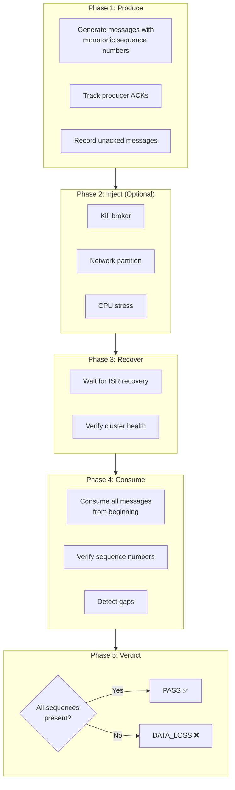
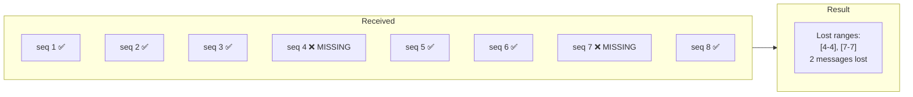
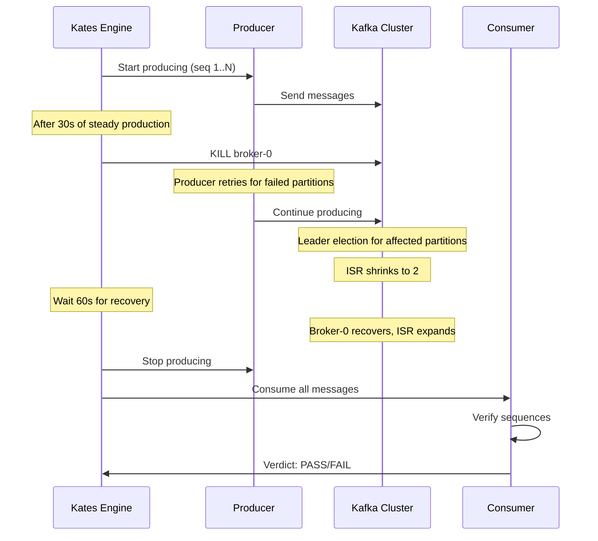

# Chapter 8: Data Integrity Verification

Data integrity is the highest-stakes property of any messaging system. This chapter explains how Kates verifies that Kafka delivers on its durability and ordering guarantees — and how to test these guarantees under failure conditions.

## Why Data Integrity Matters

Kafka is often used as the backbone of critical data pipelines:

- Financial transactions that must never be lost or duplicated
- Event sourcing systems where ordering determines correctness
- CDC (Change Data Capture) pipelines where data loss means inconsistency
- Audit logs where completeness is a regulatory requirement

A cluster that performs well but occasionally loses messages is worse than one that's slow but reliable.

## The Integrity Verification Pipeline


```mermaid
graph TB
    subgraph Produce["Phase 1: Produce"]
        P1[Generate messages with<br/>monotonic sequence numbers]
        P2[Track producer ACKs]
        P3[Record unacked messages]
    end
    
    subgraph Inject["Phase 2: Inject (Optional)"]
        I1[Kill broker]
        I2[Network partition]
        I3[CPU stress]
    end
    
    subgraph Recover["Phase 3: Recover"]
        R1[Wait for ISR recovery]
        R2[Verify cluster health]
    end
    
    subgraph Consume["Phase 4: Consume"]
        C1[Consume all messages<br/>from beginning]
        C2[Verify sequence numbers]
        C3[Detect gaps]
    end
    
    subgraph Verdict["Phase 5: Verdict"]
        V1{All sequences<br/>present?}
        PASS[PASS ✅]
        FAIL[DATA_LOSS ❌]
    end
    
    Produce --> Inject
    Inject --> Recover
    Recover --> Consume
    Consume --> Verdict
    V1 -->|Yes| PASS
    V1 -->|No| FAIL
```

## Sequence Number Tracking

Each message in an INTEGRITY test carries a metadata payload:

```json
{
  "seq": 42,
  "producerId": "p-0",
  "timestampMs": 1708012345678,
  "crc32": "a1b2c3d4"
}
```

| Field | Purpose |
|-------|---------|
| `seq` | Monotonically increasing sequence number |
| `producerId` | Identifies which producer sent the message |
| `timestampMs` | Wall-clock time of production |
| `crc32` | CRC32 checksum of the payload for corruption detection |

### Producer-Side Tracking

The producer maintains:

- **Total sent** — total messages submitted to the Kafka producer
- **Total ACKed** — messages for which the broker confirmed persistence
- **ACK gaps** — sequence numbers that were sent but never ACKed (timeout or error)

### Consumer-Side Verification

The consumer reads all messages and builds a bitmap of received sequence numbers:


```mermaid
graph LR
    subgraph Received
        S1["seq 1 ✅"]
        S2["seq 2 ✅"]
        S3["seq 3 ✅"]
        S4["seq 4 ❌ MISSING"]
        S5["seq 5 ✅"]
        S6["seq 6 ✅"]
        S7["seq 7 ❌ MISSING"]
        S8["seq 8 ✅"]
    end
    
    subgraph Result
        LOST["Lost ranges:<br/>[4-4], [7-7]<br/>2 messages lost"]
    end
    
    Received --> Result
```

## Integrity Modes

### Standard Integrity

Uses `acks=all` and verifies that all ACKed messages are consumable:

```bash
kates test create --type INTEGRITY --records 100000 --acks all --wait
```

Expected result: **zero data loss**. If messages are ACKed with `acks=all`, Kafka guarantees they are persisted on `min.insync.replicas` brokers.

### Idempotent Integrity

Enables Kafka's producer idempotency to verify exactly-once delivery to the log:

```bash
kates test create --type INTEGRITY --records 100000 --wait
# Idempotency is enabled by default
```

With idempotency, even if the producer retries a send (due to transient network errors), the broker deduplicates it. The consumer should see each sequence number exactly once.

### Transactional Integrity

Enables Kafka transactions for the strongest guarantee — exactly-once processing:

```bash
# Scaffold a transactional integrity test
kates test scaffold --type INTEGRITY -o integrity-tx.yaml
# Edit the YAML to enable transactions
kates test apply -f integrity-tx.yaml --wait
```

## Integrity Under Chaos

The real power of integrity testing emerges when combined with fault injection. Kates provides a dedicated `INTEGRITY_CHAOS` scaffold:


```mermaid
sequenceDiagram
    participant Engine as Kates Engine
    participant Producer as Producer
    participant Kafka as Kafka Cluster
    participant Consumer as Consumer
    
    Engine->>Producer: Start producing (seq 1..N)
    Producer->>Kafka: Send messages
    
    Note over Engine: After 30s of steady production
    Engine->>Kafka: KILL broker-0
    
    Note over Producer: Producer retries for failed partitions
    Producer->>Kafka: Continue producing
    
    Note over Kafka: Leader election for affected partitions
    Note over Kafka: ISR shrinks to 2
    
    Note over Engine: Wait 60s for recovery
    Note over Kafka: Broker-0 recovers, ISR expands
    
    Engine->>Producer: Stop producing
    Engine->>Consumer: Consume all messages
    Consumer->>Consumer: Verify sequences
    Consumer->>Engine: Verdict: PASS/FAIL
```

### What Gets Verified

| Property | How Verified |
|----------|-------------|
| **Zero data loss** | Every ACKed sequence number is consumed |
| **No silent drops** | Messages that timed out are tracked separately from ACKed ones |
| **Ordering per partition** | Sequence numbers within each partition are monotonically increasing |
| **No duplication** | With idempotency enabled, each sequence appears exactly once |
| **ACK consistency** | An ACKed message is always persisted; an unacked message may or may not be |

### Timeline Events

The integrity test records a timeline of significant events:

```bash
kates test get <id>
```

Output includes:

| Timestamp | Type | Detail |
|:-:|---|---|
| 1708012345000 | PRODUCE_START | Started producing 100,000 records |
| 1708012375000 | FAULT_INJECTED | Killed broker-0 |
| 1708012376000 | ISR_SHRINK | Partition 0 ISR: [0,1,2] → [1,2] |
| 1708012378000 | LEADER_CHANGE | Partition 0 leader: 0 → 1 |
| 1708012380000 | PRODUCE_ERROR | Timeout on 3 messages (retrying) |
| 1708012395000 | BROKER_RECOVERY | Broker 0 rejoined |
| 1708012410000 | ISR_EXPAND | Partition 0 ISR: [1,2] → [0,1,2] |
| 1708012415000 | PRODUCE_COMPLETE | All 100,000 records produced |
| 1708012420000 | CONSUME_COMPLETE | All 100,000 records consumed |
| 1708012420001 | VERDICT | PASS — zero data loss |

## Interpreting Integrity Results

### PASS — Zero Data Loss

```
  ✓ Data Integrity
    Sent       100,000
    Acked      100,000
    Received   100,000
    Lost            0
    Duplicates      0
    Mode       idempotent
    Verdict    PASS ✅
```

This is the expected result for a properly configured cluster with `acks=all` and `min.insync.replicas=2`, even during single-broker failures.

### DATA_LOSS — Messages Missing

```
  ✗ Data Integrity
    Sent       100,000
    Acked       99,997
    Received    99,995
    Lost            2
    Duplicates      0
    Lost Ranges [45231-45231], [78442-78442]
    Verdict    DATA_LOSS ❌
```

Data loss indicates a serious issue. Common causes:

| Cause | How to Diagnose |
|-------|----------------|
| `acks=1` (not `all`) | Leader crashed before replication |
| `min.insync.replicas=1` | Not enough replicas to survive broker loss |
| Unclean leader election | `unclean.leader.election.enable=true` |
| Log truncation | Follower promoted with less data than old leader |

### DATA_LOSS with ACK Gaps

```
  ✗ Data Integrity
    Sent       100,000
    Acked       99,990
    Received    99,990
    Lost            0
    ACK Gaps       10
    Verdict    PASS (with warnings) ⚠
```

This means 10 messages were never ACKed (producer timeout), but no ACKed messages were lost. The 10 unacked messages may or may not be in the log — this is expected behavior when a broker crashes during a produce request.

## Best Practices

### 1. Always Run Integrity Tests Before Configuration Changes

Before changing `min.insync.replicas`, replication factor, or `acks` settings, run an integrity test to establish a baseline, then run another after the change.

### 2. Combine with Every Disruption Type

Each disruption type can expose different integrity issues:

| Disruption | Integrity Risk |
|-----------|---------------|
| `POD_KILL` | Messages in page cache not flushed to disk |
| `NETWORK_PARTITION` | Split-brain; both sides accepting writes |
| `DISK_FILL` | Log segments can't be written |
| `ROLLING_RESTART` | Brief window during graceful shutdown |
| `CPU_STRESS` | Replication falls behind, ISR shrinks |

### 3. Use Sufficient Record Count

10,000 records might not expose intermittent issues. Use 100,000+ for meaningful verification.

### 4. Test with Production-Like Configuration

Integrity tests are only meaningful if the topic configuration matches production:
- Same replication factor
- Same `min.insync.replicas`
- Same `acks` mode
- Same number of partitions

## Complete Walkthrough

This section walks through a full data integrity verification from start to finish, showing exactly what to expect at each stage.

### Step 1 — Run the INTEGRITY Test

```bash
kates test create \
  --type INTEGRITY \
  --records 100000 \
  --acks all \
  --enable-idempotence \
  --enable-crc \
  --wait \
  --label walkthrough=demo
```

### Step 2 — Observe Output During the Test

While the test runs, you'll see real-time progress:

```
  ▸ Integrity Test (INTEGRITY)
    Topic:       kates-integrity-f8a2c1d3
    Records:     100,000
    Acks:        all
    Idempotent:  true
    CRC:         enabled

    Phase 1/4: Producing...
      [████████████████████████████████████████] 100,000/100,000 (100%)
      Produced:  100,000 records in 6.2s (16,129 rec/s)
      ACK gaps:  0

    Phase 2/4: Waiting for cluster stabilization... (5s)

    Phase 3/4: Consuming...
      [████████████████████████████████████████] 100,000/100,000 (100%)
      Consumed:  100,000 records in 3.8s (26,315 rec/s)

    Phase 4/4: Verifying sequences...
```

### Step 3 — Read the Verification Report

```bash
kates test get <id>
```

A successful run produces:

```
  ✓ Data Integrity Verification Report
  ┌────────────────────┬────────────┐
  │ Field              │ Value      │
  ├────────────────────┼────────────┤
  │ Produced           │ 100,000    │
  │ ACKed              │ 100,000    │
  │ Consumed           │ 100,000    │
  │ Lost               │ 0          │
  │ Duplicated         │ 0          │
  │ Out-of-Order       │ 0          │
  │ CRC Failures       │ 0          │
  │ Corrupted          │ 0          │
  │ Mode               │ idempotent │
  │ Verdict            │ PASS ✅    │
  └────────────────────┴────────────┘
```

### Step 4 — Interpret Each Field

| Field | Meaning | Expected Value | Concern If... |
|-------|---------|:--------------:|---------------|
| **Produced** | Total messages submitted to the Kafka producer | Matches `--records` | Lower than expected: producer errors or timeouts |
| **ACKed** | Messages confirmed persisted by the broker | Equal to Produced | Less than Produced: broker rejected or timed out messages |
| **Consumed** | Messages read back from the topic | Equal to ACKed | Less than ACKed: **data loss detected** |
| **Lost** | ACKed messages that were not consumed | `0` | Any non-zero value: serious durability issue |
| **Duplicated** | Messages received more than once | `0` (with idempotency) | Non-zero without idempotency is expected; non-zero with idempotency is a bug |
| **Out-of-Order** | Messages received in wrong sequence within a partition | `0` | Non-zero: possible log truncation or unclean election |
| **CRC Failures** | Messages whose CRC32 checksum didn't match | `0` | Non-zero: data corruption in transit or at rest |
| **Corrupted** | Messages with unparseable payload | `0` | Non-zero: serialization issue or disk corruption |

### Step 5 — What a Failure Looks Like

If the test detects data loss, the output changes to:

```
  ✗ Data Integrity Verification Report
  ┌────────────────────┬───────────────────────────────────┐
  │ Field              │ Value                             │
  ├────────────────────┼───────────────────────────────────┤
  │ Produced           │ 100,000                           │
  │ ACKed              │ 99,998                            │
  │ Consumed           │ 99,995                            │
  │ Lost               │ 3                                 │
  │ Duplicated         │ 0                                 │
  │ Lost Ranges        │ [23401-23401], [67882-67883]      │
  │ CRC Failures       │ 1                                 │
  │ Corrupted          │ 1                                 │
  │ Verdict            │ DATA_LOSS ❌                      │
  └────────────────────┴───────────────────────────────────┘

  Investigation pointers:
    • Lost messages at seq 23401: single gap — likely broker crash during ACK
    • Lost messages at seq 67882-67883: consecutive gap — possible log truncation
    • CRC failure: message payload corrupted — check disk health
```

### What to Investigate on Failure

1. **Check `acks` setting** — if `acks=1`, the leader may have crashed before replication. Switch to `acks=all`.
2. **Check `min.insync.replicas`** — if set to `1`, a single broker failure can cause data loss. Set to `2`.
3. **Check for unclean leader election** — run `kubectl logs <broker-pod> -n kafka | grep 'unclean'`. Disable `unclean.leader.election.enable` in production.
4. **Check disk health** — CRC failures suggest disk corruption. Run `kubectl exec <broker-pod> -n kafka -- df -h` and check for I/O errors in `dmesg`.
5. **Check timeline events** — run `kates test get <id> --timeline` to see exactly when failures occurred relative to broker events.
