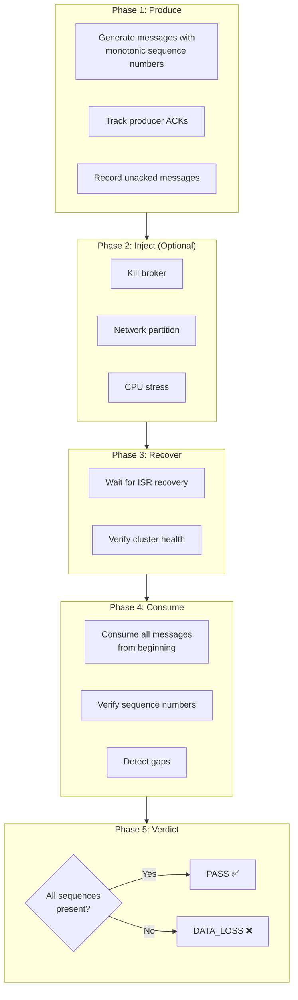
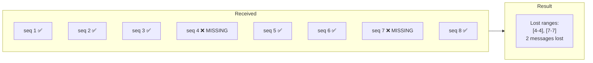
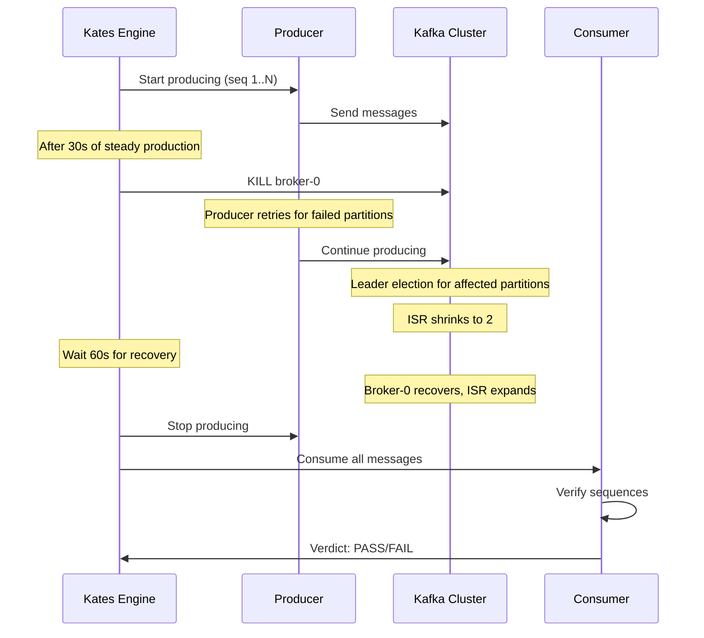

# Data Integrity Verification

Data integrity is the highest-stakes property of any messaging system. This chapter explains how Kates verifies that Kafka delivers on its durability and ordering guarantees — and how to test these guarantees under failure conditions.

## Why Data Integrity Matters

Kafka is often used as the backbone of critical data pipelines:

- Financial transactions that must never be lost or duplicated
- Event sourcing systems where ordering determines correctness
- CDC (Change Data Capture) pipelines where data loss means inconsistency
- Audit logs where completeness is a regulatory requirement

A cluster that performs well but occasionally loses messages is worse than one that's slow but reliable.

## The Integrity Verification Pipeline


```mermaid
graph TB
    subgraph Produce["Phase 1: Produce"]
        P1[Generate messages with<br/>monotonic sequence numbers]
        P2[Track producer ACKs]
        P3[Record unacked messages]
    end
    
    subgraph Inject["Phase 2: Inject (Optional)"]
        I1[Kill broker]
        I2[Network partition]
        I3[CPU stress]
    end
    
    subgraph Recover["Phase 3: Recover"]
        R1[Wait for ISR recovery]
        R2[Verify cluster health]
    end
    
    subgraph Consume["Phase 4: Consume"]
        C1[Consume all messages<br/>from beginning]
        C2[Verify sequence numbers]
        C3[Detect gaps]
    end
    
    subgraph Verdict["Phase 5: Verdict"]
        V1{All sequences<br/>present?}
        PASS[PASS ✅]
        FAIL[DATA_LOSS ❌]
    end
    
    Produce --> Inject
    Inject --> Recover
    Recover --> Consume
    Consume --> Verdict
    V1 -->|Yes| PASS
    V1 -->|No| FAIL
```

## Sequence Number Tracking

Each message in an INTEGRITY test carries a 28-byte binary header (`SequencedPayload`), zero-padded to the configured record size:

```
[8 bytes] sequence number   (long)
[8 bytes] timestamp nanos   (long)
[8 bytes] run ID hash       (long)
[4 bytes] CRC32             (int — checksum of the first 24 bytes)
[N bytes] zero padding      (to match target record size)
```

| Field | Purpose |
|-------|---------|
| `sequence` | Monotonically increasing sequence number |
| `timestampNanos` | Monotonic send timestamp, used for RTO computation |
| `runIdHash` | Stable hash of the run ID, isolates records from other runs |
| `crc32` | CRC32 checksum of the header for corruption detection |

### Producer-Side Tracking

The producer maintains:

- **Total sent** — total messages submitted to the Kafka producer
- **Total ACKed** — messages for which the broker confirmed persistence
- **Total failed** — sends that returned an error in the producer callback
- **Failure windows** — continuous periods between a failed send and the next successful ACK, used to compute producer-side RTO

### Consumer-Side Verification

The consumer reads all messages and builds a bitmap of received sequence numbers:


```mermaid
graph LR
    subgraph Received
        S1["seq 1 ✅"]
        S2["seq 2 ✅"]
        S3["seq 3 ✅"]
        S4["seq 4 ❌ MISSING"]
        S5["seq 5 ✅"]
        S6["seq 6 ✅"]
        S7["seq 7 ❌ MISSING"]
        S8["seq 8 ✅"]
    end
    
    subgraph Result
        LOST["Lost ranges:<br/>[4-4], [7-7]<br/>2 messages lost"]
    end
    
    Received --> Result
```

## Integrity Modes

### Standard Integrity

Uses `acks=all` and verifies that all ACKed messages are consumable:

```bash
kates test create --type INTEGRITY --records 100000 --acks all --wait
```

Expected result: **zero data loss**. If messages are ACKed with `acks=all`, Kafka guarantees they are persisted on `min.insync.replicas` brokers.

### Idempotent Integrity

Enables Kafka's producer idempotency to verify exactly-once delivery to the log. Idempotence is off by default; enable it with the `enableIdempotence` field in a scenario file:

```yaml
scenarios:
  - name: "Idempotent Integrity"
    type: INTEGRITY
    spec:
      records: 100000
      acks: "all"
      enableIdempotence: true
```

```bash
kates test apply -f idempotent-integrity.yaml --wait
```

With idempotency, even if the producer retries a send (due to transient network errors), the broker deduplicates it. The consumer should see each sequence number exactly once.

### Transactional Integrity

Enables Kafka transactions for the strongest guarantee — exactly-once processing. The built-in `integrity-tx` template ships with transactions, idempotence, and CRC verification already enabled:

```bash
# Export the built-in transactional integrity template, then run it
kates test scaffold export integrity-tx
kates test apply -f integrity-tx.yaml --wait
```

The exported `integrity-tx.yaml`:

```yaml
scenarios:
  - name: "Transactional Integrity Verification"
    type: INTEGRITY
    spec:
      records: 200000
      parallelProducers: 4
      recordSizeBytes: 512
      acks: "all"
      compressionType: "zstd"
      enableIdempotence: true
      enableTransactions: true
      enableCrc: true
      replicationFactor: 3
      minInsyncReplicas: 2
      numConsumers: 4
    validate:
      maxDataLossPercent: 0
      maxDuplicatePercent: 0
      maxOutOfOrder: 0
      maxCrcFailures: 0
      maxP99LatencyMs: 150
```

## Integrity Under Chaos

The real power of integrity testing emerges when combined with fault injection. There is no dedicated scaffold for this — you run an INTEGRITY test and inject a disruption (see [Chaos Engineering in Practice](07-chaos-practice.md)) while it is producing:

```bash
# Terminal 1 — start the integrity test
kates test apply -f integrity-tx.yaml --wait

# Terminal 2 — inject a broker failure while the test produces
kates disruption run --config disruption-plan.json
```

The combined flow looks like this:


```mermaid
sequenceDiagram
    participant Engine as Kates Engine
    participant Producer as Producer
    participant Kafka as Kafka Cluster
    participant Consumer as Consumer
    
    Engine->>Producer: Start producing (seq 1..N)
    Producer->>Kafka: Send messages
    
    Note over Engine: After 30s of steady production
    Engine->>Kafka: KILL broker-0
    
    Note over Producer: Producer retries for failed partitions
    Producer->>Kafka: Continue producing
    
    Note over Kafka: Leader election for affected partitions
    Note over Kafka: ISR shrinks to 2
    
    Note over Engine: Wait 60s for recovery
    Note over Kafka: Broker-0 recovers, ISR expands
    
    Engine->>Producer: Stop producing
    Engine->>Consumer: Consume all messages
    Consumer->>Consumer: Verify sequences
    Consumer->>Engine: Verdict: PASS/FAIL
```

### What Gets Verified

| Property | How Verified |
|----------|-------------|
| **Zero data loss** | Every ACKed sequence number is consumed |
| **No silent drops** | Messages that timed out are tracked separately from ACKed ones |
| **Ordering per partition** | Sequence numbers within each partition are monotonically increasing |
| **No duplication** | With idempotency enabled, each sequence appears exactly once |
| **ACK consistency** | An ACKed message is always persisted; an unacked message may or may not be |

### Timeline Events

The verifier records a diagnostic timeline of integrity violations — CRC failures, ordering violations, lost ranges — plus a final summary event. `kates test get <id>` prints the last 20 events automatically in its "Integrity Timeline" section:

```bash
kates test get <id>
```

An example timeline from a run that lost one record (timestamps are epoch milliseconds):

| Timestamp | Type | Detail |
|:-:|---|---|
| 1767970801123 | CRC_FAILURE | partition=2 seq=45231 |
| 1767970802456 | OUT_OF_ORDER | partition=1 expected=78441 actual=78439 |
| 1767970803010 | LOST_RANGE | from=45231 to=45231 count=1 |
| 1767970803011 | SUMMARY | verdict=DATA_LOSS lost=1 duplicates=0 |

A clean run contains only the final `SUMMARY` event.

## Interpreting Integrity Results

### PASS — Zero Data Loss

```
  ▸ Data Integrity
  Sent                     100.0K
  Acked                    100.0K
  Consumed                 100.0K
  Lost                     0
  Duplicates               0
  Data Loss                0.0000%
  CRC Failures             0
  Out of Order             0
  Mode                     idempotent
  Verdict                  ● PASS
```

This is the expected result for a properly configured cluster with `acks=all` and `min.insync.replicas=2`, even during single-broker failures.

### DATA_LOSS — Messages Missing

```
  ▸ Data Integrity
  Sent                     100.0K
  Acked                    100.0K
  Consumed                 100.0K
  Lost                     2
  Duplicates               0
  Data Loss                0.0020%
  CRC Failures             0
  Out of Order             0
  Verdict                  ○ DATA_LOSS

  ▸ Lost Ranges
  From Seq  To Seq  Count
  ────────  ──────  ─────
  45231     45231   1
  78442     78442   1
```

(Counts are abbreviated in the display — the `Lost` count, `Data Loss` percentage, and `Lost Ranges` table carry the exact numbers.)

Data loss indicates a serious issue. Common causes:

| Cause | How to Diagnose |
|-------|----------------|
| `acks=1` (not `all`) | Leader crashed before replication |
| `min.insync.replicas=1` | Not enough replicas to survive broker loss |
| Unclean leader election | `unclean.leader.election.enable=true` |
| Log truncation | Follower promoted with less data than old leader |

### PASS with Unacked Messages

```
  ▸ Data Integrity
  Sent                     100.0K
  Acked                    100.0K
  Consumed                 100.0K
  Lost                     0
  Duplicates               0
  Data Loss                0.0000%
  CRC Failures             0
  Out of Order             0
  Producer RTO             2340 ms
  Verdict                  ● PASS
```

In this run some messages were never ACKed — the producer hit errors during a broker failure, visible as a non-zero `Producer RTO` (the longest window between a failed send and the next successful ACK). Only ACKed messages carry a durability promise, so unacked sends are excluded from the loss calculation and the verdict remains PASS. The unacked messages may or may not be in the log — this is expected behavior when a broker crashes during a produce request.

## Best Practices

### 1. Always Run Integrity Tests Before Configuration Changes

Before changing `min.insync.replicas`, replication factor, or `acks` settings, run an integrity test to establish a baseline, then run another after the change.

### 2. Combine with Every Disruption Type

Each disruption type can expose different integrity issues:

| Disruption | Integrity Risk |
|-----------|---------------|
| `POD_KILL` | Messages in page cache not flushed to disk |
| `NETWORK_PARTITION` | Split-brain; both sides accepting writes |
| `DISK_FILL` | Log segments can't be written |
| `ROLLING_RESTART` | Brief window during graceful shutdown |
| `CPU_STRESS` | Replication falls behind, ISR shrinks |

### 3. Use Sufficient Record Count

10,000 records might not expose intermittent issues. Use 100,000+ for meaningful verification.

### 4. Test with Production-Like Configuration

Integrity tests are only meaningful if the topic configuration matches production:
- Same replication factor
- Same `min.insync.replicas`
- Same `acks` mode
- Same number of partitions

## Complete Walkthrough

This section walks through a full data integrity verification from start to finish, showing exactly what to expect at each stage.

### Step 1 — Run the INTEGRITY Test

```bash
# Export the built-in transactional integrity template, then run it
kates test scaffold export integrity-tx
kates test apply -f integrity-tx.yaml --wait
```

This runs a 200,000-record INTEGRITY test with `acks=all`, idempotence, transactions, and CRC verification enabled (the template contents are shown in the Transactional Integrity section above). For a quick ad-hoc run without a scenario file:

```bash
kates test create --type INTEGRITY --records 100000 --acks all --wait
```

Ad-hoc `create` runs use the backend defaults: CRC verification is on, but idempotence and transactions stay off — those are scenario-file fields (`enableIdempotence`, `enableTransactions`).

### Step 2 — Observe Output During the Test

With `--wait`, `kates test apply` shows a spinner per scenario and a summary table once each test finishes, including the SLA gates from the `validate:` block:

```
  Applying 1 scenario(s) from integrity-tx.yaml

  ▸ Transactional Integrity Verification (INTEGRITY)...
  ✓   Created: a1b2c3d4e5f6…
  ✓ Transactional Integrity Verification → ● DONE

  ▸ Summary
  Scenario                               ID             Status  Note
  ─────────────────────────────────────  ─────────────  ──────  ──────────
  Transactional Integrity Verification   a1b2c3d4e5f6…  DONE    ✓ SLA Pass
```

Internally the test runs its produce phase to completion, then consumes everything back from the beginning, then reconciles ACKed against consumed sequence numbers. The topic is named after the test type (`integrity-test`) unless overridden with the `topic` spec field.

### Step 3 — Read the Verification Report

```bash
kates test get <id>
```

The report starts with the test details, configuration, and per-phase results; for INTEGRITY tests it ends with a Data Integrity section. A successful `integrity-tx` run produces:

```
  ▸ Data Integrity
  Sent                     200.0K
  Acked                    200.0K
  Consumed                 200.0K
  Lost                     0
  Duplicates               0
  Data Loss                0.0000%
  CRC Failures             0
  Out of Order             0
  Mode                     idempotent transactional
  Verdict                  ● PASS
```

### Step 4 — Interpret Each Field

| Field | Meaning | Expected Value | Concern If... |
|-------|---------|:--------------:|---------------|
| **Sent** | Total messages submitted to the Kafka producer | Matches `records` | Lower than expected: producer errors or timeouts |
| **Acked** | Messages confirmed persisted by the broker | Equal to Sent | Less than Sent: broker rejected or timed out messages |
| **Consumed** | Messages read back from the topic | Equal to Acked | Less than Acked: **data loss detected** |
| **Lost** | ACKed messages that were not consumed | `0` | Any non-zero value: serious durability issue |
| **Duplicates** | Messages received more than once | `0` (with idempotency) | Non-zero without idempotency is expected; non-zero with idempotency is a bug |
| **Data Loss** | Lost as a percentage of Sent | `0.0000%` | Any non-zero value: serious durability issue |
| **CRC Failures** | Messages whose CRC32 checksum didn't match | `0` | Non-zero: data corruption in transit or at rest |
| **Out of Order** | Messages received with a lower sequence than a prior message in the same partition | `0` | Non-zero: possible log truncation or unclean election |
| **Producer RTO** | Longest window between a failed send and the next successful ACK (shown only after producer stalls) | Absent | Large values: slow leader failover |
| **Consumer RTO** | Duration of the first gap observed in the consumed sequence stream (shown only after consumer stalls) | Absent | Large values: slow recovery on the read path |

### Step 5 — What a Failure Looks Like

If the test detects data loss, the Data Integrity section changes to:

```
  ▸ Data Integrity
  Sent                     200.0K
  Acked                    200.0K
  Consumed                 200.0K
  Lost                     3
  Duplicates               0
  Data Loss                0.0015%
  CRC Failures             1
  Out of Order             0
  Mode                     idempotent transactional
  Verdict                  ○ DATA_LOSS

  ▸ Lost Ranges
  From Seq  To Seq  Count
  ────────  ──────  ─────
  23401     23401   1
  67882     67883   2

  ▸ Integrity Timeline
  Timestamp      Type         Detail
  ─────────────  ───────────  ─────────────────────────────────
  1767970801123  CRC_FAILURE  partition=2 seq=51200
  1767970803010  LOST_RANGE   from=23401 to=23401 count=1
  1767970803010  LOST_RANGE   from=67882 to=67883 count=2
  1767970803011  SUMMARY      verdict=DATA_LOSS lost=3 duplicates=0
```

Reading this report:

- Lost message at seq 23401: single gap — likely a broker crash during ACK
- Lost messages at seq 67882-67883: consecutive gap — possible log truncation
- CRC failure: message payload corrupted — check disk health

### What to Investigate on Failure

1. **Check `acks` setting** — if `acks=1`, the leader may have crashed before replication. Switch to `acks=all`.
2. **Check `min.insync.replicas`** — if set to `1`, a single broker failure can cause data loss. Set to `2`.
3. **Check for unclean leader election** — run `kubectl logs <broker-pod> -n kafka | grep 'unclean'`. Disable `unclean.leader.election.enable` in production.
4. **Check disk health** — CRC failures suggest disk corruption. Run `kubectl exec <broker-pod> -n kafka -- df -h` and check for I/O errors in `dmesg`.
5. **Check timeline events** — run `kates test get <id>`; the Integrity Timeline section prints automatically and shows exactly which sequences failed CRC checks, arrived out of order, or were lost.
