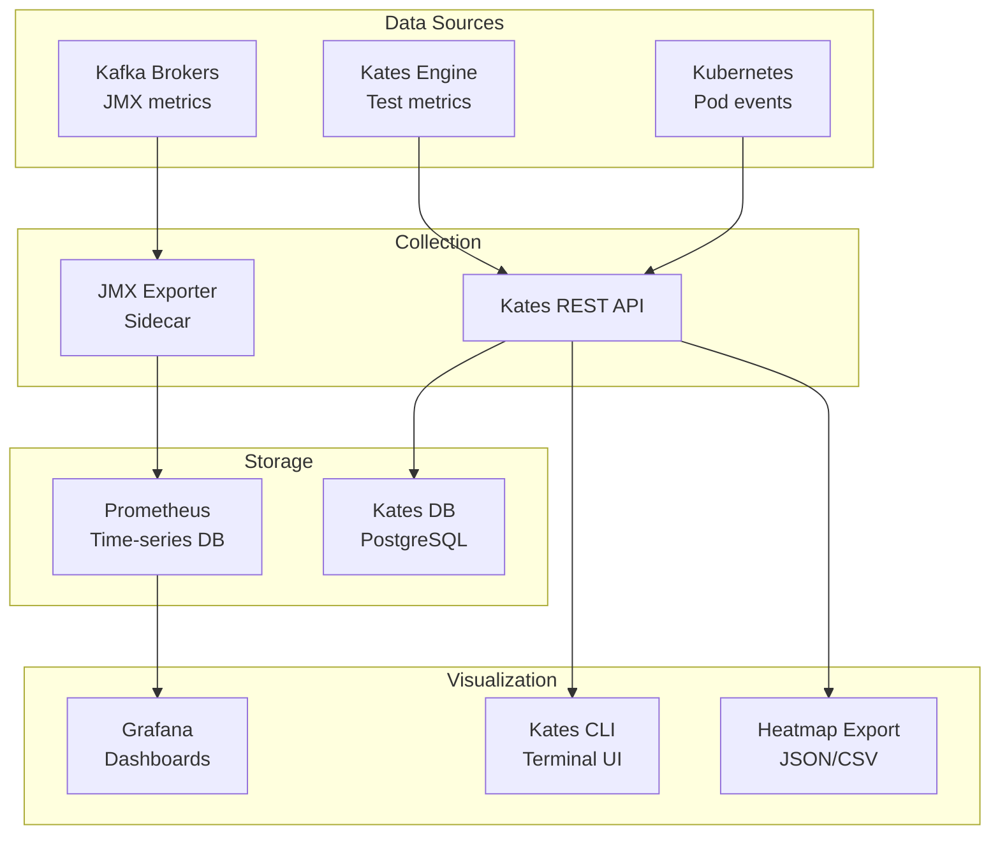
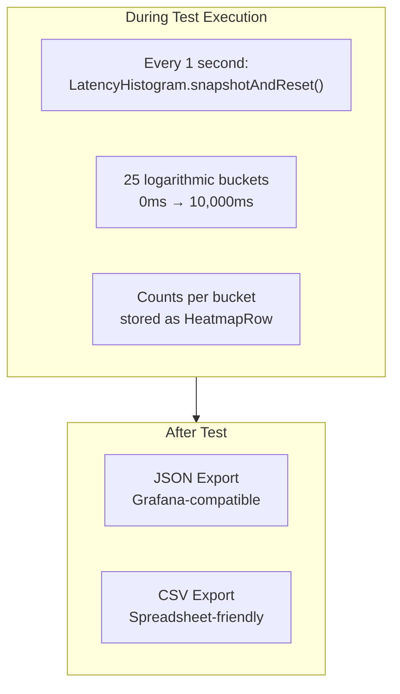

# Chapter 9: Observability & Monitoring

Kates provides multiple layers of observability — from real-time dashboards to historical trend analysis. This chapter covers how to get the most from the monitoring stack.

## Observability Architecture



## Grafana Dashboards

Kates deploys 7 Grafana dashboards, each focused on a specific monitoring dimension.

### Kafka Cluster Health

The primary ops dashboard. At a glance, it answers: "Is my cluster healthy?"

| Panel | What It Shows | Alert Threshold |
|-------|---------------|-----------------|
| Active Brokers | Count of brokers responding | \< 3 |
| Offline Partitions | Partitions with no leader | \> 0 |
| Under-replicated | Partitions where ISR \< RF | \> 0 for \> 60s |
| Zone Distribution | Broker count per AZ | Uneven = risk |
| Controller Active | Which broker is the active controller | Changes = election |

### Kafka Performance Metrics

For understanding workload patterns:

| Panel | Metric |
|-------|--------|
| Messages In (rate) | `kafka.server:type=BrokerTopicMetrics,name=MessagesInPerSec` |
| Bytes In/Out (rate) | `kafka.server:type=BrokerTopicMetrics,name=Bytes{In,Out}PerSec` |
| Request Rate | `kafka.network:type=RequestMetrics,name=RequestsPerSec` |
| Topic Size Growth | `kafka.log:type=Log,name=Size` |

### Kafka Broker Internals

For diagnosing performance bottlenecks:

| Panel | What It Reveals |
|-------|----------------|
| Request Queue Size | How many requests are waiting to be processed |
| Response Queue Size | How many responses are waiting to be sent |
| Network Handler Idle | Percentage of time network threads are idle |
| Purgatory Size | Requests waiting for ACKs (producer purgatory) |
| ISR Shrink/Expand Rate | How often ISRs change — instability indicator |

### Kafka JVM Metrics

For capacity planning and GC tuning:

| Panel | Significance |
|-------|-------------|
| Heap Used vs. Max | Memory pressure indicator |
| GC Pause Time | Directly impacts tail latency |
| GC Count | High frequency = memory pressure |
| Thread Count | Leak detection over time |
| Non-Heap Memory | Metaspace growth indicator |

### Kafka Replication

For understanding replication health during chaos tests:

| Panel | During Normal | During Chaos |
|-------|:---:|:---:|
| ISR Count per Partition | = RF (3) | Drops to 2 or 1 |
| Under-replicated Partitions | 0 | Spikes |
| Replica Lag (bytes) | Near 0 | Spikes then recovers |

## Kates CLI Observability

### Live Dashboard

The `kates dashboard` command provides a full-screen terminal dashboard:

```bash
kates dashboard
# or
kates dash
```

It shows:
- System health status
- Active tests count
- Recent test results table
- Kafka cluster summary

### Top (Live View)

Like `kubectl top`, but for Kates tests:

```bash
kates top
```

Shows running tests with real-time throughput and latency updates.

### Status (Quick Check)

A one-line system health check:

```bash
kates status
```

Returns: engine status, Kafka connectivity, active test count, and any warnings.

### Cluster Watch

A live-refreshing cluster health dashboard with historical sparkline trends. Auto-refreshes every 5 seconds (configurable) and tracks the last 30 polls.

```bash
# Default 5-second refresh
kates cluster watch

# Custom interval
kates cluster watch --interval 10
```

The display shows:
- **Broker status** — count, controller identity
- **Partition health** — under-replicated ▁▂▃ sparkline, offline ▁▁▁ sparkline
- **Partition count** — total and per-topic breakdown with trend
- **Consumer groups** — count and active/empty state

Sparklines use Unicode block characters (▁▂▃▄▅▆▇█) to show the trend over the last 30 polls. A rising trend in under-replicated partitions is an early warning of cluster degradation.

## Latency Heatmaps

Heatmaps are Kates's most powerful observability feature. They preserve the **full latency distribution over time**, revealing patterns invisible in aggregate percentiles.

### How Heatmaps Work



### Bucket Boundaries

The 25 heatmap buckets use logarithmic spacing:

| Bucket | Range | Focus |
|:-:|---|---|
| 1 | 0 – 0.1ms | Sub-millisecond operations |
| 2–5 | 0.1 – 1ms | Fast local writes |
| 6–10 | 1 – 10ms | Typical Kafka latency |
| 11–15 | 10 – 100ms | Moderate latency |
| 16–20 | 100 – 1,000ms | High latency / timeouts |
| 21–25 | 1,000 – 10,000ms | Extreme tail / failures |

### Exporting Heatmaps

```bash
# JSON (for Grafana)
kates report export <id> --format heatmap

# CSV (for spreadsheets)
kates report export <id> --format heatmap-csv

# Save to file
kates report export <id> --format heatmap -o heatmap.json
kates report export <id> --format heatmap-csv -o heatmap.csv
```

### REST API

```
GET /api/tests/{id}/report/heatmap?format=json
GET /api/tests/{id}/report/heatmap?format=csv
```

### Reading Heatmap Data

Each row in the heatmap data represents one second of the test:

```json
{
  "timestampMs": 1708012345000,
  "phaseName": "steady-state",
  "buckets": [0, 0, 12, 145, 832, 456, 89, 23, 5, 1, ...]
}
```

Interpretation: during this second, 832 messages had latency between 1–5ms, 456 had 5–10ms, etc.

### What Heatmaps Reveal

| Pattern | What It Means |
|---------|---------------|
| Single dense band | Uniform latency — healthy |
| Two horizontal bands | Bimodal latency — cache hit vs. miss |
| Vertical stripe | Latency spike at a point in time — GC or election |
| Gradual upward drift | Latency degrading over time — saturation |
| Sudden regime change | Configuration or topology changed mid-test |

## Trend Analysis

Kates stores historical test results, enabling trend analysis over time:

```bash
# View P99 latency trend for LOAD tests over the last 30 days
kates trend --type LOAD --metric p99LatencyMs --days 30

# View throughput trend
kates trend --type LOAD --metric throughputRecordsPerSec --days 30
```

The CLI renders sparkline charts for quick visual assessment:

```
  P99 Latency (ms) — LOAD tests, last 30 days
  ▁▁▂▁▁▁▂▁▃▁▁▁▁▂▁▁▁▅▂▁▁▁▁▂▁▁▁▃▁▁
  min: 8.2   avg: 12.5   max: 45.3   current: 11.8
```

A sudden upward spike in the sparkline chart indicates a regression.

## Report Comparison

Kates supports comparing multiple test runs side-by-side:

```bash
# Compare two runs
kates report diff <id1> <id2>

# Summary comparison of multiple runs
kates report compare <id1>,<id2>,<id3>
```

### Diff Output

The diff command highlights meaningful differences:

| Metric | Run 1 | Run 2 | Change |
|--------|:---:|:---:|:---:|
| Throughput | 45,230 rec/s | 42,100 rec/s | -6.9% ▼ |
| P99 Latency | 12.3ms | 18.7ms | +52.0% ▲ |
| Avg Latency | 4.1ms | 5.8ms | +41.5% ▲ |
| Error Rate | 0.00% | 0.00% | — |

## Broker Metrics Correlation

Kates captures per-broker metrics as part of every test report:

```bash
kates report brokers <id>
```

This shows which broker was under the most pressure during the test:

| Broker | Bytes In/s | Bytes Out/s | Request Rate | ISR Changes |
|:-:|:-:|:-:|:-:|:-:|
| 0 (leader) | 5.2 MB/s | 10.4 MB/s | 8,500/s | 0 |
| 1 (follower) | 5.2 MB/s | 0.1 MB/s | 100/s | 0 |
| 2 (follower) | 5.2 MB/s | 0.1 MB/s | 100/s | 0 |

This is particularly valuable after chaos tests — you can see exactly how the load redistributed when a broker went down.

## Export Formats Summary

| Format | Command | Use Case |
|--------|---------|----------|
| JSON | `kates report export <id> --format json` | Programmatic consumption |
| CSV | `kates report export <id> --format csv` | Spreadsheet analysis |
| JUnit XML | `kates report export <id> --format junit` | CI/CD pipelines |
| Heatmap JSON | `kates report export <id> --format heatmap` | Grafana visualization |
| Heatmap CSV | `kates report export <id> --format heatmap-csv` | Spreadsheet analysis |
