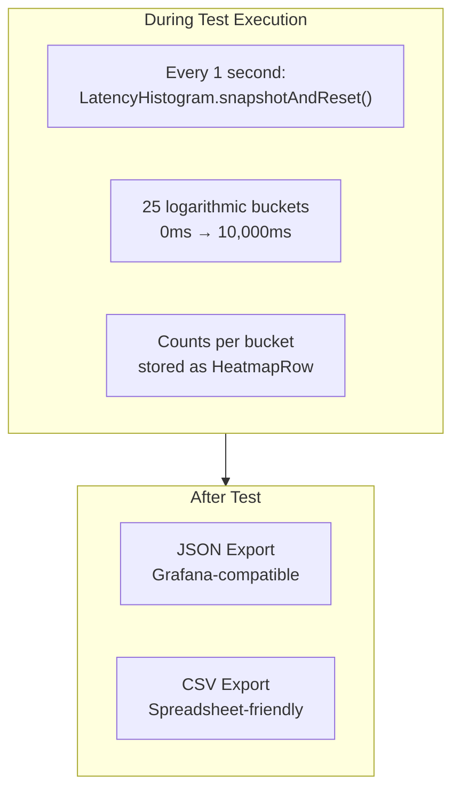

# Chapter 9: Observability & Monitoring

Running a Kafka performance test without monitoring is like driving at night with no headlights. You might arrive safely, but you won't know how close you came to the edge. A test that reports "45,000 rec/s, P99 = 12ms" tells you the result — but it doesn't tell you *why*. Was broker 2 doing twice the work? Were ISRs shrinking under load? Was GC pausing every 30 seconds? Without observability, you're guessing.

This chapter covers everything you need to turn raw numbers into understanding: Grafana dashboards, Kates-specific metrics, latency heatmaps, distributed tracing, alerting, and the CLI tools that tie it all together. By the end, you'll know not just *what* to monitor, but *when* to look at each tool and *what the patterns mean*.

---

## Observability Architecture

Before diving into dashboards and metrics, it helps to understand how data flows from Kafka brokers and the Kates engine into the tools you'll use day-to-day. The architecture has four layers: sources generate data, collectors normalize and transport it, storage backends retain it, and visualization tools let you query and explore.


```mermaid
graph TB
    subgraph Sources["Data Sources"]
        KB[Kafka Brokers<br/>JMX metrics]
        KE[Kates Engine<br/>Test metrics]
        K8S[Kubernetes<br/>Pod events]
        OTEL[OTel SDK<br/>Trace spans]
    end
    
    subgraph Collection["Collection"]
        JMX[JMX Exporter<br/>Sidecar]
        API[Kates REST API]
        OTLP[OTLP Collector]
    end
    
    subgraph Storage["Storage"]
        PROM[Prometheus<br/>Time-series DB]
        DB[Kates DB<br/>PostgreSQL]
        JAEGER[Jaeger<br/>Trace Store]
    end
    
    subgraph Visualization["Visualization"]
        GRAF[Grafana<br/>Dashboards]
        CLI[Kates CLI<br/>Terminal UI]
        HM[Heatmap Export<br/>JSON/CSV]
        JUI[Jaeger UI<br/>Trace Explorer]
    end
    
    KB --> JMX --> PROM --> GRAF
    KE --> API --> DB
    API --> CLI
    API --> HM
    K8S --> API
    OTEL --> OTLP --> JAEGER --> JUI
```

Each Kafka broker runs a **JMX Exporter sidecar** that scrapes JMX MBeans and exposes them as Prometheus metrics on `/metrics`. Prometheus scrapes these endpoints (plus the Kates engine's own `/q/metrics`) every 15 seconds. Grafana queries Prometheus to render dashboards. Meanwhile, the Kates engine writes test results to PostgreSQL and exposes them through its REST API — which the CLI consumes for terminal dashboards, trend charts, and heatmap exports.

---

## Reading the Dashboards: A Diagnostic Walkthrough

You've just finished a 10-minute LOAD test. The CLI reports 48,000 rec/s throughput and P99 latency of 14ms. Those are good numbers — but are they the *whole* story? Here's how to read the dashboards, in what order, and what each pattern means.

### Step 1: Check Cluster Health First

Open the **Kafka Cluster Health** dashboard. This is your starting point after *every* test, whether it passed or failed. You're answering one question: "Was the cluster healthy throughout the test, or did something break?"

Look at **Active Brokers** first. If this ever dipped below 3 during your test, everything downstream — replication, latency, throughput — was affected. Next, check **Offline Partitions** and **Under-replicated Partitions**. Both should be zero for the entire test duration. If under-replicated partitions spiked and then recovered, a follower fell behind — your latency numbers during that window are suspect.

### Step 2: Examine Performance Metrics

Now switch to the **Kafka Performance Metrics** dashboard. Look at **Messages In (rate)** — it should match your configured producer throughput. If it's significantly lower, the producer couldn't sustain the target rate, which means you were testing the *producer's* limits, not the *cluster's*.

Check **Bytes In/Out (rate)** to understand the data volume. If bytes out significantly exceeds bytes in, you have multiple consumer groups reading the same data — which is fine, but it means you're testing read amplification too.

### Step 3: Investigate Latency Sources

If your P99 was higher than expected, open **Kafka Broker Internals**. Look at **Request Queue Size** — if it was growing during the test, requests were arriving faster than the broker could process them. A healthy cluster keeps this near zero.

Check **Purgatory Size** — this tells you how many produce requests were waiting for follower acknowledgments. With `acks=all`, every produce request sits in purgatory until all ISR members replicate it. A growing purgatory means replication is the bottleneck.

### Step 4: Verify Replication

Finally, open the **Kafka Replication** dashboard. During a normal test, **ISR Count per Partition** should equal your replication factor (3) for every partition, for the entire duration. **Replica Lag (bytes)** should stay near zero. If it spiked, followers were struggling to keep up — likely because of disk I/O pressure or network saturation.

::: {.callout-tip}
Get in the habit of following this sequence — cluster health → performance → internals → replication — after every test. It takes 60 seconds and catches problems that aggregate metrics hide. If a test result surprises you, the dashboards will almost always explain why.
:::


---

## Kafka Grafana Dashboards

Kates deploys six Kafka-focused Grafana dashboards, each targeting a specific monitoring dimension. For the full dashboard and metrics reference, see [docs/monitoring.md](../monitoring.md).

### Kafka Cluster Health

This is the primary ops dashboard — your first stop after any test or chaos experiment. It answers the most fundamental question: "Is my cluster healthy right now?" If anything here is red, stop investigating performance and fix the cluster first.

| Panel | What It Shows | Alert Threshold |
|-------|---------------|-----------------|
| Active Brokers | Count of brokers responding | \< 3 |
| Offline Partitions | Partitions with no leader | \> 0 |
| Under-replicated | Partitions where ISR \< RF | \> 0 for \> 60s |
| Zone Distribution | Broker count per AZ | Uneven = risk |
| Controller Active | Which broker is the active controller | Changes = election |

**Active Brokers** is not just a count — it's your first check after any chaos experiment. If this drops below your expected count, everything downstream (replication, latency, throughput) is affected. **Controller Active** tells you whether a KRaft leader election happened during your test window — elections cause brief write pauses that show up as latency spikes.

### Kafka Performance Metrics

This dashboard shows the workload patterns hitting your cluster. Use it to verify that your test is generating the load you expect, and to spot asymmetries across brokers or topics.

| Panel | Metric |
|-------|--------|
| Messages In (rate) | `kafka.server:type=BrokerTopicMetrics,name=MessagesInPerSec` |
| Bytes In/Out (rate) | `kafka.server:type=BrokerTopicMetrics,name=Bytes{In,Out}PerSec` |
| Request Rate | `kafka.network:type=RequestMetrics,name=RequestsPerSec` |
| Topic Size Growth | `kafka.log:type=Log,name=Size` |

**Messages In (rate)** should match your configured producer throughput. If it plateaus below your target, the cluster has hit a bottleneck — check broker internals. **Topic Size Growth** matters for long-running tests: if your topic is growing faster than log retention can clean, you'll run out of disk.

### Kafka Broker Internals

When performance numbers look off, this is where you diagnose the root cause. These metrics reveal what's happening *inside* each broker — the queues, threads, and internal buffers that determine whether the broker is keeping up or falling behind.

| Panel | What It Reveals |
|-------|----------------|
| Request Queue Size | How many requests are waiting to be processed |
| Response Queue Size | How many responses are waiting to be sent |
| Network Handler Idle | Percentage of time network threads are idle |
| Purgatory Size | Requests waiting for ACKs (producer purgatory) |
| ISR Shrink/Expand Rate | How often ISRs change — instability indicator |

**Request Queue Size** tells you whether the broker is keeping up. A growing queue means requests are arriving faster than the broker can process them. On a healthy cluster, this stays near zero. **Network Handler Idle** below 50% is a warning — the broker's network threads are saturated, and adding more load will cause requests to queue. **ISR Shrink/Expand Rate** should be zero during normal operations. Any non-zero value means followers are falling behind and catching up — a sign of instability that directly impacts write latency with `acks=all`.

### Kafka JVM Metrics

The JVM is the runtime underneath every broker. GC pauses are the single most common source of tail latency in Kafka benchmarks, making this dashboard essential for capacity planning and GC tuning. If your P99 latency has unexplained spikes, check here first.

| Panel | Significance |
|-------|-------------|
| Heap Used vs. Max | Memory pressure indicator |
| GC Pause Time | Directly impacts tail latency |
| GC Count | High frequency = memory pressure |
| Thread Count | Leak detection over time |
| Non-Heap Memory | Metaspace growth indicator |

**GC Pause Time** correlates directly with latency spikes. If you see GC pauses of 50ms+ coinciding with your P99 spikes, switching to ZGC will likely eliminate them — see [Chapter 12: Deployment](12-deployment.md#jvm-tuning). **Heap Used vs. Max** trending upward over time without leveling off suggests a memory leak or insufficient heap size.

### Kafka Replication

This dashboard becomes critical during chaos tests, where you intentionally take brokers offline and need to verify that replication recovers correctly. During normal tests, everything here should be flat and boring — which is exactly what you want.

| Panel | During Normal | During Chaos |
|-------|:---:|:---:|
| ISR Count per Partition | = RF (3) | Drops to 2 or 1 |
| Under-replicated Partitions | 0 | Spikes |
| Replica Lag (bytes) | Near 0 | Spikes then recovers |

The story this dashboard tells during a chaos test is: the ISR shrinks when a broker goes down, under-replicated partitions spike, replica lag grows while the remaining brokers absorb the load, and then everything recovers when the broker returns. The *shape* of the recovery curve matters — a sharp V means fast recovery, a gradual slope means the cluster is struggling to catch up.

### Strimzi Operator & Kafka Connect

The **Strimzi Operator & Kafka Connect** dashboard (`charts/monitoring/dashboards/strimzi-operator-dashboard.json`) provides visibility into the operator that manages your Kafka cluster and any Connect workloads. You'll check this dashboard when deployments seem stuck, when topic or user changes aren't applying, or when Connect tasks are failing silently.

| Panel | Metric | Alert Level |
|-------|--------|:---:|
| Reconciliation p99 | `strimzi_reconciliations_duration_seconds_bucket` | > 120s = warning |
| Success/failure rate | `strimzi_reconciliations_{successful,failed}_total` | > 3 failures in 15m |
| Queue depth | Pending reconciliations | > 20 = critical |
| Resources per kind | `strimzi_resources{kind=...}` | Informational |
| Connect task status | `kafka_connect_connector_task_status` | Failed = critical |
| Connect records/min | `kafka_connect_sink_task_sink_record_send_total` | Informational |
| Connect error rate | `kafka_connect_task_error_total_errors_logged` | > 5 in 10m = warning |

**Reconciliation p99** matters because Strimzi applies your desired state (topics, users, broker config) through a reconciliation loop. If reconciliations are slow, your configuration changes take longer to apply. **Queue depth** above 20 means the operator is overwhelmed — usually because too many resources changed simultaneously.

---

## Kates-Specific Dashboards

In addition to the Kafka-focused dashboards above, Kates deploys four dashboards tailored to its own benchmark engine, trend analysis, application health, and chaos correlation. These dashboards are unique to Kates and won't exist in a standard Kafka monitoring setup.

### Kates Benchmark & Phase

**File:** `kates-benchmark-dashboard.json` | **UID:** `kates-benchmark-overview`

This is your real-time view during active benchmark runs. Open it *while a test is running* to watch throughput ramp up, latency settle, and phases transition. It's the closest thing to a cockpit view of your test.

| Row | Panels |
|---|---|
| Benchmark Status | Active runs, total records, total errors, SLA violations |
| Throughput | Records/sec and MB/sec timeseries |
| Latency | Percentiles (p50/p95/p99/p99.9) and max latency |
| Phase Detail | Throughput by phase, latency by phase (p99), records by phase |
| SLA & Errors | Error rate and SLA violations by metric/severity |

**Template variables:** `$run_id`, `$test_type` — use these to drill down into a specific test run or compare different test types side by side.

### Kates Trend & Platform

**File:** `kates-trend-dashboard.json` | **UID:** `kates-trend-analysis`

Where the Benchmark dashboard shows one test, the Trend dashboard shows *all* tests over time. This is how you detect performance regressions — if P99 latency has been creeping up over the last 20 runs, you'll see it here as an upward trend line. It also aggregates platform-level stats like test completion rates and SLA pass rates.

| Row | Panels |
|---|---|
| Throughput Trend | Peak throughput across runs |
| Latency Trend | p99 and p99.9 latency trend |
| Regression Detection | Total records per run |
| Platform Stats | Tests completed (by outcome), test duration (p50/p95/p99), SLA pass/fail rate, records processed rate |
| Disruptions | Disruption completion rate, disruption duration (p50/p95) |

**Template variable:** `$test_type`

### Kates Application Health

**File:** `kates-application-dashboard.json` | **UID:** `kates-application-health`

This dashboard monitors the Kates engine itself — not Kafka, not the test results, but the Quarkus application running the tests. Use it when the Kates REST API feels slow, when tests are failing to start, or when you suspect the engine itself (not Kafka) is the bottleneck.

| Row | Panels |
|---|---|
| Pod Status | Pods ready, restart count, uptime, Postgres ready |
| HTTP Server | Request rate (by method), error rate (4xx/5xx), request latency (p50/p95/p99) |
| JVM | Heap memory (used/committed/max), GC pause duration, thread count (live/daemon/peak) |
| Database | Agroal pool connections (active/available/max used), DB acquire time |
| Resource Usage | CPU usage (per pod), memory RSS and working set |

If **DB acquire time** is climbing, the Kates database connection pool is exhausted — you may need to increase the pool size or investigate slow queries.

### Kafka Chaos Dashboard

**File:** `grafana-chaos-dashboard.json` | **UID:** `kafka-chaos-dashboard`

This is the most specialized dashboard in the stack. It correlates LitmusChaos experiment status with Kafka cluster health and Kates benchmark performance *on the same timeline*. When you run a chaos test, this dashboard answers the question: "What happened to my cluster and my test when the chaos experiment fired?"

| Row | Panels |
|---|---|
| Chaos Experiment Status | Active engines, passed/failed experiments, probe success rate |
| Kafka Health During Chaos | Broker pod status, restarts, CPU usage, memory usage |
| Chaos Experiment History | Experiment duration over time |
| RTO / RPO / Data Integrity | Producer RTO, consumer RTO, data loss %, RPO, E2E latency, producer throughput |
| Kates During Chaos | Benchmark throughput overlay, p99 latency overlay, error rate during chaos |

The **RTO / RPO / Data Integrity** row is particularly valuable — it shows exactly how long your producers and consumers were unable to operate (RTO), how much data was at risk (RPO), and whether any messages were lost. These are the metrics that matter for disaster recovery SLAs.

---

## Kates Metrics Reference

Kates exposes two categories of Prometheus metrics: **benchmark metrics** that track individual test runs in real time, and **platform metrics** that accumulate across all runs. Both are scraped by Prometheus and power the Kates-specific Grafana dashboards described above.

### BenchmarkMetrics (Per-Run, Real-Time)

Registered by `BenchmarkMetrics.java` and labeled with `run_id`, `test_type`, and `phase`. These metrics are created when a benchmark starts and updated throughout its execution. Use them to build real-time dashboards or alert on in-progress test failures.

| Prometheus Metric | Type | Description |
|---|---|---|
| `kates_benchmark_active_runs` | Gauge | Number of active benchmark runs |
| `kates_benchmark_throughput_rec_sec` | Gauge | Current throughput in records/sec |
| `kates_benchmark_throughput_mb_sec` | Gauge | Current throughput in MB/sec |
| `kates_benchmark_latency_ms` | Summary | Request latency distribution (p50/p95/p99/p99.9) |
| `kates_benchmark_records_total` | Counter | Total records processed |
| `kates_benchmark_errors_total` | Counter | Total errors |
| `kates_benchmark_sla_violations` | Counter | SLA violation events |

### KatesMetrics (Platform-Level, Cumulative)

Registered by `KatesMetrics.java` and persistent across benchmark runs. These metrics tell you about the health and usage of the Kates platform over time — how many tests have been run, how long they take, and whether SLAs are passing.

| Prometheus Metric | Type | Description |
|---|---|---|
| `kates_tests_completed_total` | Counter | Total tests completed (by test_type, outcome) |
| `kates_tests_duration_seconds` | Timer | Test execution duration (p50/p95/p99) |
| `kates_tests_throughput_rec_sec` | Summary | Final throughput per completed test (records/sec) |
| `kates_tests_throughput_mb_sec` | Summary | Final throughput per completed test (MB/sec) |
| `kates_sla_evaluations_total` | Counter | SLA evaluation outcomes (pass/fail) |
| `kates_disruptions_completed_total` | Counter | Disruption executions completed (by type, outcome) |
| `kates_disruptions_duration_seconds` | Timer | Disruption execution duration (p50/p95) |
| `kates_records_processed_total` | Counter | Cumulative records processed across all tests |

---

## Kates CLI Observability

Not everything requires a browser. The Kates CLI provides four terminal-based observability tools, each designed for a different workflow.

### Live Dashboard

The `kates dashboard` command provides a full-screen terminal dashboard — think of it as the CLI equivalent of the Grafana Benchmark dashboard. Use it when you want a quick overview without leaving your terminal.

```bash
kates dashboard
# or
kates dash
```

It shows:
- System health status
- Active tests count
- Recent test results table
- Kafka cluster summary

### Top (Live View)

Like `kubectl top`, but for Kates tests. Use it when multiple tests are running concurrently and you want to see which ones are active and how they're performing:

```bash
kates top
```

Shows running tests with real-time throughput and latency updates.

### Status (Quick Check)

A one-line system health check — the fastest way to verify that Kates and Kafka are both reachable:

```bash
kates status
```

Returns: engine status, Kafka connectivity, active test count, and any warnings.

### Cluster Watch

A live-refreshing cluster health dashboard with historical sparkline trends. Auto-refreshes every 5 seconds (configurable) and tracks the last 30 polls. This is the CLI tool you leave running in a side terminal during extended test sessions.

```bash
# Default 5-second refresh
kates cluster watch

# Custom interval
kates cluster watch --interval 10
```

The display shows:
- **Broker status** — count, controller identity
- **Partition health** — under-replicated ▁▂▃ sparkline, offline ▁▁▁ sparkline
- **Partition count** — total and per-topic breakdown with trend
- **Consumer groups** — count and active/empty state

Sparklines use Unicode block characters (▁▂▃▄▅▆▇█) to show the trend over the last 30 polls. A rising trend in under-replicated partitions is an early warning of cluster degradation — if you see ▁▁▂▃▅▇ in the under-replicated sparkline, something is going wrong and you should investigate before it gets worse.

---

## Latency Heatmaps

Heatmaps are Kates's most powerful observability feature. They preserve the **full latency distribution over time**, revealing patterns invisible in aggregate percentiles. Where a P99 metric tells you "99% of requests were under 15ms," a heatmap tells you "*when* the slow requests happened, *how many* there were, and *whether the pattern was sustained or momentary*."

For the theory behind why heatmaps matter and why percentiles alone are insufficient, see [Chapter 4: Performance Theory — Heatmaps](04-performance-theory.md#heatmaps-seeing-the-full-picture).

### How Heatmaps Work


```mermaid
graph TD
    subgraph Collection["During Test Execution"]
        direction LR
        H1["Every 1 second:<br/>LatencyHistogram.snapshotAndReset()"]
        H2["25 logarithmic buckets<br/>0ms → 10,000ms"]
        H3["Counts per bucket<br/>stored as HeatmapRow"]
    end
    
    subgraph Export["After Test"]
        direction LR
        E1["JSON Export<br/>Grafana-compatible"]
        E2["CSV Export<br/>Spreadsheet-friendly"]
    end
    
    Collection --> Export
```

### Bucket Boundaries

The 25 heatmap buckets use logarithmic spacing, concentrating resolution where it matters most — in the low-latency range where small differences are significant:

| Bucket | Range | Focus |
|:-:|---|---|
| 1 | 0 – 0.1ms | Sub-millisecond operations |
| 2–5 | 0.1 – 1ms | Fast local writes |
| 6–10 | 1 – 10ms | Typical Kafka latency |
| 11–15 | 10 – 100ms | Moderate latency |
| 16–20 | 100 – 1,000ms | High latency / timeouts |
| 21–25 | 1,000 – 10,000ms | Extreme tail / failures |

### Exporting Heatmaps

```bash
# JSON (for Grafana)
kates report export <id> --format heatmap

# CSV (for spreadsheets)
kates report export <id> --format heatmap-csv

# Save to file
kates report export <id> --format heatmap -o heatmap.json
kates report export <id> --format heatmap-csv -o heatmap.csv
```

### REST API

```
GET /api/tests/{id}/report/heatmap?format=json
GET /api/tests/{id}/report/heatmap?format=csv
```

### Reading Heatmap Data

Each row in the heatmap data represents one second of the test:

```json
{
  "timestampMs": 1708012345000,
  "phaseName": "steady-state",
  "buckets": [0, 0, 12, 145, 832, 456, 89, 23, 5, 1, ...]
}
```

Interpretation: during this second, 832 messages had latency between 1–5ms, 456 had 5–10ms, etc. The `phaseName` field tells you which test phase was active — compare the latency distribution during `ramp-up` vs. `steady-state` to see the effect of JVM warm-up.

### What Heatmaps Reveal

| Pattern | What It Means |
|---------|---------------|
| Single dense band | Uniform latency — healthy |
| Two horizontal bands | Bimodal latency — cache hit vs. miss |
| Vertical stripe | Latency spike at a point in time — GC or election |
| Gradual upward drift | Latency degrading over time — saturation |
| Sudden regime change | Configuration or topology changed mid-test |

---

## Trend Analysis

Individual test results are snapshots. Trend analysis turns those snapshots into a movie, letting you see how performance evolves over days and weeks. This is how you catch regressions early — before they reach production.

```bash
# View P99 latency trend for LOAD tests over the last 30 days
kates trend --type LOAD --metric p99LatencyMs --days 30

# View throughput trend
kates trend --type LOAD --metric throughputRecordsPerSec --days 30
```

The CLI renders sparkline charts for quick visual assessment:

```
  P99 Latency (ms) — LOAD tests, last 30 days
  ▁▁▂▁▁▁▂▁▃▁▁▁▁▂▁▁▁▅▂▁▁▁▁▂▁▁▁▃▁▁
  min: 8.2   avg: 12.5   max: 45.3   current: 11.8
```

A sudden upward spike in the sparkline chart indicates a regression. That spike at position 18 (▅) — correlate it with your deployment history. Did you change a broker configuration, update the Kafka version, or modify the topic's partition count around that date?

---

## Report Comparison

Kates supports comparing multiple test runs side-by-side. This is essential for answering the question "did my change make things better or worse?" — comparing before/after runs eliminates the noise of absolute numbers and focuses on relative change.

```bash
# Compare two runs
kates report diff <id1> <id2>

# Summary comparison of multiple runs
kates report compare <id1>,<id2>,<id3>
```

### Diff Output

The diff command highlights meaningful differences with directional indicators:

| Metric | Run 1 | Run 2 | Change |
|--------|:---:|:---:|:---:|
| Throughput | 45,230 rec/s | 42,100 rec/s | -6.9% ▼ |
| P99 Latency | 12.3ms | 18.7ms | +52.0% ▲ |
| Avg Latency | 4.1ms | 5.8ms | +41.5% ▲ |
| Error Rate | 0.00% | 0.00% | — |

A 52% increase in P99 latency with only a 7% drop in throughput suggests the cluster is near its saturation point — small increases in load cause disproportionate latency increases. See [Chapter 4: Performance Theory](04-performance-theory.md#the-two-pillars-throughput-and-latency) for why this non-linear relationship exists.

---

## Broker Metrics Correlation

Kates captures per-broker metrics as part of every test report. This is particularly valuable for detecting hot spots — situations where one broker is handling significantly more load than the others due to partition leader imbalance.

```bash
kates report brokers <id>
```

This shows which broker was under the most pressure during the test:

| Broker | Bytes In/s | Bytes Out/s | Request Rate | ISR Changes |
|:-:|:-:|:-:|:-:|:-:|
| 0 (leader) | 5.2 MB/s | 10.4 MB/s | 8,500/s | 0 |
| 1 (follower) | 5.2 MB/s | 0.1 MB/s | 100/s | 0 |
| 2 (follower) | 5.2 MB/s | 0.1 MB/s | 100/s | 0 |

This is particularly valuable after chaos tests — you can see exactly how the load redistributed when a broker went down. If broker 0 was the leader for most partitions and it gets killed, the bytes in/out should redistribute roughly evenly across the surviving brokers. If the redistribution is uneven, your partition assignment strategy may need attention.

---

## Export Formats Summary

Kates supports five export formats, each designed for a different downstream consumer:

| Format | Command | Use Case |
|--------|---------|----------|
| JSON | `kates report export <id> --format json` | Programmatic consumption |
| CSV | `kates report export <id> --format csv` | Spreadsheet analysis |
| JUnit XML | `kates report export <id> --format junit` | CI/CD pipelines |
| Heatmap JSON | `kates report export <id> --format heatmap` | Grafana visualization |
| Heatmap CSV | `kates report export <id> --format heatmap-csv` | Spreadsheet analysis |

---

## Distributed Tracing

Kates uses **OpenTelemetry** to propagate traces across the entire request lifecycle — from REST API entry through Kafka producer/consumer operations to database queries. Tracing answers a different question than metrics: where metrics tell you *what* happened, traces tell you *where the time went* for a specific request.

### Configuration

Tracing is configured in `application.properties`:

| Property | Value | Purpose |
|----------|-------|---------| 
| `quarkus.otel.traces.exporter` | `otlp` | Export spans via OTLP (gRPC) |
| `quarkus.otel.exporter.otlp.endpoint` | `jaeger-collector:4317` | Jaeger collector address |
| `quarkus.otel.traces.sampler` | `parentbased_traceidratio` | Sample based on parent trace |
| `quarkus.otel.traces.sampler.arg` | `0.1` (prod) / `1.0` (dev) | 10% sampling in prod, 100% in dev |
| `quarkus.otel.instrument.kafka` | `true` | Auto-instrument Kafka client operations |

::: {.callout-note}
The `0.1` sampling rate in production means only 10% of requests generate traces. This is a deliberate trade-off — tracing adds overhead, and at high throughput you don't need every request traced to spot patterns. In development, 100% sampling is used so you can trace any request.
:::


### What Gets Traced

| Layer | Span Name Pattern | Details |
|-------|-------------------|---------| 
| JAX-RS | `GET /api/tests/{id}` | HTTP method + path |
| Kafka Producer | `kates-results send` | Topic, partition, serialized size |
| Kafka Consumer | `kates-dlq receive` | Topic, consumer group, lag |
| JDBC | `SELECT test_runs` | SQL operation + table |

### Viewing Traces

Access the Jaeger UI at http://localhost:30086:

1. Select service **kates** in the dropdown
2. Click **Find Traces** to see recent requests
3. Click a trace to see the full span tree (REST → Kafka → DB)

Each trace shows the complete request lifecycle as a waterfall diagram. Look for gaps between spans — these represent time spent in framework code, serialization, or network transit. A healthy trace shows spans tightly packed together; large gaps indicate inefficiency.

---

## Alerting

Kates deploys 20+ PrometheusRule alerts across 6 alert groups. These alerts fire automatically when cluster health degrades, giving you early warning before problems become outages.

| Group | File | Alerts |
|-------|------|--------|
| `kafka.cluster` | `kafka-alerts.yaml` | Offline partitions, under-replicated, no active controller, disk usage |
| `kafka.consumer` | `kafka-alerts.yaml` | Consumer group lag warning + critical |
| `kafka.kraft` | `kafka-alerts.yaml` | Leader election rate, uncommitted records |
| `kafka.network` | `kafka-alerts.yaml` | Request latency p99 > 1s |
| `strimzi.operator.health` | `kafka-connect-alerts.yaml` | Reconciliation failing/slow/stalled, resource count drift |
| `kafka.connect.health` | `kafka-connect-alerts.yaml` | Worker down, task failed, error rate, sink lag, stuck rebalancing |

### Alert Configuration

Alert thresholds are defined in `charts/monitoring/values.yaml` and can be customized per environment. The alert rules are deployed as Kubernetes `PrometheusRule` resources, which the Prometheus operator discovers automatically.

To customize thresholds, override the relevant values in your environment-specific values file (`values-kind.yaml` or `values-generic.yaml`). Here are three common alert configurations:

#### Consumer Group Lag

This alert fires when a consumer group falls behind, meaning messages are being produced faster than they're being consumed. A small lag during load tests is expected — sustained lag in production means your consumers are undersized.

```yaml
apiVersion: monitoring.coreos.com/v1
kind: PrometheusRule
metadata:
  name: kafka-consumer-lag
  labels:
    release: monitoring
spec:
  groups:
    - name: kafka.consumer
      rules:
        - alert: KafkaConsumerGroupLagWarning
          expr: |
            sum by (consumergroup, topic) (
              kafka_consumergroup_lag
            ) > 1000
          for: 5m
          labels:
            severity: warning
          annotations:
            summary: "Consumer group {{ $labels.consumergroup }} lag > 1000 on {{ $labels.topic }}"
            description: "Consumer lag has exceeded 1000 for 5 minutes. Check consumer health and scaling."
        - alert: KafkaConsumerGroupLagCritical
          expr: |
            sum by (consumergroup, topic) (
              kafka_consumergroup_lag
            ) > 10000
          for: 5m
          labels:
            severity: critical
          annotations:
            summary: "Consumer group {{ $labels.consumergroup }} lag > 10000 on {{ $labels.topic }}"
            description: "Consumer lag is critically high. Consumers may be down or severely undersized."
```

**When it fires:** Consumer lag exceeds 1,000 messages (warning) or 10,000 messages (critical) for 5 continuous minutes.  
**What to do:** Check that consumer pods are running (`kubectl get pods`). If they're healthy, consider scaling the consumer group or investigating whether the consumer is blocked on downstream dependencies.

#### Offline Partitions

This is the most critical Kafka alert. Offline partitions mean messages can't be produced or consumed for those partitions — this is data unavailability.

```yaml
apiVersion: monitoring.coreos.com/v1
kind: PrometheusRule
metadata:
  name: kafka-offline-partitions
  labels:
    release: monitoring
spec:
  groups:
    - name: kafka.cluster
      rules:
        - alert: KafkaOfflinePartitions
          expr: |
            sum(kafka_controller_kafkacontroller_offlinepartitionscount) > 0
          for: 1m
          labels:
            severity: critical
          annotations:
            summary: "Kafka has {{ $value }} offline partitions"
            description: "One or more partitions have no active leader. Producers and consumers for these partitions are blocked."
```

**When it fires:** Any partition has no leader for more than 1 minute.  
**What to do:** Check which brokers are down (`kates cluster watch`). If a broker crashed, Kafka should elect new leaders automatically — if it doesn't within a minute, check the KRaft controller logs for election failures.

#### Under-Replicated Partitions (Sustained)

Transient under-replication is normal during broker restarts. Sustained under-replication means data durability is at risk — if the remaining replica also fails, you lose data.

```yaml
apiVersion: monitoring.coreos.com/v1
kind: PrometheusRule
metadata:
  name: kafka-under-replicated
  labels:
    release: monitoring
spec:
  groups:
    - name: kafka.cluster
      rules:
        - alert: KafkaUnderReplicatedPartitions
          expr: |
            sum(kafka_server_replicamanager_underreplicatedpartitions) > 0
          for: 5m
          labels:
            severity: warning
          annotations:
            summary: "{{ $value }} under-replicated partitions for > 5 minutes"
            description: "Partitions have fewer in-sync replicas than the replication factor. Check broker health and disk I/O."
```

**When it fires:** Any partition has ISR < replication factor for more than 5 minutes.  
**What to do:** Check broker disk I/O and network throughput. Slow disks or saturated networks prevent followers from keeping up with the leader. Also verify that `min.insync.replicas` is correctly configured — see [Chapter 3: Cluster Configuration](03-cluster.md).

---

## Monitoring Stack Deployment

The monitoring stack is installed via a **local wrapper chart** in `charts/monitoring/` that depends on `kube-prometheus-stack` v82.4.3:

| Component | Version | Source |
|---|---|---|
| Monitoring Chart | 1.0.0 | Local wrapper (`charts/monitoring`) |
| Prometheus | Managed by kube-prometheus-stack | `prometheus-community/kube-prometheus-stack` |
| Grafana | 12.3.1 | Bundled with kube-prometheus-stack |
| kube-prometheus-stack | `82.4.3` | Upstream dependency in `Chart.yaml` |

### Deploying

```bash
# Kind overlay (NodePort 30080)
make monitoring

# Generic Kubernetes (ClusterIP)
make monitoring-generic
```

These commands will:

1. Build chart dependencies (`helm dependency build charts/monitoring`)
2. Install the local wrapper chart
3. Automatically deploy all 13 Kates and Kafka Grafana dashboards (templated as ConfigMaps)

### Access

| Service | URL |
|---|---|
| Grafana | `http://localhost:30080` (NodePort on Kind) |
| Prometheus | `http://localhost:9090` (port-forward) |

Default Grafana credentials: `admin` / `admin`.

### Upgrading

To upgrade the monitoring stack, update the dependency version in `charts/monitoring/Chart.yaml` and re-run:

```bash
cd charts/monitoring
helm dependency update
```

To check available versions:

```bash
helm search repo prometheus-community/kube-prometheus-stack --versions | head -10
```
