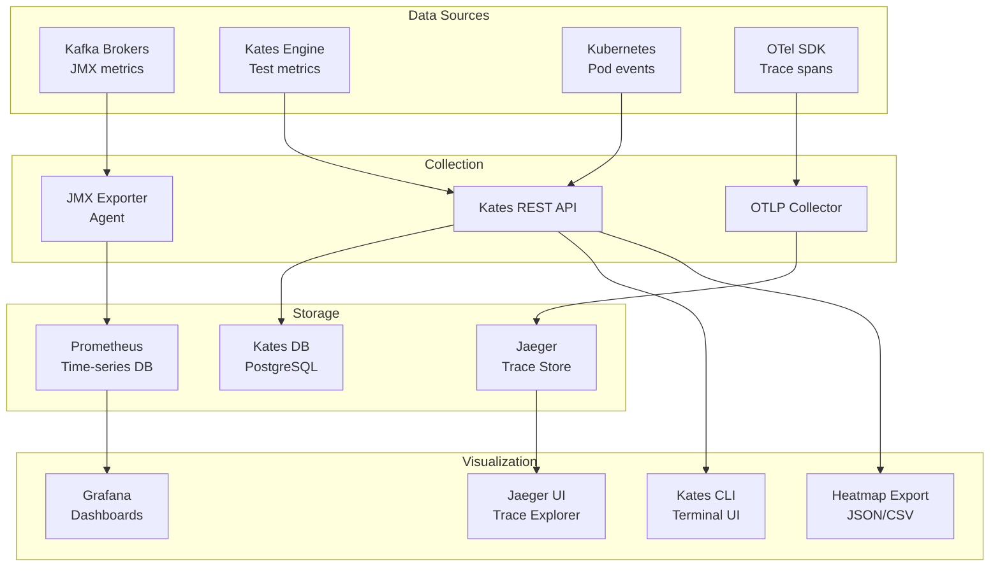
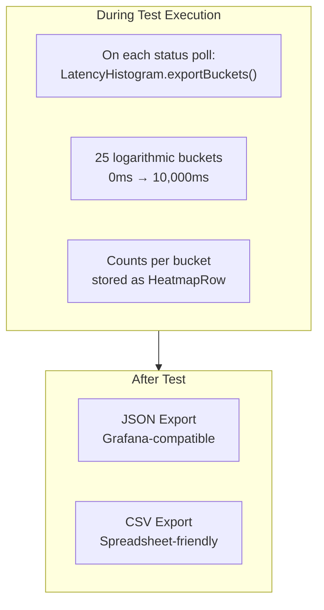

# Observability & Monitoring

Running a Kafka performance test without monitoring is like driving at night with no headlights. You might arrive safely, but you won't know how close you came to the edge. A test that reports "45,000 rec/s, P99 = 12ms" tells you the result — but it doesn't tell you *why*. Was broker 2 doing twice the work? Were ISRs shrinking under load? Was GC pausing every 30 seconds? Without observability, you're guessing.

This chapter covers everything you need to turn raw numbers into understanding: Grafana dashboards, Kates-specific metrics, latency heatmaps, distributed tracing, alerting, and the CLI tools that tie it all together. By the end, you'll know not just *what* to monitor, but *when* to look at each tool and *what the patterns mean*.

After this chapter, you can:

- Walk the four-step diagnostic sequence — cluster health, performance, broker internals, replication — after any test run
- Pick the right Grafana dashboard or CLI tool for the question you're asking
- Export a latency heatmap and read the patterns that percentiles hide
- Track trends across runs and diff two reports to catch a regression before it ships

---

## Observability Architecture

Before diving into dashboards and metrics, it helps to understand how data flows from Kafka brokers and the Kates engine into the tools you'll use day-to-day. The architecture has four layers: sources generate data, collectors normalize and transport it, storage backends retain it, and visualization tools let you query and explore.


```mermaid
graph TB
    subgraph Sources["Data Sources"]
        KB[Kafka Brokers<br/>JMX metrics]
        KE[Kates Engine<br/>Test metrics]
        K8S[Kubernetes<br/>Pod events]
        OTEL[OTel SDK<br/>Trace spans]
    end
    
    subgraph Collection["Collection"]
        JMX[JMX Exporter<br/>Agent]
        API[Kates REST API]
        OTLP[OTLP Collector]
    end
    
    subgraph Storage["Storage"]
        PROM[Prometheus<br/>Time-series DB]
        DB[Kates DB<br/>PostgreSQL]
        JAEGER[Jaeger<br/>Trace Store]
    end
    
    subgraph Visualization["Visualization"]
        GRAF[Grafana<br/>Dashboards]
        CLI[Kates CLI<br/>Terminal UI]
        HM[Heatmap Export<br/>JSON/CSV]
        JUI[Jaeger UI<br/>Trace Explorer]
    end
    
    KB --> JMX --> PROM --> GRAF
    KE --> API --> DB
    API --> CLI
    API --> HM
    K8S --> API
    OTEL --> OTLP --> JAEGER --> JUI
```

Each Kafka broker exposes its JMX MBeans as Prometheus metrics through the **JMX Prometheus Exporter agent**, configured by the kafka-cluster chart's metrics ConfigMap (`charts/kafka-cluster/templates/metrics-configmap.yaml`). Prometheus scrapes these endpoints (plus the Kates engine's own `/q/metrics`) on its scrape interval — 30 seconds by default. Grafana queries Prometheus to render dashboards. Meanwhile, the Kates engine writes test results to PostgreSQL and exposes them through its REST API — which the CLI consumes for terminal dashboards, trend charts, and heatmap exports.

---

## Reading the Dashboards: A Diagnostic Walkthrough

You've just finished a 10-minute LOAD test. The CLI reports 48,000 rec/s throughput and P99 latency of 14ms. Those are good numbers — but are they the *whole* story? Here's how to read the dashboards, in what order, and what each pattern means.

### Step 1: Check Cluster Health First

Open **Kafka — KRaft Operations** and read its six-stat header. This is your starting point after *every* test, whether it passed or failed. You're answering one question: "Was the cluster healthy throughout the test, or did something break?"

**Active controllers** must be exactly 1 for the whole window. Zero means the quorum had no leader, and a cluster with no controller looks perfectly healthy from a client while nothing new can happen — no topic created, no leader elected, no broker fenced or unfenced. **Fenced brokers** is the one that catches what Kubernetes cannot: a fenced broker is Running, passes both probes, publishes its metrics, and serves nothing. **Metadata lag (worst node)** is the KRaft-only failure with no ZooKeeper equivalent — a broker operating on a stale view of topics, ACLs and leadership while every other panel says it is fine.

Then drop to the **Cluster health** section for **Offline Partitions** and **Partitions below min.insync.replicas**. Both should be zero for the entire duration. Note the trap on offline partitions: only the active controller publishes that series, so when the quorum has no leader the panel goes empty rather than to zero, and an empty panel is not a zero.

For broker health as a *machine* — CPU, disk, volumes, per-listener connections — use the Strimzi operator's own `strimzi-kafka.json`, which covers it better than anything in this repository and which the KRaft board links to from its header.

### Step 2: Examine Performance Metrics

Now switch to **Kafka — Performance & Load Testing**. Look at **Messages in /s** — it should match your configured producer throughput. If it's significantly lower, the producer couldn't sustain the target rate, which means you were testing the *producer's* limits, not the *cluster's*.

Check **Cluster throughput, in and out** to understand the data volume. If bytes out significantly exceeds bytes in, you have multiple consumer groups reading the same data — which is fine, but it means you're testing read amplification too.

Every panel in that row carries `topic=""`. Kafka registers the throughput meters twice, once per topic and once with no topic tag for the broker aggregate, and an absent label matches the empty string — so a query without that matcher counts every byte twice. [`dashboards/METRICS.md`](https://github.com/bmscomp/kates/blob/main/dashboards/METRICS.md) is where that and three other naming traps are written down.

### Step 3: Investigate Latency Sources

If your P99 was higher than expected, open the **Broker Internals** section of the same board. **Request and response queue size** growing during the test means requests were arriving faster than the broker could process them; a healthy cluster keeps this near zero. **Request handler idle (windowed)** is the better saturation signal — below 0.3 the broker itself is the bottleneck, and that is exactly what `KafkaRequestHandlerSaturated` fires on.

Read it beside **Request handler idle (lifetime mean)**, which is deliberately on the same board. The lifetime form is a mean since the broker started, so a node up for a week and saturated for an hour still reads a comfortable number. When the two disagree, the windowed one is the one describing your test.

With `acks=all`, every produce request is parked in the broker's produce purgatory until all ISR members replicate it. There is no dedicated purgatory panel, but a clean request queue combined with high produce latency usually means replication — not request processing — is the bottleneck; verify that in the next step.

### Step 4: Verify Replication

Finally, open the **Replication** section. During a normal test, **ISR shrinks and expands /s** should stay flat at zero and **Under-replicated partitions** should be zero for the entire duration. If ISRs shrank during the test, followers were struggling to keep up — likely because of disk I/O pressure or network saturation.

**Replication traffic** is the panel most easily forgotten: follower fetch traffic is invisible in the client-facing throughput numbers and is frequently what actually saturates the network. And if you are running across availability zones, **Throughput by zone** and **Leaders by zone** tell you how much of the test's traffic crossed a zone boundary — a cost problem before it is a latency one.

::: {.callout-tip}
Get in the habit of following this sequence — cluster health → performance → internals → replication — after every test. It takes 60 seconds and catches problems that aggregate metrics hide. If a test result surprises you, the dashboards will almost always explain why.
:::

---

## The Dashboard Set

Twelve dashboards, and all of them live in one place: [`dashboards/`](https://github.com/bmscomp/kates/tree/main/dashboards). Each board is a directory holding the board's source, its generated JSON, a manifest saying where it is delivered, and a `README.md` explaining what that board answers and what each section means when it moves.

| Board | Delivered by | What it answers |
|---|---|---|
| Kafka — KRaft Operations | `charts/monitoring` | Is the quorum healthy, is metadata committing, has every broker applied it, and what is failing to replicate, serve or store the data underneath? |
| Kafka — Performance & Load Testing | `charts/monitoring` | What does the cluster do under load — throughput per broker and per zone, where the replication path strains, how saturated the brokers are, and a per-topic, per-partition view while a run is in flight |
| Kates — Application Health | `charts/monitoring` | Is the Quarkus process behind the benchmark API healthy? |
| Kates — Benchmark (live) | `charts/monitoring` | What is this run doing right now? |
| Kates — Trend & Regression | `charts/monitoring` | Has performance moved across runs? |
| Kates — Chaos | `charts/monitoring` | What happened to the cluster and the workload when the experiment fired? |
| Kates — Chaos infrastructure | `charts/kates-chaos` | Is the LitmusChaos execution plane installed, running, and has it run anything? |
| Kates — Overview | `charts/kates` | What does one Kates release know about itself, with nothing else installed? |
| Kyverno Security Policies | `charts/kates` | What did the admission webhook let through, what did it refuse, and what is it costing the API server? |
| Kafka Connect | `charts/connect-cluster` | Are the workers up, which connectors and tasks are running, what is failing or being dead-lettered? |
| Kafka MirrorMaker 2 | `charts/mirror-maker2` | Is the mirror up, is it lagging, is it erroring — and if it is lagging, which leg and which end? |
| Kafka MirrorMaker 2 — migration | `charts/mirror-maker2` | Can I cut over yet, and if not, what is left? |

The chart that delivers a board is the chart that owns the workload it watches. That is why the Connect board ships with `connect-cluster` and both MirrorMaker 2 boards ship with `mirror-maker2`: those charts vendor their own exporter rules, so their boards and their rules stay in step through one version bump. The two Kafka boards and four of the Kates boards ship with `charts/monitoring`, which is where the Grafana lives. **Kates — Overview** is one exception in its family — the application chart ships it, and it reads nothing but series the application publishes about itself, so `charts/kates` plus a Grafana is enough to make it work. **Kates — Chaos infrastructure** is the other, for the same reason read the other way round: `charts/kates-chaos` is the chart that installs LitmusChaos, so it is the chart that ships the board watching it.

Until this refactor that twelfth board was the exception to *all of them live in one place*: it was hand-written JSON inside `charts/kates-chaos/templates/grafana-dashboard.yaml`, with no panel descriptions, no layout gate over it, and four series or labels that LitmusChaos does not publish. It is now generated from `dashboards/kates-chaos-infra/` like everything else.

### The JSON Is Generated

Each board is written as Python in `dashboards/<board>/board.py` and built into `dashboard.json` by `scripts/gen-dashboards.py`. Because a Helm chart cannot read a file outside its own directory, the generator also writes a copy into every chart named in the board's `manifest.yaml`, and the chart loads that copy with `.Files.Get`.

```bash
scripts/gen-dashboards.py          # regenerate every board and every chart copy
scripts/gen-dashboards.py --check  # what CI runs; fails on a hand-edited copy
```

Never edit `dashboard.json` or a chart's copy of it. Edit `board.py` and regenerate — `--check` fails the build otherwise, the same contract `gen-chart-table.sh` and `gen-version-matrix.sh` already use.

Generating rather than hand-writing buys three guarantees that the boards this set replaced could not offer. Positions and panel ids come from the layout packer, so no board can number a panel into an overlap. The datasource comes from the panel constructor, so no board can name one by string and break on a Grafana whose datasource has a different name. And the constructor refuses to build a panel without a description, so every panel carries one. Two further gates run in CI: `scripts/check-dashboards.py` holds the whole directory to those rules, and `scripts/check-metric-contract.sh` runs the exporter rules over a catalogue of MBeans and fails when any board reads a series no rule can produce.

### What the Strimzi Operator Already Covers

The strimzi-operator chart ships nine upstream dashboards and enables them by default, and their label selectors match what this repository's PodMonitors emit. Four of them are authoritative, and the boards here deliberately do not restate them:

| Upstream board | Covers |
|---|---|
| `strimzi-kafka.json` | Broker health as a machine: an eight-stat header, `_total` counters read correctly, `_percent` idle gauges, per-listener connections, disk I/O, log size, the full JVM, container and volume set |
| `strimzi-kraft.json` | Quorum *identity*: state, current leader, current vote, epoch, high watermark, log end offset, append and fetch rates, commit latency average |
| `strimzi-cruise-control.json` | Cruise Control: anomaly detection, goal optimization, the load monitor |
| `strimzi-kafka-exporter.json` | Consumer group lag |

So **Kafka — KRaft Operations** is explicitly not a rebuild of `strimzi-kafka.json`. It covers the other half: metadata lag, metadata errors, fenced brokers, the quorum-degradation signals, ISR dynamics, per-error-code request failures, tiered storage, and the authentication counters — roughly half of the producible broker and controller series that no board, upstream or local, used to show. Its header links straight to the upstream set.

The division of labour is asymmetric, and worth knowing before you go looking upstream for a Connect board. `strimzi-kafka-connect.json` reads 21 `kafka_*` names and exactly one of them is producible by this repository's Connect exporter rules; `strimzi-kafka-mirror-maker-2.json` reads 22, and again exactly one. For Connect and MirrorMaker 2 the boards in `dashboards/` are the only ones that work here.

### What the Metrics Mean

[`dashboards/METRICS.md`](https://github.com/bmscomp/kates/blob/main/dashboards/METRICS.md) is the reference for every series any board reads — its type, its labels, one or two sentences of operational meaning, how to query it where that is not obvious, and which boards read it. It also says, for each one, whether this repository publishes it or whether something else has to be installed first, so an empty panel can be read as *nothing is wrong* rather than *nothing publishes this*.

Read its opening section before writing a PromQL query against a Kafka broker. Four naming traps account for most of the dead panels this set replaced:

- `_max_total` is not a counter. The exporter appends `_total` to anything a COUNTER rule names and the KRaft rules type `.+-max` as COUNTER, so `kafka_server_raftmetrics_commit_latency_max_total` is a max gauge in milliseconds. Never `rate()` it.
- `_count_total` is a meter's `Count` attribute, and the unit is not always a count — `…requesthandleravgidlepercent_count_total` is cumulative nanoseconds of idle time.
- Percentiles are pre-computed gauges carrying a `quantile` label, with no `_sum` and no buckets. Select the quantile; `histogram_quantile()` has nothing to work with.
- `BrokerTopicMetrics` is registered twice, per topic and with no topic tag, so a total needs `topic=""` and a per-topic panel needs `topic!=""`.

### The Nine Legacy Boards Are Gone

kates-monitoring 1.3.0 removes the nine deprecated Kafka and Strimzi boards — `kafka-dashboard`, `kafka-comprehensive`, `kafka-jvm`, `kafka-all-metrics`, `kafka-working`, `kafka-perf-test`, `kafka-performance`, `kafka-perf-global` and `strimzi-operator-dashboard` — along with the `legacyKafkaDashboards.enabled` value that gated them. Setting that value now does nothing, and the chart's NOTES say so on upgrade.

They went for two reasons. Eight were subsets of `strimzi-kafka.json` or of each other: across the nine, 82 panels carried 31 distinct concepts, one panel titled *Active Brokers* existed five times, and `kafka-jvm-dashboard.json` had exactly one unique panel out of four. And the one board with substantial unique content, `kafka-perf-global`, read seven metric names that no exporter rule produces — and those seven names were exactly its eight unique panels. Its content survives, rebuilt on corrected names, as **Kafka — Performance & Load Testing**.

That single unique JVM panel is carried over too. *JVM Non-Heap Memory* was the only place in the nine deleted boards reading `jvm_memory_used_bytes{area="nonheap"}`: `kafka-perf-global`'s JVM row is heap-only, and upstream `strimzi-kafka.json` sums the same series across memory areas without breaking them out. Non-heap — metaspace, the code cache, the compressed class space — is flat on a healthy broker, is not bounded by `-Xmx`, and is the line that moves when a plugin, an authorizer or an interceptor leaks classes. It is now a third series on **Kafka — Performance & Load Testing**'s *Heap and non-heap memory* panel, so deleting the board did not stop the number being plotted.

::: {.callout-note}
If you upgrade a `mirror-maker2` release to chart 0.9.0, its two boards arrive under new uids: the old scheme truncated the release name, so two releases sharing a prefix silently overwrote each other's board, and the fix appends a digest of the whole name. Grafana therefore installs a new board and leaves the old one behind. Delete the old uid, and repoint any link, playlist or annotation that names it. `charts/kates` 0.8.0 keeps both of its uids, so its boards are replaced in place.
:::

---

## Kates-Specific Dashboards

Six of the twelve boards are tailored to the Kates benchmark engine itself — one live run, trends across runs, application health, chaos correlation, the chaos platform's own health, and the application chart's own self-contained overview. They are unique to Kates and won't exist in a standard Kafka monitoring setup. Four are delivered by `charts/monitoring`; **Kates — Overview** comes from `charts/kates` and **Kates — Chaos infrastructure** from `charts/kates-chaos`.

Each carries a `README.md` beside its `board.py` that documents the board panel by panel and — more usefully — says which metrics come from the application, which from kube-state-metrics, and which from an exporter you have to install yourself. Those READMEs are the reference; this chapter is the tour.

### Kates — Benchmark (live)

**File:** `kates-benchmark.json` | **UID:** `kates-benchmark-overview` | **Docs:** `dashboards/kates-benchmark/README.md`

This is your real-time view during active benchmark runs. Open it *while a test is running* to watch throughput ramp up, latency settle, and phases transition. It's the closest thing to a cockpit view of your test.

| Row | Panels |
|---|---|
| (header) | Active runs, records moved, errors, SLA constraints breaching |
| Throughput | Records/sec and MB/sec timeseries |
| Latency | Percentiles (P50/P95/P99/P99.9) and the worst observed latency |
| Phase detail | Record rate by phase, P99 by phase, records by phase |
| SLA and errors | Error rate and SLA constraints breaching, by constraint |

**Template variables:** `$job`, `$run_id`, `$test_type` — use these to pick an installation and drill into a specific run, or compare test types side by side.

Expect this board to be **empty between runs**. Every series on it is tagged with `run_id`, and those meters are unregistered when the run ends so that an unbounded label cannot grow Prometheus without limit. The history is on the trend board below, which reads the samples these meters already wrote.

### Kates — Trend & Regression

**File:** `kates-trend.json` | **UID:** `kates-trend-analysis` | **Docs:** `dashboards/kates-trend/README.md`

Where the Benchmark dashboard shows one test, the Trend dashboard shows *all* tests over time. This is how you detect performance regressions — if P99 latency has been creeping up over the last 20 runs, you'll see it here as an upward trend line. It also aggregates platform-level stats like test completion rates and SLA pass rates.

| Row | Panels |
|---|---|
| Throughput trend | Peak records/sec and MB/sec per run |
| Latency trend | P99 and P99.9 per run |
| Volume | Records moved per run — read this before believing the two rows above |
| Platform totals | Tests completed (by outcome), test duration (P50/P95/P99), SLA pass/fail rate, records processed rate |
| Disruptions | The engine's own injections: completion rate and duration (P50/P95) |

**Template variables:** `$job`, `$test_type` — both from `kates_tests_completed_total`, which is a platform counter and outlives any run. A variable built on a run-scoped series empties out the moment the cluster goes idle, which is precisely when this board is opened.

### Kates — Application Health

**File:** `kates-application.json` | **UID:** `kates-application-health` | **Docs:** `dashboards/kates-application/README.md`

This dashboard monitors the Kates engine itself — not Kafka, not the test results, but the Quarkus application running the tests. Use it when the Kates REST API feels slow, when tests are failing to start, or when you suspect the engine itself (not Kafka) is the bottleneck.

| Row | Panels |
|---|---|
| (header) | Pods ready, container restarts, uptime, database pods ready |
| HTTP | Request rate (by method), error rate (4xx/5xx), request latency (P50/P95/P99) |
| JVM | Heap (used/committed/max), GC pause, threads (live/daemon/peak) |
| Database | Agroal pool connections, acquisitions/sec, time waiting for a connection |
| Container resources | CPU cores and container memory, from cAdvisor |

**Template variables:** `$namespace`, `$job`, `$pod`, `$db_pod` — the pod list is derived from the application's own `process_uptime_seconds` series, so it is the set of pods Prometheus is actually scraping rather than the set whose names happen to match a regex.

If **time waiting for a connection** is climbing while the pool shows `active` pinned at its ceiling, the pool is too small and raising it will help. The same panel climbing with spare capacity means the database is slow and a bigger pool will not help.

The `jvm_*` names on this board are **Micrometer's**, not the Prometheus JMX agent's. This is a Quarkus application, not a broker: Micrometer publishes `jvm_memory_used_bytes{area="heap"}` and `jvm_gc_pause_seconds`, while the JMX agent the Kafka boards read publishes `jvm_memory_bytes_used{area="heap"}` and `jvm_gc_collection_seconds` for the same quantities. Neither is a fallback for the other.

### Kates — Overview

**File:** `kates-overview.json` (shipped by `charts/kates`, not the monitoring chart) | **UID:** `kates-overview` | **Title in Grafana:** `KATES — Overview` | **Docs:** `dashboards/kates-overview/README.md`

The application chart's own board, and the only one that reads **nothing but metrics the application publishes about itself** — no kube-state-metrics, no cAdvisor, no exporter. Install `charts/kates` and a Grafana and it works. Uptime, active runs, API traffic and latency, the JVM, and the Agroal pool.

Use Application Health instead if you are running the full monitoring stack; it answers a bigger question with more sources.

Chart 0.8.0 rebuilt this board from `dashboards/kates-overview/board.py`. Eleven of the names on the board it replaces could never produce data. **Five were renamable in place** — three Agroal gauges spelled `agroal_pool_*` where Quarkus publishes `agroal_*`, plus `kates_active_runs` and `kates_benchmark_throughput_records_per_sec`. The other six had no fix on this board, and **three panels went with them**: *Benchmark P99 Latency (ms)* (there has never been a `kates_benchmark_p99_latency_ms` meter under any spelling — the percentiles are one series with a `quantile` label, and the series that does publish them is per-run, so it lives on the benchmark boards and **appears nowhere on this one**), *Kafka Admin Connections* (Micrometer binds only the clients the Kafka extension creates, and this application builds its own `AdminClient`), and *Vert.x Event Loop Latency* (Vert.x's metrics options are not enabled). The CPU and JVM panels survived on corrected series — `process_cpu_usage` and `system_cpu_usage` in place of `process_cpu_seconds_total`, `jvm_memory_used_bytes{area="nonheap"}` in place of `process_resident_memory_bytes`, both of them Prometheus simpleclient default exports a Quarkus Micrometer registry never publishes.

The arithmetic: 13 panels at HEAD, 3 dropped, 2 added (*Request rate by endpoint*, *Time waiting for a connection*), so 12 panels — plus 3 row headers the old board did not have, which is the 15 objects the layout gate counts. Every expression is now scoped by a `$job` variable instead of having the release name interpolated into it, so one copy serves every release a Grafana can see.

### Kates — Chaos

**File:** `kates-chaos.json` | **UID:** `kafka-chaos-dashboard` | **Docs:** `dashboards/kates-chaos/README.md`

This is the most specialized dashboard in the stack. It correlates LitmusChaos experiment status with Kafka cluster health and Kates benchmark performance *on the same timeline*. When you run a chaos test, this dashboard answers the question: "What happened to my cluster and my test when the chaos experiment fired?"

| Row | Panels |
|---|---|
| (header) | Chaos engines running, passed/failed experiments, probe success rate |
| Kafka under fault | Broker readiness, restarts, CPU, memory |
| Experiment history | Experiment duration over time |
| Kates during chaos | Benchmark throughput, P99 latency and errors under the fault |
| RTO / RPO / data integrity | **Collapsed, and it cannot fill — see below** |

**Template variables:** `$namespace`, `$pod`, `$kates_job`.

> **The RTO / RPO / data-integrity row does not work, and it never has.**
>
> Its six panels read the `kafka:chaos:*` recording rules in `charts/monitoring/templates/prometheus-chaos-rules.yaml`. Those rules exist and install cleanly. But every one of them reads a `kates_integrity_result_*` or `kafka_chaos_*` series, and **nothing in this repository publishes any of them** — a `grep` across the whole tree finds the rule file and nothing else. A recording rule over a series that does not exist records nothing. Four SLA alerts sit on the same empty series (`KafkaRTOExceedsSLA`, `KafkaRPOExceedsSLA`, `KafkaDataLossDetected`, `KafkaE2ELatencySpike`) and can never fire.
>
> The values themselves are computed: `IntegrityResult` carries `producerRto`, `consumerRto`, `maxRto`, `rpo` and `dataLossPercent`, and the verifier fills them in on every run that carries an integrity check. They reach the REST API and the run report. They are never registered with Micrometer. `dashboards/kates-chaos/README.md` sets out the two ways to close that gap.
>
> Until then, the resilience evidence on this board is the **Kates during chaos** row: throughput, latency and errors observed by the workload while the fault was applied. It reads series the application actually publishes, and for most questions it is the better answer anyway — it measures what a client experienced rather than what a verifier concluded afterwards.

One more caveat on the header. `Chaos engines running` reads `kube_customresource_chaosengine_status_engine_status`, which requires kube-state-metrics to be **configured with custom-resource metrics for `ChaosEngine`** — not the default. Without that configuration the series does not exist, the panel's `or vector(0)` draws a reassuring zero, and the `and on() count(…) == 0` guard on `KafkaBrokerRestartUnexpected` is always true. Confirm the series exists before relying on either.

### Kates — Chaos infrastructure

**File:** `kates-chaos-infra.json` (shipped by `charts/kates-chaos`, not the monitoring chart) | **UID:** `kates-chaos-overview` | **Docs:** `dashboards/kates-chaos-infra/README.md`

The board for the layer underneath the one above: is the LitmusChaos execution plane installed, is its operator running, and has it actually run anything? Six panels, scoped to the namespace Litmus runs in — which is neither the Kafka namespace nor the namespace the experiments target.

Open it when **Kates — Chaos** is empty and you need to know whether that means *no fault was injected* or *nothing is installed*. The two kube-state-metrics panels (the operator's availability, and the infra pods' status) fill whether or not Litmus is scraped, which is what makes them the ones to read first: operator green with every Litmus panel blank means the chaos-exporter is off, not that the platform is down. It is off by default — `litmus-core.exporter.enabled`.

Until chart 2.1.0 this was hand-written JSON inside `charts/kates-chaos/templates/grafana-dashboard.yaml`, the twelfth board and the only one outside `dashboards/`. It had no panel descriptions, was covered by no gate, and four of the things it read do not exist: the `verdict` label on `litmuschaos_experiment_verdict` (the exporter emits `chaosresult_verdict`), `litmuschaos_engine_experiment_count` (no such series — the panel was titled *Chaos Engine Duration* and wanted `litmuschaos_experiment_total_duration`), `increase()` over a gauge that flips between 0 and 1, and a `pod=~".*chaos-operator.*"` matcher that can never match, because `chaos-operator` is the operator's *container* name while its Deployment is called `litmus`. The `uid` is unchanged, so Grafana replaces the board in place; the title changed, because *Kates Chaos Engineering* and *Kates — Chaos* side by side in one Grafana told nobody which was which.

---

## Kates Metrics Reference

Kates exposes two categories of Prometheus metrics: **benchmark metrics** that track individual test runs in real time, and **platform metrics** that accumulate across all runs. Both are scraped by Prometheus and power the Kates-specific Grafana dashboards described above.

### BenchmarkMetrics (Per-Run, Real-Time)

Registered by `BenchmarkMetrics.java` and labeled with `run_id`, `test_type`, and `phase`. These metrics are created when a benchmark starts and updated throughout its execution. Use them to build real-time dashboards or alert on in-progress test failures.

| Prometheus Metric | Type | Description |
|---|---|---|
| `kates_benchmark_active_runs` | Gauge | Number of active benchmark runs |
| `kates_benchmark_throughput_rec_sec` | Gauge | Current throughput in records/sec |
| `kates_benchmark_throughput_mb_sec` | Gauge | Current throughput in MB/sec |
| `kates_benchmark_latency_ms` | Gauge, per `quantile` | Latency percentiles (P50/P95/P99/P99.9), measured by the backend |
| `kates_benchmark_latency_ms_max` | Gauge | Worst latency observed in the phase |
| `kates_benchmark_records_total` | Counter | Records processed, per phase |
| `kates_benchmark_errors_total` | Counter | Tasks that reached a FAILED state |
| `kates_benchmark_sla_violations` | Gauge, per `metric` and `severity` | 1 while that SLA constraint is violated, 0 once it recovers |

`kates_benchmark_latency_ms` publishes under the names a Micrometer
`DistributionSummary` would use, but it is **not** one: the engine never sees
individual latencies, only the aggregates each poll of a backend returns, so
the percentiles are the backend's own and are published as gauges carrying a
`quantile` label. Select the quantile; never `histogram_quantile()` over
these, and never average two of them together. `http_server_requests_seconds_*`
on the application board *is* a real histogram and is the exception.

Every meter in this table is tagged with `run_id`, which is unbounded over
time, so `BenchmarkMetrics.endRun` unregisters them when a run finishes. They
exist only while a run is in flight — which is why the live board is empty
between runs and why the trend board's template variable reads
`kates_tests_completed_total` instead.

### KatesMetrics (Platform-Level, Cumulative)

Registered by `KatesMetrics.java` and persistent across benchmark runs. These metrics tell you about the health and usage of the Kates platform over time — how many tests have been run, how long they take, and whether SLAs are passing.

| Prometheus Metric | Type | Description |
|---|---|---|
| `kates_tests_completed_total` | Counter | Total tests completed (by test_type, outcome) |
| `kates_tests_duration_seconds` | Timer | Test execution duration (P50/P95/P99) |
| `kates_tests_throughput_rec_sec` | Summary | Final throughput per completed test (records/sec) |
| `kates_tests_throughput_mb_sec` | Summary | Final throughput per completed test (MB/sec) |
| `kates_sla_evaluations_total` | Counter | SLA evaluation outcomes (pass/fail) |
| `kates_disruptions_completed_total` | Counter | Disruption executions completed (by type, outcome) |
| `kates_disruptions_duration_seconds` | Timer | Disruption execution duration (P50/P95) |
| `kates_records_processed_total` | Counter | Cumulative records processed across all tests |

---

## Kates CLI Observability

Not everything requires a browser. The Kates CLI provides four terminal-based observability tools, each designed for a different workflow.

### Live Dashboard

The `kates dashboard` command provides a full-screen terminal dashboard — think of it as the CLI equivalent of the Grafana Benchmark dashboard. Use it when you want a quick overview without leaving your terminal.

```bash
kates dashboard
# or
kates dash
```

It shows:
- System health status
- Active tests count
- Recent test results table
- Kafka cluster summary

### Top (Live View)

Like `kubectl top`, but for Kates tests. Use it when multiple tests are running concurrently and you want to see which ones are active and how they're performing:

```bash
kates top
```

Shows running tests with real-time throughput and latency updates.

### Status (Quick Check)

A one-line system health check — the fastest way to verify that Kates and Kafka are both reachable:

```bash
kates status
```

Returns: engine status, Kafka connectivity, active test count, and any warnings.

### Cluster Watch

A live-refreshing cluster health dashboard with historical sparkline trends. Auto-refreshes every 5 seconds (configurable) and tracks the last 30 polls. This is the CLI tool you leave running in a side terminal during extended test sessions.

```bash
# Default 5-second refresh
kates cluster watch

# Custom interval
kates cluster watch --interval 10
```

The display shows:
- **Broker status** — count, controller identity
- **Partition health** — under-replicated ▁▂▃ sparkline, offline ▁▁▁ sparkline
- **Partition count** — total and per-topic breakdown with trend
- **Consumer groups** — count and active/empty state

Sparklines use Unicode block characters (▁▂▃▄▅▆▇█) to show the trend over the last 30 polls. A rising trend in under-replicated partitions is an early warning of cluster degradation — if you see ▁▁▂▃▅▇ in the under-replicated sparkline, something is going wrong and you should investigate before it gets worse.

---

## Latency Heatmaps

Heatmaps are Kates's most powerful observability feature. They preserve the **full latency distribution over time**, revealing patterns invisible in aggregate percentiles. Where a P99 metric tells you "99% of requests were under 15ms," a heatmap tells you "*when* the slow requests happened, *how many* there were, and *whether the pattern was sustained or momentary*."

For the theory behind why heatmaps matter and why percentiles alone are insufficient, see [Performance Theory](04-performance-theory.md#heatmaps-seeing-the-full-picture).

### How Heatmaps Work


```mermaid
graph TD
    subgraph Collection["During Test Execution"]
        direction LR
        H1["On each status poll:<br/>LatencyHistogram.exportBuckets()"]
        H2["25 logarithmic buckets<br/>0ms → 10,000ms"]
        H3["Counts per bucket<br/>stored as HeatmapRow"]
    end
    
    subgraph Export["After Test"]
        direction LR
        E1["JSON Export<br/>Grafana-compatible"]
        E2["CSV Export<br/>Spreadsheet-friendly"]
    end
    
    Collection --> Export
```

### Bucket Boundaries

The 25 heatmap buckets (defined by `HEATMAP_BOUNDARIES` in `LatencyHistogram.java`) use roughly logarithmic spacing, concentrating resolution where it matters most — in the low-latency range where small differences are significant:

| Bucket | Range | Focus |
|:-:|---|---|
| 1 | 0 – 0.5ms | Sub-millisecond operations |
| 2 | 0.5 – 1ms | Fast local writes |
| 3–7 | 1 – 10ms | Typical Kafka latency |
| 8–13 | 10 – 100ms | Moderate latency |
| 14–19 | 100 – 1,000ms | High latency / timeouts |
| 20–25 | 1,000 – 10,000ms | Extreme tail / failures |

### Exporting Heatmaps

```bash
# JSON (for Grafana) — run in a terminal, this writes kates-heatmap-<id>.json
kates report export <id> --format heatmap

# CSV (for spreadsheets) — writes kates-heatmap-<id>.csv
kates report export <id> --format heatmap-csv

# Pipe or redirect to send the export to stdout instead
kates report export <id> --format heatmap > heatmap.json
```

There is no output-file flag: when stdout is a terminal, the export is written to an auto-named file; when piped or redirected, it goes to stdout.

### REST API

```text
GET /api/tests/{id}/report/heatmap?format=json
GET /api/tests/{id}/report/heatmap?format=csv
```

### Reading Heatmap Data

The JSON payload carries the run ID, test type, bucket labels and boundaries, and a list of rows. Each row is a snapshot of the latency distribution, captured while the engine polls the running test:

```json
{
  "timestampMs": 1708012345000,
  "phase": "steady-state",
  "counts": [0, 0, 12, 145, 832, 456, 89, 23, 5, 1, ...]
}
```

Interpretation: at this snapshot, 832 messages fell in the 3–5ms bucket, 456 in the 5–7ms bucket, etc. The `phase` field tells you which test phase was active — compare the latency distribution during `ramp-up` vs. `steady-state` to see the effect of JVM warm-up.

### What Heatmaps Reveal

| Pattern | What It Means |
|---------|---------------|
| Single dense band | Uniform latency — healthy |
| Two horizontal bands | Bimodal latency — cache hit vs. miss |
| Vertical stripe | Latency spike at a point in time — GC or election |
| Gradual upward drift | Latency degrading over time — saturation |
| Sudden regime change | Configuration or topology changed mid-test |

---

## Trend Analysis

Individual test results are snapshots. Trend analysis turns those snapshots into a movie, letting you see how performance evolves over days and weeks. This is how you catch regressions early — before they reach production.

```bash
# View P99 latency trend for LOAD tests over the last 30 days
kates trend --type LOAD --metric p99LatencyMs --days 30

# View throughput trend
kates trend --type LOAD --metric throughputRecordsPerSec --days 30
```

The CLI renders sparkline charts for quick visual assessment:

```text
  P99 Latency (ms) — LOAD tests, last 30 days
  ▁▁▂▁▁▁▂▁▃▁▁▁▁▂▁▁▁▅▂▁▁▁▁▂▁▁▁▃▁▁
  min: 8.2   avg: 12.5   max: 45.3   current: 11.8
```

A sudden upward spike in the sparkline chart indicates a regression. That spike at position 18 (▅) — correlate it with your deployment history. Did you change a broker configuration, update the Kafka version, or modify the topic's partition count around that date?

---

## Report Comparison

Kates supports comparing multiple test runs side-by-side. This is essential for answering the question "did my change make things better or worse?" — comparing before/after runs eliminates the noise of absolute numbers and focuses on relative change.

```bash
# Compare two runs
kates report diff <id1> <id2>

# Summary comparison of multiple runs
kates report compare <id1>,<id2>,<id3>
```

### Diff Output

The diff command highlights meaningful differences with directional indicators:

| Metric | Run 1 | Run 2 | Change |
|--------|:---:|:---:|:---:|
| Throughput | 45,230 rec/s | 42,100 rec/s | -6.9% ▼ |
| P99 Latency | 12.3ms | 18.7ms | +52.0% ▲ |
| Avg Latency | 4.1ms | 5.8ms | +41.5% ▲ |
| Error Rate | 0.00% | 0.00% | — |

A 52% increase in P99 latency with only a 7% drop in throughput suggests the cluster is near its saturation point — small increases in load cause disproportionate latency increases. See [Performance Theory](04-performance-theory.md#the-two-pillars-throughput-and-latency) for why this non-linear relationship exists.

---

## Broker Metrics Correlation

Kates captures per-broker metrics as part of every test report. This is particularly valuable for detecting hot spots — situations where one broker is handling significantly more load than the others due to partition leader imbalance.

```bash
kates report brokers <id>
```

This shows which broker was under the most pressure during the test:

| Broker | Bytes In/s | Bytes Out/s | Request Rate | ISR Changes |
|:-:|:-:|:-:|:-:|:-:|
| 0 (leader) | 5.2 MB/s | 10.4 MB/s | 8,500/s | 0 |
| 1 (follower) | 5.2 MB/s | 0.1 MB/s | 100/s | 0 |
| 2 (follower) | 5.2 MB/s | 0.1 MB/s | 100/s | 0 |

This is particularly valuable after chaos tests — you can see exactly how the load redistributed when a broker went down. If broker 0 was the leader for most partitions and it gets killed, the bytes in/out should redistribute roughly evenly across the surviving brokers. If the redistribution is uneven, your partition assignment strategy may need attention.

---

## Export Formats Summary

The `kates report export` command supports six export formats, each designed for a different downstream consumer:

| Format | Command | Use Case |
|--------|---------|----------|
| CSV | `kates report export <id> --format csv` | Spreadsheet analysis |
| JUnit XML | `kates report export <id> --format junit` | CI/CD pipelines |
| Markdown | `kates report export <id> --format md` | Docs, PRs, and chat |
| HTML | `kates report export <id> --format html` | Shareable standalone report |
| Heatmap JSON | `kates report export <id> --format heatmap` | Grafana visualization |
| Heatmap CSV | `kates report export <id> --format heatmap-csv` | Spreadsheet analysis |

When stdout is a terminal, each export is written to an auto-named file (`kates-report-<id>.csv`, `kates-heatmap-<id>.json`, …); when piped or redirected, it goes to stdout — except HTML, which always writes a file. There is no `--format json`: for programmatic JSON, use `kates report show <id> -o json` or the REST API directly.

---

## Distributed Tracing

Kates uses **OpenTelemetry** to propagate traces across the entire request lifecycle — from REST API entry through Kafka producer/consumer operations to database queries. Tracing answers a different question than metrics: where metrics tell you *what* happened, traces tell you *where the time went* for a specific request.

### Configuration

Tracing is configured in `application.properties`:

| Property | Value | Purpose |
|----------|-------|---------|
| `quarkus.otel.enabled` | `true` | Master switch for OpenTelemetry |
| `quarkus.otel.exporter.otlp.endpoint` | `http://jaeger-collector.monitoring.svc:4317` | Jaeger collector address (`http://localhost:4317` in dev) |
| `quarkus.otel.exporter.otlp.protocol` | `grpc` | Export spans via OTLP over gRPC |
| `quarkus.otel.traces.sampler` | `parentbased_traceidratio` | Sample based on parent trace |
| `quarkus.otel.traces.sampler.arg` | `0.1` (prod) / `1.0` (dev) | 10% sampling in prod, 100% in dev |

::: {.callout-note}
The `0.1` sampling rate in production means only 10% of requests generate traces. This is a deliberate trade-off — tracing adds overhead, and at high throughput you don't need every request traced to spot patterns. In development, 100% sampling is used so you can trace any request.
:::

### What Gets Traced

| Layer | Span Name Pattern | Details |
|-------|-------------------|---------|
| JAX-RS | `GET /api/tests/{id}` | HTTP method + path |
| Kafka Producer | `kates-results send` | Topic, partition, serialized size |
| Kafka Consumer | `kates-dlq receive` | Topic, consumer group, lag |
| JDBC | `SELECT test_runs` | SQL operation + table |

### Viewing Traces

Deploy Jaeger with `make jaeger`, then access the UI at http://localhost:30086 (NodePort set in `config/monitoring/jaeger-values.yaml`):

1. Select service **kates** in the dropdown
2. Click **Find Traces** to see recent requests
3. Click a trace to see the full span tree (REST → Kafka → DB)

Each trace shows the complete request lifecycle as a waterfall diagram. Look for gaps between spans — these represent time spent in framework code, serialization, or network transit. A healthy trace shows spans tightly packed together; large gaps indicate inefficiency.

---

## Alerting

Kates ships PrometheusRule alerts alongside its charts. These alerts fire automatically when cluster health degrades, giving you early warning before problems become outages.

| File | Groups | What They Cover |
|------|--------|-----------------|
| `charts/kafka-cluster/templates/prometheusrule.yaml` | `kafka.cluster`, `kafka.consumer`, `kafka.kraft`, `kafka.network`, `strimzi.operator`, `kafka.replication`, `kafka.performance`, `kafka.cruisecontrol`, `kafka.certificates` | Offline/under-replicated partitions, controller health, disk usage, consumer lag, KRaft election rate, request latency, operator liveness, ISR shrink, log-flush latency, handler saturation, Cruise Control anomalies, certificate expiry |
| `charts/connect-cluster/templates/alerts.yaml` | `<release>.workers`, `<release>.connectors`, `<release>.records`, `<release>.slo` | Worker down, rebalance storms and stuck rebalances, worker heap, failed connectors and tasks, tasks not running, logged record errors, dead letter queue writes and failures, offset commit failures, sink lag, idle sources (opt-in), task-availability SLO burn (opt-in), and the recording rules they share |
| `charts/monitoring/templates/prometheus-chaos-rules.yaml` | `kafka-chaos-expected`, `kafka-chaos-unexpected`, `kafka-chaos-results`, `kafka-gameday`, `kafka-chaos-rto-rpo` | Chaos experiment status, unexpected broker restarts during chaos, Game Day workflows, RTO/RPO SLA breaches and data loss |

::: {.callout-warning}
The four alerts in `kafka-chaos-rto-rpo` — `KafkaRTOExceedsSLA`, `KafkaRPOExceedsSLA`, `KafkaDataLossDetected` and `KafkaE2ELatencySpike` — install cleanly and can never fire. They read `kafka:chaos:*` recording rules whose own inputs (`kates_integrity_result_*`, `kafka_chaos_*`) nothing in this repository publishes, which is the same gap that leaves the chaos board's bottom row empty. `dashboards/METRICS.md` and `dashboards/kates-chaos/README.md` set out what would have to be built to close it. Do not treat these four as coverage.
:::

### Alert Configuration

The alert rules are deployed as Kubernetes `PrometheusRule` resources, which the Prometheus operator discovers automatically. Each chart has its own toggle: `alerts.enabled` in `charts/kafka-cluster/values.yaml` and `charts/connect-cluster/values.yaml` (with extra labels via `alerts.labels`), and `chaosAlerts.enabled` in `charts/monitoring/values.yaml` (off by default).

The connect-cluster rules render only where the `monitoring.coreos.com/v1` API exists, are scoped to the release's own workers, take their thresholds from `alerts.thresholds` (opt-in rules under `alerts.sourceIdle` and `alerts.slo`), and link each alert to its section of [the Connect runbook](../connect-cluster-runbook.md) through `runbook_url`. Chart 2.0 renamed `KafkaConnectTaskCountMismatch`, `KafkaConnectHighErrorRate` and `KafkaConnectSourceLag` to `KafkaConnectTasksNotRunning`, `KafkaConnectErrorsLogged` and `KafkaConnectSourceIdle` — update Alertmanager routes that match on them.

For the other charts, thresholds and `for:` durations live in the rule templates themselves — to change one, edit the template or deploy your own `PrometheusRule` alongside. Here are three of the kafka-cluster rules as the chart renders them:

#### Consumer Group Lag

This alert fires when a consumer group falls behind, meaning messages are being produced faster than they're being consumed. A small lag during load tests is expected — sustained lag in production means your consumers are undersized.

```yaml
- name: kafka.consumer
  rules:
    - alert: KafkaConsumerGroupLag
      expr: kafka_consumergroup_lag_sum > 1000000
      for: 15m
      labels:
        severity: warning
      annotations:
        summary: "Consumer group lag exceeds threshold"
        description: "Consumer group {{ $labels.consumergroup }} has {{ $value }} messages lag."

    - alert: KafkaConsumerGroupLagCritical
      expr: kafka_consumergroup_lag_sum > 10000000
      for: 5m
      labels:
        severity: critical
      annotations:
        summary: "Consumer group lag critical"
        description: "Consumer group {{ $labels.consumergroup }} has {{ $value }} messages lag."
```

**When it fires:** Consumer lag exceeds 1 million messages for 15 continuous minutes (warning) or 10 million for 5 minutes (critical).
**What to do:** Check that consumer pods are running (`kubectl get pods`). If they're healthy, consider scaling the consumer group or investigating whether the consumer is blocked on downstream dependencies.

#### Offline Partitions

This is the most critical Kafka alert. Offline partitions mean messages can't be produced or consumed for those partitions — this is data unavailability.

```yaml
- name: kafka.cluster
  rules:
    - alert: KafkaOfflinePartitions
      expr: kafka_controller_kafkacontroller_offlinepartitionscount > 0
      for: 2m
      labels:
        severity: critical
      annotations:
        summary: "Kafka has offline partitions"
        description: "{{ $value }} partitions are offline on cluster krafter."
```

**When it fires:** Any partition has no leader for more than 2 minutes.
**What to do:** Check which brokers are down (`kates cluster watch`). If a broker crashed, Kafka should elect new leaders automatically — if it doesn't within a couple of minutes, check the KRaft controller logs for election failures.

#### Under-Replicated Partitions (Sustained)

Transient under-replication is normal during broker restarts. Sustained under-replication means data durability is at risk — if the remaining replica also fails, you lose data.

```yaml
- name: kafka.cluster
  rules:
    - alert: KafkaUnderReplicatedPartitions
      expr: kafka_server_replicamanager_underreplicatedpartitions > 0
      for: 5m
      labels:
        severity: warning
      annotations:
        summary: "Under-replicated partitions detected"
        description: "{{ $value }} partitions are under-replicated on {{ $labels.kubernetes_pod_name }}."
```

**When it fires:** Any partition has ISR < replication factor for more than 5 minutes.
**What to do:** Check broker disk I/O and network throughput. Slow disks or saturated networks prevent followers from keeping up with the leader. Also verify that `min.insync.replicas` is correctly configured — see [The Cluster Under Test](03-cluster.md).

---

## Monitoring Stack Deployment

The monitoring stack is installed via a **local wrapper chart** in `charts/monitoring/` that depends on `kube-prometheus-stack` v82.4.3:

| Component | Version | Source |
|---|---|---|
| Monitoring Chart (`kates-monitoring`) | 1.3.0 | Local wrapper (`charts/monitoring`) |
| Prometheus | v3.9.1 | Pinned in `charts/monitoring/values.yaml` |
| Grafana | 12.3.1 | Pinned in `charts/monitoring/values.yaml` |
| kube-prometheus-stack | `82.4.3` | Upstream dependency in `Chart.yaml`; also `versions.env` `PROMETHEUS_STACK_VERSION` |

### Deploying

```bash
# Detects the provider and picks the matching overlay —
# Kind gets values-kind.yaml (NodePort 30080)
make monitoring

# Generic Kubernetes (ClusterIP), no detection
make monitoring-generic
```

These commands will:

1. Build chart dependencies (`helm dependency build charts/monitoring`)
2. Install the local wrapper chart as the release `monitoring` in the `kafka` namespace, alongside the Kafka cluster
3. Deploy the boards in `charts/monitoring/dashboards/` as a ConfigMap — the two Kafka boards and four of the Kates boards, all six generated from `dashboards/` by `scripts/gen-dashboards.py`

There is no board switch to decide any more. Chart 1.3.0 removed the nine deprecated Kafka and Strimzi boards together with `legacyKafkaDashboards.enabled`; setting that value does nothing, and the chart's NOTES tell you so on upgrade. The remaining two Kafka boards read only series the vendored exporter rules produce, which `scripts/check-metric-contract.sh kafka-cluster` proves on every build.

To render the same thing by hand — which is what you do when you need a values chain the targets do not offer:

```bash
helm dependency build charts/monitoring

helm upgrade --install monitoring charts/monitoring \
  --namespace kafka --create-namespace \
  -f charts/monitoring/values-kind.yaml \
  --timeout 10m --wait
```

The other six boards come from the charts that own their workloads, each behind its own switch: `charts/kates` (`metrics.grafanaDashboard.enabled`, and `kyvernoPolicy.grafanaDashboard` for the Kyverno board), `charts/kates-chaos` (`monitoring.grafanaDashboard.enabled`), `charts/connect-cluster` (`dashboards.enabled`) and `charts/mirror-maker2` (`dashboard.enabled`, `dashboard.migration.enabled`). All of them are picked up by the same Grafana sidecar.

### Access

| Service | URL |
|---|---|
| Grafana | `http://localhost:30080` (NodePort on Kind) |
| Prometheus | `http://localhost:9090` (port-forward) |

Default Grafana credentials: `admin` / `admin`.

### Upgrading

To upgrade the monitoring stack, update the dependency version in `charts/monitoring/Chart.yaml` and `PROMETHEUS_STACK_VERSION` in `versions.env` — the latter is what `scripts/gen-version-matrix.sh` publishes to the [Version & Compatibility Matrix](appendix-d-versions.md), so leaving it behind makes the matrix lie. Then re-run:

```bash
helm dependency update charts/monitoring
```

To check available versions:

```bash
helm search repo prometheus-community/kube-prometheus-stack --versions | head -10
```

::: {.callout-tip}
**Try it**

Run a test end-to-end and read the results the way this chapter teaches — cluster first, then the run itself:

```bash
# Quick pre-check: engine and Kafka both reachable
kates status

# Run a LOAD test and wait for it to finish (note the test ID it prints)
kates test create --type LOAD --records 100000 --wait

# Walk the diagnostic sequence in Grafana (http://localhost:30080):
# cluster health, then performance, then broker internals, then replication

# Export the run's latency heatmap for Grafana
kates report export <id> --format heatmap

# See where this run lands in the 30-day P99 trend
kates trend --type LOAD --metric p99LatencyMs --days 30
```

Expect a healthy run: dashboards flat where they should be flat (zero under-replicated partitions, near-empty request queues), a heatmap file with one dense low-latency band, and a fresh point at the end of the trend sparkline.
:::

---

## Summary

- Read dashboards in a fixed order after every run — cluster health, then performance, then broker internals, then replication — and let the pattern, not a single number, tell the story.
- Every dashboard lives in `dashboards/`, generated from Python by `scripts/gen-dashboards.py` and delivered by the chart that owns the workload it watches — the two Kafka boards and four Kates boards by `charts/monitoring`, the rest by `charts/kates`, `charts/connect-cluster` and `charts/mirror-maker2`. Broker health, quorum identity, Cruise Control and consumer lag stay the Strimzi operator's own boards; these add what those omit.
- `dashboards/METRICS.md` says what every series on every board means, how to query it, and whether an empty panel means nothing is wrong or means nothing publishes it. The nine legacy Kafka boards and `legacyKafkaDashboards.enabled` are gone in kates-monitoring 1.3.0.
- The CLI covers the same ground without a browser: `kates dashboard` for an overview, `kates top` for running tests, `kates status` for a one-line check, and `kates cluster watch` for sparkline trends.
- Latency heatmaps preserve the full distribution over time; export one with `kates report export <id> --format heatmap` whenever a percentile can't explain a spike.
- `kates trend` and `kates report diff` turn snapshots into regression detection — compare runs instead of trusting absolute numbers.
- PrometheusRule alerts ship with the charts and fire on offline partitions, sustained under-replication, and runaway consumer lag — each chart carries its own enable toggle.

With the observability stack in place, the next step is standing up the cluster it watches: [Installing Kafka with the kafka-cluster Helm Chart](20-installation-guide.md) walks through that deployment from an empty namespace to a running Kafka.
