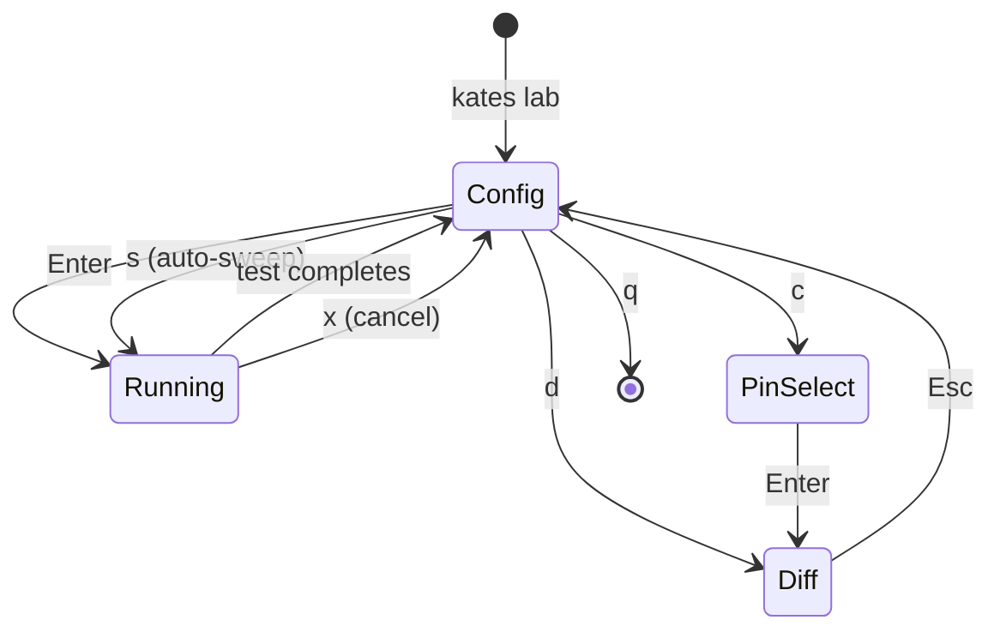

# Chapter 10b: Lab — Interactive Performance Tuning

The Lab is an interactive TUI for iterative Kafka performance tuning. Instead of running individual `kates test create` commands, Lab lets you tweak parameters, run tests, and compare results in a single live session — like a workbench for finding your cluster's optimal configuration.

```bash
kates lab
```

## When to Use Lab vs CLI

| Use Case | Tool |
|----------|------|
| Quick one-off test | `kates test create --type LOAD --wait` |
| CI/CD regression gate | `kates test apply -f scenario.yaml` |
| Iterative parameter tuning | **`kates lab`** |
| Exploring throughput/latency tradeoffs | **`kates lab`** |
| Sweeping a parameter across all values | **`kates lab`** |

## Layout

Lab splits the terminal into two panes:

```
┌─────────────────────────────────────────────────────────┐
│  Kates Lab  ·  Interactive Performance Tuning  →  URL   │
├──────────────────────────┬──────────────────────────────┤
│  ▸ Test Type     [LOAD]  │  Iteration History           │
│    Producers     [4]     │                              │
│    Records       [50000] │  #   Throughput  P99    Δ    │
│    Record Size   [512]   │  ──────────────────────────  │
│    Acks          [all]   │  1   45.2K rec/s 12ms   —    │
│    Compression   [lz4]   │  2   52.1K rec/s  8ms  ▲15%  │
│    Batch Size    [16384] │  3   48.7K rec/s 11ms  ▼7%   │
│    Linger ms     [0]     │                              │
│    Partitions    [6]     │  Throughput: ▃▇▅             │
│    Replication   [3]     │  P99 ms:     ▅▂▄             │
│                          │                              │
│                          │  Latency Distribution        │
│                          │  <1ms  ██████████████  50%   │
│                          │  1-5ms ████████        30%   │
│                          │  5-10  ████            15%   │
│                          │  10-50 █                4%   │
│                          │  50+ms ▏                1%   │
├──────────────────────────┴──────────────────────────────┤
│  ✓ #3 — 48.7K rec/s, p99=11.00ms  (23s)                 │
│  ↑↓ navigate  ←→ change  Enter run  p preset  d diff    │
└─────────────────────────────────────────────────────────┘
```

The left pane shows configurable parameters. The right pane shows iteration history with sparklines and a latency histogram that adapts to the last result's P99 value.

## Keyboard Reference

| Key | Context | Action |
|-----|---------|--------|
| `↑`/`↓` or `k`/`j` | Config | Navigate parameters |
| `←`/`→` or `h`/`l` | Config | Change selected parameter's value |
| `Enter` | Config | Run a test with current parameters |
| `p` | Config | Cycle through presets (Low Latency → Max Throughput → Durability) |
| `s` | Config | Start auto-sweep on the currently selected parameter |
| `m` | Config | Run 3 identical tests and record the median (stabilized result) |
| `W` | Config | Cycle warmup count (0→1→2→3→4→5→off) — warmup runs are discarded |
| `d` | Config | Show diff between last two iterations (or pinned pair) |
| `c` | Config | Open pin-select view to pick arbitrary iterations to compare |
| `e` | Config | Export all iterations to CSV (`~/kates-lab-{timestamp}.csv`) |
| `w` | Config | Save session to `~/.kates-lab-session.json` |
| `L` | Config | Load a previously saved session |
| `r` | Config | Retry the last failed test with the same parameters |
| `x` | Running | Cancel the running test (calls `POST /api/tests/{id}/cancel`) |
| `Esc` | Any sub-view | Return to config view |
| `q` | Config | Quit Lab |

## Presets

Presets apply a curated set of parameters for common test scenarios. Press `p` to cycle through them:

| Preset | Goal | Key Settings |
|--------|------|-------------|
| **Low Latency** | Minimize P99 | `acks=1`, `compression=none`, `batchSize=16384`, `lingerMs=0`, `producers=1` |
| **Max Throughput** | Maximize rec/s | `acks=all`, `compression=lz4`, `batchSize=262144`, `lingerMs=50`, `producers=8` |
| **Durability** | Zero data loss | `acks=all`, `replication=3`, `compression=lz4`, `batchSize=65536`, `lingerMs=5` |

Presets are starting points — after applying one, fine-tune individual parameters before running.

## Iteration Workflow



Each completed test creates an **iteration** — a snapshot of parameters and results. Iterations accumulate in the right pane, showing throughput, P99 latency, error rate, and a delta (▲/▼) against the previous iteration.

### Live Progress

While a test runs, the status bar displays live metrics:

```
⏳ Running iteration #4…  (12s)  23.4K rec  45.2K rec/s  p99=8.50ms
```

The elapsed time, records sent, throughput, and latency update every second.

## Comparing Iterations

### Quick Diff (`d`)

Press `d` to see a side-by-side comparison of the last two iterations (or the currently pinned pair):

```
Diff: #2 vs #3

Metric            #2              #3              Change
──────────────────────────────────────────────────────────
Throughput        52.1K rec/s     48.7K rec/s     ▼7%
P99 Latency       8.00 ms        11.00 ms        ▲38%
Avg Latency       3.20 ms         4.10 ms        ▲28%

Parameter Changes
────────────────────────────────────────
compression       lz4             snappy
batchSize         262144          65536
```

The diff view highlights which parameters changed between the two iterations alongside the resulting metric impact — the A/B heatmap that connects cause (parameter changes) to effect (metric changes).

### Pin & Compare (`c`)

Press `c` to open the pin-select view, where you can pick **any** two iterations using `↑↓` for A and `←→` for B:

```
Select Iterations to Compare

  ↑↓ = iteration A    ←→ = iteration B

  A  #1   45.2K rec/s  p99=12.00ms
     #2   52.1K rec/s  p99=8.00ms
  B  #3   48.7K rec/s  p99=11.00ms
```

Press `Enter` to confirm and view the diff.

## Auto-Sweep Mode

Auto-sweep systematically tests every value of a parameter while holding all others constant.

1. Navigate to the parameter you want to sweep (e.g., `Batch Size`)
2. Press `s`
3. Lab runs a test for each value: 16384 → 32768 → 65536 → 131072 → 262144

```
⟳ Sweep Batch Size = 65536 (3/5)
```

After the sweep completes, the iteration history shows results for all values side-by-side — use `d` or `c` to compare any pair and find the optimal setting.

## Warmup Mode (`W`)

The JVM needs time to JIT-compile hot code paths. The first 1–3 runs in a fresh session are typically slower and noisier than subsequent runs. Warmup mode discards a configurable number of iterations before recording the measured one.

Press `W` to cycle the warmup count (0 → 1 → 2 → 3 → 4 → 5 → off):

```
🔥 Warmup: 2 iteration(s) before measuring
```

When you press `Enter`, Lab runs 2 silent warmup iterations (results discarded) then runs the real measured iteration. This ensures the JVM is fully warmed up before collecting data.

> [!TIP]
> For stress tests with `acks=all`, set warmup to **2**. For quick load tests, **1** is usually enough.

## Median Mode (`m`)

Even after warmup, individual runs vary due to GC pauses, I/O scheduling, and OS jitter. Median mode runs the **same configuration 3 times** and records only the median result (by throughput), eliminating outliers.

Press `m` to start:

```
📊 Median mode: running 2/3…
```

After all 3 runs complete, a single iteration is added to the history with the middle throughput/P99 value. This gives you a **stable, reproducible** metric for parameter comparisons.

> [!NOTE]
> Median mode and warmup combine: if warmup is set to 2 and you press `m`, Lab runs 2+3+2+3+2+3 = 15 iterations internally but records only 1 aggregated result. For faster sessions, set warmup to 0 when using median mode — the first of 3 runs provides the warmup naturally.

## Export & Sessions

### CSV Export (`e`)

Exports all iterations with full parameters to a timestamped CSV file:

```
~/kates-lab-20260313-213045.csv
```

Columns: `iteration`, `throughput_rec_s`, `p99_ms`, `avg_latency_ms`, `delta`, `test_id`, plus every parameter key.

### Save Session (`w`) and Load Session (`L`)

Sessions persist iteration history and current parameter positions to `~/.kates-lab-session.json`. Use this to:

- Pause tuning and resume later
- Share a session file with a teammate
- Keep a baseline session for regression comparison

## Cancel & Retry

### Cancel (`x`)

Press `x` during a running test to cancel it immediately. Lab sends a `POST /api/tests/{id}/cancel` request to the backend and returns to the config view.

### Retry (`r`)

If a test fails (network error, timeout, etc.), the status bar shows:

```
✖ connection refused  ·  press r to retry
```

Press `r` to retry with the exact same parameters — the previous `CreateTestRequest` is reused.

## Duration Calculation

Lab calculates `durationMs` proportionally to the record count:

```
durationMs = (records / 1000) × 1000
```

With a floor of 60 seconds. This prevents the backend from using its default (15 minutes for STRESS tests) when the workload would finish much faster.

| Records | Duration |
|:-------:|:--------:|
| 10,000 | 60s (floor) |
| 50,000 | 60s |
| 100,000 | 100s |
| 500,000 | 500s |
| 1,000,000 | 1000s |
