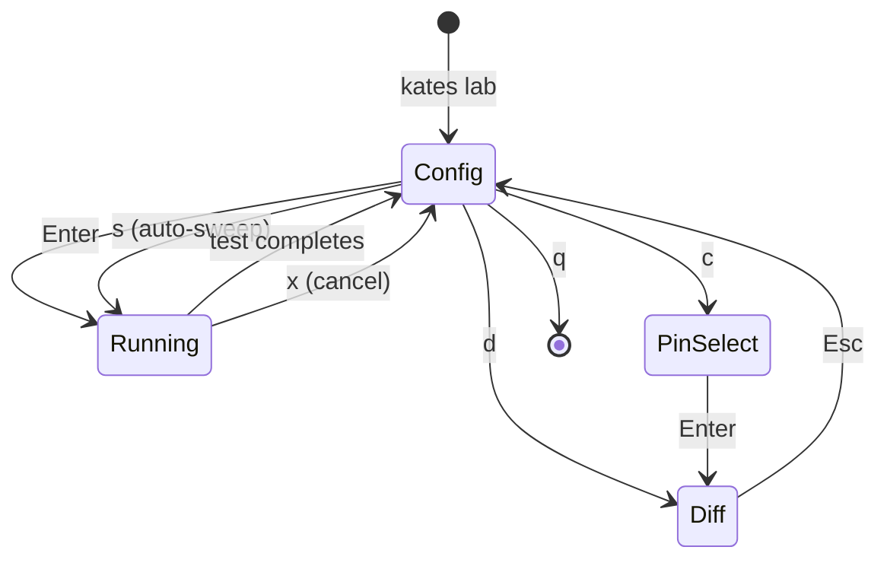

# Lab — Interactive Performance Tuning

The Lab is an interactive TUI for iterative Kafka performance tuning. Instead of running individual `kates test create` commands, Lab lets you tweak parameters, run tests, and compare results in a single live session — like a workbench for finding your cluster's optimal configuration.

```bash
kates lab
```

After this chapter, you can:

- Drive a full tuning session in the Lab TUI — apply presets, adjust parameters, and run measured iterations without leaving the terminal
- Sweep one parameter across all its values and pinpoint the winner with the diff and pin-and-compare views
- Stabilize noisy results with warmup and median modes before trusting a number
- Export every iteration to CSV and save the session as a baseline for later comparison

## When to Use Lab vs CLI

| Use Case | Tool |
|----------|------|
| Quick one-off test | `kates test create --type LOAD --wait` |
| CI/CD regression gate | `kates test apply -f scenario.yaml` |
| Iterative parameter tuning | **`kates lab`** |
| Exploring throughput/latency tradeoffs | **`kates lab`** |
| Sweeping a parameter across all values | **`kates lab`** |

## Layout

Lab splits the terminal into two panes:

```text
┌─────────────────────────────────────────────────────────┐
│  Kates Lab  ·  Interactive Performance Tuning  →  URL   │
├──────────────────────────┬──────────────────────────────┤
│  ▸ Test Type     [LOAD]  │  Iteration History           │
│    Producers     [4]     │                              │
│    Records       [50000] │  #   Throughput  P99    Δ    │
│    Record Size   [512]   │  ──────────────────────────  │
│    Acks          [all]   │  1   45.2K rec/s 12ms   —    │
│    Compression   [lz4]   │  2   52.1K rec/s  8ms  ▲15%  │
│    Batch Size    [16384] │  3   48.7K rec/s 11ms  ▼7%   │
│    Linger ms     [0]     │                              │
│    Partitions    [6]     │  Throughput: ▃▇▅             │
│    Replication   [3]     │  P99 ms:     ▅▂▄             │
│                          │                              │
│                          │  Latency Distribution        │
│                          │  <1ms  ██████████████  50%   │
│                          │  1-5ms ████████        30%   │
│                          │  5-10  ████            15%   │
│                          │  10-50 █                4%   │
│                          │  50+ms ▏                1%   │
├──────────────────────────┴──────────────────────────────┤
│  ✓ #3 — 48.7K rec/s, p99=11.00ms                        │
│  ↑↓ navigate  ←→ change  Enter run  p preset  d diff    │
└─────────────────────────────────────────────────────────┘
```

The left pane shows configurable parameters. The right pane shows iteration history with sparklines and a latency histogram that adapts to the last result's P99 value.

## Keyboard Reference

| Key | Context | Action |
|-----|---------|--------|
| `↑`/`↓` or `k`/`j` | Config | Navigate parameters |
| `←`/`→` or `h`/`l` | Config | Change selected parameter's value |
| `Enter` | Config | Run a test with current parameters |
| `p` | Config | Cycle through presets (Low Latency → Max Throughput → Durability) |
| `s` | Config | Start auto-sweep on the currently selected parameter |
| `m` | Config | Run 3 identical tests and record the median (stabilized result) |
| `W` | Config | Cycle warmup count (1→2→3→4→5→off) — warmup runs are discarded |
| `d` | Config | Show diff between last two iterations (or pinned pair) |
| `c` | Config | Open pin-select view to pick arbitrary iterations to compare |
| `e` | Config | Export all iterations to CSV (`~/kates-lab-{timestamp}.csv`) |
| `w` | Config | Save session to `~/.kates-lab-session.json` |
| `L` | Config | Load a previously saved session |
| `r` | Config | Retry the last failed test with the same parameters |
| `x` | Running | Cancel the running test (calls `POST /api/tests/{id}/cancel`) |
| `Esc` | Any sub-view | Return to config view |
| `q` | Config | Quit Lab |

## Presets

Presets apply a curated set of parameters for common test scenarios. Press `p` to cycle through them:

| Preset | Goal | Key Settings |
|--------|------|-------------|
| **Low Latency** | Minimize P99 | `type=SPIKE`, `acks=1`, `compression=none`, `batchSize=16384`, `lingerMs=0`, `producers=1` |
| **Max Throughput** | Maximize rec/s | `type=STRESS`, `acks=all`, `compression=lz4`, `batchSize=262144`, `lingerMs=50`, `producers=8` |
| **Durability** | Zero data loss | `type=LOAD`, `acks=all`, `replication=3`, `compression=lz4`, `batchSize=65536`, `lingerMs=5` |

Note that each preset also switches the **Test Type** (`SPIKE`, `STRESS`, or `LOAD`), so the top field changes when you cycle `p`. Presets are starting points — after applying one, fine-tune individual parameters before running.

## Iteration Workflow


```mermaid
stateDiagram-v2
    [*] --> Config: kates lab
    Config --> Running: Enter
    Config --> Running: s (auto-sweep)
    Running --> Config: test completes
    Running --> Config: x (cancel)
    Config --> Diff: d
    Config --> PinSelect: c
    PinSelect --> Diff: Enter
    Diff --> Config: Esc
    Config --> [*]: q
```

Each completed test creates an **iteration** — a snapshot of parameters and results. Iterations accumulate in the right pane, showing throughput, P99 latency, error rate, and a delta (▲/▼) against the previous iteration.

### Live Progress

While a test runs, the status bar shows the iteration number and elapsed time, updating every second:

```text
⏳ Running iteration #4…  (12s)
```

Throughput and latency metrics appear once the test completes.

## Comparing Iterations

### Quick Diff (`d`)

Press `d` to see a side-by-side comparison of the last two iterations (or the currently pinned pair):

```text
Diff: #2 vs #3

Metric            #2              #3              Change
──────────────────────────────────────────────────────────
Throughput        52.1K rec/s     48.7K rec/s     ▼7%
P99 Latency       8.00 ms        11.00 ms        ▲38%
Avg Latency       3.20 ms         4.10 ms        ▲28%

Parameter Changes
────────────────────────────────────────
compression       lz4             snappy
batchSize         262144          65536
```

The diff view highlights which parameters changed between the two iterations alongside the resulting metric impact — the A/B heatmap that connects cause (parameter changes) to effect (metric changes).

### Pin & Compare (`c`)

Press `c` to open the pin-select view, where you can pick **any** two iterations using `↑↓` for A and `←→` for B:

```text
Select Iterations to Compare

  ↑↓ = iteration A    ←→ = iteration B

  A  #1   45.2K rec/s  p99=12.00ms
     #2   52.1K rec/s  p99=8.00ms
  B  #3   48.7K rec/s  p99=11.00ms
```

Press `Enter` to confirm and view the diff.

## Auto-Sweep Mode

Auto-sweep systematically tests every value of a parameter while holding all others constant.

1. Navigate to the parameter you want to sweep (e.g., `Batch Size`)
2. Press `s`
3. Lab runs a test for each value: 16384 → 32768 → 65536 → 131072 → 262144

```text
⟳ Sweep Batch Size = 65536 (3/5)
```

After the sweep completes, the iteration history shows results for all values side-by-side — use `d` or `c` to compare any pair and find the optimal setting.

## Warmup Mode (`W`)

The JVM needs time to JIT-compile hot code paths. The first 1–3 runs in a fresh session are typically slower and noisier than subsequent runs. Warmup mode discards a configurable number of iterations before recording the measured one.

Press `W` to cycle the warmup count (1 → 2 → 3 → 4 → 5 → off):

```text
🔥 Warmup: 2 iteration(s) before measuring
```

When you press `Enter`, Lab runs 2 silent warmup iterations (results discarded) then runs the real measured iteration. This ensures the JVM is fully warmed up before collecting data.

::: {.callout-tip}
For stress tests with `acks=all`, set warmup to **2**. For quick load tests, **1** is usually enough.
:::

## Median Mode (`m`)

Even after warmup, individual runs vary due to GC pauses, I/O scheduling, and OS jitter. Median mode runs the **same configuration 3 times** and records only the median result (by throughput), eliminating outliers.

Press `m` to start:

```text
📊 Median mode: running 2/3…
```

After all 3 runs complete, a single iteration is added to the history with the middle throughput/P99 value. This gives you a **stable, reproducible** metric for parameter comparisons.

::: {.callout-note}
Median mode ignores the warmup setting: pressing `m` always runs exactly 3 back-to-back tests, with no warmup iterations inserted. Warmup applies only to tests started with `Enter`. In practice the first of the 3 median runs absorbs most of the warmup effect anyway.
:::

## Export & Sessions

### CSV Export (`e`)

Exports all iterations with full parameters to a timestamped CSV file:

```text
~/kates-lab-20260313-213045.csv
```

Columns: `iteration`, `throughput_rec_s`, `p99_ms`, `avg_latency_ms`, `delta`, `test_id`, plus every parameter key.

### Save Session (`w`) and Load Session (`L`)

Sessions persist iteration history and current parameter positions to `~/.kates-lab-session.json`. Use this to:

- Pause tuning and resume later
- Share a session file with a teammate
- Keep a baseline session for regression comparison

## Cancel & Retry

### Cancel (`x`)

Press `x` during a running test to cancel it immediately. Lab sends a `POST /api/tests/{id}/cancel` request to the backend and returns to the config view.

### Retry (`r`)

If a test fails (network error, timeout, etc.), the status bar shows:

```text
✖ connection refused  ·  press r to retry
```

Press `r` to retry with the exact same parameters — the previous `CreateTestRequest` is reused.

## Duration Calculation

Lab budgets roughly one millisecond per record when computing `durationMs`:

```go
durationMs := records / 1000 * 1000 // integer division: ~1 ms per record
if durationMs < 60000 {
    durationMs = 60000 // 60-second floor
}
```

This prevents the backend from falling back to its configured default duration (for STRESS tests, `kates.tests.stress.duration-ms` — 15 minutes out of the box) when the workload would finish much faster.

| Records | Duration |
|:-------:|:--------:|
| 10,000 | 60s (floor) |
| 50,000 | 60s (floor) |
| 100,000 | 100s |
| 500,000 | 500s |
| 1,000,000 | 1000s |

::: {.callout-tip}
**Try it**

Run a complete preset-to-CSV tuning session:

```bash
kates lab
```

Inside the TUI, press `p` twice to apply the Max Throughput preset, navigate to `Batch Size` and press `s` to sweep all five values, then press `e` to export and `q` to quit. Inspect the results:

```bash
column -s, -t ~/kates-lab-*.csv
```

Expect one iteration per batch-size value in the history; the CSV row with the highest `throughput_rec_s` names your sweet spot.
:::

## Summary

- Lab is the workbench for iterative tuning; keep `kates test create --type LOAD --wait` for one-off checks and `kates test apply -f` for CI regression gates
- Presets switch the test type along with the parameters — Low Latency (`SPIKE`), Max Throughput (`STRESS`), Durability (`LOAD`) — and are starting points to fine-tune, not final answers
- Auto-sweep (`s`) tests every value of one parameter while holding the rest constant; diff (`d`) and pin-and-compare (`c`) connect parameter changes to metric changes
- Warmup (`W`) discards JIT-cold runs before measuring, while median mode (`m`) runs three identical tests and keeps the middle result — and median ignores the warmup setting
- Export (`e`) writes every iteration with its full parameter set to a timestamped CSV, and sessions (`w`/`L`) persist history as a baseline for later comparison
- Lab derives test duration from record count (roughly one millisecond per record with a 60-second floor), so quick iterations never fall back to the backend's much longer default durations

Your cluster now has a tuned, evidence-backed configuration — [Chaos Engineering Theory](06-chaos-theory.md) asks the harder question of whether it survives when brokers, networks, and disks start failing.
