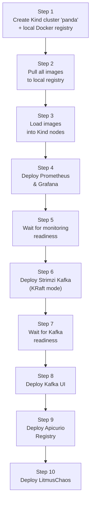
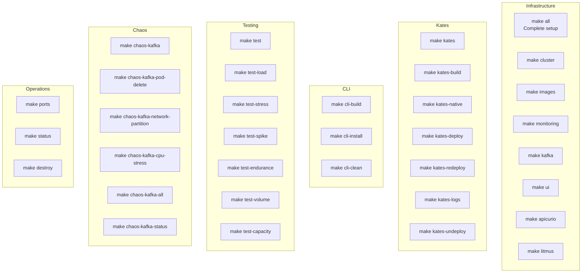

# Chapter 12: Deployment Guide

This chapter covers everything needed to deploy and operate the full Kates stack — from prerequisites to production operation.

## Prerequisites

| Tool | Version | Purpose |
|------|---------|---------|
| Docker | 20.10+ | Container runtime |
| Kind | 0.20+ | Local Kubernetes cluster |
| kubectl | 1.28+ | Kubernetes CLI |
| Helm | 3.12+ | Kubernetes package manager |
| jq | 1.6+ | JSON processing (optional) |
| Go | 1.22+ | CLI compilation (if building from source) |
| Java | 21+ | Backend compilation (if building from source) |
| Maven | 3.9+ | Backend build (bundled as `mvnw`) |

## Quick Deployment

```bash
# One command — deploys everything
make all
```

This executes a 10-step pipeline:



## Component-by-Component Deployment

If you need to deploy components individually:

### Kubernetes Cluster

```bash
# Start Kind cluster with 3 nodes
make cluster
```

Creates a Kind cluster named `panda` with:
- 1 control-plane node (alpha)
- 2 worker nodes (sigma, gamma)
- Zone labels for rack awareness
- Local-path storage provisioner per zone

### Image Management

```bash
# Pull all images to local registry
make images

# Check registry status
make registry-status
```

All images are defined in `images.env`. The pull script detects your platform (arm64/amd64) and pulls the correct architecture.

### Monitoring Stack

```bash
# Deploy Prometheus + Grafana
make monitoring
```

Deploys:
- Prometheus with Kafka JMX scrape targets
- Grafana with 7 pre-provisioned dashboards
- NodePort service at port 30080

### Kafka

```bash
# Deploy Strimzi operator + krafter cluster
make kafka

# Deploy Kafka UI
make ui

# Deploy schema registry
make apicurio
```

### LitmusChaos

```bash
# Deploy LitmusChaos operator
make litmus

# Access Litmus UI
make chaos-ui
# → http://localhost:9091 (admin/litmus)

# Deploy chaos experiments
make chaos-experiments
```

### Kates Application

```bash
# Build + deploy (full pipeline)
make kates

# Or step by step:
make kates-build     # Build JVM image + load into Kind
make kates-deploy    # Apply K8s manifests

# Native image (GraalVM)
make kates-native
```

### Kates CLI

```bash
# Build + install locally
make cli-install

# Cross-compile for all platforms
make cli-build

# Cleanup build artifacts
make cli-clean
```

## Access Points

After deployment, set up port forwarding:

```bash
make ports
```

| Service | URL | Credentials |
|---------|-----|-------------|
| Grafana | http://localhost:30080 | admin / admin |
| Kafka UI | http://localhost:30081 | — |
| Kates API | http://localhost:30083 | — |
| Litmus UI | `make chaos-ui` → http://localhost:9091 | admin / litmus |

## CLI Configuration

```bash
# Connect the CLI to Kates
kates ctx set local --url http://localhost:30083
kates ctx use local

# Verify connectivity
kates health
```

## Makefile Reference



### Full Target List

| Target | Description |
|--------|-------------|
| `make all` | Complete setup (cluster → images → all services) |
| `make cluster` | Start Kind cluster only |
| `make images` | Pull and load all images |
| `make monitoring` | Deploy Prometheus & Grafana |
| `make kafka` | Deploy Strimzi Kafka |
| `make ui` | Deploy Kafka UI |
| `make apicurio` | Deploy Apicurio Registry |
| `make litmus` | Deploy LitmusChaos |
| `make kates` | Build + deploy Kates application |
| `make kates-build` | Build Kates JVM image |
| `make kates-native` | Build Kates native image (see below) |
| `make kates-deploy` | Apply Kates K8s manifests |
| `make kates-redeploy` | Restart Kates deployment |
| `make kates-logs` | Stream Kates logs |
| `make kates-undeploy` | Remove Kates |
| `make cli-build` | Cross-compile CLI |
| `make cli-install` | Build + install CLI locally |

### Native Image Build

`make kates-native` builds a GraalVM native image of the Kates backend using Quarkus's native compilation pipeline. This produces a standalone binary with dramatically faster startup.

**Prerequisites:**
- GraalVM 21+ with `native-image` component installed
- Docker (used by Quarkus for in-container native builds)
- ~6GB free memory during compilation

**Build time:** Expect 3–8 minutes depending on hardware (native compilation is significantly slower than JVM builds).

**Startup comparison:**

| Mode | Startup Time | Memory at Idle | Use Case |
|------|:---:|:---:|----------|
| JVM (`make kates`) | ~2s | ~200MB | Development, debugging |
| Native (`make kates-native`) | ~0.05s | ~50MB | Production, CI/CD |

The native image is the recommended deployment mode for production and CI/CD environments where fast startup and low memory footprint matter.

```bash
# Build native image (in-container build, no local GraalVM needed)
make kates-native

# Verify
kubectl logs deployment/kates -n kates | head -1
# → started in 0.047s
```
| `make test` | Run baseline perf test |
| `make test-load` | Run load test |
| `make test-stress` | Run stress test |
| `make test-spike` | Run spike test |
| `make test-endurance` | Run endurance test |
| `make test-volume` | Run volume test |
| `make test-capacity` | Run capacity test |
| `make chaos-kafka` | Set up Kafka chaos |
| `make chaos-kafka-pod-delete` | Run pod-delete chaos |
| `make chaos-kafka-network-partition` | Run network partition |
| `make chaos-kafka-cpu-stress` | Run CPU stress |
| `make chaos-kafka-all` | Run all chaos experiments |
| `make chaos-kafka-status` | Check chaos status |
| `make ports` | Start port forwarding |
| `make status` | Check cluster status |
| `make destroy` | Destroy everything |

## Troubleshooting

### Images Won't Load

```bash
# Check registry health
make registry-status

# Manually pull and load
./pull-images.sh
./load-images-to-kind.sh
```

### Kafka Pods Not Starting

```bash
# Check Strimzi operator logs
kubectl logs -f deployment/strimzi-cluster-operator -n kafka

# Check Kafka pod events
kubectl describe pod pool-alpha-0 -n kafka
```

### Kates Can't Connect to Kafka

```bash
# Verify Kafka service
kubectl get svc -n kafka

# Check Kates logs
make kates-logs

# Verify bootstrap address in configmap
kubectl get configmap kates-config -n kates -o yaml
```

### Litmus Experiments Fail

```bash
# Check chaos operator
kubectl get pods -n litmus

# Check experiment status
make chaos-kafka-status

# View experiment logs
kubectl logs -f -l app=chaos-operator -n litmus
```

## Destroying the Environment

```bash
# Destroy everything (cluster + images + registry)
make destroy
```

This deletes the Kind cluster and all associated resources.
