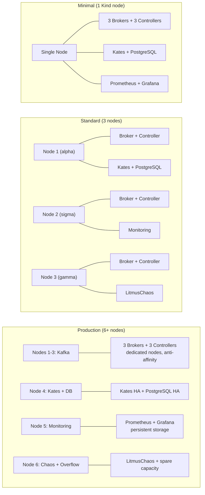
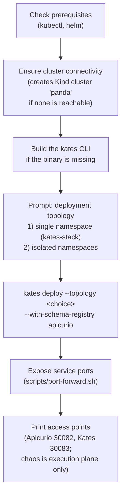
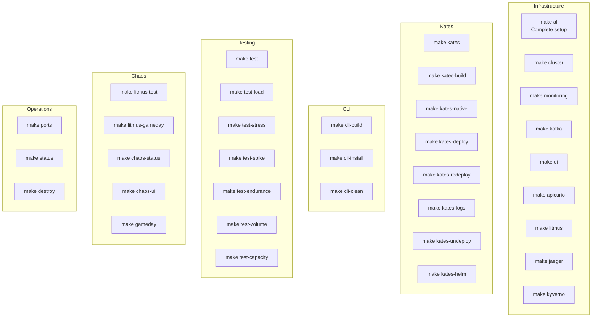

# Deployment Guide

> **Scope**: this chapter owns deploying the **Kates stack** — the backend, CLI, monitoring, and chaos tooling, and the topology choices between them. Provisioning the Kafka cluster itself is delegated to [Installing Kafka with the kafka-cluster Helm Chart](20-installation-guide.md) (the walkthrough) and [Kafka Deployment Engineering](15-kafka-deployment.md) (the rationale).

Deploying Kates is more than running `make all`. The choices you make *before* running that first command — how many namespaces, what service exposure strategy, how much memory to allocate — ripple through every test you'll run later. A deployment tuned for local experimentation will buckle under production load; a production topology is needless overhead on a laptop.

This chapter walks you through those decisions. You'll start with the architectural trade-offs that shape your deployment, then move through resource sizing and cloud-specific guidance, and finally reach the step-by-step deployment itself. By the end, you'll have a running stack that matches your environment — whether that's a single Kind cluster on your MacBook or a multi-node EKS deployment running continuous benchmarks.

After this chapter, you can:

- Choose a topology — namespace layout, service exposure, storage durability — that fits your environment
- Size CPU, memory, and disk per component so your tests measure Kafka, not resource contention
- Adapt the stack to EKS, GKE, or AKS with provider-specific values overlays
- Deploy everything with `make all` and verify it with `make status` and `kates health`

---

## Prerequisites

| Tool | Version | Purpose |
|------|---------|---------|
| Docker | 24+ | Container runtime |
| Kind | 0.33+ | Local Kubernetes cluster — older releases do not publish the node image `config/cluster.yaml` asks for |
| kubectl | 1.33+ | Kubernetes CLI — stay within one minor of the cluster, which runs Kubernetes 1.34 locally |
| Helm | 3.14+ | Kubernetes package manager |
| jq | 1.6+ | JSON processing (optional) |
| Go | 1.25+ | CLI compilation (if building from source) |
| Java | 21+ | Backend compilation (if building from source) |
| Maven | 3.9+ | Backend build (bundled as `mvnw`) |

---

## Deployment Architecture Decisions

Before deploying anything, there are three architectural decisions that will shape your topology. Getting these right up front avoids painful migrations later.

### Single-Namespace vs Multi-Namespace

The simplest deployment puts everything — Kafka, Kates, monitoring, chaos tools — into a single namespace. This is fine for local development on Kind where you want `kubectl get pods` to show everything in one place. But for shared or production environments, multi-namespace isolation is strongly recommended.

Why? Each namespace can have independent:
- **RBAC policies** — the team running chaos experiments shouldn't need write access to the Kafka namespace
- **Resource quotas** — prevent the monitoring stack from starving Kafka of memory during a spike
- **Network policies** — rules on which pods may reach which ports. They add up rather than override, and as the charts ship they leave the Kafka client listeners open to every pod in the cluster: the policy Strimzi generates admits any pod to a listener without `networkPolicyPeers`. A compromised monitoring pod can reach the brokers until you close the listeners — see [Security & Compliance](17-security.md#network-policies)

The isolated topology uses these namespaces by default:

| Namespace | Components | Why Separated |
|-----------|-----------|---------------|
| `strimzi-operator` | The Strimzi Cluster Operator, its CRD-upgrade hook and the Drain Cleaner | The operator is its own Helm release (`charts/strimzi-operator`) and owns cluster-scoped objects — the CRDs and its RBAC — which cannot belong to a per-cluster release |
| `kafka` | Brokers, controllers, Kafka UI, schema registry | The data plane the operator reconciles; a cluster-scoped operator watches it from outside |
| `kates` | Kates backend, PostgreSQL, CLI service | Application-tier isolation; independent scaling and restart policies |
| `monitoring` | Prometheus, Grafana, alerting rules | Monitoring must survive application failures — separate namespace ensures it stays up during chaos tests |
| `litmus` | LitmusChaos operator, experiment runners | Chaos tools need elevated privileges; isolation limits the blast radius of those permissions |

::: {.callout-tip}
For local Kind deployments, the multi-namespace layout still works — `make all` prompts you to choose between a single-namespace topology (everything in `kates-stack`) and the isolated multi-namespace topology, and the underlying `kates deploy` command defaults to `--topology isolated`. The only time single-namespace makes sense is throwaway CI environments where fast teardown (`kubectl delete namespace`) matters more than isolation.
:::

### NodePort vs Ingress vs LoadBalancer

How you expose services outside the cluster depends on where the cluster runs:

| Strategy | When to Use | Trade-offs |
|----------|------------|------------|
| **NodePort** | Local Kind clusters, CI runners | Simple — no external dependencies. Limited to ports 30000–32767. No TLS termination. |
| **Ingress** | Shared development clusters, staging | Path-based routing, TLS termination, single entry point. Requires an Ingress controller. |
| **LoadBalancer** | Production cloud deployments | Cloud-native L4 load balancing, static IPs, health checks. Usually public unless annotated internal. Costs money per service. |

The default deployment uses **NodePort** for all services (Grafana on 30080, Kafka UI on 30081, etc.). The Kind cluster does not publish those ports on the host, so `make ports` forwards each service it finds to the same port number on `localhost`. It looks for Grafana and Prometheus only in the `kafka` namespace, not in `monitoring`, where `kates deploy` installs them; [The Cluster Under Test](03-cluster.md#access-points) gives the command that reaches them. Cloud deployments should switch to internal LoadBalancers or Ingress — see the [Cloud Deployment](#cloud-deployment) section for provider-specific annotations.

### Ephemeral vs Persistent Storage for Test Data

Kates stores test results, run metadata, and configuration state in PostgreSQL. The storage decision matters:

- **Ephemeral (emptyDir)**: Data disappears on pod restart. Fine for local development where you're iterating on tests and don't care about historical results.
- **Persistent (PVC-backed)**: Data survives pod restarts and even cluster upgrades. Required for production deployments where you need historical trend analysis and audit trails.

For Kafka broker storage, **always use persistent volumes** — even in development. Kafka's log retention depends on data being durable, and losing broker data mid-test invalidates results.

### Deployment Topologies

The following diagram shows three representative topologies. Most teams start with Minimal, grow into Standard for shared use, and arrive at Production for continuous benchmarking:


```mermaid
graph TB
    subgraph Minimal["Minimal (1 Kind node)"]
        direction LR
        MN1["Single Node"]
        MN1 --- MB["3 Brokers + 3 Controllers"]
        MN1 --- MK["Kates + PostgreSQL"]
        MN1 --- MM["Prometheus + Grafana"]
    end

    subgraph Standard["Standard (3 nodes)"]
        direction LR
        SN1["Node 1 (alpha)"]
        SN2["Node 2 (sigma)"]
        SN3["Node 3 (gamma)"]
        SN1 --- SB1["Broker + Controller"]
        SN2 --- SB2["Broker + Controller"]
        SN3 --- SB3["Broker + Controller"]
        SN1 --- SK["Kates + PostgreSQL"]
        SN2 --- SM["Monitoring"]
        SN3 --- SL["LitmusChaos"]
    end

    subgraph Production["Production (6+ nodes)"]
        direction LR
        PN1["Nodes 1-3: Kafka"]
        PN4["Node 4: Kates + DB"]
        PN5["Node 5: Monitoring"]
        PN6["Node 6: Chaos + Overflow"]
        PN1 --- PB["3 Brokers + 3 Controllers<br/>dedicated nodes, anti-affinity"]
        PN4 --- PK["Kates HA + PostgreSQL HA"]
        PN5 --- PM["Prometheus + Grafana<br/>persistent storage"]
        PN6 --- PL["LitmusChaos + spare capacity"]
    end

    Minimal ~~~ Standard ~~~ Production
```

---

## Resource Sizing

Getting resource allocation right is critical. Under-provisioned Kafka brokers produce misleading benchmark results — you'll measure resource contention, not application performance. Over-provisioned local clusters waste developer time waiting for images to pull.

### Deployment Profiles

| Deployment Profile | Use Case | CPU | Memory | Disk | Nodes |
|---|---|---|---|---|---|
| **Minimal** | Local dev / CI | 6 cores | 16 GB | 50 GB | 1 (Kind) |
| **Standard** | Team testing | 12 cores | 32 GB | 200 GB | 3 |
| **Production** | Continuous benchmarking | 24+ cores | 64+ GB | 500+ GB | 6+ |

### Per-Component Breakdown

The following table shows resource requirements per component. Use this to right-size your nodes:

| Component | Instances | CPU (req / limit) | Memory (req / limit) | Disk | Notes |
|-----------|:---------:|:------------------:|:--------------------:|:----:|-------|
| Kafka Broker | 3 | 1000m / 2000m | 4Gi / 4Gi | 50Gi each | Heap 2Gi fixed; remainder is OS page cache |
| Kafka Controller | 3 | 500m / 1000m | 1Gi / 1Gi | 5Gi each | Lightweight — metadata only |
| Strimzi Operator | 1 | 200m / 500m | 384Mi / 384Mi | — | Watches CRs, low steady-state usage |
| Cruise Control | 1 | 500m / 1000m | 512Mi / 1Gi | — | Spikes during rebalance calculations |
| Kafka Exporter | 1 | 100m / 200m | 128Mi / 256Mi | — | Consumer lag metrics |
| Kates Backend | 1 | 500m / 2000m | 2Gi / 4Gi | — | JVM: `-Xms512m -Xmx2560m` with ZGC — 62.5% of the limit, see [JVM Tuning](#jvm-tuning) |
| PostgreSQL | 1 | 250m / 500m | 256Mi / 512Mi | 10Gi | Test results and metadata |
| Prometheus | 1 | 500m / 1000m | 1Gi / 2Gi | 50Gi | 30d retention in the generic overlay |
| Grafana | 1 | 100m / 200m | 128Mi / 256Mi | — | 13 pre-provisioned dashboards |
| LitmusChaos | 1 | 200m / 500m | 256Mi / 512Mi | — | Operator + experiment runners |

::: {.callout-important}
The **Minimal** profile (16 GB) runs everything but leaves almost no headroom. If your laptop has 16 GB of RAM, close memory-heavy applications (browsers, IDEs with large projects) before running `make all`. Docker Desktop should be configured with at least 10 GB of memory allocation.
:::

---

## Cloud Deployment

The default deployment targets Kind. Moving to a cloud provider requires adjustments to storage classes, service exposure, and identity federation. This section provides the key overrides for each major provider.

Every overlay below keeps its load balancers **internal**: reachable only from inside the cluster's VPC or VNet. The Kafka load balancers, and Grafana's on EKS and AKS, also admit only the ranges in `loadBalancerSourceRanges`; on GKE the Kates API and Grafana sit behind an internal Ingress, which takes no source ranges (see [Google GKE](#google-gke)). A LoadBalancer Service with no provider annotations usually gets a public address instead. The external Kafka listener still demands TLS and SCRAM-SHA-512, but a broker endpoint on the internet is attack surface all the same: anyone who can reach the port can probe its TLS stack, try passwords against SCRAM, and load the brokers with connections that authentication has yet to refuse. `10.0.0.0/16` stands for your VPC or VNet range in every overlay; add the peered or on-premises ranges your clients run in.

For Kafka, the chart passes `kafka.externalAccess.configuration` to the Strimzi listener's `configuration` unchanged. Strimzi creates one load balancer for the bootstrap and one per broker, and each needs the provider's annotations: `bootstrap.annotations` covers the first, `perBrokerAnnotationsTemplate` every broker whatever its node ID, and `loadBalancerSourceRanges` applies to all of them. `perBrokerAnnotationsTemplate` needs Strimzi 1.1.0 or newer (the version the repository pins is in the [Version & Compatibility Matrix](appendix-d-versions.md)). Strimzi 1.0.x does not have the field: the API server rejects the Kafka resource or drops the field, and a dropped field leaves every broker's Service on the provider's default. On 1.0.x, annotate the brokers one by one instead, under `configuration.brokers`, with a `broker` node ID and its `annotations` per entry. Grafana sits behind an internal load balancer too (an internal Ingress on GKE); it serves plain HTTP, so put TLS in front of it before you open it to more clients.

::: {.callout-important}
Open a load balancer to the internet only on purpose: switch the scheme (`internet-facing` on EKS; drop the internal annotation on GKE and AKS) and set `loadBalancerSourceRanges` to the public ranges of the clients that need it. On a public load balancer, empty ranges mean `0.0.0.0/0`. `kafka.externalAccess.allowedCidrs` does not replace them. It narrows the chart's own NetworkPolicy rule for the listener, but NetworkPolicies add up, and the policy the Strimzi operator generates for the cluster admits the listener's port from anywhere, because the `externalAccess` preset sets no `networkPolicyPeers` on the listener. Behind a load balancer the address a NetworkPolicy sees is also often a node or the load balancer rather than the client. So the overlays leave `allowedCidrs` empty and filter at the load balancer.
:::

### Amazon EKS

**Storage:** Use the `gp3` StorageClass instead of the default `gp2`. GP3 provides 3,000 baseline IOPS and 125 MB/s throughput regardless of volume size — GP2 scales IOPS with size, which means small test volumes get poor I/O performance.

**Load Balancer:** Use an internal AWS Network Load Balancer (NLB) for Kafka external access. NLB operates at L4 (TCP), which is what Kafka's binary protocol requires. The annotations below are read by the AWS Load Balancer Controller, which has to be installed in the cluster: `aws-load-balancer-type: external` hands the Service to it, `aws-load-balancer-nlb-target-type: ip` sends traffic straight to the pod, and `aws-load-balancer-scheme: internal` keeps the NLB inside the VPC. Without the controller the Services stay pending, since the in-tree provider leaves `external` to it.

**IAM:** Use IAM Roles for Service Accounts (IRSA) so the Kates pod can access AWS services (S3 for report storage, CloudWatch for metrics export) without embedding credentials.

```yaml
# kafka-eks.yaml — overlay for charts/kafka-cluster
nodePools:
  defaults:
    storage:
      volumes:
        - id: 0
          size: 100Gi
          class: gp3

kafka:
  externalAccess:
    type: loadbalancer
    configuration:
      # Who may connect, on the bootstrap and every broker
      loadBalancerSourceRanges:
        - 10.0.0.0/16
      bootstrap:
        annotations:
          service.beta.kubernetes.io/aws-load-balancer-type: "external"
          service.beta.kubernetes.io/aws-load-balancer-nlb-target-type: "ip"
          service.beta.kubernetes.io/aws-load-balancer-scheme: "internal"
      # Every per-broker Service, whatever its node ID
      perBrokerAnnotationsTemplate:
        service.beta.kubernetes.io/aws-load-balancer-type: "external"
        service.beta.kubernetes.io/aws-load-balancer-nlb-target-type: "ip"
        service.beta.kubernetes.io/aws-load-balancer-scheme: "internal"
```

```yaml
# kates-eks.yaml — overlay for charts/kates
serviceAccount:
  annotations:
    eks.amazonaws.com/role-arn: "arn:aws:iam::123456789012:role/kates-irsa-role"

postgresql:
  storage:
    size: 20Gi
    storageClass: gp3
```

```yaml
# monitoring-eks.yaml — overlay for charts/monitoring
kube-prometheus-stack:
  grafana:
    service:
      type: LoadBalancer
      annotations:
        service.beta.kubernetes.io/aws-load-balancer-type: "external"
        service.beta.kubernetes.io/aws-load-balancer-nlb-target-type: "ip"
        service.beta.kubernetes.io/aws-load-balancer-scheme: "internal"
      loadBalancerSourceRanges:
        - 10.0.0.0/16
  prometheus:
    prometheusSpec:
      storageSpec:
        volumeClaimTemplate:
          spec:
            storageClassName: gp3
            resources:
              requests:
                storage: 100Gi
```

### Google GKE

**Storage:** Use `premium-rwo` for SSD-backed PersistentVolumeClaims. This StorageClass provisions pd-ssd disks with much higher IOPS than the default `standard-rwo` (pd-balanced).

**Load Balancer:** `networking.gke.io/load-balancer-type: "Internal"` makes each Kafka Service an internal passthrough Network Load Balancer. GKE enforces `loadBalancerSourceRanges` twice: as VPC firewall rules, and in each node's own packet filtering (kube-proxy, or GKE Dataplane V2).

**Ingress:** GKE's built-in Ingress controller integrates with Google Cloud Load Balancing. The annotation `kubernetes.io/ingress.class: "gce-internal"` gives the Kates API and Grafana an internal Application Load Balancer; it has to be the annotation, because GKE's controller does not read `ingressClassName`. An internal Ingress needs a proxy-only subnet in the cluster's region and container-native load balancing, which the `cloud.google.com/neg` Service annotation turns on. A `BackendConfig`, named from the Service with `cloud.google.com/backend-config`, points the load balancer's health check at Kates's readiness endpoint.

With container-native load balancing, the load balancer's proxies connect straight to the pods from addresses in the proxy-only subnet, and its health checks come from `35.191.0.0/16` and `130.211.0.0/22`. GKE's Ingress controller opens the VPC firewall for the health checks but not for the proxies, so create that rule yourself, for Kates's port 8080 and Grafana's 3000; without it the backends never turn healthy and the Ingress answers 502. The Kates chart's own NetworkPolicy, on by default, admits port 8080 from pods only, so on a cluster that enforces NetworkPolicy (GKE Dataplane V2, which Autopilot always runs, or Calico) it drops both the proxies and the health checks. `kates-gke.yaml` adds a rule for them. `10.129.0.0/23` stands for your proxy-only subnet there and in the firewall rule:

```bash
gcloud compute firewall-rules create kates-allow-proxy-only-subnet \
  --network=my-vpc --direction=INGRESS --action=ALLOW \
  --source-ranges=10.129.0.0/23 --rules=tcp:8080,tcp:3000
```

The Ingress takes no source ranges: any client that reaches the VPC in that region can connect to it, and the firewall rule above admits the proxies, not the clients. Kates still asks for its API key and Grafana for its login. To restrict who gets that far, turn on Identity-Aware Proxy in the `BackendConfig`; Cloud Armor, the source-range filter of an external Ingress, is not available on an internal one.

**Identity:** Use Workload Identity to bind Kubernetes service accounts to Google Cloud IAM service accounts — no key files to manage.

```yaml
# kafka-gke.yaml — overlay for charts/kafka-cluster
nodePools:
  defaults:
    storage:
      volumes:
        - id: 0
          size: 100Gi
          class: premium-rwo

kafka:
  externalAccess:
    type: loadbalancer
    configuration:
      # Who may connect, on the bootstrap and every broker
      loadBalancerSourceRanges:
        - 10.0.0.0/16
      bootstrap:
        annotations:
          networking.gke.io/load-balancer-type: "Internal"
      # Every per-broker Service, whatever its node ID
      perBrokerAnnotationsTemplate:
        networking.gke.io/load-balancer-type: "Internal"
```

```yaml
# kates-backend-config.yaml — apply in the kates namespace before the chart
apiVersion: cloud.google.com/v1
kind: BackendConfig
metadata:
  name: kates-backend-config
spec:
  healthCheck:
    type: HTTP
    requestPath: /q/health/ready
    port: 8080
```

```yaml
# kates-gke.yaml — overlay for charts/kates
serviceAccount:
  annotations:
    iam.gke.io/gcp-service-account: "kates@my-project.iam.gserviceaccount.com"

service:
  annotations:
    cloud.google.com/neg: '{"ingress": true}'
    cloud.google.com/backend-config: '{"default": "kates-backend-config"}'

ingress:
  enabled: true
  annotations:
    kubernetes.io/ingress.class: "gce-internal"
  hosts:
    - host: kates.example.com
      paths:
        - path: /
          pathType: Prefix

# The load balancer's proxies and health checks reach the pod directly.
# The chart keeps its own rule for pods on 8080 and 9000 beside this one.
networkPolicy:
  ingressRules:
    - from:
        - ipBlock:
            cidr: 10.129.0.0/23    # your proxy-only subnet
        - ipBlock:
            cidr: 35.191.0.0/16
        - ipBlock:
            cidr: 130.211.0.0/22
      ports:
        - port: 8080
          protocol: TCP

postgresql:
  storage:
    size: 20Gi
    storageClass: premium-rwo
```

```yaml
# monitoring-gke.yaml — overlay for charts/monitoring
kube-prometheus-stack:
  grafana:
    service:
      annotations:
        cloud.google.com/neg: '{"ingress": true}'
    ingress:
      enabled: true
      annotations:
        kubernetes.io/ingress.class: "gce-internal"
      hosts:
        - grafana.example.com
  prometheus:
    prometheusSpec:
      storageSpec:
        volumeClaimTemplate:
          spec:
            storageClassName: premium-rwo
            resources:
              requests:
                storage: 100Gi
```

### Azure AKS

**Storage:** Use `managed-premium` for Premium SSD-backed volumes. Premium SSDs offer consistent low-latency I/O, which is critical for Kafka broker performance.

**Load Balancer:** `service.beta.kubernetes.io/azure-load-balancer-internal: "true"` puts each Kafka Service on an internal Azure Load Balancer in the cluster's VNet. AKS enforces `loadBalancerSourceRanges` in the Network Security Group and on each node, but the NSG's default rule still admits the whole VNet, so the overlays also set `service.beta.kubernetes.io/azure-deny-all-except-load-balancer-source-ranges: "true"`, which adds a deny rule so that the NSG drops every other VNet address before it reaches a node. Azure Application Gateway (AGIC) is an HTTP proxy: it can front Grafana or the Kates API, never Kafka's binary protocol.

**Identity:** Use Azure AD Pod Identity (or the newer Workload Identity Federation) to grant pods access to Azure resources without storing credentials.

```yaml
# kafka-aks.yaml — overlay for charts/kafka-cluster
nodePools:
  defaults:
    storage:
      volumes:
        - id: 0
          size: 100Gi
          class: managed-premium

kafka:
  externalAccess:
    type: loadbalancer
    configuration:
      # Who may connect, on the bootstrap and every broker
      loadBalancerSourceRanges:
        - 10.0.0.0/16
      bootstrap:
        annotations:
          service.beta.kubernetes.io/azure-load-balancer-internal: "true"
          service.beta.kubernetes.io/azure-deny-all-except-load-balancer-source-ranges: "true"
      # Every per-broker Service, whatever its node ID
      perBrokerAnnotationsTemplate:
        service.beta.kubernetes.io/azure-load-balancer-internal: "true"
        service.beta.kubernetes.io/azure-deny-all-except-load-balancer-source-ranges: "true"
```

```yaml
# kates-aks.yaml — overlay for charts/kates
serviceAccount:
  annotations:
    azure.workload.identity/client-id: "00000000-0000-0000-0000-000000000000"

podLabels:
  azure.workload.identity/use: "true"

postgresql:
  storage:
    size: 20Gi
    storageClass: managed-premium
```

```yaml
# monitoring-aks.yaml — overlay for charts/monitoring
kube-prometheus-stack:
  grafana:
    service:
      type: LoadBalancer
      annotations:
        service.beta.kubernetes.io/azure-load-balancer-internal: "true"
        service.beta.kubernetes.io/azure-deny-all-except-load-balancer-source-ranges: "true"
      loadBalancerSourceRanges:
        - 10.0.0.0/16
  prometheus:
    prometheusSpec:
      storageSpec:
        volumeClaimTemplate:
          spec:
            storageClassName: managed-premium
            resources:
              requests:
                storage: 100Gi
```

::: {.callout-note}
Each chart is its own Helm release, so each takes its own overlay — there is no single file that spans them. Layer the Kafka one after the platform profile, and the Kates and monitoring ones after the chart's `values-generic.yaml`, the file `kates deploy` applies on a cloud cluster. Without `charts/monitoring/values-generic.yaml` Grafana keeps the chart's default admin password, `admin`, on a load balancer; with it the Grafana chart generates one and stores it in the `monitoring-grafana` Secret.
:::

`kafka-cluster` and `monitoring` take subcharts from chart repositories — SeaweedFS and kube-prometheus-stack — and `helm dependency build` refuses to fetch them until those repositories are added. Add them once:

```bash
helm repo add seaweedfs https://seaweedfs.github.io/seaweedfs/helm
helm repo add prometheus-community https://prometheus-community.github.io/helm-charts
```

::: {.callout-caution}
Do not run the install chain below against a `krafter` that `kates deploy` installed: `helm upgrade --install` upgrades a release that already exists. `kates deploy` installs the release with `.build/values-detected.yaml` first — the node pools, their zones and storage classes come from it — and a chain without it renders other pool names. A pool's name is its identity, so each renamed pool is a new pool with new, empty volumes, while the old pools drop out of the release but keep running with the data (the chart marks them `helm.sh/resource-policy: keep`). Upgrade such a release from its own values instead, as shown after the chain.
:::

Install a release that does not exist yet from the chart's files, with the overlay last:

```bash
helm dependency build charts/kafka-cluster

helm upgrade --install krafter charts/kafka-cluster -n kafka --create-namespace \
  -f charts/kafka-cluster/values-platform.yaml \
  -f kafka-eks.yaml

helm dependency build charts/monitoring

helm upgrade --install monitoring charts/monitoring -n monitoring --create-namespace \
  -f charts/monitoring/values-generic.yaml \
  -f monitoring-eks.yaml
```

An overlay changes only the keys it names; every other value stands. A release that `kates deploy` installed also carries values the CLI supplied at install time, from `.build/values-detected.yaml` and its `--set` flags — the node pools, broker sizing, versions and replica counts on `krafter`, the bootstrap address on `kates`, the cluster domain and chaos alerts on `monitoring` — and an upgrade that leaves them out resets them to the chart defaults. Upgrade such a release from its own values, with the overlay last.

On `krafter`, first take away the listener the overlay replaces. On EKS, GKE and AKS the detected values declare an `external` LoadBalancer listener with an annotation on the bootstrap Service only, so every broker's load balancer gets the provider's default, usually a public address; on EKS and GKE the bootstrap's is public too. The overlay's `kafka.externalAccess` replaces that listener, but not its load balancers: Strimzi changes the annotations of the Services that exist. On EKS the in-tree provider then leaves those Services to the AWS Load Balancer Controller and keeps the public load balancers it created in place, still forwarding to the brokers, while the controller creates internal ones beside them; AWS warns against changing `aws-load-balancer-type` on an existing Service for that reason. On GKE and AKS the same upgrade would switch live load balancers from public to internal in place. So remove the listener, let its Services and load balancers go, and only then add the overlay's.

Save the release's values:

```bash
helm dependency build charts/kafka-cluster

# Every value the release was installed with — its files and its --set flags
helm get values krafter -n kafka -o yaml > krafter-current.yaml
```

In `krafter-current.yaml`, delete the entry of `kafka.listeners` whose `name` is `external`. The detected values append it after `plain` and `tls`, and Helm keeps a list in order, so it is the last entry. Helm sorts the keys inside it, so it runs from its `- authentication:` line to its `type: loadbalancer` line; leave `plain` and `tls` as they are. If the file has no such entry, go straight to the upgrade with the overlay. Otherwise upgrade from the edited file alone, then list the cluster's Services:

```bash
helm upgrade krafter charts/kafka-cluster -n kafka -f krafter-current.yaml

kubectl get svc -n kafka -l strimzi.io/cluster=krafter
```

The brokers roll to drop the listener, and Strimzi deletes its bootstrap and per-broker Services. Wait until the list shows no Service of type `LoadBalancer`, then check in the provider's console or CLI that their load balancers are gone too. Then upgrade with the overlay, from the edited file:

```bash
helm upgrade krafter charts/kafka-cluster -n kafka \
  -f krafter-current.yaml \
  -f kafka-eks.yaml

kubectl get kafka krafter -n kafka \
  -o jsonpath='{.status.listeners[?(@.name=="external")].bootstrapServers}'
```

The brokers roll again, and Strimzi creates the listener's Services afresh, with the overlay's annotations from the start. External clients get a new bootstrap address, which the `kubectl get kafka` prints once the brokers are ready. The overlay's `nodePools.defaults.storage` changes nothing on such a release: the detected pools set their own storage class and size.

Upgrade `monitoring` in `monitoring` and `kates` in `kates` in one step, from `helm get values` with the overlay last (build the `monitoring` chart's dependencies first). Their overlays' storage settings do not reach the volumes that exist, because a StatefulSet's `volumeClaimTemplates` cannot change once it is created. The Kates overlay's `postgresql.storage` changes those of the bundled PostgreSQL, which `kates deploy` created at the chart's 1Gi on the default class, so Kubernetes refuses the upgrade and Helm marks the release failed: leave the `postgresql` block out of the overlay for such a release. The monitoring overlay's Prometheus `storageSpec` meets the same restriction, but the Prometheus operator replaces the StatefulSet itself, and Prometheus restarts on the volume it had, with that volume's class and size.

---

## Quick Deployment

```bash
# One command — deploys everything
make all
```

`make all` drives the deployment through the Kates CLI itself — the Makefile checks prerequisites, ensures a cluster exists, then hands the heavy lifting to `kates deploy`:


```mermaid
graph TD
    S1["Check prerequisites<br/>(kubectl, helm)"] --> S2["Ensure cluster connectivity<br/>(creates Kind cluster 'panda'<br/>if none is reachable)"]
    S2 --> S3["Build the kates CLI<br/>if the binary is missing"]
    S3 --> S4["Prompt: deployment topology<br/>1) single namespace (kates-stack)<br/>2) isolated namespaces"]
    S4 --> S5["kates deploy --topology &lt;choice&gt;<br/>--with-schema-registry apicurio"]
    S5 --> S6["Expose service ports<br/>(scripts/port-forward.sh)"]
    S6 --> S7["Print access points<br/>(Apicurio 30082, Kates 30083;<br/>chaos is execution plane only)"]
```

## Component-by-Component Deployment

If you need to deploy components individually:

### Kubernetes Cluster

```bash
# Start Kind cluster with 3 nodes
make cluster
```

Creates a Kind cluster named `panda` with:
- 1 control-plane node (alpha)
- 2 worker nodes (sigma, gamma)
- Zone labels for rack awareness, and a `node.kubernetes.io/local-storage` label per node

The per-zone StorageClasses the Kafka chart binds to (`local-storage-alpha` and friends) are not created here — `kates deploy` applies them during pre-flight, from the zone labels above. A cluster built this way has the labels but not the classes until you deploy.

You do not have to run this first. `kates deploy` resolves the target cluster before it configures anything: with one reachable cluster it proceeds, with several it asks which, and with none it offers to build this same three-zone cluster for you. Reach for `make cluster` when you want the cluster on its own, or when you are behind a proxy — it reconciles the container runtime's proxy settings and CA trust, which `kates deploy` does not.

Both paths build from `config/cluster.yaml` and untaint the control-plane afterwards, so the topology is identical either way: three schedulable zones, not two. One difference worth knowing — `make cluster` resolves the config relative to itself and works from anywhere, while `kates deploy` looks for `config/cluster.yaml` relative to the working directory, so its offer only stands from the repo root. It says so rather than failing inside `kind`.

### Image Management

```bash
# Pull all images directly into Kind nodes (via ctr pull inside containerd)
./scripts/load-images-to-kind.sh

# Check local registry status
./scripts/registry-status.sh
```

All images are defined in `images.env`. The load script defaults to `linux/arm64`; override with the `CTR_PLATFORM` environment variable (`CTR_PLATFORM=linux/amd64 ./scripts/load-images-to-kind.sh`) on Intel/AMD hosts.

### Monitoring Stack

```bash
# Deploy Prometheus + Grafana
make monitoring
```

Deploys:
- Prometheus with Kafka JMX scrape targets
- Grafana with 13 custom pre-provisioned JSON dashboards
- NodePort service at port 30080

### Kafka

```bash
# Deploy Strimzi operator + krafter cluster
make kafka

# Deploy Kafka UI
make ui

# Deploy schema registry
make apicurio
```

For deep Kafka configuration details (broker tuning, security, Cruise Control, troubleshooting), see [Kafka Deployment Engineering](15-kafka-deployment.md).

### LitmusChaos

```bash
# Deploy LitmusChaos operator
make litmus

# Explain how to reach chaos state — the chart deploys the execution
# plane only, so there is no bundled UI to open
make chaos-ui

# Run the chaos chart's Helm tests
make litmus-test

# Trigger the Game Day validation via the chaos chart
make litmus-gameday

# Check chaos status
make chaos-status
```

### Kates Application

```bash
# Build + deploy (full pipeline)
make kates

# Or step by step:
make kates-build     # Build JVM image + load into Kind
make kates-deploy    # Apply K8s manifests

# Load a native (GraalVM) image into Kind — deploys nothing
make kates-native
```

### Kates Application Configuration

#### Fault Tolerance Timeouts

All `@Timeout` annotations in Kates services are externally configurable via MicroProfile Fault Tolerance properties. The defaults are set in `application.properties` and overridable at deploy time through the ConfigMap.

Pattern: `<fully.qualified.class>/<method>/Timeout/value=<millis>`

```properties
# Example: increase describeTopicDetail timeout to 60 seconds
com.bmscomp.kates.service.TopicService/describeTopicDetail/Timeout/value=60000
```

In `kates/k8s/configmap.yaml` (relative to the repo root) the equivalent env var is:

```yaml
COM_BMSCOMP_KATES_SERVICE_TOPICSERVICE_DESCRIBETOPICDETAIL_TIMEOUT_VALUE: "60000"
```

The 13 annotated methods across `TopicService`, `ClusterHealthService`, and `ConsumerGroupService` have corresponding entries in both files. The codebase carries 26 `@Timeout` annotations across seven classes in total — the remaining ones (in `SecurityService`, `KafkaAdminService`, `DisruptionSafetyGuard`, and `KubernetesChaosProvider`) rely on their annotation defaults but can be overridden with the same property pattern.

#### JVM Tuning

Kates is a latency-sensitive application — it's measuring Kafka's performance, so its own GC pauses can't be allowed to pollute the measurements. A 200ms GC pause during a throughput test would show up as a producer timeout, making it indistinguishable from actual Kafka latency. This is why the JVM image runs **ZGC** (Z Garbage Collector) rather than the default G1GC. The native image cannot — see [Native Image Build](#native-image-build).

ZGC achieves sub-millisecond pause times by performing garbage collection concurrently with the application. The trade-off is roughly 10–15% lower peak throughput compared to G1GC — but for a benchmarking tool, consistent latency matters far more than raw throughput.

The chart sets the collector and the heap in `jvm.options`, which reaches the JVM as `JAVA_TOOL_OPTIONS`. Read it together with the memory limit the heap has to fit in (`kates/k8s/deployment.yaml` carries the same numbers):

```yaml
# charts/kates/values.yaml
resources:
  requests:
    memory: "2Gi"
    cpu: "500m"
  limits:
    memory: "4Gi"
    cpu: "2"

jvm:
  options: "-Xms512m -Xmx2560m -XX:+UseZGC -XX:+ZGenerational"
```

These are the chart defaults, which a plain `helm install` runs with; `values-prod.yaml` sets the same memory and `jvm.options`, with a CPU limit of `1000m`. `kates deploy` sizes Kates differently: on a cloud cluster it applies `charts/kates/values-generic.yaml`, a 512Mi limit with `-Xms128m -Xmx256m`, and on Kind it runs the native image, which `jvm.options` does not reach (see [Native Image Build](#native-image-build)).

| GC | Max Pause | Throughput Overhead | Best For |
|----|:-:|:-:|----------|
| G1 (default) | ~10–200ms | Baseline | General workloads where occasional pauses are acceptable |
| ZGC | < 1ms | ~10–15% | Latency-sensitive benchmarking where pause consistency matters |
| Shenandoah | < 1ms | ~10–15% | Alternative low-pause GC (most OpenJDK builds, Temurin included; not Oracle JDK) |

The `-Xms512m -Xmx2560m` settings give ZGC a 512 MB starting heap that can grow to 2.5 GB. The `+ZGenerational` flag (Java 21+) enables the generational mode of ZGC, which reduces the amount of work the collector does by separately collecting short-lived objects — this further lowers allocation stall rates during burst workloads like spike tests.

`-Xmx` caps the Java heap, not the process. Outside the heap the JVM holds metaspace, a stack per thread, direct buffers for socket I/O, the JIT's code cache and ZGC's own bookkeeping, and the kernel kills the container as soon as the total crosses `resources.limits.memory`: the pod reports `OOMKilled` and the JVM logs nothing. Keep the heap at no more than about 70% of the memory limit, and lower on small limits, where the off-heap share is larger. The chart's `-Xmx2560m` is 62.5% of its 4Gi limit. To size the heap from the limit instead, replace `-Xmx` with `-XX:MaxRAMPercentage=70`, which the JVM applies to the container's memory limit, so the ratio holds when the limit changes.

::: {.callout-tip}
If you observe `Allocation Stall` warnings in the Kates logs during stress tests, ZGC needs more heap to collect into. Raise the memory limit and the heap together — `-Xmx4096m` needs a limit of at least 6Gi — never the heap alone.
:::

### Kates CLI

```bash
# Build + install locally
make cli-install

# Cross-compile for all platforms
make cli-build

# Cleanup build artifacts
make cli-clean
```

::: {.callout-note}
**macOS:** `make cli-install` automatically strips provenance/quarantine extended attributes and ad-hoc codesigns the binary. See [CLI Reference](10-cli-reference.md#installation) for manual install instructions.
:::

## Access Points

After deployment, set up port forwarding:

```bash
make ports
```

For the full list of access points and URLs, see [The Cluster Under Test](03-cluster.md#access-points).

## CLI Configuration

The backend requires an API key on every `/api` endpoint except `/api/health`. The chart generates one into the `kates-api-key` Secret. `kates deploy` writes it into whichever CLI context is active when it finishes — on a fresh machine, the built-in `default` context at `http://localhost:8080` — and never into a context you create afterwards, so pass the key when you create one:

```bash
# Connect the CLI to Kates, with the key from the Secret
kates ctx set local --url http://localhost:30083 \
  --api-key "$(kubectl get secret kates-api-key -n kates -o jsonpath='{.data.api-key}' | base64 -d)"
kates ctx use local

# Verify connectivity (health is public), then the key (test list is not)
kates health
kates test list
```

`kates ports` is the one-step alternative: it forwards the API to `localhost:8080` instead and writes that address and the key into the active context. The Quick Start in [Introduction](01-introduction.md#quick-start) describes it, along with the commands for the single-namespace topology.

## Makefile Reference


```mermaid
graph TB
    subgraph Infrastructure
        ALL[make all<br/>Complete setup]
        CLUSTER[make cluster]
        MONITOR[make monitoring]
        KAFKA[make kafka]
        UI[make ui]
        APICURIO[make apicurio]
        LITMUS[make litmus]
        JAEGER[make jaeger]
        KYVERNO[make kyverno]
    end
    
    subgraph Kates
        K[make kates]
        KB[make kates-build]
        KN[make kates-native]
        KD[make kates-deploy]
        KR[make kates-redeploy]
        KL[make kates-logs]
        KU[make kates-undeploy]
        KH[make kates-helm]
    end
    
    subgraph CLI
        CB[make cli-build]
        CI[make cli-install]
        CC[make cli-clean]
    end
    
    subgraph Testing
        T[make test]
        TL[make test-load]
        TS[make test-stress]
        TSP[make test-spike]
        TE[make test-endurance]
        TV[make test-volume]
        TC[make test-capacity]
    end
    
    subgraph Chaos
        LT[make litmus-test]
        LG[make litmus-gameday]
        CS[make chaos-status]
        CU[make chaos-ui]
        GD[make gameday]
    end
    
    subgraph Operations
        PORTS[make ports]
        STATUS[make status]
        DESTROY[make destroy]
    end
```

### Full Target List

| Target | Description |
|--------|-------------|
| `make all` | Complete setup (cluster check → topology prompt → `kates deploy`) |
| `make cluster` | Start Kind cluster only |
| `make monitoring` | Deploy Prometheus & Grafana (auto-detects provider) |
| `make monitoring-generic` | Deploy Prometheus & Grafana (Generic cloud overlay) |
| `make monitoring-undeploy` | Remove Prometheus & Grafana |
| `make kafka` | Deploy Strimzi Kafka |
| `make ui` | Deploy Kafka UI |
| `make apicurio` | Deploy Apicurio Registry |
| `make litmus` | Deploy LitmusChaos |
| `make jaeger` | Deploy Jaeger (distributed tracing) |
| `make kyverno` | Deploy Kyverno policy engine |
| `make cert-manager` | Deploy cert-manager |
| `make connect-deploy` | Deploy Kafka Connect cluster |
| `make kates` | Build + deploy Kates application |
| `make kates-build` | Build Kates JVM image |
| `make kates-native` | Load a Kates native image into Kind (see below) |
| `make kates-deploy` | Apply Kates K8s manifests |
| `make kates-helm` | Deploy Kates via its Helm chart |
| `make kates-redeploy` | Restart Kates deployment |
| `make kates-logs` | Stream Kates logs |
| `make kates-undeploy` | Remove Kates |
| `make cli-build` | Cross-compile CLI |
| `make cli-install` | Build + install CLI locally |

### Native Image Build

`make kates-native` puts a GraalVM native image of the Kates backend on the Kind node as `kates:native`. It reuses a `kates:native` already in your local Docker, pulls the published `ghcr.io/bmscomp/kates:<appVersion>-native` tag when there is none, and compiles `kates/Dockerfile.native` only when the pull fails; a local image from an older release therefore wins until you remove it with `docker rmi kates:native`. The compile runs Quarkus's native pipeline inside the Mandrel builder image, so it needs no local GraalVM. The target loads the image and deploys nothing. The result is a standalone binary with dramatically faster startup.

**Prerequisites** (for the compile):
- Docker, with more than 8 GB of memory available to it (10 GB or more is safe) — the Dockerfile gives the compiler alone an 8 GB heap (`quarkus.native.native-image-xmx=8g`), and Maven and the compiler's memory outside that heap come on top

**Build time:** Expect 3–8 minutes depending on hardware (native compilation is significantly slower than JVM builds).

**Startup comparison:**

| Mode | Startup Time | Memory at Idle | Use Case |
|------|:---:|:---:|----------|
| JVM (`make kates`) | ~2s | ~200MB | Benchmarking, production, debugging |
| Native (`make kates-native`) | ~0.05s | ~50MB | CI/CD, smoke tests, laptops |

The native image does not run ZGC. It is built with Mandrel, whose only collector apart from Epsilon (which never collects) is the Serial GC, and the build selects no other. Every collection stops the application, and those pauses land in the latencies Kates records. `jvm.options` cannot change that: a native binary does not read `JAVA_TOOL_OPTIONS`. Its maximum heap is `-XX:MaximumHeapSizePercent=75` of the memory limit, passed as container args (`containerArgs` in `charts/kates/values-native.yaml`). That is above the 70% rule for the JVM image, and safely so: a native binary has no metaspace, JIT or code cache to hold beside its heap.

So the two images do different jobs. Run the JVM image wherever Kates's own numbers are the product — continuous benchmarking, SLO gates, capacity planning. Run the native image where startup and footprint matter more than pause consistency: CI jobs, smoke tests, laptops. `kates deploy` on a Kind cluster runs a local native image (`kates:native-local`, else `kates:native`), so a local run measures with Serial GC. On other clusters, `charts/kates/values-native.yaml` switches the chart to the published `-native` tag.

`make kates-native-local` is the target that deploys: it compiles the working tree into `kates:native-local`, loads it into Kind, installs the chart pinned to it and waits for the rollout, so the check below reads the pod it started.

```bash
# Compile the working tree and deploy it to Kind
make kates-native-local

# Verify: the startup line names the native build
kubectl logs deployment/kates -n kates | grep 'started in'
# Expect a line like: ... native (powered by Quarkus ...) started in 0.047s
```

| Target | Description |
|--------|-------------|
| `make test` | Run baseline perf test |
| `make test-load` | Run load test |
| `make test-stress` | Run stress test |
| `make test-spike` | Run spike test |
| `make test-endurance` | Run endurance test |
| `make test-volume` | Run volume test |
| `make test-capacity` | Run capacity test |
| `make litmus-test` | Run the chaos chart's Helm tests |
| `make litmus-gameday` | Trigger Game Day validation via the chaos chart |
| `make chaos-status` | Check chaos status |
| `make chaos-ui` | Explain chaos access — the chart deploys the execution plane only, so there is no UI |
| `make gameday` | Run automated Game Day validation pipeline |
| `make velero` | Deploy Velero backup |
| `make chart-lint` | Lint Kates Helm chart |
| `make ports` | Start port forwarding |
| `make status` | Check cluster status |
| `make destroy` | Destroy everything |

## Security Configuration

The Kafka cluster uses multiple layers of security:

### Authentication

- **SCRAM-SHA-512** on the plain (9092) and external (9094) listeners
- **TLS mutual auth** on the TLS listener (9093)
- Credentials are `KafkaUser` CRs rendered by the `kafka-cluster` chart from `users.items`; the platform's own principals come from the `platform` profile that `values-platform.yaml` selects

### Certificate Rotation

Certificates are auto-managed by Strimzi:
- **Cluster CA**: 5-year validity, auto-renewed 180 days before expiry
- **Clients CA**: 5-year validity, auto-renewed 180 days before expiry
- Policy: `replace-key` (new key pair on renewal)

### Network Policies

The `kafka-cluster` chart renders them from `networkPolicy`, unless the values chain turns them off, as `values-kind.yaml` and `values-dev.yaml` do, and as `.build/values-detected.yaml` does where `kates deploy` cannot identify the CNI (EKS, GKE and AKS excepted):

- `networkPolicy.defaultDeny` is a deny-all for this cluster's pods, so Cruise Control, the Entity Operator and the Kafka Exporter accept only what another policy allows them
- `networkPolicy.clients` grants access to the listeners — each entry names a namespace, a pod selector and the listener *names* it may reach, and the ports are derived from `kafka.listeners`. The `platform` profile grants `kates`, `litmus`, `kafka-ui`, `apicurio-registry`, Connect and MirrorMaker 2
- `networkPolicy.monitoring.namespace` admits the Prometheus scrape, `networkPolicy.apiServer` the rack-awareness init container and the entity operator, and `networkPolicy.operatorNamespace` (default `strimzi-operator`) the operator itself
- Pods labelled `kates.io/test-pod=true` in the release namespace are always allowed, so Helm tests and CLI clients work without their own entry

None of this narrows the client listeners on its own. NetworkPolicies are additive, so a connection that any policy selecting the pod allows gets through, and the policy the Strimzi Cluster Operator generates for the cluster admits every pod in every namespace to a listener without `networkPolicyPeers`. No listener in the chart's values or in `.build/values-detected.yaml` has them, so ports 9092 and 9093 are open to the whole cluster whatever `networkPolicy.clients` says. So is the metrics port, 9404, which Strimzi opens to every pod while `metrics.enabled` is on, as it is by default. [Security & Compliance](17-security.md#network-policies) shows how to close them and how to test the result.

The `strimzi-operator` chart carries the operator's own policy (`operatorPolicy`, on by default); `kafka-cluster` no longer renders policies that select another release's pods.

### ACL Management

ACLs are declared via `KafkaUser` CRs that the chart renders from `users.items` (GitOps). With the `platform` profile selected the release carries `kates-backend` (the one super user), `kafka-ui`, `apicurio-registry`, `litmus-chaos`, `kates-connect`, `kates-mm2` and the Helm-test principal. Confirm what a given values chain produces rather than trusting a list:

```bash
helm repo add seaweedfs https://seaweedfs.github.io/seaweedfs/helm
helm dependency build charts/kafka-cluster

helm template krafter charts/kafka-cluster -n kafka \
  -f charts/kafka-cluster/values-platform.yaml \
  | grep -A2 'kind: KafkaUser' | grep 'name:'
```

### PostgreSQL Database

Kates uses PostgreSQL as its persistent data store for everything that outlives a single test run. Specifically, it stores:

- **Test run metadata** — timestamps, configuration snapshots, which topics and partitions were tested
- **Performance results** — throughput measurements, latency percentiles (P50/P95/P99), error counts per run
- **Historical baselines** — aggregated metrics used by the `kates report compare` and `kates test compare` commands to detect regressions
- **Audit records** — who ran what test, when, and with which parameters

Why PostgreSQL and not Kafka itself? Kafka is optimized for sequential append and time-windowed retention — it's not designed for the random-access queries that trend analysis and historical comparison require. PostgreSQL gives you indexed queries like "show me P99 latency for topic X across the last 30 runs" that would be impractical with Kafka's log-based storage.

#### Read-Only Filesystem Compliance

The bundled PostgreSQL StatefulSet runs under the same strict admission standards enforced by the Kyverno `kates-pod-security-standards` policy. When `readOnlyRootFilesystem: true` is mutated onto the container, PostgreSQL fails to start because it cannot create socket lockfiles at `/var/run/postgresql` or write temporary files to `/tmp`.

The Helm chart mitigates this by mounting two ephemeral `emptyDir` volumes onto the critical writable paths:

```yaml
volumeMounts:
  - name: data
    mountPath: /var/lib/postgresql/data
  - name: run-postgresql
    mountPath: /var/run/postgresql    # Socket lockfile
  - name: tmp
    mountPath: /tmp                   # Temporary files
volumes:
  - name: run-postgresql
    emptyDir: {}
  - name: tmp
    emptyDir: {}
```

| Path | Purpose | Without emptyDir |
|------|---------|------------------|
| `/var/lib/postgresql/data` | Persistent database storage | PVC — always writable |
| `/var/run/postgresql` | Unix domain socket and `.s.PGSQL.5432.lock` | ❌ `FATAL: could not create lock file` |
| `/tmp` | Temporary sort files, pg_stat_tmp | ❌ `could not write to file "pg_stat_tmp/global.tmp"` |

::: {.callout-note}
These `emptyDir` volumes are ephemeral — they do not survive pod restarts. This is safe because `/var/run/postgresql` and `/tmp` contain only runtime artifacts (sockets, lock files, temp data). Persistent data is stored on the PVC-backed `/var/lib/postgresql/data` volume.
:::

## Game Day Validation

Run an automated 7-phase validation pipeline:

```bash
make gameday
```

Phases: pre-flight → baseline → chaos-inject → chaos-observe → chaos-recover → post-flight → report

## Troubleshooting

### Images Won't Load

```bash
# Check registry health
./scripts/registry-status.sh

# Manually pull images into Kind nodes
./scripts/load-images-to-kind.sh
```

If you're behind an HTTP/HTTPS proxy, set `HTTP_PROXY`, `HTTPS_PROXY`, and
`NO_PROXY` in your shell or `proxy/proxy.conf` before running
`./scripts/load-images-to-kind.sh`.

If you are not using `load-images-to-kind.sh`, run `./scripts/start-cluster.sh`
(or `make cluster`) after setting proxy variables. This reconciles containerd
proxy settings on Kind nodes so regular Kubernetes image pulls use the proxy.

Direct proxy flags are supported too:

```bash
./scripts/start-cluster.sh \
  --http-proxy http://proxy.example.com:8080 \
  --https-proxy http://proxy.example.com:8080 \
  --no-proxy "localhost,127.0.0.1,.svc,.cluster.local"
```

### Kafka Pods Not Starting

```bash
# Check Kafka pod events for the failing constraint
kubectl describe pods -l strimzi.io/cluster=krafter -n kafka
```

Pods stuck in `Pending` mean the scheduler can't satisfy zone affinity or provision storage — [Installing Kafka with the kafka-cluster Helm Chart](20-installation-guide.md#pods-stuck-in-pending) walks the `FailedScheduling` events constraint by constraint. Crashing brokers and a Kafka CR stuck on `NotReady` are diagnosed symptom by symptom in [Kafka Deployment Engineering](15-kafka-deployment.md#troubleshooting).

### CLI Binary Killed on macOS

If `kates health` is immediately killed (exit code 137), macOS is blocking the unsigned binary:

```bash
# Fix: reinstall with codesigning
make cli-install

# Or manually
sudo xattr -dr com.apple.provenance /usr/local/bin/kates
sudo xattr -dr com.apple.quarantine /usr/local/bin/kates
sudo codesign -f -s - /usr/local/bin/kates
```

### Kates Can't Connect to Kafka

```bash
# Verify Kafka service
kubectl get svc -n kafka

# Check Kates logs
make kates-logs

# Verify bootstrap address in configmap
kubectl get configmap kates-config -n kates -o yaml
```

### Litmus Experiments Fail

```bash
# Check chaos operator
kubectl get pods -n litmus

# Check experiment status
make chaos-status

# View experiment logs
kubectl logs -f -l app=chaos-operator -n litmus
```

For the symptom-by-symptom index across the whole book, see the [Troubleshooting Index](appendix-b-troubleshooting.md).

## Destroying the Environment

```bash
# Destroy everything (cluster + images + registry)
make destroy
```

This deletes the Kind cluster and all associated resources.

::: {.callout-tip}
**Try it**

From a clean slate, run the deploy-verify loop end to end:

```bash
# Deploy everything (prompts for topology; option 2 gives isolated namespaces)
make all

# Verify every pod came up
make status

# Point the CLI at the stack (make all already started the port-forwards)
kates ctx set local --url http://localhost:30083 \
  --api-key "$(kubectl get secret kates-api-key -n kates -o jsonpath='{.data.api-key}' | base64 -d)"
kates ctx use local

# Check end-to-end health, then prove the key
kates health
kates test list
```

`make status` prints pod counts per namespace and reports "All pods are running!" once the stack is healthy; `kates health` answers with the Kates Health Dashboard showing the system status, the Kafka cluster state, and its bootstrap address; and `kates test list`, the first call that needs the key, reports "No test runs found." on a fresh stack.
:::

## Summary

- Three decisions shape your topology before you deploy anything: namespace isolation (`strimzi-operator`, `kafka`, `kates`, `monitoring`, `litmus` by default), service exposure (NodePort locally, LoadBalancer or Ingress in the cloud), and storage durability — Kafka broker volumes are always persistent.
- Size for what you measure: under-provisioned brokers benchmark resource contention, not Kafka, and the Minimal profile's 16 GB leaves almost no headroom.
- Cloud moves are values overlays, not rewrites: `gp3` on EKS, `premium-rwo` on GKE, `managed-premium` on AKS, internal load balancers with source ranges on the bootstrap and every broker, plus workload-identity annotations instead of embedded credentials.
- `make all` drives the whole deployment through `kates deploy`; per-component targets (`make cluster`, `make monitoring`, `make kafka`, `make litmus`, `make kates`) build the same stack piece by piece.
- The JVM image runs ZGC because a benchmarking tool's own GC pauses must not pollute its measurements, with the heap at no more than about 70% of the memory limit. The native image starts in ~0.05s but runs Serial GC, so it suits CI and laptops rather than measurement.

Your stack is running — now lock it down: [Security & Compliance](17-security.md) covers authentication, authorization, network policies, and certificate management in depth.
