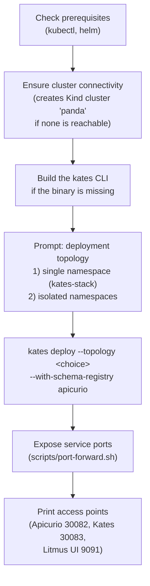
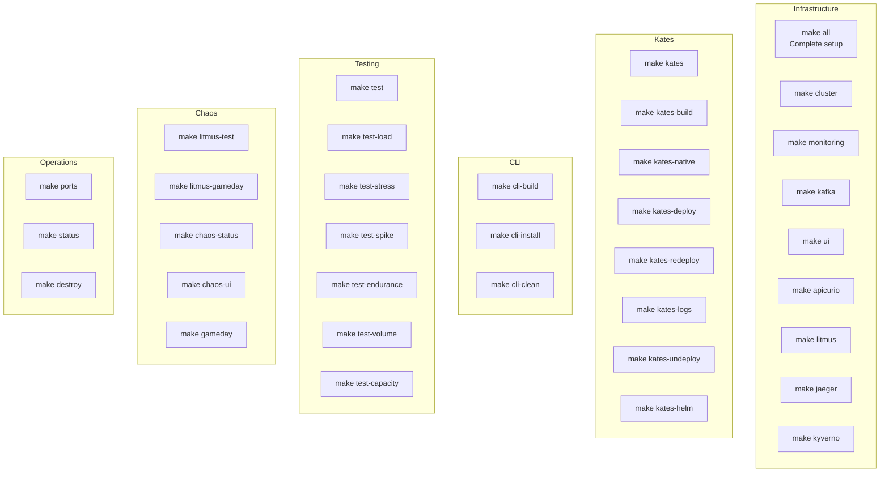

# Deployment Guide

> **Scope**: this chapter owns deploying the **Kates stack** — the backend, CLI, monitoring, and chaos tooling, and the topology choices between them. Provisioning the Kafka cluster itself is delegated to [Installing Kafka with the kafka-cluster Helm Chart](20-installation-guide.md) (the walkthrough) and [Kafka Deployment Engineering](15-kafka-deployment.md) (the rationale).

Deploying Kates is more than running `make all`. The choices you make *before* running that first command — how many namespaces, what service exposure strategy, how much memory to allocate — ripple through every test you'll run later. A deployment tuned for local experimentation will buckle under production load; a production topology is needless overhead on a laptop.

This chapter walks you through those decisions. You'll start with the architectural trade-offs that shape your deployment, then move through resource sizing and cloud-specific guidance, and finally reach the step-by-step deployment itself. By the end, you'll have a running stack that matches your environment — whether that's a single Kind cluster on your MacBook or a multi-node EKS deployment running continuous benchmarks.

After this chapter, you can:

- Choose a topology — namespace layout, service exposure, storage durability — that fits your environment
- Size CPU, memory, and disk per component so your tests measure Kafka, not resource contention
- Adapt the stack to EKS, GKE, or AKS with provider-specific values overlays
- Deploy everything with `make all` and verify it with `make status` and `kates health`

---

## Prerequisites

| Tool | Version | Purpose |
|------|---------|---------|
| Docker | 20.10+ | Container runtime |
| Kind | 0.20+ | Local Kubernetes cluster |
| kubectl | 1.28+ | Kubernetes CLI |
| Helm | 3.12+ | Kubernetes package manager |
| jq | 1.6+ | JSON processing (optional) |
| Go | 1.25+ | CLI compilation (if building from source) |
| Java | 21+ | Backend compilation (if building from source) |
| Maven | 3.9+ | Backend build (bundled as `mvnw`) |

---

## Deployment Architecture Decisions

Before deploying anything, there are three architectural decisions that will shape your topology. Getting these right up front avoids painful migrations later.

### Single-Namespace vs Multi-Namespace

The simplest deployment puts everything — Kafka, Kates, monitoring, chaos tools — into a single namespace. This is fine for local development on Kind where you want `kubectl get pods` to show everything in one place. But for shared or production environments, multi-namespace isolation is strongly recommended.

Why? Each namespace can have independent:
- **RBAC policies** — the team running chaos experiments shouldn't need write access to the Kafka namespace
- **Resource quotas** — prevent the monitoring stack from starving Kafka of memory during a spike
- **Network policies** — default-deny per namespace means a compromised monitoring pod can't reach broker ports

The Kates stack uses four namespaces by default:

| Namespace | Components | Why Separated |
|-----------|-----------|---------------|
| `kafka` | Strimzi operator, brokers, controllers, schema registry | Kafka lifecycle is managed by the Strimzi operator — isolating it prevents accidental interference |
| `kates` | Kates backend, PostgreSQL, CLI service | Application-tier isolation; independent scaling and restart policies |
| `monitoring` | Prometheus, Grafana, alerting rules | Monitoring must survive application failures — separate namespace ensures it stays up during chaos tests |
| `litmus` | LitmusChaos operator, experiment runners | Chaos tools need elevated privileges; isolation limits the blast radius of those permissions |

::: {.callout-tip}
For local Kind deployments, the multi-namespace layout still works — `make all` prompts you to choose between a single-namespace topology (everything in `kates-stack`) and the isolated multi-namespace topology, and the underlying `kates deploy` command defaults to `--topology isolated`. The only time single-namespace makes sense is throwaway CI environments where fast teardown (`kubectl delete namespace`) matters more than isolation.
:::

### NodePort vs Ingress vs LoadBalancer

How you expose services outside the cluster depends on where the cluster runs:

| Strategy | When to Use | Trade-offs |
|----------|------------|------------|
| **NodePort** | Local Kind clusters, CI runners | Simple — no external dependencies. Limited to ports 30000–32767. No TLS termination. |
| **Ingress** | Shared development clusters, staging | Path-based routing, TLS termination, single entry point. Requires an Ingress controller. |
| **LoadBalancer** | Production cloud deployments | Cloud-native L4 load balancing, static IPs, health checks. Costs money per service. |

The default deployment uses **NodePort** for all services (Grafana on 30080, Kafka UI on 30081, etc.). Cloud deployments should switch to LoadBalancer or Ingress — see the [Cloud Deployment](#cloud-deployment) section for provider-specific annotations.

### Ephemeral vs Persistent Storage for Test Data

Kates stores test results, run metadata, and configuration state in PostgreSQL. The storage decision matters:

- **Ephemeral (emptyDir)**: Data disappears on pod restart. Fine for local development where you're iterating on tests and don't care about historical results.
- **Persistent (PVC-backed)**: Data survives pod restarts and even cluster upgrades. Required for production deployments where you need historical trend analysis and audit trails.

For Kafka broker storage, **always use persistent volumes** — even in development. Kafka's log retention depends on data being durable, and losing broker data mid-test invalidates results.

### Deployment Topologies

The following diagram shows three representative topologies. Most teams start with Minimal, grow into Standard for shared use, and arrive at Production for continuous benchmarking:


```mermaid
graph TB
    subgraph Minimal["Minimal (1 Kind node)"]
        direction TB
        MN1["Single Node"]
        MN1 --- MB["3 Brokers + 3 Controllers"]
        MN1 --- MK["Kates + PostgreSQL"]
        MN1 --- MM["Prometheus + Grafana"]
    end

    subgraph Standard["Standard (3 nodes)"]
        direction TB
        SN1["Node 1 (alpha)"]
        SN2["Node 2 (sigma)"]
        SN3["Node 3 (gamma)"]
        SN1 --- SB1["Broker + Controller"]
        SN2 --- SB2["Broker + Controller"]
        SN3 --- SB3["Broker + Controller"]
        SN1 --- SK["Kates + PostgreSQL"]
        SN2 --- SM["Monitoring"]
        SN3 --- SL["LitmusChaos"]
    end

    subgraph Production["Production (6+ nodes)"]
        direction TB
        PN1["Nodes 1-3: Kafka"]
        PN4["Node 4: Kates + DB"]
        PN5["Node 5: Monitoring"]
        PN6["Node 6: Chaos + Overflow"]
        PN1 --- PB["3 Brokers + 3 Controllers<br/>dedicated nodes, anti-affinity"]
        PN4 --- PK["Kates HA + PostgreSQL HA"]
        PN5 --- PM["Prometheus + Grafana<br/>persistent storage"]
        PN6 --- PL["LitmusChaos + spare capacity"]
    end
```

---

## Resource Sizing

Getting resource allocation right is critical. Under-provisioned Kafka brokers produce misleading benchmark results — you'll measure resource contention, not application performance. Over-provisioned local clusters waste developer time waiting for images to pull.

### Deployment Profiles

| Deployment Profile | Use Case | CPU | Memory | Disk | Nodes |
|---|---|---|---|---|---|
| **Minimal** | Local dev / CI | 6 cores | 16 GB | 50 GB | 1 (Kind) |
| **Standard** | Team testing | 12 cores | 32 GB | 200 GB | 3 |
| **Production** | Continuous benchmarking | 24+ cores | 64+ GB | 500+ GB | 6+ |

### Per-Component Breakdown

The following table shows resource requirements per component. Use this to right-size your nodes:

| Component | Instances | CPU (req / limit) | Memory (req / limit) | Disk | Notes |
|-----------|:---------:|:------------------:|:--------------------:|:----:|-------|
| Kafka Broker | 3 | 1000m / 2000m | 4Gi / 4Gi | 50Gi each | Heap 2Gi fixed; remainder is OS page cache |
| Kafka Controller | 3 | 500m / 1000m | 1Gi / 1Gi | 5Gi each | Lightweight — metadata only |
| Strimzi Operator | 1 | 200m / 500m | 384Mi / 384Mi | — | Watches CRs, low steady-state usage |
| Cruise Control | 1 | 500m / 1000m | 512Mi / 1Gi | — | Spikes during rebalance calculations |
| Kafka Exporter | 1 | 100m / 200m | 128Mi / 256Mi | — | Consumer lag metrics |
| Kates Backend | 1 | 500m / 1000m | 512Mi / 2560Mi | — | JVM: `-Xms512m -Xmx2560m` with ZGC |
| PostgreSQL | 1 | 250m / 500m | 256Mi / 512Mi | 10Gi | Test results and metadata |
| Prometheus | 1 | 500m / 1000m | 1Gi / 2Gi | 50Gi | 30d retention in the generic overlay |
| Grafana | 1 | 100m / 200m | 128Mi / 256Mi | — | 13 pre-provisioned dashboards |
| LitmusChaos | 1 | 200m / 500m | 256Mi / 512Mi | — | Operator + experiment runners |

::: {.callout-important}
The **Minimal** profile (16 GB) runs everything but leaves almost no headroom. If your laptop has 16 GB of RAM, close memory-heavy applications (browsers, IDEs with large projects) before running `make all`. Docker Desktop should be configured with at least 10 GB of memory allocation.
:::

---

## Cloud Deployment

The default deployment targets Kind. Moving to a cloud provider requires adjustments to storage classes, service exposure, and identity federation. This section provides the key overrides for each major provider.

### Amazon EKS

**Storage:** Use the `gp3` StorageClass instead of the default `gp2`. GP3 provides 3,000 baseline IOPS and 125 MB/s throughput regardless of volume size — GP2 scales IOPS with size, which means small test volumes get poor I/O performance.

**Load Balancer:** Use AWS Network Load Balancer (NLB) annotations for Kafka external access. NLB operates at L4 (TCP), which is what Kafka's binary protocol requires.

**IAM:** Use IAM Roles for Service Accounts (IRSA) so the Kates pod can access AWS services (S3 for report storage, CloudWatch for metrics export) without embedding credentials.

```yaml
# values-eks.yaml — overlay for EKS deployments
kafka:
  storage:
    class: gp3
    size: 100Gi
  listeners:
    external:
      type: loadbalancer
      annotations:
        service.beta.kubernetes.io/aws-load-balancer-type: "nlb"
        service.beta.kubernetes.io/aws-load-balancer-scheme: "internet-facing"
        service.beta.kubernetes.io/aws-load-balancer-cross-zone-load-balancing-enabled: "true"

kates:
  serviceAccount:
    annotations:
      eks.amazonaws.com/role-arn: "arn:aws:iam::123456789012:role/kates-irsa-role"

postgresql:
  storage:
    class: gp3
    size: 20Gi

monitoring:
  prometheus:
    storage:
      class: gp3
      size: 100Gi
  grafana:
    service:
      type: LoadBalancer
      annotations:
        service.beta.kubernetes.io/aws-load-balancer-type: "nlb"
```

### Google GKE

**Storage:** Use `premium-rwo` for SSD-backed PersistentVolumeClaims. This StorageClass provisions pd-ssd disks with much higher IOPS than the default `standard-rwo` (pd-balanced).

**Ingress:** GKE's built-in Ingress controller integrates with Google Cloud Load Balancing. Use `BackendConfig` resources to configure health checks that match Kafka's and Kates's actual health endpoints.

**Identity:** Use Workload Identity to bind Kubernetes service accounts to Google Cloud IAM service accounts — no key files to manage.

```yaml
# values-gke.yaml — overlay for GKE deployments
kafka:
  storage:
    class: premium-rwo
    size: 100Gi
  listeners:
    external:
      type: loadbalancer

kates:
  serviceAccount:
    annotations:
      iam.gke.io/gcp-service-account: "kates@my-project.iam.gserviceaccount.com"
  ingress:
    enabled: true
    className: gce
    annotations:
      cloud.google.com/backend-config: '{"default": "kates-backend-config"}'
    hosts:
      - host: kates.example.com
        paths:
          - path: /
            pathType: Prefix

postgresql:
  storage:
    class: premium-rwo
    size: 20Gi

monitoring:
  prometheus:
    storage:
      class: premium-rwo
      size: 100Gi
  grafana:
    ingress:
      enabled: true
      className: gce
      hosts:
        - grafana.example.com
```

### Azure AKS

**Storage:** Use `managed-premium` for Premium SSD-backed volumes. Premium SSDs offer consistent low-latency I/O, which is critical for Kafka broker performance.

**Load Balancer:** Use internal LoadBalancer annotations for private access within a VNet. For public access, use Azure Application Gateway Ingress Controller (AGIC).

**Identity:** Use Azure AD Pod Identity (or the newer Workload Identity Federation) to grant pods access to Azure resources without storing credentials.

```yaml
# values-aks.yaml — overlay for AKS deployments
kafka:
  storage:
    class: managed-premium
    size: 100Gi
  listeners:
    external:
      type: loadbalancer
      annotations:
        service.beta.kubernetes.io/azure-load-balancer-internal: "true"

kates:
  serviceAccount:
    labels:
      azure.workload.identity/use: "true"
    annotations:
      azure.workload.identity/client-id: "00000000-0000-0000-0000-000000000000"
  podLabels:
    azure.workload.identity/use: "true"

postgresql:
  storage:
    class: managed-premium
    size: 20Gi

monitoring:
  prometheus:
    storage:
      class: managed-premium
      size: 100Gi
  grafana:
    service:
      type: LoadBalancer
      annotations:
        service.beta.kubernetes.io/azure-load-balancer-internal: "true"
```

::: {.callout-note}
These YAML overlays are passed via `helm upgrade --install -f values-eks.yaml` (or `-f values-gke.yaml`, etc.) alongside the base `values.yaml`. They override only the keys specified — all other defaults remain unchanged.
:::

---

## Quick Deployment

```bash
# One command — deploys everything
make all
```

`make all` drives the deployment through the Kates CLI itself — the Makefile checks prerequisites, ensures a cluster exists, then hands the heavy lifting to `kates deploy`:


```mermaid
graph TD
    S1["Check prerequisites<br/>(kubectl, helm)"] --> S2["Ensure cluster connectivity<br/>(creates Kind cluster 'panda'<br/>if none is reachable)"]
    S2 --> S3["Build the kates CLI<br/>if the binary is missing"]
    S3 --> S4["Prompt: deployment topology<br/>1) single namespace (kates-stack)<br/>2) isolated namespaces"]
    S4 --> S5["kates deploy --topology &lt;choice&gt;<br/>--with-schema-registry apicurio"]
    S5 --> S6["Expose service ports<br/>(scripts/port-forward.sh)"]
    S6 --> S7["Print access points<br/>(Apicurio 30082, Kates 30083,<br/>Litmus UI 9091)"]
```

## Component-by-Component Deployment

If you need to deploy components individually:

### Kubernetes Cluster

```bash
# Start Kind cluster with 3 nodes
make cluster
```

Creates a Kind cluster named `panda` with:
- 1 control-plane node (alpha)
- 2 worker nodes (sigma, gamma)
- Zone labels for rack awareness
- Local-path storage provisioner per zone

### Image Management

```bash
# Pull all images directly into Kind nodes (via ctr pull inside containerd)
./scripts/load-images-to-kind.sh

# Check local registry status
./scripts/registry-status.sh
```

All images are defined in `images.env`. The load script defaults to `linux/arm64`; override with the `CTR_PLATFORM` environment variable (`CTR_PLATFORM=linux/amd64 ./scripts/load-images-to-kind.sh`) on Intel/AMD hosts.

### Monitoring Stack

```bash
# Deploy Prometheus + Grafana
make monitoring
```

Deploys:
- Prometheus with Kafka JMX scrape targets
- Grafana with 13 custom pre-provisioned JSON dashboards
- NodePort service at port 30080

### Kafka

```bash
# Deploy Strimzi operator + krafter cluster
make kafka

# Deploy Kafka UI
make ui

# Deploy schema registry
make apicurio
```

For deep Kafka configuration details (broker tuning, security, Cruise Control, troubleshooting), see [Kafka Deployment Engineering](15-kafka-deployment.md).

### LitmusChaos

```bash
# Deploy LitmusChaos operator
make litmus

# Access Litmus UI
make chaos-ui
# Opens http://localhost:9091 (admin/litmus)

# Run the chaos chart's Helm tests
make litmus-test

# Trigger the Game Day validation via the chaos chart
make litmus-gameday

# Check chaos status
make chaos-status
```

### Kates Application

```bash
# Build + deploy (full pipeline)
make kates

# Or step by step:
make kates-build     # Build JVM image + load into Kind
make kates-deploy    # Apply K8s manifests

# Native image (GraalVM)
make kates-native
```

### Kates Application Configuration

#### Fault Tolerance Timeouts

All `@Timeout` annotations in Kates services are externally configurable via MicroProfile Fault Tolerance properties. The defaults are set in `application.properties` and overridable at deploy time through the ConfigMap.

Pattern: `<fully.qualified.class>/<method>/Timeout/value=<millis>`

```properties
# Example: increase describeTopicDetail timeout to 60 seconds
com.bmscomp.kates.service.TopicService/describeTopicDetail/Timeout/value=60000
```

In `kates/k8s/configmap.yaml` (relative to the repo root) the equivalent env var is:

```yaml
COM_BMSCOMP_KATES_SERVICE_TOPICSERVICE_DESCRIBETOPICDETAIL_TIMEOUT_VALUE: "60000"
```

The 13 annotated methods across `TopicService`, `ClusterHealthService`, and `ConsumerGroupService` have corresponding entries in both files. The codebase carries 26 `@Timeout` annotations across seven classes in total — the remaining ones (in `SecurityService`, `KafkaAdminService`, `DisruptionSafetyGuard`, and `KubernetesChaosProvider`) rely on their annotation defaults but can be overridden with the same property pattern.

#### JVM Tuning

Kates is a latency-sensitive application — it's measuring Kafka's performance, so its own GC pauses can't be allowed to pollute the measurements. A 200ms GC pause during a throughput test would show up as a producer timeout, making it indistinguishable from actual Kafka latency. This is why the deployment uses **ZGC** (Z Garbage Collector) rather than the default G1GC.

ZGC achieves sub-millisecond pause times by performing garbage collection concurrently with the application. The trade-off is roughly 10–15% lower peak throughput compared to G1GC — but for a benchmarking tool, consistent latency matters far more than raw throughput.

```yaml
# kates/k8s/deployment.yaml
- name: JAVA_TOOL_OPTIONS
  value: "-Xms512m -Xmx2560m -XX:+UseZGC -XX:+ZGenerational"
```

| GC | Max Pause | Throughput Overhead | Best For |
|----|:-:|:-:|----------|
| G1 (default) | ~10–200ms | Baseline | General workloads where occasional pauses are acceptable |
| ZGC | < 1ms | ~10–15% | Latency-sensitive benchmarking where pause consistency matters |
| Shenandoah | < 1ms | ~10–15% | Alternative low-pause GC (Red Hat JDKs) |

The `-Xms512m -Xmx2560m` settings give ZGC a 512 MB starting heap that can grow to 2.5 GB. The `+ZGenerational` flag (Java 21+) enables the generational mode of ZGC, which reduces the amount of work the collector does by separately collecting short-lived objects — this further lowers allocation stall rates during burst workloads like spike tests.

::: {.callout-tip}
If you observe `Allocation Stall` warnings in the Kates logs during stress tests, increase `-Xmx` to 3072m or 4096m. This gives ZGC more headroom to collect without stalling application threads.
:::

### Kates CLI

```bash
# Build + install locally
make cli-install

# Cross-compile for all platforms
make cli-build

# Cleanup build artifacts
make cli-clean
```

::: {.callout-note}
**macOS:** `make cli-install` automatically strips provenance/quarantine extended attributes and ad-hoc codesigns the binary. See [CLI Reference](10-cli-reference.md#installation) for manual install instructions.
:::

## Access Points

After deployment, set up port forwarding:

```bash
make ports
```

For the full list of access points and URLs, see [The Cluster Under Test](03-cluster.md#access-points).

## CLI Configuration

```bash
# Connect the CLI to Kates
kates ctx set local --url http://localhost:30083
kates ctx use local

# Verify connectivity
kates health
```

## Makefile Reference


```mermaid
graph TB
    subgraph Infrastructure
        ALL[make all<br/>Complete setup]
        CLUSTER[make cluster]
        MONITOR[make monitoring]
        KAFKA[make kafka]
        UI[make ui]
        APICURIO[make apicurio]
        LITMUS[make litmus]
        JAEGER[make jaeger]
        KYVERNO[make kyverno]
    end
    
    subgraph Kates
        K[make kates]
        KB[make kates-build]
        KN[make kates-native]
        KD[make kates-deploy]
        KR[make kates-redeploy]
        KL[make kates-logs]
        KU[make kates-undeploy]
        KH[make kates-helm]
    end
    
    subgraph CLI
        CB[make cli-build]
        CI[make cli-install]
        CC[make cli-clean]
    end
    
    subgraph Testing
        T[make test]
        TL[make test-load]
        TS[make test-stress]
        TSP[make test-spike]
        TE[make test-endurance]
        TV[make test-volume]
        TC[make test-capacity]
    end
    
    subgraph Chaos
        LT[make litmus-test]
        LG[make litmus-gameday]
        CS[make chaos-status]
        CU[make chaos-ui]
        GD[make gameday]
    end
    
    subgraph Operations
        PORTS[make ports]
        STATUS[make status]
        DESTROY[make destroy]
    end
```

### Full Target List

| Target | Description |
|--------|-------------|
| `make all` | Complete setup (cluster check → topology prompt → `kates deploy`) |
| `make cluster` | Start Kind cluster only |
| `make monitoring` | Deploy Prometheus & Grafana (auto-detects provider) |
| `make monitoring-generic` | Deploy Prometheus & Grafana (Generic cloud overlay) |
| `make monitoring-undeploy` | Remove Prometheus & Grafana |
| `make kafka` | Deploy Strimzi Kafka |
| `make ui` | Deploy Kafka UI |
| `make apicurio` | Deploy Apicurio Registry |
| `make litmus` | Deploy LitmusChaos |
| `make jaeger` | Deploy Jaeger (distributed tracing) |
| `make kyverno` | Deploy Kyverno policy engine |
| `make cert-manager` | Deploy cert-manager |
| `make connect-deploy` | Deploy Kafka Connect cluster |
| `make kates` | Build + deploy Kates application |
| `make kates-build` | Build Kates JVM image |
| `make kates-native` | Build Kates native image (see below) |
| `make kates-deploy` | Apply Kates K8s manifests |
| `make kates-helm` | Deploy Kates via its Helm chart |
| `make kates-redeploy` | Restart Kates deployment |
| `make kates-logs` | Stream Kates logs |
| `make kates-undeploy` | Remove Kates |
| `make cli-build` | Cross-compile CLI |
| `make cli-install` | Build + install CLI locally |

### Native Image Build

`make kates-native` builds a GraalVM native image of the Kates backend using Quarkus's native compilation pipeline. This produces a standalone binary with dramatically faster startup.

**Prerequisites:**
- GraalVM 21+ with `native-image` component installed
- Docker (used by Quarkus for in-container native builds)
- ~6GB free memory during compilation

**Build time:** Expect 3–8 minutes depending on hardware (native compilation is significantly slower than JVM builds).

**Startup comparison:**

| Mode | Startup Time | Memory at Idle | Use Case |
|------|:---:|:---:|----------|
| JVM (`make kates`) | ~2s | ~200MB | Development, debugging |
| Native (`make kates-native`) | ~0.05s | ~50MB | Production, CI/CD |

The native image is the recommended deployment mode for production and CI/CD environments where fast startup and low memory footprint matter.

```bash
# Build native image (in-container build, no local GraalVM needed)
make kates-native

# Verify
kubectl logs deployment/kates -n kates | head -1
# Expect a startup line like: started in 0.047s
```

| Target | Description |
|--------|-------------|
| `make test` | Run baseline perf test |
| `make test-load` | Run load test |
| `make test-stress` | Run stress test |
| `make test-spike` | Run spike test |
| `make test-endurance` | Run endurance test |
| `make test-volume` | Run volume test |
| `make test-capacity` | Run capacity test |
| `make litmus-test` | Run the chaos chart's Helm tests |
| `make litmus-gameday` | Trigger Game Day validation via the chaos chart |
| `make chaos-status` | Check chaos status |
| `make chaos-ui` | Port-forward the Litmus UI (localhost:9091) |
| `make gameday` | Run automated Game Day validation pipeline |
| `make velero` | Deploy Velero backup |
| `make chart-lint` | Lint Kates Helm chart |
| `make ports` | Start port forwarding |
| `make status` | Check cluster status |
| `make destroy` | Destroy everything |

## Security Configuration

The Kafka cluster uses multiple layers of security:

### Authentication

- **SCRAM-SHA-512** on the plain (9092) and external (9094) listeners
- **TLS mutual auth** on the TLS listener (9093)
- Credentials managed via `KafkaUser` CRs in `config/kafka/kafka-users.yaml`

### Certificate Rotation

Certificates are auto-managed by Strimzi:
- **Cluster CA**: 5-year validity, auto-renewed 180 days before expiry
- **Clients CA**: 5-year validity, auto-renewed 180 days before expiry
- Policy: `replace-key` (new key pair on renewal)

### Network Policies

`config/kafka/kafka-networkpolicies.yaml` implements default-deny with client whitelisting:
- Only kates, kafka-ui, apicurio, litmus, and monitoring can reach brokers
- Controller mesh traffic isolated
- Operator access scoped to Kafka pods + K8s API

### ACL Management

ACLs are declared via `KafkaUser` CRs (GitOps):
- `kates-backend` — superUser with full access
- `kafka-ui` — read-only on all topics
- `apicurio-registry` — read/write on internal topics

### PostgreSQL Database

Kates uses PostgreSQL as its persistent data store for everything that outlives a single test run. Specifically, it stores:

- **Test run metadata** — timestamps, configuration snapshots, which topics and partitions were tested
- **Performance results** — throughput measurements, latency percentiles (P50/P95/P99), error counts per run
- **Historical baselines** — aggregated metrics used by the `kates report compare` and `kates test compare` commands to detect regressions
- **Audit records** — who ran what test, when, and with which parameters

Why PostgreSQL and not Kafka itself? Kafka is optimized for sequential append and time-windowed retention — it's not designed for the random-access queries that trend analysis and historical comparison require. PostgreSQL gives you indexed queries like "show me P99 latency for topic X across the last 30 runs" that would be impractical with Kafka's log-based storage.

#### Read-Only Filesystem Compliance

The bundled PostgreSQL StatefulSet runs under the same strict admission standards enforced by the Kyverno `kates-pod-security-standards` policy. When `readOnlyRootFilesystem: true` is mutated onto the container, PostgreSQL fails to start because it cannot create socket lockfiles at `/var/run/postgresql` or write temporary files to `/tmp`.

The Helm chart mitigates this by mounting two ephemeral `emptyDir` volumes onto the critical writable paths:

```yaml
volumeMounts:
  - name: data
    mountPath: /var/lib/postgresql/data
  - name: run-postgresql
    mountPath: /var/run/postgresql    # Socket lockfile
  - name: tmp
    mountPath: /tmp                   # Temporary files
volumes:
  - name: run-postgresql
    emptyDir: {}
  - name: tmp
    emptyDir: {}
```

| Path | Purpose | Without emptyDir |
|------|---------|------------------|
| `/var/lib/postgresql/data` | Persistent database storage | PVC — always writable |
| `/var/run/postgresql` | Unix domain socket and `.s.PGSQL.5432.lock` | ❌ `FATAL: could not create lock file` |
| `/tmp` | Temporary sort files, pg_stat_tmp | ❌ `could not write to file "pg_stat_tmp/global.tmp"` |

::: {.callout-note}
These `emptyDir` volumes are ephemeral — they do not survive pod restarts. This is safe because `/var/run/postgresql` and `/tmp` contain only runtime artifacts (sockets, lock files, temp data). Persistent data is stored on the PVC-backed `/var/lib/postgresql/data` volume.
:::

## Game Day Validation

Run an automated 7-phase validation pipeline:

```bash
make gameday
```

Phases: pre-flight → baseline → chaos-inject → chaos-observe → chaos-recover → post-flight → report

## Troubleshooting

### Images Won't Load

```bash
# Check registry health
./scripts/registry-status.sh

# Manually pull images into Kind nodes
./scripts/load-images-to-kind.sh
```

If you're behind an HTTP/HTTPS proxy, set `HTTP_PROXY`, `HTTPS_PROXY`, and
`NO_PROXY` in your shell or `proxy/proxy.conf` before running
`./scripts/load-images-to-kind.sh`.

If you are not using `load-images-to-kind.sh`, run `./scripts/start-cluster.sh`
(or `make cluster`) after setting proxy variables. This reconciles containerd
proxy settings on Kind nodes so regular Kubernetes image pulls use the proxy.

Direct proxy flags are supported too:

```bash
./scripts/start-cluster.sh \
  --http-proxy http://proxy.example.com:8080 \
  --https-proxy http://proxy.example.com:8080 \
  --no-proxy "localhost,127.0.0.1,.svc,.cluster.local"
```

### Kafka Pods Not Starting

```bash
# Check Kafka pod events for the failing constraint
kubectl describe pods -l strimzi.io/cluster=krafter -n kafka
```

Pods stuck in `Pending` mean the scheduler can't satisfy zone affinity or provision storage — [Installing Kafka with the kafka-cluster Helm Chart](20-installation-guide.md#pods-stuck-in-pending) walks the `FailedScheduling` events constraint by constraint. Crashing brokers and a Kafka CR stuck on `NotReady` are diagnosed symptom by symptom in [Kafka Deployment Engineering](15-kafka-deployment.md#troubleshooting).

### CLI Binary Killed on macOS

If `kates health` is immediately killed (exit code 137), macOS is blocking the unsigned binary:

```bash
# Fix: reinstall with codesigning
make cli-install

# Or manually
sudo xattr -dr com.apple.provenance /usr/local/bin/kates
sudo xattr -dr com.apple.quarantine /usr/local/bin/kates
sudo codesign -f -s - /usr/local/bin/kates
```

### Kates Can't Connect to Kafka

```bash
# Verify Kafka service
kubectl get svc -n kafka

# Check Kates logs
make kates-logs

# Verify bootstrap address in configmap
kubectl get configmap kates-config -n kates -o yaml
```

### Litmus Experiments Fail

```bash
# Check chaos operator
kubectl get pods -n litmus

# Check experiment status
make chaos-status

# View experiment logs
kubectl logs -f -l app=chaos-operator -n litmus
```

For the symptom-by-symptom index across the whole book, see the [Troubleshooting Index](appendix-b-troubleshooting.md).

## Destroying the Environment

```bash
# Destroy everything (cluster + images + registry)
make destroy
```

This deletes the Kind cluster and all associated resources.

::: {.callout-tip}
**Try it**

From a clean slate, run the deploy-verify loop end to end:

```bash
# Deploy everything (prompts for topology; option 2 gives isolated namespaces)
make all

# Verify every pod came up
make status

# Point the CLI at the stack and check end-to-end health
kates ctx set local --url http://localhost:30083
kates ctx use local
kates health
```

`make status` prints pod counts per namespace and reports "All pods are running!" once the stack is healthy; `kates health` answers with the Kates Health Dashboard showing the system status, the Kafka cluster state, and its bootstrap address.
:::

## Summary

- Three decisions shape your topology before you deploy anything: namespace isolation (`kafka`, `kates`, `monitoring`, `litmus` by default), service exposure (NodePort locally, LoadBalancer or Ingress in the cloud), and storage durability — Kafka broker volumes are always persistent.
- Size for what you measure: under-provisioned brokers benchmark resource contention, not Kafka, and the Minimal profile's 16 GB leaves almost no headroom.
- Cloud moves are values overlays, not rewrites: `gp3` on EKS, `premium-rwo` on GKE, `managed-premium` on AKS, plus workload-identity annotations instead of embedded credentials.
- `make all` drives the whole deployment through `kates deploy`; per-component targets (`make cluster`, `make monitoring`, `make kafka`, `make litmus`, `make kates`) build the same stack piece by piece.
- Kates itself runs on ZGC because a benchmarking tool's own GC pauses must not pollute its measurements; the native image cuts startup to ~0.05s for production and CI/CD.

Your stack is running — now lock it down: [Security & Compliance](17-security.md) covers authentication, authorization, network policies, and certificate management in depth.
