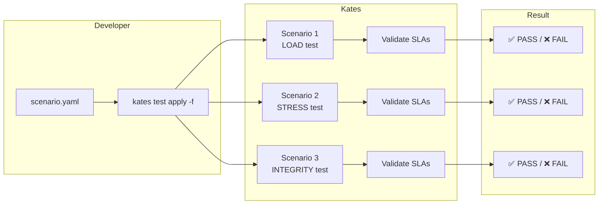
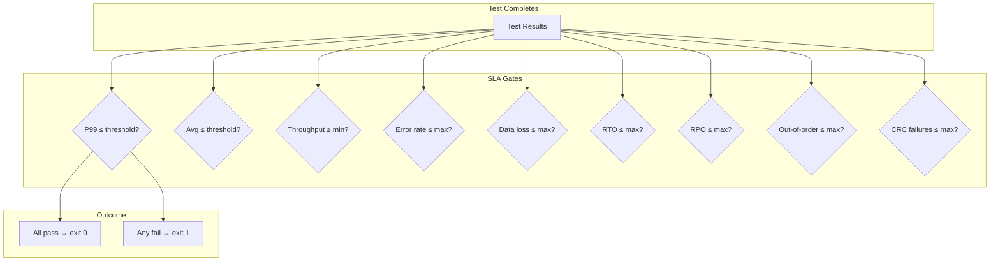

# Chapter 13: Scenario Files & SLA Gates

Scenario files are the declarative way to define, execute, and validate Kates test runs. Rather than stringing together CLI flags, you describe one or more test scenarios in a YAML (or JSON) file and let Kates orchestrate everything — including automated pass/fail enforcement against SLA thresholds.

## Why Scenario Files?

CLI flags are convenient for ad-hoc testing, but production-grade performance validation requires:

- **Reproducibility** — the same file produces the same test every time
- **Version control** — scenario files live in Git alongside your application code
- **Multi-scenario orchestration** — run a load test, a stress test, and an integrity test in sequence with a single command
- **SLA enforcement** — define pass/fail criteria that block CI/CD pipelines on regressions



## File Format

A scenario file is a YAML (or JSON) document with a single top-level key: `scenarios`, which is a list of test definitions.

```yaml
scenarios:
  - name: "My First Test"
    type: LOAD
    spec:
      records: 100000
      parallelProducers: 4
    validate:
      maxP99LatencyMs: 50
      minThroughputRecPerSec: 10000
```

### Top-Level Structure

| Field | Type | Required | Description |
|-------|------|:---:|-------------|
| `scenarios` | List | ✅ | One or more test scenario definitions |

### Scenario Fields

| Field | Type | Required | Description |
|-------|------|:---:|-------------|
| `name` | String | | Human-readable scenario name (displayed in output) |
| `type` | String | ✅ | Test type: `LOAD`, `STRESS`, `SPIKE`, `ENDURANCE`, `VOLUME`, `CAPACITY`, `ROUND_TRIP`, `INTEGRITY` |
| `backend` | String | | Backend engine (default: `native`) |
| `spec` | Object | | Test specification — see Spec Reference below |
| `validate` | Object | | SLA validation gates — see Validation Reference below |

## Spec Reference

The `spec` object controls all test parameters. Every field is optional; Kates applies sensible defaults per test type when a field is omitted.

### Producer Configuration

| Field | Type | Default | Description |
|-------|------|---------|-------------|
| `records` | Integer | varies by type | Number of records to produce |
| `parallelProducers` | Integer | 1 | Number of concurrent producer threads |
| `recordSizeBytes` | Integer | 1024 | Payload size per record in bytes |
| `acks` | String | `all` | Producer acknowledgment mode: `0`, `1`, or `all` |
| `batchSize` | Integer | 16384 | Producer batch size in bytes |
| `lingerMs` | Integer | 0 | Milliseconds to wait before sending a batch |
| `compressionType` | String | `none` | Compression: `none`, `gzip`, `snappy`, `lz4`, `zstd` |
| `targetThroughput` | Integer | -1 | Target records/sec (-1 = unlimited) |
| `enableIdempotence` | Boolean | false | Enable Kafka producer idempotency |
| `enableTransactions` | Boolean | false | Enable Kafka transactions |

### Consumer Configuration

| Field | Type | Default | Description |
|-------|------|---------|-------------|
| `numConsumers` | Integer | 0 | Number of consumer threads (0 = no consumption) |
| `consumerGroup` | String | auto | Consumer group name |
| `fetchMinBytes` | Integer | 1 | Minimum bytes per fetch request |
| `fetchMaxWaitMs` | Integer | 500 | Maximum wait time for fetch in milliseconds |

### Topic Configuration

| Field | Type | Default | Description |
|-------|------|---------|-------------|
| `topic` | String | auto-generated | Target topic name |
| `partitions` | Integer | 3 | Number of topic partitions |
| `replicationFactor` | Integer | 3 | Topic replication factor |
| `minInsyncReplicas` | Integer | 2 | Minimum in-sync replicas |

### Test Execution

| Field | Type | Default | Description |
|-------|------|---------|-------------|
| `durationSeconds` | Integer | 0 | Time-based test duration (0 = use record count) |

### Integrity Options

| Field | Type | Default | Description |
|-------|------|---------|-------------|
| `enableCrc` | Boolean | false | Enable CRC32 checksum verification on messages |

## Validation Reference (SLA Gates)

The `validate` section defines pass/fail criteria that Kates checks after the test completes. If any threshold is breached, the scenario is marked as failed, and the CLI exits with a non-zero status code — making it ideal for CI/CD gate enforcement.



### Performance Gates

| Field | Type | Description |
|-------|------|-------------|
| `maxP99LatencyMs` | Float | Maximum acceptable P99 latency in milliseconds |
| `maxAvgLatencyMs` | Float | Maximum acceptable average latency in milliseconds |
| `minThroughputRecPerSec` | Float | Minimum acceptable throughput in records per second |
| `maxErrorRate` | Float | Maximum acceptable error rate (0.0 = zero errors) |

### Resilience Gates

| Field | Type | Description |
|-------|------|-------------|
| `maxRtoMs` | Float | Maximum Recovery Time Objective in milliseconds |
| `maxRpoMs` | Float | Maximum Recovery Point Objective in milliseconds |

### Integrity Gates

| Field | Type | Description |
|-------|------|-------------|
| `maxDataLossPercent` | Float | Maximum acceptable data loss percentage (0.0 = zero loss) |
| `maxOutOfOrder` | Integer | Maximum out-of-order messages (0 = strict ordering) |
| `maxCrcFailures` | Integer | Maximum CRC32 checksum failures (0 = no corruption) |

## Examples

### Simple Load Test with Performance SLA

```yaml
scenarios:
  - name: "Baseline Load Test"
    type: LOAD
    spec:
      records: 100000
      parallelProducers: 4
      recordSizeBytes: 1024
      acks: all
    validate:
      maxP99LatencyMs: 50
      minThroughputRecPerSec: 10000
```

### Multi-Phase Regression Suite

Run multiple test types in sequence and validate each independently:

```yaml
scenarios:
  - name: "Load Baseline"
    type: LOAD
    spec:
      records: 100000
      parallelProducers: 2
    validate:
      maxP99LatencyMs: 50
      minThroughputRecPerSec: 10000

  - name: "Stress Ramp-Up"
    type: STRESS
    spec:
      records: 500000
      parallelProducers: 8
    validate:
      maxP99LatencyMs: 200
      maxErrorRate: 0.01

  - name: "Data Integrity Check"
    type: INTEGRITY
    spec:
      records: 50000
      acks: all
      enableIdempotence: true
      enableCrc: true
    validate:
      maxDataLossPercent: 0.0
      maxOutOfOrder: 0
      maxCrcFailures: 0
```

### Round-Trip Latency Measurement

```yaml
scenarios:
  - name: "End-to-End Latency"
    type: ROUND_TRIP
    spec:
      records: 10000
      parallelProducers: 1
      numConsumers: 1
      consumerGroup: "latency-cg"
    validate:
      maxP99LatencyMs: 25
      maxAvgLatencyMs: 10
```

### Tuning Comparison

Test different producer configurations side-by-side:

```yaml
scenarios:
  - name: "Default Batching"
    type: LOAD
    spec:
      records: 100000
      parallelProducers: 4
    validate:
      maxP99LatencyMs: 50

  - name: "Aggressive Batching"
    type: LOAD
    spec:
      records: 100000
      parallelProducers: 4
      batchSize: 65536
      lingerMs: 50
      compressionType: lz4
    validate:
      maxP99LatencyMs: 100
      minThroughputRecPerSec: 20000
```

## Running Scenario Files

### Basic Execution

```bash
# Run all scenarios in the file
kates test apply -f scenarios.yaml

# Run and wait for all to complete (blocking)
kates test apply -f scenarios.yaml --wait
```

### How Execution Works

1. Kates parses the file and validates the schema
2. Each scenario is submitted to the backend sequentially
3. If `--wait` is specified, Kates polls until each test completes before submitting the next
4. After all scenarios complete, SLA gates are evaluated
5. A summary table is printed showing each scenario's result

### Output

```
  ▸ Baseline Load Test (LOAD)...
    → ID: a1b2c3d4  Status: DONE

  ▸ Stress Ramp-Up (STRESS)...
    → ID: e5f6a7b8  Status: DONE

  ▸ Data Integrity Check (INTEGRITY)...
    → ID: c9d0e1f2  Status: DONE

  Summary
  ┌──────────────────────┬──────────┬────────┬──────────────────────────┐
  │ Scenario             │ ID       │ Status │ Note                     │
  ├──────────────────────┼──────────┼────────┼──────────────────────────┤
  │ Baseline Load Test   │ a1b2c3d4 │ DONE   │                          │
  │ Stress Ramp-Up       │ e5f6a7b8 │ DONE   │ p99=210ms > 200ms        │
  │ Data Integrity Check │ c9d0e1f2 │ DONE   │                          │
  └──────────────────────┴──────────┴────────┴──────────────────────────┘

  ✗ One or more SLA gates violated
```

In this example, the stress test's P99 latency (210ms) exceeded the 200ms threshold. The CLI exits with code 1, which would fail a CI/CD pipeline.

## CI/CD Integration

Scenario files are designed for CI/CD pipelines. Combine with `--wait` to block the pipeline until all tests complete:

```bash
# In your CI pipeline script
kates test apply -f regression-suite.yaml --wait

# The exit code tells you the result:
# 0 = all SLA gates passed
# 1 = one or more SLA gates violated
```

For JUnit-compatible output, export each test report individually after the suite completes — see [Chapter 9: Observability](09-observability.md) for export formats.

## JSON Format

Scenario files also work in JSON:

```json
{
  "scenarios": [
    {
      "name": "Load Test",
      "type": "LOAD",
      "spec": {
        "records": 100000,
        "parallelProducers": 4
      },
      "validate": {
        "maxP99LatencyMs": 50,
        "minThroughputRecPerSec": 10000
      }
    }
  ]
}
```

## Scaffolding Scenario Files

Use `kates test scaffold` to generate a starter YAML for any test type:

```bash
# Generate a load test scenario
kates test scaffold --type LOAD -o load-scenario.yaml

# Generate an integrity + chaos scenario
kates test scaffold --type INTEGRITY_CHAOS -o chaos-integrity.yaml
```

The scaffold output includes all available fields with comments explaining each one. Edit the generated file and run it with `kates test apply -f`.
