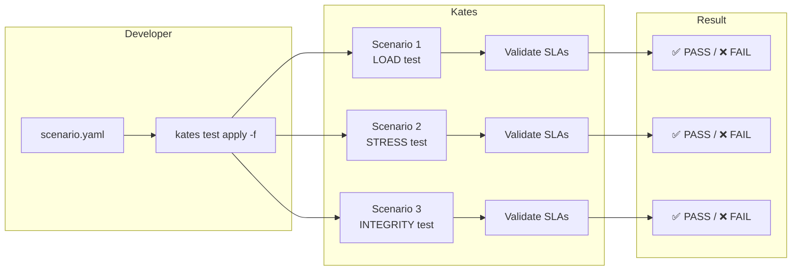
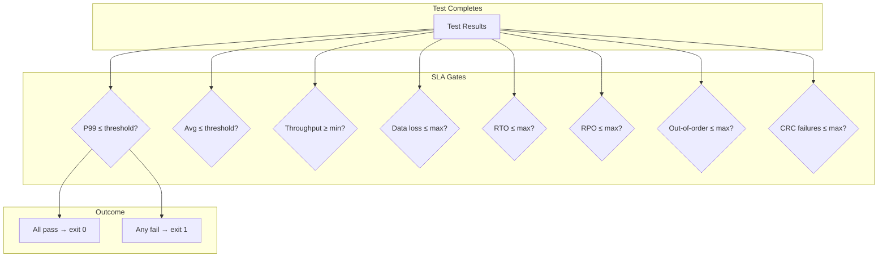

# Scenario Files & SLA Gates

Scenario files are the declarative way to define, execute, and validate Kates test runs. Rather than stringing together CLI flags, you describe one or more test scenarios in a YAML (or JSON) file and let Kates orchestrate everything — including automated pass/fail enforcement against SLA thresholds.

This chapter is for engineers graduating from ad-hoc `kates test create` runs to version-controlled, CI-gated test suites. After this chapter, you can:

- Describe a multi-scenario test suite in YAML, with `spec` parameters and `validate` SLA gates
- Run a suite with `kates test apply -f` and read its pass/fail summary
- Wire the exit code into a CI/CD pipeline so performance regressions block the merge
- Spot the common scenario-file mistakes and predict how the CLI reacts to each

## Why Scenario Files?

CLI flags are convenient for ad-hoc testing, but production-grade performance validation requires:

- **Reproducibility** — the same file produces the same test every time
- **Version control** — scenario files live in Git alongside your application code
- **Multi-scenario orchestration** — run a load test, a stress test, and an integrity test in sequence with a single command
- **SLA enforcement** — define pass/fail criteria that block CI/CD pipelines on regressions


```mermaid
graph LR
    subgraph Developer
        Y[scenario.yaml] --> CLI[kates test apply -f]
    end
    
    subgraph Kates
        CLI --> P1[Scenario 1\nLOAD test]
        CLI --> P2[Scenario 2\nSTRESS test]
        CLI --> P3[Scenario 3\nINTEGRITY test]
        P1 --> V1[Validate SLAs]
        P2 --> V2[Validate SLAs]
        P3 --> V3[Validate SLAs]
    end
    
    subgraph Result
        V1 --> R1["✅ PASS / ❌ FAIL"]
        V2 --> R2["✅ PASS / ❌ FAIL"]
        V3 --> R3["✅ PASS / ❌ FAIL"]
    end
```

## File Format

A scenario file is a YAML (or JSON) document with a single top-level key: `scenarios`, which is a list of test definitions.

```yaml
scenarios:
  - name: "My First Test"
    type: LOAD
    spec:
      records: 100000
      parallelProducers: 4
    validate:
      maxP99LatencyMs: 50
      minThroughputRecPerSec: 10000
```

### Top-Level Structure

| Field | Type | Required | Description |
|-------|------|:---:|-------------|
| `scenarios` | List | ✅ | One or more test scenario definitions |

### Scenario Fields

| Field | Type | Required | Description |
|-------|------|:---:|-------------|
| `name` | String | | Human-readable scenario name (displayed in output) |
| `type` | String | ✅ | Test type: `LOAD`, `STRESS`, `SPIKE`, `ENDURANCE`, `VOLUME`, `CAPACITY`, `ROUND_TRIP`, `INTEGRITY`, `TUNE_REPLICATION`, `TUNE_ACKS`, `TUNE_BATCHING`, `TUNE_COMPRESSION`, `TUNE_PARTITIONS`, or `INTEGRATION_CDC`. Case-insensitive — the CLI upper-cases the value before submitting |
| `backend` | String | | Backend engine (default: `native`) |
| `spec` | Object | | Test specification — see Spec Reference below |
| `validate` | Object | | SLA validation gates — see Validation Reference below |

## Spec Reference

The `spec` object controls all test parameters. Every field is optional; the backend fills in defaults per test type (configurable via its `kates.tests.<type>.*` properties), so a STRESS test defaults to larger batches and more producers than a ROUND_TRIP test. The defaults shown below are the stock values for a LOAD test — other types differ.

### Producer Configuration

| Field | Type | Default | Description |
|-------|------|---------|-------------|
| `records` | Integer | 1,000,000 | Number of records to produce |
| `parallelProducers` | Integer | 1 | Number of concurrent producer threads |
| `recordSizeBytes` | Integer | 1024 | Payload size per record in bytes |
| `acks` | String | `all` | Producer acknowledgment mode: `0`, `1`, or `all` |
| `batchSize` | Integer | 65536 | Producer batch size in bytes |
| `lingerMs` | Integer | 5 | Milliseconds to wait before sending a batch |
| `compressionType` | String | `lz4` | Compression: `none`, `gzip`, `snappy`, `lz4`, `zstd` |
| `targetThroughput` | Integer | -1 | Target records/sec (-1 = unlimited) |
| `enableIdempotence` | Boolean | false | Enable Kafka producer idempotency |
| `enableTransactions` | Boolean | false | Enable Kafka transactions |

### Consumer Configuration

| Field | Type | Default | Description |
|-------|------|---------|-------------|
| `numConsumers` | Integer | 1 | Number of consumer threads |
| `consumerGroup` | String | auto | Consumer group name |
| `fetchMinBytes` | Integer | 1 | Minimum bytes per fetch request |
| `fetchMaxWaitMs` | Integer | 500 | Maximum wait time for fetch in milliseconds |

### Topic Configuration

| Field | Type | Default | Description |
|-------|------|---------|-------------|
| `topic` | String | auto (`<type>-test`) | Target topic name |
| `partitions` | Integer | 3 | Number of topic partitions |
| `replicationFactor` | Integer | 3 | Topic replication factor |
| `minInsyncReplicas` | Integer | 2 | Minimum in-sync replicas |

### Test Execution

| Field | Type | Default | Description |
|-------|------|---------|-------------|
| `durationSeconds` | Integer | per type | Time-based duration cap — the run stops at `records` or the deadline, whichever comes first |

### Integrity Options

| Field | Type | Default | Description |
|-------|------|---------|-------------|
| `enableCrc` | Boolean | true | Enable CRC32 checksum verification on messages |

## Validation Reference (SLA Gates)

The `validate` section defines pass/fail criteria that the CLI checks after each test completes. If any threshold is breached, the violation is listed in the summary table and the CLI exits with a non-zero status code — making it ideal for CI/CD gate enforcement.

::: {.callout-warning}
SLA gates are only evaluated when you run `kates test apply` with `--wait`. Without it, scenarios are fire-and-forget: each one is submitted (status `SUBMITTED`), no gate is ever checked, and the CLI exits 0 regardless of how the tests turn out.
:::


```mermaid
graph TD
    subgraph Test Completes
        R[Test Results]
    end
    
    subgraph SLA Gates
        R --> G1{"P99 ≤ threshold?"}
        R --> G2{"Avg ≤ threshold?"}
        R --> G3{"Throughput ≥ min?"}
        R --> G5{"Data loss ≤ max?"}
        R --> G6{"RTO ≤ max?"}
        R --> G7{"RPO ≤ max?"}
        R --> G8{"Out-of-order ≤ max?"}
        R --> G9{"CRC failures ≤ max?"}
    end
    
    subgraph Outcome
        G1 --> PASS["All pass → exit 0"]
        G1 --> FAIL["Any fail → exit 1"]
    end
```

### Performance Gates

| Field | Type | Description |
|-------|------|-------------|
| `maxP99LatencyMs` | Float | Maximum acceptable P99 latency in milliseconds |
| `maxAvgLatencyMs` | Float | Maximum acceptable average latency in milliseconds |
| `minThroughputRecPerSec` | Float | Minimum acceptable throughput in records per second |
| `maxErrorRate` | Float | Maximum acceptable error rate. Accepted in the file, but not currently evaluated by the CLI's gate check |

### Resilience Gates

| Field | Type | Description |
|-------|------|-------------|
| `maxRtoMs` | Float | Maximum Recovery Time Objective in milliseconds |
| `maxRpoMs` | Float | Maximum Recovery Point Objective in milliseconds |

### Integrity Gates

| Field | Type | Description |
|-------|------|-------------|
| `maxDataLossPercent` | Float | Maximum acceptable data loss percentage (0.0 = zero loss) |
| `maxOutOfOrder` | Integer | Maximum out-of-order messages (0 = strict ordering) |
| `maxCrcFailures` | Integer | Maximum CRC32 checksum failures (0 = no corruption) |

## Examples

### Simple Load Test with Performance SLA

```yaml
scenarios:
  - name: "Baseline Load Test"
    type: LOAD
    spec:
      records: 100000
      parallelProducers: 4
      recordSizeBytes: 1024
      acks: all
    validate:
      maxP99LatencyMs: 50
      minThroughputRecPerSec: 10000
```

### Multi-Phase Regression Suite

Run multiple test types in sequence and validate each independently:

```yaml
scenarios:
  - name: "Load Baseline"
    type: LOAD
    spec:
      records: 100000
      parallelProducers: 2
    validate:
      maxP99LatencyMs: 50
      minThroughputRecPerSec: 10000

  - name: "Stress Ramp-Up"
    type: STRESS
    spec:
      records: 500000
      parallelProducers: 8
    validate:
      maxP99LatencyMs: 200
      minThroughputRecPerSec: 5000

  - name: "Data Integrity Check"
    type: INTEGRITY
    spec:
      records: 50000
      acks: all
      enableIdempotence: true
      enableCrc: true
    validate:
      maxDataLossPercent: 0.0
      maxOutOfOrder: 0
      maxCrcFailures: 0
```

### Round-Trip Latency Measurement

```yaml
scenarios:
  - name: "End-to-End Latency"
    type: ROUND_TRIP
    spec:
      records: 10000
      parallelProducers: 1
      numConsumers: 1
      consumerGroup: "latency-cg"
    validate:
      maxP99LatencyMs: 25
      maxAvgLatencyMs: 10
```

### Tuning Comparison

Test different producer configurations side-by-side:

```yaml
scenarios:
  - name: "Default Batching"
    type: LOAD
    spec:
      records: 100000
      parallelProducers: 4
    validate:
      maxP99LatencyMs: 50

  - name: "Aggressive Batching"
    type: LOAD
    spec:
      records: 100000
      parallelProducers: 4
      batchSize: 262144
      lingerMs: 50
      compressionType: zstd
    validate:
      maxP99LatencyMs: 100
      minThroughputRecPerSec: 20000
```

## Running Scenario Files

### Basic Execution

```bash
# Submit all scenarios in the file (fire-and-forget — no SLA evaluation)
kates test apply -f scenarios.yaml

# Run and wait for each to complete; SLA gates are evaluated at the end
kates test apply -f scenarios.yaml --wait
```

### How Execution Works

1. Kates parses the file (YAML or JSON) — a malformed file aborts the run with the raw parse error; there is no further schema validation on the client side
2. Each scenario is submitted to the backend sequentially
3. If `--wait` is specified, Kates polls until each test completes before submitting the next
4. SLA gates are evaluated for each completed scenario — this only happens with `--wait`; without it, every scenario is left as `SUBMITTED` and never validated
5. A summary table is printed showing each scenario's result

### Output

Running with `--wait`:

```text
  ▸ Baseline Load Test (LOAD)...
  ✓   Created: 3f8a2c1e-9b4…
  ✓ Baseline Load Test → DONE
  ▸ Stress Ramp-Up (STRESS)...
  ✓   Created: 7c5e0d2a-1f6…
  ✓ Stress Ramp-Up → DONE
  ▸ Data Integrity Check (INTEGRITY)...
  ✓   Created: b2d94e7f-8a3…
  ✓ Data Integrity Check → DONE

▸ Summary
  Scenario              ID             Status  Note
  ────────────────────  ─────────────  ──────  ─────────────────
  Baseline Load Test    3f8a2c1e-9b4…  DONE    ✓ SLA Pass
  Stress Ramp-Up        7c5e0d2a-1f6…  DONE    p99=210ms > 200ms
  Data Integrity Check  b2d94e7f-8a3…  DONE    ✓ SLA Pass

  ✖ One or more SLA gates violated
```

In this example, the stress test's P99 latency (210ms) exceeded the 200ms threshold. The CLI exits with code 1, which would fail a CI/CD pipeline.

## CI/CD Integration

Scenario files are designed for CI/CD pipelines. Combine with `--wait` to block the pipeline until all tests complete:

```bash
# In your CI pipeline script
kates test apply -f regression-suite.yaml --wait

# The exit code tells you the result:
# 0 = no SLA gate violations detected
# 1 = one or more SLA gates violated
```

Note that only SLA violations set the exit code: a scenario that fails to submit or errors out shows as `FAILED`/`ERROR` in the summary but does not change the exit code. Give every scenario you gate on a `validate` block so a regression actually fails the pipeline.

For JUnit-compatible output, export each test report individually after the suite completes — see [Observability & Monitoring](09-observability.md) for export formats.

## JSON Format

Scenario files also work in JSON:

```json
{
  "scenarios": [
    {
      "name": "Load Test",
      "type": "LOAD",
      "spec": {
        "records": 100000,
        "parallelProducers": 4
      },
      "validate": {
        "maxP99LatencyMs": 50,
        "minThroughputRecPerSec": 10000
      }
    }
  ]
}
```

## Scaffolding Scenario Files

Rather than writing scenario YAML from scratch, start from the curated template library built into the CLI:

```bash
# List the built-in templates (bare `kates test scaffold` does the same)
kates test scaffold list

# Filter the list by test type
kates test scaffold list --type LOAD

# Preview a template
kates test scaffold show quick-load

# Export a template as an editable file in the current directory
kates test scaffold export quick-load

# Export with a custom filename or directory, or export everything
kates test scaffold export production-load -o load-scenario.yaml
kates test scaffold export --all --dir ./scenarios/
```

The library covers the common cases: `quick-load` (fast smoke test), `production-load` (1M records, strict SLA), `stress-test`, `endurance-soak`, `exactly-once`, `integrity-tx`, `spike-test`, and `ci-gate` (a fast 10k-record CI pipeline gate). Edit the exported file and run it with `kates test apply -f`.

## Common Mistakes

The CLI does not validate scenario files against a schema — a file either parses or it doesn't, and everything else is checked by the backend when the scenario is submitted. These are the most frequent mistakes and what actually happens when you make them.

### 1. Missing Required Field (`type`)

`type` is the only required field, but the CLI does not check for it. The scenario is submitted as-is and the backend rejects it with a 400 (its request validation requires a test type), so the scenario shows a `✖ Failed: ...` line and is marked `FAILED` in the summary table.

**Fix:** Add the `type` field to every scenario:

```yaml
scenarios:
  - name: "My Test"
    type: LOAD          # ← required
    spec:
      records: 100000
```

### 2. Invalid Test Type Name

Case is not the problem — the CLI upper-cases the type before submitting, so `load` and `Load` work fine. What fails is a name that isn't a real test type: the backend rejects it at submission and the scenario is marked `FAILED`.

**Fix:** Use one of the valid type names:

```yaml
scenarios:
  - name: "My Test"
    type: LOAD           # ✅ canonical
    # type: load         # ✅ also works — the CLI upper-cases it
    # type: LATENCY      # ❌ not a valid type — use ROUND_TRIP
```

### 3. SLA Threshold Format Error

SLA threshold values must be plain numbers, not strings with units — the field name already indicates the unit (e.g., `maxP99LatencyMs` implies milliseconds). A string value fails YAML decoding, so the whole run aborts with the raw parse error:

```text
  ✖ Invalid scenario file: yaml: unmarshal errors:
  line 8: cannot unmarshal !!str `50ms` into float64
```

**Fix:** Remove the unit suffix and any quotes around the number:

```yaml
validate:
  maxP99LatencyMs: 50          # ✅ correct — plain number
  # maxP99LatencyMs: "50ms"    # ❌ wrong — string with unit
  # maxP99LatencyMs: "50"      # ❌ wrong — quoted string
  minThroughputRecPerSec: 10000  # ✅ correct
```

### 4. Records Count Too Low for Meaningful Results

Kates will not warn you about this — a LOAD test with `records: 100` runs happily and reports a "P99" that is really just your single slowest message. Low record counts produce unreliable metrics.

**Fix:** Use appropriate record counts per test type:

```yaml
scenarios:
  - name: "Proper Load Test"
    type: LOAD
    spec:
      records: 100000        # ✅ good — 100K for load tests
      # records: 100         # ❌ too low — unreliable P99

  - name: "Proper Integrity Test"
    type: INTEGRITY
    spec:
      records: 100000        # ✅ good — 100K for integrity tests
      # records: 1000        # ❌ too low — may miss intermittent issues
```

| Test Type | Recommended Minimum | Why |
|-----------|:-------------------:|-----|
| LOAD | 10,000 | Enough samples for stable percentile calculations |
| STRESS | 50,000 | Need sustained load to detect saturation |
| INTEGRITY | 50,000 | Higher counts catch intermittent data loss |
| ROUND_TRIP | 5,000 | Latency measurement is per-message, so fewer needed |

### 5. Setting Both `records` and `durationSeconds`

Kates does not treat this as a conflict — no error is raised, both values are forwarded to the backend, and the run stops at whichever bound is hit first. That silent "whichever comes first" behavior is easy to misread when you look at results later, so keep the intent explicit.

**Fix:** Set only the termination condition you mean:

```yaml
scenarios:
  # Option A: count-based (stop after N records)
  - name: "Count-Based Test"
    type: LOAD
    spec:
      records: 100000
      # durationSeconds: 300   # ← remove this

  # Option B: time-based (stop after N seconds)
  - name: "Time-Based Test"
    type: ENDURANCE
    spec:
      durationSeconds: 300
      # records: 100000        # ← remove this
```

::: {.callout-tip}
**Try it**

Watch an SLA gate fail on purpose — the fastest way to trust a gate is to see it catch something:

```bash
# Export the built-in quick-load template into the current directory
kates test scaffold export quick-load

# Edit quick-load.yaml: change maxP99LatencyMs from 100 to 1

# Run with gates enabled, then check the verdict
kates test apply -f quick-load.yaml --wait
echo $?
```

No real cluster delivers a 1 ms P99, so the summary table marks the scenario `DONE` with a `p99=… > 1ms` violation note and `echo $?` prints 1 — exactly the signal that blocks a CI/CD pipeline.
:::

## Summary

- A scenario file is a `scenarios:` list in YAML or JSON; `type` is the only field a scenario must carry, and the backend fills in per-type defaults for everything else
- SLA gates in the `validate` block are evaluated only with `--wait` — without it, `kates test apply` is fire-and-forget and exits 0 no matter what
- Only SLA violations set exit code 1; a scenario that fails at submission shows `FAILED` in the summary but does not change the exit code, so give every gated scenario a `validate` block
- The CLI never validates a file against a schema: malformed YAML aborts the run with the raw parse error, while an invalid `type` travels to the backend and is rejected there
- Start from a `kates test scaffold export` template instead of a blank file — edit a known-good scenario, then run it with `kates test apply -f`

Scenario files lock a winning configuration into Git; finding that configuration interactively is the job of [Lab — Interactive Performance Tuning](10b-lab.md).
