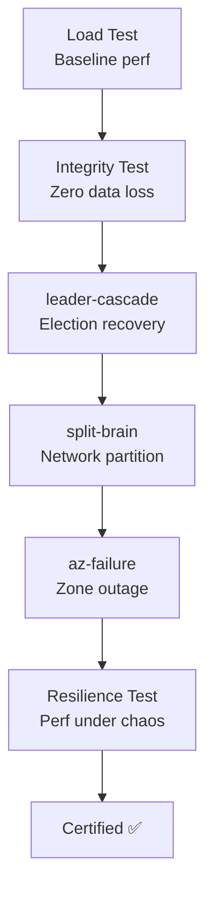

# Chapter 14: Recipes & Patterns

Practical, ready-to-use recipes for common KATES workflows. Each recipe is a self-contained procedure you can adapt to your environment.

## Recipe 1: Validate a Kafka Upgrade

**Goal:** Prove that a Kafka version upgrade doesn't introduce regressions in performance or data integrity.

### Procedure


**Step 1 — Capture baseline on the current version:**

```bash
kates test apply -f upgrade-suite.yaml --wait
# Note the test IDs from the output
```

**Step 2 — Perform the upgrade** (via Strimzi CR update).

**Step 3 — Re-run the same suite:**

```bash
kates test apply -f upgrade-suite.yaml --wait
```

**Step 4 — Compare results:**

```bash
kates report diff <baseline-id> <new-id>
```

### Suggested Scenario File

```yaml
scenarios:
  - name: "Load Baseline"
    type: LOAD
    spec:
      records: 200000
      parallelProducers: 4
      acks: all
    validate:
      maxP99LatencyMs: 50
      minThroughputRecPerSec: 15000

  - name: "Integrity Check"
    type: INTEGRITY
    spec:
      records: 100000
      enableIdempotence: true
      enableCrc: true
    validate:
      maxDataLossPercent: 0
      maxCrcFailures: 0

  - name: "Round-Trip Latency"
    type: ROUND_TRIP
    spec:
      records: 10000
      numConsumers: 1
    validate:
      maxP99LatencyMs: 30
```

---

## Recipe 2: Nightly Regression Suite

**Goal:** Detect performance regressions early by running a test suite every night and monitoring trends.

### Procedure

**Step 1 — Create the test request JSON:**

```bash
cat > nightly-load.json << 'EOF'
{
  "testType": "LOAD",
  "spec": {
    "records": 100000,
    "parallelProducers": 4,
    "recordSizeBytes": 1024,
    "acks": "all"
  }
}
EOF
```

**Step 2 — Create the schedule:**

```bash
kates schedule create \
  --name "Nightly Load Regression" \
  --cron "0 2 * * *" \
  --request nightly-load.json
```

**Step 3 — Monitor trends weekly:**

```bash
kates trend --type LOAD --metric p99LatencyMs --days 30
kates trend --type LOAD --metric throughputRecordsPerSec --days 30
```

A sudden spike in the sparkline indicates a regression. Use `kates report diff` to compare the anomalous run against its predecessor.

---

## Recipe 3: Pre-Production Chaos Certification

**Goal:** Build confidence that a Kafka cluster meets resilience SLAs before deploying to production.

### Procedure

Run these tests sequentially. All must pass before the cluster is certified.



**Step 1 — Performance baseline:**

```bash
kates test create --type LOAD --records 200000 --producers 4 --acks all --wait
```

**Step 2 — Data integrity under chaos:**

```bash
kates test scaffold --type INTEGRITY_CHAOS -o integrity-chaos.yaml
kates test apply -f integrity-chaos.yaml --wait
```

**Step 3 — Disruption playbooks:**

```bash
kates disruption run --config <(kates disruption playbook leader-cascade) --fail-on-sla-breach
kates disruption run --config <(kates disruption playbook split-brain) --fail-on-sla-breach
```

**Step 4 — Resilience test (performance + chaos combined):**

```bash
cat > resilience.json << 'EOF'
{
  "testRequest": {
    "testType": "LOAD",
    "spec": { "records": 100000, "producers": 4 }
  },
  "chaosSpec": {
    "experimentName": "kafka-pod-kill",
    "targetNamespace": "kafka"
  },
  "steadyStateSec": 30
}
EOF
kates resilience run --config resilience.json
```

---

## Recipe 4: Investigate a Latency Regression

**Goal:** Diagnose why P99 latency increased between two test runs.

### Procedure

**Step 1 — Identify the regression with diff:**

```bash
kates report diff <good-id> <bad-id>
```

Look for which metric regressed most: throughput drop, latency spike, or error increase.

**Step 2 — Check broker-level metrics:**

```bash
kates report brokers <bad-id>
```

If one broker shows disproportionately high load (bytes in/s, request rate), it may have become a hotspot due to partition imbalance.

**Step 3 — Export and compare heatmaps:**

```bash
kates report export <good-id> --format heatmap -o good-heatmap.json
kates report export <bad-id> --format heatmap -o bad-heatmap.json
```

Heatmap patterns to look for:

| Pattern | Diagnosis |
|---------|-----------|
| Vertical stripe in bad run | Point-in-time spike — likely GC pause or leader election |
| Two horizontal bands | Bimodal latency — some messages hitting hot path, others cold |
| Gradual upward drift | Saturation — cluster can't keep up with the load |

**Step 4 — Check cluster health during the bad run:**

```bash
kates cluster check -o json
```

If under-replicated partitions or ISR changes occurred during the test, the cluster was under stress.

---

## Recipe 5: Capacity Planning

**Goal:** Determine the maximum sustainable throughput for your cluster configuration.

### Procedure

Use the `CAPACITY` test type, which progressively increases load until the cluster degrades:

```bash
kates test create --type CAPACITY --wait
```

The capacity test automatically:
1. Starts with a moderate producer count
2. Increases producers in each phase
3. Measures throughput and latency at each level
4. Reports the phase where latency degradation began

### Interpreting Results

```bash
kates test get <id>
```

The results show per-phase metrics. The last phase before P99 latency exceeded your SLA threshold represents your cluster's sustainable capacity.

Combine with trend analysis to track capacity changes over time as your cluster configuration evolves:

```bash
kates trend --type CAPACITY --metric throughputRecordsPerSec --days 90
```

---

## Recipe 6: Producer Tuning

**Goal:** Find the optimal producer configuration for your workload.

### Procedure

Create a scenario file that tests multiple configurations side-by-side:

```yaml
scenarios:
  - name: "Defaults"
    type: LOAD
    spec:
      records: 100000
      parallelProducers: 4

  - name: "High Batch + Linger"
    type: LOAD
    spec:
      records: 100000
      parallelProducers: 4
      batchSize: 65536
      lingerMs: 50

  - name: "LZ4 Compression"
    type: LOAD
    spec:
      records: 100000
      parallelProducers: 4
      compressionType: lz4

  - name: "Full Optimization"
    type: LOAD
    spec:
      records: 100000
      parallelProducers: 4
      batchSize: 65536
      lingerMs: 50
      compressionType: lz4
```

```bash
kates test apply -f tuning-suite.yaml --wait
```

After completion, compare all four runs:

```bash
kates report compare <id1>,<id2>,<id3>,<id4>
```
