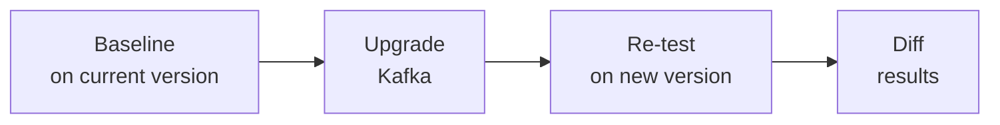
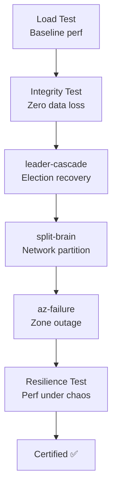

# Chapter 14: Recipes & Patterns

Practical, ready-to-use recipes for common Kates workflows. Each recipe is a self-contained procedure you can adapt to your environment.

## Recipe 1: Validate a Kafka Upgrade

**Goal:** Prove that a Kafka version upgrade doesn't introduce regressions in performance or data integrity.

### Procedure


```mermaid
graph LR
    B[Baseline\non current version] --> U[Upgrade\nKafka] --> R[Re-test\non new version] --> D[Diff\nresults]
```

**Step 1 — Capture baseline on the current version:**

```bash
kates test apply -f upgrade-suite.yaml --wait
# Note the test IDs from the output
```

**Step 2 — Perform the upgrade** (via Strimzi CR update).

**Step 3 — Re-run the same suite:**

```bash
kates test apply -f upgrade-suite.yaml --wait
```

**Step 4 — Compare results:**

```bash
kates report diff <baseline-id> <new-id>
```

Expected output:

```
  ▸ Report Diff: a1b2c3d4 vs e5f6a7b8
  ┌─────────────────────┬───────────┬───────────┬────────┐
  │ Metric              │ Baseline  │ New       │ Delta  │
  ├─────────────────────┼───────────┼───────────┼────────┤
  │ P99 Latency (ms)    │ 12.4      │ 13.1      │ +5.6%  │
  │ Throughput (rec/s)   │ 18,432    │ 17,891    │ -2.9%  │
  │ Error Rate           │ 0.000%    │ 0.000%    │  0.0%  │
  │ Data Loss            │ 0         │ 0         │  0     │
  └─────────────────────┴───────────┴───────────┴────────┘
  ✓ All metrics within 10% tolerance
```

::: {.callout-tip}
If you see `Test run not found` errors, make sure you noted the test IDs from Step 1 output before starting the upgrade. Test IDs are printed after each `kates test apply` or `kates test create` command.
:::


### Suggested Scenario File

```yaml
scenarios:
  - name: "Load Baseline"
    type: LOAD
    spec:
      records: 200000
      parallelProducers: 4
      acks: all
    validate:
      maxP99LatencyMs: 50
      minThroughputRecPerSec: 15000

  - name: "Integrity Check"
    type: INTEGRITY
    spec:
      records: 100000
      enableIdempotence: true
      enableCrc: true
    validate:
      maxDataLossPercent: 0
      maxCrcFailures: 0

  - name: "Round-Trip Latency"
    type: ROUND_TRIP
    spec:
      records: 10000
      numConsumers: 1
    validate:
      maxP99LatencyMs: 30
```

---

## Recipe 2: Nightly Regression Suite

**Goal:** Detect performance regressions early by running a test suite every night and monitoring trends.

### Procedure

**Step 1 — Create the test request JSON:**

```bash
cat > nightly-load.json << 'EOF'
{
  "type": "LOAD",
  "spec": {
    "numRecords": 100000,
    "numProducers": 4,
    "recordSize": 1024,
    "acks": "all"
  }
}
EOF
```

**Step 2 — Create the schedule:**

```bash
kates schedule create \
  --name "Nightly Load Regression" \
  --cron "0 2 * * *" \
  --request nightly-load.json
```

**Step 3 — Monitor trends weekly:**

```bash
kates trend --type LOAD --metric p99LatencyMs --days 30
kates trend --type LOAD --metric avgThroughputRecPerSec --days 30
```

Expected output:

```
  ▸ Trend: LOAD / p99LatencyMs (30 days, 30 runs)
    Min: 8.2ms  Max: 14.1ms  Avg: 10.5ms
    ▁▁▂▁▁▁▂▁▃▁▁▁▂▁▁▁▁▂▁▁▁▁▁▁▁▇▁▁▁▁
                                 ↑ anomaly (run #26)

  ▸ Trend: LOAD / avgThroughputRecPerSec (30 days, 30 runs)
    Min: 15,201  Max: 19,843  Avg: 18,102
    ▇▇▆▇▇▇▆▇▅▇▇▇▆▇▇▇▇▆▇▇▇▇▇▇▇▂▇▇▇▇
                                 ↑ anomaly (run #26)
```

::: {.callout-tip}
If the schedule doesn't trigger, verify the Kates backend pod is running with `kubectl get pods -n kates -l app.kubernetes.io/name=kates` — the scheduler runs inside the backend, not as a separate pod. The cron expression uses UTC — adjust for your timezone.
:::


A sudden spike in the sparkline indicates a regression. Use `kates report diff` to compare the anomalous run against its predecessor.

---

## Recipe 3: Pre-Production Chaos Certification

**Goal:** Build confidence that a Kafka cluster meets resilience SLAs before deploying to production.

### Procedure

Run these tests sequentially. All must pass before the cluster is certified.


```mermaid
graph TD
    L[Load Test\nBaseline perf] --> I[Integrity Test\nZero data loss]
    I --> C1[leader-cascade\nElection recovery]
    C1 --> C2[split-brain\nNetwork partition]
    C2 --> C3[az-failure\nZone outage]
    C3 --> R[Resilience Test\nPerf under chaos]
    R --> CERT[Certified ✅]
```

**Step 1 — Performance baseline:**

```bash
kates test create --type LOAD --records 200000 --producers 4 --acks all --wait
```

**Step 2 — Data integrity:**

```bash
kates test scaffold export integrity-tx
kates test apply -f integrity-tx.yaml --wait
```

**Step 3 — Disruption playbooks:**

```bash
kates disruption playbook run leader-cascade
kates disruption playbook run split-brain
kates disruption playbook run az-failure
```

**Step 4 — Resilience test (performance + chaos combined):**

```bash
cat > resilience.json << 'EOF'
{
  "testRequest": {
    "type": "LOAD",
    "spec": { "numRecords": 100000, "numProducers": 4 }
  },
  "chaosSpec": {
    "experimentName": "kafka-broker-pod-kill",
    "targetNamespace": "kafka",
    "targetLabel": "strimzi.io/component-type=kafka",
    "chaosDurationSec": 30,
    "disruptionType": "POD_KILL"
  },
  "steadyStateSec": 30
}
EOF
kates resilience run -f resilience.json
```

Expected output:

```
  Resilience Test Results
  Status: COMPLETED

  Chaos Outcome
  Experiment: kafka-broker-pod-kill
  Verdict:    Pass
  Duration:   30s

  Pre-Chaos Baseline
  Throughput (rec/s): 18500.0
  P99 Latency (ms):   11.20
  Error Rate:         0.0000%

  Post-Chaos Impact
  Throughput (rec/s): 18200.0
  P99 Latency (ms):   12.80
  Error Rate:         0.0000%
```

::: {.callout-tip}
Each playbook run prints an SLA grade at the end. If you need a hard pass/fail gate for CI — exit code 1 on SLA violation — run a custom disruption plan instead: `kates disruption run --config plan.json --fail-on-sla-breach`. Use `kates disruption playbook list` to see the available playbooks and what each one does.
:::


---

## Recipe 4: Investigate a Latency Regression

**Goal:** Diagnose why P99 latency increased between two test runs.

### Procedure

**Step 1 — Identify the regression with diff:**

```bash
kates report diff <good-id> <bad-id>
```

Look for which metric regressed most: throughput drop, latency spike, or error increase.

**Step 2 — Check broker-level metrics:**

```bash
kates report brokers <bad-id>
```

If one broker shows disproportionately high load (bytes in/s, request rate), it may have become a hotspot due to partition imbalance.

**Step 3 — Export and compare heatmaps:**

```bash
kates report export <good-id> --format heatmap > good-heatmap.json
kates report export <bad-id> --format heatmap > bad-heatmap.json
```

(When run interactively without a redirect, the heatmap is written to `kates-heatmap-<id>.json` in the current directory.)

Heatmap patterns to look for:

| Pattern | Diagnosis |
|---------|-----------|
| Vertical stripe in bad run | Point-in-time spike — likely GC pause or leader election |
| Two horizontal bands | Bimodal latency — some messages hitting hot path, others cold |
| Gradual upward drift | Saturation — cluster can't keep up with the load |

**Step 4 — Check cluster health during the bad run:**

```bash
kates cluster check -o json
```

Expected output:

```json
{
  "clusterId": "lZ0T3AqiTtqzXWkGkDXG3g",
  "brokers": 3,
  "controllerId": 0,
  "topics": 24,
  "partitions": 96,
  "consumerGroups": 5,
  "partitionHealth": {
    "underReplicated": 3,
    "offline": 0,
    "problems": [
      {"topic": "kates-load-test", "partition": 4, "issue": "UNDER_REPLICATED", "isr": 2, "replicas": 3}
    ]
  },
  "status": "WARNING"
}
```

::: {.callout-tip}
If the diff shows degraded throughput but the heatmap has no obvious pattern, check the GC logs. Run `kubectl logs <broker-pod> -n kafka | grep 'GC pause'` — JVM garbage collection pauses are a common hidden cause of latency spikes.
:::


If under-replicated or offline partitions show up during the test, the cluster was under stress.

---

## Recipe 5: Capacity Planning

**Goal:** Determine the maximum sustainable throughput for your cluster configuration.

### Procedure

Use the `CAPACITY` test type, which progressively increases load until the cluster degrades:

```bash
kates test create --type CAPACITY --wait
```

The capacity test automatically:
1. Starts with a moderate producer count
2. Increases producers in each phase
3. Measures throughput and latency at each level
4. Reports the phase where latency degradation began

### Interpreting Results

```bash
kates test get <id>
```

The results show per-phase metrics. The last phase before P99 latency exceeded your SLA threshold represents your cluster's sustainable capacity.

Combine with trend analysis to track capacity changes over time as your cluster configuration evolves:

```bash
kates trend --type CAPACITY --metric avgThroughputRecPerSec --days 90
```

Expected output:

```
  ▸ Capacity Test Results
  ┌───────┬────────────┬───────────────┬──────────────┐
  │ Phase │ Producers  │ Throughput    │ P99 Latency  │
  ├───────┼────────────┼───────────────┼──────────────┤
  │ 1     │ 2          │ 9,800 rec/s   │ 8.1ms        │
  │ 2     │ 4          │ 18,200 rec/s  │ 11.4ms       │
  │ 3     │ 8          │ 32,100 rec/s  │ 18.7ms       │
  │ 4     │ 16         │ 41,500 rec/s  │ 45.2ms       │
  │ 5     │ 32         │ 38,900 rec/s  │ 210.5ms  ⚠   │
  └───────┴────────────┴───────────────┴──────────────┘
  Sustainable capacity: Phase 4 (16 producers, 41,500 rec/s)
  Degradation detected at Phase 5: P99 exceeded SLA threshold
```

::: {.callout-tip}
If capacity results seem unexpectedly low, check that no resource quotas or Kafka user throttling limits are active. Run `kubectl get kafkauser -n kafka -o yaml` and verify the `quotas` section isn't constraining your test user.
:::


---

## Recipe 6: Producer Tuning

**Goal:** Find the optimal producer configuration for your workload.

### Procedure

Create a scenario file that tests multiple configurations side-by-side:

```yaml
scenarios:
  - name: "Defaults"
    type: LOAD
    spec:
      records: 100000
      parallelProducers: 4

  - name: "High Batch + Linger"
    type: LOAD
    spec:
      records: 100000
      parallelProducers: 4
      batchSize: 65536
      lingerMs: 50

  - name: "LZ4 Compression"
    type: LOAD
    spec:
      records: 100000
      parallelProducers: 4
      compressionType: lz4

  - name: "Full Optimization"
    type: LOAD
    spec:
      records: 100000
      parallelProducers: 4
      batchSize: 65536
      lingerMs: 50
      compressionType: lz4
```

```bash
kates test apply -f tuning-suite.yaml --wait
```

After completion, compare all four runs:

```bash
kates report compare <id1>,<id2>,<id3>,<id4>
```

Expected output:

```
  ▸ Comparison: 4 runs
  ┌───────────────────────┬───────────────┬──────────────┬───────────────────┐
  │ Scenario              │ Throughput    │ P99 Latency  │ Error Rate        │
  ├───────────────────────┼───────────────┼──────────────┼───────────────────┤
  │ Defaults              │ 14,200 rec/s  │ 18.3ms       │ 0.000%            │
  │ High Batch + Linger   │ 22,800 rec/s  │ 52.1ms       │ 0.000%            │
  │ LZ4 Compression       │ 19,500 rec/s  │ 15.7ms       │ 0.000%            │
  │ Full Optimization     │ 28,100 rec/s  │ 48.9ms       │ 0.000%            │
  └───────────────────────┴───────────────┴──────────────┴───────────────────┘
  Best throughput:  Full Optimization (28,100 rec/s, +97.9% vs Defaults)
  Best latency:    LZ4 Compression (15.7ms, -14.2% vs Defaults)
```

::: {.callout-tip}
If all four runs show nearly identical throughput, the bottleneck is likely not the producer configuration. Check network bandwidth between producers and brokers with `kubectl exec <broker-pod> -n kafka -- cat /proc/net/dev` and verify the cluster isn't network-bound.
:::
