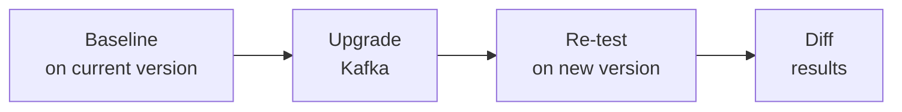
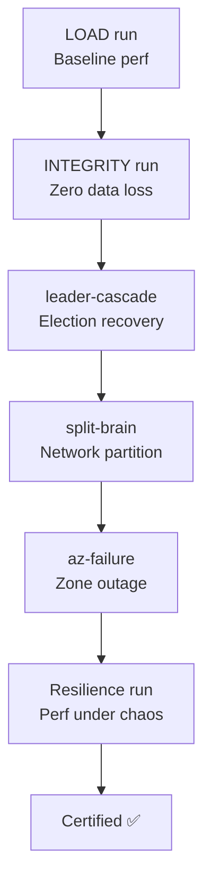

# Recipes & Patterns

Practical, ready-to-use recipes for common Kates workflows. Each recipe is a self-contained procedure you can adapt to your environment — this chapter is for you once you know the individual commands and want to combine them into end-to-end procedures. After this chapter, you can:

- Validate a Kafka upgrade by diffing before-and-after runs of the same scenario file with `kates report diff`
- Schedule a nightly regression suite with `kates schedule create` and spot anomalies with `kates trend`
- Certify a cluster's resilience with disruption playbooks and a combined `kates resilience run`
- Diagnose a latency regression, and find the cluster's sustainable capacity by comparing CAPACITY runs at rising producer counts

Pick a recipe by the question you need answered. Two of them disrupt the cluster on purpose, so check the Disrupts the cluster column before you run one where other people depend on the cluster:

| Recipe | Question it answers | Run time | Disrupts the cluster | Prerequisites |
|--------|---------------------|----------|----------------------|---------------|
| [Recipe 1: Validate a Kafka Upgrade](#recipe-1-validate-a-kafka-upgrade) | Did the upgrade change performance or data integrity? | Two runs of a three-scenario suite, with the upgrade between them | The upgrade rolls every broker; the tests don't disrupt | The recipe's scenario file, and the [Upgrade Playbook](18-upgrade-playbook.md) procedure |
| [Recipe 2: Nightly Regression Suite](#recipe-2-nightly-regression-suite) | Is performance drifting from night to night? | One LOAD run of 100,000 records a night; the trend commands read 30 days | No | A running Kates API, where the scheduler runs |
| [Recipe 3: Pre-Production Chaos Certification](#recipe-3-pre-production-chaos-certification) | Does the cluster keep working through broker loss, a network partition and a zone outage? | Two tests and three playbooks, then a 360 s LOAD run during a broker kill | Yes: it kills Kafka pods and cuts one broker off the network | A cluster nothing else depends on, with a Kafka pool pinned to zone `alpha` for `az-failure` |
| [Recipe 4: Investigate a Latency Regression](#recipe-4-investigate-a-latency-regression) | Why did P99 latency rise between two runs? | No new runs: it reads results you already have | No | Two finished runs to compare |
| [Recipe 5: Capacity Planning](#recipe-5-capacity-planning) | What throughput can the cluster sustain? | Five CAPACITY runs of up to five minutes each, one after another | Yes: it drives the brokers to their limit | A cluster nothing else depends on, `jq`, and your P99 SLA threshold |
| [Recipe 6: Producer Tuning](#recipe-6-producer-tuning) | Which producer settings suit your workload? | Four LOAD runs of 100,000 records each | No | The recipe's scenario file |

## Recipe 1: Validate a Kafka Upgrade {#recipe-1-validate-a-kafka-upgrade}

**Goal:** Prove that a Kafka version upgrade doesn't introduce regressions in performance or data integrity.

### Procedure


```mermaid
graph LR
    B[Baseline\non current version] --> U[Upgrade\nKafka] --> R[Re-test\non new version] --> D[Diff\nresults]
```

**Step 1 — Capture baseline on the current version:**

```bash
kates test apply -f upgrade-suite.yaml --wait
# Note the test IDs from the output
```

**Step 2 — Perform the upgrade** with the procedure in [Upgrade Playbook](18-upgrade-playbook.md#kafka-version-upgrade): a `helm upgrade` of the Kafka release that starts from its current values (`helm get values`), sets the new `kafkaVersion`, and pins `kafka.metadataVersion` where it is so the upgrade stays reversible. Do not rebuild the values from the repository's files, which can rename the node pools, and do not use `kates deploy --kafka-version`, which leaves a running cluster alone. Confirm the cluster runs the new version before you re-test, or Step 4 compares two runs of the old one:

```bash
kubectl get kafka krafter -n kafka -o jsonpath='{.status.kafkaVersion}{"\n"}'
```

**Step 3 — Re-run the same suite:**

```bash
kates test apply -f upgrade-suite.yaml --wait
```

**Step 4 — Compare results:**

```bash
kates report diff <baseline-id> <new-id>
```

Expected output:

```text
  ▸ Report Diff: a1b2c3d4 vs e5f6a7b8
  ┌─────────────────────┬───────────┬───────────┬────────┐
  │ Metric              │ Baseline  │ New       │ Delta  │
  ├─────────────────────┼───────────┼───────────┼────────┤
  │ P99 Latency (ms)    │ 12.4      │ 13.1      │ +5.6%  │
  │ Throughput (rec/s)   │ 18,432    │ 17,891    │ -2.9%  │
  │ Error Rate           │ 0.000%    │ 0.000%    │  0.0%  │
  │ Data Loss            │ 0         │ 0         │  0     │
  └─────────────────────┴───────────┴───────────┴────────┘
  ✓ All metrics within 10% tolerance
```

::: {.callout-tip}
If you see `Test run not found` errors, make sure you noted the test IDs from Step 1 output before starting the upgrade. Test IDs are printed after each `kates test apply` or `kates test create` command.
:::

### Suggested Scenario File

```yaml
scenarios:
  - name: "Load Baseline"
    type: LOAD
    spec:
      records: 200000
      acks: all
    validate:
      maxP99LatencyMs: 50
      minThroughputRecPerSec: 15000

  - name: "Integrity Check"
    type: INTEGRITY
    spec:
      records: 100000
      acks: all
    validate:
      maxDataLossPercent: 0
      maxCrcFailures: 0

  - name: "Round-Trip Latency"
    type: ROUND_TRIP
    spec:
      records: 10000
    validate:
      maxP99LatencyMs: 30
```

The integrity scenario relies on `acks: all`, which also makes the producer idempotent. `enableIdempotence`, `enableTransactions` and `enableCrc` in a scenario file turn idempotence, transactions and CRC checks on or off explicitly. The Kates API refuses a combination the producer cannot run, such as transactions with `acks: 1` (see [Scenario Files & SLA Gates](13-scenario-files.md)).

---

## Recipe 2: Nightly Regression Suite {#recipe-2-nightly-regression-suite}

**Goal:** Detect performance regressions early by running a test suite every night and monitoring trends.

### Procedure

**Step 1 — Create the test request JSON:**

```bash
cat > nightly-load.json << 'EOF'
{
  "type": "LOAD",
  "spec": {
    "numRecords": 100000,
    "recordSize": 1024,
    "acks": "all"
  }
}
EOF
```

**Step 2 — Create the schedule:**

```bash
kates schedule create \
  --name "Nightly Load Regression" \
  --cron "0 2 * * *" \
  --request nightly-load.json
```

**Step 3 — Monitor trends weekly:**

```bash
kates trend --type LOAD --metric p99LatencyMs --days 30
kates trend --type LOAD --metric avgThroughputRecPerSec --days 30
```

Expected output:

```text
  ▸ Trend: LOAD / p99LatencyMs (30 days, 30 runs)
    Min: 8.2ms  Max: 14.1ms  Avg: 10.5ms
    ▁▁▂▁▁▁▂▁▃▁▁▁▂▁▁▁▁▂▁▁▁▁▁▁▁▇▁▁▁▁
                                 ↑ anomaly (run #26)

  ▸ Trend: LOAD / avgThroughputRecPerSec (30 days, 30 runs)
    Min: 15,201  Max: 19,843  Avg: 18,102
    ▇▇▆▇▇▇▆▇▅▇▇▇▆▇▇▇▇▆▇▇▇▇▇▇▇▂▇▇▇▇
                                 ↑ anomaly (run #26)
```

::: {.callout-tip}
If the schedule doesn't trigger, verify the Kates API pod is running with `kubectl get pods -n kates -l app.kubernetes.io/name=kates` — the scheduler runs inside the Kates API, not as a separate pod. The cron expression uses UTC — adjust for your timezone.
:::

A sudden spike in the sparkline indicates a regression. Use `kates report diff` to compare the anomalous run against its predecessor.

---

## Recipe 3: Pre-Production Chaos Certification {#recipe-3-pre-production-chaos-certification}

**Goal:** Build confidence that a Kafka cluster meets resilience SLAs before deploying to production.

::: {.callout-caution}
This recipe breaks the cluster on purpose. `leader-cascade` kills the brokers leading `__consumer_offsets` partitions 0 and 1, one after the other; `split-brain` aims a `NETWORK_PARTITION` fault at broker 0 for 60 seconds; `az-failure` kills every Kafka pod in zone `alpha`; and Step 4 kills a broker while a LOAD test runs. Anything else using the cluster goes through the same failures, so run the recipe on a cluster nothing else depends on, before it takes production traffic.
:::

Certification is the production-like step of [3. Run Experiments in Production (or Production-Like)](06-chaos-theory.md#3-run-experiments-in-production-or-production-like), and that's why the recipe stays out of production. Its playbooks climb to a zone outage, the top rung of [5. Minimize Blast Radius](06-chaos-theory.md#5-minimize-blast-radius). Once the cluster is live, repeat its experiments there one at a time, from the lowest rung up.

### Procedure

Run these tests sequentially. All must pass before the cluster is certified.


```mermaid
graph TD
    L[LOAD run\nBaseline perf] --> I[INTEGRITY run\nZero data loss]
    I --> C1[leader-cascade\nElection recovery]
    C1 --> C2[split-brain\nNetwork partition]
    C2 --> C3[az-failure\nZone outage]
    C3 --> R[Resilience run\nPerf under chaos]
    R --> CERT[Certified ✅]
```

**Step 1 — Performance baseline:**

```bash
kates test create --type LOAD --records 200000 --acks all --wait
```

**Step 2 — Data integrity:**

```bash
kates test scaffold export integrity-tx
kates test apply -f integrity-tx.yaml --wait
```

**Step 3 — Disruption playbooks:**

```bash
# Each dry run previews the cluster as it is just before its playbook, starts
# nothing, and exits 1 when the safety guard would refuse the playbook
kates disruption playbook run leader-cascade --dry-run && kates disruption playbook run leader-cascade
kates disruption playbook run split-brain --dry-run && kates disruption playbook run split-brain
kates disruption playbook run az-failure --dry-run && kates disruption playbook run az-failure
```

**Step 4 — Resilience run (performance + chaos combined):**

```bash
cat > resilience.json << 'EOF'
{
  "testRequest": {
    "type": "LOAD",
    "spec": { "numRecords": 180000, "throughput": 500 }
  },
  "chaosSpec": {
    "experimentName": "kafka-broker-pod-kill",
    "targetNamespace": "kafka",
    "targetLabel": "strimzi.io/component-type=kafka,strimzi.io/broker-role=true",
    "chaosDurationSec": 30,
    "disruptionType": "POD_KILL"
  },
  "steadyStateSec": 30
}
EOF
kates resilience run -f resilience.json
```

The rate limit keeps the load running across the fault: 180,000 records at 500 records per second take 360 s, while the fault is triggered after `steadyStateSec` (30 s) and lasts `chaosDurationSec` (30 s). An unthrottled run can finish before the fault is triggered, and then both summaries describe a run the fault never touched. The `spec` goes to the API as written, so it takes the API's field names: `throughput` sets the rate, and LOAD runs one producer and one consumer whatever `numProducers` says. The selector adds `strimzi.io/broker-role=true` because `strimzi.io/component-type=kafka` alone also matches the KRaft controllers, and a random pick could then kill a controller instead of a broker. [Chaos Engineering in Practice](07-chaos-practice.md) covers the fields.

Expected output, with illustrative numbers:

```text
◉ Running resilience test...

━━━━━━━━━━━━━━━━━━━━━━━━━━━━━━━━━━━━━━━━━━
  Resilience Test Results
━━━━━━━━━━━━━━━━━━━━━━━━━━━━━━━━━━━━━━━━━━
  Status                   ● COMPLETED
  Test Run                 3f6c2a1e

 ▸ Chaos Outcome
  Experiment               kafka-broker-pod-kill
  Verdict                  ● PASS
  Duration                 47.318204000s
  Phase                    Completed
  Fail Step                N/A
  Probe Success            ████████████████████ 100%

 ▸ Probes and Recovery
  Recovery Time            8214 ms
  Baseline                 2/2 passed
  During the fault         4/5 passed
  After recovery           2/2 passed

  Phase             Probe             Failed  Output
  ────────────────  ────────────────  ──────  ──────
  During the fault  isr-health-check  1/5     61

 ▸ Impact Analysis (% change)
  Metric               Change
  ───────────────────  ────────  ─
  throughputRecPerSec  -2.1%
  avgLatencyMs         +184.6%   ▲
  p99LatencyMs         +3572.3%  ▲
  maxLatencyMs         +2410.8%  ▲
  errorRate            +0.0%

 ▸ Pre-Chaos Baseline
  Throughput (rec/s)       499.6
  P99 Latency (ms)         11.20
  Error Rate               0.0000%

 ▸ Post-Chaos Impact
  Throughput (rec/s)       489.1
  P99 Latency (ms)         411.30
  Error Rate               0.0000%

  Full details: kates test get 3f6c2a1e
```

`Status` is `COMPLETED` only when the chaos outcome's verdict is `Pass`. The Impact Analysis rows come in a different order from run to run. The command returns as soon as its recovery probes pass, usually while the LOAD run is still producing, so the post-chaos summary covers the run up to that moment. `Test Run` names that LOAD run, and the last line reads it with `kates test get`. With the rate held at 500 records per second, throughput barely moves, and the fault shows in the latency rows.

::: {.callout-tip}
A playbook run prints the disruption ID and the final status, and gets no SLA grade: playbook YAML cannot carry an `sla` block. To fail a CI job on an SLA violation, with exit code 1, save a playbook's plan with `kates disruption playbook show <name> -o json > plan.json`, add an `sla` block, and run it with `kates disruption run --config plan.json --fail-on-sla-breach`. Use `kates disruption playbook list` to see the available playbooks and what each one does.
:::

---

## Recipe 4: Investigate a Latency Regression {#recipe-4-investigate-a-latency-regression}

**Goal:** Diagnose why P99 latency increased between two test runs.

### Procedure

**Step 1 — Identify the regression with diff:**

```bash
kates report diff <good-id> <bad-id>
```

Look for which metric regressed most: throughput drop, latency spike, or error increase.

**Step 2 — Check broker-level metrics:**

```bash
kates report brokers <bad-id>
```

If one broker leads a disproportionate share of the topic's partitions, it may have become a hotspot due to partition imbalance. `report brokers` shows that share as projected throughput and skew: it splits the run's throughput by each broker's share of the topic's partition leaders, taken when the report was built rather than during the run. It doesn't measure each broker's bytes or request rate.

**Step 3 — Export and compare heatmaps:**

```bash
kates report export <good-id> --format heatmap > good-heatmap.json
kates report export <bad-id> --format heatmap > bad-heatmap.json
```

(When run interactively without a redirect, the heatmap is written to `kates-heatmap-<id>.json` in the current directory.)

Both exports work only while the two runs are among the Kates API's 50 most recent `native` runs and its pod hasn't restarted since, because heatmap rows live only in its memory. Kates keeps runs in PostgreSQL, not in Kafka, and some of what you see about a run lives only in the Kates API's memory; [Architecture & Design](02-architecture.md) says what lasts how long.

Heatmap patterns to look for:

| Pattern | Diagnosis |
|---------|-----------|
| Vertical stripe in bad run | Point-in-time spike — likely GC pause or leader election |
| Two horizontal bands | Bimodal latency — some messages hitting hot path, others cold |
| Gradual upward drift | Saturation — cluster can't keep up with the load |

**Step 4 — Check cluster health during the bad run:**

```bash
kates cluster check -o json
```

Expected output:

```json
{
  "clusterId": "lZ0T3AqiTtqzXWkGkDXG3g",
  "brokers": 3,
  "controllerId": 0,
  "topics": 24,
  "partitions": 96,
  "consumerGroups": 5,
  "partitionHealth": {
    "underReplicated": 3,
    "offline": 0,
    "problems": [
      {"topic": "kates-load-test", "partition": 4, "issue": "UNDER_REPLICATED", "isr": 2, "replicas": 3}
    ]
  },
  "status": "WARNING"
}
```

::: {.callout-tip}
If the diff shows degraded throughput but the heatmap has no obvious pattern, check the GC logs. Run `kubectl logs <broker-pod> -n kafka | grep 'GC pause'` — JVM garbage collection pauses are a common hidden cause of latency spikes.
:::

If under-replicated or offline partitions show up during the test, the cluster was under stress.

---

## Recipe 5: Capacity Planning {#recipe-5-capacity-planning}

A CAPACITY run starts all its producers at once and reports one set of numbers, so a single run can't show where the cluster tops out. To find the ceiling, run CAPACITY tests with 1, 2, 4, 8 and 16 producers, compare them, and read where total throughput stops rising. You need a cluster nothing else depends on, `jq`, and your P99 SLA threshold, and the series takes up to half an hour.

::: {.callout-caution title="The series saturates the cluster"}
Every CAPACITY producer runs unthrottled, so each run drives the brokers to their limit. Other clients compete with it for the brokers' network, disk and CPU while it runs, so run the series where nothing else depends on the cluster, and never on production.
:::

### Step 1 — Run the Series

The loop runs one CAPACITY test per producer count, one after another, deletes each run's topic when the run ends, and collects the run IDs:

```bash
# One CAPACITY run per producer count, each on its own topic
IDS=""
for N in 1 2 4 8 16; do
  ID=$(kates test create --type CAPACITY --producers "$N" --duration 300 \
    --topic "capacity-$N" --wait -o json | jq -r .id)
  kates kafka delete-topic "capacity-$N" --yes
  echo "producers=$N id=$ID"
  IDS="${IDS:+$IDS,}$ID"
done
```

`--wait` makes each `kates test create` return only when its run ends, so the runs never overlap. With `-o json` it prints the finished run, and `jq` picks out its `id`. Each producer stops once it has sent 10,000,000 records of 1 KB or its time runs out, whichever comes first. `--duration 300` gives it five minutes in place of the Kates API's default of 20.

Because each run writes to its own topic and the loop deletes it, only one run's records sit on the brokers' disks at a time. At the Kates API's defaults, a 16-producer run can send about 160 GB, and each of the topic's three replicas keeps a copy.

### Step 2 — Compare the Runs

`kates report compare` takes the IDs in the order the loop collected them, and prints every run's summary as JSON:

```bash
kates report compare "$IDS"
```

Output, with illustrative numbers and the last four runs trimmed:

```text
━━━━━━━━━━━━━━━━━━━━━━━━━━━━━━━━━━━━━━━━━━
  Comparison
━━━━━━━━━━━━━━━━━━━━━━━━━━━━━━━━━━━━━━━━━━
{
  "baselineRunId": "3f9c2a71",
  "deltas": {
    "avgLatencyMs": 2027.5862068965519,
    "maxLatencyMs": 3780.3312629399593,
    "p99LatencyMs": 3027.941176470588,
    "throughputRecPerSec": -75.50149998192792,
    "totalRecords": 485.61433000000005
  },
  "runs": [
    {
      "backend": "native",
      "runId": "3f9c2a71",
      "scenarioName": null,
      "summary": {
        "avgLatencyMs": 2.9,
        "avgThroughputMBPerSec": 48.6333984375,
        "avgThroughputRecPerSec": 49800.6,
        "durationMs": 0,
        "errorRate": 0,
        "maxLatencyMs": 48.3,
        "p50LatencyMs": 2.1,
        "p95LatencyMs": 4.8,
        "p999LatencyMs": 0,
        "p99LatencyMs": 6.8,
        "peakThroughputRecPerSec": 49800.6,
        "totalErrors": 0,
        "totalRecords": 10000000
      },
      "testType": "CAPACITY"
    },
    ...
  ]
}
```

Reading the output:

1. `runs` holds one entry per ID, in the order you passed them, and the four trimmed entries have the same fields. `baselineRunId` is the first, the 1-producer run.
2. `avgThroughputRecPerSec` is the mean of the producers' rates, not their sum. `peakThroughputRecPerSec` is the fastest producer's rate, and `totalRecords` counts every producer's records.
3. `deltas` compare only the baseline with the last run, the 16-producer one, in percent. The throughput delta is per producer: at -75.5%, each of 16 producers got about a quarter of a lone producer's rate.

### Step 3 — Find the Ceiling

Multiply each run's `avgThroughputRecPerSec` by its producer count to get the run's total, and set the total beside the run's `p99LatencyMs`. For the illustrative series, rounded:

| Producers | Mean per producer | Run total | P99 |
|:-:|--:|--:|--:|
| 1 | 49,800 rec/s | 49,800 rec/s | 6.8 ms |
| 2 | 47,650 rec/s | 95,300 rec/s | 7.9 ms |
| 4 | 42,550 rec/s | 170,200 rec/s | 11.6 ms |
| 8 | 25,050 rec/s | 200,400 rec/s | 38.4 ms |
| 16 | 12,200 rec/s | 195,200 rec/s | 212.7 ms |

The total stops rising between 8 and 16 producers, so this cluster's ceiling is about 200,000 records per second. The sustainable figure is the highest total whose P99 meets your SLA [@jain1991art]. With a 50 ms SLA, that's the 8-producer run's 200,400 records per second; with 20 ms, it's the 4-producer run's 170,200.

### Verify the Runs

A run that failed, or one the load generator limited, draws a curve that says nothing about Kafka. Before you trust the ceiling, check for both:

- `kates test list --type CAPACITY` shows every run of the series as `DONE`, and every summary in the comparison has `totalErrors` of 0.
- On the `native` backend, the producers run inside the Kates API pod. If the pod sits at its CPU limit during the larger runs, the curve has found the pod's ceiling, not Kafka's. The Application Health board in [Kates-Specific Dashboards](09-observability.md#kates-specific-dashboards) shows the pod's CPU.
- If every total is lower than you expect, check that no [quota](appendix-a-glossary.md#gl-quota) throttles the Kates client: `kubectl get kafkauser kates-backend -n kafka -o yaml` shows no `quotas` section.

### Stop an Interrupted Series

Stopping the loop with Ctrl-C leaves the current run going, because `--wait` only follows it. Find the run with `kates test list --type CAPACITY --status RUNNING` and stop it with `kates test delete <id>`. Then delete its topic with `kates kafka delete-topic capacity-<N> --yes`, where `<N>` is the run's producer count.

### Track the Ceiling Over Time

Rerun the series after any change that moves capacity, such as new broker hardware, a Kafka upgrade or a different partition count, and compare the two curves. `kates trend` charts one summary metric across the `DONE` CAPACITY runs of a window:

```bash
kates trend --type CAPACITY --metric avgThroughputRecPerSec --days 90
```

The trend plots every `DONE` CAPACITY run's per-producer mean, whatever its producer count, so a series shows up in it as a falling staircase and can flag its larger runs as regressions. It tracks the ceiling when you rerun one producer count at regular intervals, such as the count at the ceiling. To raise the ceiling on the producer side, continue with [Recipe 6: Producer Tuning](#recipe-6-producer-tuning).

---

## Recipe 6: Producer Tuning {#recipe-6-producer-tuning}

**Goal:** Find the optimal producer configuration for your workload.

### Procedure

Create a scenario file that tests multiple configurations side-by-side:

```yaml
scenarios:
  - name: "Defaults"
    type: LOAD
    spec:
      records: 100000

  - name: "High Batch + Linger"
    type: LOAD
    spec:
      records: 100000
      batchSize: 65536
      lingerMs: 50

  - name: "LZ4 Compression"
    type: LOAD
    spec:
      records: 100000
      compressionType: lz4

  - name: "Full Optimization"
    type: LOAD
    spec:
      records: 100000
      batchSize: 65536
      lingerMs: 50
      compressionType: lz4
```

```bash
kates test apply -f tuning-suite.yaml --wait
```

After completion, compare all four runs:

```bash
kates report compare <id1>,<id2>,<id3>,<id4>
```

Expected output:

```text
  ▸ Comparison: 4 runs
  ┌───────────────────────┬───────────────┬──────────────┬───────────────────┐
  │ Scenario              │ Throughput    │ P99 Latency  │ Error Rate        │
  ├───────────────────────┼───────────────┼──────────────┼───────────────────┤
  │ Defaults              │ 14,200 rec/s  │ 18.3ms       │ 0.000%            │
  │ High Batch + Linger   │ 22,800 rec/s  │ 52.1ms       │ 0.000%            │
  │ LZ4 Compression       │ 19,500 rec/s  │ 15.7ms       │ 0.000%            │
  │ Full Optimization     │ 28,100 rec/s  │ 48.9ms       │ 0.000%            │
  └───────────────────────┴───────────────┴──────────────┴───────────────────┘
  Best throughput:  Full Optimization (28,100 rec/s, +97.9% vs Defaults)
  Best latency:    LZ4 Compression (15.7ms, -14.2% vs Defaults)
```

::: {.callout-tip}
If all four runs show nearly identical throughput, the bottleneck is likely not the producer configuration. Check network bandwidth between producers and brokers with `kubectl exec <broker-pod> -n kafka -- cat /proc/net/dev` and verify the cluster isn't network-bound.
:::

## Summary

- Upgrade validation is a baseline-upgrade-retest-diff loop: run the same scenario file before and after, then compare with `kates report diff` against your tolerance.
- Nightly regressions are cheapest to catch with `kates schedule create` plus a weekly `kates trend` review — a spike in the sparkline points you at the run to diff.
- Chaos certification layers its tests: a LOAD baseline, an INTEGRITY check, disruption playbooks, and finally `kates resilience run`, which measures performance during failure.
- Latency investigations move from `kates report diff` to `kates report brokers` to heatmap export — vertical stripes suggest GC pauses or leader elections, horizontal bands bimodal paths, upward drift saturation.
- Capacity planning compares CAPACITY runs at rising producer counts: total throughput levels off at the ceiling, and your P99 SLA picks the sustainable point.
- Producer tuning is a multi-scenario suite compared with `kates report compare` — batching and linger buy throughput at a latency cost, while compression often improves both.

Every command these recipes lean on has more flags and output formats than shown here — the [CLI Reference](10-cli-reference.md) documents the full command surface.
