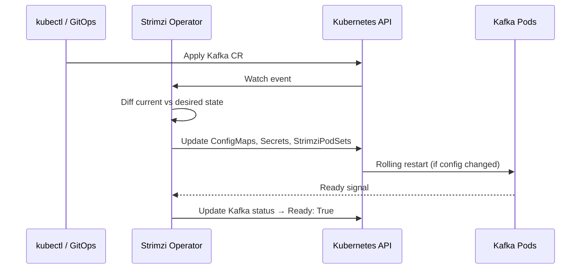
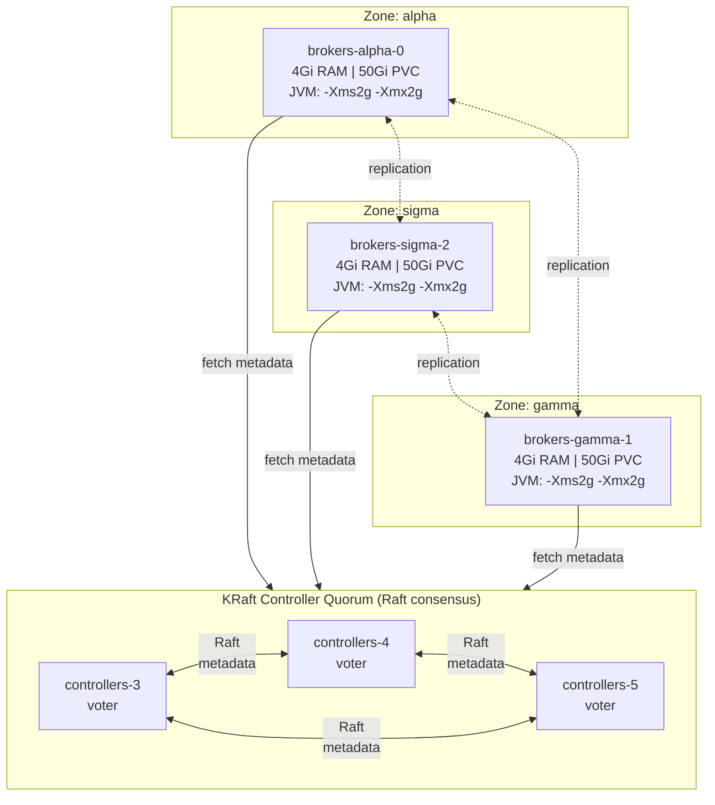
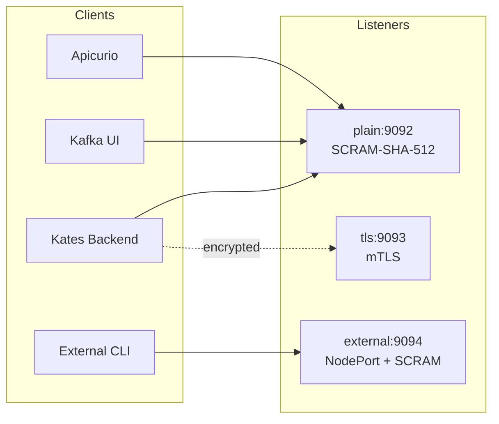
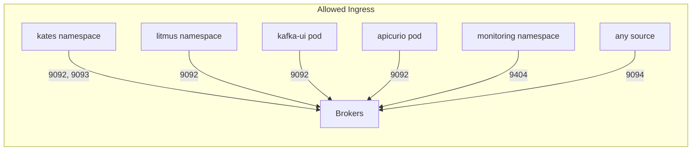
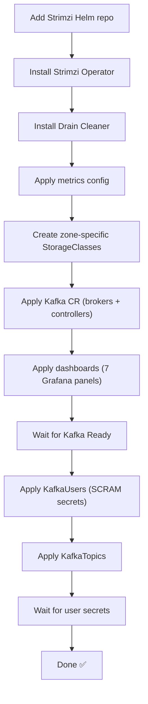

# Chapter 15: Kafka Deployment Engineering

This chapter is the operations manual for the **krafter** Kafka cluster — the Strimzi-managed, KRaft-mode deployment that underpins the entire Kates platform. It covers every layer from the operator to the broker JVM, with the reasoning behind each decision.

## Strimzi Operator

Kafka on Kubernetes is managed by the **Strimzi Kafka Operator** (`0.51.0`), installed from the remote Helm chart:

```bash
helm repo add strimzi https://strimzi.io/charts/
helm upgrade --install strimzi-kafka-operator strimzi/strimzi-kafka-operator \
  --version 0.51.0 \
  --namespace kafka \
  --set watchAnyNamespace=true \
  --set image.imagePullPolicy=IfNotPresent
```

Strimzi watches for `Kafka`, `KafkaNodePool`, `KafkaTopic`, and `KafkaUser` custom resources and reconciles the desired state into StatefulSets, ConfigMaps, Secrets, and Services.

### Reconciliation Loop



Key behaviors:
- **Config-only changes** (e.g., `num.io.threads`) trigger a rolling restart of affected pods
- **Storage changes** require manual intervention — Strimzi will not shrink PVCs
- **Version upgrades** are performed as a rolling update, one broker at a time
- **Reconciliation interval** is 120s by default — the operator re-checks cluster state periodically

## Cluster Architecture

The krafter cluster uses **dedicated roles** — controllers and brokers run in separate pods. This is the production-recommended topology for Kafka 4.x with KRaft.



### Why Dedicated Roles?

| Aspect | Combined (controller+broker) | Dedicated (separate pools) |
|--------|:---:|:---:|
| Metadata isolation | ❌ Heavy I/O can delay elections | ✅ Controllers have predictable latency |
| Independent scaling | ❌ Must scale together | ✅ Add brokers without touching quorum |
| Failure blast radius | ❌ One pod loss = quorum + data risk | ✅ Broker loss doesn't affect quorum |
| Resource tuning | ❌ Single memory/CPU profile | ✅ Controllers: 1Gi, Brokers: 4Gi |

### Why 3 Controllers?

KRaft uses **Raft consensus** requiring a majority quorum for metadata operations:

| Controllers | Quorum | Tolerated failures |
|:-----------:|:------:|:------------------:|
| 1 | 1 | 0 — single point of failure |
| 2 | 2 | 0 — both must agree (worse than 1) |
| **3** | **2** | **1** — survives one failure |
| 5 | 3 | 2 — more resilient but higher cost |

Three is the minimum for fault tolerance. Five gives diminishing returns for local/dev environments.

### Why 3 Brokers?

| Reason | Configuration |
|--------|--------------|
| Matches `default.replication.factor: 3` | Each partition has a replica on every broker |
| Satisfies `min.insync.replicas: 2` | Survives 1 broker failure while accepting writes |
| Enables rack awareness | Each broker pinned to a different zone (alpha, sigma, gamma) |
| Balanced partition leadership | 3 brokers = even leader distribution |

## KafkaNodePool Configuration

Each component type is modeled as a `KafkaNodePool` — the modern Strimzi way to manage heterogeneous node groups.

### Controller Pool

```yaml
apiVersion: kafka.strimzi.io/v1
kind: KafkaNodePool
metadata:
  name: controllers
spec:
  replicas: 3
  roles: [controller]
  storage:
    type: jbod
    volumes:
      - id: 0
        type: persistent-claim
        size: 5Gi
        deleteClaim: false
  resources:
    requests: { memory: 1Gi, cpu: 500m }
    limits:   { memory: 1Gi, cpu: 1000m }
```

Controllers need minimal storage (metadata only) and limited CPU. The 1Gi memory limit is sufficient since the Raft log is compact.

### Broker Pools (per-zone)

Each zone gets its own pool, pinned via `nodeAffinity`:

```yaml
apiVersion: kafka.strimzi.io/v1
kind: KafkaNodePool
metadata:
  name: brokers-alpha
spec:
  replicas: 1
  roles: [broker]
  jvmOptions:
    -Xms: 2048m
    -Xmx: 2048m
    gcLoggingEnabled: true
  storage:
    type: jbod
    volumes:
      - id: 0
        type: persistent-claim
        size: 50Gi
        class: local-storage-alpha
        deleteClaim: false
  resources:
    requests: { memory: 4Gi, cpu: 1000m }
    limits:   { memory: 4Gi, cpu: 2000m }
  template:
    pod:
      affinity:
        nodeAffinity:
          requiredDuringSchedulingIgnoredDuringExecution:
            nodeSelectorTerms:
              - matchExpressions:
                  - key: topology.kubernetes.io/zone
                    operator: In
                    values: [alpha]
```

**Design decisions:**

| Setting | Value | Rationale |
|---------|-------|-----------|
| `jvmOptions -Xms/-Xmx` | 2048m | Fixed heap prevents dynamic resizing under load |
| `gcLoggingEnabled` | true | GC logs for diagnosing latency spikes |
| Memory requests = limits | 4Gi | Guaranteed QoS — pod won't be evicted under memory pressure |
| `deleteClaim: false` | — | PVCs survive pod deletion — data preserved for recovery |
| StorageClass per zone | `local-storage-*` | Data locality — reads don't cross network boundaries |

## Kafka Broker Configuration

The Kafka CR's `spec.kafka.config` section controls broker behavior:

### Replication & Durability

```yaml
offsets.topic.replication.factor: 3
transaction.state.log.replication.factor: 3
transaction.state.log.min.isr: 2
default.replication.factor: 3
min.insync.replicas: 2
```

With RF=3 and ISR=2, every `acks=all` write requires at least one follower acknowledgment. This is the primary contributor to producer latency but guarantees zero data loss under single-broker failure.

### Retention & Storage

```yaml
log.retention.hours: 24        # Time-based retention
log.retention.bytes: 10737418240  # 10GB per partition
log.segment.bytes: 1073741824  # 1GB segments
log.cleanup.policy: delete     # No compaction by default
```

### Threading Model

```yaml
num.io.threads: 8          # Disk I/O threads
num.network.threads: 5     # Network handler threads
num.replica.fetchers: 3    # One fetcher per remote broker
```

### Quotas

```yaml
quota.producer.default: 52428800   # 50MB/s per producer
quota.consumer.default: 104857600  # 100MB/s per consumer
```

Default quotas prevent a single runaway producer or consumer from starving others. These are overridden per-user via `KafkaUser` quotas.

### Kafka 4.x Features

```yaml
group.share.enable: true  # KIP-932 Share Groups
```

Share Groups enable queue-style (competing consumer) semantics alongside traditional consumer groups — useful for job distribution workloads.

### KRaft Quorum Tuning

```yaml
controller.quorum.election.timeout.ms: 5000
controller.quorum.fetch.timeout.ms: 10000
controller.quorum.election.backoff.max.ms: 5000
```

These control how quickly the Raft quorum detects a failed controller and elects a new leader. The 5s election timeout balances fast failover against false-positive elections during GC pauses.

## Listeners & Authentication



| Listener | Port | Type | Auth | TLS | Use Case |
|----------|------|------|------|-----|----------|
| `plain` | 9092 | internal | SCRAM-SHA-512 | No | Service-to-service within the cluster |
| `tls` | 9093 | internal | mTLS | Yes | Encrypted internal traffic |
| `external` | 9094 | nodeport | SCRAM-SHA-512 | Yes | Access from outside the cluster |

### Authorization

Simple ACL authorization with `kates-backend` as a superUser:

```yaml
authorization:
  type: simple
  superUsers:
    - CN=kates-backend
```

## KafkaUser Management

Users are declared as `KafkaUser` CRDs — Strimzi creates a Kubernetes Secret with the auto-generated SCRAM password:

| User | Role | Quotas | ACLs |
|------|------|--------|------|
| `kates-backend` | superUser | None (unlimited) | Bypasses authorization |
| `kafka-ui` | Read-only monitor | 1MB/s produce, 50MB/s consume, 10% CPU | Describe+Read on all topics/groups |
| `apicurio-registry` | Schema registry | 10MB/s produce, 20MB/s consume, 15% CPU | CRUD on `__apicurio*` topics only |
| `litmus-chaos` | Chaos testing | None | Full CRUD on all topics |

**Secret flow:**

```
KafkaUser CR → Strimzi User Operator → Kubernetes Secret (name = user name)
                                       → SCRAM credentials in Kafka
                                       → ACLs applied to authorization
```

Other services reference the secret by name (e.g., Kafka UI mounts `secret/kafka-ui`).

## Topic Provisioning

Topics are declared as `KafkaTopic` CRDs, managed by the Topic Operator:

| Topic | Partitions | Replicas | Retention | Compression | Purpose |
|-------|:----------:|:--------:|-----------|:-----------:|---------|
| `kates-events` | 6 | 3 | 48h | — | Test lifecycle events |
| `kates-results` | 12 | 3 | 7d | lz4 | Test results and metrics |
| `kates-metrics` | 6 | 3 | 24h | lz4 | Real-time broker metrics |
| `kates-audit` | 3 | 3 | 30d | — | Audit trail |
| `kates-dlq` | 3 | 3 | ∞ | — | Dead letter queue (compacted) |

**Partition rationale:** `kates-results` has 12 partitions (4× the broker count) for maximum consumer parallelism during high-throughput test runs. `kates-audit` has 3 (one per broker) since writes are infrequent.

## Certificate Management

Strimzi auto-generates and rotates two CA hierarchies:

| CA | Validity | Renewal | Policy | Protects |
|----|----------|---------|--------|----------|
| Cluster CA | 5 years | 180 days before expiry | `replace-key` | Inter-broker TLS, controller mesh |
| Clients CA | 5 years | 180 days before expiry | `replace-key` | Client mTLS certificates |

The `replace-key` policy generates a new key pair during renewal — stronger than `renew-certificate` which reuses the existing key.

## Network Policies

The `kafka` namespace enforces **default-deny** for both ingress and egress, with explicit allow rules:



| Policy | What It Allows |
|--------|---------------|
| `default-deny` | Block all traffic by default |
| `allow-dns` | UDP/TCP port 53 for all pods |
| `kafka-brokers` | Ingress from known clients + inter-broker + Prometheus |
| `kafka-controllers` | Inter-controller Raft + broker→controller metadata fetch |
| `strimzi-operator` | Operator → Kafka pods + K8s API |
| `kafka-ui` | HTTP ingress + egress to brokers |
| `cruise-control` | Operator + Prometheus access |
| `strimzi-drain-cleaner` | Webhook port + K8s API |

## Operational Components

### Cruise Control

Cruise Control provides automated partition rebalancing based on broker resource utilization:

```yaml
cruiseControl:
  brokerCapacity:
    cpu: "2000m"
    inboundNetwork: 50MiB/s
    outboundNetwork: 50MiB/s
    disk: 50Gi
```

The `brokerCapacity` config tells CC the physical limits of each broker, enabling accurate rebalance proposals. Without it, CC can't distinguish between "broker is 80% utilized" and "broker has headroom."

**Rebalance workflow:**

```bash
# Generate a rebalance proposal
kubectl apply -f config/kafka/kafka-rebalance.yaml

# Check the proposal
kubectl get kafkarebalance full-rebalance -n kafka -o jsonpath='{.status}'

# Approve it
kubectl annotate kafkarebalance full-rebalance \
  strimzi.io/rebalance=approve -n kafka
```

### Kafka Exporter

The Kafka Exporter sidecar exposes consumer lag metrics that the JMX exporter doesn't cover:

| Metric | What It Tracks |
|--------|---------------|
| `kafka_consumergroup_lag` | Per-partition consumer lag |
| `kafka_consumergroup_current_offset` | Current committed offset |
| `kafka_topic_partitions` | Partition count per topic |
| `kafka_topic_partition_current_offset` | Latest offset per partition |

These metrics power the consumer lag alerts in `kafka-alerts.yaml`.

### Strimzi Drain Cleaner

The Drain Cleaner intercepts Kubernetes node drain events and gracefully rolls Kafka pods instead of abruptly killing them:

```
kubectl drain node → Drain Cleaner webhook intercepts →
  Annotates pod with strimzi.io/delete-pod-and-pvc →
  Strimzi operator performs controlled rolling restart →
  Pod migrates to another node with data intact
```

Without the Drain Cleaner, `kubectl drain` can evict broker pods simultaneously, violating ISR constraints and potentially causing data loss.

### Entity Operator

The Entity Operator runs two sub-operators in a single pod:

| Sub-Operator | Manages | Reconciliation |
|-------------|---------|---------------|
| Topic Operator | `KafkaTopic` CRs → Kafka topics | Every 60s |
| User Operator | `KafkaUser` CRs → SCRAM credentials + ACLs | On change |

## Prometheus Alerts

The alerting rules in `kafka-alerts.yaml` cover five categories:

### Cluster Health

| Alert | Condition | Severity |
|-------|-----------|----------|
| `KafkaOfflinePartitions` | Any partition has no leader for 2min | critical |
| `KafkaUnderReplicatedPartitions` | Any partition's ISR < RF for 5min | warning |
| `KafkaActiveControllerCount` | Not exactly 1 active controller for 3min | critical |
| `KafkaBrokerDiskUsageHigh` | Disk > 80% for 10min | warning |
| `KafkaBrokerDiskUsageCritical` | Disk > 90% for 5min | critical |

### Consumer Health

| Alert | Condition | Severity |
|-------|-----------|----------|
| `KafkaConsumerGroupLag` | Lag > 1M messages for 15min | warning |
| `KafkaConsumerGroupLagCritical` | Lag > 10M messages for 5min | critical |

### KRaft Quorum

| Alert | Condition | Severity |
|-------|-----------|----------|
| `KafkaRaftLeaderElectionRate` | > 0.5 elections/s for 5min | warning |
| `KafkaRaftUncommittedRecords` | > 1000 uncommitted records for 5min | warning |

### Performance

| Alert | Condition | Severity |
|-------|-----------|----------|
| `KafkaRequestLatencyHigh` | p99 > 1s for 10min | warning |
| `KafkaLogFlushLatencyHigh` | p99 > 500ms for 10min | warning |
| `KafkaRequestHandlerSaturated` | Handler idle < 30% for 10min | warning |
| `KafkaISRShrinkRate` | ISR shrinking for 5min | warning |

### Operator & Cruise Control

| Alert | Condition | Severity |
|-------|-----------|----------|
| `StrimziOperatorDown` | Operator unreachable for 5min | critical |
| `CruiseControlAnomalyDetected` | Any anomaly in 10min window | warning |

## Backup & Recovery

Daily backups are managed by Velero:

```yaml
# Scheduled daily at 02:00 UTC, 7-day retention
schedule: "0 2 * * *"
includedNamespaces: [kafka]
includedResources:
  - persistentvolumeclaims
  - persistentvolumes
  - configmaps
  - secrets
```

Pre-upgrade backups capture the full Strimzi CRD state:

```bash
kubectl apply -f config/kafka/kafka-backup.yaml
```

## Deploy Script Flow

The `deploy-kafka.sh` script executes the following sequence:



**Order matters:** Users must be applied after the cluster is Ready (the User Operator needs a running cluster), and before the Kafka UI deployment (which needs the `kafka-ui` secret).

## Troubleshooting

### Strimzi Operator CrashLoopBackOff

**Symptom:** Operator pod crashes with `UnsupportedVersionException`

**Cause:** The Helm chart's Kafka image map includes versions not supported by the operator binary

**Fix:** Use the remote Helm chart (always in sync with the operator):

```bash
helm upgrade --install strimzi-kafka-operator strimzi/strimzi-kafka-operator \
  --version 0.51.0
```

### Brokers Crash with ConfigException

**Symptom:** `Invalid value -1 for configuration local.retention.bytes`

**Cause:** Kafka 4.1.1 tightened validation — `local.retention.bytes` cannot be `-1` when `retention.bytes` is explicitly set

**Fix:** Remove `log.local.retention.bytes: -1` from `kafka.yaml`

### Brokers Crash with RemoteLogManager

**Symptom:** Broker exits immediately after startup with `remote.log.storage.system.enable=true`

**Cause:** Tiered storage requires a remote storage manager plugin JAR that isn't bundled in the default Strimzi image

**Fix:** Either disable tiered storage or build a custom image with the S3 plugin

### Kafka UI CreateContainerConfigError

**Symptom:** `secret "kafka-ui" not found`

**Cause:** `KafkaUser` resources haven't been applied yet — the secret is created by the User Operator

**Fix:** Ensure `deploy-kafka.sh` applies `kafka-users.yaml` before the UI deployment step

### Cruise Control Goal Mismatch

**Symptom:** `ConfigException: unsupported goals in default.goals`

**Cause:** The `goals` list in the Kafka CR doesn't include all goals that Strimzi adds to `default.goals`

**Fix:** Expand the `goals` list to include all distribution goals:

```yaml
goals: >-
  ...RackAwareGoal,
  ...RackAwareDistributionGoal,
  ...MinTopicLeadersPerBrokerGoal,
  ...ReplicaCapacityGoal,
  ...DiskCapacityGoal,
  ...NetworkInboundCapacityGoal,
  ...NetworkOutboundCapacityGoal,
  ...CpuCapacityGoal,
  ...ReplicaDistributionGoal,
  ...DiskUsageDistributionGoal,
  ...CpuUsageDistributionGoal,
  ...TopicReplicaDistributionGoal,
  ...LeaderReplicaDistributionGoal,
  ...PreferredLeaderElectionGoal
```

## Version Matrix

| Component | Version | Notes |
|-----------|---------|-------|
| Apache Kafka | 4.1.1 | Highest supported by Strimzi 0.51.0 |
| Strimzi Operator | 0.51.0 | Remote Helm chart |
| Strimzi Drain Cleaner | 1.5.0 | Installed without cert-manager |
| Cruise Control | 2.5.146 | Bundled with Strimzi |
| Kafka UI | 0.7.2 | Provectus |
| CRD API | `v1` | Migrated from deprecated `v1beta2` |
